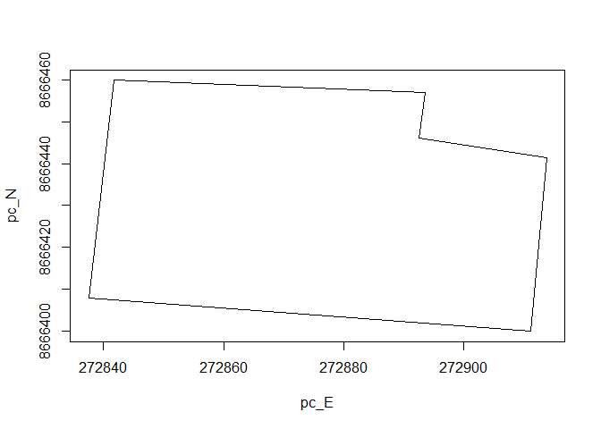
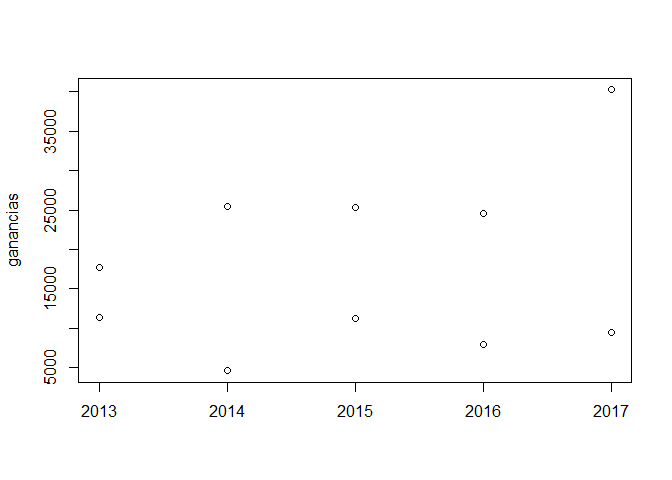

Examen parcial
================
Valeria Arango
10/12/2021

# PARCIAL DE PROGRAMACIÓN

### NOMBRE: Valeria Liz Arango Torres

### Código:20160176

## PARTE 1

### 1.Crear una función que permita calcula el ángulo entre las rectas L1 y L2 teniendo sus pendientes como parámetros. La función debe considerar si estas rectas no se cruzan.

``` r
ang_rectas <- function(m1 ="pendiente L1", m2 = "pendiente L2"){
  vect1 <- atan((m2 - m1)/(1 + m1*m2))
  return(vect1)
}
ang_rectas(1,1/2)
```

    ## [1] -0.3217506

### 2.Crear una función que grafique un pol+igono ingresando un dataframe con sus coordenadas este y norte como parámetros. La función debe aceptar dataframes como unn máxima de 50 registros, realizar la prueba con las siguiente coordenadas.

``` r
vect2 <- c("A","B","C","D","E","F")
pc_este <-c(272841.7,272893.6,272892.5,272913.8,272911.2,272837.5)
pc_norte <-c(8666459.9,8666456.9,8666446.1,8666441.5,8666399.9,8666407.9)
dataframe1 <-data.frame(vect2,pc_este,pc_norte)

p_hexahedro <-function(df){
  pc_E <-c(df[,"pc_este"],df[1,2])
  pc_N <-c(df[,"pc_norte"],df[1,3])
  return(plot(pc_E, pc_N,type="l"))
}
p_hexahedro(dataframe1)
```

<!-- -->

## PARTE 2

### 1.El data set de Kc_house_data tiene la información de ventas de viviendas entre mayo del 2014 y 2015 en el condado de King, estado de Washington, EE.UU. Esta base es empleada para ejercicios de regresión. La columna price tiene los precios de las viviendas y las demás son características de las casas en venta.

``` r
Kc_house<- read.csv("C:/Users/arang/Downloads/kc_house_data.csv")
Kc_house
```

    ##              id            date   price bedrooms bathrooms sqft_living sqft_lot
    ## 1    7129300520 20141013T000000  221900        3      1.00        1180     5650
    ## 2    6414100192 20141209T000000  538000        3      2.25        2570     7242
    ## 3    5631500400 20150225T000000  180000        2      1.00         770    10000
    ## 4    2487200875 20141209T000000  604000        4      3.00        1960     5000
    ## 5    1954400510 20150218T000000  510000        3      2.00        1680     8080
    ## 6    7237550310 20140512T000000 1225000        4      4.50        5420   101930
    ## 7    1321400060 20140627T000000  257500        3      2.25        1715     6819
    ## 8    2008000270 20150115T000000  291850        3      1.50        1060     9711
    ## 9    2414600126 20150415T000000  229500        3      1.00        1780     7470
    ## 10   3793500160 20150312T000000  323000        3      2.50        1890     6560
    ## 11   1736800520 20150403T000000  662500        3      2.50        3560     9796
    ## 12   9212900260 20140527T000000  468000        2      1.00        1160     6000
    ## 13    114101516 20140528T000000  310000        3      1.00        1430    19901
    ## 14   6054650070 20141007T000000  400000        3      1.75        1370     9680
    ## 15   1175000570 20150312T000000  530000        5      2.00        1810     4850
    ## 16   9297300055 20150124T000000  650000        4      3.00        2950     5000
    ## 17   1875500060 20140731T000000  395000        3      2.00        1890    14040
    ## 18   6865200140 20140529T000000  485000        4      1.00        1600     4300
    ## 19     16000397 20141205T000000  189000        2      1.00        1200     9850
    ## 20   7983200060 20150424T000000  230000        3      1.00        1250     9774
    ## 21   6300500875 20140514T000000  385000        4      1.75        1620     4980
    ## 22   2524049179 20140826T000000 2000000        3      2.75        3050    44867
    ## 23   7137970340 20140703T000000  285000        5      2.50        2270     6300
    ## 24   8091400200 20140516T000000  252700        2      1.50        1070     9643
    ## 25   3814700200 20141120T000000  329000        3      2.25        2450     6500
    ## 26   1202000200 20141103T000000  233000        3      2.00        1710     4697
    ## 27   1794500383 20140626T000000  937000        3      1.75        2450     2691
    ## 28   3303700376 20141201T000000  667000        3      1.00        1400     1581
    ## 29   5101402488 20140624T000000  438000        3      1.75        1520     6380
    ## 30   1873100390 20150302T000000  719000        4      2.50        2570     7173
    ## 31   8562750320 20141110T000000  580500        3      2.50        2320     3980
    ## 32   2426039314 20141201T000000  280000        2      1.50        1190     1265
    ## 33    461000390 20140624T000000  687500        4      1.75        2330     5000
    ## 34   7589200193 20141110T000000  535000        3      1.00        1090     3000
    ## 35   7955080270 20141203T000000  322500        4      2.75        2060     6659
    ## 36   9547205180 20140613T000000  696000        3      2.50        2300     3060
    ## 37   9435300030 20140528T000000  550000        4      1.00        1660    34848
    ## 38   2768000400 20141230T000000  640000        4      2.00        2360     6000
    ## 39   7895500070 20150213T000000  240000        4      1.00        1220     8075
    ## 40   2078500320 20140620T000000  605000        4      2.50        2620     7553
    ## 41   5547700270 20140715T000000  625000        4      2.50        2570     5520
    ## 42   7766200013 20140811T000000  775000        4      2.25        4220    24186
    ## 43   7203220400 20140707T000000  861990        5      2.75        3595     5639
    ## 44   9270200160 20141028T000000  685000        3      1.00        1570     2280
    ## 45   1432701230 20140729T000000  309000        3      1.00        1280     9656
    ## 46   8035350320 20140718T000000  488000        3      2.50        3160    13603
    ## 47   8945200830 20150325T000000  210490        3      1.00         990     8528
    ## 48   4178300310 20140716T000000  785000        4      2.50        2290    13416
    ## 49   9215400105 20150428T000000  450000        3      1.75        1250     5963
    ## 50    822039084 20150311T000000 1350000        3      2.50        2753    65005
    ## 51   5245600105 20140916T000000  228000        3      1.00        1190     9199
    ## 52   7231300125 20150217T000000  345000        5      2.50        3150     9134
    ## 53   7518505990 20141231T000000  600000        3      1.75        1410     4080
    ## 54   3626039271 20150205T000000  585000        2      1.75        1980     8550
    ## 55   4217401195 20150303T000000  920000        5      2.25        2730     6000
    ## 56   9822700295 20140512T000000  885000        4      2.50        2830     5000
    ## 57   9478500640 20140819T000000  292500        4      2.50        2250     4495
    ## 58   2799800710 20150407T000000  301000        3      2.50        2420     4750
    ## 59   7922800400 20140827T000000  951000        5      3.25        3250    14342
    ## 60   8079040320 20150223T000000  430000        4      3.00        1850     9976
    ## 61   1516000055 20141210T000000  650000        3      2.25        2150    21235
    ## 62   9558200045 20140828T000000  289000        3      1.75        1260     8400
    ## 63   5072410070 20141021T000000  505000        3      1.75        2519     8690
    ## 64   9528102996 20141207T000000  549000        3      1.75        1540     1044
    ## 65   1189001180 20140603T000000  425000        3      2.25        1660     6000
    ## 66   3253500160 20141120T000000  317625        3      2.75        2770     3809
    ## 67   3394100030 20140909T000000  975000        4      2.50        2720    11049
    ## 68   3717000160 20141009T000000  287000        4      2.50        2240     4648
    ## 69   1274500060 20140825T000000  204000        3      1.00        1000    12070
    ## 70   1802000060 20140612T000000 1325000        5      2.25        3200    20158
    ## 71   1525059190 20140912T000000 1040000        5      3.25        4770    50094
    ## 72   1049000060 20150105T000000  325000        3      2.00        1260     5612
    ## 73   8820901275 20140610T000000  571000        4      2.00        2750     7807
    ## 74   5416510140 20140710T000000  360000        4      2.50        2380     5000
    ## 75   3444100400 20150316T000000  349000        3      1.75        1790    50529
    ## 76   3276920270 20141105T000000  832500        4      4.00        3430    35102
    ## 77   4036801170 20141013T000000  380000        4      1.75        1760     7300
    ## 78   2391600320 20150420T000000  480000        3      1.00        1040     5060
    ## 79   6300000287 20140609T000000  410000        3      1.00        1410     5060
    ## 80   1531000030 20150323T000000  720000        4      2.50        3450    39683
    ## 81   5104520400 20141202T000000  390000        3      2.50        2350     5100
    ## 82   7437100340 20141222T000000  360000        4      2.50        1900     5889
    ## 83   9418400240 20141028T000000  355000        2      1.00        2020     6720
    ## 84   1523059105 20150128T000000  356000        3      1.50        1680     8712
    ## 85   1133000671 20140602T000000  315000        3      1.00         960     6634
    ## 86   4232902595 20141114T000000  940000        3      1.50        2140     3600
    ## 87   2599001200 20141103T000000  305000        5      2.25        2660     8400
    ## 88   3342103156 20140618T000000  461000        3      3.25        2770     6278
    ## 89   1332700270 20140519T000000  215000        2      2.25        1610     2040
    ## 90   3869900162 20140904T000000  335000        2      1.75        1030     1066
    ## 91   2791500270 20140522T000000  243500        4      2.50        1980     7403
    ## 92   5036300431 20150311T000000 1099880        5      2.75        3520     6353
    ## 93   4168000060 20150226T000000  153000        3      1.00        1200    10500
    ## 94   6021501535 20140725T000000  430000        3      1.50        1580     5000
    ## 95   6021501535 20141223T000000  700000        3      1.50        1580     5000
    ## 96   1483300570 20140908T000000  905000        4      2.50        3300    10250
    ## 97   3422049190 20150330T000000  247500        3      1.75        1960    15681
    ## 98   1099611230 20140912T000000  199000        4      1.50        1160     6400
    ## 99    722079104 20140711T000000  314000        3      1.75        1810    41800
    ## 100  7338200240 20140516T000000  437500        3      2.50        2320    36847
    ## 101  1952200240 20140611T000000  850830        3      2.50        2070    13241
    ## 102  5200100125 20141027T000000  555000        3      2.00        1980     3478
    ## 103  7214720075 20141212T000000  699950        3      2.25        2190   107593
    ## 104  2450000295 20141007T000000 1088000        3      2.50        2920     8113
    ## 105  6197800045 20140924T000000  290000        3      1.00        1210    33919
    ## 106  1328310370 20150402T000000  375000        3      2.50        2340    10005
    ## 107   546000875 20140523T000000  460000        3      1.00        1670     4005
    ## 108  3530510041 20140723T000000  188500        2      1.75        1240     2493
    ## 109  1853000400 20150305T000000  680000        4      2.50        3140    28037
    ## 110  3134100116 20140827T000000  470000        5      1.75        2030    12342
    ## 111  9545230140 20140725T000000  597750        4      2.50        2310     9624
    ## 112  3362400511 20150304T000000  570000        3      1.75        1260     3328
    ## 113  2525310310 20140916T000000  272500        3      1.75        1540    12600
    ## 114  6126500060 20141124T000000  329950        3      1.75        2080     5969
    ## 115  8961960160 20141028T000000  480000        4      2.50        3230    16171
    ## 116  3626039325 20141121T000000  740500        3      3.50        4380     6350
    ## 117  3362400431 20140626T000000  518500        3      3.50        1590     1102
    ## 118  4060000240 20140623T000000  205425        2      1.00         880     6780
    ## 119  3454800060 20150108T000000  171800        4      2.00        1570     9600
    ## 120  1695900060 20150511T000000  535000        4      1.00        1610     2982
    ## 121  7278700070 20150102T000000  660000        3      2.50        2400     6474
    ## 122  6675500070 20141119T000000  391500        3      2.00        1450     9132
    ## 123  3626039187 20150406T000000  395000        2      1.00         770     6000
    ## 124  3524049083 20141104T000000  445000        4      1.75        2100     4400
    ## 125  3275860240 20140618T000000  770000        3      2.25        2910    10204
    ## 126  4389200955 20150302T000000 1450000        4      2.75        2750    17789
    ## 127  4058801670 20140717T000000  445000        3      2.25        2100     8201
    ## 128  8732020310 20140717T000000  260000        4      2.25        2160     8811
    ## 129  2331300505 20140613T000000  822500        5      3.50        2320     4960
    ## 130  7853210060 20150406T000000  430000        4      2.50        2070     4310
    ## 131  3668000070 20150105T000000  212000        3      1.75        1060     7875
    ## 132  9545240070 20150428T000000  660500        4      2.25        2010     9603
    ## 133  1243100136 20140612T000000  784000        3      3.50        3950   111078
    ## 134  8929000270 20140512T000000  453246        3      2.50        2010     2287
    ## 135  2767602356 20150126T000000  675000        4      3.50        2140     2278
    ## 136   921049315 20140813T000000  199000        3      1.75        1320    17390
    ## 137  3655000070 20140805T000000  220000        4      1.75        2020     7840
    ## 138  4027700812 20140529T000000  452000        4      2.25        2590    10002
    ## 139  3992700335 20140707T000000  382500        2      1.00        1190     4440
    ## 140  2767603505 20140507T000000  519950        3      2.25        1170     1249
    ## 141  4232901525 20140627T000000  665000        2      1.00        1110     3200
    ## 142  1777500060 20140708T000000  527700        5      2.50        2820     9375
    ## 143  1432900240 20150508T000000  205000        3      1.00        1610     8579
    ## 144  6140100875 20150415T000000  420000        3      1.00        1060     8097
    ## 145  6071600370 20150227T000000  500000        4      2.25        2030     8517
    ## 146  1526069017 20141203T000000  921500        4      2.50        3670   315374
    ## 147   809001525 20140625T000000  890000        4      1.00        2550     4000
    ## 148  3224079105 20140806T000000  430000        2      2.50        2420    60984
    ## 149  8075400570 20141030T000000  258000        5      2.00        2260    12500
    ## 150  1994200024 20141104T000000  511000        3      1.00        1430     3455
    ## 151  3362900810 20140820T000000  532170        3      2.00        1360     3090
    ## 152  1324300398 20150409T000000  560000        3      1.00        1110     5000
    ## 153   537000445 20150331T000000  282950        3      1.00        1250     8200
    ## 154  7855801670 20150401T000000 2250000        4      3.25        5180    19850
    ## 155  7920100045 20140516T000000  350000        1      1.00         700     5100
    ## 156  8960000030 20140728T000000  215000        3      1.00        1180     7669
    ## 157  6388930390 20141120T000000  650000        5      3.50        3960    25245
    ## 158  8731900200 20140807T000000  320000        4      2.75        2640     7500
    ## 159  8029200135 20141113T000000  247000        3      2.00        1270     7198
    ## 160  1081200350 20141003T000000  320000        4      1.75        1760    11180
    ## 161    84000105 20140507T000000  255000        5      2.25        2060     8632
    ## 162  3756500060 20150309T000000  438000        3      1.75        1780     9660
    ## 163  7215720160 20150304T000000  900000        3      2.50        3400    16603
    ## 164  3574800520 20140620T000000  441000        3      2.75        1910     7280
    ## 165  2617300160 20140812T000000  420000        3      2.00        2020    38332
    ## 166  2558660270 20141208T000000  370000        3      1.75        1580     7000
    ## 167  2009000370 20150219T000000  269950        2      1.75        1340     7250
    ## 168  1836980160 20150324T000000  807100        4      2.50        2680     4499
    ## 169  3261020370 20140605T000000  653000        3      2.50        2680     9750
    ## 170  1755700060 20140611T000000  371500        3      2.00        1370     8336
    ## 171  4330600435 20150316T000000  284000        3      1.75        1560    21000
    ## 172  9542800700 20150102T000000  272000        3      1.75        2160     7140
    ## 173  1999700045 20140502T000000  313000        3      1.50        1340     7912
    ## 174  1762600070 20150116T000000  917500        4      2.50        3880    35003
    ## 175  1687900520 20140929T000000  673000        4      2.25        2590     8190
    ## 176  7234600798 20150210T000000  425000        3      2.50        1120     1100
    ## 177  3881900445 20140709T000000  399950        5      2.75        1970     5400
    ## 178  2254502445 20140530T000000  385000        3      1.00        1220     4800
    ## 179  5437810320 20141117T000000  269950        3      1.50        1950     7560
    ## 180  9158100075 20150107T000000  330000        2      1.00        1350     8220
    ## 181  3830630310 20140725T000000  260000        3      2.50        1670     5797
    ## 182  8123100045 20150414T000000  470000        4      3.00        2380     5125
    ## 183  3127200041 20140613T000000  589000        4      3.00        2440     9600
    ## 184  6661200320 20140723T000000  163500        2      1.50        1050     3419
    ## 185    11510310 20140905T000000  835000        4      2.75        3130    13412
    ## 186   825059270 20141121T000000 1095000        5      3.00        4090    12850
    ## 187  8731951370 20150415T000000  269000        4      1.75        1490    10000
    ## 188  1954440060 20140505T000000  560000        3      2.50        1900     8744
    ## 189  2264500350 20150418T000000  615000        4      1.00        1330     2400
    ## 190  1115810060 20141205T000000  585188        3      2.25        2230    10026
    ## 191  9477200200 20140818T000000  305000        3      1.75        1650     9480
    ## 192  1432600560 20141105T000000  166950        3      1.00        1190     8820
    ## 193  2287000060 20140912T000000  799000        3      2.50        2140     9897
    ## 194  3663500060 20140625T000000  400000        3      2.50        2180     7508
    ## 195  3996900125 20141201T000000  230000        3      1.00        1060    10228
    ## 196  7796450200 20140515T000000  256883        3      2.50        1690     5025
    ## 197  7549802535 20141111T000000  423000        4      2.00        1970     6480
    ## 198  3278600320 20140723T000000  465000        3      2.50        2150     4084
    ## 199  2824079053 20150113T000000  440000        3      2.50        1910    66211
    ## 200  1222069094 20141014T000000  385000        3      1.75        1350   155073
    ## 201  3542300060 20150311T000000  210000        3      1.00         860    11725
    ## 202  2222059065 20141112T000000  297000        3      2.50        1940    14952
    ## 203  7551300060 20140716T000000  470000        3      1.00        1010     5000
    ## 204   100600550 20140804T000000  226500        3      1.50        1300     7370
    ## 205  3211100860 20150303T000000  274250        3      1.00         910     8450
    ## 206  3456000310 20140804T000000  840000        4      1.75        2480    11010
    ## 207  9526600140 20140919T000000  677900        3      2.50        2440     4587
    ## 208  7465900060 20150205T000000  425000        3      1.00        1010     5864
    ## 209  1222000055 20141123T000000  180250        2      0.75         900     9600
    ## 210  6300000550 20140717T000000  464000        6      3.00        2300     3404
    ## 211  2310030510 20150422T000000  320000        4      2.25        1550     7579
    ## 212  1025049114 20140717T000000  625504        3      2.25        1270     1566
    ## 213  8677300550 20140515T000000  592500        4      2.50        2240    12032
    ## 214  4014400292 20150114T000000  465000        3      2.50        2714    17936
    ## 215  1102000196 20140527T000000  477000        4      2.75        1720     6270
    ## 216   257000138 20150115T000000  280000        2      1.00         850    16400
    ## 217    46100204 20150221T000000 1505000        5      3.00        3300    33474
    ## 218  1909600046 20140703T000000  445838        3      2.50        2250     5692
    ## 219  1250202145 20140828T000000 1072000        2      2.25        3900    14864
    ## 220  7611200125 20141023T000000  467000        2      1.50        1320    10800
    ## 221  5611500140 20140822T000000  686000        4      2.50        2760     6440
    ## 222  7138000260 20140605T000000  279950        3      2.00        1750     9750
    ## 223   626059335 20140904T000000  527000        4      2.25        2330    19436
    ## 224  1922059282 20140918T000000  325000        3      2.25        2220    16020
    ## 225   705700390 20140903T000000  328000        3      2.25        2020     8379
    ## 226  7454001200 20140604T000000  390000        3      2.25        1250     7500
    ## 227  8682281200 20150309T000000  479950        2      2.00        1510     6516
    ## 228  7972000200 20140529T000000  264950        4      2.25        1720     9753
    ## 229   722059070 20150115T000000  235000        3      1.00        1430    15246
    ## 230  7202340400 20150303T000000  516500        3      2.50        1480     4729
    ## 231  8096000060 20150413T000000  655000        2      1.75        1450    15798
    ## 232  2424000060 20140616T000000  500000        4      2.75        2280    15347
    ## 233  9264902050 20141121T000000  315000        6      2.75        2940     7350
    ## 234   943100260 20141120T000000  213000        2      1.00        1000    10200
    ## 235  3677400445 20140902T000000  475000        3      1.50        2480     5280
    ## 236  1762600320 20140610T000000 1025000        5      4.00        3760    28040
    ## 237  4058000060 20150409T000000  416000        3      2.00        2220    94300
    ## 238  7228500560 20150320T000000  410000        4      1.00        1970     4740
    ## 239   326069104 20140701T000000  800000        3      3.50        3830   221284
    ## 240  5152100060 20140529T000000  472000        6      2.50        4410    14034
    ## 241  3584000310 20141208T000000  225000        3      1.75        1430     8505
    ## 242  8150100045 20141001T000000  210000        2      1.00         830     6000
    ## 243  1868901275 20150127T000000  455000        2      1.00        1430     5000
    ## 244  6131600075 20150427T000000  225000        3      1.00        1300     8316
    ## 245  9468200125 20140826T000000  480000        2      1.00        1030     3060
    ## 246  8029510030 20150212T000000  363000        3      2.50        2740    11872
    ## 247  2025069065 20140929T000000 2400000        4      2.50        3650     8354
    ## 248  7899800890 20150226T000000  181000        2      1.50         720     5120
    ## 249  3021059276 20150314T000000  250000        4      2.00        2010     7312
    ## 250  3797001895 20150422T000000  481000        3      1.75        1560     3000
    ## 251  3832710960 20140923T000000  260000        3      2.00        1810     7209
    ## 252  1310430400 20140513T000000  455000        4      2.50        3360     7685
    ## 253  1422300030 20150401T000000  415000        3      2.25        1510    36224
    ## 254  1105000588 20150421T000000  349500        3      1.00        1400     3538
    ## 255  3830630060 20140929T000000  245000        3      2.50        1730     7442
    ## 256  5101404898 20140519T000000  592500        2      2.00        1420     9191
    ## 257  7972601890 20141020T000000  385000        4      1.75        2360     7620
    ## 258  5127001620 20150211T000000  315000        3      1.75        1580    11455
    ## 259  9407100800 20141124T000000  255000        3      1.00        1230    10170
    ## 260  1873100060 20140829T000000  693000        4      2.50        2460     4425
    ## 261  8722101360 20141202T000000  780000        3      1.00        1660     4400
    ## 262  8644000060 20141024T000000  237000        3      1.75        1270     8470
    ## 263  3325069129 20141216T000000  525000        3      2.25        2100    40510
    ## 264  1400300055 20150428T000000  425000        2      1.00         770     5040
    ## 265  2123039032 20141027T000000  369900        1      0.75         760    10079
    ## 266  8078560140 20140519T000000  290000        4      2.50        1700     7280
    ## 267  3438500192 20140929T000000  285000        3      1.00        1120    10701
    ## 268  7974200510 20140814T000000  415000        2      1.00        1070     4500
    ## 269  2557000400 20150409T000000  272500        3      2.50        2070     9900
    ## 270  7960900060 20150504T000000 2900000        4      3.25        5050    20100
    ## 271  4054500390 20141007T000000 1365000        4      4.75        5310    57346
    ## 272  6378500125 20150501T000000  436000        2      1.00        1040     7538
    ## 273  1745100140 20141017T000000  210000        3      1.00        1700    11390
    ## 274  2976800796 20140925T000000  236000        3      1.00        1300     5898
    ## 275  4235400186 20141124T000000  331000        3      1.75        1080     1306
    ## 276  4215100060 20150320T000000  365000        3      2.50        2653     4510
    ## 277  9189700045 20150127T000000  450000        3      2.00        2290    16258
    ## 278  1126049053 20141113T000000  770000        4      2.75        3820    26300
    ## 279  2022069200 20150505T000000  455000        4      2.50        2210    49375
    ## 280  9412900055 20150505T000000  405000        3      1.75        2390     6000
    ## 281  1722059235 20140703T000000  304900        4      1.75        2600    11325
    ## 282  6874200960 20150227T000000  170000        2      1.00         860     5265
    ## 283  7424700045 20150513T000000 2050000        5      3.00        3830     8480
    ## 284  7202360350 20140630T000000  780000        4      2.50        3500     7048
    ## 285  5634500392 20150410T000000  330000        3      3.00        2420    13959
    ## 286  1509500060 20140905T000000  370000        4      2.50        2720     8666
    ## 287  7214810350 20141017T000000  467000        5      2.25        2500    13500
    ## 288  6647200060 20150209T000000  405000        3      1.75        1670     6720
    ## 289  9552700140 20140702T000000  675000        5      2.25        2900    10300
    ## 290  2200500350 20140812T000000  500000        2      1.00        1640    14100
    ## 291  6113400046 20140723T000000  389999        4      2.50        1890    15770
    ## 292  6619910140 20150224T000000  630000        4      1.75        2950     9025
    ## 293  1115450240 20141022T000000  360000        4      2.50        2160     9528
    ## 294  6073240060 20141002T000000  580000        4      3.00        3280    11060
    ## 295  9297300045 20140709T000000  550000        3      2.00        1970     4166
    ## 296  9510920070 20140710T000000  879000        4      2.50        3360    22111
    ## 297  5468730030 20140822T000000  265000        3      2.00        1320     8959
    ## 298  8079030390 20150304T000000  446500        3      2.50        2650     7286
    ## 299   600000152 20140602T000000  404000        3      1.50        2030     8880
    ## 300  1840000030 20140529T000000  267500        3      1.75        1590    11914
    ## 301  3225069065 20140624T000000 3075000        4      5.00        4550    18641
    ## 302  3260800030 20140811T000000  335000        3      2.50        2440     7632
    ## 303  2747100024 20140619T000000  576000        3      2.50        1940     9000
    ## 304  5104530560 20150401T000000  208633        3      2.50        2040     3810
    ## 305  4330600350 20150115T000000  315000        3      2.25        2200     8750
    ## 306  5016001535 20150217T000000  725000        3      1.75        1920     3300
    ## 307  7280300196 20150403T000000  550000        4      2.75        1800     7750
    ## 308  8651520400 20140612T000000  610750        4      2.25        2180     7297
    ## 309  7171200445 20150228T000000  550700        2      1.00        1010     5000
    ## 310  3204800200 20150108T000000  665000        4      2.75        3320    10574
    ## 311  3416600800 20150209T000000  834000        4      2.50        2370     4000
    ## 312  7994700030 20141023T000000  201000        5      1.75        1660    78408
    ## 313  1860600135 20140502T000000 2384000        5      2.50        3650     9050
    ## 314  4139480200 20140618T000000 1384000        4      3.25        4290    12103
    ## 315  4139480200 20141209T000000 1400000        4      3.25        4290    12103
    ## 316  1328320800 20141105T000000  305000        4      2.25        1950     7700
    ## 317  7771300125 20150408T000000  487000        3      2.00        2590    14052
    ## 318  3422059208 20150511T000000  390000        3      2.50        1930    64904
    ## 319  9521101455 20140723T000000  548000        2      1.00        1470     3864
    ## 320  4337000335 20141122T000000  268750        4      1.00         800     8775
    ## 321   325059286 20140513T000000  819900        5      2.75        3150     7119
    ## 322  2597650240 20141023T000000  520000        3      2.25        2030    16200
    ## 323  3353400435 20140721T000000  230000        3      2.00        1450    11204
    ## 324  7972000240 20150202T000000  240000        3      1.75        1510    10248
    ## 325  7520000520 20140905T000000  232000        2      1.00        1240    12092
    ## 326  7520000520 20150311T000000  240500        2      1.00        1240    12092
    ## 327  3530210260 20141027T000000  274975        3      2.50        3030    45004
    ## 328  1959700550 20140905T000000  740000        4      2.00        2050     4400
    ## 329  1665400045 20150428T000000  186375        3      1.00        1000     7636
    ## 330  9542850320 20140725T000000  790000        3      2.25        2370    10289
    ## 331  3179100060 20140916T000000  880000        4      3.50        2800     6750
    ## 332  2946001550 20150416T000000  279000        6      1.75        2240    11180
    ## 333  8078490390 20140729T000000  295000        3      2.00        1810    10530
    ## 334  9550201550 20150408T000000  640000        2      1.00        1070     5000
    ## 335   191100045 20140703T000000  940000        4      2.00        2490     9525
    ## 336  5009600070 20141007T000000  260000        4      2.50        1960     5238
    ## 337   200350070 20140602T000000  559900        3      2.75        2930     5569
    ## 338  2877103726 20140722T000000  791500        4      2.00        1510     3500
    ## 339   405100295 20140826T000000  265000        3      1.75        1420     8250
    ## 340  4268200055 20150501T000000  245000        3      1.75        1740    11547
    ## 341  3126069068 20150424T000000  485000        4      1.75        2560    43995
    ## 342  1115300070 20141106T000000  684000        4      3.50        3040     8414
    ## 343  6414100671 20140909T000000  425000        3      1.75        2500     6840
    ## 344  7004200060 20141017T000000  309600        4      1.75        1275    20000
    ## 345  7852110140 20140718T000000  552250        4      2.50        2580     5823
    ## 346  3969300030 20140723T000000  165000        4      1.00        1000     7134
    ## 347  3969300030 20141229T000000  239900        4      1.00        1000     7134
    ## 348  4048400070 20141205T000000  320000        2      1.00        1070    32633
    ## 349   808000070 20141021T000000  206600        3      2.00        1390    13464
    ## 350  7374200030 20150416T000000  387000        4      1.75        2500     7690
    ## 351  7325600160 20140604T000000  299000        1      0.75         560    12120
    ## 352  2757000030 20140922T000000  855000        4      2.75        2270    10460
    ## 353   616000140 20150126T000000  315000        3      1.00        1900    14400
    ## 354  3363900111 20141203T000000  437500        2      1.00         990     3120
    ## 355  9262800171 20150324T000000  252000        4      1.50        1550    19800
    ## 356  6607000126 20140604T000000  375000        4      1.75        2200     7475
    ## 357  5416510830 20140806T000000  300000        4      2.50        1910     4862
    ## 358  2201500030 20141006T000000  420000        4      1.00        1750     9600
    ## 359   325059171 20140505T000000  900000        3      1.00        1330    77972
    ## 360   952003285 20140805T000000  679900        3      2.50        2440     5750
    ## 361  3211290370 20140605T000000  463000        3      2.50        1640    29970
    ## 362  1072010350 20140828T000000  380000        5      2.50        2760    11340
    ## 363  8856950070 20141210T000000  329500        4      2.50        1820     7912
    ## 364   925059078 20140819T000000  604950        3      2.50        2110     5608
    ## 365  7855801090 20140917T000000  795000        5      2.50        3040     9570
    ## 366   723099065 20150130T000000  465000        3      2.00        1840    40438
    ## 367  6116500075 20150326T000000  673000        4      2.50        2990    10400
    ## 368  1118500030 20141001T000000  810000        4      2.50        3520    15420
    ## 369   424069250 20150423T000000  785000        4      2.75        2440    69415
    ## 370  3291800710 20141120T000000  338000        4      3.00        2090     7500
    ## 371  6838700060 20141204T000000  280000        3      2.25        1430     7222
    ## 372  2231500030 20141001T000000  315000        4      2.25        2180    10754
    ## 373  2231500030 20150324T000000  530000        4      2.25        2180    10754
    ## 374  7683900200 20141223T000000  380000        5      3.00        3450     9914
    ## 375  8155830060 20140811T000000  297000        3      2.25        1450     7562
    ## 376    98020310 20140520T000000  730000        4      2.50        3230     7331
    ## 377  9423400140 20140609T000000  450000        3      1.75        1640    13500
    ## 378  1545804860 20141027T000000  275000        3      3.00        1590     7750
    ## 379  2883200160 20150429T000000  595000        4      2.00        2020     2849
    ## 380  7132300695 20150421T000000  435000        3      1.50        1300     3348
    ## 381  1726059053 20140916T000000  270000        2      1.50        1380   209959
    ## 382   624111000 20140805T000000  950000        3      3.00        4040    14338
    ## 383   808300310 20150313T000000  389000        4      2.25        2130     5337
    ## 384  8563040160 20150121T000000  560000        4      2.25        2550     7800
    ## 385   713500030 20140728T000000 1350000        5      3.50        4800    14984
    ## 386  8651600160 20141111T000000  799000        4      2.25        2510    11585
    ## 387  9517200030 20140625T000000  365500        3      2.00        1410     9600
    ## 388  2460700700 20140515T000000  252350        3      2.00        1650     7352
    ## 389  1223039290 20140905T000000  403950        4      2.50        2120    13780
    ## 390  2890100060 20140801T000000  385000        4      1.50        2040    10726
    ## 391  7972600860 20141210T000000  345000        4      1.00        1550     7620
    ## 392  8857320070 20140917T000000  490000        3      2.75        1980     3128
    ## 393  4047200695 20140618T000000  330000        3      2.50        1600    26977
    ## 394  1653500070 20140512T000000  927000        4      2.75        3300    12090
    ## 395  1923000030 20140728T000000 1118000        4      2.50        3840    16619
    ## 396  3649100320 20150430T000000  330000        2      1.00        1220    10000
    ## 397  7375300160 20150309T000000  530000        5      2.25        2720     8800
    ## 398  5175800060 20140623T000000  365000        4      2.00        1940    25600
    ## 399  1604601375 20140619T000000  378750        3      2.50        2160     3000
    ## 400  2473251090 20140619T000000  269900        4      1.75        1530     8750
    ## 401  9126100861 20150306T000000  557000        3      3.50        1710     2096
    ## 402  3420069065 20140825T000000  360000        4      1.75        3730    16980
    ## 403  6021501685 20150422T000000  352000        2      1.00         940     5000
    ## 404  1151100070 20150224T000000  437000        3      2.50        1750    22357
    ## 405  8856950240 20140618T000000  322500        4      2.50        1820     6753
    ## 406  9385200055 20140912T000000  650000        3      3.25        1510     2000
    ## 407  7821200390 20140806T000000  450000        3      2.00        1290     1213
    ## 408  8078520310 20150417T000000  278500        3      2.00        1570     5250
    ## 409  1565950030 20150427T000000  364950        4      2.50        1930     6957
    ## 410  1560930070 20140911T000000  840000        4      3.50        2840    40139
    ## 411  6700400140 20150318T000000  268000        3      2.50        1550     8134
    ## 412  2422029094 20140716T000000  517534        2      1.00         833   143947
    ## 413  1774220160 20141104T000000  632925        3      2.50        2990    32239
    ## 414  1525200060 20140723T000000  577500        3      2.50        2000     7251
    ## 415  1678400105 20150212T000000  339000        4      1.50        2390     7480
    ## 416  3426059070 20140909T000000  570000        3      1.75        2910    37461
    ## 417   824079032 20140626T000000  563500        4      1.75        2085   174240
    ## 418  2697100140 20150105T000000  423000        4      2.25        2200     9351
    ## 419  8724300030 20141223T000000  355000        3      2.25        1860     5028
    ## 420  8678500060 20140710T000000 1550000        5      4.25        6070   171626
    ## 421   625049299 20141203T000000  482000        2      1.00         950     3960
    ## 422  6073200075 20140730T000000  625000        3      1.75        1600     9135
    ## 423  6388900710 20141219T000000  538000        3      2.50        2250    11632
    ## 424  1442860160 20150107T000000  380000        3      2.50        2280    10255
    ## 425  7942600310 20140717T000000  375000        2      1.00         940     5120
    ## 426  1545808560 20150403T000000  245000        3      2.50        1530     8500
    ## 427   936000060 20141114T000000  310000        5      1.75        2190    27260
    ## 428  9808650060 20150225T000000 1300000        3      2.00        2350    15021
    ## 429  3754700160 20140506T000000  397000        4      2.00        1440     7680
    ## 430   305500140 20150512T000000  365000        3      2.50        2200     4052
    ## 431  5468750060 20141028T000000  328500        4      3.00        2290     8250
    ## 432  2944010240 20140908T000000  988000        4      3.00        4040    19700
    ## 433  3454000060 20140722T000000 1000000        4      2.50        2610     3277
    ## 434   646910160 20140903T000000  237000        3      2.50        1490     2138
    ## 435  8564950390 20140919T000000  525000        4      2.50        2450     5280
    ## 436  2268400350 20140916T000000  749000        4      2.50        1710     9627
    ## 437  7504101040 20140821T000000  722500        5      2.50        4870    11800
    ## 438    11500890 20150312T000000  843000        3      2.50        3130     8750
    ## 439  9528102772 20140708T000000  438000        2      2.00        1270     1372
    ## 440   284000223 20140916T000000  578000        3      1.75        2120    10875
    ## 441  3353401710 20140923T000000  227950        3      1.50        1670     8230
    ## 442  8159610030 20140722T000000  196000        3      2.25        2070    11576
    ## 443  3179100435 20140715T000000  641000        2      1.00        1420     5332
    ## 444   822079033 20150422T000000  350000        3      1.50        1250   219978
    ## 445  8857600960 20140819T000000  205000        3      1.00         940     7980
    ## 446  1774000200 20141202T000000  400000        3      1.75        1920     9102
    ## 447  2024069128 20141110T000000 1030000        3      2.50        3545     9816
    ## 448  1049010390 20150319T000000  505000        3      2.00        1260     5460
    ## 449  7905370390 20141009T000000  475000        5      2.50        2340     7200
    ## 450  4140090240 20141105T000000  520000        3      2.25        2590     9263
    ## 451  4055700030 20150502T000000 1450000        3      4.50        3970    24920
    ## 452  3775300030 20141231T000000  333500        3      1.75        1220     9732
    ## 453  2525300030 20150222T000000  232000        3      1.00        1400    10403
    ## 454  1324059104 20150421T000000  691100        3      2.75        2360    16117
    ## 455  2287000030 20141014T000000  811000        3      1.75        1870     9897
    ## 456  7702010030 20140520T000000  551000        3      2.50        2830     5802
    ## 457  1529200340 20150108T000000  496500        3      2.50        2260     3640
    ## 458  2122039094 20141126T000000  705000        3      3.00        1970    20978
    ## 459  1742800030 20140612T000000  578000        4      2.50        3140     9225
    ## 460  1796360350 20150128T000000  255000        3      1.75        1240     8659
    ## 461  6154500070 20140626T000000 1050000        4      3.50        3450     7832
    ## 462  1843100340 20150305T000000  348000        3      2.25        2570     8491
    ## 463  8944290160 20141104T000000  230000        3      2.00        1510     3413
    ## 464  4166600473 20141209T000000  359500        4      2.25        2390    11250
    ## 465  7282300125 20141112T000000  330000        3      1.00         980     7000
    ## 466  8658300340 20140523T000000   80000        1      0.75         430     5050
    ## 467  2419600075 20141201T000000  465000        3      1.75        1480     6360
    ## 468  2621760350 20141015T000000  325000        4      2.50        1850     7324
    ## 469  1723049270 20150107T000000  340500        3      2.00        2270    28025
    ## 470  4123840310 20150106T000000  342500        3      2.50        1810     5192
    ## 471  2172000075 20140623T000000  290900        2      2.00        1610    17600
    ## 472  8651611170 20150213T000000  868700        3      4.25        3840     6161
    ## 473  8820902200 20141113T000000 1199000        4      2.75        4110     8400
    ## 474  8651610890 20141014T000000 1150000        4      3.25        4190    10259
    ## 475  1853080570 20140811T000000  859900        4      2.75        3390     6298
    ## 476  3629920030 20140808T000000  520000        4      2.25        1890     3006
    ## 477  1604602050 20140711T000000  460000        3      2.50        1610     2527
    ## 478  6844700810 20140901T000000  438924        3      1.50        1050     4590
    ## 479    66000070 20150406T000000  315000        2      1.00         630     6550
    ## 480  6665800030 20140718T000000  590000        4      2.75        2910    10650
    ## 481  2205700350 20141104T000000  378500        4      1.75        1700     8640
    ## 482  5466000030 20140603T000000  328500        3      2.50        1950     8130
    ## 483  6189200125 20150325T000000  849950        3      3.00        2990     9773
    ## 484  9169600135 20141027T000000  525000        3      1.50        1350     6000
    ## 485  2625069070 20150410T000000 1385000        4      3.25        4860   181319
    ## 486  8732131090 20150428T000000  295000        4      2.50        2160     7725
    ## 487  9286000240 20140711T000000 1067000        6      3.50        4860    11793
    ## 488  1895000260 20140721T000000  207950        2      2.00         890     5000
    ## 489  8691370400 20141216T000000  699900        4      2.75        2810     7302
    ## 490  5423010350 20150210T000000 1280000        5      2.50        3400     9500
    ## 491  8562501040 20141120T000000  452000        4      1.50        1580     7350
    ## 492  2475200140 20150205T000000  370000        3      2.00        1680     5036
    ## 493  7942100310 20150127T000000  232000        3      1.75        1300    11230
    ## 494  3760000030 20141030T000000  669950        5      2.50        2820    14062
    ## 495  1727500340 20140614T000000  397500        3      2.00        1510     6710
    ## 496  9828702519 20140512T000000  490000        2      2.50        1230     1391
    ## 497  4432600075 20150128T000000  725000        4      2.00        2110     4140
    ## 498  7806300030 20140917T000000  299000        3      2.75        3080    19635
    ## 499  9274202270 20140818T000000  625000        2      1.50        1490     5750
    ## 500  7852030960 20141106T000000  437500        3      2.50        2120     4500
    ## 501  7852170140 20150510T000000  650000        4      2.50        3180     5438
    ## 502  7518503335 20140519T000000  475000        2      1.00        1490     3825
    ## 503  5467900070 20140502T000000  342000        3      2.00        1930    11947
    ## 504  1245002952 20141015T000000 1197350        4      2.50        2770     7800
    ## 505  8906200070 20150210T000000  280000        3      1.50        1670    11610
    ## 506  5379805885 20140521T000000  240000        2      1.75        1330     7200
    ## 507  2769600560 20140527T000000  529000        3      1.00        1210     3328
    ## 508  9238901420 20150202T000000  442000        3      1.00        1190     5100
    ## 509  5113400431 20140508T000000  615000        2      1.00        1540     6872
    ## 510  3885805665 20140612T000000 1485000        4      3.75        4030    10800
    ## 511  8121200810 20150505T000000  585000        4      1.75        2430     7559
    ## 512  5126310400 20150305T000000  480000        4      2.50        2600     7787
    ## 513  7322910030 20140721T000000 1095000        5      3.50        4410    57063
    ## 514  2827100070 20141105T000000  290000        4      1.00        1330     8184
    ## 515  9276201895 20140820T000000  615000        3      1.75        1900     5000
    ## 516  4402700070 20150311T000000  300000        2      1.00        1100     7680
    ## 517  1922059046 20141029T000000  308000        3      1.00        1980    39150
    ## 518   925059288 20150507T000000  750000        3      2.50        2400     7745
    ## 519  4386700135 20141114T000000 2250000        4      2.25        4760     8036
    ## 520  1923069078 20140805T000000  890000        4      3.25        3180   194278
    ## 521  1432400335 20150325T000000  288000        3      1.00        1190     7560
    ## 522  1180003090 20140906T000000  190000        2      1.00         630     6000
    ## 523   726049331 20150326T000000  515000        5      3.00        2530     5105
    ## 524  3340401555 20141105T000000  235000        4      1.50        1690    11054
    ## 525  7453000070 20140818T000000  275000        2      1.00         940     5000
    ## 526  4348800030 20141121T000000  727500        2      2.00        1240     9119
    ## 527  7202331420 20140620T000000  650000        4      2.50        3040     6587
    ## 528  3225079035 20140618T000000 1600000        6      5.00        6050   230652
    ## 529  6381500700 20141105T000000  365000        4      1.00        1590     7085
    ## 530   339500160 20141008T000000  662000        3      1.75        2500    36947
    ## 531  1545807610 20150429T000000  270500        3      2.50        1780     7848
    ## 532  1843200240 20150505T000000  200000        2      1.50        1360     1898
    ## 533  4403600270 20150224T000000  970000        4      3.25        4740    76230
    ## 534  2008200060 20140624T000000  160000        3      1.50        1010     9600
    ## 535  1521069070 20150218T000000  204000        3      1.00        1040     7405
    ## 536  2459500310 20150218T000000  358000        3      2.25        1610     6655
    ## 537  6204420070 20150501T000000  452000        4      1.75        1570     8268
    ## 538  5694500105 20141204T000000  595000        2      2.00        1510     4000
    ## 539  5466410030 20150410T000000  249000        3      2.00        1360     6082
    ## 540  9485740340 20150310T000000  346900        4      2.50        1970     5106
    ## 541   622049114 20150218T000000 2125000        3      2.50        5403    24069
    ## 542  2270000070 20141030T000000  280000        4      2.50        1560     4350
    ## 543  1310900260 20141013T000000  318888        4      1.75        2320    12000
    ## 544   224069094 20140911T000000  530000        3      2.25        2120    40518
    ## 545  7800800160 20141121T000000  375000        3      2.25        2120    18500
    ## 546  2944000240 20150422T000000  910000        4      2.50        3350    29242
    ## 547  4139400710 20140523T000000  782000        4      2.50        2380     9614
    ## 548  7899800860 20150319T000000  259950        2      2.00        1070      649
    ## 549  2473420140 20140923T000000  315000        4      2.75        2300    18360
    ## 550  5000500055 20140528T000000  215000        2      1.00        1320     8865
    ## 551  4099500935 20140723T000000  705000        3      1.75        2180    10221
    ## 552  1373800295 20141013T000000 1450000        3      3.00        4380     6320
    ## 553  4025300135 20150508T000000  451000        3      1.75        1790     9813
    ## 554  3294700310 20140902T000000  261000        2      1.00         750     8125
    ## 555  8718500075 20141117T000000  396000        3      1.50        1300     8280
    ## 556  4309710240 20140722T000000  725000        4      2.50        2990    29170
    ## 557  5486800070 20140620T000000 1950000        7      3.50        4640    15235
    ## 558   236400320 20140715T000000  238000        4      1.00        1400     7242
    ## 559  4376700570 20150427T000000  750000        6      1.75        2750     9563
    ## 560  8648100200 20141027T000000  331500        4      2.50        2050    10271
    ## 561  3624079046 20141028T000000  460000        4      3.00        2230   108900
    ## 562  1921069084 20140707T000000  404950        4      2.25        2340   217014
    ## 563  6431500140 20141217T000000  880000        3      2.50        2870     5163
    ## 564  2725069050 20140613T000000  863000        4      2.50        4120    22370
    ## 565  5307100060 20141216T000000  638700        3      1.75        2080     9162
    ## 566  7203102050 20140728T000000  435000        3      2.50        1840     5680
    ## 567   561000075 20141231T000000  260000        3      1.00        1180     5350
    ## 568  2436701180 20140814T000000  671500        5      2.75        2160     4000
    ## 569   809002765 20141022T000000  610000        3      1.00        1180     3400
    ## 570  4045500710 20141218T000000  405000        2      0.75        1160    15029
    ## 571  5104510270 20140718T000000  338900        4      2.50        1830     5612
    ## 572    98020350 20150123T000000  720000        4      4.00        3200     7708
    ## 573  1714900060 20150424T000000  442000        5      3.00        2560     5445
    ## 574  1189000030 20140603T000000  650000        5      2.75        2550     5040
    ## 575  2473360060 20150102T000000  263500        3      1.75        1330     9917
    ## 576   222069082 20141217T000000  300000        2      1.00        1220    75794
    ## 577  8669160310 20141209T000000  266000        3      2.50        1805     3402
    ## 578  1526069135 20141211T000000  930000        4      4.00        6050    84942
    ## 579  1088650310 20150127T000000  530000        4      2.50        2320     5493
    ## 580  8945200860 20141211T000000  180000        3      1.00        1384     8960
    ## 581  7853240200 20140516T000000  619000        3      2.50        2720     6439
    ## 582  7511800070 20140821T000000  264000        3      1.50        1820    10608
    ## 583  2998800125 20140701T000000  730000        2      2.25        2130     4920
    ## 584  3876300310 20141022T000000  439000        4      2.25        2060    10070
    ## 585  5419800510 20141117T000000  268500        4      1.75        1420     7500
    ## 586   192460060 20140715T000000  330000        3      1.75        1510    15744
    ## 587  7942601895 20140819T000000  640000        3      2.50        2160     4000
    ## 588  7504010570 20140708T000000  900000        3      2.50        3180    12600
    ## 589  1442740140 20140930T000000  370000        3      2.25        2110    13300
    ## 590  6909200575 20150314T000000  685000        3      2.00        2060     2900
    ## 591  2525069041 20140904T000000  505000        3      1.50        1830   217800
    ## 592  3620069036 20141021T000000  265000        3      1.75        1820    32666
    ## 593  2781280390 20150324T000000  290000        3      2.50        1610     2937
    ## 594  9542830350 20140902T000000  296000        4      2.50        1780     3600
    ## 595  1123049053 20150213T000000  360000        4      2.50        1840     9611
    ## 596  8018600765 20140604T000000  240500        3      1.75        1460    10584
    ## 597  3278600240 20140722T000000  372500        2      2.50        1400     2958
    ## 598  7846200070 20141002T000000  595000        3      2.50        3370    14402
    ## 599   662310400 20141017T000000  515000        4      3.00        3590     8249
    ## 600  8651100140 20140805T000000 1220000        4      2.25        3200    15367
    ## 601  8682250350 20141009T000000  507000        2      1.75        1670     6460
    ## 602  3211230260 20150204T000000  399950        4      2.00        2420    31465
    ## 603  4233400340 20140820T000000  185000        3      1.75        1430    10816
    ## 604  7199350340 20140825T000000  460000        3      1.75        1440     7070
    ## 605  3904901710 20150224T000000  435500        3      2.25        1450     4789
    ## 606   240000058 20150408T000000  469000        4      2.75        3550    13938
    ## 607  6865200444 20140505T000000  531000        2      3.00        1270     1175
    ## 608  9498200046 20150206T000000  443500        2      1.00         940     6804
    ## 609  1796380960 20141126T000000  223000        3      2.00        1670     6824
    ## 610  5631500868 20150417T000000  590000        4      3.50        3100    15842
    ## 611  3126049411 20141209T000000  340000        2      2.50        1100     1760
    ## 612  2321300390 20141105T000000  650000        3      2.00        1870     3388
    ## 613  3905040800 20140925T000000  533600        3      2.50        1930     5080
    ## 614  4379400260 20140610T000000  695000        3      2.75        2540     4694
    ## 615  5115000160 20140617T000000  242000        3      1.75        1280     7524
    ## 616  2826049234 20150114T000000  425000        3      2.25        1820     8814
    ## 617  6600700030 20150506T000000  525000        3      2.25        1490     9414
    ## 618  3904930240 20140922T000000  485000        3      2.50        1880     5502
    ## 619  9407110700 20150113T000000  175000        3      1.00        1250     9775
    ## 620  1682500160 20140619T000000  210000        3      2.00        1440     7210
    ## 621  8078570390 20150415T000000  260000        3      2.50        1920     7415
    ## 622  3010300240 20140623T000000  577000        3      2.50        2060     5750
    ## 623  9500900135 20141021T000000  200000        3      1.50        1210    10588
    ## 624   461001615 20150225T000000  605000        2      1.75        1760     5000
    ## 625  6411600069 20140521T000000  325000        3      1.00         990     6750
    ## 626  7812800565 20140814T000000  289500        3      1.00         960     6400
    ## 627  7548300731 20140808T000000  559950        3      2.50        1660     1458
    ## 628  8925100390 20150406T000000 1042500        3      1.75        1900     9375
    ## 629  7010700292 20141009T000000  543500        3      2.25        1270     2790
    ## 630  9485951170 20140522T000000  480000        4      2.25        3250    34293
    ## 631  5437820310 20140523T000000  218000        3      1.00         960     9633
    ## 632   582000135 20140622T000000  565000        2      1.75        1330     6000
    ## 633  3204800370 20141212T000000  426700        3      1.75        2080     7700
    ## 634  8832900550 20140912T000000  650000        3      2.50        2690    11575
    ## 635  9550204515 20140924T000000  542000        2      1.00         890     3060
    ## 636  7199330390 20140624T000000  415000        3      1.75        1070     8000
    ## 637  6131600060 20140815T000000  214000        3      1.00        1200     8316
    ## 638  5379805460 20150121T000000  245000        3      1.50        1360     8910
    ## 639  7212652180 20140701T000000  314500        3      2.00        2050    13303
    ## 640  6379500640 20150409T000000 1120000        3      1.50        3000     5750
    ## 641  4315700060 20150303T000000  378000        2      2.00        1300     3850
    ## 642  3329500060 20140728T000000  305000        4      2.50        2250     9091
    ## 643  4140090320 20150320T000000  595000        5      2.75        3740     6750
    ## 644  9385200045 20150512T000000  729500        3      2.50        1660     1091
    ## 645  7852180340 20140930T000000  430000        3      2.50        2360     6699
    ## 646  1545804340 20150409T000000  240000        3      1.75        1760     6500
    ## 647  2490200320 20150320T000000  545000        3      1.75        1680     6200
    ## 648  2218000335 20140707T000000  530000        3      1.75        1320     2500
    ## 649   922049078 20141118T000000  157000        1      1.00         870    26326
    ## 650  2586800270 20150407T000000  425000        4      1.00        1260     7645
    ## 651  4338800370 20141117T000000  220000        3      1.00        1000     6020
    ## 652  7214700350 20141124T000000  521000        4      1.75        2020    36400
    ## 653  3226200105 20140523T000000  325000        3      1.00        1920     6862
    ## 654  2324039036 20150403T000000  597500        3      2.00        2150     5400
    ## 655  7849202231 20140723T000000  337000        3      2.50        1470     3976
    ## 656  5196410260 20150422T000000 1000000        3      2.50        3180    10492
    ## 657  3760500116 20141120T000000 3070000        3      2.50        3930    55867
    ## 658  2985800030 20140507T000000  495000        3      1.00         990     6000
    ## 659   259900160 20150102T000000  748000        4      3.50        2770     3330
    ## 660   708000030 20140902T000000  888000        3      1.50        1250     8710
    ## 661   192460310 20150324T000000  269900        3      1.75        1140    22267
    ## 662  9412200260 20141113T000000  496500        4      2.50        2250    14440
    ## 663  1062100116 20150121T000000  475000        3      2.50        1640     5097
    ## 664  6798100662 20140527T000000  312000        3      1.50        1255     1374
    ## 665  1775920350 20141124T000000  323000        3      1.00        1290    12231
    ## 666  2525500260 20141124T000000  331000        3      1.75        1300     9079
    ## 667  6145600041 20140514T000000  306000        3      1.50        1220     1086
    ## 668  3300701615 20140930T000000  655000        4      2.50        2630     4000
    ## 669  5151600340 20140709T000000  290000        3      1.50        1950    15954
    ## 670  7613700521 20140802T000000 1250000        4      3.25        3160     5000
    ## 671  2710600045 20140616T000000  460000        3      1.75        1550     4708
    ## 672  5101405124 20140912T000000  435000        4      2.50        1700     6380
    ## 673  6067910030 20150316T000000  664000        4      2.75        2510    11880
    ## 674  1959701890 20140729T000000  865000        4      1.75        1800     4180
    ## 675  1402200340 20140813T000000  385000        3      1.75        1800    18000
    ## 676  3558900070 20140718T000000  497000        3      2.25        1870     9315
    ## 677  7846700310 20140623T000000  280000        2      1.00        1010     3000
    ## 678  3348401740 20150127T000000  188000        2      1.50        1120    17487
    ## 679  3013300288 20140930T000000  478500        3      1.00        2090     4755
    ## 680  7852070060 20140731T000000 1145000        4      3.50        4370    18361
    ## 681  5029450160 20140815T000000  222000        3      2.00        1440     7187
    ## 682  3526069070 20140528T000000  799000        4      3.00        2580   209523
    ## 683  5104540240 20140609T000000  609900        4      2.50        3190     7399
    ## 684  3438500486 20141016T000000  413000        4      3.50        2380     5809
    ## 685  5102400105 20141013T000000  400000        4      1.00        1420     4875
    ## 686  2346200030 20150105T000000  802541        5      2.75        2990     6768
    ## 687  1321710030 20140519T000000  320000        3      2.50        2680     7757
    ## 688  7853290030 20150311T000000  507000        4      2.50        2730     7649
    ## 689  1566100400 20140924T000000  387500        3      1.00        1220     8329
    ## 690  1775800800 20150224T000000  396000        3      1.00        1500    12616
    ## 691  9133600075 20140821T000000  373000        3      1.75        1830    11788
    ## 692  5450900060 20140923T000000 1484900        5      2.50        4570    19252
    ## 693  1402600700 20140721T000000  359900        4      2.25        2470     7698
    ## 694  8024200350 20150304T000000  410000        2      1.00         800     4342
    ## 695  3121500340 20140712T000000  690000        4      2.50        2900    23488
    ## 696  7697870860 20140625T000000  245000        3      2.00        1410     5760
    ## 697  7527200030 20141229T000000  700000        5      2.50        2830    25958
    ## 698  2013200390 20140922T000000  268000        4      1.75        1680     9966
    ## 699   766500030 20140610T000000  225000        3      1.75        1760    26055
    ## 700  6664000030 20141009T000000  980000        4      2.25        2240    11034
    ## 701  9349900105 20150407T000000  795000        2      1.00        1380     5000
    ## 702  1895000045 20150504T000000  195000        2      1.00         820     5100
    ## 703  6205500030 20141103T000000  480000        4      2.00        2180    10575
    ## 704  7011200260 20141219T000000  485000        4      2.00        1400     3600
    ## 705    41000454 20140815T000000  130000        2      1.00         880     9000
    ## 706  7203600550 20140804T000000  325000        2      1.00        1060     5703
    ## 707  9477200560 20150413T000000  440000        3      1.75        1530     7245
    ## 708  4022907770 20141014T000000  550000        4      1.75        2480    14782
    ## 709  5231000060 20140805T000000  310000        3      1.75        1490     7150
    ## 710  6055000310 20140701T000000  530000        3      2.50        3660    39478
    ## 711  3216900060 20140625T000000  390000        4      2.50        2340     8548
    ## 712  7967200060 20140908T000000  243000        3      1.75        1450    12125
    ## 713  8077210350 20140722T000000  639000        4      2.50        2210     9875
    ## 714  7203000640 20140918T000000  215000        4      1.00        1130     7400
    ## 715  2988000070 20150304T000000  405000        5      1.75        1550    10500
    ## 716  3832200070 20141222T000000  250000        4      1.75        1710     7140
    ## 717  3670500710 20140715T000000  405500        3      1.50        1010     8108
    ## 718  8820903380 20140728T000000  452000        6      2.25        2660    13579
    ## 719  8820903380 20150102T000000  730000        6      2.25        2660    13579
    ## 720  4233400400 20150414T000000  267000        3      2.00        1300     9644
    ## 721  3793500550 20140808T000000  289950        3      2.50        1670     6186
    ## 722  6431000270 20140728T000000  565000        2      1.00         960     4080
    ## 723  2225059214 20140808T000000 1578000        4      3.25        4670    51836
    ## 724  7694800270 20150420T000000  636000        3      2.50        2140     2770
    ## 725  2171400197 20140918T000000  350000        5      3.00        2520     5500
    ## 726  2473400340 20140604T000000  320000        3      1.50        1650     9380
    ## 727  3530490070 20140613T000000  210000        2      1.75        1440     5680
    ## 728  1932300075 20140910T000000  245000        2      1.00        1050     5900
    ## 729  2525000510 20141106T000000  328000        3      1.75        1470     7650
    ## 730  1853000510 20140509T000000  985000        4      2.25        4230    37769
    ## 731  1742800060 20140612T000000  501000        3      1.75        1970     7972
    ## 732  2723089104 20140917T000000  315000        3      2.25        1540    17424
    ## 733  2619950350 20140508T000000  403000        3      2.75        2090     8354
    ## 734  4021100045 20140715T000000  550000        3      2.00        2380    17950
    ## 735   731500200 20150113T000000  347500        4      2.50        2156     3562
    ## 736  2591820310 20141006T000000  365000        4      2.25        2070     8893
    ## 737  3626039299 20150224T000000  588000        3      1.00        1910     8167
    ## 738  9346980140 20140820T000000  605000        3      1.75        1920     7400
    ## 739  6613000140 20141113T000000 1300000        3      3.25        3400     5979
    ## 740  8159610060 20141119T000000  233000        3      2.00        1400     9177
    ## 741  7830800339 20140728T000000  360000        4      2.50        2210    17715
    ## 742  1588600045 20141215T000000  459000        2      1.75        1170     4887
    ## 743   826069046 20141107T000000  740000        3      2.00        2100    72745
    ## 744  1771000890 20140917T000000  305000        3      1.00        1160     9750
    ## 745  3300701170 20140620T000000  395000        3      1.00        1500     4000
    ## 746  7340500270 20150123T000000  560000        4      2.50        2940     6000
    ## 747  9277200111 20140714T000000  650000        4      1.75        2010     5070
    ## 748   293720140 20140605T000000  449950        3      2.50        2170     4912
    ## 749   579003610 20150224T000000  517500        3      1.50        1430     5200
    ## 750  1138020200 20140903T000000  435000        4      1.50        1510     6460
    ## 751  3432500200 20150409T000000  329999        3      1.00        1150     6908
    ## 752  1563102435 20141210T000000  950000        3      1.75        2150     4200
    ## 753  3959400710 20140730T000000  447000        3      1.00        1370     6001
    ## 754  8682300890 20140828T000000  699800        2      2.50        2380     6600
    ## 755  4385700765 20140603T000000  850000        3      1.75        1370     3850
    ## 756  5149300200 20140902T000000  316500        3      1.75        1600    14250
    ## 757  9323600060 20140715T000000  942500        5      3.50        3750     9612
    ## 758  9273200140 20150121T000000 1310000        2      2.25        3950     3938
    ## 759  9542300320 20150202T000000  856600        4      2.25        2400    13430
    ## 760   770000045 20141024T000000  405600        5      1.50        2830     4000
    ## 761  6979900390 20140529T000000  565000        4      2.50        2440    22594
    ## 762  6379500159 20140911T000000  400000        3      2.25        1190     1149
    ## 763   826079094 20150324T000000  330000        3      2.00        1400   218252
    ## 764  8856940060 20150227T000000  374950        4      2.75        2730     4683
    ## 765  2972300060 20141217T000000  405300        3      2.75        2390     7939
    ## 766  3575200070 20141104T000000  560000        3      2.25        2060    31400
    ## 767  8146100270 20150324T000000  824000        4      2.25        2490     9864
    ## 768  8648200030 20140716T000000  260000        3      1.75        1100    10968
    ## 769   208500160 20150107T000000  760000        4      2.50        2430     6099
    ## 770  1196003428 20140624T000000  405000        3      2.50        3170    12750
    ## 771  5104450990 20140619T000000  429900        4      2.50        2640     8625
    ## 772  3343901234 20141113T000000  341500        3      1.50        1130     7223
    ## 773   226039214 20140612T000000  465250        5      2.00        1940     7642
    ## 774  1623300160 20140506T000000  450000        2      2.00        1100     3000
    ## 775  2205500575 20150209T000000  390000        3      1.00        1200    10800
    ## 776  4040800810 20140502T000000  420000        3      2.25        2000     8030
    ## 777  2612000390 20140615T000000  269950        3      2.50        1890     4838
    ## 778  3814400125 20141016T000000  493000        4      2.00        1910     2874
    ## 779  7300400060 20140515T000000  370000        4      2.50        2710     5880
    ## 780  1954700695 20140612T000000 2250000        5      4.25        4860     9453
    ## 781  7230200340 20150225T000000  305000        3      1.00        1250    23680
    ## 782  3191000240 20140612T000000  400000        3      1.75        1590     8219
    ## 783  1139000069 20141118T000000  320000        3      1.50        1240     1221
    ## 784  5693500270 20150121T000000  715000        4      1.00        2000     4800
    ## 785   686500030 20141202T000000  650000        6      2.75        3610    10003
    ## 786  8731901940 20150304T000000  218000        5      1.75        1930     8040
    ## 787  2688100071 20150415T000000  500000        2      1.00        1280     5400
    ## 788  2423069155 20141120T000000  460000        4      2.00        2090    40419
    ## 789  2329500260 20140709T000000  232500        3      1.50        1940     9887
    ## 790  2608300030 20140516T000000  408200        3      2.50        1800     5761
    ## 791  1494300060 20140611T000000  522000        3      1.75        1730     8400
    ## 792  7504101230 20140623T000000  675000        4      2.50        2810    11120
    ## 793  8081020370 20140709T000000 1355000        4      3.50        3550    11000
    ## 794  1446800511 20141009T000000  249950        4      1.00        1330     7980
    ## 795  1623049062 20150304T000000  210000        2      1.00         750    34133
    ## 796  6145601000 20140711T000000  429950        4      1.00        1760     7216
    ## 797   205000520 20141006T000000  737500        4      2.50        3200    36276
    ## 798  3885805935 20140926T000000  710000        4      2.00        1740     9000
    ## 799  7852020640 20141020T000000  470000        3      2.50        2100     4700
    ## 800  6838800140 20150224T000000 1100000        4      3.50        4270    40097
    ## 801  4083305445 20140815T000000  650000        3      2.00        1340     2720
    ## 802  7855801610 20140519T000000 1216000        4      2.50        3190     8684
    ## 803  7940700260 20150115T000000  422120        3      2.50        1630     4534
    ## 804  8854100350 20150107T000000  625000        5      2.50        2990    15085
    ## 805  4365200860 20140606T000000  385200        4      1.00        1550     7740
    ## 806  3904980030 20150414T000000  500000        3      2.25        1690     4964
    ## 807  7843500070 20141118T000000  308000        4      2.25        1960    12243
    ## 808  6067900060 20140605T000000  565000        3      2.75        2390     9966
    ## 809  7202340960 20140908T000000  581000        3      2.50        2600     4438
    ## 810  1786640070 20140806T000000  361000        3      2.00        1950     8698
    ## 811   259600260 20150122T000000  345000        3      1.00        1250     7210
    ## 812  7234600903 20141016T000000  419000        2      2.25        1180     1253
    ## 813  4307350200 20150512T000000  347000        3      2.50        1680     4308
    ## 814  3276930400 20141022T000000  625000        4      2.25        2220    36085
    ## 815  4045100075 20150325T000000 2400000        4      4.25        4890    15188
    ## 816  1421069208 20141223T000000  379000        3      3.25        2660    17852
    ## 817  4057300200 20141222T000000  310000        3      1.50        1150     3323
    ## 818  1922059135 20150513T000000  250000        2      2.00        1130     5500
    ## 819  5014600240 20140814T000000  682000        5      2.75        2760     5000
    ## 820  1565900070 20140721T000000  246500        3      2.00        1430     8919
    ## 821  3121059033 20141029T000000  325000        3      1.00        1490    57381
    ## 822  6799300270 20140806T000000  310950        4      2.50        2030     4997
    ## 823  2021200370 20140901T000000 1100000        3      2.00        3010     5000
    ## 824   726049190 20141002T000000  287500        3      1.00        1810     7200
    ## 825   726049190 20150218T000000  431000        3      1.00        1810     7200
    ## 826  4006000251 20140822T000000  226000        3      1.00         970     5000
    ## 827  3362400640 20150512T000000  825000        3      1.75        2010     3090
    ## 828  1610000016 20140911T000000  175000        4      1.00        1300     6030
    ## 829  7376300060 20140515T000000  465750        3      1.50        1260    10350
    ## 830  7300200550 20150319T000000  659000        4      2.25        2610    24931
    ## 831  2061100570 20150210T000000  595000        3      1.75        1910     5753
    ## 832  8856890200 20140626T000000  350000        3      2.25        1780    16290
    ## 833  8731951670 20140606T000000  270000        4      2.25        1900     8600
    ## 834  4037200075 20140911T000000  662500        6      2.25        2450    25600
    ## 835  5066400483 20141120T000000  249900        3      1.75        1380    14000
    ## 836  4167300310 20150317T000000  324500        3      1.75        1920    11340
    ## 837  8682262400 20140718T000000  430000        2      1.75        1350     4003
    ## 838  8682262400 20150513T000000  419950        2      1.75        1350     4003
    ## 839  6777800160 20140728T000000  285000        4      1.75        2510     7440
    ## 840  1402950550 20150107T000000  332000        4      2.50        2470     7780
    ## 841  2843200070 20141215T000000  282000        4      1.75        1660    10725
    ## 842  6450303785 20141118T000000  320000        3      1.00        1340     5175
    ## 843  9429500045 20140509T000000  428750        3      1.00        1620    30736
    ## 844  1443300140 20150114T000000  330000        3      2.25        2300    35287
    ## 845   108000127 20141209T000000  456500        4      3.50        2000     2309
    ## 846  1081300200 20140509T000000  352000        3      2.25        1640    11050
    ## 847  8818900060 20141125T000000  664000        4      2.00        1530     4080
    ## 848  3395050060 20140722T000000  628000        3      1.75        4000    11894
    ## 849  7197350070 20150304T000000  512000        3      1.75        1610    12555
    ## 850  9510900270 20141211T000000  254000        3      2.00        2070     9000
    ## 851  3905081070 20140521T000000  535800        4      2.50        1900     5790
    ## 852  2322069114 20141010T000000  287653        3      1.00        1050    16050
    ## 853  5637500070 20140731T000000  438000        3      2.50        1520     1304
    ## 854  4164100160 20140716T000000  450000        4      1.75        2390    23899
    ## 855  4136890260 20140627T000000  327000        5      2.75        2400     8050
    ## 856  3056800160 20140812T000000  370500        4      2.50        1790     6120
    ## 857  3654800200 20141022T000000  265000        3      2.50        1720     6271
    ## 858  2296500036 20150310T000000  450000        4      2.75        2980    13260
    ## 859   623069068 20140627T000000  425000        3      1.00        1520   213444
    ## 860  1865820370 20141113T000000  166600        3      1.75        1150     8690
    ## 861  1723049033 20140620T000000  245000        1      0.75         380    15000
    ## 862  2359300030 20150508T000000  565000        3      1.00         910     5212
    ## 863  6403310060 20140811T000000  539900        3      1.75        1650    10150
    ## 864  1937300270 20150303T000000  910000        3      3.50        2480     3200
    ## 865  4137050060 20141104T000000  280000        4      2.50        2050     7416
    ## 866  2310000240 20150313T000000  275000        3      2.25        1420     8549
    ## 867  3955900830 20150427T000000  467000        3      2.50        3460     6590
    ## 868  8665050060 20140731T000000  457500        3      2.50        1500     4445
    ## 869  3330500875 20141226T000000  381156        2      1.00        1320     3090
    ## 870  3327020400 20150423T000000  289999        5      2.50        2180     8240
    ## 871  1250700060 20150422T000000  642450        3      1.75        1830     4160
    ## 872  4039300400 20140919T000000  469950        3      2.25        1620     8701
    ## 873  6665800060 20150305T000000  795000        3      2.00        2920    13650
    ## 874  7504110030 20150211T000000  785000        4      2.50        3300    10514
    ## 875  7805450810 20140530T000000  860000        3      2.25        3060    12095
    ## 876  6306400140 20140612T000000 1095000        0      0.00        3064     4764
    ## 877  8802400416 20150213T000000  147500        3      1.00        1530     8498
    ## 878  6204400270 20141125T000000  390000        3      2.00        1910    11576
    ## 879  9536602080 20141219T000000  229000        3      1.00        1020     8100
    ## 880  3826000070 20140515T000000  185000        3      1.00        1150     8100
    ## 881  5101405335 20140826T000000  414900        3      1.50        1260     9570
    ## 882  2349300060 20150212T000000  200000        4      2.00        1920     4822
    ## 883  7749500370 20141021T000000  225000        4      2.25        1800     9350
    ## 884  2436701200 20140912T000000  720000        3      1.75        2040     4000
    ## 885  7871500070 20140603T000000  930000        4      2.50        2200     4000
    ## 886  3323500030 20140604T000000 1270000        5      2.50        3200    17204
    ## 887  2110200036 20141111T000000  700000        5      3.25        2400     3118
    ## 888   510002519 20140715T000000  466000        2      1.50        1140     1058
    ## 889  1387300070 20140825T000000  374000        3      1.50        1330    10640
    ## 890  9465910070 20140716T000000  480000        3      2.50        1940    10035
    ## 891  2324800070 20140610T000000  740000        3      2.50        3000    25341
    ## 892  1962200435 20141110T000000 1010000        4      1.00        1820     5400
    ## 893  8562890700 20140530T000000  395000        4      2.50        2910     5000
    ## 894  3298700946 20140725T000000  340000        2      1.00        1090     6771
    ## 895   880000189 20140811T000000  209000        3      2.00        1230     1340
    ## 896   643500030 20141114T000000  431650        5      2.50        1710     7700
    ## 897  8566100200 20140508T000000  980000        5      2.50        3160    11470
    ## 898  4298100240 20140805T000000  660000        3      2.50        2680    28243
    ## 899  3275780030 20150311T000000  730000        4      2.25        2190     9009
    ## 900  8648220270 20150414T000000  291500        3      1.75        1260     9600
    ## 901  1923000160 20140620T000000  905000        4      3.50        2970    14486
    ## 902  7574910860 20140811T000000  800000        4      2.50        2570    50308
    ## 903  2296500136 20140509T000000  839900        4      3.50        3810    13592
    ## 904  3278600710 20140714T000000  200000        1      1.50        1010     1157
    ## 905  2460700260 20150218T000000  300000        3      2.00        1480     6698
    ## 906  3188100400 20140603T000000  530000        3      1.75        1250     6041
    ## 907  9406520830 20150326T000000  314950        3      2.25        1654     8479
    ## 908  3387900390 20141007T000000  255000        3      1.75        1410     9315
    ## 909  1596600024 20141016T000000  550000        5      2.75        2160     5720
    ## 910  7625701891 20140806T000000  435000        3      1.00        1400     4800
    ## 911  3224800075 20141124T000000  234000        3      1.75        1420     8738
    ## 912  7526800200 20141010T000000  615000        4      2.25        2500    10062
    ## 913  3329530200 20140910T000000  205000        3      2.00        1410     8384
    ## 914  2115200125 20140919T000000  384000        4      1.75        2100     7135
    ## 915  6623400135 20140522T000000  324000        3      2.50        1750     7208
    ## 916   103000116 20140722T000000  645000        3      1.75        2070     5500
    ## 917  2768301525 20141023T000000  570000        3      3.25        1570     1777
    ## 918   739980260 20141210T000000  324000        3      2.50        1920     5322
    ## 919  4302200695 20140828T000000  270000        2      1.00        1000    10320
    ## 920  1431700370 20140519T000000  290000        5      1.50        2120     7700
    ## 921  7524000030 20140630T000000  250000        3      2.00        1440     9220
    ## 922  4046500320 20150120T000000  342000        3      1.75        1660    16275
    ## 923  4325000125 20150318T000000  255000        3      1.50        1340     8450
    ## 924  3456000160 20140623T000000  800000        3      2.25        2380    11824
    ## 925  9297301580 20140516T000000  451000        3      1.75        1560     4049
    ## 926  2465400036 20141203T000000  990000        4      2.50        2780    10480
    ## 927  5412200270 20140520T000000  288400        4      2.50        1860     6687
    ## 928  1109000390 20150310T000000  420000        3      1.50        2390     4600
    ## 929  8730000270 20150514T000000  359000        2      2.75        1370     1140
    ## 930  7937600830 20140808T000000  390000        4      3.00        2570   262018
    ## 931  3395070640 20140902T000000  300000        3      2.50        1320     2614
    ## 932  8663280160 20150305T000000  545000        5      2.50        2520     7863
    ## 933  6151800624 20150408T000000  288349        3      1.00        1250    18616
    ## 934  8594400370 20150205T000000  299900        3      2.25        1560    35026
    ## 935  2301400640 20140717T000000  891000        4      2.00        2330     5000
    ## 936  4441300240 20150331T000000 1200000        3      2.00        3660    22410
    ## 937  7714000070 20150205T000000  378000        4      2.50        2790     4650
    ## 938  3432500486 20140623T000000  299995        2      1.00        1060     7200
    ## 939  5466420030 20141007T000000  253000        3      2.50        2020     6564
    ## 940  1324079046 20150120T000000  350000        3      2.25        1580    47916
    ## 941  2768301715 20150311T000000  565000        4      3.00        2020     4300
    ## 942  3332000135 20140612T000000  315000        2      1.00         970     5665
    ## 943    65000400 20141022T000000  570000        4      3.00        1490     6766
    ## 944  8820901670 20140811T000000  971000        5      3.50        4390    10140
    ## 945  8712100575 20140828T000000  915000        5      2.50        2750     5589
    ## 946  6116500341 20150112T000000  419000        4      1.50        2150    23568
    ## 947  4167300030 20150209T000000  260000        4      1.75        1810     7480
    ## 948  2925059135 20150408T000000 1321500        3      3.00        2230    12968
    ## 949  7708300140 20150306T000000  369950        3      1.00        2430    10720
    ## 950  4139430340 20141015T000000 1029900        3      2.50        3680    13384
    ## 951  3812400070 20150506T000000  435000        5      1.00        1410     6750
    ## 952  9455200445 20150325T000000  601000        3      1.75        1330     6743
    ## 953  6203000160 20140716T000000  460500        3      1.00        1490    10650
    ## 954  7517500611 20140521T000000  720000        3      2.50        2020     1159
    ## 955  8691300860 20150421T000000  851000        4      2.50        3130    13202
    ## 956  5489200435 20140904T000000  550000        4      3.00        2670     5000
    ## 957   510002065 20150323T000000  700000        4      1.00        1980     4560
    ## 958   252000400 20140908T000000  323000        3      1.75        2100    14850
    ## 959  7279300070 20140922T000000  345500        3      1.00        1350     8581
    ## 960  8113101670 20141203T000000  378000        4      1.50        2140     7920
    ## 961  7578200310 20141112T000000  650000        4      2.00        2208     5000
    ## 962  7715800570 20150413T000000  385000        3      2.00        1010     7380
    ## 963  6852700478 20140916T000000  425000        2      1.00         970     2970
    ## 964  1917300260 20141202T000000  210000        4      2.00        1520     6174
    ## 965  4298100070 20140528T000000  630000        4      2.50        2740    43101
    ## 966  1842000140 20140730T000000  335000        3      1.75        1570     7500
    ## 967  5462100240 20140625T000000  196500        3      1.00        1320     9000
    ## 968  8651520510 20140515T000000  582800        4      2.75        2550     7636
    ## 969  3578110200 20140623T000000  440000        3      1.75        1560     7207
    ## 970  7555210340 20140825T000000  752500        4      2.25        2360     8616
    ## 971  2313900510 20141028T000000  532500        3      1.75        1330     5000
    ## 972  2009001600 20150506T000000  265000        3      1.00        1070     9000
    ## 973  1455100116 20150202T000000  397500        3      1.25        1510    13737
    ## 974  3629790160 20140724T000000  524250        3      2.50        1710     3469
    ## 975  1778350070 20140509T000000  765000        4      2.75        2790    10819
    ## 976  1703050200 20140806T000000  648000        4      2.50        2620     5450
    ## 977  5469700570 20140812T000000  469500        5      2.50        2970    24759
    ## 978   100600860 20150324T000000  237500        3      1.75        1050     7854
    ## 979   421049116 20150121T000000  216000        3      1.00        1280     8712
    ## 980  3205200640 20150330T000000  427200        3      1.00        1030     8400
    ## 981  8899200570 20150311T000000  280000        3      2.25        1900     7800
    ## 982  1777500160 20150425T000000  718000        5      3.00        3070     9804
    ## 983  7853340860 20150310T000000  420000        2      2.75        1760     4139
    ## 984  1862400132 20140916T000000  379000        2      1.00         930     5400
    ## 985  6380500135 20140527T000000  326100        2      1.00         880     7683
    ## 986  9528104108 20140529T000000  535000        3      2.50        1360     1016
    ## 987  2571910160 20141001T000000  283000        4      2.75        2130     8560
    ## 988   316000160 20140821T000000  260000        3      1.00        1480     7469
    ## 989  2695600505 20150413T000000  399000        4      1.00        1500     6388
    ## 990  3904910320 20150225T000000  484950        3      2.25        1670     5004
    ## 991  4100000140 20141013T000000  640000        4      1.75        2060     9828
    ## 992  3226049270 20150304T000000  585000        4      2.50        2160     8158
    ## 993  1455600030 20150108T000000  645000        4      2.00        2780    11583
    ## 994  5559600140 20150505T000000  253000        3      2.00        1490     7651
    ## 995  5147600105 20140721T000000  178500        2      1.00         740     6460
    ## 996  7437100570 20140821T000000  291000        4      2.50        1860     6325
    ## 997  8856004730 20140917T000000  199950        2      2.75        1590    20917
    ## 998  3856902996 20140804T000000  553500        2      1.00         850     2340
    ## 999  1442800370 20150415T000000  189950        2      1.00        1030     4188
    ## 1000 8001400340 20140924T000000  289000        3      2.00        1850     9550
    ## 1001 3131200640 20150427T000000  700000        4      2.00        1830     4590
    ## 1002  984000710 20141022T000000  270000        3      2.00        1560     8853
    ## 1003 4167300350 20140508T000000  258000        4      1.75        1730     8320
    ## 1004 2826049282 20140614T000000  530000        3      2.50        1930     7214
    ## 1005 8946750030 20141218T000000  245000        3      2.25        1422     3677
    ## 1006  461004720 20150422T000000  563000        3      2.00        1380     5000
    ## 1007 7852090810 20141119T000000  515000        3      2.50        2430     4203
    ## 1008 9264960340 20140617T000000  325000        4      2.50        2610     7091
    ## 1009 1624079104 20150402T000000  540000        3      2.25        2000   217800
    ## 1010 4310700570 20141210T000000  280300        2      1.00         920     5000
    ## 1011 1254200075 20140509T000000  460000        4      1.75        1750     5500
    ## 1012 7214820030 20141212T000000  475000        3      1.75        2020     8970
    ## 1013  865100055 20140612T000000  900000        4      2.25        2460    44431
    ## 1014  686201000 20141230T000000  538200        4      3.00        1780     7260
    ## 1015  342000570 20140909T000000  429000        2      1.00        1080     3600
    ## 1016 5476200160 20140725T000000  164808        3      1.00        1250     5411
    ## 1017 7199320570 20150126T000000  520000        4      2.25        1870     7700
    ## 1018 6414100560 20140618T000000  475000        3      1.75        1700     8432
    ## 1019 1623049214 20140926T000000  283000        4      1.50        1480    47045
    ## 1020 2379300340 20150331T000000  321500        4      2.50        1930     6228
    ## 1021 7701990560 20140729T000000  840000        4      2.75        3130    21810
    ## 1022 2025700860 20150414T000000  287000        3      2.25        1370     6000
    ## 1023 8562500200 20140605T000000  375000        3      1.75         960     8106
    ## 1024 8143100350 20140825T000000  349500        3      1.75        1260     7128
    ## 1025   37000335 20140814T000000  446450        3      1.50        1480     7749
    ## 1026 1862900350 20140610T000000  315000        4      2.50        1930     9643
    ## 1027 1498302774 20140520T000000  271310        2      1.00         870     5340
    ## 1028 2224700136 20150122T000000  315000        4      1.00        1300     8400
    ## 1029 7697920160 20140515T000000  245000        3      1.75        1490     6930
    ## 1030 1370804430 20150305T000000  543115        2      1.00        1380     5484
    ## 1031 2267000160 20141020T000000  900000        4      2.00        1190     8190
    ## 1032 5700004028 20150417T000000 2450000        4      4.25        4250     6552
    ## 1033 8682231170 20150429T000000  554000        2      2.00        1920     6045
    ## 1034 3353400860 20140717T000000  249900        3      1.75        2080    12522
    ## 1035 2424059035 20140820T000000  768000        3      2.50        3220    54160
    ## 1036 2021201000 20140523T000000  980000        4      3.00        3680     5854
    ## 1037 3919000030 20150420T000000  395000        5      2.50        2070     9600
    ## 1038  789000550 20150413T000000  415000        3      1.75        1480     2200
    ## 1039 5104511040 20150220T000000  380000        4      2.50        2000     6921
    ## 1040 7215722010 20150226T000000  566000        3      2.50        1560     5259
    ## 1041   16000435 20150316T000000  218500        2      1.00        1600     8961
    ## 1042 7197300105 20140502T000000  550000        4      2.50        1940    10500
    ## 1043 2877101031 20140702T000000  512031        3      1.75        1540     3000
    ## 1044 2892600016 20150317T000000  197500        2      1.00         820     8860
    ## 1045 2423020270 20140715T000000  470000        3      2.25        1780     8784
    ## 1046 1825079070 20150313T000000  590000        3      1.75        1560   242629
    ## 1047 5255710160 20150318T000000  465000        4      2.25        2210     8862
    ## 1048  723069135 20140915T000000  499000        2      1.75        2040   114562
    ## 1049 2024059094 20140825T000000  515000        3      2.25        1920    11500
    ## 1050 7613700860 20141106T000000  716500        3      1.75        1930     5000
    ## 1051 2771101200 20140517T000000  410000        3      2.00        1700     4250
    ## 1052 7625704510 20141022T000000  850000        4      3.25        3450     6500
    ## 1053 1762600260 20140522T000000 1050000        4      3.25        3440    35021
    ## 1054 2553300030 20140609T000000  648000        4      2.50        2380    13435
    ## 1055 5309101200 20140605T000000  620000        4      2.25        2400     5350
    ## 1056 5416300240 20150202T000000  935000        4      4.50        5670    84267
    ## 1057 3756600240 20150319T000000  379000        3      1.00        1140    10320
    ## 1058 8127700445 20140716T000000  699000        3      1.75        1670     5375
    ## 1059 9421500070 20141230T000000  528000        4      2.25        1910     8005
    ## 1060 9477710160 20150426T000000  425000        3      1.75        1560     9452
    ## 1061 1795500240 20140623T000000  249500        2      1.75        1500     8645
    ## 1062 7203220260 20140716T000000 1035480        5      3.25        4475     6642
    ## 1063 3524039204 20140813T000000  790000        4      2.75        2840    11900
    ## 1064 5706200060 20140818T000000  399950        3      1.00        1020    18050
    ## 1065 7283900012 20141021T000000  275000        3      1.50        1410     9000
    ## 1066  809001070 20150123T000000  550000        3      1.00        1520     2500
    ## 1067 3340401535 20141105T000000  140000        1      1.00         730     6890
    ## 1068 1607100139 20140725T000000  250000        3      1.00        1190     6250
    ## 1069 8699800060 20140903T000000  318000        3      2.25        1410     8909
    ## 1070  524069037 20140710T000000  505000        2      1.00        1240    57000
    ## 1071 6072600200 20150417T000000  470500        5      2.50        2500     9248
    ## 1072 5144000036 20140527T000000  360000        3      1.00        1050     9206
    ## 1073 7855300200 20150319T000000 1242500        4      2.75        2680     8500
    ## 1074 2485000202 20150410T000000  986000        3      2.50        2380    16080
    ## 1075 9209900270 20150205T000000  515000        2      1.00        1060     4228
    ## 1076 6099400030 20150114T000000  320000        3      1.75        2300    41900
    ## 1077 9368700223 20150202T000000  310000        4      3.00        2010     7426
    ## 1078 1782000160 20140530T000000  356700        2      1.00        1090     5000
    ## 1079  269001360 20150422T000000  775000        4      1.75        2320     5595
    ## 1080  390100060 20150421T000000  325000        3      1.00        1040     7541
    ## 1081 7888400560 20141002T000000  208000        4      2.75        1810     8677
    ## 1082 7567600045 20140827T000000  825000        2      1.00        1150    12775
    ## 1083 7764200030 20140716T000000  515000        3      2.50        2360    11254
    ## 1084 9828202545 20150127T000000  490000        3      1.50        1970     3400
    ## 1085 6114600030 20140520T000000  675000        4      3.00        2690    28300
    ## 1086 9834200885 20140717T000000  360000        4      2.50        2080     4080
    ## 1087 9834200885 20150420T000000  550000        4      2.50        2080     4080
    ## 1088 3509600070 20140725T000000  225000        3      1.50        1370     9000
    ## 1089 2473002080 20150317T000000  500000        3      2.75        3410     9360
    ## 1090 1081300370 20150427T000000  385000        4      2.00        1850    11700
    ## 1091   11501160 20140617T000000  837700        5      2.75        3010    12611
    ## 1092 7202330370 20150210T000000  448000        3      2.25        1530     3056
    ## 1093 7000100631 20150507T000000  730000        5      1.75        2690    21357
    ## 1094 2484200171 20140714T000000  575000        4      1.50        2810     7140
    ## 1095 9477201040 20141118T000000  430000        3      1.75        1810     7300
    ## 1096 7202290160 20150114T000000  435000        3      2.50        1560     3987
    ## 1097 4366700140 20141219T000000  241000        3      1.00        1010     9611
    ## 1098 5457300478 20150513T000000  453500        2      1.75        1000     1760
    ## 1099 9158100116 20150406T000000  285000        2      1.50         990     1380
    ## 1100 7227500830 20140528T000000  151000        2      1.00         720     4222
    ## 1101 7237500390 20141110T000000 1570000        5      4.50        6070    14731
    ## 1102 2197600451 20141105T000000  631000        5      2.00        2270     2400
    ## 1103 3278604400 20140602T000000  285000        2      2.50        1380     1073
    ## 1104 1788700160 20150220T000000  195000        3      1.00        1260     8378
    ## 1105 3276930270 20150425T000000  817500        4      2.50        2910    35679
    ## 1106 7374600060 20150109T000000  550000        3      2.00        1810    12825
    ## 1107 2505500030 20140703T000000 1127000        4      2.50        3160     8281
    ## 1108 2770604942 20141230T000000  609850        2      2.75        1910     1369
    ## 1109 7831800505 20150106T000000  200000        3      1.00        1230     4380
    ## 1110 5416510060 20150306T000000  367000        4      2.50        2960     6219
    ## 1111 4137010260 20140825T000000  285167        3      2.25        2200     8375
    ## 1112 7683800200 20150402T000000  275000        2      1.50        1270    32175
    ## 1113 1509500160 20150324T000000  350900        4      2.50        2540    12843
    ## 1114 3904940200 20140620T000000  660000        4      3.25        3030     9273
    ## 1115 4037200295 20140819T000000  525000        3      1.75        1520     8835
    ## 1116 7258200055 20150206T000000  262000        4      2.50        1560     7800
    ## 1117 9178600560 20140623T000000  690000        2      1.00         970     4560
    ## 1118  255520260 20150324T000000  624000        5      3.75        3570    14648
    ## 1119  751000060 20140506T000000  353000        3      1.00        1350     7740
    ## 1120 3343900326 20150311T000000  552500        4      3.50        3710    10400
    ## 1121 7137900320 20140509T000000  224500        4      1.00        1430     8355
    ## 1122 2641800060 20150427T000000  239000        3      1.00         940     8571
    ## 1123  293760310 20140711T000000  975000        5      4.50        4300    12250
    ## 1124 7237501180 20140625T000000 1200000        4      1.75        3990    13470
    ## 1125 5332200550 20150325T000000  505000        3      1.00        1380     4000
    ## 1126 3450300240 20140515T000000  302000        4      1.75        2020     7865
    ## 1127 9352900695 20140922T000000  170000        3      1.00        1480     5670
    ## 1128 3324069070 20140707T000000  195000        2      1.00        1190    27007
    ## 1129 8062900070 20140909T000000  272000        5      1.50        2550     6300
    ## 1130 8062900070 20150213T000000  369000        5      1.50        2550     6300
    ## 1131 4427100030 20150114T000000  332500        3      1.50        1500     6332
    ## 1132 4039100400 20150506T000000  515000        3      2.50        3000     8250
    ## 1133 2171400126 20140605T000000  269000        3      1.00        1690     4250
    ## 1134 7135520810 20140730T000000 1278000        4      4.00        4390    17832
    ## 1135 2475201180 20150206T000000  303000        3      2.50        1560     4100
    ## 1136 4024100951 20150105T000000  420000        7      3.00        2940     8624
    ## 1137 6021502830 20141110T000000  400000        3      1.00        1130     4100
    ## 1138 7710100083 20150204T000000  225000        3      1.00        1020     8437
    ## 1139 2781270550 20140916T000000  219000        2      2.00        1310     2550
    ## 1140  200510060 20141231T000000  605000        3      2.50        2570     9487
    ## 1141 9554200105 20141014T000000  625000        4      2.00        2020     6867
    ## 1142 3320000810 20150224T000000  380000        5      2.00        1680     3240
    ## 1143  643500060 20150424T000000  620000        4      2.00        1770     7700
    ## 1144 2537500140 20140627T000000  687500        4      2.75        3190    10970
    ## 1145 5112800421 20140723T000000  225500        4      2.00        1440     7950
    ## 1146 3352402236 20141215T000000  252500        3      2.00        1150     6000
    ## 1147 3905100520 20141029T000000  510000        3      2.50        1860     3658
    ## 1148 6332940070 20140507T000000  510000        4      2.50        2430     5203
    ## 1149  809002435 20140808T000000  725000        3      2.50        1940     4000
    ## 1150 3421079032 20150217T000000   75000        1      0.00         670    43377
    ## 1151 3797000295 20150312T000000  492000        2      1.00         880     2970
    ## 1152 1775801260 20150311T000000  425000        4      2.50        1930    14196
    ## 1153 4055701200 20150421T000000 1955000        4      2.75        3120     7898
    ## 1154 7137960030 20150309T000000  298900        3      2.50        1830     6162
    ## 1155 7880010060 20150406T000000  699000        4      2.50        3230    40319
    ## 1156 3797001920 20140702T000000  310000        2      1.00         700     3000
    ## 1157 3901100055 20141222T000000  350000        3      1.75        1010     8580
    ## 1158 8069000075 20141229T000000  790000        4      1.75        2460    10061
    ## 1159 1541700240 20140729T000000  305000        4      2.50        2230     5000
    ## 1160 6064800710 20141002T000000  315000        3      2.50        1570     2865
    ## 1161 1865810060 20140812T000000  267500        5      3.50        2390     6600
    ## 1162 7533800295 20140819T000000 1750000        4      3.25        3460     7749
    ## 1163 5415300060 20140813T000000  435000        6      3.50        2400     8620
    ## 1164 3876100320 20140905T000000  482500        6      4.50        2940     7500
    ## 1165 1247600105 20141020T000000 5110800        5      5.25        8010    45517
    ## 1166 3705900238 20140828T000000  439995        3      1.75        1570     8400
    ## 1167 3876200070 20150508T000000  460000        3      3.00        1520     7500
    ## 1168 4388000140 20140729T000000  194000        3      1.00        1070     6440
    ## 1169 3523029041 20141009T000000  290000        2      0.75         440     8313
    ## 1170 3110800260 20140715T000000  274700        4      2.00        2440     9600
    ## 1171 3131201290 20150317T000000  900000        4      2.50        2660     3672
    ## 1172 1117200390 20140507T000000 1150000        4      4.00        4460   103382
    ## 1173 8956000350 20140903T000000  605000        3      2.50        2010     3667
    ## 1174 7853210140 20150309T000000  359000        3      2.50        1450     3850
    ## 1175 3250500140 20141008T000000  850000        3      1.75        1400     9900
    ## 1176 2767601375 20140821T000000  505000        3      2.00        1500     2500
    ## 1177 9465910320 20140709T000000  565000        3      2.50        2500     7394
    ## 1178 3334000055 20150429T000000  585000        2      1.75        1280     7110
    ## 1179 7893800335 20150430T000000  328000        4      3.25        3380     7500
    ## 1180 3586500700 20140709T000000  749950        4      2.75        2910    18700
    ## 1181 3630180400 20140626T000000  826000        4      2.50        3060     7140
    ## 1182 3210950510 20140904T000000  535000        3      1.00        1330    40259
    ## 1183 1224069074 20140806T000000  925000        4      2.50        3300   101930
    ## 1184 7625700935 20140605T000000  875000        3      3.50        3250     6000
    ## 1185 7856610200 20140523T000000  902000        4      2.25        2530     9200
    ## 1186 7287100135 20141001T000000  423000        3      1.00        1830    13900
    ## 1187 1023059324 20140623T000000  235000        3      1.00        1170    11100
    ## 1188 6398000171 20140710T000000  545000        2      2.00        2930    14057
    ## 1189 6149700350 20141016T000000  343000        2      1.00        1230     7560
    ## 1190 9558020890 20150324T000000  334950        3      2.50        1620     2930
    ## 1191 2624049185 20140909T000000  405000        3      1.75        1760     5355
    ## 1192  236400260 20141215T000000  220000        4      1.00        1440     8250
    ## 1193 3826000560 20141002T000000  173000        2      1.00        1740     8100
    ## 1194 7011201245 20141107T000000  655000        3      1.00        1270     3600
    ## 1195 9222400510 20150107T000000  406000        2      1.00         880     3000
    ## 1196 9455200570 20141217T000000  632000        6      2.50        2560     8320
    ## 1197 2112700030 20141126T000000  357000        5      2.75        1540     4000
    ## 1198 8658300260 20141209T000000  361000        3      1.75        1150    17585
    ## 1199 3996900160 20140708T000000  277000        2      1.00         770     8149
    ## 1200 5561400340 20140605T000000  630000        4      3.75        4610    40202
    ## 1201   11900140 20140509T000000  254000        3      2.50        1850     4597
    ## 1202 6071600340 20141113T000000  472800        3      2.25        1840     8400
    ## 1203 1231000510 20140922T000000  263000        3      1.75        1490     3800
    ## 1204 1231000510 20150504T000000  510000        3      1.75        1490     3800
    ## 1205 7683800192 20141107T000000  179950        3      1.00         960    10125
    ## 1206 4123400340 20141203T000000  525000        4      2.25        1580     7307
    ## 1207 5458300685 20140520T000000  479000        3      2.50        1260      889
    ## 1208  194000505 20140904T000000  651000        3      2.00        1940     6440
    ## 1209 3885804305 20140911T000000  949000        4      1.75        2490     7834
    ## 1210 3971700560 20150421T000000  392400        5      2.50        2520    27951
    ## 1211 8585400135 20141105T000000  585000        4      1.75        1760     5356
    ## 1212 8691500990 20141212T000000  460000        4      2.50        4190     7504
    ## 1213 2770606685 20140813T000000  470000        3      1.00        1170     4400
    ## 1214 8856971000 20150406T000000  245000        3      2.50        1600     4271
    ## 1215 1026049082 20141125T000000  500000        4      2.00        2760    27631
    ## 1216 2095800400 20141113T000000  455000        3      2.50        2090     8653
    ## 1217 7852030240 20150408T000000  485500        4      2.50        2320     3974
    ## 1218 6321000045 20141222T000000 1875000        5      3.25        4110     7920
    ## 1219 3751600030 20140717T000000  100000        2      1.00         770    17334
    ## 1220 4046500510 20140905T000000  307000        3      1.75        1410    16105
    ## 1221 8029520240 20141010T000000  475000        4      3.50        3660    14401
    ## 1222 7016310030 20150219T000000  330000        4      2.50        2180     7210
    ## 1223 1238500451 20150209T000000  130000        3      1.00        1110     7520
    ## 1224 4401150070 20140623T000000  320000        3      2.50        2280     7417
    ## 1225 3331000070 20140606T000000  735000        4      2.50        2820     6180
    ## 1226 2636900126 20150312T000000  365000        4      2.50        1570     9600
    ## 1227 1842900030 20150416T000000  234000        3      1.50        1200    11935
    ## 1228 1761300310 20140827T000000  211000        4      2.00        1710     8288
    ## 1229 5249800729 20150330T000000  680000        6      3.50        3000     6320
    ## 1230 5104511600 20141112T000000  457000        4      3.00        2800     7845
    ## 1231 8663370060 20141009T000000  349000        3      2.25        1640     7261
    ## 1232  613400030 20141024T000000  360000        3      2.75        2030     6840
    ## 1233 6004510240 20150414T000000  350000        4      2.50        2530    10155
    ## 1234 1450100070 20150430T000000  208000        3      1.00         990     7420
    ## 1235 6117501820 20140618T000000  250275        2      1.00         790    11234
    ## 1236 6117501820 20150428T000000  435000        2      1.00         790    11234
    ## 1237 5420300240 20141205T000000  270000        3      1.75        1800     7763
    ## 1238 4140900140 20140527T000000  438000        3      1.75        1650    12940
    ## 1239 1630700135 20141119T000000  659000        4      2.00        1980    23625
    ## 1240 5166700055 20150504T000000  645000        4      2.75        2340     6350
    ## 1241 3224600310 20141030T000000  685100        4      2.50        2790     5423
    ## 1242 7227802030 20140623T000000  350000        7      3.00        2800     9569
    ## 1243  226059078 20150227T000000  375000        2      1.00        1840    81892
    ## 1244 1796100140 20140715T000000  170000        3      1.50        1350    81549
    ## 1245 5309100140 20140624T000000  880000        4      2.50        3030     3841
    ## 1246 8658300510 20150419T000000  410500        4      2.50        1980     5000
    ## 1247 8691300060 20141023T000000  780000        4      2.50        3690    13609
    ## 1248 9103000393 20140910T000000 1225000        5      4.50        3732     4426
    ## 1249 8682281170 20141113T000000  449000        2      1.75        1510     6852
    ## 1250  472000055 20140514T000000  546000        3      1.75        2000     5000
    ## 1251 2473400570 20140516T000000  317000        3      2.00        1760    11410
    ## 1252 3449500135 20140625T000000  276900        3      1.00        1270     7566
    ## 1253 1926049355 20141028T000000  399000        5      2.00        2620     7030
    ## 1254 8650000070 20140808T000000  495000        5      2.75        2630    10165
    ## 1255 8732131200 20140808T000000  258000        3      1.75        2270     9000
    ## 1256 1624079051 20140710T000000  600000        2      2.50        2410   102366
    ## 1257  993001629 20141117T000000  265000        3      2.75        1120      881
    ## 1258 3832711040 20150424T000000  321000        5      2.75        3030     7000
    ## 1259 5244801230 20140829T000000  682000        5      2.25        2120     4000
    ## 1260 2798600240 20141114T000000  295700        4      2.50        1720     5805
    ## 1261 5701800030 20140506T000000  609000        4      2.50        2150    37981
    ## 1262 7636800041 20140625T000000  995000        3      4.50        4380    47044
    ## 1263 3904901200 20140818T000000  530000        3      2.25        2010    11817
    ## 1264 4109600055 20141229T000000  614000        5      2.50        3150     5150
    ## 1265 3339400349 20141124T000000  390000        3      2.50        2500    21780
    ## 1266 7202340370 20141110T000000  467000        3      2.50        1690     6642
    ## 1267 9477500060 20140813T000000  484000        6      2.50        3300    13501
    ## 1268 4310701600 20141113T000000  340000        3      2.50        1240     1115
    ## 1269 2215450060 20141223T000000  302495        3      2.50        2200     7201
    ## 1270 2919702075 20140925T000000  532500        3      1.75        1620     3360
    ## 1271 8079030350 20140910T000000  441500        3      2.50        2420     9592
    ## 1272 7893804340 20140724T000000  470000        4      2.50        2680     8062
    ## 1273 4389200765 20140625T000000 2300000        4      3.25        4250     8570
    ## 1274 1822069116 20141217T000000  590000        3      2.50        2400    99752
    ## 1275 7276100282 20140729T000000  320000        3      1.75        2300    12000
    ## 1276  567000392 20141103T000000  363000        2      2.00         920     1201
    ## 1277 5729200030 20140707T000000  747500        4      2.25        2350    18600
    ## 1278 8682220390 20140723T000000  750000        2      2.50        2630     7957
    ## 1279 9828700200 20140505T000000  831000        4      3.00        2170     4000
    ## 1280 7852180560 20150424T000000  403000        3      2.50        1700     4125
    ## 1281 3655400060 20140808T000000  445000        3      2.50        2470     4565
    ## 1282 7955030060 20150326T000000  345000        3      1.00        1250    17380
    ## 1283 8964800445 20150209T000000 2260000        3      3.50        3110    14872
    ## 1284 6204410200 20140616T000000  371025        3      2.00        1530     8925
    ## 1285 7625702400 20140730T000000  355000        2      1.00         960     6250
    ## 1286 5113200310 20140909T000000  270000        3      1.00        1240    14110
    ## 1287 7893802800 20140605T000000  425000        4      2.75        2440    15349
    ## 1288 2473003210 20150313T000000  364808        3      1.75        2320     7875
    ## 1289 1402600570 20150113T000000  320000        3      2.25        1580     6561
    ## 1290 8944460030 20141014T000000  325000        4      2.50        2963     5797
    ## 1291 2473480560 20140904T000000  350000        3      2.25        2470    10290
    ## 1292 3365900465 20150219T000000  170000        3      1.50        1370    10176
    ## 1293 5341600030 20140509T000000  255000        2      1.00         960    28717
    ## 1294 6073500160 20141210T000000  550000        3      1.00        1130     7500
    ## 1295 2025760160 20140703T000000  835000        4      4.25        4930    25714
    ## 1296 9393700140 20150310T000000  420000        3      1.00        1150     5120
    ## 1297 5458800125 20140514T000000  925000        4      2.50        2190     7350
    ## 1298 2492200435 20140606T000000  389250        2      1.50        1490     4080
    ## 1299 3759500046 20150501T000000  748000        3      2.50        2600    10183
    ## 1300 8648220260 20150324T000000  284000        3      1.75        1530     9600
    ## 1301 6392001670 20140611T000000  588000        4      2.00        1680     5000
    ## 1302 2026049155 20150320T000000  372500        3      1.75        1680     8648
    ## 1303 2329800240 20150218T000000  285000        4      3.00        1900     7194
    ## 1304 3380900125 20140527T000000  360000        3      1.00        1570     9467
    ## 1305 1324079041 20141118T000000  275000        3      1.00        1370    17859
    ## 1306 8682230550 20140916T000000  428000        2      2.00        1350     4225
    ## 1307  853400240 20150325T000000  847000        6      2.50        3010    17864
    ## 1308 2130702075 20140926T000000  316000        3      1.00        1010     7838
    ## 1309 3260810260 20150505T000000  375000        3      2.50        2050     7205
    ## 1310 2878600200 20140508T000000  533000        3      1.00        1670     4080
    ## 1311 7298040310 20140523T000000  556000        5      2.50        3840    16905
    ## 1312  766000240 20140915T000000  225000        4      2.00        2220    14120
    ## 1313 3459700340 20141030T000000  537250        4      2.50        2590     9530
    ## 1314 2473251180 20141217T000000  255000        3      1.00        1180    13650
    ## 1315 2407900200 20150409T000000  530000        4      2.50        2950     4836
    ## 1316 7558700030 20150413T000000 5300000        6      6.00        7390    24829
    ## 1317  203600140 20150324T000000  595000        3      2.75        2150    31238
    ## 1318 4037800140 20140814T000000  548000        4      2.00        2100     8880
    ## 1319 1683600240 20150320T000000  234975        3      1.75        1650     8073
    ## 1320 1962200036 20140819T000000  600000        3      1.75        1620     1325
    ## 1321 1775800510 20150324T000000  432000        4      1.00        1750    12528
    ## 1322 1822350070 20150202T000000  455000        3      1.50        1380     6657
    ## 1323 7772400160 20141024T000000  279950        3      1.75        1510    11234
    ## 1324  273900030 20141020T000000  267500        3      1.50        1600     9072
    ## 1325 3323069084 20140909T000000  620000        4      2.50        1840   220308
    ## 1326 4337000160 20150127T000000  110000        2      1.00         830     7590
    ## 1327 9126100550 20140513T000000  625000        3      3.50        1810     1846
    ## 1328 5101405274 20140529T000000  389000        2      1.00         910     7000
    ## 1329 4232400860 20140630T000000 1200000        4      2.00        2120     3360
    ## 1330 2723069082 20150424T000000  788500        4      2.25        2510   133729
    ## 1331 7436500270 20140725T000000  567000        5      2.25        2100     6936
    ## 1332 5153200030 20150113T000000  515000        2      2.25        2690    15000
    ## 1333 4022900125 20140902T000000  605000        4      2.50        2430    11870
    ## 1334 7841300505 20141027T000000  430000        4      3.75        2452     4800
    ## 1335  573000685 20140717T000000  805000        2      1.75        1550     6000
    ## 1336 8961990160 20150413T000000  567500        3      2.50        2080     4556
    ## 1337 1250202255 20140605T000000  647500        3      1.75        1290     3870
    ## 1338 7234600796 20141126T000000  495000        2      1.75        1850     2530
    ## 1339 3630180340 20141104T000000  825000        4      2.50        3370     5000
    ## 1340 5104450070 20150309T000000  435000        4      2.25        2730     7506
    ## 1341 9477100060 20140909T000000  445950        3      1.75        1300     7800
    ## 1342 4139440830 20140603T000000  960000        5      2.75        3040    10257
    ## 1343 6772200055 20140917T000000  780000        4      3.00        2440     3600
    ## 1344 8731982190 20140618T000000  274500        3      2.25        1720     9000
    ## 1345 6300000335 20150429T000000  729953        5      3.00        3230     5167
    ## 1346 9301300751 20140728T000000  464950        3      1.50        1200      890
    ## 1347 9542100135 20141112T000000  620000        4      1.75        2350    18800
    ## 1348 8691410700 20150116T000000  735000        4      3.50        3100     5600
    ## 1349  217500135 20150421T000000  450000        4      2.25        2040     9565
    ## 1350 3731800055 20140605T000000  450000        4      1.00        2000     4676
    ## 1351 7234600786 20140511T000000  842500        4      2.50        2160     5298
    ## 1352 2423059104 20141008T000000  360000        3      2.00        1970    79714
    ## 1353 1823039205 20140624T000000  585000        3      2.50        2270   100545
    ## 1354 2423020260 20140814T000000  461000        3      2.25        1850     7923
    ## 1355 2695600070 20140818T000000  345000        2      1.00        1350     4494
    ## 1356 6844703240 20140702T000000 1075000        3      2.50        3280    10302
    ## 1357 3904940070 20150227T000000  643000        4      2.50        2270     8391
    ## 1358 1939130070 20140929T000000  690000        4      2.50        2820     8307
    ## 1359 5589300370 20150401T000000  282000        4      1.00        1200    11111
    ## 1360 3526039116 20141118T000000  549000        3      1.75        2000     6130
    ## 1361 6821600390 20150108T000000  815000        3      2.00        2310     6000
    ## 1362 1925069082 20150511T000000 2200000        5      4.25        4640    22703
    ## 1363 8100400160 20150413T000000  700000        3      2.25        2330    11424
    ## 1364 5556300102 20140714T000000  933399        3      2.50        3940    10360
    ## 1365 7222000393 20140703T000000  290000        3      1.00        1440    11250
    ## 1366 9407001860 20140524T000000  372000        4      1.75        1960     9300
    ## 1367 9468200140 20140819T000000  450000        2      1.75        1250     2890
    ## 1368 3295950240 20140905T000000  303700        3      2.50        1981     5700
    ## 1369 3905000340 20140724T000000  672000        4      2.50        2440    10049
    ## 1370 3374300070 20140623T000000  334000        4      1.50        1150     9360
    ## 1371 7812800310 20140625T000000  260000        2      1.00        1120     5650
    ## 1372 7015200685 20140731T000000  749950        3      1.75        1800     5700
    ## 1373 3521069051 20141223T000000  330000        4      2.25        2380   122038
    ## 1374 8032700140 20141028T000000  830000        5      3.00        2920     2808
    ## 1375 6117500320 20140708T000000 1131000        3      2.25        2790    13791
    ## 1376 7305300045 20140707T000000  320000        3      1.00        1560     7552
    ## 1377  922069139 20150414T000000  260000        2      1.00        1550    15250
    ## 1378   84000335 20140626T000000  225000        3      2.00        1700    11475
    ## 1379 9232400055 20140917T000000  279200        1      1.00         640     6350
    ## 1380 1453600202 20140520T000000  520000        4      3.50        2680    10000
    ## 1381 3904910520 20140625T000000  505000        3      2.50        1860     8060
    ## 1382 5469300270 20140506T000000  234000        3      1.75        1490     8366
    ## 1383 8681660060 20140929T000000  503000        4      2.50        2470     5044
    ## 1384 3902300350 20140806T000000  606000        4      2.25        2390     8858
    ## 1385 6392003490 20140723T000000  433500        3      1.00        1230     6000
    ## 1386 3342700465 20150123T000000  250000        3      1.50        2840    10182
    ## 1387 2592210160 20140805T000000  719000        3      2.50        2120     9307
    ## 1388  616000160 20141210T000000  381000        3      2.00        1770    14400
    ## 1389 1687000270 20140528T000000  267000        3      2.50        2495     4400
    ## 1390 4102000075 20140522T000000  275000        1      0.75        1170    14149
    ## 1391 8078460550 20140513T000000  651000        4      2.50        2740     7140
    ## 1392 2710600070 20150204T000000  439000        2      1.00        1050     5671
    ## 1393   37000435 20150214T000000  325000        2      1.00        1130     5070
    ## 1394 5100401414 20140502T000000  490000        2      1.00         880     6380
    ## 1395 5631500254 20141007T000000  519900        4      2.50        2403     6172
    ## 1396 8567300140 20140723T000000  545000        4      2.75        3410    35040
    ## 1397   98000060 20140714T000000 1062500        4      4.00        5320    20041
    ## 1398 2205500400 20140514T000000  542000        4      1.75        1900     8250
    ## 1399 1726069084 20141208T000000  465000        4      1.75        1810    21650
    ## 1400 8682291840 20150331T000000  408000        2      2.00        1200     3900
    ## 1401 5003600240 20141204T000000  292000        4      2.50        2060     5950
    ## 1402 5636000400 20140507T000000  253000        3      1.75        1250    10122
    ## 1403 3298700125 20140905T000000  280000        2      1.00         910     4662
    ## 1404 7880000060 20140604T000000  658588        3      2.25        2560    41346
    ## 1405 7811200310 20141216T000000  635000        4      2.25        1920     8910
    ## 1406 5255690160 20141009T000000  439000        4      2.25        2240     8300
    ## 1407  869700320 20140806T000000  300000        3      2.50        1260     3855
    ## 1408 6052401631 20150205T000000  345000        3      1.50        1360    13496
    ## 1409 5089700260 20140812T000000  283500        4      2.25        2100     8050
    ## 1410 9473200105 20140924T000000  425000        2      1.00        2110     4920
    ## 1411 6678900140 20150319T000000  685000        3      1.75        2210     8955
    ## 1412 9552700550 20150421T000000  750000        3      2.50        2360    12987
    ## 1413 2171400218 20150416T000000  245000        4      1.50        1280     8000
    ## 1414 9122001231 20150403T000000  585444        6      3.75        2740     6924
    ## 1415 6639900012 20140917T000000  706000        4      2.50        2740     7571
    ## 1416 8151601090 20140801T000000  445000        4      2.00        2630     9099
    ## 1417 6664900260 20150219T000000  241000        3      2.00        1650     6000
    ## 1418 7663700030 20150503T000000 1175000        2      2.50        1770     7155
    ## 1419  952000055 20150206T000000  530000        3      1.00        1500     5750
    ## 1420 4292300024 20150302T000000  350000        3      1.50        1430    12199
    ## 1421 8073000550 20150415T000000 1700000        4      3.75        3190    17186
    ## 1422 9238450160 20150428T000000  389000        3      1.00        1280     9630
    ## 1423 6127600036 20141105T000000  799000        4      2.75        2390     6820
    ## 1424 1370801331 20140804T000000 1400000        4      2.50        4040     9630
    ## 1425 3500100226 20141229T000000  340895        2      1.00         920     8612
    ## 1426  319500570 20140505T000000  780000        4      2.50        2730    10281
    ## 1427 3751604974 20141204T000000  350000        2      1.50        1320    73600
    ## 1428 7852030320 20150217T000000  470000        3      2.50        2620     4874
    ## 1429 2481630070 20150128T000000  914600        4      3.00        3180    80837
    ## 1430 4299000030 20140923T000000  354000        4      2.50        2900     4762
    ## 1431 3886902590 20150226T000000  470000        5      2.00        1900     6000
    ## 1432 9178601000 20140730T000000  715000        3      2.00        1760     5400
    ## 1433 2861100030 20141007T000000  265000        2      1.00         760     4000
    ## 1434 9471200370 20150330T000000 2537000        4      3.00        3710    20000
    ## 1435  625049286 20140815T000000  640000        3      1.00        1530     4944
    ## 1436  133000135 20141120T000000  290000        4      1.75        1990    18900
    ## 1437 7214700830 20140513T000000  480000        5      4.75        3830    35000
    ## 1438 4473400045 20140826T000000  535000        3      2.00        2040     5600
    ## 1439 9413600350 20140829T000000  907000        3      1.75        2170    12220
    ## 1440 1138010520 20140601T000000  459000        3      1.75        1620     7330
    ## 1441 7431500341 20150424T000000 1355000        3      2.50        3600    21399
    ## 1442 8830400135 20150305T000000  264950        3      1.50        1470    11599
    ## 1443 5694000710 20141107T000000  352950        3      1.00        1760     3000
    ## 1444 1951820070 20140822T000000  491500        3      2.25        2230    13100
    ## 1445 6137500320 20140625T000000 1229000        4      3.50        3770    37034
    ## 1446 6703100070 20150406T000000  369500        3      1.00        1200     9194
    ## 1447  339350070 20150318T000000  566000        3      2.50        2090     6294
    ## 1448 7399300860 20140825T000000  290000        3      2.25        1500     7308
    ## 1449 8907500070 20150413T000000 5350000        5      5.00        8000    23985
    ## 1450 8651430560 20140522T000000  180000        3      1.00         870     5330
    ## 1451 2228900270 20140812T000000  215000        2      1.00        1010     6000
    ## 1452 2228900270 20150212T000000  302000        2      1.00        1010     6000
    ## 1453 6880200030 20150410T000000  352500        3      1.75        1860     7881
    ## 1454 7227501170 20140626T000000  235867        4      2.00        1330     5926
    ## 1455 7504460200 20140717T000000  500000        3      2.25        1760    11946
    ## 1456 1559900200 20150326T000000  382000        3      2.25        1800     4500
    ## 1457  546000400 20150422T000000  515000        5      2.50        1690     2402
    ## 1458 1596600060 20150501T000000  250000        1      1.00         660     2600
    ## 1459 6021501920 20140627T000000  672500        3      2.25        2400     5300
    ## 1460 3275860270 20141022T000000  755000        3      2.25        3020    13031
    ## 1461 5457300703 20150320T000000  707500        3      1.00        1500     2555
    ## 1462 2919700885 20140826T000000  459000        4      2.00        1560     3840
    ## 1463 1951500030 20150204T000000  140000        3      1.00        1090    10620
    ## 1464 9550200310 20140811T000000  495000        2      1.00         970     4284
    ## 1465 3630120700 20140513T000000  757000        3      3.25        3190     5283
    ## 1466 3630120700 20150107T000000  765000        3      3.25        3190     5283
    ## 1467 6370000070 20140919T000000  359000        4      1.50        1890     6052
    ## 1468 7935000125 20140605T000000  440000        3      1.00        1050     7500
    ## 1469 3034200058 20140529T000000  400000        4      1.50        1390     7200
    ## 1470 2856102336 20150325T000000  652000        3      2.00        1700     4080
    ## 1471 2523039239 20140530T000000  260000        3      1.75        1050     5850
    ## 1472 5452800310 20150420T000000 1328000        5      3.00        3340    10796
    ## 1473 2724069070 20150220T000000  519500        4      2.00        1540    17859
    ## 1474 6690500320 20141027T000000  650000        3      1.00        1710     5992
    ## 1475 2413301070 20150324T000000  280000        4      2.25        2100     8075
    ## 1476 1562100030 20140910T000000  515000        4      1.75        1730     7980
    ## 1477 7941140070 20150318T000000  400000        3      2.25        1500     2692
    ## 1478 1703050520 20150414T000000  652100        3      2.50        2380     5017
    ## 1479 2412600030 20140623T000000  235000        6      3.00        2180     7956
    ## 1480 5266300140 20150408T000000  701000        4      1.50        1840    10080
    ## 1481   11520030 20140624T000000  640000        4      2.50        2341     9594
    ## 1482 7202290140 20140728T000000  455800        3      2.50        1690     4584
    ## 1483 8161010060 20141218T000000  504750        3      2.50        2490    21937
    ## 1484 8562900710 20140711T000000  483000        3      3.00        2440    15540
    ## 1485 8888000055 20141230T000000  530000        3      0.75         920    20412
    ## 1486 3395800295 20140711T000000  250000        2      1.00        1030     8786
    ## 1487 5557320030 20140924T000000  229950        5      2.75        2000     5885
    ## 1488 2909300640 20140723T000000  884744        4      3.50        4210     9414
    ## 1489 5202500030 20150401T000000  514000        3      1.50        1610     9964
    ## 1490 5561300640 20150506T000000  532000        3      2.25        1910    35015
    ## 1491 3449900030 20140911T000000  423000        4      2.50        2660     5539
    ## 1492  952003435 20140826T000000  420000        2      1.00         820     4025
    ## 1493 6204200340 20141110T000000  521000        3      1.75        1730    18250
    ## 1494 1737100830 20150205T000000  577000        4      2.25        2360     7490
    ## 1495 2207200520 20140929T000000  425000        3      1.00         970     8040
    ## 1496 3818400060 20141031T000000  495000        4      2.50        2460     4862
    ## 1497 9264960560 20141001T000000  340000        3      2.50        2690     8577
    ## 1498 6362900172 20140923T000000  499950        3      3.50        1820     1991
    ## 1499 9272200810 20150316T000000 1218000        4      3.00        3470     4750
    ## 1500 3629160060 20150227T000000  720000        4      2.75        3370     7634
    ## 1501 4324200060 20150312T000000  249000        3      1.50        1700     8247
    ## 1502 3830620710 20140613T000000  206135        3      1.00        1340    11070
    ## 1503 3276900030 20141006T000000  300000        5      2.75        2000     9276
    ## 1504 4058800830 20150318T000000  612000        6      3.00        3840    14040
    ## 1505 6202600070 20141106T000000 1102030        5      2.50        3890    27311
    ## 1506 8581200030 20150224T000000  230000        4      2.00        1220     9100
    ## 1507 2771601940 20150504T000000  850000        3      1.00        2280     4600
    ## 1508 2214800270 20140925T000000  355000        4      2.50        2770     7000
    ## 1509 7312000240 20140623T000000  442000        4      2.50        2520     7253
    ## 1510 8562890560 20140626T000000  399000        4      3.00        3060     5000
    ## 1511 4136930310 20141106T000000  360000        4      2.50        2390     7115
    ## 1512 1328330350 20150213T000000  390000        3      1.75        1320     7725
    ## 1513 5255690060 20150318T000000  413000        5      2.50        2900     8711
    ## 1514  402000260 20150211T000000  190000        2      1.00         700     9500
    ## 1515 7787110060 20141013T000000  432900        3      2.50        2210     9226
    ## 1516 8651580310 20140528T000000  621138        3      2.25        2180     7741
    ## 1517 3705000060 20140604T000000  270000        3      2.25        2080     4252
    ## 1518 7525410060 20150109T000000  610000        4      2.25        2090    35040
    ## 1519 3295700060 20140602T000000  500000        3      2.00        1720     5525
    ## 1520 8121500060 20140807T000000  715000        4      2.25        2460    40635
    ## 1521 3728800320 20140529T000000  264000        3      1.50        1470    14821
    ## 1522 6003501535 20140828T000000  550000        3      1.75        1650     3200
    ## 1523 2621750340 20141015T000000  337000        3      2.00        1690     9087
    ## 1524 3445000274 20150513T000000  170000        3      1.00         970     8710
    ## 1525 3288200030 20140829T000000  405000        4      2.50        2030     9095
    ## 1526 4188000640 20140911T000000  775000        4      2.50        2540    28563
    ## 1527 2558730070 20140825T000000  425000        3      2.25        1570     7475
    ## 1528 7923500060 20140922T000000  713000        5      2.75        2580     9242
    ## 1529 8016300030 20141103T000000  555000        5      2.50        2090     8712
    ## 1530 3629920830 20150506T000000  810000        4      2.50        3260     5608
    ## 1531 4054510270 20140827T000000 1250000        4      3.75        3830    41263
    ## 1532 2864600105 20140624T000000  819000        3      3.50        2130     6150
    ## 1533 8165500830 20150327T000000  409900        3      2.50        1690     1200
    ## 1534 4395600060 20140630T000000  935000        2      2.50        1780     2067
    ## 1535 4444800045 20150420T000000  657500        4      1.75        1620     7560
    ## 1536 1115300270 20150428T000000  900000        6      3.75        4210     6105
    ## 1537 5363200200 20150402T000000  932800        5      3.25        2980     7095
    ## 1538 6067900640 20150420T000000  391000        3      2.00        1490     9000
    ## 1539 4279200060 20141230T000000  420000        4      2.50        2110     9825
    ## 1540 3425059222 20141124T000000 1300000        6      3.50        6563    32670
    ## 1541 5253300397 20150409T000000  415000        3      1.50        1510    16800
    ## 1542 1769600204 20150225T000000  350000        3      1.75        1830     9425
    ## 1543 1176001195 20140621T000000  375000        2      1.00        1230     1820
    ## 1544 1239400570 20141117T000000  860000        3      1.75        2180    14135
    ## 1545 6071600270 20140603T000000  495000        4      2.25        2220     8872
    ## 1546 1311100520 20150414T000000  250000        4      2.25        1730     8400
    ## 1547 1402200070 20141013T000000  365000        4      2.25        1990    21312
    ## 1548 1419700270 20140507T000000  503000        3      2.75        1540     6760
    ## 1549 5126900310 20150325T000000  150000        2      1.00        1100     7200
    ## 1550 8816400885 20141008T000000  450000        4      1.75        1640     1480
    ## 1551 5412100550 20141208T000000  355000        4      3.00        2590     7213
    ## 1552 7203000465 20141018T000000  245000        3      2.00        1450     9333
    ## 1553 1862900160 20140703T000000  265900        3      2.00        1180     7793
    ## 1554  984220240 20141125T000000  299000        4      2.50        1820     7575
    ## 1555 4458800060 20150409T000000  957500        4      2.25        2360    11523
    ## 1556 1138000160 20140908T000000  343000        3      1.00        1120     7250
    ## 1557 9406520550 20141027T000000  307500        3      2.25        1646     7364
    ## 1558 7852160070 20150105T000000  937500        5      3.75        4210    14599
    ## 1559 7214700160 20140509T000000  610000        3      3.00        2480    45302
    ## 1560 2483700160 20140917T000000  720000        3      1.50        1590     7080
    ## 1561 1972201820 20141016T000000  610000        4      2.00        2130     2620
    ## 1562 9477000060 20150331T000000  434500        3      1.75        1650     7965
    ## 1563 7932000041 20150512T000000  602500        2      2.50        3090    47044
    ## 1564 1231000520 20141118T000000  607010        4      2.50        2180     4000
    ## 1565 7522500070 20150204T000000  610000        3      1.00        1800     5750
    ## 1566 4215250310 20140919T000000  828500        4      2.50        3720    35000
    ## 1567 5560000070 20140707T000000  199990        3      1.00        1100     8560
    ## 1568 1545804460 20150401T000000  294000        3      1.75        1530     9362
    ## 1569 9510970310 20140612T000000  789500        4      2.50        3010     6100
    ## 1570   98030160 20150212T000000  797000        3      3.50        3500     9473
    ## 1571 7853300070 20140818T000000  539950        5      3.00        3100     5250
    ## 1572  934300140 20150323T000000  284950        4      1.50        2000     6778
    ## 1573 1245001820 20150429T000000  776500        4      1.50        2290    10372
    ## 1574 1974200060 20150424T000000  525000        4      2.50        2400    10070
    ## 1575 7300410060 20150425T000000  303000        3      2.50        1850     4957
    ## 1576 1939110310 20150310T000000  722080        3      3.25        3680     7650
    ## 1577 7888000390 20140627T000000  140000        3      1.00        1060     7473
    ## 1578 7888000390 20150401T000000  235000        3      1.00        1060     7473
    ## 1579 1529300435 20141120T000000  440000        3      1.00        1610     5500
    ## 1580 2960900045 20140718T000000  605000        3      1.75        2330     6000
    ## 1581 3959400135 20140602T000000  380000        2      1.00        1210     4800
    ## 1582 7972600765 20140625T000000  352000        4      1.00        1530     8890
    ## 1583 7214810550 20150413T000000  420000        4      2.25        2270    12000
    ## 1584 3271801090 20150430T000000 1175000        4      2.00        2590     7220
    ## 1585 8964800370 20141022T000000 1375000        3      1.50        1850    10572
    ## 1586 8019200030 20140926T000000  300000        3      1.50        1500    14750
    ## 1587 2954400400 20141112T000000 1150000        4      3.25        4740    49091
    ## 1588 3013301525 20141013T000000  453500        2      1.50        1710     4189
    ## 1589 3303100075 20141014T000000  443500        3      2.00        1920     7598
    ## 1590 2004100075 20150326T000000  332000        2      1.00        1150     8138
    ## 1591 4221270340 20150327T000000  655000        3      2.50        2320     4721
    ## 1592 7177300575 20140903T000000  475000        4      1.00        1420     6000
    ## 1593 1471630350 20141024T000000  372500        3      1.75        1550    12956
    ## 1594 1250203335 20140527T000000 1050000        4      2.50        2920     7200
    ## 1595 8815400105 20140603T000000  500000        3      1.75        1620     4200
    ## 1596 5315100737 20140528T000000  900000        6      2.75        2300    24773
    ## 1597 3333002440 20140604T000000  327500        3      1.00        1070     7140
    ## 1598 2130702205 20150406T000000  390000        3      1.75        1790     7123
    ## 1599 2159900060 20150113T000000  451101        2      1.50        1510     1962
    ## 1600  194000575 20141014T000000  455000        4      1.00        1340     5800
    ## 1601 1531000140 20140701T000000  650000        4      2.50        3350    46748
    ## 1602 2125049139 20140806T000000  895000        3      2.50        2500     7746
    ## 1603 3623500135 20150326T000000  800000        4      2.25        2350    10664
    ## 1604 7805460310 20141113T000000  703770        4      2.25        2550    12918
    ## 1605 3021059244 20140814T000000  249950        3      1.75        1320    10454
    ## 1606  925049360 20150428T000000  512000        2      2.00        1270     3881
    ## 1607 3286800260 20150506T000000  780000        5      2.50        3480    74052
    ## 1608 4137010240 20140716T000000  336000        3      2.25        2820    11625
    ## 1609 9368700341 20140822T000000  285000        3      2.00        2110     6900
    ## 1610 3832310350 20141021T000000  229900        3      1.75        1100     7224
    ## 1611  324000350 20150415T000000  667500        4      3.00        1920     4000
    ## 1612 9407101840 20140620T000000  378000        4      2.50        1890    12236
    ## 1613 1422300140 20140905T000000  454000        3      2.50        2530    43733
    ## 1614 6127011000 20140508T000000  537500        4      2.50        2550     4630
    ## 1615 2624049117 20140903T000000  425000        3      1.00        1550     4160
    ## 1616 3295750550 20141124T000000  290000        3      2.00        1760     6600
    ## 1617 7960100260 20140701T000000  349500        3      2.00        1270     3600
    ## 1618 7625700012 20141202T000000  370000        3      2.75        1250     1655
    ## 1619 5418200295 20150309T000000  549500        3      1.75        1620     8438
    ## 1620 7454000295 20150130T000000  245000        2      1.00         710     6322
    ## 1621 8100000060 20140729T000000  208000        3      1.75        1070     7200
    ## 1622 1310500550 20141220T000000  248000        4      2.25        2320     8760
    ## 1623 9485950310 20141003T000000  610000        4      3.25        5450    37058
    ## 1624 4213910030 20150401T000000  550000        4      2.50        1670     5116
    ## 1625 1223089083 20141028T000000  750000        3      2.75        3010   206910
    ## 1626 2143700861 20141030T000000  192000        2      1.75        1340     7380
    ## 1627 5016003230 20150218T000000  169317        2      1.00         790     4000
    ## 1628 1338801019 20140701T000000 1198000        4      3.50        3400     3850
    ## 1629 3592500565 20141029T000000  880000        2      1.00        1530     6350
    ## 1630 6414600070 20140617T000000  210000        1      1.00         930     7129
    ## 1631 8645500160 20150107T000000  180500        3      1.50        1540     9800
    ## 1632 8651520240 20140728T000000  540000        4      2.00        1990    29078
    ## 1633 9408300310 20140624T000000  520000        3      1.75        2300    35722
    ## 1634 4202400135 20140626T000000  177500        3      1.50        1220     6000
    ## 1635 7129300935 20141105T000000  415000        3      1.75        2380     5650
    ## 1636 8143000310 20140909T000000  495000        4      2.50        2020     7200
    ## 1637 6082400152 20150304T000000  325000        3      2.25        1890     9646
    ## 1638 6838000520 20150220T000000  440000        2      1.75        1330     4903
    ## 1639 4023500118 20140723T000000  411000        3      1.75        1490     9844
    ## 1640 8952900204 20141029T000000  810000        5      3.50        3550     9600
    ## 1641 7922800320 20141016T000000  561750        5      1.75        2040     8996
    ## 1642 9542000030 20140722T000000  835100        4      2.50        2380    12573
    ## 1643 3787000140 20140901T000000  450000        3      2.25        1780     9969
    ## 1644  646910030 20141104T000000  238000        3      2.50        1650     2807
    ## 1645 5515600075 20141205T000000  299000        3      1.00        1510   142803
    ## 1646 1377300135 20141017T000000  570000        2      1.00        1100     6240
    ## 1647 5469501940 20140604T000000  340000        3      1.75        2190    12626
    ## 1648 9276200890 20150429T000000  450000        2      1.75        1760     2275
    ## 1649 6385910260 20140910T000000  272750        4      1.50        1800     8786
    ## 1650 5101402482 20140724T000000  520000        4      2.00        2000     6380
    ## 1651 9353300140 20140618T000000  284950        3      1.00         990    10723
    ## 1652 5379801600 20150424T000000  255000        2      1.50        1480     9660
    ## 1653 6082400260 20141112T000000  231500        2      1.00        1200     9488
    ## 1654 2025079033 20141210T000000  415000        1      2.00        3000   204732
    ## 1655 6181430800 20150105T000000  330000        4      2.50        3504     6000
    ## 1656 3649100473 20140528T000000  365000        3      1.50        1300    12240
    ## 1657 2011400791 20141007T000000  425000        4      2.00        1330     9188
    ## 1658 7549802030 20141104T000000  400000        4      1.75        1850     6480
    ## 1659 1898200030 20140922T000000  335000        4      2.50        2240     9701
    ## 1660  567000672 20140930T000000  342000        3      3.00        1260     1251
    ## 1661 9126101740 20141204T000000  490000        8      5.00        2800     2580
    ## 1662 5127001600 20141106T000000  331500        4      1.75        1820    14319
    ## 1663 1925069121 20150330T000000  960000        3      2.50        1730     4102
    ## 1664 7511210310 20140709T000000  720500        4      2.50        3350    35298
    ## 1665   65000260 20140820T000000  830000        3      2.50        3370     6550
    ## 1666 6372000060 20140523T000000  662990        3      1.75        1240     3600
    ## 1667 2005300140 20150330T000000  220000        4      2.00        2340    10507
    ## 1668 5649600435 20150108T000000  349950        5      2.00        1880     4179
    ## 1669 2249500059 20150107T000000  550000        3      2.00        1810     2159
    ## 1670 1773100510 20140915T000000  396000        3      1.75        2340     5668
    ## 1671 9521100960 20150116T000000  635000        4      1.50        2820     4000
    ## 1672 1785500132 20141118T000000  293000        3      1.00        1020     7650
    ## 1673 8645530060 20140711T000000  339000        3      2.25        2090    10120
    ## 1674 7697920060 20140630T000000  285000        4      2.25        1830     8734
    ## 1675 9550202010 20140710T000000  775000        6      2.75        2980     5000
    ## 1676 1821059264 20140626T000000  224000        4      1.50        1600     9289
    ## 1677 5700003985 20141029T000000 2250000        4      3.50        4440     8125
    ## 1678 2320069248 20140701T000000  165050        3      1.00        1200     8514
    ## 1679 2658000335 20141027T000000  275000        3      1.25        1230     4500
    ## 1680 1702901557 20140911T000000  445000        5      3.00        2930     5500
    ## 1681 1774220350 20150401T000000  510000        3      2.25        2370    38639
    ## 1682 7355700171 20140610T000000 1230000        4      2.50        3040     7000
    ## 1683 3971701922 20141029T000000  390000        3      1.50        1610    13500
    ## 1684 3583300135 20140513T000000  460000        3      2.25        2350    10450
    ## 1685 9542000075 20150327T000000  700000        3      1.75        2000    14733
    ## 1686 4055700955 20140622T000000  874150        4      3.50        3530    14406
    ## 1687 4022902505 20140731T000000  470000        3      2.25        2220     9800
    ## 1688 8680100030 20140521T000000  374000        3      1.75        2000     9416
    ## 1689 2923039017 20140717T000000  510000        2      1.75        1210   131115
    ## 1690 2767604247 20140711T000000  467000        2      2.50        1140     1181
    ## 1691 5631500505 20140616T000000  576000        4      2.50        2440    28405
    ## 1692 3356406510 20140530T000000  196440        3      2.00        1560     7352
    ## 1693 7701990700 20141231T000000  825000        4      2.50        3210    18901
    ## 1694 8835200800 20150408T000000  281000        2      1.00         930     2600
    ## 1695 8902500118 20140812T000000  326000        3      2.50        1782     1577
    ## 1696 2822079012 20150410T000000  340000        3      1.75        1740    46580
    ## 1697 9485950060 20141208T000000  440000        5      1.75        3690    36036
    ## 1698  424069264 20140522T000000  749000        4      2.50        2930    18199
    ## 1699 3581000340 20150227T000000  340000        4      1.00        1230     8316
    ## 1700 7625704005 20140506T000000  561000        3      2.00        2000     7000
    ## 1701 1545803240 20141031T000000  270000        3      2.25        1520     7930
    ## 1702 8080400045 20140620T000000  600000        2      1.00        1040     3600
    ## 1703 8651402920 20140505T000000  219900        4      1.50        1120     5427
    ## 1704 3121069036 20141208T000000  617000        3      1.75        3020   360241
    ## 1705 2540800390 20140904T000000  469000        3      2.25        1820     8446
    ## 1706 7978800621 20140811T000000  229000        3      1.00        1370    56628
    ## 1707 1336300445 20150422T000000 1265000        4      3.00        3130     2646
    ## 1708 6159400060 20140805T000000  365000        3      1.50        1640     8301
    ## 1709 9510930350 20141212T000000  429000        4      2.50        2650     9301
    ## 1710 5535600520 20141208T000000  550000        4      2.50        2850     6809
    ## 1711 7634800070 20150116T000000  453000        3      2.50        1820    16300
    ## 1712 8581200350 20140617T000000  187500        3      1.50        1180     7000
    ## 1713 6190701146 20150415T000000  520500        6      2.50        1880    14350
    ## 1714  522059299 20150204T000000  300000        3      1.75        1280    12776
    ## 1715 1513800036 20140516T000000  799000        4      3.25        3120     5000
    ## 1716 6699930550 20150203T000000  338000        3      2.50        2470     4948
    ## 1717 9839300875 20140514T000000  800000        3      1.00        1700     4400
    ## 1718 2493200435 20140825T000000  360000        2      2.00        1180     3200
    ## 1719  226039282 20140728T000000  442500        6      2.50        2800    10490
    ## 1720 1020069017 20150327T000000  700000        4      1.00        1300  1651359
    ## 1721 5450900140 20140508T000000  830000        5      3.00        3040     9601
    ## 1722 8093800200 20141118T000000  360400        3      2.50        1630    11592
    ## 1723 3205000310 20141121T000000  345000        3      1.00        1340     9339
    ## 1724 7230000350 20140909T000000  300000        3      1.75        1830    51836
    ## 1725 1066600045 20140904T000000  350000        3      1.00        1240    10800
    ## 1726 2822069078 20141008T000000  368000        4      2.00        2500    36900
    ## 1727 8731900340 20140623T000000  264000        3      1.75        1760     7482
    ## 1728 5088500310 20150312T000000  435000        3      2.00        2660    16677
    ## 1729 1823059205 20140604T000000  200000        3      1.50        2060    15837
    ## 1730  225039082 20140514T000000  620000        5      2.50        2540     3832
    ## 1731 5021900140 20141120T000000 1679000        5      4.25        4830    11466
    ## 1732 7883603750 20141209T000000  337000        3      1.75        1400     6000
    ## 1733 8081500060 20141001T000000 1928000        4      3.25        4280    20296
    ## 1734 8099900260 20140528T000000  544500        4      2.50        2230    10414
    ## 1735  913000340 20150102T000000  252000        1      1.00         680     1638
    ## 1736 2115200160 20140605T000000  445000        4      2.50        2340     3784
    ## 1737 5095600310 20140725T000000  379500        3      2.25        2070    14196
    ## 1738 5402100045 20150311T000000  189950        4      2.00        1910     4225
    ## 1739 2258500049 20140602T000000  469000        3      1.00         950     4250
    ## 1740  626100023 20140611T000000  600000        5      2.75        2910    53898
    ## 1741 4309720160 20141107T000000  785000        3      2.50        2930    33981
    ## 1742 1843100070 20150210T000000  372000        4      2.75        2610     8967
    ## 1743 4307350520 20150225T000000  445000        5      3.00        3880     7180
    ## 1744 5561401260 20141014T000000  508000        4      2.25        3320    53392
    ## 1745 2883200966 20150318T000000  780000        5      1.50        1940     4800
    ## 1746 7214800240 20150316T000000  541100        4      2.25        2510     9800
    ## 1747 3629920860 20150105T000000  729000        4      2.50        2660     5608
    ## 1748 1320069179 20141104T000000  397000        3      2.00        1710   134489
    ## 1749 9424400200 20140515T000000  451555        2      1.00        1320     4520
    ## 1750 3500100189 20140630T000000  300000        2      1.00         960     8153
    ## 1751 2787720140 20150407T000000  416000        3      2.50        1790    11542
    ## 1752 3856904740 20141021T000000  490000        2      1.00         950     3060
    ## 1753  254000445 20150129T000000  480000        6      3.75        2940     5054
    ## 1754 6821101837 20150203T000000  368000        2      2.00         930     1662
    ## 1755 5608000700 20140918T000000 1038000        3      2.50        4570    10615
    ## 1756 7784400060 20150120T000000  545000        3      2.50        2370     9000
    ## 1757 3295610350 20150323T000000  850000        5      2.75        3430    15119
    ## 1758 3260570260 20141204T000000  550000        4      3.50        3540     4750
    ## 1759 1592000260 20150217T000000  600000        3      2.25        2240     9314
    ## 1760 8670000060 20140827T000000  535000        4      2.50        2710    12138
    ## 1761 8113600004 20140520T000000  599950        3      2.50        2660     4975
    ## 1762  235000075 20140718T000000  531000        5      2.75        2540     5022
    ## 1763 1951700700 20140605T000000  530000        4      2.25        2210     7665
    ## 1764 1832100030 20140625T000000  597326        4      4.00        3570     8250
    ## 1765 8565000030 20150429T000000  805000        4      2.50        3450    33460
    ## 1766 2473350710 20141027T000000  390000        4      1.75        2330     8364
    ## 1767 9521101221 20140519T000000  487250        4      2.00        1690     3250
    ## 1768 6152900273 20140909T000000  301000        3      1.50        1030     8414
    ## 1769 2721600125 20150205T000000 1175000        5      2.75        2560     5618
    ## 1770 1180002378 20140926T000000  299000        4      2.50        1950     3000
    ## 1771  625059051 20140903T000000 2350000        4      2.25        4370    22863
    ## 1772 2113700060 20141014T000000  400000        4      2.50        2350     3904
    ## 1773 7016100570 20141201T000000  467500        4      2.50        3160     7210
    ## 1774 2944500710 20150220T000000  305000        4      2.50        2430     9103
    ## 1775 1549500370 20140505T000000  210000        3      1.00        1340   306848
    ## 1776 7211340030 20150428T000000  300000        3      1.00        1010    10168
    ## 1777 2473480520 20140908T000000  327500        3      2.25        1770     8755
    ## 1778 1722059326 20140805T000000  269000        3      2.00        1210     7136
    ## 1779 9414100030 20150331T000000  975000        4      3.25        3330    17533
    ## 1780 8911000030 20141210T000000  355000        3      1.00        1240     5400
    ## 1781 2264500890 20140508T000000  712000        3      1.00        1250     4620
    ## 1782 2481630200 20140614T000000  883000        4      2.50        2960    41656
    ## 1783 7299500200 20140815T000000  190000        2      1.00         840    12252
    ## 1784 8598900125 20150406T000000  443000        3      1.75        1530     8028
    ## 1785 7504010560 20140509T000000  920000        4      3.00        3750    11025
    ## 1786 8732130140 20141222T000000  285000        4      2.25        2150     8250
    ## 1787 2492200335 20150423T000000  901000        4      3.25        1560     4080
    ## 1788 2770606602 20150305T000000  552500        3      1.75        2040     5775
    ## 1789 7211400990 20150303T000000  256000        2      1.00         860     5000
    ## 1790 7148700160 20140512T000000  341000        3      1.50        1720     7119
    ## 1791  984220370 20150326T000000  279000        4      2.25        2090     8941
    ## 1792 2600000510 20140726T000000  686000        4      2.25        2130    10650
    ## 1793 7123400045 20140523T000000  225000        2      1.00        1300    11867
    ## 1794 3751602329 20140627T000000  215500        2      1.75        1220    15600
    ## 1795 6819100310 20150414T000000  950000        4      3.00        2420     4800
    ## 1796 2925079012 20141105T000000  503000        4      2.50        2940   156988
    ## 1797 7202430060 20150122T000000  780000        3      2.50        2610     7567
    ## 1798  185000118 20150223T000000  212000        4      2.00        1880     7500
    ## 1799 1139000685 20140729T000000  580000        4      2.75        2330     6703
    ## 1800 5312100060 20141111T000000  465000        4      2.50        2200     3141
    ## 1801 3356404330 20141119T000000  206000        4      2.00        1720     7560
    ## 1802 7805460030 20150223T000000  615000        3      2.50        2250    10171
    ## 1803 1705400055 20140719T000000  519000        4      1.00        1640     6305
    ## 1804 3303980520 20150423T000000 1135000        4      3.25        4130    11444
    ## 1805 2538410140 20140808T000000  330000        5      2.50        2600     3839
    ## 1806 3810000860 20150506T000000  240000        4      1.50        1920     7973
    ## 1807 8079100370 20141107T000000  574000        3      2.00        2060     7000
    ## 1808 2025770560 20141103T000000  930000        4      4.25        5710    24663
    ## 1809  225069017 20140714T000000  850000        4      3.00        2720   183823
    ## 1810 1138010510 20141212T000000  415000        3      1.50        1490     7275
    ## 1811 4358700135 20141118T000000  480000        3      2.50        2360     9005
    ## 1812 4327100045 20140721T000000  300000        5      1.00        1940     8875
    ## 1813 6804600550 20140708T000000  439000        4      2.25        2570     9503
    ## 1814 5634500251 20150327T000000  450000        3      1.00        1160    36831
    ## 1815 3125079062 20150426T000000  589000        3      2.50        2660   206480
    ## 1816 3629920140 20150407T000000  477000        3      2.25        1260     3000
    ## 1817 6844703410 20140924T000000  587500        4      2.25        1780     6120
    ## 1818 1337300070 20140924T000000 1315000        4      2.25        3180     6105
    ## 1819 9290900160 20140911T000000 1430000        4      2.50        3380    27589
    ## 1820 2251500270 20150413T000000  700000        4      2.25        2690    15000
    ## 1821  414100295 20140623T000000  275000        2      1.00        1180     6552
    ## 1822 1771110640 20140624T000000  367500        3      1.00        1660    11783
    ## 1823  808300550 20150505T000000  453250        4      2.50        2260     6300
    ## 1824 4322500055 20150417T000000  607000        5      1.75        1910     5428
    ## 1825 3810000565 20140702T000000  255000        4      2.00        2430     8960
    ## 1826  461002025 20150501T000000  501000        2      2.00        1300     2500
    ## 1827 8559900140 20150331T000000  450000        3      1.00        1060     4650
    ## 1828 8899210320 20140820T000000  360000        3      2.25        2200     8000
    ## 1829  952002765 20141114T000000  460000        4      1.75        1720     3050
    ## 1830 7101100055 20150303T000000  753000        3      1.75        2360     8290
    ## 1831 3013300510 20150506T000000  389950        2      1.00         820     4234
    ## 1832 1623300765 20140506T000000  469000        2      1.00        1030     4400
    ## 1833 9322800260 20140912T000000  550000        4      1.75        2030     5688
    ## 1834 6141600140 20140904T000000  565000        5      3.50        2700    11675
    ## 1835 9315300260 20140521T000000  189650        2      1.75        1100     7600
    ## 1836 7015200335 20140619T000000 1525000        4      3.25        3620     5131
    ## 1837 1545806510 20140820T000000  260000        3      1.75        1340     8000
    ## 1838 8643200055 20140601T000000  243000        3      1.75        1790    12000
    ## 1839 7855000550 20141201T000000 1100000        4      2.50        3830    13800
    ## 1840 1313500070 20140820T000000  249000        3      1.50        1580     7200
    ## 1841  290000055 20140516T000000  720000        2      1.00        2020     7200
    ## 1842 4139460200 20150325T000000  905000        4      2.50        3330     9557
    ## 1843 3931900295 20150423T000000  824500        4      2.50        2610     3500
    ## 1844 7365600070 20140624T000000  762500        4      2.75        2610     8760
    ## 1845 9274200320 20150413T000000  580000        3      2.50        1740     1280
    ## 1846 8856920260 20140818T000000  380000        3      2.00        1840     8580
    ## 1847 4083306175 20150401T000000  805000        3      1.75        1080     3200
    ## 1848 7588700204 20140716T000000  520000        4      1.75        1240     4532
    ## 1849 3271800295 20150203T000000 1569500        5      4.50        5620     5800
    ## 1850 6052400575 20140514T000000  175000        2      1.00        1170     8925
    ## 1851 7861300140 20140616T000000  353500        4      2.25        1760     9602
    ## 1852 6117501176 20150102T000000  500000        4      2.50        2230    26989
    ## 1853 2592400140 20150211T000000  386500        3      1.75        1520     7350
    ## 1854 7135300046 20140716T000000  210000        2      1.00        1450     4750
    ## 1855 8665900295 20150423T000000  439500        3      2.50        1600     6510
    ## 1856 6699000810 20140813T000000  315000        5      2.50        3220     5751
    ## 1857 5104510240 20140519T000000  339000        4      2.50        1830     8601
    ## 1858 7856700990 20140924T000000  655000        4      2.25        2200     9163
    ## 1859 8682300640 20140828T000000  740000        2      2.50        2170     8678
    ## 1860 6918700320 20150306T000000  685000        5      2.50        1900     7843
    ## 1861 9560700055 20150310T000000  550000        5      2.50        2960     9877
    ## 1862 3013300055 20140602T000000  405000        2      1.75        1710     4234
    ## 1863 9201000320 20150416T000000  765000        4      2.25        2620    17366
    ## 1864 9151600695 20150304T000000  625000        3      2.00        2140     3600
    ## 1865 2143700830 20141006T000000  207000        4      2.50        2100    19680
    ## 1866 2143700830 20150312T000000  370000        4      2.50        2100    19680
    ## 1867 2591020140 20141202T000000  475000        3      2.50        1460     4961
    ## 1868 6414600262 20140829T000000  365000        2      1.00         990     8250
    ## 1869 1387301360 20141222T000000  411800        4      2.25        2190     6800
    ## 1870 5561400260 20140721T000000  668000        5      3.50        3990    42436
    ## 1871 7942601805 20140911T000000  618000        3      2.50        2340     3630
    ## 1872 1887500045 20141226T000000  247500        4      2.00        2460     5921
    ## 1873 5505700055 20140730T000000  345000        5      3.00        2080     6150
    ## 1874 3886902505 20150311T000000  616300        3      2.00        1700     8400
    ## 1875 6703100135 20150116T000000  348000        3      1.50        1330     6768
    ## 1876 1552520070 20141202T000000  425000        3      2.50        1630    10762
    ## 1877 8163300320 20140614T000000  850000        5      2.75        2920    11880
    ## 1878 1853081000 20140717T000000  820000        5      2.75        2830     6137
    ## 1879 4403600240 20150113T000000  832000        4      2.25        3190    52953
    ## 1880 3885803625 20141203T000000  835000        3      1.75        1490     3840
    ## 1881  869700370 20150410T000000  350000        3      2.50        1630     3425
    ## 1882 4307301160 20140722T000000  349000        4      2.50        2280     4096
    ## 1883 2402100575 20140613T000000 1125000        6      3.75        3010     4360
    ## 1884 4307350990 20150309T000000  320000        3      2.50        1590     3480
    ## 1885 2873000260 20150305T000000  150000        3      1.00        1250     7210
    ## 1886  795001600 20141125T000000  340000        3      1.00        1710    10190
    ## 1887   98030140 20141013T000000  785500        4      4.00        3280     8448
    ## 1888 5409800140 20150217T000000  410500        4      2.50        3362     8601
    ## 1889 9253900354 20140701T000000  580000        3      2.50        2200    11000
    ## 1890 3319500922 20150421T000000  345000        2      1.50         830      920
    ## 1891 3404700041 20140929T000000  550000        3      2.25        2160    37000
    ## 1892 2314300200 20141021T000000  449500        4      3.00        2580     7299
    ## 1893 9265700045 20140624T000000  300000        3      1.00        2150     7007
    ## 1894 3528000260 20141111T000000  915000        4      2.50        3510    28052
    ## 1895 3066120030 20150127T000000 1575000        4      3.75        3810     9916
    ## 1896 4278900055 20140528T000000  599000        4      2.75        2020     2750
    ## 1897 9512000140 20140505T000000  755000        4      2.50        2120    10202
    ## 1898 6381500505 20150402T000000  400000        3      1.00        1250     7157
    ## 1899 1697000400 20150330T000000  133000        3      1.00         980     9115
    ## 1900 2548100140 20150116T000000  330000        4      1.50        1250     8400
    ## 1901 7225000140 20150218T000000  330000        4      1.00        1100     5000
    ## 1902 2126049032 20140905T000000  375000        3      1.75        1330     9417
    ## 1903 3876300890 20141211T000000  485000        4      2.75        2560     8956
    ## 1904 7715800710 20140722T000000  470000        4      2.50        1850    11250
    ## 1905 2397101200 20141221T000000 1045000        4      3.00        2790     3600
    ## 1906 5100401160 20140707T000000  548800        4      1.00        1660     4704
    ## 1907 2741100800 20140708T000000  315000        2      1.00        1080     2674
    ## 1908   34001160 20140919T000000  590000        3      2.00        3030     9374
    ## 1909 5637200200 20140523T000000  439950        4      2.50        2380    12067
    ## 1910 3410600335 20140603T000000  325000        3      1.75        2250    26337
    ## 1911 8024201370 20141208T000000  400000        2      1.00         880     5111
    ## 1912 3066410800 20141211T000000  685000        4      2.50        2770    10051
    ## 1913 5306100240 20140918T000000  339950        3      2.00        1340    10200
    ## 1914 9334800140 20141023T000000  315000        3      1.75        1660     8160
    ## 1915 7203101260 20150211T000000  411753        3      2.50        1710     3795
    ## 1916 7577700070 20140828T000000  577000        2      1.75        1620     4879
    ## 1917 6072100140 20141017T000000  500000        3      1.75        1530     8829
    ## 1918 3874000240 20141202T000000  210000        3      2.00        1440    10111
    ## 1919 6151800135 20140827T000000  640000        4      1.75        2020    16120
    ## 1920 1826049225 20150417T000000  460000        4      1.75        1870     8663
    ## 1921 8150100240 20150218T000000  265000        2      1.00         620     4760
    ## 1922 5152960710 20140514T000000  740000        5      5.00        5774    31675
    ## 1923 4027701275 20140718T000000  230000        3      1.00        1240     6195
    ## 1924 1545807990 20150217T000000  315000        3      1.75        1890    10661
    ## 1925 1726069179 20141223T000000  432000        3      1.75        2410    51763
    ## 1926 3905100070 20150203T000000  467000        3      2.50        1530     3984
    ## 1927 7316400070 20140925T000000  255000        5      3.75        2800     9900
    ## 1928 2113700335 20150408T000000  316500        3      1.75        1460     6360
    ## 1929 3972900160 20150403T000000  190000        4      2.00        1580     6250
    ## 1930 2767603215 20140516T000000  490000        3      2.00        1450     2400
    ## 1931 3664500041 20150417T000000  378000        4      1.75        1990    23200
    ## 1932 5379804150 20150211T000000  598800        6      4.00        4470    17877
    ## 1933 9188200570 20140902T000000  333800        5      3.00        1980     3868
    ## 1934 3905010140 20140529T000000  690000        4      2.50        2920     9904
    ## 1935 5141000685 20141021T000000  320000        4      1.75        1660     6200
    ## 1936 6738700320 20150414T000000 1249000        4      3.50        3190     6000
    ## 1937 1246700152 20140721T000000  335000        3      1.50        1560     9600
    ## 1938 2926069062 20140811T000000  840000        3      2.50        3050    33920
    ## 1939 6114400136 20140714T000000  608250        4      2.75        3030    21780
    ## 1940 6127010800 20140609T000000  550000        3      2.50        2260     4165
    ## 1941 4222000320 20150422T000000  240000        3      1.00        1260     7920
    ## 1942 2600010070 20150414T000000  998000        3      2.25        3370    11757
    ## 1943 3826500570 20140829T000000  275000        3      1.75        1490     8000
    ## 1944 8159620160 20150424T000000  284200        3      2.50        1570     9292
    ## 1945 1118001805 20140724T000000 1715000        4      3.75        4490     7623
    ## 1946 3398800055 20141119T000000 2400000        4      3.75        4090    24825
    ## 1947 3528000510 20140905T000000  930800        5      2.50        4150    96574
    ## 1948  627300105 20140729T000000  930000        4      3.00        2900    10400
    ## 1949 3279000070 20140828T000000  215000        4      1.50        1430     8775
    ## 1950 1922039062 20150420T000000  480000        2      1.50        1008    26487
    ## 1951  312000135 20140520T000000  483945        2      1.75        1480     5120
    ## 1952 6054650510 20140609T000000  347000        3      1.75        1240     8050
    ## 1953 3279000240 20150330T000000  232500        3      2.00        1370     9760
    ## 1954 1402000070 20140520T000000  390000        4      2.25        1770    33132
    ## 1955 1562200240 20140918T000000  550000        3      2.25        2160    15360
    ## 1956 3904921070 20140812T000000  590000        4      2.50        2340     8971
    ## 1957 4045500510 20140521T000000  420850        1      1.00         960    40946
    ## 1958 8849300160 20150205T000000  345000        4      2.50        2280     8190
    ## 1959 4123810140 20150227T000000  429800        3      2.00        1970     7000
    ## 1960 2473251170 20140626T000000  302000        4      1.75        1530    17664
    ## 1961 6430500186 20141104T000000  800000        4      1.50        1790     3952
    ## 1962 4136950140 20141215T000000  250000        3      2.50        1700     6000
    ## 1963 1370802650 20140729T000000  605000        3      2.00        2660     4500
    ## 1964 1721069036 20140529T000000  412000        3      1.75        1950    52256
    ## 1965 8637100370 20141112T000000  252000        3      2.00        1340     5670
    ## 1966 8952900260 20140919T000000  375000        3      1.00        1130    12500
    ## 1967 1972202080 20140710T000000  725000        2      1.75        1950     2719
    ## 1968 9476200350 20141013T000000  471750        5      3.50        3790     8200
    ## 1969 1523069204 20141208T000000  490000        4      2.25        2020    85813
    ## 1970 2856100125 20141001T000000  439000        2      1.00         800     5100
    ## 1971 2968800626 20140822T000000  355000        4      2.00        1770     8890
    ## 1972 2129700320 20150505T000000  250000        1      0.75         940    87120
    ## 1973 8965500320 20150326T000000  780000        4      2.25        2260    16188
    ## 1974  952005224 20141105T000000  409000        2      1.00         890     3271
    ## 1975 4443801160 20140610T000000  420000        2      1.00         860     3880
    ## 1976 5101404170 20141113T000000  200000        1      0.75         680     9600
    ## 1977 1241500350 20150105T000000  830000        2      1.50        2130    35679
    ## 1978 4379400560 20140529T000000  695000        3      2.50        2390     4555
    ## 1979  629810350 20140521T000000  815000        4      2.75        3488     9614
    ## 1980 5466400550 20141113T000000  210000        3      1.75        1260     6223
    ## 1981 3619600132 20140915T000000  635000        3      1.75        2940     6000
    ## 1982 4113800550 20140721T000000  562500        4      2.50        2440     7322
    ## 1983 7298020240 20140509T000000  402500        4      2.50        2600    11951
    ## 1984  434000030 20141219T000000  555000        3      2.00        2080     7020
    ## 1985 1138000830 20140909T000000  310000        3      1.00        1990     7173
    ## 1986 8568000070 20140905T000000  500000        4      2.50        2840    18001
    ## 1987 8822901200 20140723T000000  430000        6      3.00        2630     8800
    ## 1988 1118002090 20140628T000000 1600000        3      4.25        2820     7200
    ## 1989 3856901525 20141001T000000  627500        4      1.00        1560     4080
    ## 1990 1180500070 20141124T000000  335000        4      2.50        2330     7050
    ## 1991 7856560320 20150317T000000  962000        4      2.25        3320    20100
    ## 1992 5103900045 20140725T000000  299000        3      1.75        1730    14270
    ## 1993 8562890370 20150414T000000  399950        4      2.50        3110     5868
    ## 1994 8807600340 20150325T000000  322000        3      1.00        1230     9660
    ## 1995  993002325 20140623T000000  430000        2      1.50         950     4625
    ## 1996 1022059082 20140508T000000  307000        3      1.75        1890    13860
    ## 1997  179000350 20141105T000000  194000        3      1.50        1010     5000
    ## 1998 3915500045 20141114T000000  180000        3      1.00        1010     8581
    ## 1999 3578400030 20140718T000000  465000        4      2.25        2340    13383
    ## 2000 9346700320 20150323T000000  722500        4      2.50        2460     9296
    ## 2001 3856901715 20140924T000000  470450        2      1.00        1010     3400
    ## 2002 8700120520 20150127T000000  280000        3      2.50        1650     6000
    ## 2003 7335400400 20150410T000000  176250        4      2.00        1440     6702
    ## 2004 4319200505 20140617T000000  560000        5      1.00        1710     9100
    ## 2005 1426049083 20141022T000000  830000        3      2.50        2760    11287
    ## 2006 7795400046 20140611T000000  276900        2      1.00        1350    10096
    ## 2007 1337800045 20141001T000000  625000        3      1.75        1660     4800
    ## 2008 2207500695 20150304T000000 1015000        4      2.50        2960     4760
    ## 2009 1112000125 20140930T000000  463500        1      1.00        1090     8750
    ## 2010 2472930270 20140905T000000  485000        3      2.50        3110     9015
    ## 2011 5651500140 20140617T000000  272000        3      2.00        1380     7476
    ## 2012 7203102080 20141217T000000  305000        2      1.00        1290     3140
    ## 2013 3626500045 20140626T000000  760000        3      2.50        1980    13964
    ## 2014 3226049117 20150213T000000  387500        2      1.00         870     6126
    ## 2015 6699940140 20140908T000000  352000        4      2.50        2470     5015
    ## 2016 7702600160 20140709T000000  507000        3      1.75        2140    40098
    ## 2017 5379804730 20140718T000000  156000        3      1.00         770     9750
    ## 2018 3383900058 20141118T000000  580000        3      3.25        1490      857
    ## 2019  629600030 20140714T000000  630000        4      2.50        2510    35020
    ## 2020 1823049171 20141218T000000  275000        5      1.50        1950     9000
    ## 2021 3760500516 20140724T000000  835000        5      4.00        3600    14720
    ## 2022 2641400160 20141205T000000  340000        4      2.50        2380     7850
    ## 2023  534000075 20140506T000000  329350        2      1.00         720     6687
    ## 2024 3892500070 20140728T000000 1480000        3      3.50        4070    26000
    ## 2025  224069084 20150325T000000  475000        3      1.00        1250   150117
    ## 2026 2767600400 20141118T000000  719950        3      2.25        2190     2416
    ## 2027 5347200160 20140512T000000  235000        1      1.00         810     2451
    ## 2028 9553200125 20150331T000000  875000        3      1.50        2440     5750
    ## 2029 5379804888 20150421T000000  380000        4      1.75        1740     9150
    ## 2030  421079105 20150309T000000  325000        3      2.25        1480    97138
    ## 2031 4215250030 20140819T000000  475000        4      2.50        2120    57050
    ## 2032 2420069017 20150324T000000  152900        1      1.00         900     4368
    ## 2033 2414600400 20140805T000000  210000        2      2.00        1190     7570
    ## 2034 2461900510 20140926T000000  350000        4      1.00        1010     6000
    ## 2035 7695500200 20150323T000000  505000        3      2.50        2100    17882
    ## 2036  251200200 20140627T000000  464900        4      2.25        2020     8424
    ## 2037  513000550 20140922T000000  650000        3      2.00        2520     5980
    ## 2038 8730000260 20150504T000000  369950        2      2.75        1370     1140
    ## 2039 3395040550 20140728T000000  250000        3      2.50        1530     2890
    ## 2040 3395040550 20150429T000000  320000        3      2.50        1530     2890
    ## 2041 9471200200 20150325T000000 2532000        4      4.25        5040    16048
    ## 2042 5469700260 20140903T000000  340000        4      2.25        2530    24700
    ## 2043 2767600171 20140519T000000  440000        2      1.50        1010     1968
    ## 2044  898000200 20150402T000000  219950        3      1.00        1200     7727
    ## 2045 5315100806 20140915T000000  940000        4      3.00        2720    11740
    ## 2046 9269200786 20140722T000000  399950        4      1.50        1850     6125
    ## 2047 1118001370 20150102T000000 1568000        3      2.75        2340     8828
    ## 2048 3558910640 20150401T000000  528000        4      1.75        1860     9750
    ## 2049 3761100341 20140828T000000  545000        4      1.75        1940     8990
    ## 2050 8682261070 20150427T000000  575000        2      2.00        1680     6194
    ## 2051 8732040810 20141104T000000  235000        4      2.75        1770    10184
    ## 2052 2991000400 20140723T000000  272000        3      2.50        1790     6371
    ## 2053 2155500030 20150428T000000  380000        4      1.75        1720     9600
    ## 2054 5727500102 20150426T000000  195000        3      1.00        1280     6967
    ## 2055 5104510370 20141014T000000  297000        3      2.50        1690     4988
    ## 2056 1895450200 20150415T000000  349000        4      2.50        2190     7294
    ## 2057 8122101146 20140929T000000  320000        2      1.00         710     5200
    ## 2058 7789900030 20140725T000000  319990        4      1.50        1890    10707
    ## 2059 6893300350 20140602T000000  439900        2      2.00        1410    12282
    ## 2060 4073800140 20140811T000000  429000        3      3.25        2210     3600
    ## 2061  538000030 20140730T000000  272500        3      2.00        1540     6250
    ## 2062 6632300478 20140916T000000  400000        4      2.00        1350     7255
    ## 2063 4083800340 20150402T000000  462000        5      2.00        1380     4300
    ## 2064 9214400135 20150310T000000  510000        2      1.00         890     6095
    ## 2065 8944600200 20140623T000000  550000        3      2.50        1900     3255
    ## 2066 8651430370 20150425T000000  150000        3      1.00        1240     5200
    ## 2067 2296700260 20140626T000000  460000        3      2.50        1730     8490
    ## 2068 3066400140 20140620T000000  632500        4      2.50        2090    10306
    ## 2069 1771100240 20140925T000000  361000        3      1.75        1650    11220
    ## 2070  461003251 20140801T000000  437000        3      2.25        1130     1221
    ## 2071 8699100240 20150505T000000  370000        6      2.75        3240     5750
    ## 2072 8691350200 20150417T000000  884250        4      2.50        3840    12151
    ## 2073 2525300550 20140603T000000  225000        3      1.00        1200     9936
    ## 2074 7452500045 20140805T000000  235000        2      1.00         870     5000
    ## 2075 2489200070 20140720T000000  767500        6      3.50        2410     6000
    ## 2076 3623500260 20140512T000000 1200000        3      1.75        1560     8078
    ## 2077  425069104 20141215T000000  715000        3      2.50        2410    46609
    ## 2078 2239800070 20140627T000000  417000        4      2.25        2300     7700
    ## 2079 2618300350 20140718T000000  199000        3      1.00        1390    12145
    ## 2080 1336800160 20140605T000000  875000        5      2.50        2920     5568
    ## 2081 7519000570 20141110T000000  545000        4      1.50        1370     3708
    ## 2082  257000105 20140520T000000  192500        2      1.00         950     7692
    ## 2083 4401200350 20150210T000000  822500        3      2.50        3090     7708
    ## 2084 6402300070 20141208T000000  800000        4      2.50        2390    10000
    ## 2085 5317100570 20141215T000000 1250000        3      2.50        2070     4944
    ## 2086 8106100105 20141114T000000 3850000        4      4.25        5770    21300
    ## 2087 9407150240 20141001T000000  295000        3      2.50        1460     7936
    ## 2088 8682291940 20140630T000000  419000        2      1.75        1510     4980
    ## 2089 4139420070 20140910T000000 1195000        5      3.25        5180    19606
    ## 2090  629400340 20141222T000000  750000        4      2.75        3430    13907
    ## 2091 3380900160 20150428T000000  502000        4      1.50        1700     8400
    ## 2092 2175100270 20140604T000000 1025000        3      1.75        2640     8000
    ## 2093 3448000270 20150313T000000  398500        3      1.00        1200    15960
    ## 2094 8701600510 20150414T000000  700000        2      1.50        1850     4945
    ## 2095 6083000083 20140611T000000  248000        5      1.50        1510     9078
    ## 2096 9178600135 20140826T000000  800000        4      2.00        2130     2800
    ## 2097 1721059286 20150121T000000  383000        4      2.50        2640     8055
    ## 2098 8161600135 20140527T000000  688000        4      3.00        3000     4000
    ## 2099 2568300132 20141008T000000  521000        3      2.00        1870     5455
    ## 2100 6414100111 20141105T000000  365000        2      1.00         990     9223
    ## 2101 9818700320 20141007T000000  491000        3      2.00        2005     7000
    ## 2102  686200510 20141122T000000  643000        3      2.75        2030     7700
    ## 2103 3279000370 20150202T000000  279000        3      2.50        1500     7350
    ## 2104 2767601031 20150202T000000  583500        4      1.00        1530     3900
    ## 2105 4142450510 20140723T000000  310000        3      2.50        1990     3600
    ## 2106 3291800510 20140610T000000  310000        3      1.75        1420     7650
    ## 2107 7893203450 20150323T000000  280000        3      1.00        1400    13975
    ## 2108  908000260 20141117T000000  272000        4      2.50        1870     5692
    ## 2109 3225069239 20140707T000000  870000        4      3.00        3040    36246
    ## 2110 8645540320 20141118T000000  307000        3      2.00        1790     7259
    ## 2111 9280200030 20140717T000000  490000        2      1.50        1590     4500
    ## 2112 6159400030 20141008T000000  399950        3      2.00        2050     9396
    ## 2113 7787400030 20140609T000000 1635000        5      3.50        4220    26784
    ## 2114 1888120140 20140709T000000  989000        5      4.50        4030    13474
    ## 2115 2916620240 20140618T000000  264950        4      1.75        1770     9011
    ## 2116  251200240 20140725T000000  491500        4      2.75        2100     7236
    ## 2117 7695500240 20140514T000000  345000        3      2.25        2120    15003
    ## 2118 7749500070 20150119T000000  339900        4      1.75        2600    18042
    ## 2119 6762700340 20150427T000000  852000        3      3.00        2400     4000
    ## 2120  824069121 20141222T000000  585000        5      3.50        3180    40946
    ## 2121 2600100370 20150211T000000  723000        4      2.00        2790     8793
    ## 2122 2326059082 20150126T000000  594000        3      2.25        2080    70567
    ## 2123 2591010240 20141201T000000  405000        2      1.50        1370     4102
    ## 2124 1085610030 20140801T000000  725500        4      2.50        2790    74495
    ## 2125 9551202025 20140625T000000  800000        2      1.00        1740     5719
    ## 2126 4379600030 20140729T000000 1325000        3      3.75        6400    76665
    ## 2127 4345000510 20141015T000000  180500        3      2.50        1800     8518
    ## 2128 4345000510 20150428T000000  325000        3      2.50        1800     8518
    ## 2129 3327000140 20140617T000000  235000        3      1.75        1190     7280
    ## 2130 7100000135 20140520T000000  330000        2      1.00         860     8308
    ## 2131 2483200060 20140612T000000  678500        3      2.00        2460     6600
    ## 2132 2592400550 20140709T000000  463000        4      2.50        1980     6660
    ## 2133 2113701200 20140912T000000  250000        2      1.00         670     4640
    ## 2134 5249804510 20140716T000000  655000        3      2.00        1410     4800
    ## 2135 9264901040 20140516T000000  239900        4      2.25        1860     7000
    ## 2136 7967600069 20141117T000000  185000        3      1.00         980     9135
    ## 2137 4219400520 20140616T000000 1735000        4      2.25        3040     5000
    ## 2138 3810000202 20140905T000000  251700        3      2.25        1810    11800
    ## 2139 1226039129 20150209T000000  400000        4      2.00        1560     8250
    ## 2140 8146100370 20140904T000000  735000        4      1.75        2100     7960
    ## 2141 1224059053 20141027T000000 1700000        5      2.00        2500    15250
    ## 2142 1623049041 20140508T000000   82500        2      1.00         520    22334
    ## 2143   98020140 20140708T000000  765000        4      4.00        3010     7221
    ## 2144 9510900070 20140923T000000  292500        4      1.75        2140     8162
    ## 2145 2473381090 20150325T000000  270000        3      2.25        2390     7000
    ## 2146 6378500105 20141224T000000  415000        2      1.00        1510     6807
    ## 2147 3861400030 20141124T000000  950000        4      1.75        2210    19025
    ## 2148  705700640 20140916T000000  353000        3      2.75        2170     8396
    ## 2149 2767603210 20141210T000000  670950        3      2.50        1790     2375
    ## 2150 3294700030 20140509T000000  280950        3      1.75        1390     8700
    ## 2151 7524950830 20140527T000000  585000        3      1.75        1850     7735
    ## 2152 2124069078 20141211T000000  525000        2      1.50        1480    43645
    ## 2153 5728000060 20140801T000000  605000        3      1.75        1850     8823
    ## 2154 2880100160 20141119T000000 1010000        4      3.50        3350     3752
    ## 2155 4435000520 20140926T000000  245990        3      1.00        1040     8410
    ## 2156 8856900310 20150203T000000  535000        4      2.25        2810    12607
    ## 2157 4315700390 20140630T000000  410000        1      1.50        1010     5750
    ## 2158 2095800520 20150424T000000  550000        3      2.50        2250     7752
    ## 2159 4193500140 20140911T000000  665000        3      1.75        1800     8000
    ## 2160 3582200200 20150427T000000  455000        3      1.00        2400    17239
    ## 2161 9521100106 20140826T000000  440000        4      1.00        1780     4000
    ## 2162 7351000160 20140708T000000  332000        3      2.25        2120    14915
    ## 2163 5422420140 20140611T000000  280000        3      2.50        1860     6607
    ## 2164 7234601162 20140915T000000  570000        3      3.50        1460     1021
    ## 2165 6623400217 20140515T000000  250000        3      1.00        1230    10350
    ## 2166 3354400060 20150501T000000  238000        2      1.00        1088     8453
    ## 2167  408100105 20141103T000000  265000        3      1.00         800     5760
    ## 2168 7297700055 20150305T000000  306000        3      1.00        1190    10350
    ## 2169 8029740060 20150507T000000  345000        5      2.75        1940     4182
    ## 2170 1355200060 20140904T000000  765000        4      2.50        3300    10764
    ## 2171 4136890560 20150430T000000  346300        4      2.50        2590    11018
    ## 2172 1320069271 20140612T000000  342500        3      2.00        2080    11375
    ## 2173 9269260240 20150424T000000  501000        4      2.25        2680     5439
    ## 2174 1796381070 20140625T000000  270000        3      2.50        1670     8364
    ## 2175 6840701125 20150422T000000  638000        3      1.00        1830     4400
    ## 2176 7443000640 20140912T000000  460000        3      1.75        1400     2003
    ## 2177 6344000060 20141015T000000  760000        4      1.75        2770     8521
    ## 2178 3317500030 20150316T000000 1085000        3      2.50        3630    11019
    ## 2179 2130702270 20140628T000000  234000        3      1.00        1040     8128
    ## 2180 3343301920 20150302T000000 1650000        3      2.75        2690     8890
    ## 2181 2688100075 20140506T000000  488000        5      2.00        2020     5000
    ## 2182 6448600060 20150226T000000 1550000        5      2.50        2450    20805
    ## 2183 6619510060 20150327T000000  499000        4      3.00        2030    12675
    ## 2184 4058802105 20140904T000000  150000        3      1.00        1450     6776
    ## 2185 7212660640 20150326T000000  333000        4      2.50        2400     7270
    ## 2186 8026700105 20150218T000000  700000        4      2.75        2870     8625
    ## 2187 8018600640 20140918T000000  275000        4      1.00        1340    22500
    ## 2188  623049315 20140701T000000  330000        3      2.50        1680    11312
    ## 2189 6632900340 20141124T000000  360000        4      2.00        1850     8827
    ## 2190 6798100070 20150511T000000  467000        3      1.00        1220     8040
    ## 2191 8644400060 20141029T000000  568000        3      2.50        2320    57063
    ## 2192 4388600030 20141103T000000  605000        5      2.25        3220     9603
    ## 2193  629420260 20141002T000000  750000        4      2.75        3190     9023
    ## 2194 1117200550 20141014T000000  760000        3      2.75        3530    69834
    ## 2195 7461420060 20140804T000000  265000        3      1.75        2050    10519
    ## 2196 5566100060 20140718T000000  490000        3      1.75        1720    12540
    ## 2197 7714000340 20140619T000000  360000        4      2.50        2850     4650
    ## 2198 5149300400 20150206T000000  311750        4      2.25        2270    12000
    ## 2199 3815500045 20141003T000000  399000        3      2.25        1880    12473
    ## 2200 1843100520 20140725T000000  347000        4      2.50        2770     9751
    ## 2201 1329000030 20140904T000000 1680000        4      3.75        4490    34982
    ## 2202 7853240560 20140903T000000  585000        4      2.50        3110     6479
    ## 2203 8078100260 20140912T000000  340000        4      2.50        2360     7475
    ## 2204 3905120830 20150415T000000  612000        3      2.50        2180     5496
    ## 2205 1442800400 20140628T000000  230000        2      1.75        1910     3376
    ## 2206 3905000200 20140509T000000  604000        4      2.50        2260     7753
    ## 2207 4399200075 20140703T000000  250000        3      1.75        1770     8868
    ## 2208 1545802830 20150309T000000  258500        3      2.00        1460     7930
    ## 2209 1370804100 20150324T000000  783000        4      2.75        2080     5000
    ## 2210  269000240 20141030T000000 1050000        5      2.25        2960     7680
    ## 2211 2619920030 20150318T000000  760000        4      2.50        3220     4031
    ## 2212 3438500339 20140526T000000  276000        3      1.00        1140     5000
    ## 2213 8563001070 20150323T000000  550000        4      2.00        1660    12377
    ## 2214 4427100105 20150428T000000  398000        4      1.00        1430     6240
    ## 2215 2767800140 20150313T000000  775000        3      3.00        1820     4300
    ## 2216 2600140070 20150409T000000 1027500        4      3.00        3540    10202
    ## 2217 7231501610 20141023T000000  327000        4      1.00        1620     6000
    ## 2218 2787250240 20150421T000000  564500        4      2.75        3100    14568
    ## 2219 5309100295 20141017T000000  782000        4      1.75        1500     6820
    ## 2220 2781260370 20150128T000000  398000        4      2.50        2820     5510
    ## 2221 1926059155 20150130T000000  257000        3      1.75        1850    10920
    ## 2222 7137900960 20140625T000000  235000        4      2.00        1570     9415
    ## 2223 2817100570 20140627T000000  453000        4      2.75        2300    37533
    ## 2224 3886902445 20150316T000000  535000        2      1.00         920     9000
    ## 2225 2215902010 20140507T000000  275000        3      2.50        1600     7000
    ## 2226 1778350270 20140915T000000  665000        3      2.50        2630    10047
    ## 2227 1449000270 20140806T000000  670000        4      2.75        3020    13530
    ## 2228 3755100520 20150427T000000  465000        3      1.75        1490    10757
    ## 2229 8651441620 20141023T000000  210000        3      1.50        1160     5200
    ## 2230 1321970240 20141204T000000  265000        4      2.50        2040     4443
    ## 2231 6816300060 20150413T000000  426000        2      2.50        1550     2657
    ## 2232 8563000520 20141029T000000  529219        4      2.25        1990     7610
    ## 2233 3663000070 20140708T000000  600000        3      2.25        1900    46609
    ## 2234  255400070 20140701T000000  875000        5      3.50        3840     8279
    ## 2235  269000070 20150106T000000  608000        4      3.00        2400     7680
    ## 2236 1163400070 20141112T000000  220000        3      1.00        1660    21514
    ## 2237 4139420370 20140811T000000 1760000        4      5.00        6055    21630
    ## 2238 2599200160 20140818T000000  295450        3      2.00        2030    17120
    ## 2239 1704900135 20141111T000000  315000        2      1.00         840     5087
    ## 2240 6648701420 20150213T000000  205000        4      2.00        1450     8175
    ## 2241 6123000070 20140709T000000  310000        3      1.50        1460     9908
    ## 2242 7015200136 20150503T000000 1000000        5      1.00        2010     5210
    ## 2243 5104531820 20140602T000000  525000        4      2.50        2910     7631
    ## 2244 6620400631 20140709T000000  284000        4      1.75        1880     8800
    ## 2245 3582500240 20140514T000000  510000        3      1.75        2170    26460
    ## 2246 1529300160 20140619T000000  405000        2      1.00        1260     4377
    ## 2247 4027700844 20140916T000000  509950        3      2.50        1970     9153
    ## 2248  425069139 20141027T000000  600000        4      2.25        2090    45738
    ## 2249 3047700105 20150423T000000  990000        4      3.75        3450     4940
    ## 2250 2976800550 20150414T000000  280005        3      1.50        1130     7200
    ## 2251 6151800070 20140903T000000  700000        3      1.75        2600     7668
    ## 2252 4364700105 20140804T000000  330000        3      1.00        1030     7620
    ## 2253 7893804845 20150223T000000  340000        2      1.00        1700     6718
    ## 2254 7694800070 20140818T000000  468000        2      2.50        1480     2167
    ## 2255 1922000070 20140609T000000 1339000        4      2.50        4250    19387
    ## 2256 4035900060 20140919T000000  515000        3      1.75        1600    20873
    ## 2257 8880600070 20141112T000000  245000        4      2.00        1870     8750
    ## 2258  739800070 20140527T000000  265000        3      2.50        1440     7741
    ## 2259 1561910270 20150317T000000  372400        3      2.50        2720    11937
    ## 2260 7305300370 20150504T000000  390000        3      1.50        1240     8410
    ## 2261 7345000340 20150203T000000  208000        3      1.00        1020     6120
    ## 2262 3971701455 20141003T000000  273000        2      0.50        1180     7750
    ## 2263 8035350260 20141009T000000  455000        5      3.50        3080     7759
    ## 2264  104550520 20150330T000000  270000        4      2.50        1750     6397
    ## 2265 4037400295 20140730T000000  618000        4      2.25        2530     8736
    ## 2266 5413200140 20141021T000000  213550        3      2.50        1580     8541
    ## 2267  522049104 20140729T000000  210000        5      1.75        2340     9148
    ## 2268 3859900060 20150112T000000 2750000        5      4.00        6300    16065
    ## 2269 6145601715 20141215T000000  403500        4      2.75        2400     3844
    ## 2270 1645000310 20150225T000000  235000        3      1.50        1300     7600
    ## 2271 7471900045 20150421T000000  287500        3      2.00        1760     7147
    ## 2272 7697100030 20140929T000000  546800        4      1.50        1520     5910
    ## 2273 3313600340 20140616T000000  183000        3      1.75        1070     8100
    ## 2274 1921069082 20140512T000000  560000        3      2.00        2560   216777
    ## 2275 4263200030 20141205T000000  299500        3      1.00        1280     6726
    ## 2276 6918700370 20141027T000000  610000        4      2.25        1660     7350
    ## 2277 8125200483 20140609T000000  288350        3      1.50        1860     7963
    ## 2278 1930301555 20140701T000000  500000        2      1.00         950     4500
    ## 2279 7974200776 20141205T000000  625000        4      2.75        2140     4000
    ## 2280 2719100013 20150429T000000  418000        2      1.50        1480     1349
    ## 2281 7234601544 20140825T000000  660000        3      3.00        2260     1825
    ## 2282 5652601455 20140623T000000  775000        4      2.50        2300     6158
    ## 2283 2558600060 20150123T000000  429500        3      2.75        1650     7272
    ## 2284 5017000575 20141124T000000  569000        3      2.00        1990     3000
    ## 2285 2796100160 20140520T000000  250000        4      2.00        1960     7560
    ## 2286 5470100270 20141209T000000  225000        3      1.50        1310    10491
    ## 2287 6112300140 20140514T000000  530000        4      2.75        2450    15002
    ## 2288 4024101715 20140905T000000  306000        3      1.00         910     8658
    ## 2289 3205100060 20150413T000000  517100        3      1.75        1580     9719
    ## 2290 4450700030 20140822T000000  354950        3      1.75        1780     9689
    ## 2291 7920100083 20150414T000000  348000        3      1.50        1040     1824
    ## 2292 1774350160 20140718T000000  522250        4      2.50        2340    41600
    ## 2293 2115510340 20140604T000000  275000        3      2.50        1720     8755
    ## 2294 8901000445 20141218T000000  390000        3      1.50        1600    10440
    ## 2295 6121800060 20140910T000000  260000        3      1.50        1320     9750
    ## 2296 8712100320 20140728T000000  585000        5      2.75        2350     4178
    ## 2297 2979800520 20140603T000000  605000        5      2.75        2740     5616
    ## 2298 2331540070 20140703T000000  342000        4      2.50        2300     6448
    ## 2299 6345000160 20140827T000000  900000        5      3.00        4350    37169
    ## 2300 5126950340 20150330T000000  252000        3      1.75        1430     7700
    ## 2301 5152100160 20150219T000000  357000        3      1.75        2400    14012
    ## 2302 3298201290 20141224T000000  370000        3      1.00         940     7910
    ## 2303  428000055 20150406T000000  322500        3      1.00        1020    13504
    ## 2304 8698600055 20140620T000000  210000        2      2.00        1680     5756
    ## 2305 3034200885 20141208T000000  290000        2      1.00        1340     9840
    ## 2306 2538400060 20140612T000000  860000        4      3.25        3960     7012
    ## 2307 3145600045 20150225T000000  302000        6      2.00        2650     4621
    ## 2308 7183000070 20140821T000000  369160        4      2.25        2120     9680
    ## 2309 6788200800 20150507T000000 1185000        4      2.75        2850     3000
    ## 2310  824059083 20140902T000000  993000        4      2.00        2850    14810
    ## 2311 2724069117 20141114T000000  380000        6      2.00        1870     6969
    ## 2312 9157600060 20140910T000000  635000        4      2.00        2660     8160
    ## 2313  943100262 20141030T000000  260000        3      1.00        1190    11120
    ## 2314 3810000465 20140520T000000  243000        2      1.00        1770     5522
    ## 2315 2451000070 20150402T000000 1400000        4      2.50        2770     8879
    ## 2316 7640400070 20140915T000000  665000        4      2.50        2080     8100
    ## 2317 7732410370 20140909T000000  898000        5      2.25        2700     9000
    ## 2318 3253500030 20140725T000000  583000        4      2.75        2200     9453
    ## 2319 2128000160 20141204T000000  429000        4      1.75        2160     7700
    ## 2320 3764650070 20141216T000000  471000        3      2.50        2010     4059
    ## 2321 1118000465 20150312T000000 1810000        3      3.50        3780     8295
    ## 2322 2622059062 20141015T000000  739500        3      3.25        4460    51177
    ## 2323 2211700160 20140512T000000  450000        3      1.50        1770    17208
    ## 2324 9376301180 20150408T000000  552500        3      1.00        1430     5000
    ## 2325 2203500570 20150217T000000  437000        4      1.75        1700    10642
    ## 2326 3634100030 20150109T000000  270000        4      2.00        1830     5220
    ## 2327 2599200830 20140716T000000  226740        3      1.50        1410     8800
    ## 2328 4140090370 20150218T000000  446500        4      2.50        3060     7920
    ## 2329 2320069083 20141125T000000  283000        3      2.00        1820    15068
    ## 2330 6893300295 20140715T000000  445000        4      1.75        2430    13211
    ## 2331 7454000030 20140816T000000  250000        2      1.00         740     6840
    ## 2332 7454001090 20150309T000000  307000        3      1.00         770     6552
    ## 2333 2944500340 20140721T000000  315000        4      2.75        2200     8580
    ## 2334 2346800270 20150106T000000  555000        3      3.00        2920    23085
    ## 2335 2796100640 20150424T000000  264900        4      2.50        2040     7000
    ## 2336  993000046 20140922T000000  510000        3      2.00        1600     4510
    ## 2337 2333230270 20140814T000000  328000        4      2.50        1990     3980
    ## 2338 5104510340 20150504T000000  358000        4      2.50        1830     7308
    ## 2339 2517000700 20150421T000000  325000        3      2.50        2540     4260
    ## 2340 1724069062 20140714T000000 1365000        2      3.25        2700     3444
    ## 2341 5556800260 20150305T000000  230000        4      2.00        1440    10800
    ## 2342 2771603610 20150423T000000  545000        3      2.00        1550     4000
    ## 2343 3629910240 20140505T000000  705380        3      2.50        2490     4343
    ## 2344 5634500036 20140820T000000  459000        5      2.50        2650    12987
    ## 2345 2887703066 20140528T000000  815000        4      2.25        2000     3800
    ## 2346 3185600055 20140611T000000  495000        6      5.00        3440     4500
    ## 2347 1421069159 20141110T000000  520000        3      2.50        2280    58712
    ## 2348  476000335 20141217T000000  430000        2      1.50        1320     1194
    ## 2349  251300260 20140515T000000  255000        4      2.50        2070     7800
    ## 2350 2887700140 20140707T000000  588000        3      2.00        1860     4777
    ## 2351 3298201170 20141110T000000  350000        3      1.00         940     7811
    ## 2352 2024059084 20150313T000000  625000        4      2.75        2290    21486
    ## 2353 7229700105 20150424T000000  172500        2      2.00        1510    20685
    ## 2354 2313900560 20140825T000000  554000        3      2.00        1830     3500
    ## 2355 6192400400 20140728T000000  775000        4      2.50        3090     7112
    ## 2356 1425069116 20141107T000000 1187500        4      3.50        4340   217800
    ## 2357 3582900200 20141028T000000  618000        3      2.75        3200    12682
    ## 2358  243000335 20140929T000000  305000        4      1.00        1560     8450
    ## 2359 7760400350 20141205T000000  232000        3      2.00        1280    13356
    ## 2360  128500260 20140508T000000  262000        4      2.50        2020     6236
    ## 2361 1697000370 20150325T000000  234000        3      1.00        1040     8122
    ## 2362 8902000267 20150402T000000  500000        4      2.75        2260     7209
    ## 2363 1218000030 20140827T000000  278000        3      1.00         860     7632
    ## 2364 6099400140 20140904T000000  230000        5      1.00        1920    19040
    ## 2365 5710600030 20140922T000000  500000        4      1.75        2290     9215
    ## 2366 7304300570 20140519T000000  366500        4      2.75        2070     9300
    ## 2367 1702901180 20140611T000000  665000        6      3.00        4250     4400
    ## 2368 3508100135 20150316T000000 1101000        3      1.50        2220     4830
    ## 2369 4443800030 20141201T000000  575000        2      1.75        1840     4076
    ## 2370 2553300140 20141103T000000  674750        4      2.50        2590     9753
    ## 2371 4154300465 20140916T000000  719000        5      2.00        3110     6131
    ## 2372 3623029045 20140925T000000  482000        3      1.75        2600   105587
    ## 2373 9371700125 20140528T000000  254000        2      1.00        1060     8187
    ## 2374 4443800810 20140819T000000  443725        3      1.75        1250     3880
    ## 2375 1330900570 20141106T000000  575000        4      2.50        2520    35636
    ## 2376 4017110200 20150127T000000  469000        3      2.25        2070     9957
    ## 2377  303000445 20140523T000000  175000        2      1.00        1300    44431
    ## 2378 7857003505 20140909T000000  437000        5      2.00        2190     8316
    ## 2379 4027701291 20140820T000000  550000        4      3.00        2760    13113
    ## 2380 3831200200 20150420T000000  172040        3      2.25        1710     7134
    ## 2381 4123830070 20141224T000000  363000        3      2.00        1750     7000
    ## 2382 8946750140 20150430T000000  282000        3      2.25        1552     3600
    ## 2383 7129300400 20140814T000000  400000        6      2.00        2350     6554
    ## 2384 2126059234 20140924T000000  650000        5      3.50        5110    10018
    ## 2385  621069074 20140603T000000  365000        3      2.50        1720    99916
    ## 2386 7879600070 20141024T000000  269950        4      2.50        1960     7230
    ## 2387 6151800486 20140718T000000  260000        2      1.00        1270    19602
    ## 2388 8581200160 20141024T000000  193000        3      1.50        1180     7000
    ## 2389 2395710070 20140725T000000  340000        4      2.25        2230     6791
    ## 2390 6669100070 20140512T000000  900000        4      3.25        4700    38412
    ## 2391 8856920070 20141021T000000  371000        3      2.50        2150     8361
    ## 2392  323089084 20140827T000000  592000        3      2.50        2400    81892
    ## 2393  798000342 20140815T000000  300000        3      2.50        1830    12750
    ## 2394 5104511840 20140827T000000  449950        4      3.00        2800     6977
    ## 2395 5205000400 20141022T000000  299500        3      2.50        2090     7163
    ## 2396 8565900160 20150326T000000  995000        4      2.25        2340    13406
    ## 2397 4302700445 20140923T000000  335000        4      1.75        1670     9472
    ## 2398 2413300240 20141110T000000  280000        4      2.25        1990     7350
    ## 2399 9477201620 20140516T000000  446000        4      2.25        2270     7800
    ## 2400 3395000070 20140927T000000 1544500        4      2.75        4910    15139
    ## 2401 3336000791 20150407T000000  325000        3      1.00         950     4500
    ## 2402 1087700030 20140619T000000  450000        3      1.75        1610    11200
    ## 2403 8856970570 20141027T000000  322500        4      2.50        1940     7107
    ## 2404 2206700295 20140915T000000  453000        3      1.00        1210     9473
    ## 2405  293910030 20141008T000000  655000        4      2.50        2570     4412
    ## 2406 9547205660 20150504T000000  603000        3      2.25        1700     2800
    ## 2407 8856004400 20140902T000000  235000        4      1.00        1610    24000
    ## 2408 3888100128 20140728T000000  968933        4      3.50        4120     7304
    ## 2409 8562900240 20141114T000000 1015000        3      3.50        2880    11340
    ## 2410 1088000030 20141203T000000  435000        4      2.25        1990     8548
    ## 2411 1545800640 20140618T000000  242000        3      2.00        1260     8092
    ## 2412 3020079078 20141027T000000  487000        6      3.25        4750   248600
    ## 2413   11520640 20140801T000000  810000        4      2.75        3010    10450
    ## 2414 3407700046 20140624T000000  625000        3      2.50        2410    64073
    ## 2415 7696600240 20141023T000000  165000        3      1.50        1280     7742
    ## 2416 3904100106 20150427T000000  335000        3      1.00        2320     6750
    ## 2417 7849201600 20140724T000000  286700        3      1.00        1220     6600
    ## 2418 8924100111 20150424T000000  699000        2      1.50        1400     4050
    ## 2419 2221000070 20150327T000000  280000        3      1.75        1590     7280
    ## 2420 8078350030 20140602T000000  580000        4      2.50        2220     7064
    ## 2421 8682281710 20140620T000000  754800        2      2.50        2770     7781
    ## 2422 1383500070 20150210T000000  525000        4      2.50        2303    16801
    ## 2423 6744700181 20150217T000000  562000        3      1.75        1600    10530
    ## 2424 6728700075 20140520T000000  575000        4      1.75        1280     6060
    ## 2425 3630180240 20140711T000000  808900        5      2.50        2900     5901
    ## 2426 2162000160 20150303T000000  992000        3      2.25        2950    15207
    ## 2427  705700140 20140919T000000  335000        3      2.50        1700     6698
    ## 2428 9423400193 20141226T000000  473000        3      2.75        1050     7200
    ## 2429 5137200140 20150325T000000  350000        4      2.75        2990    11210
    ## 2430 5026900160 20150424T000000 1600000        5      2.50        3100     5374
    ## 2431 4024101052 20141217T000000  305500        3      1.00        1240     6090
    ## 2432 1726069051 20140523T000000  306000        2      1.00         780    13500
    ## 2433 6300000693 20141202T000000  233000        2      2.25         850     1656
    ## 2434 6413100270 20150331T000000  490000        3      1.75        1540     9000
    ## 2435 7215420160 20140701T000000  445000        4      2.50        2280    42077
    ## 2436 7878400135 20141120T000000  355000        3      2.25        2550     9674
    ## 2437 2597710070 20150402T000000  360000        2      2.00        1770     7607
    ## 2438 9244900248 20140709T000000  737500        3      1.75        2320    10900
    ## 2439  824059277 20141215T000000  985000        3      3.50        2600    11920
    ## 2440 3278601940 20140806T000000  349950        2      3.25        1570     2031
    ## 2441 7853250160 20150220T000000  520000        4      2.50        3060     7161
    ## 2442 1163100070 20141217T000000  355950        4      2.50        1960     8540
    ## 2443 8106300510 20141229T000000  485000        5      2.50        3270     6129
    ## 2444 4239400960 20141212T000000  143000        3      1.00        1090     3315
    ## 2445 7524900003 20141210T000000 3278000        2      1.75        6840    10000
    ## 2446 3893100327 20140723T000000  355000        3      1.00         940     8512
    ## 2447 7856640560 20140604T000000 1126000        5      3.50        3880    13885
    ## 2448 7206900075 20140818T000000  200000        5      1.75        1770    15525
    ## 2449 8691310070 20140618T000000  913000        4      2.50        3640    10576
    ## 2450 4389200796 20140522T000000 1600000        3      2.50        3160    12824
    ## 2451 7436300160 20140625T000000  409900        2      2.50        1590     1845
    ## 2452 7896300070 20150501T000000  265000        4      1.00        1290     6034
    ## 2453 2425059074 20150410T000000  740000        5      3.00        3655    51836
    ## 2454 2111010340 20140612T000000  306000        4      2.50        2490     8124
    ## 2455 7852150140 20141007T000000  381000        3      2.50        1470     3999
    ## 2456 1370800830 20150505T000000 1220000        3      3.25        3960     6132
    ## 2457 7632400400 20150320T000000 1050000        3      3.50        3190    29982
    ## 2458 5220300140 20140903T000000  408000        2      1.00         810     7440
    ## 2459 2568200140 20140625T000000  739900        5      2.50        2980     5377
    ## 2460 1137300340 20141121T000000  674250        4      2.50        2780    35000
    ## 2461 7640400106 20140911T000000  438400        2      1.00        1340     8100
    ## 2462 2175100055 20141230T000000 1700000        5      5.00        4930    14649
    ## 2463 9274200990 20140619T000000  703000        3      2.00        1360     5980
    ## 2464 5028600550 20141229T000000  262000        3      1.75        1320     6530
    ## 2465 1471630160 20150423T000000  353000        3      2.00        1210    14499
    ## 2466 9430110030 20150114T000000  500000        4      2.50        1940     7607
    ## 2467 9275700016 20140706T000000 1280000        4      2.50        3160     4620
    ## 2468 6654700240 20150408T000000  332000        4      2.50        1980     6566
    ## 2469 8563080270 20140821T000000  824000        4      2.50        2320    14240
    ## 2470 7548300326 20150220T000000  290000        4      2.00        1660     4788
    ## 2471 5457300696 20140627T000000  700000        3      2.50        1660     1545
    ## 2472 1175001125 20141006T000000  550000        2      1.00        1080     3420
    ## 2473 3034200197 20140903T000000  549000        2      1.00        1510    11165
    ## 2474 7787400105 20150306T000000 1865000        4      2.50        2950    43560
    ## 2475 9346700270 20150302T000000  858000        4      2.25        3070    13720
    ## 2476 6414600260 20141030T000000  345000        2      1.00         970    10423
    ## 2477 2620069195 20141104T000000  340000        4      1.75        2140    11651
    ## 2478 1300301840 20150425T000000 1215000        4      2.25        2570     9600
    ## 2479 4358700186 20141211T000000  275000        3      2.25        1260     1488
    ## 2480  259600560 20140827T000000  405000        3      1.00        1220     7771
    ## 2481 2634500070 20150116T000000  432500        3      2.00        1720     8145
    ## 2482 7186800105 20150112T000000  236500        4      1.00        2140     4217
    ## 2483 4459800070 20140718T000000  679000        4      1.50        1420     4923
    ## 2484 3034200370 20141031T000000  543000        4      2.50        2060     8451
    ## 2485 7887200390 20140926T000000  294000        3      1.00        1320     9520
    ## 2486 2473390710 20150403T000000  340500        3      1.75        1810    10463
    ## 2487 2600140370 20140703T000000 1012000        4      2.50        2980    16263
    ## 2488 7525100520 20140502T000000  335000        2      2.00        1350     2560
    ## 2489 6204200560 20140723T000000  425000        3      2.00        1540     8011
    ## 2490 5416100160 20150210T000000  353000        3      2.50        2510     9240
    ## 2491 3905040070 20150504T000000  540000        3      2.50        1670     5146
    ## 2492 8562900520 20140612T000000  640000        5      3.50        3690    11928
    ## 2493 4027701182 20140722T000000  339950        3      1.00        1320    11457
    ## 2494 9407110710 20141107T000000  195000        3      1.75        1510     8400
    ## 2495 9407110710 20150226T000000  322000        3      1.75        1510     8400
    ## 2496 5160300030 20150401T000000  660000        4      1.75        1870    10450
    ## 2497    1000102 20140916T000000  280000        6      3.00        2400     9373
    ## 2498    1000102 20150422T000000  300000        6      3.00        2400     9373
    ## 2499 8945300200 20140815T000000  207500        3      1.00        1170     8816
    ## 2500 7796600070 20140825T000000  195000        3      1.50        1190     8726
    ## 2501 4443800765 20140610T000000  700000        3      2.00        2080     3880
    ## 2502 3298720030 20150417T000000  560000        4      1.75        2150     8555
    ## 2503 1781500435 20140820T000000  260000        3      1.75        1580     7344
    ## 2504 1781500435 20150225T000000  575000        3      1.75        1580     7344
    ## 2505 6979970140 20150417T000000  475000        3      2.50        2370     3239
    ## 2506 1005000036 20140613T000000  285000        3      1.75        1840     8601
    ## 2507 3629921160 20140508T000000  753888        4      2.50        2660     5500
    ## 2508 3629910370 20150410T000000  650000        3      2.50        2190     3600
    ## 2509 5200100105 20140807T000000  620000        3      2.25        1660     3478
    ## 2510 1024069159 20150313T000000  526000        3      1.75        1780    37801
    ## 2511  418000310 20140514T000000  155000        2      1.00         700     5200
    ## 2512  765000060 20140827T000000  342000        4      2.00        1570    11200
    ## 2513 2126079046 20150407T000000  390000        3      1.75        1220   216332
    ## 2514 2024079035 20140605T000000  685000        3      2.75        3150   219978
    ## 2515 7202270830 20140625T000000  608000        4      2.50        2690     4736
    ## 2516  133000070 20140916T000000  179900        2      1.00         680     6400
    ## 2517 2818600060 20140904T000000 1245000        6      3.25        3750    14150
    ## 2518 6082400083 20150430T000000  166000        3      1.00        1010    11675
    ## 2519 9412900045 20140519T000000  462000        3      1.50        1710     4500
    ## 2520 3905030140 20140622T000000  545000        4      2.50        2090     6023
    ## 2521 7228501580 20150116T000000  415000        3      1.00        1560     4500
    ## 2522 6679000390 20140610T000000  269000        3      2.50        1560     4200
    ## 2523 1822500160 20141212T000000  356500        4      2.50        2570    11473
    ## 2524 6889000060 20141223T000000  225000        3      1.00        1010     7633
    ## 2525  835000055 20140620T000000  175000        2      1.00        1020     5130
    ## 2526 7811210320 20140801T000000  549000        5      2.50        1710     9720
    ## 2527 3123049320 20150415T000000  535000        3      2.75        2300    12197
    ## 2528 4123400320 20140505T000000  627000        4      2.25        1990     7712
    ## 2529 4477000270 20140822T000000  565000        3      2.00        2730    15677
    ## 2530 3126049094 20141112T000000  392450        4      2.00        2195     2681
    ## 2531 8682282180 20140923T000000  509000        2      2.00        1560     4675
    ## 2532 1232000810 20140912T000000  340000        3      2.50        1400     4800
    ## 2533 1232000810 20150326T000000  537000        3      2.50        1400     4800
    ## 2534 8691330310 20140505T000000  865000        4      3.00        3690     9892
    ## 2535 3996900295 20141214T000000  358000        2      1.00        1140     8340
    ## 2536  117000003 20140919T000000  595000        4      2.25        1920     3225
    ## 2537 1471590060 20140619T000000  661000        4      2.50        2496     8058
    ## 2538 2558650200 20140916T000000  419950        3      2.25        2280     8500
    ## 2539 5104531580 20150416T000000  490000        4      3.50        3200     6420
    ## 2540 6021503570 20140918T000000  525000        2      1.00         880     4000
    ## 2541 1862400517 20140813T000000  350000        3      2.00        1320     1298
    ## 2542 2738650030 20150511T000000  552500        3      2.50        2450     3582
    ## 2543 5560000710 20150327T000000  210000        3      1.00        1040     8970
    ## 2544 7215410320 20150311T000000  390000        3      2.50        2480    53250
    ## 2545 3971700510 20150129T000000  336800        5      1.75        1830    16650
    ## 2546 7202330270 20150303T000000  465000        3      2.50        1440     4473
    ## 2547 9542830160 20141218T000000  299900        4      2.50        1580     3632
    ## 2548 3630120960 20140718T000000  715000        3      3.25        3230     5000
    ## 2549 3622059155 20140523T000000  235000        4      2.50        1810    39639
    ## 2550 1687000240 20141210T000000  276000        3      2.50        2495     4400
    ## 2551 4322300340 20150112T000000  265000        4      1.50        1740    12728
    ## 2552 3797000830 20140530T000000  425000        3      1.75        1680     3000
    ## 2553 4137060270 20150105T000000  313000        4      2.50        2460    10320
    ## 2554 7277100640 20150409T000000  715000        3      2.50        3050     6000
    ## 2555 1312920060 20141212T000000  265000        3      2.25        1630    10969
    ## 2556 1472330030 20150324T000000  646000        3      2.75        2460     6413
    ## 2557 2973800030 20140721T000000  175000        3      1.00        1030     6600
    ## 2558 5152920070 20140731T000000  649000        3      2.50        3410    13809
    ## 2559 2021200058 20150423T000000  785000        3      2.75        2310     5200
    ## 2560 9828202255 20140922T000000  890000        4      2.75        2610     4400
    ## 2561 2126059276 20141126T000000  612000        3      3.00        2330    10327
    ## 2562 7796450340 20141205T000000  330000        4      2.50        2980     5674
    ## 2563 1449000260 20141112T000000  493000        3      2.25        1790    11393
    ## 2564 8722100570 20150403T000000 1600000        4      2.25        2940     5735
    ## 2565 7856400240 20140627T000000 1620000        4      3.00        3900     9750
    ## 2566 7856400240 20150211T000000 1650000        4      3.00        3900     9750
    ## 2567 3037200060 20140926T000000  499000        3      2.50        1750     2150
    ## 2568 6071700160 20140623T000000  603500        6      2.75        2660     8400
    ## 2569 7645900055 20140624T000000  530000        2      1.50        1580     3680
    ## 2570  292000070 20150406T000000  895000        5      2.50        2350    14197
    ## 2571 9510900710 20140513T000000  267345        4      2.25        2510     8165
    ## 2572 1471620240 20140516T000000  275000        3      2.50        1480    15639
    ## 2573 1626079012 20150225T000000  439950        3      1.75        1720   223377
    ## 2574 3904901670 20140620T000000  455000        3      2.25        1470     4653
    ## 2575 8927600070 20150113T000000  630000        3      1.75        1540     6930
    ## 2576 3629970240 20141103T000000  690000        3      2.50        2820     5001
    ## 2577 1099610260 20140826T000000  212000        4      1.75        1250    12705
    ## 2578 5420300270 20140813T000000  231500        4      2.25        2080     7526
    ## 2579 2954400520 20150430T000000 1237500        4      3.25        5180    49936
    ## 2580 1121059105 20140708T000000  378500        3      2.50        2860    43821
    ## 2581 2591720070 20140502T000000  482000        4      2.50        2710    35868
    ## 2582 9178600055 20150505T000000  695000        2      1.00        1140     3990
    ## 2583 9290850800 20141202T000000  965000        4      2.50        4070    57587
    ## 2584 5040800060 20150204T000000  675000        3      1.75        1710     5913
    ## 2585 1437900350 20141027T000000  387000        3      1.50        1340     6500
    ## 2586 1328300810 20150330T000000  347500        4      2.75        2290     7000
    ## 2587 3990200125 20140711T000000  385000        3      2.00        1860     7400
    ## 2588 7452500340 20141204T000000  265000        3      1.00        1080     4930
    ## 2589 9215400075 20150422T000000  406000        3      1.00         960     5264
    ## 2590 5061300030 20140508T000000  134000        2      1.50         980     5000
    ## 2591 3362900696 20141020T000000  415000        3      1.00        1500     3399
    ## 2592 2558640340 20140527T000000  375000        3      1.75        1440     8775
    ## 2593 8078460810 20141210T000000  620000        4      2.50        2580     7465
    ## 2594  538000390 20141028T000000  337500        5      2.50        2070     4698
    ## 2595 3584900160 20140922T000000  565000        3      2.50        1880    12368
    ## 2596 8572900135 20140523T000000  399500        3      1.75        2420    12676
    ## 2597 8056000075 20140521T000000 1065000        2      1.75        1890     9466
    ## 2598 2972300140 20140821T000000  352500        3      2.00        1920    33630
    ## 2599 7697870350 20140617T000000  259000        3      2.00        1870     5909
    ## 2600 7972601710 20150415T000000  320000        2      1.00         900     7620
    ## 2601 6421100342 20140811T000000  733000        3      2.50        2160     9888
    ## 2602 2464400340 20140625T000000  381500        2      1.00         900     2910
    ## 2603 8113101232 20141202T000000  343000        2      1.00        1180     9261
    ## 2604 5706500140 20140818T000000  205500        2      1.00         900     6400
    ## 2605 1024069037 20140915T000000  525000        3      2.00        1600    16530
    ## 2606 9476700135 20150319T000000  300000        3      1.75        1500     8352
    ## 2607 1926069035 20140722T000000  299000        2      1.00        1070   189486
    ## 2608 3904990030 20140709T000000  561000        4      2.50        2570     5250
    ## 2609 7132300550 20150224T000000  450000        3      1.00        1210     4000
    ## 2610 2193340140 20140814T000000  540000        4      2.50        1850     7850
    ## 2611 1422300160 20140624T000000  379000        3      2.50        1740    30886
    ## 2612 2946000751 20140724T000000  230000        3      1.00        1300    14000
    ## 2613 1796250140 20150310T000000  399950        3      2.50        2000    30605
    ## 2614 6699001200 20150507T000000  355000        5      2.50        3220     5806
    ## 2615 7525300310 20140619T000000  580000        4      2.25        2160     9593
    ## 2616 5700000340 20150427T000000  700000        3      2.00        2130     4299
    ## 2617 3210400340 20140506T000000  279900        3      1.75        1580     8151
    ## 2618  179003055 20141113T000000  210000        3      1.00        1200     7500
    ## 2619 9829200566 20140630T000000 1165000        3      3.00        3790     5001
    ## 2620 1723059050 20140611T000000  290300        2      1.00         860     3874
    ## 2621 2624059036 20141003T000000 1599950        5      4.50        5130    43123
    ## 2622 5101406441 20150416T000000  490000        3      1.00        1600     6380
    ## 2623 8582010240 20140506T000000  606000        4      2.50        2110    13850
    ## 2624 6300500505 20140714T000000  359950        3      1.00        1400     4980
    ## 2625 3275890310 20150212T000000  677100        3      2.00        2110     9199
    ## 2626 7715801040 20150221T000000  465000        3      2.00        1430     7125
    ## 2627 7738500731 20140815T000000 4500000        5      5.50        6640    40014
    ## 2628 1822079046 20150504T000000  500000        3      2.00        3040    41072
    ## 2629 1062100075 20150503T000000  455000        2      1.00         980     5000
    ## 2630 8825900070 20140818T000000  705000        6      2.00        2570     4240
    ## 2631 1158700135 20140812T000000  420000        3      2.50        2060     7020
    ## 2632 7983000200 20141005T000000  169575        3      1.00        1300     8284
    ## 2633 7983000200 20150225T000000  250000        3      1.00        1300     8284
    ## 2634 1727510030 20150312T000000  530000        3      2.25        1680     7262
    ## 2635 3286800370 20150206T000000  590000        5      3.25        4020    40341
    ## 2636 6791400320 20140923T000000  257500        3      1.75        1530    14087
    ## 2637 3992700036 20140626T000000  415000        3      1.00        1170     6700
    ## 2638 1175000059 20141010T000000  536000        3      1.75        1580     3764
    ## 2639 8732000390 20140529T000000  246500        3      1.50        1270    11600
    ## 2640 1441800030 20140706T000000  395000        3      1.75        1480     7700
    ## 2641 4045800030 20150511T000000  739000        3      2.25        2220    10530
    ## 2642 1727850340 20140929T000000 1272000        4      2.75        3200    13729
    ## 2643 2268000370 20140708T000000  190000        3      1.00         910    10575
    ## 2644 2023049350 20150410T000000  305000        3      1.50        1480     9086
    ## 2645 7018000560 20150420T000000  925000        4      4.25        3770    13058
    ## 2646 4147200140 20140821T000000  895000        4      3.00        3500    13444
    ## 2647 3176600055 20140717T000000  656000        3      1.75        1480     7475
    ## 2648 7518500885 20140519T000000  560000        4      1.00        1660     4690
    ## 2649 7504020810 20141020T000000  610000        5      2.25        2520    11700
    ## 2650 3276930370 20140708T000000  645000        4      2.50        2850    37522
    ## 2651 1687000200 20150410T000000  259000        3      2.50        2153     4400
    ## 2652 7501000340 20140818T000000  980000        4      2.50        3780    10962
    ## 2653 7611200136 20140723T000000  872000        4      4.00        3770     9750
    ## 2654 5459500125 20140805T000000 1000000        6      2.75        3600     9675
    ## 2655  825059271 20140910T000000  900000        3      2.75        2980    12600
    ## 2656 9465200181 20150428T000000  475000        4      1.50        2320     5534
    ## 2657 5469502860 20150107T000000  350000        5      2.75        2980    13482
    ## 2658  486000565 20140515T000000  840000        4      1.75        2930    11562
    ## 2659 6071900070 20140622T000000  500000        4      2.50        2040     8400
    ## 2660 7957600075 20150406T000000  202500        3      1.50        1510     9898
    ## 2661  823069074 20141223T000000  523000        4      2.50        2660    65340
    ## 2662 2366800055 20141203T000000  225000        3      2.50        1740    10050
    ## 2663 7272001805 20150309T000000  418200        3      2.25        2240     9542
    ## 2664 3582700070 20141205T000000  356500        4      1.75        1570     9670
    ## 2665 2402100055 20140716T000000  670000        4      3.00        2500     5000
    ## 2666 5146000070 20141204T000000  456150        3      2.25        1750    12408
    ## 2667 2607760890 20140603T000000  471000        4      2.50        3030     9687
    ## 2668 9274200316 20150409T000000  558000        3      2.50        1680      934
    ## 2669 4139500200 20150305T000000 1380000        6      4.50        5740    10312
    ## 2670 3021059155 20141212T000000  161500        3      1.00        1220     6000
    ## 2671 3580900160 20141010T000000  311000        3      1.00        1310     8370
    ## 2672 3876000350 20150224T000000  470000        6      1.75        2490     8732
    ## 2673 3959400400 20140709T000000  569000        3      3.25        2220     8227
    ## 2674 8079100700 20150318T000000  689000        4      2.50        2240     7350
    ## 2675 9407001610 20140715T000000  271900        3      1.75        1890    11875
    ## 2676 8700120270 20141210T000000  278000        4      2.50        1850     6037
    ## 2677 3204300860 20140723T000000  820000        2      2.50        2210     4440
    ## 2678 3204800520 20150225T000000  399500        3      1.75        1410     7700
    ## 2679 8857320260 20141105T000000  462000        3      2.75        1890     2614
    ## 2680 6791400800 20150413T000000  347500        3      1.00        1830    12036
    ## 2681 2768000270 20140625T000000  562100        2      0.75        1440     3700
    ## 2682 1432400060 20140529T000000  230000        2      1.00         950     7560
    ## 2683 2547200240 20140622T000000  687000        4      2.50        2370    10083
    ## 2684 6441800060 20141209T000000  725786        4      2.50        3070     5762
    ## 2685 1775800710 20150126T000000  315500        3      1.00        1300    12600
    ## 2686 7694600253 20140506T000000  312000        4      2.00        1300     7054
    ## 2687 8910500238 20141106T000000  343000        3      3.25        1210     1173
    ## 2688 3076500830 20141029T000000  385195        1      1.00         710     6000
    ## 2689 1072030510 20140829T000000  415000        4      2.25        2240    12650
    ## 2690 3888100226 20140630T000000  461000        3      1.75        3600     8666
    ## 2691 7227501369 20140610T000000  369990        4      2.50        1960     7133
    ## 2692 3820350070 20140929T000000  349950        4      2.50        1820     3134
    ## 2693 7616800350 20150412T000000  285750        3      2.25        1960    17126
    ## 2694 7811210200 20150420T000000  542500        4      2.25        1750    10160
    ## 2695 6891100260 20141111T000000  830000        5      3.50        3700     5400
    ## 2696 6076500160 20141223T000000  705000        4      2.50        2910    20946
    ## 2697 2872100445 20140624T000000  615000        2      1.00        1270     5000
    ## 2698 3352400004 20150129T000000  184500        2      1.00         720     5880
    ## 2699 7942601200 20141001T000000  412000        2      1.00        1040     5120
    ## 2700  985001266 20141215T000000  250000        3      1.50        2210    11111
    ## 2701 2218000390 20140612T000000  580000        5      2.00        2060     6000
    ## 2702 7231502505 20150312T000000  220000        2      1.00         780     6000
    ## 2703 7555220140 20140916T000000  675000        4      2.75        2240     8937
    ## 2704 7445000105 20140522T000000  373500        2      1.00         800     3330
    ## 2705 5583200810 20150402T000000  662700        2      1.50        2440     6900
    ## 2706 7340600827 20140516T000000  239950        5      1.00        1460     6032
    ## 2707 7436900045 20140925T000000  383000        3      1.00        1150    10196
    ## 2708 4027701294 20150129T000000  485000        3      2.75        2650    12350
    ## 2709 3570000160 20140710T000000  610000        4      2.75        2600    36583
    ## 2710 9276202190 20140808T000000  545000        6      1.75        1820     6250
    ## 2711 5016002180 20140708T000000  780000        2      2.50        2560     2500
    ## 2712 7300000550 20150424T000000  305000        3      2.50        1714     3240
    ## 2713 6817810310 20140612T000000  405000        3      1.00        1330    15678
    ## 2714 7851980260 20140730T000000 1110000        5      3.50        7350    12231
    ## 2715 1423400260 20150402T000000  273000        3      1.75        2050     9045
    ## 2716 3876810140 20140527T000000  326500        3      1.00        1810    12375
    ## 2717 3276180140 20150424T000000  365000        3      1.75        1380     9134
    ## 2718 9808590310 20150408T000000 1000750        3      2.75        3070    10739
    ## 2719  546000045 20150325T000000  422500        2      1.00         800     4046
    ## 2720 2595650060 20150324T000000  354450        4      2.75        2140     9920
    ## 2721 1771110550 20141204T000000  320000        3      1.00        1330     9540
    ## 2722 5335700030 20140603T000000  223000        3      1.00        1030     9120
    ## 2723 7203101580 20140724T000000  410000        3      2.50        1740     4948
    ## 2724  272000125 20140829T000000  438000        3      1.00        1200     4000
    ## 2725 2770601741 20141106T000000  390000        3      3.00        1490     2944
    ## 2726 4250200140 20150219T000000  298500        4      2.50        1890     5954
    ## 2727 8965400390 20140905T000000  749999        5      2.25        3060    13630
    ## 2728 5071401000 20140829T000000  779000        6      2.50        3250    12000
    ## 2729 3760500435 20150114T000000  570000        3      2.75        2730    11936
    ## 2730 5680000260 20150512T000000  385000        3      1.00         810     4600
    ## 2731 9170500060 20140818T000000  649000        4      2.00        2240    11040
    ## 2732  795000885 20141001T000000  283000        3      1.00        1740     5247
    ## 2733 4038600260 20140922T000000  699900        4      2.25        2380    16236
    ## 2734 4406000560 20150220T000000  278500        4      1.00        1540     8400
    ## 2735 2260000340 20141115T000000  700000        4      1.75        2340     9100
    ## 2736 9510310030 20140728T000000  535000        4      2.75        2710    45963
    ## 2737 4245400045 20140923T000000  234500        3      1.75        1310    18400
    ## 2738 9371700132 20140806T000000  374150        3      1.75        1390     9585
    ## 2739 7272001610 20150317T000000  397000        4      2.50        2201     9542
    ## 2740 1324059139 20140918T000000  613000        3      2.25        1960    10385
    ## 2741 1552100135 20140609T000000 1150000        3      2.50        2850    10474
    ## 2742 1257200060 20150327T000000  595000        4      1.75        1880     4080
    ## 2743 2822059350 20140910T000000  340000        5      2.75        2440     6858
    ## 2744 2781260070 20150108T000000  388000        4      2.50        2560     5800
    ## 2745  619000045 20140922T000000  404000        3      1.75        1410    15210
    ## 2746 8934100125 20140829T000000  810000        3      2.00        2870     6360
    ## 2747 2472920140 20150403T000000  405000        4      2.50        2620     9359
    ## 2748 7215730310 20140714T000000  726000        5      3.00        2970    10335
    ## 2749 7697870310 20140514T000000  266000        3      2.50        1780     7214
    ## 2750 2795000060 20141222T000000  722500        5      2.25        3700     7207
    ## 2751 2408600160 20150228T000000  352000        4      2.50        1252    25002
    ## 2752 7888200240 20150319T000000  265000        4      1.50        1240     8158
    ## 2753  151000075 20150206T000000  856000        3      2.50        2160     3920
    ## 2754 5104530240 20140724T000000  346950        3      2.50        2040     4348
    ## 2755 4139680070 20140617T000000  866059        5      3.50        3130     4797
    ## 2756 7852180260 20150129T000000  410000        3      2.50        2350     4456
    ## 2757 1471610060 20140708T000000  370000        3      1.75        1570    16817
    ## 2758 3520069033 20140623T000000  230000        3      1.00        1530   389126
    ## 2759 9268200550 20141010T000000  400000        2      2.00        1520     5010
    ## 2760 1788700295 20150311T000000  172000        3      1.00        1350     9680
    ## 2761 7379600240 20140714T000000  615000        3      1.75        1950     8480
    ## 2762 8691330060 20150407T000000  860000        4      3.50        3950     9600
    ## 2763 6384500581 20140618T000000  555000        3      1.75        2040     6000
    ## 2764 6690500070 20140721T000000  579000        3      2.50        1990     4040
    ## 2765 3205400140 20140630T000000  385000        3      1.75        1300     7030
    ## 2766 6662410070 20150414T000000  420000        4      2.25        2030    12000
    ## 2767 1919800260 20140716T000000  645000        3      1.75        2340     6750
    ## 2768 7283900045 20150428T000000  549950        3      2.50        2160     6288
    ## 2769 3756100160 20140923T000000  678000        3      2.75        2770    10000
    ## 2770 3352401981 20140521T000000  199000        4      2.00        2030     8120
    ## 2771 5315100394 20150218T000000  604000        3      1.00        1440    13824
    ## 2772 3450300270 20150403T000000  268000        5      1.75        1730    10368
    ## 2773 2325069117 20140805T000000  960000        5      3.50        4510    16305
    ## 2774 7199340310 20150218T000000  509250        3      2.50        2100     7600
    ## 2775 8663260030 20141118T000000  416000        3      2.50        1800     5372
    ## 2776 9315100030 20140515T000000  190000        3      1.00        1090     8520
    ## 2777 2190601049 20150429T000000  212000        3      1.50        1010    10000
    ## 2778 9264930400 20141029T000000  325900        3      2.50        2040     9765
    ## 2779 2490200055 20140801T000000  560000        3      3.50        2270     4088
    ## 2780 3830630140 20140924T000000  275000        3      2.50        1730     5799
    ## 2781 6385260160 20150309T000000  665000        4      2.50        2480    15411
    ## 2782 5701500030 20140601T000000 1505000        4      3.50        3480     7232
    ## 2783  859000160 20141203T000000  375000        4      2.00        1720     2410
    ## 2784  123039633 20140909T000000  359950        3      1.75        1570     6975
    ## 2785 3601200465 20150123T000000  340000        4      2.75        3527     7200
    ## 2786  106000320 20141031T000000  401000        2      1.00         840     8100
    ## 2787 7631200292 20140626T000000  669000        2      1.75        1950    10766
    ## 2788 2526059046 20150429T000000  638500        4      2.50        1980     6568
    ## 2789 3416600111 20150323T000000  545000        2      1.50        1620     3760
    ## 2790 3205500160 20141226T000000  524000        4      1.00        1980     7015
    ## 2791  824059331 20141108T000000 1610000        5      3.75        3530    13260
    ## 2792 5347200060 20140909T000000  280000        2      1.00        1260     4800
    ## 2793 9323610260 20140825T000000  828000        4      2.50        2120    10841
    ## 2794 8732160240 20141017T000000  223000        3      1.75        1360    10573
    ## 2795 9808640320 20150102T000000 1289000        4      3.50        3100     2261
    ## 2796 1326069050 20150504T000000  750000        2      2.00        2370   155130
    ## 2797 1454100267 20150417T000000  430000        2      1.00        1460     9207
    ## 2798 5021900160 20140618T000000  711000        4      1.75        1980    10800
    ## 2799  818100030 20141204T000000  310000        4      2.50        1930     7014
    ## 2800  393000045 20141226T000000  415000        5      1.75        3700     9140
    ## 2801 8091411040 20140701T000000  274900        4      2.50        1970     6600
    ## 2802 5561200310 20140609T000000  525000        3      3.00        2470    36445
    ## 2803 3204500340 20141219T000000  179500        3      1.00        1180    32214
    ## 2804 9222400935 20140523T000000  478000        3      1.00        1280     2580
    ## 2805 1796350570 20140521T000000  195000        3      1.75        1380     7350
    ## 2806 2473450200 20150305T000000  385000        4      3.00        2740    10925
    ## 2807 1387300570 20141201T000000  401000        3      2.75        2020     9505
    ## 2808 8857640860 20140926T000000  522000        4      2.50        2835     6598
    ## 2809 5415000240 20150224T000000  330000        4      1.75        1520    14417
    ## 2810 2591760070 20140603T000000  503000        3      2.50        2190     4882
    ## 2811 4131500140 20150212T000000  175000        5      1.75        1680     8400
    ## 2812 7203220370 20150320T000000  963990        4      3.50        3915     6364
    ## 2813 1651500060 20140929T000000  845000        5      2.00        1720     9972
    ## 2814 7883600700 20150122T000000  157500        2      1.00         670     4500
    ## 2815  567000755 20141205T000000  450000        2      3.00        1790     1709
    ## 2816 9294300615 20140918T000000  925000        4      1.75        2440    11793
    ## 2817 3213200215 20150105T000000  600000        2      1.00         920     5029
    ## 2818 9136101776 20140918T000000  709000        4      1.00        1680     4087
    ## 2819 5035300850 20141110T000000 1385000        5      3.75        3290     6480
    ## 2820 3668001080 20140911T000000  248000        3      2.50        2120     6840
    ## 2821 5540800100 20150511T000000  245000        3      1.00         910     6630
    ## 2822 3679401110 20140530T000000  332000        2      1.00        1000     4776
    ## 2823 7852130100 20150313T000000  459950        3      2.50        2340     4273
    ## 2824 9828200147 20150410T000000  425000        3      2.00        1180     1800
    ## 2825  826069085 20140903T000000  460000        3      2.25        2080    50965
    ## 2826 6383900090 20140904T000000  838300        6      2.50        3760    12978
    ## 2827 8100000090 20141111T000000  256000        3      2.50        1480     7200
    ## 2828 7805450750 20150120T000000  864000        3      2.75        3060    13554
    ## 2829  148000705 20150305T000000  900000        4      3.50        3070     4440
    ## 2830 1432400490 20150401T000000  145600        3      1.00        1170     7560
    ## 2831 7974200820 20140821T000000  865000        5      3.00        2900     6730
    ## 2832 8731951130 20140609T000000  250250        3      2.25        2210     8000
    ## 2833 7227801955 20140919T000000  162000        4      2.00        1440     7641
    ## 2834 3558910490 20140731T000000  450000        4      1.75        1980     7350
    ## 2835  324059112 20150325T000000  675500        4      2.75        2060    21344
    ## 2836 2710600025 20141103T000000  697000        3      2.25        2420     5304
    ## 2837 7582700100 20141111T000000 1324050        3      3.25        3440     4080
    ## 2838 3882300100 20141201T000000  490000        3      1.75        1600    16510
    ## 2839 3735900590 20141021T000000  590000        3      2.25        2210     5742
    ## 2840 5153200356 20150512T000000  280000        4      1.75        2250    16000
    ## 2841 7625702350 20140523T000000  515000        2      1.00        1680     6500
    ## 2842 2755200090 20140714T000000  576000        3      1.00        1140     5395
    ## 2843  626059317 20141120T000000  375000        3      1.75        1430    10574
    ## 2844 7199360090 20150320T000000  478000        3      1.00        1440     7107
    ## 2845 8651443480 20150128T000000  282000        3      1.00        1670     5200
    ## 2846 9359100750 20141031T000000 1400000        4      4.50        3080    10550
    ## 2847 5561400740 20150210T000000  593500        5      3.25        4300    50405
    ## 2848 1723099031 20141020T000000  724950        4      3.50        3010   174240
    ## 2849 7236500025 20140829T000000  306000        3      1.75        1560     7500
    ## 2850 2473411080 20140609T000000  341000        4      1.75        1920     7665
    ## 2851 1773101335 20141103T000000  399950        3      2.50        1400     4400
    ## 2852 9126100850 20141120T000000  534000        5      2.00        2280     3600
    ## 2853 7202331220 20140721T000000  635000        6      2.50        3880     5700
    ## 2854 5511600245 20150324T000000  350000        2      1.00        1350     3880
    ## 2855 1344300090 20150217T000000  856000        3      1.50        1480     2700
    ## 2856 9828702812 20140923T000000  582000        4      3.00        1670     1189
    ## 2857 3825310820 20140729T000000  799000        4      2.50        3400     6742
    ## 2858 7852040110 20140908T000000  423700        3      2.50        2070     3986
    ## 2859 6752500090 20150127T000000 1835000        4      3.50        4870    39190
    ## 2860 3222079162 20140813T000000  322000        3      2.00        1760    43575
    ## 2861 1025069192 20141105T000000  929000        4      3.25        4030    57499
    ## 2862 5101404608 20141201T000000  443000        2      1.00        1130     5413
    ## 2863 9477100490 20150424T000000  441500        3      1.75        1510     7700
    ## 2864  324069015 20140708T000000  875000        4      3.50        3110   108464
    ## 2865 4114601570 20141118T000000 3600000        3      3.25        5020    12431
    ## 2866 7920100025 20150427T000000  450000        2      1.00         740     5100
    ## 2867 3275730110 20140908T000000  425000        3      2.25        1630    10500
    ## 2868 7504030090 20140601T000000  660000        4      1.75        2780     9900
    ## 2869 8813400405 20140616T000000  763101        3      1.75        1990     5560
    ## 2870 1313300300 20150407T000000  499000        4      2.75        2250    14149
    ## 2871 8121610110 20150303T000000  521000        3      1.75        1720    37363
    ## 2872 1820069019 20140529T000000  302000        2      1.00         900   423838
    ## 2873 9406450090 20150408T000000  293000        4      2.25        2360     6260
    ## 2874 2619950490 20140712T000000  335000        3      2.25        1530     4580
    ## 2875 1646500785 20141215T000000  499000        2      1.00        1450     3090
    ## 2876 1868901690 20150505T000000  600000        3      1.75        2040     5000
    ## 2877 9542400025 20140916T000000  720000        4      1.75        2620    11041
    ## 2878 2781270090 20150225T000000  195000        2      2.00        1180     2553
    ## 2879 1665400165 20140507T000000  249000        3      1.00        1110     8423
    ## 2880 1326069191 20150202T000000  334000        3      2.25        1840     9781
    ## 2881  381000110 20141107T000000  599950        4      1.75        2720     7810
    ## 2882 3530530110 20150217T000000  149900        2      1.75        1090     1950
    ## 2883 5210200107 20141125T000000  700000        4      1.75        1730     6500
    ## 2884 1574100025 20140807T000000  525000        4      1.50        1170     6240
    ## 2885 2523069192 20140708T000000 1049000        4      3.75        4740   126759
    ## 2886 6706600090 20140508T000000  402000        3      2.50        1960     8000
    ## 2887 1994200031 20140620T000000  450000        3      2.00        1430     3480
    ## 2888 2523069156 20141203T000000  520000        3      2.25        2510    43995
    ## 2889 5029450850 20141204T000000  205000        3      1.75        1420     6980
    ## 2890 2723069147 20140902T000000  635000        3      2.25        2680   175982
    ## 2891 3750605349 20150304T000000  210500        3      1.00        1220     9600
    ## 2892 9285800735 20140812T000000  406650        2      1.00        1070     6100
    ## 2893 7574000100 20150408T000000  350000        3      1.75        1580    19998
    ## 2894 9212900100 20150423T000000  425000        4      1.75        1820     6000
    ## 2895 8651611130 20140605T000000  798000        3      3.50        3590     6402
    ## 2896  423059184 20141201T000000  180000        3      1.00        1960     9583
    ## 2897 5451200600 20140602T000000 1250000        5      3.25        3160    13238
    ## 2898 6300000378 20150303T000000  435000        4      2.00        2030     4033
    ## 2899 2570300090 20141126T000000  355000        3      1.50        1240    15867
    ## 2900 9808100100 20150202T000000 3000000        5      3.25        5370    14091
    ## 2901 4019300906 20140724T000000  685000        5      2.50        2670    14455
    ## 2902 1023059223 20140725T000000  311000        3      1.00        1640    12060
    ## 2903 9320700090 20140911T000000  305000        4      2.25        2130     9600
    ## 2904 5700002460 20140725T000000  675000        3      2.50        2550     4954
    ## 2905 7598100735 20140829T000000  769000        4      2.75        3630    15405
    ## 2906 2202500110 20140805T000000  430000        3      1.50        1690     9708
    ## 2907  726059395 20140923T000000  516250        6      2.00        2390     8660
    ## 2908 1455600015 20141212T000000  760000        3      3.50        2350    10739
    ## 2909 9528101224 20141007T000000  579950        3      3.50        1420     1217
    ## 2910 6713100031 20150211T000000  476000        3      2.25        1570     7187
    ## 2911 8677900123 20140612T000000  510000        3      1.75        1600    19200
    ## 2912 4302201130 20140508T000000  205000        2      1.00         720     5040
    ## 2913 1310800090 20141007T000000  240000        3      1.00        1470     7350
    ## 2914 6117502727 20140902T000000  738000        5      3.50        2790    16952
    ## 2915 9324800110 20140728T000000  420000        3      1.75        1720     8102
    ## 2916 8965000110 20141114T000000  455000        3      1.75        1300     9600
    ## 2917 5700001055 20140915T000000  765000        4      1.00        2520     5500
    ## 2918   49500090 20141205T000000  372000        4      1.50        1780     7914
    ## 2919 3812400657 20141204T000000  160000        3      1.00        1200     8360
    ## 2920 2725069162 20140815T000000  772000        4      2.50        2990     9643
    ## 2921 4232400110 20141111T000000 1125000        5      1.75        1910     5640
    ## 2922 9521100586 20140524T000000  479000        3      1.00        1370     3000
    ## 2923 7215721570 20150505T000000  570000        3      2.50        1910     4941
    ## 2924 3834000805 20140710T000000  350000        4      1.00        1170     8147
    ## 2925 2274000026 20141101T000000  353000        3      2.50        1250      864
    ## 2926 5103300090 20140801T000000  699000        5      2.50        3340    24755
    ## 2927 9558200025 20140730T000000  265000        3      2.00        1380     8536
    ## 2928 8649401270 20150430T000000  167000        1      1.00         780    10235
    ## 2929  686200740 20141020T000000  500000        4      2.25        2080     8000
    ## 2930 7658600025 20140709T000000  700000        3      1.00        1410     7200
    ## 2931 3702900165 20141104T000000  295000        1      1.00         520     5600
    ## 2932 7977201240 20150311T000000 1010000        4      3.50        3500     4080
    ## 2933 8651410090 20150508T000000  209000        2      1.00         840     5265
    ## 2934 3750603732 20150128T000000  276000        3      1.75        2240     9200
    ## 2935 1023059429 20150122T000000  380000        4      2.50        2100     5857
    ## 2936 2412100025 20140606T000000  315000        3      1.50        1750    12500
    ## 2937  203600600 20150310T000000  685530        4      2.50        3130    60467
    ## 2938 2021069059 20140626T000000  254600        3      2.00        1470    20000
    ## 2939 7227501645 20140603T000000  230000        3      2.00        1440     5600
    ## 2940 4310702787 20140717T000000  335000        3      3.00        1430     1249
    ## 2941 1494300110 20140603T000000  550000        4      2.50        2170     9600
    ## 2942 1950900245 20141226T000000  123300        3      1.00        1150     8050
    ## 2943 3512100110 20140902T000000  275436        4      2.75        2170     9658
    ## 2944 8732750100 20140525T000000  325000        4      3.50        2630     3435
    ## 2945 1332000110 20140725T000000  635000        4      2.50        2490    40608
    ## 2946 2768100690 20150423T000000  513000        3      1.75        1710     5000
    ## 2947 7525410090 20140708T000000  580000        4      2.50        2130    35752
    ## 2948 9558800025 20150429T000000  225000        3      1.00         940     9272
    ## 2949 2788400315 20140922T000000  265000        3      1.00        1400     9460
    ## 2950 7128300855 20141014T000000  313000        4      1.75        1630     3000
    ## 2951 7655900038 20150414T000000  296000        2      1.00        1370     8400
    ## 2952 7923500090 20141020T000000  655500        4      2.75        2380    15800
    ## 2953 3339900096 20141210T000000  250750        5      1.75        2140    12058
    ## 2954 5214500690 20140904T000000  438000        4      2.50        1970     8545
    ## 2955 4045900147 20140801T000000  590000        3      2.75        2550    54014
    ## 2956 6450302900 20141006T000000  329500        3      1.00        1080     5250
    ## 2957 2597460090 20150316T000000 1195000        3      2.25        3070     9645
    ## 2958 2770601595 20150320T000000  415000        2      1.00        1470     6000
    ## 2959 4188000490 20140922T000000  900000        4      2.50        3620    42580
    ## 2960 1324079085 20150504T000000  378000        3      1.50        1050    57499
    ## 2961 1720069006 20140812T000000  474000        2      1.00        1050   403365
    ## 2962 1947300115 20140619T000000  464000        3      1.00        1320     3625
    ## 2963 5490700100 20141208T000000  310000        3      1.00        1210     7649
    ## 2964 7278100690 20140918T000000  580000        3      1.50        1860     7190
    ## 2965 2322029048 20141119T000000  999000        3      2.75        2830   505166
    ## 2966 6821102100 20150317T000000  510000        2      1.00         810     6480
    ## 2967 3176100110 20140506T000000  650000        3      1.50        1630     7475
    ## 2968 2188200785 20140912T000000  196000        3      1.00         880    19600
    ## 2969 1446801030 20140822T000000  220000        4      1.75        1660    11664
    ## 2970 8965520100 20141008T000000  855000        3      2.25        3440    10628
    ## 2971 3649100586 20140829T000000  483000        3      1.75        2110    10454
    ## 2972 7283900153 20150407T000000  400000        3      1.00        1060    12000
    ## 2973 1036100100 20140702T000000  435000        3      2.50        1900     7984
    ## 2974 3278602670 20140930T000000  219500        1      1.00         820     1060
    ## 2975 3625049014 20140829T000000 2950000        4      3.50        4860    23885
    ## 2976 7276100165 20140916T000000  427000        3      2.50        2050     3218
    ## 2977 9136103130 20141201T000000  430000        2      1.50        1090     4013
    ## 2978 9136103130 20150512T000000  685000        2      1.50        1090     4013
    ## 2979 1193000025 20140903T000000  495000        2      1.50        1920     6250
    ## 2980 2744000100 20140625T000000  299950        3      2.50        1870     7942
    ## 2981 3744600028 20141121T000000  390000        4      1.75        2690    46609
    ## 2982 3679400025 20140812T000000  385000        3      1.75        2160     5863
    ## 2983 9545260100 20140625T000000  740000        4      2.50        3000    10392
    ## 2984  375000165 20140723T000000  991700        4      3.00        2290     2350
    ## 2985 4003000053 20140813T000000  765000        3      2.75        2250     9600
    ## 2986 7855600820 20140904T000000  802000        4      2.25        2130     8734
    ## 2987 3860400100 20141121T000000  950000        4      2.75        2500    20000
    ## 2988  121059147 20141104T000000  392000        4      2.50        2300    41167
    ## 2989  825079019 20141203T000000  590000        3      2.50        3360   218235
    ## 2990  123039313 20150410T000000  425000        4      2.50        1920     9000
    ## 2991 7784000110 20140722T000000  765000        5      1.75        2440    15143
    ## 2992 8835220090 20140807T000000  313500        3      2.25        1440     3488
    ## 2993 6381501636 20140820T000000  320000        3      1.00        1780     6840
    ## 2994 1370804446 20150210T000000  604000        4      1.75        1490     4485
    ## 2995 9828701871 20150212T000000  570000        3      2.00        1400     1657
    ## 2996 3396200090 20140520T000000  639000        4      2.50        2150    12028
    ## 2997 1463400047 20140822T000000  335000        4      2.00        1910    10200
    ## 2998 8825900855 20141014T000000  896000        4      1.75        2660     3520
    ## 2999 7147600245 20140627T000000  259500        3      1.75        1650    12349
    ## 3000 5071400485 20140807T000000  637000        3      2.00        1980     6000
    ## 3001 8732040090 20150506T000000  307450        4      2.75        2690     8874
    ## 3002 8082400100 20140825T000000  535000        3      1.75        1380     3561
    ## 3003  546000930 20140630T000000  669500        4      2.25        2500     4046
    ## 3004 1665400025 20141028T000000  259000        3      1.75        1590     7148
    ## 3005 9187200245 20141231T000000  441000        4      1.50        1100     3300
    ## 3006 2123700015 20150512T000000  228800        4      2.50        1470     1612
    ## 3007 8682291730 20140513T000000  530000        2      2.00        1680     4950
    ## 3008 5318100504 20140728T000000  524000        2      2.00        1450     2272
    ## 3009 9297800165 20141211T000000  430000        4      2.25        2020     4840
    ## 3010 1342300265 20141001T000000 1325000        4      3.25        2470     4760
    ## 3011 2212901130 20141103T000000  210000        3      1.00        1230    12201
    ## 3012 8122100690 20140623T000000  449000        4      2.50        1850     5040
    ## 3013  148000375 20140619T000000  945000        2      2.50        2540     7089
    ## 3014 3423049209 20150318T000000  200450        3      1.00         970     9130
    ## 3015   16000015 20150417T000000  219950        3      1.50        1070     6601
    ## 3016 4035900015 20140619T000000  659500        4      3.00        2620    18362
    ## 3017 8563010300 20141126T000000  746000        4      2.75        2110     8190
    ## 3018 3396200300 20150331T000000  540000        3      1.75        2110     7129
    ## 3019 2291401425 20140910T000000  485000        5      2.00        1910     5508
    ## 3020 7454000110 20150127T000000  202000        2      1.00         670     7844
    ## 3021 3377900195 20140929T000000 2525000        4      5.50        6930    45100
    ## 3022 3824100082 20150401T000000  502000        3      2.75        2010    11200
    ## 3023 3751604169 20150224T000000  279000        2      2.75        1770    10534
    ## 3024 6431500283 20141117T000000  409500        3      1.00        1340     4120
    ## 3025 6647400090 20140702T000000  453000        3      2.00        1660    15050
    ## 3026 7387500195 20150227T000000  367000        4      1.00        1820     5500
    ## 3027 3342101785 20140523T000000  550000        3      2.50        2510     5400
    ## 3028 9320600090 20150127T000000  273500        3      1.50        1560     8314
    ## 3029 8901001185 20141007T000000  505000        4      3.00        2280     7400
    ## 3030  825069097 20140619T000000  770000        3      2.50        2650    40705
    ## 3031 7745000090 20140509T000000  565000        4      2.25        2470     7447
    ## 3032 1771110090 20140820T000000  316000        3      0.75        1270    10092
    ## 3033 7888100090 20140925T000000  160000        4      1.00        1520     7298
    ## 3034 5083000375 20141027T000000  170000        3      1.00        1310     9529
    ## 3035 5083000375 20150319T000000  235000        3      1.00        1310     9529
    ## 3036 1329000090 20141219T000000 1799000        4      3.50        3930    39098
    ## 3037 8143000600 20140918T000000  310000        3      1.00         990     7050
    ## 3038 2144800215 20140519T000000  285000        4      1.75        2080    13629
    ## 3039 9268200658 20140604T000000  280000        2      1.00         960     4920
    ## 3040 5452301785 20150218T000000 2298000        4      4.25        4070    13860
    ## 3041 1137500090 20140814T000000  763776        4      2.50        2750    16139
    ## 3042 6117500025 20150217T000000  530000        5      2.75        3230    13572
    ## 3043 2326079039 20150211T000000  362000        1      1.00         890   211576
    ## 3044 7595700025 20140725T000000  430000        2      1.00         990     4920
    ## 3045 4443800110 20140725T000000  456500        3      1.00        1290     3880
    ## 3046 5101405265 20140911T000000  445000        4      2.50        2170     5257
    ## 3047 9206200110 20150310T000000  386900        3      1.00        1330    10500
    ## 3048 2205700405 20140708T000000  479000        3      1.00        1340    13750
    ## 3049 7852020300 20150313T000000  525000        3      2.50        2200     4544
    ## 3050 5559200051 20150106T000000  272000        4      1.75        2520    10890
    ## 3051 2826049165 20150226T000000  517000        4      1.00        1180    13500
    ## 3052 2675600028 20150226T000000  615000        3      1.75        2660     7800
    ## 3053  259801110 20140828T000000  439000        3      1.75        1250     7030
    ## 3054 1150001270 20140724T000000  716000        3      2.50        2270     7866
    ## 3055 7130300690 20141028T000000  308000        2      1.00        1080     6250
    ## 3056 2652500015 20140610T000000  800000        3      2.25        1620     4500
    ## 3057 3693901801 20150505T000000  575000        3      2.00         940     5000
    ## 3058 8092501240 20140701T000000  219950        3      1.50        1620     9310
    ## 3059 9552701030 20140522T000000  770000        4      2.50        2350     8001
    ## 3060 9477101280 20141230T000000  424950        3      1.75        2090     7505
    ## 3061 7462900015 20150108T000000  387000        3      2.25        1760    45133
    ## 3062 6744700302 20140620T000000  790000        4      1.75        2050    10920
    ## 3063 3163600015 20150128T000000  156000        2      1.00         600     4000
    ## 3064 6896300375 20140505T000000  580000        2      1.00        2540     7000
    ## 3065 7419700015 20140919T000000  490000        4      2.25        2090    10869
    ## 3066 4473400195 20140716T000000  950000        5      3.25        2700     3650
    ## 3067 9358001566 20150213T000000  400000        2      2.50        1410     1281
    ## 3068 6145600900 20150513T000000  325000        2      2.50        1170     1638
    ## 3069 1865000110 20140929T000000  365000        4      2.50        2540     6688
    ## 3070 8698100115 20150407T000000  255000        3      1.75        2190     6000
    ## 3071 1454600038 20150323T000000  985000        5      3.50        3890    13261
    ## 3072 5652601425 20150423T000000  595000        4      2.50        2030    10722
    ## 3073 6381500690 20140716T000000  427500        3      1.00        1350     7085
    ## 3074 1778500015 20141016T000000  728000        3      1.50        1940     4000
    ## 3075 6021500245 20140910T000000  549950        2      1.00        1260     4000
    ## 3076 2926049382 20141208T000000  650000        3      2.00        2800    10501
    ## 3077 1692900110 20150320T000000 1125000        5      3.25        3080    13394
    ## 3078 8651401270 20150504T000000  203000        3      1.00         840     6500
    ## 3079 3332500265 20140807T000000  311000        2      1.00         860     3300
    ## 3080 4027700853 20150428T000000  387500        6      2.00        2400     7684
    ## 3081 7301300215 20150318T000000  370000        4      2.00        1640     7200
    ## 3082 7663700792 20140724T000000  228000        2      1.00        1060     6100
    ## 3083 2919702235 20140528T000000  740000        2      1.75        2080     4800
    ## 3084 5476200123 20140710T000000  200000        4      2.00        2090     6630
    ## 3085 3797002585 20140709T000000  660000        3      1.00        1240     3500
    ## 3086 8864000735 20140709T000000  275000        4      2.00        2030     8426
    ## 3087 1193000115 20150429T000000  708000        2      1.00        1120     5250
    ## 3088 7334501240 20140519T000000  280000        3      2.50        1270     9675
    ## 3089 7885801460 20150106T000000  325000        4      2.50        2260     5702
    ## 3090 1823099076 20140820T000000  495000        3      2.50        1780    47480
    ## 3091 8900000110 20140922T000000  691000        2      2.00        1780     3810
    ## 3092  251620110 20140702T000000 2288000        4      2.50        4080    18362
    ## 3093  221049191 20150428T000000  329500        3      2.50        2120    22482
    ## 3094 9264950940 20140805T000000  348000        3      2.50        2060     7458
    ## 3095 8820902540 20141114T000000  425000        2      1.00        1670     6212
    ## 3096 3438500625 20140519T000000  210000        3      1.00        1080    21043
    ## 3097 7452500315 20141220T000000  285000        2      1.00        1210     4895
    ## 3098 8945200750 20150430T000000  222000        3      1.00         990     8840
    ## 3099 2599001240 20140527T000000  200000        4      2.50        1720     9600
    ## 3100 5360200054 20141002T000000  247500        3      2.00        1530     8749
    ## 3101  622069006 20140820T000000 1500000        4      5.50        6550   217374
    ## 3102   84000245 20141120T000000  190000        3      1.75        1100     9452
    ## 3103 5605000590 20141215T000000  975000        4      2.50        3020     4950
    ## 3104 6613000015 20141223T000000 1130000        4      3.00        3180     4649
    ## 3105 5151600195 20150504T000000  283200        4      1.75        1830    12540
    ## 3106 7308900490 20140714T000000  650000        3      2.50        2540     8073
    ## 3107 2222900082 20140513T000000  449500        3      2.00        1770     6610
    ## 3108 3574801720 20141022T000000  400000        3      1.75        1470     6682
    ## 3109 1721801591 20150219T000000   89950        1      1.00         570     4080
    ## 3110 2641800015 20141124T000000  158800        3      1.00         960     8291
    ## 3111 7625703885 20140917T000000  870000        4      3.00        2940     7108
    ## 3112 3751600176 20150306T000000  196000        3      1.50        1000    18568
    ## 3113 5035300750 20140731T000000  850000        3      1.75        2450     8603
    ## 3114 9510970300 20140923T000000  775000        4      2.50        3310     5101
    ## 3115 9286100300 20140801T000000  483500        3      2.50        1670     4308
    ## 3116 4047200850 20150402T000000  387000        3      1.50        1620    21929
    ## 3117 4019300195 20150124T000000  900000        3      3.00        2990    30869
    ## 3118 7891600590 20150407T000000  336000        3      1.50        1240     5000
    ## 3119 5249802424 20150417T000000  415000        2      1.00         670     6000
    ## 3120 3918400017 20150205T000000  380000        0      0.00        1470      979
    ## 3121 9209900315 20140811T000000  350000        3      1.50        1320     4400
    ## 3122 7237500590 20141117T000000 1320000        4      5.25        6110    10369
    ## 3123 3271800850 20140806T000000  765000        3      1.75        2440     5800
    ## 3124 1023059511 20141020T000000  527000        4      2.50        2900     6736
    ## 3125 4109600195 20140718T000000  524000        4      2.75        2310     5000
    ## 3126 5100401468 20140715T000000  448000        2      1.00        1110     5413
    ## 3127 1926069137 20140707T000000  775000        4      3.25        4100   241322
    ## 3128 3828000405 20150116T000000  176500        3      1.00         930     9900
    ## 3129 7773800015 20150416T000000  750000        4      2.25        2420    11120
    ## 3130 1084000107 20141202T000000 1265000        4      2.25        2870     6000
    ## 3131 7832800015 20150226T000000  250000        3      1.00        1480     6750
    ## 3132 9829200590 20141028T000000  759000        3      2.75        1960     6390
    ## 3133 8127700820 20141211T000000  640000        3      2.00        1470     4640
    ## 3134 9547202265 20150427T000000  990000        3      3.25        2460     4182
    ## 3135 7663700261 20141008T000000  395000        4      1.75        1960     7945
    ## 3136 1445200110 20150421T000000  275000        2      1.50        1160     1103
    ## 3137 1023059313 20150205T000000  390000        3      2.50        1910     4755
    ## 3138  170000215 20150324T000000  752500        5      2.75        2720     4680
    ## 3139 7550801220 20150227T000000  450000        2      1.00        1020     5000
    ## 3140 7518501390 20140617T000000  473000        2      1.00         900     5100
    ## 3141 9407102460 20150323T000000  178500        3      1.75        1120    10450
    ## 3142 8567300110 20140604T000000  485000        3      2.50        2340    59058
    ## 3143 5029450110 20150327T000000  215000        3      1.50        1410     8415
    ## 3144 7915100490 20140812T000000  589000        4      1.75        1920     4862
    ## 3145  114101500 20150417T000000  325000        4      1.75        1370     9993
    ## 3146 9274201807 20140820T000000  580000        3      2.50        1590     1937
    ## 3147 7893206095 20140716T000000  181100        4      1.75        1850     7500
    ## 3148 2770602265 20150224T000000  345000        3      2.00        1430     4200
    ## 3149 5418200245 20150330T000000  781000        3      1.75        1940     8729
    ## 3150 7228502150 20141023T000000  402500        4      1.00        1270     3630
    ## 3151 7972601030 20150420T000000  426000        3      1.50        1380     7200
    ## 3152 7853270940 20140905T000000  389000        3      2.50        1720     4515
    ## 3153 5561401220 20140707T000000  670000        6      3.00        4050    36171
    ## 3154 1336800015 20140521T000000 1506000        4      3.25        3660     5800
    ## 3155 8944750850 20140521T000000  288400        3      2.25        1870     3230
    ## 3156 3362400590 20150219T000000  700000        4      2.00        2230     4635
    ## 3157 6821100195 20150331T000000  830000        4      3.00        2020     6000
    ## 3158 1827200265 20140911T000000 1899000        2      2.75        3690    32044
    ## 3159 5100401429 20141009T000000  350500        2      1.00        1450     6380
    ## 3160 6116500028 20150503T000000  431000        3      1.75        1630     9000
    ## 3161 2759800110 20141031T000000  485000        3      2.50        1840     8250
    ## 3162  579000096 20141010T000000  780000        3      1.50        1620     7500
    ## 3163 9169600096 20140801T000000  720000        2      1.50        1840     9000
    ## 3164 1226059112 20150220T000000  415000        3      1.00        1360    73616
    ## 3165 6021503830 20140620T000000  480000        4      1.00        2080     5500
    ## 3166 3824100291 20140916T000000  452250        4      2.25        2550    10000
    ## 3167 9264921030 20150406T000000  316000        3      2.50        2550     8170
    ## 3168 8073000495 20141010T000000  700000        2      1.00        1160    17635
    ## 3169 7129304105 20140729T000000  285000        4      2.00        1760     5500
    ## 3170  525049085 20140918T000000  575000        3      1.75        1720     4050
    ## 3171 6117500785 20140722T000000  590000        3      2.25        2300    12430
    ## 3172 6115400008 20150226T000000  587500        4      1.75        2500    20868
    ## 3173 4024101545 20140922T000000  364000        4      2.25        1750    10270
    ## 3174 8651511220 20141217T000000  490000        3      2.50        1890    10190
    ## 3175 5561301280 20140505T000000  410000        3      2.25        1800    36704
    ## 3176 3629800100 20141028T000000  520000        3      2.50        2160     4297
    ## 3177 6141100750 20141008T000000  389000        3      1.00        1380     6591
    ## 3178 2770605065 20141118T000000  450000        2      1.00        1180     6000
    ## 3179 2517100490 20141205T000000  325000        3      2.50        2550     4240
    ## 3180 4083801785 20150313T000000  660000        2      1.00        1070     5000
    ## 3181 4318200405 20140620T000000  850000        3      2.25        2870     8170
    ## 3182 2329810590 20140806T000000  285000        3      2.50        1940     9874
    ## 3183 2768301214 20141211T000000  395000        2      1.00         870     3121
    ## 3184 1931301105 20140717T000000  440000        3      2.00        1550     2401
    ## 3185 3343903640 20150313T000000  249000        3      1.75        1400     5648
    ## 3186 8813400245 20150227T000000  635000        3      1.75        1210     4400
    ## 3187 3521049048 20140811T000000  515000        3      2.50        3430    48993
    ## 3188 1118001645 20150130T000000 1400000        3      3.25        3020     6073
    ## 3189 2968801105 20150304T000000  200000        2      1.00         950     8100
    ## 3190 3524039209 20140506T000000 1135000        4      2.75        3370     8103
    ## 3191  952003480 20141117T000000  445000        4      1.00        1460     4600
    ## 3192 2877102670 20140707T000000  555000        3      1.50        1740     4200
    ## 3193 5014000100 20140924T000000  537000        4      2.00        1720     6413
    ## 3194 7399301050 20150127T000000  315000        3      1.75        1480     7500
    ## 3195 6979940100 20150129T000000  805000        5      2.50        3320     7266
    ## 3196 8731982840 20140826T000000  414000        4      2.50        3490     9030
    ## 3197 6909200037 20140815T000000  375000        2      1.50        1160     1648
    ## 3198 1160000115 20150304T000000  401000        4      1.75        3010    12523
    ## 3199 7893207665 20150128T000000  210000        3      1.00        1030     4583
    ## 3200 8024201270 20140722T000000  365000        2      1.00         980     5110
    ## 3201    3800008 20150224T000000  178000        5      1.50        1990    18200
    ## 3202 6788200931 20140520T000000  710000        2      1.00        1790     4000
    ## 3203  723049596 20140509T000000  255000        2      1.00         810     7980
    ## 3204 7214711270 20141204T000000  528000        5      2.25        2940    38009
    ## 3205 4136980090 20150407T000000  537000        4      4.25        4883    26040
    ## 3206 9278200131 20140804T000000  442000        4      1.50        1360     6110
    ## 3207 4046600750 20150414T000000  375000        3      1.75        1370    19550
    ## 3208 9510970090 20141121T000000  637250        4      2.50        2120     3220
    ## 3209 2594200375 20150330T000000  427500        3      1.75        1240     7200
    ## 3210 1125069064 20150331T000000  700000        4      2.50        2770    89298
    ## 3211  117000100 20150319T000000  680000        3      1.75        1660     5750
    ## 3212 9212900820 20140828T000000  393820        2      2.00        1170     8251
    ## 3213 3959400855 20140820T000000  525000        4      2.75        2470     7200
    ## 3214 2028700265 20150115T000000  505000        2      1.75        1310     3816
    ## 3215 3041700090 20141111T000000  555565        3      2.00        1670    11337
    ## 3216  868001295 20141029T000000  650000        3      1.75        1660    10819
    ## 3217 7853270740 20140917T000000  632500        5      3.25        3500     7254
    ## 3218 5416500090 20140724T000000  269000        3      2.50        1440     3800
    ## 3219 3574801110 20141125T000000  405000        4      2.75        2360     7716
    ## 3220  624110930 20140724T000000  845000        3      3.50        3460    15745
    ## 3221 5335700110 20140725T000000  234000        3      1.00        1750     8820
    ## 3222 1176000964 20150422T000000  638000        4      1.75        1470     4236
    ## 3223 7334602070 20140804T000000  290000        3      1.75        1710    10950
    ## 3224 2420069251 20150225T000000  262000        1      0.75         520    12981
    ## 3225 7885800740 20150218T000000  270000        4      2.50        2350     5835
    ## 3226 8082400076 20141118T000000  875000        4      2.25        2380     4876
    ## 3227 1310980110 20140717T000000  299000        3      2.25        1920     7840
    ## 3228 2354300740 20150303T000000  551000        3      1.00        1580     6000
    ## 3229 3023049236 20140916T000000  350000        3      2.75        3070     5280
    ## 3230 9808700405 20140604T000000 1901000        3      2.50        2660    13367
    ## 3231 2877102345 20141027T000000  511718        2      1.75        1700     5000
    ## 3232 1924069058 20141010T000000  965000        4      3.25        5010    49222
    ## 3233 9269260100 20141216T000000  475000        4      2.25        2680     4673
    ## 3234 2877104265 20150415T000000 1062000        4      2.75        2720     4000
    ## 3235 3123039089 20140715T000000  252000        2      1.00         940    15450
    ## 3236 8576400110 20150317T000000  580000        6      2.50        3596    13700
    ## 3237 7660600131 20141020T000000  374950        2      2.25        1240     1172
    ## 3238 2296500131 20141216T000000  739000        5      4.00        4660     9900
    ## 3239 1761300850 20141217T000000  271000        4      1.75        1710     7200
    ## 3240 6083000037 20140613T000000  230000        2      1.00         930     7550
    ## 3241 5259800090 20150427T000000  210000        3      2.25        1430     9150
    ## 3242 2968801366 20150224T000000  350000        3      2.75        1650     5700
    ## 3243 2126059172 20150506T000000  491500        3      2.25        1560    12000
    ## 3244 7334501250 20140909T000000  325000        3      2.50        1870     9825
    ## 3245 1545805490 20141006T000000  190000        3      2.00        1320     7625
    ## 3246 7518500855 20150504T000000  658600        4      2.00        1400     4690
    ## 3247 4171200025 20150327T000000  299950        3      1.50        1940     8951
    ## 3248 9818700215 20150330T000000  464000        5      2.00        2000     3000
    ## 3249  798000535 20140625T000000  308000        3      1.00        1640    18144
    ## 3250 3900100265 20150129T000000  625000        3      1.00        1020     7650
    ## 3251 1951100110 20150205T000000  240000        3      1.75        1630     9450
    ## 3252 7215420590 20150504T000000  530000        4      2.50        2940    35996
    ## 3253 3343301910 20141020T000000 1000000        5      4.50        2120     8944
    ## 3254 9828702095 20140925T000000  439000        1      1.00         790     2400
    ## 3255 2917200645 20150511T000000  575000        4      1.75        2020     6200
    ## 3256 6163900501 20141021T000000  418000        3      1.75        1530     7238
    ## 3257  540100057 20150428T000000 1208000        4      3.75        3250    10949
    ## 3258 2652500300 20140603T000000 1100000        4      3.75        2930     3200
    ## 3259 1330300300 20150415T000000 1900000        3      3.75        3150     8550
    ## 3260 1137301780 20141126T000000  580000        3      2.50        2180    40278
    ## 3261 9842300485 20150311T000000  380000        2      1.00        1040     7372
    ## 3262 7224000315 20140723T000000  256000        3      1.00         880     5375
    ## 3263 6161000015 20140515T000000  349950        3      1.00        1400     7066
    ## 3264 5207200195 20140701T000000  691500        4      2.50        2600     7200
    ## 3265 9191201790 20141031T000000  556000        3      1.75        1590     2500
    ## 3266 8731902680 20141120T000000  218000        3      2.25        1610     7084
    ## 3267 9448300115 20141205T000000  425000        4      2.00        1390     4500
    ## 3268 4045500625 20140822T000000  935000        3      3.25        3710    38509
    ## 3269 5603700025 20141007T000000  732000        4      1.75        2360    11300
    ## 3270 1266200015 20150127T000000  805500        3      1.00        1440    10330
    ## 3271  952003350 20150204T000000  507250        3      1.75        1400     5750
    ## 3272 2386000300 20141202T000000  800000        4      2.50        4600    67369
    ## 3273 3625059143 20140903T000000  600000        3      2.25        2100     8276
    ## 3274 8651500850 20150317T000000  627800        4      1.75        2010    12044
    ## 3275 3359500110 20140624T000000  660000        2      2.25        2550     6000
    ## 3276  818500490 20141009T000000  153503        2      2.50        1240     3649
    ## 3277 3876311390 20150120T000000  456500        3      2.25        2090     9163
    ## 3278 8085400490 20140801T000000 1306000        5      2.50        2770     8100
    ## 3279 2355010090 20141207T000000  843500        3      2.50        3560    11448
    ## 3280 9550200265 20140818T000000  625000        3      1.00        1240     4080
    ## 3281 8818400490 20140611T000000  527000        2      1.75        1640     4080
    ## 3282 8964800025 20150226T000000 1965000        5      3.75        3940    13738
    ## 3283 2125059112 20150326T000000 1003000        5      2.50        3150    50094
    ## 3284 2028700535 20150225T000000  855000        4      3.00        2550     5300
    ## 3285 4309710100 20140620T000000  725000        4      3.25        3940    27591
    ## 3286 4364700805 20141015T000000  315000        1      1.00         580     7200
    ## 3287 3356407665 20140924T000000  180000        3      1.75        1330    16000
    ## 3288 9238900855 20150313T000000  700000        2      1.00         930     5000
    ## 3289 1086100100 20140811T000000  476500        3      1.00        1060     8625
    ## 3290 6121000110 20140603T000000  193000        3      1.50        1180     9048
    ## 3291 8700100100 20140819T000000  295000        4      2.50        1850     6663
    ## 3292 9417400215 20140731T000000  363000        2      1.00         820     4880
    ## 3293 7701961030 20150129T000000  875000        4      2.50        3600    21794
    ## 3294 2149800148 20140514T000000  257200        3      2.00        1850     8250
    ## 3295  686450490 20140929T000000  555000        3      2.00        2240    11250
    ## 3296 9413400165 20140624T000000  380000        3      2.25        1860    15559
    ## 3297  104550690 20140725T000000  282000        4      2.75        2390     7330
    ## 3298 1995200245 20140606T000000  545000        4      2.50        2040     6034
    ## 3299 7409700215 20140606T000000  550000        3      1.50        1900     5000
    ## 3300 7409700215 20150313T000000  921500        3      1.50        1900     5000
    ## 3301 1337800855 20150512T000000  885000        3      1.50        2200     2880
    ## 3302 7015200615 20140529T000000  820000        4      2.25        2280     6660
    ## 3303 8805400090 20140513T000000  289000        3      1.00        1090     7315
    ## 3304 2391602350 20150213T000000  334000        1      1.00         670     5750
    ## 3305  844001140 20141028T000000  206000        3      1.00        1050     5233
    ## 3306 5210200131 20140630T000000  491950        3      2.25        2090    10733
    ## 3307 6893300110 20141113T000000  430000        3      2.50        2030     7770
    ## 3308 1796351080 20140718T000000  208000        3      2.00        1250     7995
    ## 3309 1938400300 20140708T000000  245000        4      2.25        2600     6390
    ## 3310 2877101340 20150318T000000  426000        2      1.00         640     2500
    ## 3311 6084200100 20140801T000000  400000        3      2.50        2120     3742
    ## 3312 7977201910 20150414T000000  553000        3      1.00        1330     5100
    ## 3313 6638900115 20150331T000000  296000        2      1.00         750     4680
    ## 3314 2587920110 20150217T000000  428000        3      2.50        2230    32660
    ## 3315 3438500714 20140506T000000  325000        4      2.50        1890     6156
    ## 3316  726049184 20140721T000000  294000        2      1.00         820     6366
    ## 3317 2787720300 20150319T000000  410000        3      1.75        1880     8424
    ## 3318 2821049048 20140603T000000  590000        4      4.25        2360    57514
    ## 3319 3904901450 20141120T000000  445000        3      2.25        1850     4050
    ## 3320 9829200495 20150325T000000  921000        4      2.50        2310     5362
    ## 3321 1523089097 20150304T000000  496000        3      1.50        2520    37616
    ## 3322 2724200705 20141212T000000   95000        2      1.00         800     8550
    ## 3323 8122600245 20140925T000000  359000        4      1.75        1580     6396
    ## 3324 1323089184 20140502T000000  452500        3      2.50        2430    88426
    ## 3325 2600300110 20141202T000000  555000        4      1.75        2350     6200
    ## 3326 9485951030 20140924T000000  549900        5      3.00        3800    42316
    ## 3327 4021700025 20140610T000000  569000        5      3.00        3670    10583
    ## 3328 2473250850 20140716T000000  318500        4      2.00        1780     7350
    ## 3329 9828702310 20140611T000000  487028        2      1.50        1295     1093
    ## 3330 7523700245 20141015T000000  240000        3      1.00        1350     7560
    ## 3331 1765100025 20150202T000000  253000        3      2.25        1440     9806
    ## 3332 2011400405 20140831T000000  380000        5      1.75        1320    38125
    ## 3333 3410600015 20150406T000000  250000        2      0.75         700    16828
    ## 3334 3276050110 20141010T000000  368500        2      1.75        2510    19141
    ## 3335 7792000025 20150211T000000  340000        3      1.00        3180    27586
    ## 3336 2810600015 20150427T000000  400000        2      1.00         910     4000
    ## 3337 8081900011 20140916T000000  835000        3      2.00        1570     4625
    ## 3338  104550740 20141201T000000  299000        3      2.50        2450     7062
    ## 3339 1959701745 20141107T000000 1675000        6      2.25        4910     6600
    ## 3340 8078520090 20140514T000000  265000        3      2.00        1570     5706
    ## 3341 6403510090 20141111T000000  437500        4      2.50        2680     7513
    ## 3342 2326300090 20140604T000000  865000        3      1.75        2090     4725
    ## 3343 8078380090 20150311T000000  626000        3      2.00        2150     7200
    ## 3344 7132300042 20141028T000000  247300        2      2.00        1140     1118
    ## 3345 3861470110 20140623T000000 2075000        4      3.50        4230    20377
    ## 3346 2734101055 20141001T000000  425000        3      1.00        1790     6000
    ## 3347 4039701080 20140625T000000  905000        5      3.50        3100    10200
    ## 3348  464000600 20140827T000000  641250        3      2.50        2220     2550
    ## 3349 5437400100 20150331T000000  675000        4      2.50        2370     9679
    ## 3350 1423089055 20140613T000000  845000        4      2.75        4070   115434
    ## 3351 6713700100 20140907T000000  401500        4      1.00        1790     8400
    ## 3352  339600110 20140923T000000  395000        3      2.50        1610     3755
    ## 3353 5021900090 20150306T000000 1100000        5      2.75        2830    18050
    ## 3354 6099400053 20140529T000000  145000        3      1.00        1010     5490
    ## 3355 7518508625 20150416T000000  900000        3      1.00        1560     3825
    ## 3356 8143000490 20150112T000000  374500        3      1.50        1330     8636
    ## 3357 3260000300 20141118T000000  850000        4      2.25        2330    10451
    ## 3358 5742600090 20150425T000000  490000        3      1.00         960     5750
    ## 3359 7212650850 20150427T000000  304000        3      2.50        1710     6773
    ## 3360 9158800090 20140703T000000  400000        4      2.25        2230     7200
    ## 3361 7820000038 20141114T000000  454000        3      2.00        1700    10000
    ## 3362 7135300026 20141224T000000  160000        2      2.00        1040     4750
    ## 3363 8562700300 20140708T000000  542000        3      1.75        1070     8030
    ## 3364 6114400028 20140618T000000  403500        5      2.50        3600    17300
    ## 3365 3793501130 20150316T000000  418000        4      2.50        2750     8471
    ## 3366 6052400625 20150326T000000  406000        4      1.50        1920     6000
    ## 3367 2560805630 20140923T000000  242500        3      2.25        1770    10000
    ## 3368 9558020600 20150407T000000  425000        4      2.50        2460     5440
    ## 3369 9136101335 20140515T000000  613000        4      2.00        1550     4815
    ## 3370 9407101380 20141230T000000  189000        3      2.00        1460    11481
    ## 3371 8901500178 20141030T000000  700000        4      2.25        2440     9450
    ## 3372 9551201250 20140902T000000  750000        3      1.00        1640     6516
    ## 3373 3544400236 20140707T000000  494000        2      1.00        1290     4650
    ## 3374 7215730090 20140609T000000  700000        4      3.00        3150     7778
    ## 3375 8682291390 20150403T000000  705000        2      2.50        2305     5580
    ## 3376 1770000490 20140522T000000  356000        2      1.75        1060    16470
    ## 3377 2935400100 20140522T000000  625000        3      1.75        2060    12558
    ## 3378 7686205020 20150312T000000  144975        2      1.00         900     7500
    ## 3379 3629921240 20140728T000000  970000        4      4.50        3890     5906
    ## 3380 1775801340 20140606T000000  415000        3      1.75        1910    12596
    ## 3381 3574801780 20140505T000000  485000        4      3.00        2340     7048
    ## 3382 7854800090 20141107T000000  799950        3      3.00        2900    11769
    ## 3383 4054530090 20150429T000000  783350        4      2.50        3290    35001
    ## 3384 8807900236 20141219T000000  430000        1      1.00         630     1362
    ## 3385 1118001408 20141124T000000 2544750        5      4.75        5410    13431
    ## 3386 9290850740 20140618T000000  975000        4      2.50        4270    43386
    ## 3387 3025059089 20150505T000000  950000        3      1.50        1700     8050
    ## 3388  923000265 20140806T000000  350000        2      1.00        1430     8157
    ## 3389 8901001335 20141103T000000  637000        4      2.75        2850     7510
    ## 3390 1523059066 20150219T000000  895000        3      2.00        2160   105415
    ## 3391 5249801785 20141205T000000  579000        2      2.00        1760     7200
    ## 3392 2190601055 20140624T000000  314900        4      1.75        2700    27072
    ## 3393 1917300025 20150127T000000  122000        2      1.00         860     6000
    ## 3394 3797000300 20140808T000000  405000        2      1.00         880     3000
    ## 3395 5332200026 20140508T000000  553650        2      2.50        1360     1349
    ## 3396 3278602760 20150203T000000  369900        2      2.50        1770     1853
    ## 3397 2721049059 20140528T000000  225000        3      2.00        2030    24829
    ## 3398 2172000750 20140527T000000  160000        2      1.00        1180     9350
    ## 3399 1022069058 20141009T000000  449500        4      2.00        2430   199940
    ## 3400  249000115 20140828T000000  650000        3      1.00        1300     8266
    ## 3401 7214710300 20140716T000000  542126        4      2.50        2360    43088
    ## 3402  192450300 20140919T000000  309950        3      1.50        1200    15606
    ## 3403 3356403820 20141205T000000  115000        2      1.00        1000    16524
    ## 3404 8075400100 20141231T000000  221700        2      1.50        1556    20000
    ## 3405 1982200245 20150127T000000  726000        3      2.50        1890     3880
    ## 3406 7905200037 20141119T000000  515000        3      1.75        1810     5733
    ## 3407 2597531030 20140826T000000  756000        4      2.50        2730    10753
    ## 3408 5318100645 20140527T000000 1570000        4      3.75        3070     5850
    ## 3409 7504400850 20140521T000000  442000        4      2.25        2080    12007
    ## 3410 1761300110 20140702T000000  260000        4      2.00        1620     7992
    ## 3411 9390700100 20140910T000000  390000        2      1.75        1150     2723
    ## 3412 7518503200 20140701T000000  459500        2      1.00        1250     3825
    ## 3413 3971700940 20140930T000000  330000        3      1.50        1430     8000
    ## 3414 1446403835 20141103T000000  189000        2      1.00         790     7128
    ## 3415 9183702251 20141211T000000  280000        3      1.00        1200     9322
    ## 3416 5589900590 20140505T000000  400000        2      1.75        2110     9519
    ## 3417 7227501745 20150325T000000  368000        4      2.00        3160    11193
    ## 3418 2473350930 20140609T000000  390000        4      1.75        2700     7875
    ## 3419 6450303820 20140930T000000  245000        2      1.00         820     7475
    ## 3420 5469000100 20140806T000000  375000        4      2.50        1800     8432
    ## 3421 8679600100 20150130T000000  465000        5      1.50        1750    12491
    ## 3422  638100015 20150312T000000  445000        3      2.00        1540    67953
    ## 3423 3241600015 20150305T000000  250000        3      1.00        1130     7800
    ## 3424 6411600026 20141003T000000  475500        3      1.00        1500     9416
    ## 3425 3179101050 20140804T000000  672324        2      1.75        1600     5795
    ## 3426 5363200266 20140623T000000  420000        3      2.00        1200     5029
    ## 3427 7518502490 20141229T000000  515000        3      2.00        1690     5100
    ## 3428 7732400490 20141105T000000  732350        4      2.50        2270     7665
    ## 3429 5416510110 20140605T000000  297500        4      2.50        1910     5000
    ## 3430 8604900017 20141008T000000  475000        3      1.50        1640     2720
    ## 3431  808300490 20150505T000000  414000        4      2.50        2120     6497
    ## 3432 6855700115 20140626T000000  357250        3      1.50        1400     8840
    ## 3433 9325800110 20141030T000000  289950        2      1.00         760     6000
    ## 3434 8121100015 20150505T000000  550000        3      1.00        1070     3713
    ## 3435 8568700015 20150423T000000  446000        3      1.75        1460     9998
    ## 3436 6399600115 20141015T000000  279000        3      1.50        1280    16738
    ## 3437 5651010300 20140821T000000  370000        3      2.25        1650     4859
    ## 3438 3423049311 20141017T000000  216000        3      2.00        1260     4125
    ## 3439 7000100711 20140621T000000 1100000        3      2.50        2200    20000
    ## 3440 5482700115 20141020T000000 1280600        4      2.50        3560    15450
    ## 3441 9349900110 20150217T000000  355000        2      1.50        1140     2500
    ## 3442 9328510100 20140911T000000  699000        4      2.50        2550     7312
    ## 3443 6300500475 20140902T000000  412000        3      2.50        1553     1991
    ## 3444 7849200315 20150205T000000  276000        2      1.00        1140     7200
    ## 3445 7813200115 20140904T000000  100000        2      1.00         790     6426
    ## 3446 2851200100 20140701T000000  955500        4      1.75        2130     5080
    ## 3447 2823059055 20150329T000000  199000        3      1.00        1390    21262
    ## 3448 7853301560 20140625T000000  762000        4      3.50        4000    15253
    ## 3449 9477001280 20140506T000000  425000        4      2.00        1520     7983
    ## 3450 7905200147 20141104T000000  546000        2      1.00        1657     5031
    ## 3451 6190701110 20150420T000000  419600        3      1.75        1680     8460
    ## 3452  871001500 20140623T000000  735000        4      2.25        2270     5102
    ## 3453 2559950110 20150422T000000 1234570        2      2.50        2470      609
    ## 3454 3693900245 20140707T000000  445000        2      2.00        1240     2500
    ## 3455 1023089140 20150106T000000  665000        3      2.00        1740    41275
    ## 3456 3026059085 20150317T000000 1290000        5      3.50        4090   290980
    ## 3457 3575302345 20141208T000000  508500        4      2.75        2520    12500
    ## 3458 1568100076 20141210T000000  345950        5      1.00        1340    11198
    ## 3459 6600400090 20150113T000000  207500        3      1.00        1640     9750
    ## 3460 5451200110 20141204T000000 1075000        4      2.50        3000    10920
    ## 3461 3204300090 20141110T000000  640000        3      1.00        1210     3720
    ## 3462 3023039066 20150323T000000  329500        3      1.00        1810    13068
    ## 3463 3824100246 20141021T000000  460000        4      2.75        2200     9676
    ## 3464 7768700315 20140630T000000 1230000        3      1.75        2200    14630
    ## 3465 4154305290 20141120T000000  805000        5      3.00        2350     6480
    ## 3466  621069113 20141218T000000  200000        3      1.50        1090    10454
    ## 3467 1523059201 20150217T000000  749700        3      1.75        2280    77972
    ## 3468 1453602309 20140805T000000  288000        0      1.50        1430     1650
    ## 3469 7518504291 20141215T000000  535000        2      1.00        1520     3360
    ## 3470 4058801240 20141028T000000  330000        3      2.25        1620     7150
    ## 3471 2313900165 20140730T000000  479200        3      2.00        1510     3750
    ## 3472 2122059206 20140513T000000  373000        5      2.50        3001     5710
    ## 3473 9282801720 20150319T000000  355000        4      1.50        2020     6000
    ## 3474 9542840590 20140602T000000  275000        3      2.00        1380     4500
    ## 3475 2493200015 20140620T000000  380000        3      1.50        1520     4288
    ## 3476 9550202870 20150209T000000  417000        2      1.75        1090     4590
    ## 3477   98000750 20141021T000000 1165000        5      3.75        4220    15959
    ## 3478 7504010900 20140926T000000  598500        3      2.25        2520    12000
    ## 3479 1370803820 20140602T000000  629000        3      2.00        1760     5000
    ## 3480 1446401220 20141009T000000  226950        2      1.00         930     6600
    ## 3481  868000615 20141231T000000 1225000        4      2.50        2600    11542
    ## 3482 6625910100 20150203T000000  415000        3      2.25        2180    11100
    ## 3483 3629870110 20150422T000000  595000        3      2.50        1910     3075
    ## 3484 8651400750 20141028T000000  209950        3      1.75        1100     5525
    ## 3485  925069111 20150507T000000  568000        3      1.75        1760   235224
    ## 3486 3352402250 20141021T000000  119900        2      1.00         700     3180
    ## 3487 4168000110 20140826T000000  207000        3      1.00        1080    10200
    ## 3488 5647900930 20141215T000000  195000        3      1.00        1070    22489
    ## 3489 2523039278 20140624T000000  324950        3      1.50        1460     8710
    ## 3490 6149700405 20141222T000000  210000        1      1.00        1050     7583
    ## 3491  203100690 20150425T000000 1078000        4      2.75        3160    42733
    ## 3492 4410600100 20141204T000000  325088        4      1.00        1400     6739
    ## 3493 3223059303 20150116T000000  790000        4      3.00        3120   157875
    ## 3494  522069097 20141125T000000  150000        2      1.00         720   212137
    ## 3495 2023069059 20141030T000000  790000        3      3.00        2840   206910
    ## 3496 7987400356 20140512T000000  255000        2      1.00        1220     2500
    ## 3497  461005360 20141107T000000  697000        4      3.00        2820     2850
    ## 3498  461004195 20141104T000000  457500        2      1.00         840     5000
    ## 3499 9547204350 20140519T000000  690000        3      2.00        1610     5100
    ## 3500 2331300025 20150311T000000  967000        4      3.25        1860     4356
    ## 3501 2288000090 20150429T000000  980000        4      1.75        2260    17711
    ## 3502 5525400300 20140521T000000  619420        4      2.75        2450    14803
    ## 3503 9523103001 20141013T000000  389000        2      1.00         850     3276
    ## 3504 5249802460 20141210T000000  500000        3      1.00        1800     7200
    ## 3505 7000100850 20140926T000000  569000        4      1.75        1230     7890
    ## 3506 9477000300 20140728T000000  425000        4      2.25        2060     8540
    ## 3507 8121100265 20140521T000000  635000        4      2.25        2750     6180
    ## 3508 2817100900 20140519T000000  256500        2      1.00        1120     9912
    ## 3509 3578700017 20150123T000000  695000        4      2.50        3010    11393
    ## 3510 7550800195 20140730T000000  535000        4      1.50        1580     5000
    ## 3511 3449900090 20150410T000000  454200        4      2.50        2630     5379
    ## 3512 9232900165 20150123T000000  418500        2      1.00         790     5800
    ## 3513 1137300900 20140605T000000  749950        4      2.75        3110    35235
    ## 3514 2617370090 20141019T000000  338500        3      1.75        2130     5489
    ## 3515 5452301800 20140722T000000 1250000        4      3.75        4520     9240
    ## 3516 6648760100 20140711T000000  299950        3      2.50        1600     9830
    ## 3517  798000337 20140731T000000  325000        4      1.75        1950    12500
    ## 3518 1737300110 20140826T000000  434000        4      3.00        2010     8171
    ## 3519 2817800100 20140701T000000  328950        4      1.75        2550     8976
    ## 3520 5700003640 20140519T000000 2095000        5      3.75        5340    10655
    ## 3521  824069156 20150429T000000  570000        4      2.00        2000    46902
    ## 3522 1997200165 20140916T000000  802000        3      2.25        2170     5001
    ## 3523 4083301645 20141024T000000  525000        3      1.00        1550     6840
    ## 3524 3880900245 20150202T000000  700000        6      3.00        2790     4550
    ## 3525 1322059002 20150319T000000  350000        3      1.75        1980   273556
    ## 3526 2426039313 20150218T000000  277500        2      1.50        1190     1236
    ## 3527 6448000090 20140512T000000 1575000        5      2.75        3650    20150
    ## 3528 8005100025 20140919T000000  195000        3      1.00        1510     4350
    ## 3529 2891000750 20140821T000000  222000        3      2.00        1200     6074
    ## 3530 5456000110 20150416T000000  865000        5      3.00        2830     8854
    ## 3531 5393601050 20140509T000000  445000        4      2.00        1650     6000
    ## 3532 2979801095 20141209T000000  495800        4      1.50        1710     4600
    ## 3533 6840701095 20150403T000000  548500        3      1.00        1740     4400
    ## 3534 2221000100 20140507T000000  310000        3      1.75        1840    10723
    ## 3535 5070000100 20140711T000000  205000        3      1.50        1820     8585
    ## 3536 3793501450 20140910T000000  470000        5      3.75        3860     6901
    ## 3537  321079066 20150423T000000  430000        3      1.50        1810   349351
    ## 3538 2026049125 20150501T000000  310000        2      2.00        1030     2271
    ## 3539 1844500025 20150325T000000  355000        4      1.00        1410     7693
    ## 3540 3541600405 20150127T000000  621500        5      2.50        2140    15950
    ## 3541 1823049202 20140610T000000  175000        6      1.50        1930     8400
    ## 3542 1823049202 20150107T000000  326000        6      1.50        1930     8400
    ## 3543 1563100705 20140912T000000  690000        4      3.50        1930     5400
    ## 3544 7968200090 20140819T000000  335000        4      2.50        2210     7214
    ## 3545 5379802816 20150224T000000  197000        4      1.00        1360    11175
    ## 3546 3340401570 20140703T000000  312500        3      1.75        1830     7969
    ## 3547 7300700056 20141029T000000  436000        3      2.25        2120     6710
    ## 3548 1257201130 20141001T000000 1015000        4      2.50        2700     4590
    ## 3549 7526400100 20140826T000000  805000        4      2.50        3160    35225
    ## 3550 7504400750 20150105T000000  652427        4      2.25        2770    13129
    ## 3551 1525059112 20141018T000000 1008000        3      2.50        2240    41339
    ## 3552 7300410300 20141106T000000  355000        4      2.50        2570     6466
    ## 3553 1326039039 20140729T000000  334550        2      1.00         880    12000
    ## 3554 8100400110 20140708T000000  557500        3      2.25        1820     9670
    ## 3555 6385900090 20141103T000000  277500        4      2.25        1660     7184
    ## 3556 7229000025 20140707T000000  300000        4      3.00        2200    10800
    ## 3557 6145602355 20150225T000000  325000        4      1.00        1640     3844
    ## 3558    3600057 20150319T000000  402500        4      2.00        1650     3504
    ## 3559 4040200490 20140820T000000  461000        3      1.75        1420     5170
    ## 3560 2919201095 20150327T000000  540000        3      1.00        1270     3840
    ## 3561 5248800625 20150316T000000  385000        3      1.00        1070     4000
    ## 3562 1257201295 20140708T000000  480000        2      1.00        1060     3040
    ## 3563 3342700371 20140609T000000  539950        3      2.25        2190     7149
    ## 3564 1724079013 20140718T000000  529000        3      2.25        1940   217800
    ## 3565 2770606822 20140820T000000  417000        3      2.50        1300      877
    ## 3566 5706201930 20150217T000000  405000        3      1.50        1330    12500
    ## 3567 8731800300 20140723T000000  299000        3      2.25        1940     9100
    ## 3568 3751600457 20140813T000000  299000        3      1.75        2100    15480
    ## 3569 9169100214 20140514T000000  372220        3      1.00        1290     5500
    ## 3570  809000820 20140522T000000  494400        2      1.75        1560     1750
    ## 3571 9460000110 20140924T000000  280000        3      1.75        2630     6500
    ## 3572 7888780090 20141121T000000  277950        3      2.50        2100     6021
    ## 3573 2423059067 20141219T000000  770000        3      2.75        2070    54557
    ## 3574 1331900110 20141008T000000  760000        4      2.50        2960    28005
    ## 3575 6600490300 20150126T000000  230000        2      2.00        1300     3608
    ## 3576 6042000090 20141002T000000  525000        4      2.50        2520     7731
    ## 3577 7846700850 20140701T000000  307000        3      1.00        1150     6000
    ## 3578 5381600110 20140618T000000  253779        4      2.00        2030     9600
    ## 3579 3459100300 20140617T000000  405000        3      1.50        1880     7400
    ## 3580 8151600590 20150312T000000  360000        2      1.00        2320    11250
    ## 3581 7936000252 20150511T000000  521000        2      1.00        1050     7500
    ## 3582 2825059256 20140926T000000  680000        4      2.50        3030    13068
    ## 3583 1925069006 20141203T000000  355000        1      0.75         530    33278
    ## 3584 1274500300 20140623T000000  200000        3      1.50        1090     9600
    ## 3585 7129304085 20140708T000000  330000        3      2.25        2220     4060
    ## 3586  104540820 20140812T000000  221000        3      2.25        1430     5999
    ## 3587 9272200090 20150204T000000 1598890        4      4.50        3780     6000
    ## 3588 1787600164 20140723T000000  310000        2      1.00        1560     4920
    ## 3589 8127700215 20150409T000000  862000        4      2.25        2220     4200
    ## 3590 7348200115 20140619T000000  200000        3      1.50        1140     8340
    ## 3591 7752200100 20140930T000000  630000        4      2.50        2540    11100
    ## 3592 3904901570 20150320T000000  432250        3      2.25        1440     6232
    ## 3593 1238501116 20150123T000000  478000        3      2.25        1570     9500
    ## 3594 9392500100 20140723T000000  249000        4      2.25        1860     9576
    ## 3595 7857003465 20140605T000000  495000        5      3.00        2440     4750
    ## 3596 4038700930 20141113T000000  630000        4      2.50        2100     8800
    ## 3597 6979920090 20140626T000000  550000        4      2.50        2150    27540
    ## 3598 1515920090 20140919T000000  350000        3      2.50        2440    18674
    ## 3599 2473100090 20141202T000000  270000        5      1.50        1930     7480
    ## 3600 6402700100 20141007T000000  488250        4      2.00        1830     9610
    ## 3601  104530490 20140516T000000  248000        4      3.50        1850     6519
    ## 3602 2487200940 20140814T000000  889000        4      3.50        3210     5000
    ## 3603 6132600315 20140827T000000  375000        1      1.00        1090     5250
    ## 3604 6848200475 20141126T000000  933000        3      1.50        1870     3300
    ## 3605 2141310490 20150102T000000  625000        3      2.25        1920     8412
    ## 3606 7571200110 20140728T000000  328000        2      1.00         700     4350
    ## 3607 5072300100 20140718T000000  470000        4      2.25        3380     9900
    ## 3608 3342103148 20150213T000000  502500        5      2.50        2430     6168
    ## 3609 1770000090 20150407T000000  484000        3      1.75        1950    17400
    ## 3610 8658303585 20140807T000000  252500        2      1.00         900     7500
    ## 3611 1115400090 20140821T000000  610000        3      2.50        2060     8893
    ## 3612 4400800061 20140725T000000  419000        4      2.00        2180    10447
    ## 3613 4137000590 20140717T000000  322500        4      2.25        2140     9377
    ## 3614  809000945 20150106T000000  563000        6      1.00        1730     2760
    ## 3615 4397000100 20150324T000000  464000        4      2.50        3140    12591
    ## 3616 3426049031 20140617T000000  870000        4      4.25        3010     4887
    ## 3617 4310702775 20150203T000000  280000        2      1.50         800     1196
    ## 3618 8965450110 20140912T000000  850000        3      2.50        3300    11570
    ## 3619 2887700805 20141022T000000  458950        2      1.00        1530     4370
    ## 3620 1446401460 20150422T000000  122000        2      1.00         760     5280
    ## 3621  225039175 20140513T000000  525000        5      3.00        2450     4591
    ## 3622 1151100165 20140716T000000  286300        2      1.00        1000    31838
    ## 3623 4330600301 20140718T000000  218450        2      1.00         840     7425
    ## 3624 2767602141 20140905T000000  525000        3      1.50        1380     4290
    ## 3625 2767602141 20141222T000000  650000        3      1.50        1380     4290
    ## 3626 2223089048 20140625T000000  356000        4      2.00        2020    48693
    ## 3627 3693900985 20140529T000000  436500        2      1.00        1260     5000
    ## 3628 3574801790 20140807T000000  410000        3      1.75        1440     7112
    ## 3629 2568800121 20140911T000000  512500        4      1.75        1540     8311
    ## 3630 5249804560 20140818T000000  510000        4      1.00        1060     7200
    ## 3631 7811100100 20140918T000000  566000        4      1.75        1900    10297
    ## 3632 6116500300 20140910T000000  525000        3      1.75        2870    26500
    ## 3633 2489200165 20140807T000000  435000        3      1.00        1050     5500
    ## 3634  425079100 20141231T000000  406500        3      2.75        1840    68479
    ## 3635 1828001220 20141007T000000  550000        5      2.75        3000     9473
    ## 3636 5602000025 20150226T000000  251000        3      2.00        1200    10212
    ## 3637  191101015 20141211T000000  830000        3      1.50        1840    10125
    ## 3638 4249000100 20150414T000000  803000        4      2.50        2790     7673
    ## 3639 7877400266 20150407T000000  206000        3      1.00         970     9360
    ## 3640 7657000165 20140730T000000  200000        4      1.00        1070     7467
    ## 3641 4302200535 20140506T000000  219000        2      1.00         900     5160
    ## 3642  369000881 20140905T000000  777000        4      4.00        2680     6000
    ## 3643 7527200110 20150218T000000  593700        3      2.50        2000    22000
    ## 3644 1561600025 20140603T000000  712500        3      1.50        1660     8797
    ## 3645 2813100100 20140714T000000  600000        4      1.50        1770     6014
    ## 3646 3179100755 20150330T000000  554663        3      2.00        1230     6802
    ## 3647 1422700110 20140703T000000  267000        3      1.00        1740    10875
    ## 3648 1075100090 20140924T000000  390000        3      2.00        1710     8910
    ## 3649 7338402690 20150401T000000  335000        6      2.00        2020     7071
    ## 3650 5451210100 20150423T000000  938000        4      2.50        2410     9886
    ## 3651 7523900300 20150407T000000  370000        4      2.75        2310    14745
    ## 3652 7237300090 20150402T000000  335000        5      2.50        2400     4548
    ## 3653 4083303815 20150421T000000  695000        5      2.00        3160     3990
    ## 3654 6117501015 20140606T000000  387500        3      1.00        1560    14333
    ## 3655 6700390100 20150318T000000  245000        3      2.50        1770     6187
    ## 3656 7334401450 20140729T000000  308550        3      2.00        1600    13200
    ## 3657 8588000315 20140624T000000  225000        3      1.75        1330    13102
    ## 3658 3121500100 20140903T000000  715000        4      2.50        2970    29163
    ## 3659  726049202 20150506T000000  335000        3      1.00        1020    10200
    ## 3660 3629760110 20140821T000000  634000        3      2.50        2490     4904
    ## 3661 8692800025 20140514T000000  337500        5      2.00        1700     7314
    ## 3662 4392200165 20140904T000000  440000        1      1.00         850     6567
    ## 3663 1023089228 20140717T000000  350000        3      1.75        1250    13775
    ## 3664 7625702615 20150114T000000  400000        2      1.00         610     4560
    ## 3665 8081030090 20140815T000000 1288000        4      3.50        3700    13175
    ## 3666 2201500490 20150406T000000  435000        3      1.00         950    10080
    ## 3667 7853250090 20140929T000000  681000        4      2.50        3860     5130
    ## 3668 7133300044 20140629T000000  397000        3      3.50        1360     1275
    ## 3669  293700110 20140926T000000  775000        4      2.50        3890    34513
    ## 3670 4038100110 20140707T000000  480000        3      2.25        1680     9090
    ## 3671 7697870600 20140909T000000  158000        3      2.50        1520     7200
    ## 3672 8847400115 20140723T000000  590000        3      2.00        2420   208652
    ## 3673 7853240100 20140902T000000  772500        5      2.75        3890     9130
    ## 3674  326049058 20150217T000000  464500        5      1.50        2940    13425
    ## 3675 8732800090 20150424T000000  281000        3      1.75        1350     8737
    ## 3676 2526059086 20140722T000000  620000        3      2.25        2190    45738
    ## 3677 2391600165 20140617T000000  475000        3      2.25        2280     5750
    ## 3678 7225000090 20141017T000000  245000        2      2.00        1070     4500
    ## 3679 1868901295 20140729T000000  660000        5      2.25        2540     3750
    ## 3680 6072100490 20141204T000000  527500        4      2.25        2270     8480
    ## 3681 2522069064 20141027T000000  135000        2      1.00        1220     7250
    ## 3682  806800090 20150506T000000  275000        3      1.75        1890     5000
    ## 3683 7228500375 20150210T000000  430000        4      2.00        1990     4740
    ## 3684 2891100820 20140825T000000  213500        3      1.00        1220     6000
    ## 3685 8564850300 20140912T000000  535000        3      3.00        2640     5978
    ## 3686 3861400061 20150213T000000  641000        3      1.75        1480     9603
    ## 3687 3343903647 20141028T000000  436300        3      2.00        2320     9420
    ## 3688  809002680 20141014T000000 1440000        4      1.75        2410     6000
    ## 3689 5450300195 20150327T000000  830000        4      2.75        2090    13500
    ## 3690 1231001110 20140722T000000  380000        3      1.00         920     3532
    ## 3691 6303401050 20150220T000000  132500        3      0.75         850     8573
    ## 3692 1003400245 20141201T000000  179950        3      1.00        1130     9907
    ## 3693 7468900245 20150420T000000  188200        3      1.00        1260     7265
    ## 3694 5021900265 20140702T000000  659000        4      2.00        2090    10800
    ## 3695 8100900015 20141022T000000  317000        3      2.00        2020     7260
    ## 3696  573000490 20141124T000000  625000        3      2.25        1970     4564
    ## 3697 4022900837 20140613T000000  350000        3      1.75        1820     9545
    ## 3698  475001295 20140625T000000  750000        3      1.50        1840     5000
    ## 3699 5256500025 20140827T000000  457000        4      1.75        2100    10358
    ## 3700 2767601390 20150304T000000  632500        4      2.00        1770     5000
    ## 3701 6700400110 20140702T000000  223000        3      2.00        1110     7231
    ## 3702 8860300300 20140902T000000  610000        4      2.75        2090     8400
    ## 3703 3738900165 20141024T000000  385000        4      1.75        2080     8215
    ## 3704 1314300018 20150324T000000  367500        3      3.25        1400     1343
    ## 3705 3992700265 20140804T000000  385100        3      1.00        1060     8040
    ## 3706 1105000296 20141229T000000  230000        2      1.00         720     5913
    ## 3707 1773100121 20140623T000000  286000        3      2.75        1100      750
    ## 3708 7585000110 20150326T000000  201700        3      1.00        1010     9576
    ## 3709  822069112 20150423T000000 1350000        4      4.75        5230    89298
    ## 3710 5423030300 20140519T000000  525000        4      1.75        2420     7672
    ## 3711 1387301730 20150202T000000  361000        3      1.50        1200     7236
    ## 3712 4447300008 20140923T000000  530000        3      1.50        1950     1963
    ## 3713 6413600123 20141008T000000  455000        3      2.25        1870     7403
    ## 3714 3288100100 20141120T000000  421000        4      2.25        1310     8400
    ## 3715 6127600110 20140502T000000  640000        4      2.00        1520     6200
    ## 3716 3423049165 20150331T000000  240000        3      1.00        1270    12733
    ## 3717 1233100601 20141024T000000  360000        2      1.00         840     7414
    ## 3718 3422059085 20150324T000000  157340        2      1.00         900    23000
    ## 3719 9294300600 20150415T000000 1240000        4      3.00        3010     6139
    ## 3720 7282900025 20140506T000000  250000        3      1.00        1050     6874
    ## 3721 2526059076 20150225T000000  735000        6      2.75        3360    84506
    ## 3722 5451100490 20150115T000000  884900        7      4.75        5370    10800
    ## 3723  126059097 20141023T000000  775000        3      3.50        2690   104544
    ## 3724 7739100015 20140502T000000  463000        3      1.75        1710     7320
    ## 3725 9828702251 20140623T000000  579000        3      2.50        1640     1269
    ## 3726 9558040820 20140709T000000  570000        6      3.75        4000     6015
    ## 3727 1437580600 20150331T000000 1060000        5      4.50        4140     7924
    ## 3728 5469502460 20140909T000000  375000        4      2.75        3140    24800
    ## 3729 2919701105 20141209T000000  422000        2      1.75        1320     2609
    ## 3730  952003585 20150209T000000  866500        4      3.50        3080     4945
    ## 3731 3066400750 20150413T000000  705000        3      2.50        2500    10359
    ## 3732 2607740100 20141029T000000  470000        4      2.50        2520     9684
    ## 3733  793200100 20141218T000000  360000        3      1.25        2350     6200
    ## 3734 6744700900 20150429T000000  795000        4      2.50        2570    13450
    ## 3735 1828300100 20150330T000000  800000        4      2.50        3100     7807
    ## 3736 1118000110 20140529T000000 2453500        4      3.50        4730    13586
    ## 3737 9297301015 20150408T000000  277284        3      1.75        1030     4800
    ## 3738  585000008 20150413T000000  460000        2      1.00        1020     4002
    ## 3739 4070700300 20150504T000000  898888        3      2.50        2080     3729
    ## 3740 3026079031 20140806T000000  211000        3      1.00        1410    47916
    ## 3741 2781250750 20140828T000000  222000        2      2.00        1360     3300
    ## 3742  203100625 20140529T000000  672000        3      2.50        2620    21587
    ## 3743  687600110 20141020T000000  778000        3      2.25        2260    33080
    ## 3744 2473372250 20150121T000000  312500        3      1.75        1490     9493
    ## 3745 7974700112 20140714T000000  650000        4      2.50        2530     6500
    ## 3746 2330000015 20140826T000000  740000        6      2.25        3140    10250
    ## 3747 7230300100 20140826T000000  320000        3      2.00        1820    17600
    ## 3748 2133010110 20150508T000000  455000        4      2.50        1770    13168
    ## 3749 4389201250 20140513T000000 2450000        5      4.00        4430     9000
    ## 3750 3383900057 20141203T000000  500000        3      3.25        1490      902
    ## 3751 2424410110 20140611T000000  325000        3      1.75        1790    27427
    ## 3752 3126049436 20140912T000000  416000        3      2.50        1710     1296
    ## 3753 9238500100 20150318T000000  495000        4      2.25        2070    20280
    ## 3754 9828700900 20140505T000000  549000        2      1.00        1140     5400
    ## 3755  686400930 20140825T000000  589000        5      2.00        3930    10150
    ## 3756 5515600088 20141121T000000  194820        3      1.50        1100    32700
    ## 3757 1254200015 20141216T000000  405000        3      2.50        2260     5500
    ## 3758 1254200015 20150408T000000  625000        3      2.50        2260     5500
    ## 3759 1523049209 20141113T000000  205000        3      1.00        1130     7014
    ## 3760  561000300 20140623T000000  345100        3      3.75        1950     8625
    ## 3761  399000195 20141020T000000  200000        3      1.00         960     7500
    ## 3762 2540700110 20150212T000000 1905000        4      3.50        4210    18564
    ## 3763 2523089097 20141029T000000  524500        3      1.50        3430   264844
    ## 3764 3026079055 20140826T000000  598600        4      2.75        3470   212639
    ## 3765 1105000011 20141209T000000  367777        5      3.00        2140     5937
    ## 3766 5113400535 20140507T000000  750000        3      2.75        2520     5401
    ## 3767 3876301140 20141105T000000  575000        5      2.25        3550     7992
    ## 3768 1523049188 20150430T000000   84000        2      1.00         700    20130
    ## 3769 5621100115 20141218T000000  255000        2      1.00         740     5000
    ## 3770 4219401080 20140520T000000 1740000        4      3.75        3300     4545
    ## 3771 2112700600 20150513T000000  415000        3      2.25        1640     5880
    ## 3772 3222049112 20150507T000000  449900        3      2.50        2780     8225
    ## 3773  622059019 20140919T000000  220000        5      1.50        1830    94960
    ## 3774 9348700490 20150410T000000  899000        4      2.50        3540     9349
    ## 3775 9259900025 20140714T000000  430000        3      2.50        1440     7320
    ## 3776 3022059066 20150130T000000  472500        4      2.50        2960   223462
    ## 3777 1777500090 20141229T000000  680000        6      2.50        3180     9375
    ## 3778 3885803245 20150305T000000 1650000        5      4.00        3310     8400
    ## 3779 8819901030 20141118T000000  810000        3      2.00        2390     8025
    ## 3780 2623069067 20150305T000000  605000        3      2.50        2460   138085
    ## 3781 8635700025 20140725T000000  522000        3      1.75        1630    15600
    ## 3782   98020300 20150203T000000  759000        5      2.75        3490     8230
    ## 3783 7243500025 20140519T000000  411000        4      2.75        2500     5257
    ## 3784 3329510850 20150306T000000  286950        4      2.50        2080     9846
    ## 3785 9521100855 20140610T000000  440000        3      1.50        1290     1286
    ## 3786  723049156 20140523T000000  149000        3      1.00        1700     8645
    ## 3787  723049156 20141112T000000  284700        3      1.00        1700     8645
    ## 3788 5130000090 20140909T000000  374950        3      2.50        2540    11562
    ## 3789 8562400025 20140916T000000  816000        3      1.50        1180     8545
    ## 3790 5706201140 20141121T000000  533250        4      1.75        1520    15398
    ## 3791 3034200198 20140603T000000  689800        3      2.75        2390     9313
    ## 3792 4077800017 20140813T000000  775000        4      2.75        2740     6200
    ## 3793 1245500099 20150506T000000  702000        3      2.50        2190     8528
    ## 3794 4435000705 20140708T000000  160000        3      1.00        1350     8700
    ## 3795 4435000705 20150309T000000  255500        3      1.00        1350     8700
    ## 3796 2225059118 20141202T000000  949000        4      2.75        2980    42253
    ## 3797 5126900405 20140731T000000  169500        2      1.00         790     7450
    ## 3798 5603800110 20140915T000000  586000        4      2.25        2130     9000
    ## 3799 2426059076 20150203T000000  680000        4      2.50        2700    37431
    ## 3800 3260200110 20141208T000000  851500        3      2.00        3200    18184
    ## 3801 4235401055 20140514T000000  582500        2      1.50        1159     4800
    ## 3802 1550000463 20140826T000000  637000        4      3.50        3080   118918
    ## 3803 1823049144 20150128T000000  225000        3      1.00        1000     9295
    ## 3804 7012200215 20141231T000000  795000        3      3.25        2260     3727
    ## 3805 5149300100 20140818T000000  304999        4      2.25        2270     9600
    ## 3806 7335400215 20150505T000000   95000        1      0.75         760     5746
    ## 3807 7227501450 20141016T000000  240000        4      1.75        1420     5382
    ## 3808 8146300025 20140813T000000  772000        4      2.50        2500     8680
    ## 3809 3530540090 20141113T000000  245000        2      1.50        1450     6258
    ## 3810 9284802215 20141205T000000  430000        5      3.00        2500     5750
    ## 3811 1250202430 20140611T000000  799000        3      1.50        2210     6300
    ## 3812 1241900028 20150417T000000  880000        5      2.75        3020     9187
    ## 3813 8691400600 20141208T000000  750000        4      2.50        3290     7538
    ## 3814 1118000301 20141219T000000 2890000        4      4.00        5780     7173
    ## 3815 3905081500 20140604T000000  532000        3      2.50        1820     4910
    ## 3816 5611000090 20140805T000000  525000        4      2.75        2500    10330
    ## 3817 2013800705 20141117T000000  239000        2      1.00        1210     9375
    ## 3818 9276200850 20140616T000000  460000        2      1.50        1090     4000
    ## 3819 2785000110 20140605T000000  540000        4      2.25        1330     8400
    ## 3820 2919702655 20140606T000000  475000        2      1.00         890     4590
    ## 3821 3942900115 20150421T000000  445000        3      1.75        1360     4998
    ## 3822 5452301810 20140905T000000 1575000        5      3.75        4220     9240
    ## 3823 5104511730 20150409T000000  549950        4      2.50        3780     6800
    ## 3824 3923400123 20141017T000000  294950        4      2.00        2610    14321
    ## 3825 2249500367 20141021T000000  736000        3      2.50        1980     2975
    ## 3826 2916600110 20150430T000000  214946        3      1.75        1290     8688
    ## 3827 3629921140 20141030T000000  856000        5      3.25        3620     5500
    ## 3828 8682250090 20140504T000000  775000        2      2.50        2680     7392
    ## 3829 6929602605 20150203T000000  205000        3      1.75        1200     8631
    ## 3830 8550001515 20141001T000000  429592        2      2.75        1992    10946
    ## 3831 1775800740 20150206T000000  414250        4      1.75        1640    13566
    ## 3832 1773101340 20150202T000000  399950        4      2.75        1920     4400
    ## 3833 5561710110 20141014T000000  319990        3      2.25        1840     7326
    ## 3834 1115800110 20150109T000000  524000        3      1.50        1310     9471
    ## 3835 2131701240 20150108T000000  349950        2      1.00        1050     6317
    ## 3836 8827901450 20141031T000000  889000        4      2.50        2570     4480
    ## 3837 4302200336 20140707T000000  300000        3      1.00         930     5160
    ## 3838 7550800916 20140602T000000  395000        1      1.00         730     3000
    ## 3839  534000112 20150203T000000  348000        2      2.50        1270     1242
    ## 3840 3885801450 20150226T000000  830000        2      1.00        1150     6000
    ## 3841  522059013 20140612T000000  173000        2      1.00         820    10450
    ## 3842 3342700405 20140522T000000  585000        4      1.75        3000    42200
    ## 3843 9276201140 20150213T000000  576750        3      2.00        2220     5000
    ## 3844 7972601280 20150504T000000  495000        5      3.25        2500     7620
    ## 3845 2734100734 20141015T000000  216650        3      3.50        1540     1427
    ## 3846 4022900077 20150413T000000  615000        4      2.75        2750    15450
    ## 3847 1777600490 20141024T000000  675000        4      2.50        3130    12463
    ## 3848 2193310300 20150401T000000  510000        3      2.00        1430     9250
    ## 3849 2322069168 20140507T000000  630000        3      2.50        2680   327135
    ## 3850 7885800900 20140801T000000  359950        4      2.50        3010     5701
    ## 3851 1545800090 20141003T000000  265000        3      1.50        1530     7500
    ## 3852 7131300025 20140521T000000  210000        3      1.00        1240     4842
    ## 3853 3221079055 20150325T000000  367000        3      2.50        2260    93218
    ## 3854 9184700535 20150413T000000 1075000        4      2.25        2820     5000
    ## 3855 1877500090 20150211T000000  756000        3      2.50        3560     8297
    ## 3856  723049476 20140724T000000  203000        3      2.25        1630     9145
    ## 3857 8556800100 20150121T000000  535000        4      2.50        2880    23994
    ## 3858 9830200475 20150323T000000  525000        3      3.25        2200     7440
    ## 3859 2525000690 20150309T000000  347500        3      1.75        1620     7500
    ## 3860 1891100090 20140505T000000  620000        3      1.75        1480     2185
    ## 3861 3447000100 20150422T000000  645000        4      2.50        2250    10696
    ## 3862 1118001295 20141203T000000 2200000        4      3.00        3540    11098
    ## 3863 7968460110 20140619T000000  280000        3      2.00        1790    42399
    ## 3864 5101406489 20150501T000000  432000        3      2.00        1400     6380
    ## 3865 9275702350 20141222T000000  790000        3      1.50        2390     4452
    ## 3866 7752000090 20150113T000000  635000        4      1.75        2400    10050
    ## 3867  293000165 20140819T000000  442000        3      1.50        2050     6384
    ## 3868 7852100110 20150422T000000  490000        4      3.00        2640     5267
    ## 3869 1311000600 20140925T000000  250000        5      1.75        2320     7700
    ## 3870 1732800820 20140619T000000 1325000        4      2.50        2440     3600
    ## 3871 7893203565 20141027T000000  120000        3      1.00        1260     7500
    ## 3872 2524049166 20140918T000000 2950000        5      4.75        6240    47480
    ## 3873 9406550100 20140923T000000  325000        4      2.50        1930     8458
    ## 3874 3327000090 20140612T000000  210000        4      1.75        1200     7680
    ## 3875 1220000100 20150504T000000  215000        1      1.00         970     7639
    ## 3876 1066600025 20141029T000000  387000        3      1.75        1810    10800
    ## 3877 3626039228 20140918T000000  408000        3      1.00        1380     7015
    ## 3878 7635801032 20140710T000000  410000        3      1.00        1470     6500
    ## 3879 4364700600 20141216T000000  216000        3      1.00        1010     7920
    ## 3880 4364700600 20150330T000000  390000        3      1.00        1010     7920
    ## 3881 7774200236 20141211T000000  357000        3      1.50        1340    11744
    ## 3882 8025700590 20140519T000000  215000        3      1.00         970     7275
    ## 3883 7129302095 20150213T000000  265000        3      1.00        1122     6554
    ## 3884 2997800076 20141209T000000  589950        3      2.75        1670     1350
    ## 3885 7740100015 20150206T000000  440000        3      1.75        2840    16851
    ## 3886 5279100625 20150429T000000  248000        2      1.00         770     8600
    ## 3887 1126059144 20140911T000000  730000        3      2.25        2040   130680
    ## 3888 5409800110 20150119T000000  425000        4      2.50        3052    12145
    ## 3889 7963900100 20140912T000000  680000        3      2.50        2620    14248
    ## 3890 9264910100 20150218T000000  341500        5      2.25        3120    10400
    ## 3891 8819900449 20150508T000000  395000        2      1.00        1100     3975
    ## 3892 1525059160 20140731T000000 1225000        4      2.75        3410    95396
    ## 3893 7526800100 20140708T000000  695500        5      2.75        2510     9180
    ## 3894 6385100100 20141002T000000  308000        3      1.75        1680     8629
    ## 3895 2085200261 20150218T000000  422500        3      2.00        1960     6450
    ## 3896 3522900061 20150421T000000  418000        2      1.00        1040     6900
    ## 3897 2570500090 20141007T000000  385000        5      1.50        1750     9780
    ## 3898 5482700100 20140512T000000  876650        3      3.25        2170    12508
    ## 3899  567000268 20140821T000000  450000        3      2.50        1639     2710
    ## 3900 3649100315 20140625T000000  418800        4      2.25        2100     9984
    ## 3901 6821102352 20141008T000000  330000        2      1.00         880     1753
    ## 3902 6072300110 20150416T000000  550000        3      1.75        1940     8376
    ## 3903 3223049131 20141030T000000  270000        4      2.50        2490    11650
    ## 3904 1068000110 20150429T000000  978500        3      2.25        2060     7080
    ## 3905 2600020100 20140930T000000  975000        4      2.50        2720    10455
    ## 3906 5422500110 20140725T000000  455000        3      2.25        2180     6850
    ## 3907 4055700378 20141009T000000 1415000        4      3.25        3600    38016
    ## 3908  795000820 20150406T000000  220000        2      1.00         840     9000
    ## 3909  925059113 20140813T000000  490000        3      2.00        2370    12196
    ## 3910 3275000090 20150421T000000  420000        4      2.25        2270     9100
    ## 3911 8946700100 20141208T000000  408500        4      2.50        2720     7043
    ## 3912  809002485 20150327T000000  716000        3      1.50        1140     4800
    ## 3913 5332200405 20140602T000000  965000        4      2.50        2460     5000
    ## 3914 1775950100 20150113T000000  357823        3      1.50        1240     9196
    ## 3915 9808700762 20140611T000000 7062500        5      4.50       10040    37325
    ## 3916 1133000542 20140805T000000  425000        3      2.25        1670     9500
    ## 3917 7905200315 20150416T000000  711777        4      1.75        2220     6731
    ## 3918 3949600090 20141201T000000  335000        3      1.00         980     9903
    ## 3919 9274201730 20140616T000000  825000        4      1.50        1890     6938
    ## 3920 7883604065 20150501T000000  210000        2      1.00        1100     6000
    ## 3921 1158700100 20140811T000000  575000        2      1.75        2770    19700
    ## 3922 7237500110 20150404T000000 1208000        4      2.75        4250    10925
    ## 3923 8682280490 20140801T000000  431500        2      2.00        1370     4866
    ## 3924  224059111 20140903T000000  475000        3      1.50        1480    13457
    ## 3925 4141800215 20141126T000000 1495000        4      3.75        3770     4000
    ## 3926 1822069097 20141223T000000  540000        6      3.00        2870   206474
    ## 3927 1668500100 20141210T000000  775000        3      2.50        3820    35016
    ## 3928 1254200615 20140716T000000  635000        3      2.50        1530     2978
    ## 3929 7135520300 20150407T000000 1300000        3      2.75        4120    16365
    ## 3930 1755700090 20140801T000000  405000        3      2.25        1590     7267
    ## 3931 2414600195 20140721T000000  210000        3      1.00        1520     8600
    ## 3932 3592500985 20150504T000000  880000        4      2.50        2350     4675
    ## 3933 1003600056 20141024T000000  239000        4      2.00        1370     8837
    ## 3934 9285800755 20140714T000000  515000        3      2.50        1540     6100
    ## 3935 1269200229 20140723T000000 1379900        3      3.25        3786    38038
    ## 3936  304100090 20140722T000000  215000        4      2.25        1500     5393
    ## 3937 7227800110 20150409T000000  315000        6      2.00        1750    17685
    ## 3938 7507500015 20140730T000000  442500        3      1.50        1800     8303
    ## 3939  621069146 20140818T000000  311000        2      1.75        1180    55321
    ## 3940  263000164 20141217T000000  425000        2      1.00         830     6030
    ## 3941  263000291 20140904T000000  433500        3      1.75        1540     9450
    ## 3942 1566100625 20140804T000000  450000        3      2.25        1610     8296
    ## 3943 8861500015 20140520T000000  675000        3      2.25        1990    10260
    ## 3944 8961990090 20140624T000000  535000        3      2.50        2070     4132
    ## 3945 3584900090 20140613T000000  577000        3      1.75        1760    12874
    ## 3946 8902000407 20141217T000000  480000        3      1.75        1740     8528
    ## 3947 3026059014 20150112T000000  400000        3      1.50        1950     4473
    ## 3948 7304300906 20140613T000000  304000        3      1.00        1280     8184
    ## 3949 8155820110 20150325T000000  355000        3      1.75        1460     7203
    ## 3950  722069232 20140905T000000  998000        4      3.25        3770   982998
    ## 3951 1825069031 20140814T000000  550000        4      1.75        2410     8447
    ## 3952 1825069031 20141016T000000  550000        4      1.75        2410     8447
    ## 3953 3348401584 20140821T000000  210000        3      1.75        1400     7300
    ## 3954 8029500100 20150226T000000  317000        3      2.50        2100     7587
    ## 3955 7964410100 20150504T000000  700000        4      3.50        5360    25800
    ## 3956 1457500026 20140616T000000  265000        3      1.00        1000     9150
    ## 3957 7215730590 20140902T000000  700000        4      3.50        3150     6175
    ## 3958 7525530100 20140908T000000 1020000        5      3.50        4180    17841
    ## 3959 1925059194 20141209T000000 1145000        4      2.25        2840    20242
    ## 3960 5561401110 20140627T000000  460000        4      2.50        2110    35091
    ## 3961 7173700524 20140924T000000  410000        2      1.50        1660     4000
    ## 3962 9828202215 20140905T000000  665000        4      3.00        2160     4400
    ## 3963 4113800300 20150414T000000  600000        4      2.50        2420     7744
    ## 3964 6145600855 20150504T000000  502000        4      1.75        1920     3844
    ## 3965 2130702350 20140604T000000  364950        4      2.50        2310     8030
    ## 3966 8815400735 20140529T000000  680000        3      2.25        2330     4000
    ## 3967 5152600090 20140708T000000  235500        5      2.50        2340    13713
    ## 3968 7852090750 20140721T000000  576000        4      2.50        2590     5756
    ## 3969 2488200459 20140505T000000  405000        2      3.00        1410     1240
    ## 3970 8035600590 20140716T000000  335000        3      2.75        2850     8039
    ## 3971 4438000165 20150420T000000  122000        2      1.00         730     6728
    ## 3972 6744700423 20140606T000000  432000        3      1.75        1470     6250
    ## 3973 2473002100 20140827T000000  375000        4      2.25        2330    11400
    ## 3974 4399200245 20140625T000000  276000        4      2.25        2460    11250
    ## 3975 1326059085 20140721T000000  450000        3      2.25        2080   111513
    ## 3976 6324000090 20150511T000000  210000        2      1.00         990     8140
    ## 3977 9542830600 20141121T000000  279000        3      2.50        1450     4106
    ## 3978 2767604580 20150223T000000  635000        3      1.75        1340     3900
    ## 3979  662310900 20150220T000000  350000        3      2.50        2730     7372
    ## 3980 1432600100 20140924T000000  218000        3      1.00        1140     7560
    ## 3981 8928100025 20150324T000000  750000        4      1.50        1950     6300
    ## 3982 1221039058 20150213T000000  310597        4      1.75        2000    25700
    ## 3983 3840700600 20150401T000000  355000        3      1.00         900    37800
    ## 3984 8691410100 20140527T000000  735000        5      2.75        3390     5211
    ## 3985 7883607645 20140602T000000  155000        1      1.00         720     6000
    ## 3986 9435300051 20140611T000000  354000        3      1.00         940    10368
    ## 3987 6179900090 20150507T000000  415000        3      1.75        1770    10513
    ## 3988 6840700165 20140701T000000  202000        1      1.00         590      833
    ## 3989 2768301217 20150506T000000  580000        3      2.50        1980     1873
    ## 3990  629000615 20141022T000000 1495000        4      3.25        3070    10375
    ## 3991 7202360600 20141008T000000  790000        4      2.50        3500     7519
    ## 3992 7852020590 20150305T000000  499900        3      2.50        2100     5112
    ## 3993 2023039160 20150423T000000  525000        4      2.25        2620    98881
    ## 3994 2597520090 20140622T000000  810000        4      2.50        2810    10613
    ## 3995 8631600025 20150220T000000  425000        4      1.50        2290     8773
    ## 3996 8100000110 20141226T000000  241250        3      1.75        1350     7588
    ## 3997 5151800015 20141112T000000  318700        4      2.50        2770    19116
    ## 3998 9521101055 20140827T000000  720000        4      1.75        2530     5000
    ## 3999 2475901105 20140715T000000  291000        3      1.00        1280    10500
    ## 4000 1726069202 20140718T000000  420000        3      1.75        1060    38644
    ## 4001 3530450100 20140726T000000  210000        2      1.75        1000     3554
    ## 4002 8941800100 20150427T000000  645000        3      3.25        3870    11000
    ## 4003  809002215 20140519T000000  762000        5      2.00        3370     5000
    ## 4004 6209000165 20140724T000000  247500        4      1.75        2290     7765
    ## 4005 4178500100 20140723T000000  282500        3      2.25        1670     7150
    ## 4006 1523069086 20140605T000000  395000        3      1.75        1460    22651
    ## 4007 6121000090 20140616T000000  295000        3      1.75        1770     8235
    ## 4008 3342100785 20140826T000000  235000        2      1.00         820     5100
    ## 4009 6012500100 20141001T000000  770000        3      1.75        1900     6334
    ## 4010 8682291720 20140508T000000  559950        2      2.00        1870     4950
    ## 4011 5041300100 20140710T000000  639000        4      2.00        1840     5419
    ## 4012 2473101140 20150428T000000  314950        3      1.00        1590     8470
    ## 4013 8121100600 20150324T000000  525000        3      1.00        1640     6180
    ## 4014  724069059 20140509T000000 2400000        3      2.25        3000    11665
    ## 4015 2755200110 20140602T000000  820000        3      1.75        2160     6272
    ## 4016 6169901130 20140911T000000 1385000        3      3.00        2490     3600
    ## 4017 6385000025 20141017T000000  521450        3      2.00        1290     5700
    ## 4018  509000090 20141006T000000  760750        3      2.50        3190    49137
    ## 4019  622059031 20140604T000000  759600        4      1.00        1540   115434
    ## 4020 5358300100 20140619T000000  346150        3      2.00        2140     7200
    ## 4021 4459800100 20150422T000000  390000        2      1.00         980     3800
    ## 4022 2473371780 20140924T000000  359950        5      2.25        2450     9432
    ## 4023 9393700110 20140603T000000  430000        3      2.00        1360     5120
    ## 4024 8691360490 20150424T000000  960000        4      3.50        4610    11676
    ## 4025 9175600025 20141007T000000  800000        7      6.75        7480    41664
    ## 4026 7605800090 20150108T000000 1010000        3      2.50        2860     5805
    ## 4027 7334500090 20150120T000000  290000        3      2.00        1810    11456
    ## 4028 8964800930 20150317T000000 1350000        4      2.00        2240    10296
    ## 4029 2260800110 20140513T000000  777000        3      3.25        3610    59677
    ## 4030 7550800945 20141007T000000  526000        2      1.00        1450     4500
    ## 4031 1972205338 20150418T000000  550000        3      3.50        1450     1091
    ## 4032 2946000590 20141223T000000  276000        3      1.50        1820     8750
    ## 4033 5700003585 20141229T000000 2500000        5      3.25        5620    12672
    ## 4034 7129302235 20150122T000000  325000        3      1.75        2080     6554
    ## 4035 3278602490 20140926T000000  365000        3      2.50        1780     1754
    ## 4036  685000115 20141007T000000 2150000        8      6.00        4340     9415
    ## 4037 3423600025 20150305T000000  825050        4      3.25        2860     3680
    ## 4038 7173700518 20140721T000000  690000        3      1.50        2540     9520
    ## 4039 3277801450 20150415T000000  390000        4      1.00        1140     6250
    ## 4040 1862400518 20150304T000000  385000        3      2.00        1320     1297
    ## 4041 8078350090 20150331T000000  619000        3      2.50        2040     7503
    ## 4042 1423089118 20150325T000000  494000        4      2.25        1790    42000
    ## 4043 7980900011 20150427T000000  412450        3      2.00        1910    13505
    ## 4044 5309100750 20150123T000000  580000        3      1.75        1460     2800
    ## 4045  322059097 20141105T000000  269900        3      1.50        1420    22100
    ## 4046 9834200165 20150406T000000  704300        4      1.50        1790     4080
    ## 4047 2420069201 20141107T000000  267000        3      2.00        1390     6005
    ## 4048 4167300300 20140813T000000  310000        4      1.75        1880    12150
    ## 4049 1105000745 20150123T000000  227064        3      1.50        1570    10824
    ## 4050 8927600100 20140528T000000  925000        3      2.50        2690     7000
    ## 4051 8078490090 20150508T000000  245000        3      1.75        1670    11452
    ## 4052 1736100090 20141214T000000  339888        3      1.00        1040     7490
    ## 4053 3876200100 20140710T000000  439000        4      2.00        1560     7500
    ## 4054 6844702290 20140527T000000  400000        2      1.00        1470     6120
    ## 4055 4022906430 20140630T000000  560000        3      2.25        2070    15002
    ## 4056 5040800015 20141001T000000  703011        2      1.00        1370     5922
    ## 4057 9297301055 20141209T000000  363000        2      1.00        1120     4800
    ## 4058  318500300 20140919T000000  650000        4      2.75        2640     6240
    ## 4059 1839910300 20150106T000000  299950        3      1.00        1030     9916
    ## 4060 1446400785 20150422T000000  228950        3      1.00        1120     6625
    ## 4061 4036800015 20141001T000000  465000        4      1.75        1730    11700
    ## 4062 8965500900 20150213T000000  725000        3      2.50        2090     9847
    ## 4063 3751603173 20140604T000000  212500        3      1.00         920    14400
    ## 4064 3423059140 20140910T000000  526000        4      2.25        2970    54450
    ## 4065  114101055 20141223T000000  383000        3      2.50        1720    10031
    ## 4066 2475200590 20150421T000000  244000        3      1.75        1460     4692
    ## 4067 3856905010 20140805T000000  565000        3      1.50        1540     3570
    ## 4068 7226500100 20150219T000000  373000        8      3.00        2850    12714
    ## 4069 3580900090 20140902T000000  300000        3      2.00        1310     9855
    ## 4070 9558000100 20140520T000000  405000        5      2.50        2430     4781
    ## 4071 1872900076 20140620T000000  979000        3      1.50        1700    14133
    ## 4072 1221059112 20141116T000000  324888        4      1.75        2160    28750
    ## 4073 2877102495 20150429T000000  445000        3      1.50         860     3200
    ## 4074 4400200057 20150221T000000  761000        3      3.50        2050     2020
    ## 4075 1049010300 20150427T000000  435000        4      2.00        1650     4745
    ## 4076 6802210090 20140822T000000  252000        3      2.25        1570     8410
    ## 4077  726049232 20140623T000000  350000        3      1.75        1660    10150
    ## 4078 3262300940 20141107T000000  875000        3      1.00        1220     8119
    ## 4079 3262300940 20150210T000000  940000        3      1.00        1220     8119
    ## 4080 1214700090 20140819T000000  280000        3      2.00        1780    11342
    ## 4081 8564950300 20140919T000000  450000        3      2.50        2180     4226
    ## 4082 3321069006 20141231T000000  905000        3      2.50        3520   237402
    ## 4083 3751601501 20140716T000000  382450        3      2.50        2220    20531
    ## 4084 1156000100 20141224T000000  246700        3      2.00        1610    13309
    ## 4085 3972900735 20140814T000000  220000        3      1.50        1070     9331
    ## 4086 6888900115 20150216T000000  555750        3      1.00        1060     4880
    ## 4087 3031200165 20140611T000000  262500        3      1.50        1160     8906
    ## 4088 5683000033 20141201T000000  515000        2      1.00         910     4725
    ## 4089 7230000265 20140617T000000  499500        3      2.50        2970    21907
    ## 4090  985001015 20140604T000000  135000        1      1.00         790    13062
    ## 4091 2815600215 20141118T000000  462500        2      2.00        1540     7290
    ## 4092 3585900090 20150415T000000  937500        4      2.50        3130    21100
    ## 4093 5101407370 20150422T000000  458000        3      1.50        1470     9570
    ## 4094  871001105 20141022T000000  845000        4      2.75        3160     7143
    ## 4095  424069233 20140531T000000  660000        3      2.25        2675    40910
    ## 4096 3830630090 20150417T000000  265000        3      2.00        1340     6783
    ## 4097 1997200215 20140507T000000  599999        9      4.50        3830     6988
    ## 4098 1898310110 20141202T000000  280000        3      2.50        1800     8697
    ## 4099 3407700047 20141029T000000 1055000        3      3.25        2990   189852
    ## 4100 9542100165 20141107T000000  875000        4      3.00        3720    14125
    ## 4101 7140800100 20141014T000000  125000        3      1.00         920     7276
    ## 4102 7202340930 20141209T000000  634800        4      3.00        3280     4904
    ## 4103 9262800057 20150203T000000  269950        4      1.00        1440     9600
    ## 4104 1159100100 20140620T000000  359950        3      2.25        1940    11612
    ## 4105 7230900100 20141215T000000  417000        3      1.75        1590    11454
    ## 4106 8682301910 20140722T000000  389000        2      2.00        1340     4122
    ## 4107 7701450110 20140815T000000 1038000        4      2.50        3770    10893
    ## 4108 1725059209 20140929T000000  698000        6      2.50        2680    11250
    ## 4109 4025300195 20150318T000000  685000        4      2.50        2820    10125
    ## 4110  985000900 20141105T000000  198500        3      1.75        1520     7137
    ## 4111 7140700850 20150326T000000  350000        4      2.50        2560     5428
    ## 4112  522079067 20150408T000000  649950        3      2.50        3310   387684
    ## 4113 1387300940 20150429T000000  441000        3      1.50        1540     7200
    ## 4114 8562700090 20141111T000000  462600        3      1.75        1430    11761
    ## 4115 2122059236 20150306T000000  365070        4      2.50        2506     6232
    ## 4116  514500090 20140513T000000  550000        4      2.00        2250     7500
    ## 4117 5680001095 20150428T000000  470000        5      1.75        2740     9600
    ## 4118 2475900855 20140827T000000  340000        3      1.75        1540    10400
    ## 4119 8669400100 20140805T000000  910000        4      2.75        4190    38912
    ## 4120 3824100051 20150407T000000  405000        4      1.75        1690     8392
    ## 4121  952004875 20140602T000000  661000        4      2.25        1990     4600
    ## 4122 9522350090 20141106T000000  635000        4      2.50        2410     7069
    ## 4123 1787600252 20150505T000000  282000        2      1.00        1150     6098
    ## 4124 7148000315 20150211T000000  235000        4      1.75        1720    10137
    ## 4125 2180001080 20140819T000000  277500        3      2.00        1260    22100
    ## 4126 1328330590 20150420T000000  346500        5      2.50        2020     8250
    ## 4127   34001304 20150410T000000  480000        5      2.25        2240     5500
    ## 4128 1558500100 20140916T000000  360000        4      2.25        1930     6508
    ## 4129 2887950110 20141106T000000  245000        3      2.50        1820     6785
    ## 4130 6852700412 20140919T000000  625000        3      3.50        1560     1490
    ## 4131 1798000100 20140529T000000  750500        5      3.00        2170     2440
    ## 4132 9516500100 20150418T000000  525000        3      1.75        1600     9579
    ## 4133  203400090 20140729T000000  740000        4      3.50        3760    57063
    ## 4134 4036800805 20140513T000000  523000        3      1.50        1240     7735
    ## 4135 7129302615 20150304T000000  292000        3      1.75        1090     4500
    ## 4136 7278700100 20150121T000000  625000        4      2.50        2740     9599
    ## 4137 7852070090 20150116T000000  700000        3      2.50        3110    11727
    ## 4138 1250200552 20150312T000000  399950        3      2.50        1610     1320
    ## 4139 9126100608 20150225T000000  545000        4      3.50        1880     1341
    ## 4140  396100025 20140807T000000  339999        4      2.00        1740     6369
    ## 4141 9184700600 20141201T000000 1210000        4      2.25        3270     6000
    ## 4142 4221250090 20141113T000000  545000        3      2.50        1990     5149
    ## 4143 8731901810 20150309T000000  260000        4      1.75        1960     8400
    ## 4144 7977201707 20140523T000000  526000        3      1.75        1680     3420
    ## 4145 3260350090 20141112T000000  701000        4      3.00        2910     8540
    ## 4146 7399300850 20141003T000000  290000        3      2.25        1500     7482
    ## 4147  461002551 20141004T000000  330600        1      1.00         580     1799
    ## 4148 9158100090 20150427T000000  550500        3      1.75        2540     8280
    ## 4149 9358002305 20150313T000000  430000        2      1.00         950     6426
    ## 4150 6447300265 20141014T000000 4000000        4      5.50        7080    16573
    ## 4151 2235000015 20140804T000000  260600        2      1.00         810     4560
    ## 4152 9523104345 20141218T000000  825000        5      3.00        4080     7500
    ## 4153 6139100056 20141023T000000  378950        4      2.00        1820     8400
    ## 4154  808300090 20150116T000000  435000        4      2.50        2650     9065
    ## 4155 8077100031 20150422T000000  631000        3      2.25        1670     1396
    ## 4156 1402650110 20140518T000000  415000        3      2.50        2480     8342
    ## 4157 7985000100 20141021T000000  222000        3      1.75        1240     7560
    ## 4158 1796350690 20140820T000000  245000        3      2.00        1390     8250
    ## 4159 7504110110 20150325T000000  720000        3      2.50        2880    10126
    ## 4160 4324500490 20141223T000000  215000        3      1.00        1060     9954
    ## 4161 1257202120 20141030T000000  579100        2      1.00        1070     2754
    ## 4162 3987700115 20140728T000000  522500        4      1.75        1640     9299
    ## 4163 9137101353 20140919T000000  489000        3      2.00        1510     3000
    ## 4164 3298701066 20150506T000000  240000        3      1.00        1230     2353
    ## 4165 8682290100 20150421T000000  420250        3      2.00        1510     3657
    ## 4166 4055700778 20141114T000000  523000        4      2.50        3180    20870
    ## 4167  438000025 20140513T000000  628000        4      2.00        2260     6000
    ## 4168 2474400300 20150506T000000  320000        4      2.50        1920     7277
    ## 4169   87000283 20141118T000000  359950        3      2.50        1980     7800
    ## 4170 2946001645 20140505T000000  232000        2      1.00        1200     8063
    ## 4171 9294300495 20141114T000000  810000        4      2.25        2020     5600
    ## 4172  492000475 20141211T000000  245000        4      1.50        2010     7561
    ## 4173 3876540600 20150507T000000  273000        3      2.25        1930     8192
    ## 4174 4122500100 20150211T000000 1191000        5      2.50        2710    14989
    ## 4175 2461900945 20150421T000000  438000        5      1.00        1950     6250
    ## 4176 7221400495 20140717T000000  400000        3      1.75        2110    19600
    ## 4177 2349300090 20140516T000000  340000        3      1.00        1250     4800
    ## 4178 9523100459 20140609T000000  552000        2      2.50        1380      951
    ## 4179 3856904580 20141125T000000  790000        3      1.75        2050     4080
    ## 4180 7345600755 20140707T000000  360000        3      1.50        1800    22000
    ## 4181  798000457 20150302T000000  235000        3      1.00        1310    15022
    ## 4182 7986400945 20141010T000000  775000        2      1.00        1010     3600
    ## 4183  395300100 20140514T000000  489200        3      2.75        1850     9600
    ## 4184 2473510090 20140729T000000  341000        3      2.25        1750     8900
    ## 4185 1329300300 20141001T000000  335000        4      2.50        2154     6050
    ## 4186  952007069 20150121T000000  393500        3      1.75        1230     1441
    ## 4187 8073000265 20140918T000000  360000        3      2.00        1960     8846
    ## 4188  952004745 20150304T000000  400800        4      1.00        1070     5750
    ## 4189 1376800115 20141103T000000  585000        3      1.00        1450     5378
    ## 4190 6613000750 20141001T000000 1600000        4      2.75        3680     5000
    ## 4191 2303900090 20140729T000000 2880500        4      2.50        5760    32033
    ## 4192 6713700025 20140515T000000  300000        3      1.00        1220    13000
    ## 4193 4083304535 20141114T000000 1045000        4      2.75        2950     4560
    ## 4194 3626039403 20140922T000000  360000        3      1.50        1340     1110
    ## 4195  254000100 20140620T000000  665900        4      2.25        2870     5453
    ## 4196 2724049076 20140822T000000  470000        4      1.00        2590    18224
    ## 4197 8562500690 20140513T000000  581000        4      1.75        2090     8164
    ## 4198 3834500195 20140707T000000  527000        6      3.50        3000     8401
    ## 4199 2207100405 20150506T000000  423000        4      1.75        1730     7245
    ## 4200 9482700475 20140927T000000  875000        4      3.50        2850     4416
    ## 4201 7905200386 20140729T000000  410000        3      1.00        1020     6903
    ## 4202 8680500090 20150316T000000  606000        3      2.50        2200     6005
    ## 4203 3424089119 20150501T000000  654000        3      2.50        3240    60840
    ## 4204 1437500015 20140709T000000  150000        3      0.75         490    38500
    ## 4205 3298700110 20141109T000000  373000        3      2.50        2990     6771
    ## 4206 6300000337 20140529T000000  550000        5      2.00        2450     9488
    ## 4207 8561200110 20140521T000000  512500        3      2.50        1900     7604
    ## 4208 2781250110 20150428T000000  360000        4      2.50        2640     7388
    ## 4209 4442800008 20140926T000000  369000        3      2.00        1340     1480
    ## 4210 2619920110 20141230T000000  825000        4      2.50        3220     5262
    ## 4211 7334501130 20141201T000000  255000        3      2.00         930    11475
    ## 4212 9471200115 20140528T000000 1285000        4      2.50        3240    10800
    ## 4213 2597500090 20140808T000000  270000        5      2.50        2630     8470
    ## 4214 8665050490 20140924T000000  480680        3      2.50        1730     4924
    ## 4215 1736800740 20150303T000000  525000        4      1.75        2120     7725
    ## 4216 6163901751 20140623T000000  291500        3      1.00         880     9238
    ## 4217 2323059184 20141230T000000  305000        4      2.00        1800    13551
    ## 4218 7349650490 20150507T000000  285000        3      1.75        1600     7500
    ## 4219 1025039086 20140916T000000 1875000        3      2.50        3280    29111
    ## 4220  274100090 20150108T000000  329500        5      1.75        3290     8000
    ## 4221 3342104046 20140708T000000 1570000        4      2.25        2890    18226
    ## 4222 7893801862 20140811T000000  379260        3      2.50        1730     7202
    ## 4223 7852060490 20140709T000000  356000        3      2.50        1590     3411
    ## 4224 7923300115 20141201T000000  571900        4      1.75        1710     8947
    ## 4225 2868300115 20140821T000000  271500        3      1.75        1995    18360
    ## 4226 9477001270 20150316T000000  390000        3      1.75        1300    10030
    ## 4227  522069119 20150512T000000  550000        3      2.50        2720    62310
    ## 4228 2025049175 20150105T000000  755000        2      2.50        1360     2070
    ## 4229 2771604226 20141118T000000  509500        2      2.50        1590     1485
    ## 4230 2917200615 20150325T000000  486700        2      1.00        1200     6278
    ## 4231 9551201295 20140728T000000  527500        2      1.00        1170     3000
    ## 4232 7443000985 20140815T000000  475000        5      2.50        2010     3600
    ## 4233 3395041194 20140827T000000  268000        3      2.75        1880     1793
    ## 4234 1024069162 20150416T000000  562000        3      2.00        3250    50529
    ## 4235 5452800735 20140722T000000  780000        4      2.50        2270    13449
    ## 4236 2902200015 20150106T000000  700000        9      3.00        3680     4400
    ## 4237 1698900195 20140902T000000  710000        3      2.00        1880     3000
    ## 4238  442000015 20140612T000000  445000        3      1.00        1050     5664
    ## 4239  222069058 20140915T000000  729000        3      3.25        2250    60548
    ## 4240 2926049449 20140618T000000  384400        3      3.25        1689     1388
    ## 4241 6071800100 20150327T000000  815000        6      3.00        2860    17853
    ## 4242 4003000110 20141029T000000  865000        4      2.50        2710     4069
    ## 4243  925059198 20140828T000000  514000        3      2.00        1770     7200
    ## 4244 6072700110 20140520T000000  615000        4      2.75        2820    13193
    ## 4245 1926069143 20141016T000000  865000        4      3.25        3400    99170
    ## 4246 2871000300 20141013T000000  755000        4      2.50        3110     6930
    ## 4247 6163900301 20150427T000000  425000        4      1.00        1480     8321
    ## 4248 4318200090 20140618T000000  375000        2      1.00         940     9839
    ## 4249 9526600090 20150424T000000  750000        4      2.50        2680     4548
    ## 4250  629420100 20140926T000000  722000        4      2.75        3190     5408
    ## 4251 6905200215 20150331T000000 1011000        3      2.50        1920     4480
    ## 4252 7202430110 20140625T000000  725000        3      2.50        2610     7510
    ## 4253   87000245 20140930T000000  170000        3      0.75        1040    42180
    ## 4254 6667400090 20150501T000000  845000        4      3.25        2880    35315
    ## 4255 6802200100 20150115T000000  271900        3      2.00        1450     8771
    ## 4256  913000315 20140605T000000 1300000        6      4.50        3902     3880
    ## 4257 8732030490 20141222T000000  261500        4      2.50        2460     7800
    ## 4258 3629920600 20140516T000000  619500        3      2.50        2170     5000
    ## 4259 1524079156 20140610T000000  435000        5      2.25        1970    15247
    ## 4260 6450301690 20141003T000000  210000        3      1.00        1000     5454
    ## 4261 5309101050 20141126T000000  489950        3      2.00        1580     4010
    ## 4262 8857600820 20140508T000000  260000        4      1.50        2130     8800
    ## 4263 3500100025 20140628T000000  300000        4      1.00        1370     8499
    ## 4264 5152100110 20150422T000000  530000        4      2.00        2150    14161
    ## 4265 3298600850 20141216T000000  235000        3      1.75        1370    14030
    ## 4266 3856902250 20150105T000000  593500        3      1.00        1370     4000
    ## 4267 8887001140 20140723T000000  562000        3      3.00        3290    80471
    ## 4268 2621069066 20150427T000000  585000        3      2.00        3190   207346
    ## 4269  251620090 20140530T000000 2400000        4      3.25        4140    20734
    ## 4270 3546000090 20150224T000000  199500        3      1.75        1690     8901
    ## 4271 3359500755 20140902T000000  544500        5      1.00        1690     3240
    ## 4272 3579800485 20150218T000000  394900        3      1.00        1430    13370
    ## 4273 2919201335 20140731T000000  912000        4      3.75        1980     4095
    ## 4274 1796370930 20140710T000000  260000        3      2.50        1490     8102
    ## 4275 3864000090 20150219T000000  858000        5      3.00        3620    12778
    ## 4276 8651100110 20141209T000000 1275000        4      2.50        2720    16454
    ## 4277 8731730590 20150513T000000  242150        4      1.75        1490     8544
    ## 4278 1761100300 20141030T000000  220000        3      1.75        1230     7200
    ## 4279 9542800820 20150430T000000  235000        3      2.00        1900     7980
    ## 4280 2644900110 20141021T000000  370000        3      1.75        1530    10300
    ## 4281 1626069198 20141003T000000  450000        3      1.75        2290    44866
    ## 4282 5101408593 20140711T000000  534950        5      1.50        2240     6337
    ## 4283 7853270100 20150315T000000  730000        4      2.50        3470    14271
    ## 4284 3308030100 20140925T000000  465000        4      2.50        3050    32450
    ## 4285 1330280100 20140801T000000  178000        3      1.00        1100     5734
    ## 4286 2212200090 20150209T000000  215000        3      1.00        1610     7140
    ## 4287 9264921140 20150312T000000  300000        3      2.75        1910    15508
    ## 4288 8902000068 20140515T000000  430000        3      2.00        1510     7066
    ## 4289 7338000850 20140731T000000  183000        3      1.50        1280     4366
    ## 4290 2770600853 20140612T000000  585000        3      2.50        1910     1501
    ## 4291 4239400740 20140716T000000  192950        3      1.00        1170     3330
    ## 4292 6184700100 20140926T000000  599000        2      1.00        1550     7713
    ## 4293 3157600615 20140708T000000  326500        3      1.00        1060     7920
    ## 4294 6145601810 20140718T000000  358803        2      1.00        1040     5765
    ## 4295 1235700042 20140528T000000  537000        3      2.50        1550    12920
    ## 4296 7781600025 20141023T000000 1155000        3      2.50        2490    24691
    ## 4297 7116500705 20150129T000000  156000        2      1.00         920     5889
    ## 4298 2320069206 20150325T000000  219000        3      1.00        1250     8276
    ## 4299 1794501390 20150501T000000 1190000        3      1.50        2540     2700
    ## 4300 2122059160 20150427T000000  248000        5      1.75        2190    16788
    ## 4301 2421069039 20150209T000000  340000        3      1.75        1340   196020
    ## 4302 5452800495 20150422T000000  899100        5      2.50        2410    15300
    ## 4303 4024100961 20140728T000000  346950        3      1.75        1830    10954
    ## 4304 7857001560 20140917T000000  330000        3      1.00        1850     5775
    ## 4305 9540100025 20140731T000000  325000        3      1.00        1410     8250
    ## 4306 2473410740 20141027T000000  315000        3      1.75        1460     7884
    ## 4307 2770604365 20140623T000000  649950        3      2.50        1500     1375
    ## 4308  173000025 20140825T000000  316000        3      1.00        1130     7200
    ## 4309 7853340490 20140617T000000  386000        2      2.50        1620     3196
    ## 4310  239000115 20150408T000000  535000        2      1.75        2330     7280
    ## 4311 9528101032 20150325T000000  600000        3      3.00        1520     1800
    ## 4312 5416100110 20141118T000000  339000        4      2.50        2840     8746
    ## 4313 4331000265 20140926T000000  167000        3      2.00        1520     7456
    ## 4314 5249803885 20141215T000000  430000        3      1.00        1740     4800
    ## 4315 7853301390 20140821T000000  688000        4      4.00        4000     9309
    ## 4316 1376800025 20140908T000000  834500        3      2.25        2780     6000
    ## 4317 7639900025 20140628T000000 1075000        4      4.25        3500     8750
    ## 4318 2822059262 20141201T000000  250000        3      1.00        1060    52272
    ## 4319 8113100850 20150410T000000  402500        3      1.00        1290     4000
    ## 4320  565300110 20141216T000000  432500        3      2.50        2390     6435
    ## 4321 1887000100 20140814T000000  485000        5      1.75        2460    14100
    ## 4322 8731990090 20140820T000000  560000        4      2.75        2930    22000
    ## 4323 3432500705 20141021T000000  410000        4      2.25        2200     8292
    ## 4324 1015500300 20140515T000000  455000        3      2.50        1870     7344
    ## 4325 3972300100 20141229T000000  459500        4      2.50        2060     8968
    ## 4326 3876300600 20141212T000000  371000        4      1.75        1610    11305
    ## 4327 2111010940 20150220T000000  289500        3      2.25        2120     3400
    ## 4328 2771102158 20141021T000000  395000        3      3.50        1450     1263
    ## 4329 1498304065 20140614T000000  496752        2      1.00        1980     5000
    ## 4330 6150200375 20141001T000000  227000        2      1.00         860     6800
    ## 4331 3343901340 20140804T000000  330000        3      1.75        1460     9261
    ## 4332 4037800015 20150123T000000  480000        5      2.00        2590     8610
    ## 4333 1626079066 20140806T000000  290000        2      1.00        1120   217800
    ## 4334    6200017 20141112T000000  281000        3      1.00        1340    21336
    ## 4335 5249805090 20150407T000000  705000        4      1.50        1780     3120
    ## 4336 4217401055 20140502T000000 1400000        4      2.50        2920     4000
    ## 4337 7738500475 20141212T000000  485000        4      3.25        2820     6611
    ## 4338 2767603250 20150309T000000  622000        3      2.25        1550     1919
    ## 4339 2620069113 20140902T000000  380000        3      2.25        1600    39848
    ## 4340 3760500336 20141126T000000 2125000        4      2.75        3190    19513
    ## 4341 5101404563 20140627T000000  561500        3      1.75        1960     6380
    ## 4342 9407000600 20140916T000000  242000        3      1.00         970     9600
    ## 4343 9353300600 20140624T000000  348500        3      1.50        1360    10726
    ## 4344 9353300600 20150326T000000  370000        3      1.50        1360    10726
    ## 4345  993000090 20150414T000000  752000        6      3.75        3810     6663
    ## 4346 1796361140 20141031T000000  230000        3      1.75        1340     8250
    ## 4347 1112000031 20150318T000000  715000        3      2.25        1990     4977
    ## 4348 2822049160 20150417T000000  240415        3      1.75        1120    10187
    ## 4349 3856904560 20141125T000000  562000        4      1.75        2060     4080
    ## 4350 2492200956 20140805T000000  360000        3      1.50        1170     4080
    ## 4351 2770604079 20141029T000000  659950        3      2.50        1610     1246
    ## 4352 2719100042 20140623T000000  458500        3      2.00        1890     1599
    ## 4353 7899800864 20150305T000000  259950        2      2.00        1070      649
    ## 4354 9485750110 20140918T000000  366000        3      1.75        1680     6108
    ## 4355 2024059058 20150428T000000  978000        4      2.75        2890     7821
    ## 4356 7977201865 20150421T000000  525000        2      1.00        1360     6120
    ## 4357 4232900940 20140522T000000  926300        3      1.50        1660     4800
    ## 4358 3364900375 20150423T000000  750000        2      1.00        1620     6120
    ## 4359 4151800375 20141204T000000  660000        2      1.00         960     6263
    ## 4360 2610100015 20140813T000000  305000        4      1.75        1000     7200
    ## 4361 8682230590 20150426T000000  800000        2      2.50        2395     6143
    ## 4362 3876100940 20150427T000000  600000        4      1.75        3050     9440
    ## 4363 1221079058 20140827T000000  435000        2      1.00        1120    88327
    ## 4364 2770605550 20150310T000000 1135000        4      3.25        2960     4296
    ## 4365 4468400214 20141010T000000  318000        3      2.25        1250     1017
    ## 4366 2767705010 20141006T000000  639000        4      2.00        1940     5000
    ## 4367 5422560930 20150316T000000  453000        3      2.50        1750     3900
    ## 4368  824059211 20141117T000000  800000        4      1.75        2150     9148
    ## 4369 6825100015 20140604T000000  437000        2      1.75        1500     6800
    ## 4370 4166600115 20141121T000000 1150000        3      2.75        3230    75889
    ## 4371 3574801500 20140926T000000  490000        4      2.50        3000     8645
    ## 4372 9477001140 20140710T000000  499950        4      1.75        1520     7700
    ## 4373 3384300100 20141226T000000  160134        3      1.50        1190    10116
    ## 4374 6123600100 20141215T000000  191000        3      1.00         990     8255
    ## 4375 1311300100 20150115T000000  221000        3      1.00        1250     7280
    ## 4376 3812400854 20141028T000000  352800        4      2.00        2080     6360
    ## 4377 1326069188 20150511T000000  350000        3      2.50        1640    10424
    ## 4378 3131201865 20140617T000000  458000        4      1.50        1550     3000
    ## 4379  321059059 20140519T000000  359950        3      1.00        1290   189486
    ## 4380  223039330 20150407T000000 1050000        3      3.00        3250     5093
    ## 4381 7857000900 20140724T000000  353000        3      1.75        1260    11775
    ## 4382 8109800110 20140801T000000  717550        3      3.50        2840     4468
    ## 4383 5422560900 20140807T000000  450000        3      2.25        1960     6500
    ## 4384 3332000195 20140924T000000  167500        3      1.00         760     3090
    ## 4385 2423029245 20140617T000000  550000        3      1.75        2240    78225
    ## 4386 8651600110 20150421T000000  939000        4      2.25        2240     9684
    ## 4387 7902200015 20150429T000000  700000        3      1.75        1820    15570
    ## 4388 3523089019 20140519T000000  480000        4      3.50        3370   435600
    ## 4389 8827900015 20140829T000000  501000        3      1.00        1160     4360
    ## 4390 9237800100 20150204T000000  580000        3      2.25        1640     8625
    ## 4391 2724089019 20140523T000000  527550        1      0.75         820    59677
    ## 4392 5416501030 20141124T000000  399000        4      2.50        2800     4687
    ## 4393 7211402305 20150415T000000  240000        3      1.75        1780     5000
    ## 4394 1221059176 20150311T000000  353000        4      2.75        2200   268329
    ## 4395 7549802600 20140528T000000  335000        4      2.00        1480     3132
    ## 4396 4112100165 20150317T000000  475000        3      3.00        2010     2554
    ## 4397 7518506595 20140826T000000  660000        3      2.00        2880     5100
    ## 4398 2767602490 20140724T000000  551000        3      1.00         940     1948
    ## 4399 3821000100 20150320T000000  249950        4      1.75        1620    10530
    ## 4400  524069019 20141120T000000 1150000        4      3.25        4400   262666
    ## 4401 1492800296 20140703T000000  575000        3      1.75        1530     6743
    ## 4402 7855900110 20140718T000000 1088890        4      2.75        3460    11350
    ## 4403 7853290090 20141118T000000  515000        4      2.50        2890     7306
    ## 4404 2123049175 20141210T000000  235000        3      1.50        1980    11214
    ## 4405 2025049064 20140915T000000  796000        3      1.00        1980     3243
    ## 4406 6046401105 20150423T000000  450000        2      1.50        1450     2550
    ## 4407 3505100756 20141106T000000 2050000        4      3.00        4280    18834
    ## 4408 5468730110 20140508T000000  270000        4      2.50        1810     6509
    ## 4409 5154200015 20150414T000000 1705000        3      3.00        2490    27702
    ## 4410 9285800590 20150309T000000  565000        3      1.00        1610     4108
    ## 4411 4083304190 20140804T000000  680000        1      2.50        1820     3008
    ## 4412 2470100110 20140804T000000 5570000        5      5.75        9200    35069
    ## 4413 7574910490 20141114T000000  864500        4      2.50        3520    35991
    ## 4414  868001030 20140915T000000 1150000        4      2.25        3740    18000
    ## 4415 8108600464 20140515T000000  335000        3      2.25        2150    30476
    ## 4416 3295610490 20150504T000000  911000        4      3.25        3526    15958
    ## 4417 5013500110 20141112T000000  425000        2      1.00        1070     6625
    ## 4418 3223069019 20141029T000000  299950        3      1.00        1410    81021
    ## 4419 2725069085 20141208T000000  864000        4      2.50        3190    49658
    ## 4420 6821600265 20150305T000000  425000        2      1.00        1270     6000
    ## 4421 1471701780 20140814T000000  374950        4      1.50        1970    14490
    ## 4422 9835800750 20141203T000000  247000        3      2.25        1640     7630
    ## 4423 8835900015 20141212T000000  475000        3      1.00        1600     7161
    ## 4424  806800110 20140801T000000  275000        3      2.50        3020     5868
    ## 4425  826069002 20141029T000000  355000        2      1.00        1350   368517
    ## 4426 2222059064 20150318T000000  285000        4      1.75        1870    22072
    ## 4427 7781600100 20140905T000000 1338750        3      2.75        2730    38869
    ## 4428 4047200265 20140811T000000  325000        2      1.00        1100    17817
    ## 4429 2125059013 20150420T000000 1670000        5      3.50        4320    40816
    ## 4430 2011400583 20140606T000000  402000        3      2.50        2700     9994
    ## 4431 3526039160 20140814T000000 1100000        3      3.00        3700    16857
    ## 4432 8718500495 20140730T000000  375000        4      1.75        2190     9225
    ## 4433 3815500165 20140911T000000  396000        5      2.75        2840    12253
    ## 4434 5104450690 20140716T000000  320000        4      2.75        2610     9077
    ## 4435 7202260300 20140709T000000  610000        3      2.50        2630     5827
    ## 4436 1423600300 20141117T000000  249950        3      1.50        1090     7698
    ## 4437 1796100015 20150423T000000  675000        4      3.50        3090   100835
    ## 4438 3874900090 20150326T000000  448000        2      2.00        1670     7772
    ## 4439 4232902615 20150428T000000  819000        3      1.00        1300     3600
    ## 4440 3585900495 20141110T000000 1250000        3      2.50        3670    18505
    ## 4441 3790700110 20141201T000000  225000        4      2.50        1700     6031
    ## 4442 3626079040 20140730T000000  790000        2      3.00        2560   982278
    ## 4443 2461900375 20150414T000000  685000        4      2.50        2770     6000
    ## 4444 8651611690 20140620T000000  812000        3      3.25        3240     8338
    ## 4445 8682301050 20141202T000000  705000        2      2.50        2300     6400
    ## 4446 1858600042 20150429T000000  360000        4      3.00        2483     6870
    ## 4447 2767604252 20150112T000000  344000        1      1.50         760      779
    ## 4448 1954700615 20141022T000000  825000        4      1.50        2040     6900
    ## 4449 6844702690 20150427T000000  476500        3      1.00        1200     6120
    ## 4450 2695600195 20141124T000000  379500        2      1.00         960     5096
    ## 4451  426059055 20141003T000000  620000        3      1.75        2410    35236
    ## 4452 1769600147 20140731T000000  477590        3      3.25        2260     7701
    ## 4453 9268200300 20140520T000000  490000        3      1.00        1910     8190
    ## 4454 3052700855 20140628T000000  470000        3      1.50        1500     5000
    ## 4455 9828702262 20140724T000000  500000        3      2.25        1360     1236
    ## 4456 1568100386 20140630T000000  370000        3      1.00        1320     7341
    ## 4457 4385700735 20150311T000000  790000        2      1.50        1940     4400
    ## 4458 3425059206 20140624T000000  725000        4      2.50        2650    18295
    ## 4459 6848200018 20140528T000000  840000        4      2.75        3040     2800
    ## 4460 3023049256 20140604T000000  390000        3      1.00        1240    11108
    ## 4461 4019301500 20140828T000000  507000        3      2.25        2210    11585
    ## 4462  402000115 20141122T000000  263500        3      1.75        1540     6273
    ## 4463 9206950110 20140712T000000  369000        3      2.50        1320     1683
    ## 4464 8106300820 20140814T000000  500000        3      2.50        3040     5326
    ## 4465 8082400011 20150406T000000  570000        2      1.00         910     4301
    ## 4466 7137960110 20150306T000000  284000        4      3.00        2040     7145
    ## 4467  546000820 20141110T000000  415000        2      1.00         980     4108
    ## 4468 3330500705 20140515T000000  197500        3      1.00         980     3090
    ## 4469 1454600266 20141027T000000  925000        4      3.75        4420     9492
    ## 4470 3335000025 20141112T000000  468000        3      2.00        1570     6300
    ## 4471 1454100056 20140715T000000  355000        3      1.00        1600     5001
    ## 4472 5035300090 20140812T000000  639000        4      1.75        1830     6000
    ## 4473 7504050090 20150412T000000  720000        3      2.50        2820    14250
    ## 4474  408100110 20140612T000000  381000        3      1.75        1800     6000
    ## 4475 5701700011 20140523T000000 1050000        3      4.00        4380    42769
    ## 4476 3629970930 20141111T000000  670000        3      3.00        2980     3730
    ## 4477 7017200110 20141028T000000  400000        3      1.00        1690     6658
    ## 4478 4054500590 20140626T000000  910000        4      3.50        4040    50479
    ## 4479 2126059048 20150402T000000  294000        3      1.00        1250     9427
    ## 4480  984200590 20150310T000000  315001        3      1.75        1500    10230
    ## 4481 9353300090 20140731T000000  360000        3      2.00        1630    10723
    ## 4482    7600057 20140805T000000  520000        3      2.00        1410     2700
    ## 4483 2919701944 20141010T000000  474000        3      1.00        1140     4560
    ## 4484 7202341110 20150313T000000  702000        4      2.50        3280     5876
    ## 4485 1122069019 20140826T000000  728000        4      3.50        3490    87497
    ## 4486 1565950090 20150305T000000  308000        4      2.50        2020     7277
    ## 4487 1724069059 20140524T000000 2000000        5      4.00        4580     4443
    ## 4488 4137000110 20140725T000000  340000        3      2.50        2270     7917
    ## 4489 7849200945 20150401T000000  306500        2      1.75        1310    10200
    ## 4490 2397101270 20150126T000000  716000        3      2.00        1420     3600
    ## 4491 2726059100 20140909T000000  950000        4      3.00        2980    44431
    ## 4492 7202331500 20140829T000000  673200        5      3.00        4180     8561
    ## 4493  439000090 20150323T000000  564500        4      2.25        1950     6000
    ## 4494 7788000100 20150206T000000  393000        4      1.75        1790    11801
    ## 4495 8658300315 20150312T000000  425000        5      1.75        1400     5071
    ## 4496 1723049567 20140730T000000  150000        3      1.00        1320    24684
    ## 4497  621069039 20150220T000000  327000        4      2.25        1620   106722
    ## 4498 6806300750 20150318T000000  444900        4      2.50        3120     7448
    ## 4499 1898900100 20140722T000000  305000        4      2.50        2100    14773
    ## 4500 2767603931 20140818T000000  469000        3      3.25        1370     1194
    ## 4501 6072400820 20140926T000000  525000        3      1.75        1520     7875
    ## 4502 1922059396 20150404T000000  330000        3      2.50        2410    17424
    ## 4503 8818900300 20141002T000000  618000        4      1.00        1260     4080
    ## 4504 9264910900 20141117T000000  295500        4      2.50        2830     7350
    ## 4505 3223039013 20140718T000000  567035        3      2.00        2064    46173
    ## 4506 5561300750 20140725T000000  518000        4      2.25        2640    34870
    ## 4507 9407111220 20150504T000000  303000        2      1.00        1020     9200
    ## 4508 1332200110 20140708T000000  300000        4      2.50        2200     8065
    ## 4509 2207200820 20141015T000000  413107        3      1.50        1420     7520
    ## 4510 3362400615 20140820T000000  400000        3      1.00        1350     3090
    ## 4511 3013300017 20150408T000000  535000        3      1.00        1290     6859
    ## 4512 1982200015 20140919T000000  555000        4      2.00        1680     2600
    ## 4513 7140700300 20141119T000000  312000        3      2.50        2280     6386
    ## 4514 9363600457 20140603T000000  785200        3      2.25        1840     3500
    ## 4515 1245001220 20141016T000000  749000        4      2.00        2040    11850
    ## 4516  723049333 20150405T000000  285000        3      1.50        1490    10367
    ## 4517 7853301220 20140910T000000  425000        4      2.50        2440     5088
    ## 4518 8665900336 20140717T000000  360000        3      2.00        1930    15540
    ## 4519 1591000015 20150505T000000  260000        3      1.00        1200     6615
    ## 4520 7972601270 20140530T000000  369000        3      2.00        1550     8509
    ## 4521 1221039156 20140815T000000  275000        4      2.50        2180    11132
    ## 4522  993001332 20140903T000000  407000        3      2.25        1430     1448
    ## 4523 7748000025 20150412T000000  575000        2      1.75        1230     5418
    ## 4524 7871500485 20150427T000000 1236000        3      1.50        1670     3852
    ## 4525 1370802540 20150108T000000  875000        2      2.50        2720     4913
    ## 4526 1839500115 20140712T000000  320000        4      1.50        2220     6811
    ## 4527 4389201064 20140703T000000  810000        3      1.50        1520     9041
    ## 4528 1545805820 20150414T000000  274000        3      1.75        1590     7620
    ## 4529  273800100 20141219T000000  239900        4      1.75        1480     9523
    ## 4530 7663700654 20141214T000000  450000        4      1.50        1860     7808
    ## 4531 3751606513 20140630T000000  263400        4      2.00        1360    60548
    ## 4532  399000025 20150415T000000  265000        3      1.00        1360     5967
    ## 4533 7130300785 20140616T000000  418000        4      3.00        2360     6250
    ## 4534 3818700123 20140813T000000  390000        3      2.00        2360     5737
    ## 4535 7891600245 20150422T000000  430000        3      2.00        1860     7500
    ## 4536 5556300076 20150423T000000 1442500        3      2.25        2630     9705
    ## 4537 3421069118 20141120T000000  297000        2      1.75        1280    37373
    ## 4538 7280300042 20150401T000000  650000        4      2.25        2330     7220
    ## 4539 9368700031 20140509T000000  195000        2      1.00         720    18000
    ## 4540 3223069118 20140616T000000  554000        3      3.50        3380   108900
    ## 4541 2522029039 20140929T000000  550000        3      2.00        3650   843309
    ## 4542 7977200590 20150219T000000  700000        3      1.75        1640     4590
    ## 4543 3124089086 20141002T000000  300000        4      1.00        1730   177657
    ## 4544 1568100215 20141007T000000  315000        2      1.00        1030     8576
    ## 4545 5364200649 20141008T000000  603000        3      1.00        1790     5250
    ## 4546 2771601730 20140629T000000  530000        2      1.00         840     3400
    ## 4547 7201800300 20140909T000000  397500        3      1.75        1300     8480
    ## 4548 7224500300 20150325T000000  221000        3      1.00        1240     5250
    ## 4549 3876312350 20141202T000000  466000        4      2.25        2170     8050
    ## 4550  853000261 20140619T000000  197500        3      1.00        1330     5412
    ## 4551 7165700110 20150507T000000  280000        3      3.00        1390     1080
    ## 4552 5708500208 20141003T000000  412000        2      1.50        1240     3873
    ## 4553 5014000215 20140818T000000  454000        2      1.00         880     6731
    ## 4554 2126079014 20140512T000000  540000        4      2.25        2540   228254
    ## 4555 5595900090 20140609T000000  250000        5      1.50        2520     5753
    ## 4556 1445500100 20150511T000000  900000        5      2.25        2510    35691
    ## 4557 4270600025 20140513T000000  245000        5      1.75        2020     7902
    ## 4558 3546000490 20141007T000000  290000        3      1.75        2060     7251
    ## 4559  423049067 20150205T000000  160000        2      1.00         930     7742
    ## 4560 9272201250 20150330T000000 1260000        2      1.50        2700     7225
    ## 4561 3226049184 20150327T000000  325000        2      1.00        1060     6050
    ## 4562 5381000082 20150108T000000  185000        2      1.00         670     6750
    ## 4563  475000750 20140925T000000  477000        3      2.00        1750     4990
    ## 4564 1900000195 20140630T000000  100000        2      1.00         930     7623
    ## 4565 5162100820 20150504T000000  345000        4      2.50        2420    11481
    ## 4566 6113400047 20150331T000000  530000        4      2.25        2410    14985
    ## 4567 7460000015 20140620T000000  203000        3      1.00        1150     7156
    ## 4568 7202340820 20141028T000000  599000        4      2.50        2480     5000
    ## 4569 5393601690 20140720T000000  370000        4      1.00        1310     6000
    ## 4570 7686203275 20150227T000000  140000        3      1.00        1240     8000
    ## 4571 2490200165 20140623T000000  500000        3      1.00        1150     5100
    ## 4572  597000195 20150203T000000  527200        3      1.75        1460     4000
    ## 4573 5119010090 20140510T000000  549900        5      2.75        3060     7015
    ## 4574 1873100490 20150502T000000  760000        4      2.50        3520     8095
    ## 4575 3336001911 20140728T000000  319000        2      1.00         960     4400
    ## 4576 1922059445 20140623T000000  362300        3      2.50        2430    15264
    ## 4577 7203600750 20150427T000000  421000        3      2.50        1930     4505
    ## 4578 6021503740 20150304T000000  690000        3      1.00        1090     4000
    ## 4579 3324069058 20140828T000000  640000        3      2.50        2790    31798
    ## 4580 7345310100 20141208T000000  238000        4      1.75        1650     6900
    ## 4581 6398000011 20140602T000000  789000        3      3.00        3740    39640
    ## 4582 5460600110 20150423T000000 1050000        6      4.00        5310    12741
    ## 4583 9478500590 20150408T000000  302500        3      2.50        1690     4476
    ## 4584 8645501091 20150311T000000  259950        4      1.75        1400     7920
    ## 4585 8099800590 20140620T000000  456000        3      1.50        1440    28516
    ## 4586  339600090 20140925T000000  369950        3      2.50        1360     3718
    ## 4587 3522029031 20140516T000000  363750        3      1.75        1726   197326
    ## 4588  725079058 20140811T000000  585000        3      1.75        2220   216493
    ## 4589  104530110 20141008T000000  268000        3      2.50        1850     6676
    ## 4590 6852700246 20140923T000000 1200000        5      2.50        2860     4000
    ## 4591 2124700015 20140716T000000  345000        3      1.00        1120    10176
    ## 4592 8665900291 20150225T000000  539000        4      2.50        2340    19850
    ## 4593 8965500820 20140702T000000  851000        5      3.25        3760     9792
    ## 4594 1024000100 20150408T000000  900000        3      2.50        1920     7200
    ## 4595 6132600165 20140703T000000  850000        3      2.50        3230     5000
    ## 4596 4040800090 20140506T000000  390000        3      1.75        1260     6500
    ## 4597 3432500215 20140610T000000  345000        3      1.75        1540     6909
    ## 4598 3630030110 20140616T000000  534500        3      2.50        1700     3150
    ## 4599 9297300740 20141118T000000  643500        6      5.25        3600     3960
    ## 4600 3592500866 20150402T000000 1206500        3      2.75        3150     5520
    ## 4601 5019500215 20150115T000000  495000        2      1.75        1280     4000
    ## 4602 3290800215 20140730T000000  535000        2      1.00         980     4120
    ## 4603 7853230590 20141029T000000  435000        4      2.50        2190     6578
    ## 4604 1221000490 20141113T000000  305000        4      2.00        2470     1831
    ## 4605 5210200077 20140619T000000  799000        4      2.50        2590     7910
    ## 4606 3275880100 20141113T000000  700000        4      2.50        2580    15031
    ## 4607 2767704345 20140520T000000  467000        3      2.25        1270     1213
    ## 4608 1432701380 20150407T000000  263000        3      1.00        1250     7560
    ## 4609 1564000740 20140820T000000  760000        4      2.50        4660     7157
    ## 4610 8141300300 20150207T000000  293000        4      2.50        2019     4435
    ## 4611 1388600110 20140821T000000  245000        3      2.00        1490     7929
    ## 4612 3523029059 20140731T000000  181000        2      1.50        1560    10807
    ## 4613 1061500110 20150423T000000  240000        3      1.00        1030    15264
    ## 4614 7555210100 20141117T000000  880000        4      2.75        2560     7961
    ## 4615 9407150100 20140625T000000  285000        3      2.00        1460     6377
    ## 4616 6414100721 20150416T000000  407500        2      1.00         770     6017
    ## 4617 4307340490 20140812T000000  325000        4      2.50        1960     3543
    ## 4618 4022900569 20141017T000000  405000        3      1.75        1900    10454
    ## 4619 2114700115 20150407T000000  291700        3      2.50        1970     4120
    ## 4620 2320069364 20141016T000000  370000        3      2.50        2490    18525
    ## 4621 4331400090 20140528T000000  270000        3      1.50        1430     8960
    ## 4622 3886902870 20140527T000000  800000        4      2.50        2680     7200
    ## 4623 9136102680 20140923T000000  626500        3      1.75        1610     3210
    ## 4624 2581900165 20141021T000000 1130000        4      3.50        4300     8406
    ## 4625 3793501050 20140822T000000  399950        4      2.50        3200     7545
    ## 4626  619000100 20140724T000000  419000        3      1.75        2140    15030
    ## 4627 4178700100 20140715T000000 1160000        4      2.50        4240    43995
    ## 4628 3225059223 20140519T000000 1405000        4      3.50        3410    10769
    ## 4629 3885805325 20140731T000000  710000        4      2.75        2090     8064
    ## 4630 4151800195 20150330T000000  650000        3      1.00        1410     4840
    ## 4631 1137300690 20150220T000000  369900        4      2.50        2820    33750
    ## 4632  203600590 20140627T000000  641000        4      2.50        2770    63118
    ## 4633 7745500015 20150318T000000  403000        3      1.00        1400     6879
    ## 4634 1370802600 20140703T000000 1015000        3      3.25        3620     4000
    ## 4635 5452800645 20140922T000000  865000        4      2.50        2260    13600
    ## 4636 1324049015 20141111T000000 2485000        4      2.50        3440    23954
    ## 4637 7645900165 20141016T000000  810000        4      1.00        2150     3588
    ## 4638 6798100652 20140715T000000  316750        3      2.50        1256     1154
    ## 4639 1023079147 20140820T000000  652500        4      2.25        2220   130244
    ## 4640 7972601250 20150204T000000  360000        6      2.75        2850    15240
    ## 4641  421000215 20150416T000000  208000        2      1.00         700     5100
    ## 4642 4054520100 20150210T000000  898000        4      2.50        3700    63991
    ## 4643 3579700015 20150227T000000  295000        4      1.75        1400    11934
    ## 4644 9310300215 20150506T000000  652500        4      1.75        3130    18253
    ## 4645 3905081800 20140725T000000  560000        4      3.00        2170     5764
    ## 4646 7236100025 20150504T000000  280000        3      1.00        1020     8400
    ## 4647 2023049206 20140630T000000  289950        3      2.50        1760     8584
    ## 4648 3223059015 20150410T000000  397500        3      2.50        1860    44093
    ## 4649 1726069064 20150324T000000  380000        2      1.00        1140    75132
    ## 4650 1423089162 20141031T000000  415900        3      2.50        1670    22703
    ## 4651 8024201503 20140716T000000  475000        2      1.75        1710     8645
    ## 4652  859000110 20141002T000000  125000        1      1.00         500     7440
    ## 4653 2322059039 20140821T000000  238000        3      1.00        1470    32670
    ## 4654 2023049245 20140820T000000  296000        4      1.50        1370     9750
    ## 4655  114100745 20140506T000000  475000        6      3.00        3470   117612
    ## 4656 2391601380 20150223T000000  390000        3      2.25        1650     6250
    ## 4657 2313900740 20141119T000000  425000        3      1.00        1180     3750
    ## 4658 9521101015 20140626T000000  725000        6      3.00        3110     5000
    ## 4659 1036400110 20140702T000000  605000        3      2.25        2080    12134
    ## 4660 2572400100 20141105T000000  302000        3      1.00        1600     1950
    ## 4661 6821600300 20150318T000000  886000        3      2.25        2380     6000
    ## 4662 9547205225 20140814T000000  540000        4      1.75        1630     6120
    ## 4663 3876312490 20150414T000000  435000        4      2.25        1910     8400
    ## 4664 1591600044 20141010T000000  409000        4      3.25        3140    10752
    ## 4665 7201800090 20150106T000000  405000        3      1.00        1250     7280
    ## 4666 4221270100 20140611T000000  560200        3      2.50        1990     3984
    ## 4667 2473410690 20140623T000000  324000        4      1.75        2110     7208
    ## 4668 7300410110 20140519T000000  390000        4      2.50        2490     8290
    ## 4669 7224500090 20150407T000000  414000        2      1.00         800     5000
    ## 4670 7852000110 20140903T000000  441500        3      2.50        2360     4670
    ## 4671 4302200590 20150309T000000  375000        3      2.50        1770     5146
    ## 4672 8635750090 20140602T000000  668500        4      2.50        2710     5500
    ## 4673 1133000100 20141007T000000  540000        5      1.50        1940    10202
    ## 4674 7631800025 20140606T000000 1035000        4      3.25        3450    11240
    ## 4675 2998800110 20150325T000000 1345000        4      3.25        3440     4920
    ## 4676 2432000110 20140507T000000  758000        4      2.75        2410     9549
    ## 4677  824059140 20140527T000000  949880        4      2.25        2290    10687
    ## 4678 4229400015 20150507T000000  570000        3      1.00        1030     4089
    ## 4679 7805450110 20140506T000000  736000        4      2.50        2290    12047
    ## 4680 9839301055 20140626T000000  670000        3      1.50        1490     4400
    ## 4681 9471201110 20150406T000000 1130000        4      1.75        2370     8400
    ## 4682 1189000645 20141022T000000  650000        4      2.00        1930     3976
    ## 4683 6788201015 20140616T000000  690000        2      1.75        1600     4000
    ## 4684  425069147 20150313T000000  610000        4      2.25        2240    45738
    ## 4685 9268200600 20140519T000000  413500        2      1.00         770     4000
    ## 4686 9201000100 20150414T000000  765000        3      2.50        2300     9752
    ## 4687 4140930110 20141210T000000  828200        4      2.75        3400     7081
    ## 4688 7226000110 20140726T000000  205000        2      1.00         900     4397
    ## 4689 4358700100 20141202T000000  465000        3      2.50        1450     5175
    ## 4690 2228900195 20150311T000000  556000        4      2.50        2240     5402
    ## 4691 3905100740 20140608T000000  540000        4      2.50        1780     4169
    ## 4692 3295900490 20140729T000000  423000        4      2.50        2320     4254
    ## 4693 7379700051 20150410T000000  375000        3      1.75        1590    14766
    ## 4694 7348200195 20141209T000000  173250        3      1.00         990    12696
    ## 4695 4047200300 20150205T000000  599900        3      1.50        2605    12030
    ## 4696 4242900215 20140618T000000  646000        5      2.75        2870     4461
    ## 4697 7851980100 20140605T000000 1075000        5      4.75        5180    17811
    ## 4698 9126101645 20140610T000000  558000        4      2.00        2180     3870
    ## 4699 2695600375 20141110T000000  354000        2      1.00         850     5225
    ## 4700 6648150090 20150108T000000 1195000        4      4.00        4050     9517
    ## 4701 1189000245 20150331T000000  670000        4      2.00        2250     4200
    ## 4702 1169000057 20141006T000000 1125000        6      4.25        3100     9378
    ## 4703 4013800131 20140807T000000  267500        2      1.00        1747    12250
    ## 4704 1787270090 20150225T000000  299800        4      2.50        2410     4708
    ## 4705 4037200735 20150414T000000  430000        4      1.75        2070     9120
    ## 4706 4083302370 20150313T000000  775000        5      1.00        1860     3040
    ## 4707 4319200820 20150122T000000  333000        3      1.00         950     5214
    ## 4708 7663700551 20150407T000000  336000        3      2.00        1060    11765
    ## 4709 6821102350 20150109T000000  323000        2      1.00         880     1712
    ## 4710  723069089 20140715T000000  575000        4      2.50        2550    56628
    ## 4711 8165500110 20141205T000000  328000        2      2.25        1550     2079
    ## 4712 8081900195 20141210T000000  572500        3      1.00        1590     4600
    ## 4713 2878601425 20140522T000000  600000        3      1.75        1650     5100
    ## 4714 5104512070 20150420T000000  412000        4      3.00        2430     7242
    ## 4715 3885802970 20141203T000000  827500        3      2.50        1810     7200
    ## 4716 3021049140 20150325T000000  300000        4      2.50        2890    17349
    ## 4717 5249801720 20141113T000000  415000        3      2.50        1280     5040
    ## 4718 2025049006 20141112T000000  750000        7      2.75        3410     4056
    ## 4719 7575700015 20140710T000000  800000        3      2.75        2220     4000
    ## 4720 2724049146 20150317T000000  420000        3      1.00        1060     6000
    ## 4721 8074200100 20141015T000000  266000        3      1.50        1120     8250
    ## 4722 1517900100 20141021T000000  499000        4      2.50        2680    10590
    ## 4723 2391602250 20140626T000000  440000        4      1.50        1770     5750
    ## 4724 7635801311 20140623T000000  495000        3      2.00        2950    12196
    ## 4725 3362401295 20150330T000000  630000        2      1.75        1260     5300
    ## 4726 3303230110 20140804T000000  424000        3      1.75        1430     6818
    ## 4727 1522600100 20140604T000000  760000        4      2.50        2730    36183
    ## 4728 6646200090 20140819T000000  650000        4      3.50        3270    15704
    ## 4729 2522059112 20140507T000000  248500        4      1.75        1720    10018
    ## 4730 3205100110 20150421T000000  379600        3      1.75        1270    12420
    ## 4731 6414100025 20140721T000000  538000        4      2.50        3260    10032
    ## 4732 3529000930 20140616T000000  530000        4      2.50        2050     6360
    ## 4733 4141400100 20150120T000000  545000        4      2.25        2050     9720
    ## 4734 9562200090 20140624T000000  925000        4      3.00        3580    35261
    ## 4735 7399800110 20141209T000000  565000        4      2.75        1960    48787
    ## 4736 6917700356 20140514T000000  405100        2      1.00         840     3522
    ## 4737 4040800600 20140609T000000  502000        3      1.75        1300     8800
    ## 4738 3629920300 20141103T000000  425000        3      2.25        1260     3000
    ## 4739 8944290090 20140623T000000  233500        3      2.25        1650     2958
    ## 4740 8091410930 20150323T000000  287000        3      2.50        1710    10341
    ## 4741 3313600266 20150213T000000  190000        3      1.00        1180     8775
    ## 4742 9508850100 20141103T000000  666000        3      2.25        2780    31510
    ## 4743 3330501545 20141201T000000  330000        2      1.00         950     3090
    ## 4744   31000165 20140911T000000 1490000        5      3.50        3620     7821
    ## 4745 4123810090 20140909T000000  393000        3      2.25        2140    10256
    ## 4746 1180500100 20140924T000000  353000        4      2.75        1920     4627
    ## 4747 7549801140 20141020T000000  260000        2      1.00         750     6720
    ## 4748 7254000100 20141215T000000  680000        3      2.50        2060     2551
    ## 4749  644200090 20140715T000000  921000        3      2.25        2380    11200
    ## 4750 5101407305 20141218T000000  319000        2      1.00         750     6380
    ## 4751 6817801030 20150422T000000  280000        3      1.00        1160    10881
    ## 4752 7454001280 20140611T000000  220000        3      1.00        1050     6300
    ## 4753 8651440740 20150121T000000  219000        3      1.50        1740     5200
    ## 4754 1954430190 20140808T000000  528000        4      2.75        2050     7171
    ## 4755 4292300010 20140527T000000  405000        3      1.75        1980     8100
    ## 4756 8929000290 20140514T000000  372977        3      2.50        1690     1618
    ## 4757 1250201680 20150507T000000  934550        4      3.25        2320     5900
    ## 4758  868001705 20150206T000000 1465000        3      1.50        2480     9900
    ## 4759 1370801585 20140603T000000  975000        4      2.25        2290     5350
    ## 4760 7501000130 20140505T000000  800866        5      2.50        3180    13806
    ## 4761 4178300130 20150413T000000  950000        7      3.50        3470    16264
    ##      floors waterfront view condition grade sqft_above sqft_basement yr_built
    ## 1       1.0          0    0         3     7       1180             0     1955
    ## 2       2.0          0    0         3     7       2170           400     1951
    ## 3       1.0          0    0         3     6        770             0     1933
    ## 4       1.0          0    0         5     7       1050           910     1965
    ## 5       1.0          0    0         3     8       1680             0     1987
    ## 6       1.0          0    0         3    11       3890          1530     2001
    ## 7       2.0          0    0         3     7       1715             0     1995
    ## 8       1.0          0    0         3     7       1060             0     1963
    ## 9       1.0          0    0         3     7       1050           730     1960
    ## 10      2.0          0    0         3     7       1890             0     2003
    ## 11      1.0          0    0         3     8       1860          1700     1965
    ## 12      1.0          0    0         4     7        860           300     1942
    ## 13      1.5          0    0         4     7       1430             0     1927
    ## 14      1.0          0    0         4     7       1370             0     1977
    ## 15      1.5          0    0         3     7       1810             0     1900
    ## 16      2.0          0    3         3     9       1980           970     1979
    ## 17      2.0          0    0         3     7       1890             0     1994
    ## 18      1.5          0    0         4     7       1600             0     1916
    ## 19      1.0          0    0         4     7       1200             0     1921
    ## 20      1.0          0    0         4     7       1250             0     1969
    ## 21      1.0          0    0         4     7        860           760     1947
    ## 22      1.0          0    4         3     9       2330           720     1968
    ## 23      2.0          0    0         3     8       2270             0     1995
    ## 24      1.0          0    0         3     7       1070             0     1985
    ## 25      2.0          0    0         4     8       2450             0     1985
    ## 26      1.5          0    0         5     6       1710             0     1941
    ## 27      2.0          0    0         3     8       1750           700     1915
    ## 28      1.5          0    0         5     8       1400             0     1909
    ## 29      1.0          0    0         3     7        790           730     1948
    ## 30      2.0          0    0         3     8       2570             0     2005
    ## 31      2.0          0    0         3     8       2320             0     2003
    ## 32      3.0          0    0         3     7       1190             0     2005
    ## 33      1.5          0    0         4     7       1510           820     1929
    ## 34      1.5          0    0         4     8       1090             0     1929
    ## 35      1.0          0    0         3     7       1280           780     1981
    ## 36      1.5          0    0         3     8       1510           790     1930
    ## 37      1.0          0    0         1     5        930           730     1933
    ## 38      2.0          0    0         4     8       2360             0     1904
    ## 39      1.0          0    0         2     7        890           330     1969
    ## 40      2.0          0    0         3     8       2620             0     1996
    ## 41      2.0          0    0         3     9       2570             0     2000
    ## 42      1.0          0    0         3     8       2600          1620     1984
    ## 43      2.0          0    0         3     9       3595             0     2014
    ## 44      2.0          0    0         3     7       1570             0     1922
    ## 45      1.0          0    0         4     6        920           360     1959
    ## 46      2.0          0    0         3     8       3160             0     2003
    ## 47      1.0          0    0         3     6        990             0     1966
    ## 48      2.0          0    0         4     9       2290             0     1981
    ## 49      1.0          0    0         4     7       1250             0     1953
    ## 50      1.0          1    2         5     9       2165           588     1953
    ## 51      1.0          0    0         3     7       1190             0     1955
    ## 52      1.0          0    0         4     8       1640          1510     1966
    ## 53      1.0          0    0         4     7       1000           410     1950
    ## 54      1.0          0    0         3     7        990           990     1981
    ## 55      1.5          0    0         3     8       2130           600     1927
    ## 56      2.0          0    0         3     9       2830             0     1995
    ## 57      2.0          0    0         3     7       2250             0     2008
    ## 58      2.0          0    0         3     8       2420             0     2003
    ## 59      2.0          0    4         4     8       3250             0     1968
    ## 60      2.0          0    0         3     8       1850             0     1991
    ## 61      1.0          0    3         4     8       1590           560     1959
    ## 62      1.0          0    0         3     7       1260             0     1954
    ## 63      2.0          0    0         5     8       2519             0     1973
    ## 64      3.0          0    0         3     8       1540             0     2014
    ## 65      1.0          0    0         3     7       1110           550     1979
    ## 66      1.5          0    0         5     7       1770          1000     1925
    ## 67      2.0          0    0         3    10       2720             0     1989
    ## 68      2.0          0    0         3     7       2240             0     2005
    ## 69      1.0          0    0         4     7       1000             0     1968
    ## 70      1.0          0    0         3     8       1600          1600     1965
    ## 71      1.0          0    0         4    11       3070          1700     1973
    ## 72      1.0          0    0         4     7       1260             0     1972
    ## 73      1.5          0    0         5     7       2250           500     1916
    ## 74      2.0          0    0         3     8       2380             0     2005
    ## 75      1.0          0    0         5     7       1090           700     1965
    ## 76      2.0          0    0         4    10       2390          1040     1986
    ## 77      1.0          0    0         3     7        880           880     1956
    ## 78      1.0          0    0         3     7       1040             0     1941
    ## 79      1.0          0    0         4     7        910           500     1956
    ## 80      2.0          0    0         3    10       3450             0     2002
    ## 81      2.0          0    0         3     8       2350             0     2003
    ## 82      2.0          0    0         3     7       1900             0     1992
    ## 83      1.0          0    0         3     7       1010          1010     1948
    ## 84      1.0          0    0         3     8       1680             0     1964
    ## 85      1.0          0    0         3     6        960             0     1952
    ## 86      2.0          0    0         3     9       1900           240     1925
    ## 87      1.5          0    0         5     7       2660             0     1961
    ## 88      2.0          0    0         3     9       1980           790     2006
    ## 89      2.0          0    0         4     7       1610             0     1979
    ## 90      2.0          0    0         3     7        765           265     2006
    ## 91      2.0          0    0         3     7       1980             0     1988
    ## 92      2.0          0    0         4    10       3520             0     2001
    ## 93      1.0          0    0         3     7       1200             0     1962
    ## 94      1.0          0    0         3     8       1290           290     1939
    ## 95      1.0          0    0         3     8       1290           290     1939
    ## 96      1.0          0    0         3     7       2390           910     1946
    ## 97      1.0          0    0         3     7       1960             0     1967
    ## 98      1.0          0    0         4     7       1160             0     1975
    ## 99      1.0          0    0         5     7       1210           600     1980
    ## 100     2.0          0    2         3     9       2320             0     1992
    ## 101     1.5          0    0         5     9       1270           800     1910
    ## 102     1.5          0    0         4     7       1440           540     1929
    ## 103     2.0          0    0         4     8       2190             0     1983
    ## 104     2.0          0    0         3     8       2920             0     1950
    ## 105     1.0          0    0         3     7       1210             0     1954
    ## 106     1.0          0    0         4     8       1460           880     1978
    ## 107     1.5          0    0         4     7       1170           500     1939
    ## 108     1.0          0    0         4     8       1240             0     1985
    ## 109     2.0          0    0         4    10       3140             0     1991
    ## 110     2.0          0    0         4     7       2030             0     1942
    ## 111     2.0          0    0         3     8       2310             0     1984
    ## 112     1.0          0    0         5     6        700           560     1905
    ## 113     1.0          0    0         4     7       1160           380     1980
    ## 114     1.0          0    2         3     7       1080          1000     1971
    ## 115     2.0          0    3         3     9       2520           710     2001
    ## 116     2.0          0    0         3     8       2780          1600     1900
    ## 117     3.0          0    0         3     8       1590             0     2010
    ## 118     1.0          0    0         4     6        880             0     1945
    ## 119     1.0          0    0         3     6       1570             0     1950
    ## 120     1.5          0    0         4     7       1610             0     1925
    ## 121     1.0          0    2         3     8       1560           840     1964
    ## 122     1.0          0    0         3     7       1450             0     1987
    ## 123     1.0          0    0         3     6        770             0     1953
    ## 124     1.5          0    0         5     7       1720           380     1924
    ## 125     2.0          0    0         3     9       2910             0     1990
    ## 126     1.5          0    0         3     8       1980           770     1914
    ## 127     1.0          0    2         3     8       1620           480     1967
    ## 128     1.0          0    0         3     8       1360           800     1978
    ## 129     2.0          0    0         5     7       1720           600     1926
    ## 130     2.0          0    0         3     7       2070             0     2004
    ## 131     1.0          0    0         4     7       1060             0     1986
    ## 132     1.0          0    0         3     8       1440           570     1986
    ## 133     1.5          0    0         3     9       2460          1490     1989
    ## 134     2.0          0    0         3     8       1390           620     2014
    ## 135     3.0          0    0         3     9       2140             0     2005
    ## 136     1.0          0    0         4     7       1320             0     1956
    ## 137     1.0          0    0         3     7       1010          1010     1968
    ## 138     1.0          0    0         4     8       1340          1250     1968
    ## 139     1.0          0    0         3     6       1190             0     1981
    ## 140     3.0          0    0         3     8       1170             0     2014
    ## 141     1.0          0    0         3     7       1110             0     1925
    ## 142     1.0          0    0         4     8       1550          1270     1968
    ## 143     1.0          0    0         4     7       1010           600     1962
    ## 144     1.0          0    0         4     7        940           120     1923
    ## 145     1.0          0    0         4     8       1380           650     1961
    ## 146     2.0          0    0         4     9       3670             0     1994
    ## 147     2.0          0    0         3     8       2370           180     1905
    ## 148     2.0          0    0         3     7       2420             0     2007
    ## 149     1.0          0    0         4     8       1130          1130     1960
    ## 150     1.0          0    0         3     7        980           450     1947
    ## 151     2.0          0    0         3     8       1360             0     1990
    ## 152     1.5          0    0         3     7       1110             0     1947
    ## 153     1.0          0    0         4     7       1250             0     1954
    ## 154     2.0          0    3         3    12       3540          1640     2006
    ## 155     1.0          0    0         3     7        700             0     1942
    ## 156     1.0          0    0         4     7       1180             0     1967
    ## 157     2.0          0    0         3     9       2500          1460     1996
    ## 158     1.0          0    0         3     8       1620          1020     1967
    ## 159     1.5          0    0         3     7       1270             0     1916
    ## 160     1.0          0    0         4     8       1760             0     1968
    ## 161     1.0          0    0         3     7       1030          1030     1962
    ## 162     1.0          0    0         3     7       1780             0     1962
    ## 163     2.0          0    0         3    10       3400             0     2000
    ## 164     1.0          0    0         3     7       1160           750     1979
    ## 165     1.0          0    0         4     7       1010          1010     1975
    ## 166     1.0          0    0         3     7       1180           400     1976
    ## 167     1.0          0    0         5     5        700           640     1949
    ## 168     2.0          0    0         3     9       2680             0     1999
    ## 169     1.0          0    0         4     8       1610          1070     1979
    ## 170     1.0          0    0         5     7       1370             0     1964
    ## 171     1.0          0    0         3     7       1560             0     1954
    ## 172     1.0          0    0         4     7       1670           490     1978
    ## 173     1.5          0    0         3     7       1340             0     1955
    ## 174     2.0          0    0         3    10       2570          1310     1984
    ## 175     2.0          0    0         4     8       2590             0     1980
    ## 176     2.0          0    0         3     8        820           300     2008
    ## 177     1.0          0    0         3     7       1320           650     1986
    ## 178     1.0          0    0         3     6       1220             0     1901
    ## 179     1.0          0    2         4     7       1320           630     1975
    ## 180     1.0          0    0         3     7       1060           290     1949
    ## 181     2.0          0    0         3     7       1670             0     1988
    ## 182     1.5          0    0         4     7       1680           700     1925
    ## 183     2.0          0    0         5     7       2440             0     1961
    ## 184     2.0          0    0         3     7       1050             0     1996
    ## 185     2.0          0    0         3     9       2140           990     1993
    ## 186     1.0          0    2         4    10       2090          2000     1986
    ## 187     1.0          0    0         4     8       1100           390     1969
    ## 188     2.0          0    0         3     8       1900             0     1987
    ## 189     1.5          0    0         4     6       1330             0     1901
    ## 190     1.0          0    0         3     8       1430           800     1975
    ## 191     1.0          0    0         3     7       1220           430     1977
    ## 192     1.0          0    0         3     6       1190             0     1959
    ## 193     1.0          0    0         4     8       2140             0     1959
    ## 194     1.0          0    0         4     7       1420           760     1962
    ## 195     1.0          0    0         3     7       1060             0     1948
    ## 196     2.0          0    0         3     8       1690             0     2003
    ## 197     1.5          0    0         5     7       1130           840     1920
    ## 198     2.0          0    0         3     8       2150             0     2007
    ## 199     2.0          0    0         3     7       1910             0     1997
    ## 200     1.0          0    0         4     7       1350             0     1969
    ## 201     1.0          0    0         4     6        860             0     1943
    ## 202     2.0          0    0         3     8       1940             0     1994
    ## 203     1.0          0    0         3     7       1010             0     1952
    ## 204     1.0          0    0         4     7        900           400     1976
    ## 205     1.0          0    0         4     6        910             0     1962
    ## 206     1.0          0    0         4     9       1630           850     1966
    ## 207     2.0          0    0         3     8       2440             0     2010
    ## 208     1.0          0    0         3     7       1010             0     1915
    ## 209     1.0          0    0         3     6        900             0     1941
    ## 210     2.0          0    0         3     7       1600           700     1920
    ## 211     2.0          0    0         3     8       1550             0     1993
    ## 212     2.0          0    0         3     8       1060           210     2014
    ## 213     1.0          0    0         3     9       2240             0     1983
    ## 214     2.0          0    0         3     9       2714             0     2005
    ## 215     2.0          0    0         3     8       1720             0     1978
    ## 216     1.0          0    0         3     6        850             0     1923
    ## 217     1.0          0    3         3     9       1870          1430     1957
    ## 218     2.0          0    0         3     8       2250             0     2000
    ## 219     1.0          0    3         3     8       1950          1950     1947
    ## 220     1.0          0    0         4     8       1320             0     1947
    ## 221     2.0          0    0         3    10       2760             0     1999
    ## 222     1.0          0    0         3     7       1350           400     1961
    ## 223     2.0          0    0         3     8       2330             0     1987
    ## 224     1.0          0    0         4     8       1780           440     1966
    ## 225     2.0          0    0         3     7       2020             0     1994
    ## 226     1.0          0    0         5     7       1250             0     1942
    ## 227     1.0          0    0         3     8       1510             0     2005
    ## 228     1.0          0    0         4     7       1120           600     1978
    ## 229     1.0          0    0         4     7        980           450     1961
    ## 230     2.0          0    0         3     7       1480             0     2004
    ## 231     2.0          1    4         3     7       1230           220     1915
    ## 232     1.0          0    0         5     7       2280             0     1960
    ## 233     1.0          0    0         3     8       1780          1160     1978
    ## 234     1.0          0    0         3     6       1000             0     1961
    ## 235     1.5          0    0         5     7       1620           860     1947
    ## 236     2.0          0    0         3    10       3760             0     1983
    ## 237     1.0          0    0         5     7       1640           580     1976
    ## 238     1.5          0    0         3     7       1670           300     1904
    ## 239     2.0          0    0         3    10       3530           300     1993
    ## 240     1.0          0    2         4     9       2350          2060     1965
    ## 241     1.0          0    0         4     7       1430             0     1968
    ## 242     1.0          0    0         3     6        830             0     1940
    ## 243     1.5          0    0         2     7       1430             0     1925
    ## 244     1.0          0    0         4     6       1300             0     1954
    ## 245     1.0          0    2         4     7        790           240     1918
    ## 246     2.0          0    0         3     9       2740             0     1990
    ## 247     1.0          1    4         3     9       1830          1820     2000
    ## 248     1.0          0    0         3     6        720             0     1954
    ## 249     1.0          0    0         4     7       2010             0     1976
    ## 250     1.0          0    0         4     6        770           790     1918
    ## 251     1.0          0    0         4     7       1240           570     1978
    ## 252     2.0          0    0         3     9       3360             0     2001
    ## 253     2.0          0    0         3     8       1510             0     1991
    ## 254     1.0          0    0         3     7        800           600     1953
    ## 255     2.0          0    0         3     7       1730             0     1987
    ## 256     1.5          0    2         5     7       1420             0     1928
    ## 257     1.0          0    0         4     7       1180          1180     1955
    ## 258     1.0          0    0         4     7       1200           380     1974
    ## 259     1.0          0    0         3     7       1230             0     1979
    ## 260     2.0          0    0         3     8       2460             0     2006
    ## 261     1.5          0    0         3     8       1460           200     1911
    ## 262     1.0          0    0         4     7       1270             0     1960
    ## 263     2.0          0    0         3    10       1320           780     1979
    ## 264     1.0          0    0         3     5        770             0     1930
    ## 265     1.0          1    4         5     5        760             0     1936
    ## 266     2.0          0    0         4     7       1700             0     1988
    ## 267     1.0          0    0         3     7       1120             0     1954
    ## 268     1.0          0    0         3     7       1070             0     1937
    ## 269     1.0          0    0         3     8       1420           650     1979
    ## 270     1.5          0    2         3    11       4750           300     1982
    ## 271     2.0          0    0         4    11       5310             0     1989
    ## 272     1.0          0    0         4     7       1040             0     1939
    ## 273     1.0          0    0         4     7       1700             0     1967
    ## 274     1.0          0    0         3     7       1300             0     1961
    ## 275     1.0          0    0         3     7        580           500     1954
    ## 276     2.0          0    0         3     8       2653             0     2006
    ## 277     1.0          0    0         5     8       2290             0     1960
    ## 278     2.0          0    0         3     9       2850           970     2014
    ## 279     1.0          0    0         3     8       2210             0     1997
    ## 280     1.0          0    0         3     6       1240          1150     1908
    ## 281     1.0          0    0         4     7       1610           990     1969
    ## 282     1.0          0    0         3     6        860             0     1931
    ## 283     2.0          0    1         5     9       2630          1200     1905
    ## 284     2.0          0    0         3     9       3500             0     2005
    ## 285     1.0          0    0         4     8       1740           680     1988
    ## 286     2.0          0    0         3     9       2720             0     1992
    ## 287     1.0          0    0         3     7       1850           650     1979
    ## 288     1.0          0    0         3     7       1140           530     1980
    ## 289     1.0          0    0         3     8       1450          1450     1985
    ## 290     1.0          0    0         4     7       1140           500     1954
    ## 291     2.0          0    0         4     7       1890             0     1968
    ## 292     1.0          0    2         4     8       1780          1170     1975
    ## 293     2.0          0    0         3     9       2160             0     1992
    ## 294     2.0          0    0         3     8       2270          1010     1986
    ## 295     2.0          0    3         5     8       1270           700     1929
    ## 296     2.0          0    0         3    10       3360             0     1994
    ## 297     1.0          0    0         3     7       1320             0     1993
    ## 298     2.0          0    0         3     8       2650             0     1990
    ## 299     1.0          0    0         3     7       1330           700     1963
    ## 300     1.0          0    2         3     7       1090           500     1957
    ## 301     1.0          1    4         3    10       2600          1950     2002
    ## 302     2.0          0    0         3     8       2440             0     1998
    ## 303     1.0          0    0         4     7        970           970     1948
    ## 304     2.0          0    0         3     8       2040             0     2006
    ## 305     1.0          0    0         4     7       1120          1080     1964
    ## 306     1.0          0    0         4     8        960           960     1913
    ## 307     1.0          0    0         4     8       1400           400     1965
    ## 308     2.0          0    0         3     8       2180             0     1984
    ## 309     1.5          0    0         4     6       1010             0     1908
    ## 310     2.0          0    0         5     8       2220          1100     1960
    ## 311     1.5          0    2         5     8       1980           390     1928
    ## 312     1.5          0    0         3     6       1660             0     1915
    ## 313     2.0          0    4         5    10       3370           280     1921
    ## 314     1.0          0    3         3    11       2690          1600     1997
    ## 315     1.0          0    3         3    11       2690          1600     1997
    ## 316     1.0          0    0         3     8       1350           600     1979
    ## 317     1.0          0    0         5     8       1720           870     1948
    ## 318     1.0          0    0         4     8       1930             0     1988
    ## 319     1.0          0    0         4     7       1170           300     1916
    ## 320     1.0          0    0         3     6        800             0     1943
    ## 321     2.0          0    0         3     9       3150             0     2013
    ## 322     2.0          0    0         3     8       2030             0     1984
    ## 323     1.0          0    0         3     7       1450             0     2003
    ## 324     1.0          0    0         3     7       1510             0     1969
    ## 325     1.0          0    0         3     6        960           280     1922
    ## 326     1.0          0    0         3     6        960           280     1922
    ## 327     2.0          0    0         3     9       3030             0     1987
    ## 328     1.5          0    0         4     9       2050             0     1922
    ## 329     1.0          0    0         2     7       1000             0     1952
    ## 330     1.0          0    0         4     9       1590           780     1977
    ## 331     2.0          0    0         3     9       1890           910     1951
    ## 332     2.0          0    0         4     7       2240             0     1955
    ## 333     1.0          0    2         3     8       1810             0     1991
    ## 334     1.0          0    0         3     7       1070             0     1924
    ## 335     2.0          0    0         5     9       2490             0     1968
    ## 336     2.0          0    0         3     7       1960             0     2003
    ## 337     1.0          0    0         3     9       1860          1070     2004
    ## 338     1.5          0    0         5     7       1510             0     1911
    ## 339     1.0          0    0         3     7       1420             0     1954
    ## 340     1.0          0    0         3     7       1740             0     1954
    ## 341     2.0          0    0         4     7       2560             0     1962
    ## 342     2.0          0    0         3     9       2420           620     2010
    ## 343     1.0          0    0         3     8       1300          1200     1957
    ## 344     1.0          0    0         4     6       1275             0     1991
    ## 345     2.0          0    0         3     8       2580             0     2002
    ## 346     1.0          0    0         3     6       1000             0     1943
    ## 347     1.0          0    0         3     6       1000             0     1943
    ## 348     1.0          0    0         4     6       1070             0     1930
    ## 349     1.0          0    0         4     7       1390             0     1987
    ## 350     1.0          0    0         3     7       1250          1250     1973
    ## 351     1.0          0    0         3     4        560             0     1967
    ## 352     2.0          0    0         3     9       2270             0     1965
    ## 353     1.0          0    0         4     7       1300           600     1954
    ## 354     1.0          0    2         5     7        790           200     1907
    ## 355     1.0          0    0         4     7       1050           500     1969
    ## 356     1.0          0    0         5     7       1100          1100     1955
    ## 357     2.0          0    0         3     7       1910             0     2005
    ## 358     1.5          0    0         4     7       1750             0     1954
    ## 359     1.0          0    0         3     7       1330             0     1928
    ## 360     2.0          0    2         3     9       1980           460     2000
    ## 361     2.0          0    0         3     7       1640             0     1992
    ## 362     2.0          0    0         4     9       2760             0     1978
    ## 363     2.0          0    0         3     7       1820             0     1994
    ## 364     1.0          0    0         3     8       1340           770     2013
    ## 365     1.0          0    2         4     8       1640          1400     1966
    ## 366     2.0          0    0         3     7       1840             0     1994
    ## 367     2.0          0    0         3     9       2990             0     2002
    ## 368     2.0          0    0         3    10       3520             0     1991
    ## 369     1.0          0    0         4     8       1910           530     1989
    ## 370     1.0          0    0         3     7       1370           720     1986
    ## 371     2.0          0    0         3     7       1430             0     1993
    ## 372     1.0          0    0         5     7       1100          1080     1954
    ## 373     1.0          0    0         5     7       1100          1080     1954
    ## 374     2.0          0    0         3     9       3450             0     2004
    ## 375     2.0          0    0         3     7       1450             0     1994
    ## 376     2.0          0    0         3    10       3230             0     2004
    ## 377     1.0          0    0         3     7       1110           530     1940
    ## 378     1.0          0    0         3     7       1060           530     1997
    ## 379     2.0          0    0         3     7       2020             0     1960
    ## 380     1.5          0    0         3     7       1300             0     1904
    ## 381     1.0          0    0         1     6       1380             0     1954
    ## 382     2.0          0    0         3    10       3030          1010     1986
    ## 383     2.0          0    0         3     7       2130             0     2001
    ## 384     1.0          0    0         3     8       1580           970     1968
    ## 385     2.0          0    2         3    11       3480          1320     1998
    ## 386     2.0          0    0         4     8       2510             0     1969
    ## 387     1.0          0    0         4     7       1410             0     1983
    ## 388     1.0          0    0         3     7       1160           490     1979
    ## 389     2.0          0    0         3     8       2120             0     1993
    ## 390     1.0          0    0         3     7       1380           660     1954
    ## 391     1.5          0    0         3     7       1550             0     1957
    ## 392     2.0          0    0         4     9       1980             0     1979
    ## 393     2.0          0    0         3     8       1600             0     2005
    ## 394     2.0          0    0         3     8       3300             0     1953
    ## 395     2.0          0    1         4    10       3840             0     1983
    ## 396     1.0          0    0         5     7       1220             0     1950
    ## 397     1.0          0    0         4     7       1500          1220     1958
    ## 398     1.0          0    0         1     8       1940             0     1962
    ## 399     1.5          0    0         3     7       1260           900     1909
    ## 400     1.5          0    0         4     7       1530             0     1968
    ## 401     2.0          0    0         3     8       1290           420     2008
    ## 402     1.0          0    0         4     7       2150          1580     1974
    ## 403     1.0          0    0         4     7        940             0     1937
    ## 404     2.0          0    0         3     8       1750             0     1994
    ## 405     2.0          0    0         3     7       1820             0     1994
    ## 406     2.0          0    0         3     9       1330           180     2001
    ## 407     3.0          0    0         3     8       1290             0     2001
    ## 408     1.0          0    0         3     7       1570             0     1998
    ## 409     2.0          0    0         3     8       1930             0     1995
    ## 410     1.0          0    4         4    10       2840             0     1986
    ## 411     2.0          0    0         3     7       1550             0     1991
    ## 412     1.0          0    0         3     5        833             0     2006
    ## 413     2.0          0    0         4     8       2990             0     1978
    ## 414     2.0          0    0         3     9       2000             0     1995
    ## 415     1.5          0    2         3     7       2390             0     1920
    ## 416     1.0          0    0         4     7       1530          1380     1967
    ## 417     1.0          0    0         3     7       1610           475     1964
    ## 418     1.0          0    0         5     7       1290           910     1962
    ## 419     2.0          0    0         3     8       1860             0     2012
    ## 420     2.0          0    0         3    12       6070             0     1999
    ## 421     1.0          0    0         3     7        950             0     1941
    ## 422     1.0          0    0         5     7       1600             0     1955
    ## 423     2.0          0    0         3     8       2250             0     1988
    ## 424     2.0          0    0         4     8       2280             0     1985
    ## 425     1.0          0    0         3     7        940             0     1909
    ## 426     1.0          0    0         5     7       1030           500     1996
    ## 427     1.0          0    0         4     7       2190             0     1947
    ## 428     1.0          0    0         4     8       1770           580     1976
    ## 429     1.0          0    0         3     7       1200           240     1971
    ## 430     2.0          0    0         3     8       2200             0     2005
    ## 431     2.0          0    0         3     9       2290             0     1990
    ## 432     2.0          0    0         3    11       4040             0     1987
    ## 433     1.5          0    0         5     8       1920           690     1922
    ## 434     2.0          0    0         3     7       1490             0     2005
    ## 435     2.0          0    0         3     8       2450             0     2003
    ## 436     1.0          0    0         3     9       1440           270     1976
    ## 437     2.0          0    0         3    10       3470          1400     1983
    ## 438     2.0          0    0         3    10       3130             0     1991
    ## 439     3.0          0    0         3     8       1270             0     2000
    ## 440     1.0          0    2         3     8       1540           580     1977
    ## 441     1.0          0    0         5     7       1670             0     1954
    ## 442     2.0          0    0         3     7       2070             0     1974
    ## 443     1.0          0    0         3     8       1070           350     1953
    ## 444     1.0          0    0         4     6       1250             0     1980
    ## 445     1.0          0    0         4     7        940             0     1960
    ## 446     1.0          0    0         3     7       1920             0     1968
    ## 447     1.0          0    0         3    10       2610           935     2005
    ## 448     1.0          0    0         3     7       1260             0     1972
    ## 449     1.0          0    0         3     7       1300          1040     1975
    ## 450     1.0          0    0         5     8       1440          1150     1977
    ## 451     2.0          0    2         3    10       3260           710     1977
    ## 452     1.0          0    0         3     7       1220             0     1965
    ## 453     1.0          0    0         4     6       1400             0     1976
    ## 454     1.0          0    0         4     8       1710           650     1983
    ## 455     1.0          0    0         4     8       1870             0     1960
    ## 456     2.0          0    0         3     9       2830             0     2001
    ## 457     2.0          0    0         3     8       2260             0     1994
    ## 458     2.0          1    3         4     9       1770           200     1980
    ## 459     1.0          0    2         5     9       1770          1370     1966
    ## 460     1.0          0    0         5     7       1240             0     1986
    ## 461     2.0          0    0         3    10       3450             0     2007
    ## 462     2.0          0    0         4     8       2570             0     1989
    ## 463     2.0          0    0         3     7       1510             0     1985
    ## 464     2.0          0    0         3     9       2390             0     1988
    ## 465     1.0          0    0         3     6        980             0     1953
    ## 466     1.0          0    0         2     4        430             0     1912
    ## 467     1.0          0    0         3     7       1480             0     1954
    ## 468     2.0          0    0         3     8       1850             0     1997
    ## 469     1.0          0    0         4     7       1920           350     1947
    ## 470     2.0          0    0         3     8       1810             0     1993
    ## 471     2.0          0    0         3     6       1610             0     1930
    ## 472     2.0          0    0         3    10       3840             0     2000
    ## 473     2.0          0    1         3     9       3130           980     1928
    ## 474     2.0          0    0         3    11       3150          1040     2000
    ## 475     2.0          0    0         3     9       3390             0     2011
    ## 476     2.0          0    0         3     7       1890             0     2003
    ## 477     2.0          0    2         3     9       1080           530     2005
    ## 478     1.0          0    0         3     7        850           200     1949
    ## 479     1.0          0    0         3     5        630             0     1918
    ## 480     1.0          0    2         3     8       1780          1130     1975
    ## 481     1.0          0    0         3     7        850           850     1955
    ## 482     2.0          0    0         4     9       1950             0     1990
    ## 483     2.0          0    0         4     8       2990             0     1973
    ## 484     1.0          0    2         3     7        900           450     1950
    ## 485     2.5          0    0         3     9       4860             0     1993
    ## 486     1.0          0    0         4     8       1460           700     1978
    ## 487     2.0          0    0         3    11       3860          1000     1998
    ## 488     1.0          0    0         3     6        890             0     1917
    ## 489     2.0          0    0         3     9       2810             0     2002
    ## 490     2.0          0    1         4     8       3400             0     1977
    ## 491     1.0          0    0         4     7        960           620     1963
    ## 492     1.0          0    1         4     7       1680             0     1987
    ## 493     1.0          0    0         5     7       1300             0     1968
    ## 494     2.0          0    0         4     7       2380           440     1960
    ## 495     1.0          0    0         3     7       1070           440     1972
    ## 496     2.0          0    0         3     8        870           360     2004
    ## 497     2.0          0    0         3     9       1710           400     1925
    ## 498     1.0          0    2         4     7       1610          1470     1958
    ## 499     1.5          0    0         4     7       1190           300     1900
    ## 500     2.0          0    0         3     7       2120             0     2000
    ## 501     2.0          0    0         3     9       3180             0     2003
    ## 502     1.0          0    0         3     7        860           630     1929
    ## 503     1.0          0    0         4     8       1930             0     1966
    ## 504     2.0          0    0         3    10       2770             0     1999
    ## 505     1.0          0    0         4     7       1670             0     1963
    ## 506     1.0          0    0         3     7       1330             0     1993
    ## 507     1.5          0    0         4     7       1210             0     1924
    ## 508     1.0          0    0         4     7       1030           160     1941
    ## 509     1.0          0    0         4     7        820           720     1946
    ## 510     2.0          0    0         3    10       4030             0     2006
    ## 511     1.0          0    0         4     8       1580           850     1981
    ## 512     2.0          0    0         3     8       2600             0     2005
    ## 513     2.0          0    0         4     9       4410             0     1990
    ## 514     1.5          0    0         3     7       1330             0     1949
    ## 515     1.0          0    0         5     7        950           950     1951
    ## 516     1.0          0    0         4     7       1100             0     1950
    ## 517     1.5          0    0         3     6       1580           400     1932
    ## 518     2.0          0    0         3     9       2400             0     2001
    ## 519     2.5          0    0         5     9       3390          1370     1916
    ## 520     2.0          0    0         3    10       3180             0     2005
    ## 521     1.0          0    0         5     6       1190             0     1958
    ## 522     1.0          0    0         3     6        630             0     1943
    ## 523     1.0          0    0         3     8       1520          1010     2005
    ## 524     1.0          0    0         4     5       1690             0     1930
    ## 525     1.0          0    0         3     6        940             0     1951
    ## 526     1.0          0    0         4     7       1240             0     1952
    ## 527     2.0          0    0         3     7       3040             0     2003
    ## 528     2.0          0    3         3    11       6050             0     2001
    ## 529     1.5          0    0         3     6       1590             0     1944
    ## 530     1.0          0    0         3     9       2500             0     1984
    ## 531     1.0          0    0         3     7       1320           460     1978
    ## 532     2.0          0    0         3     7       1360             0     1978
    ## 533     2.0          0    0         3    10       4740             0     1987
    ## 534     1.0          0    0         4     7       1010             0     1962
    ## 535     1.0          0    0         4     6       1040             0     1971
    ## 536     2.0          0    0         4     7       1610             0     1985
    ## 537     1.0          0    0         3     7       1570             0     1979
    ## 538     1.0          0    0         4     7       1010           500     1900
    ## 539     1.0          0    0         3     7       1360             0     1994
    ## 540     2.0          0    0         3     8       1970             0     1999
    ## 541     2.0          1    4         4    12       5403             0     1976
    ## 542     2.0          0    0         3     7       1560             0     2003
    ## 543     1.0          0    0         4     8       2270            50     1973
    ## 544     1.0          0    0         3     8       2120             0     1967
    ## 545     2.0          0    0         4     8       2120             0     1983
    ## 546     2.0          0    0         3    11       3350             0     1988
    ## 547     2.0          0    0         4    10       2380             0     1991
    ## 548     2.0          0    0         3     9        720           350     2008
    ## 549     1.0          0    0         4     7       1560           740     1979
    ## 550     1.0          0    0         4     6       1320             0     1943
    ## 551     1.0          0    2         4     7       1140          1040     1946
    ## 552     2.0          0    3         5    10       3580           800     1952
    ## 553     2.0          0    0         3     7       1790             0     1949
    ## 554     1.0          0    0         4     6        750             0     1943
    ## 555     1.0          0    0         5     7       1300             0     1956
    ## 556     2.0          0    3         3     9       2990             0     1999
    ## 557     2.0          0    1         3    11       2860          1780     1965
    ## 558     1.5          0    0         3     7       1400             0     1959
    ## 559     2.0          0    0         4     8       2750             0     1973
    ## 560     2.0          0    0         3     7       2050             0     1998
    ## 561     1.0          0    0         3     7       1410           820     1978
    ## 562     1.0          0    0         4     8       2340             0     1982
    ## 563     2.0          0    0         3     9       2870             0     2014
    ## 564     2.0          0    0         3    10       4120             0     1997
    ## 565     1.0          0    0         3     7       1370           710     1960
    ## 566     2.0          0    0         3     7       1840             0     2008
    ## 567     1.5          0    0         4     6       1180             0     1959
    ## 568     1.5          0    0         5     7       1530           630     1927
    ## 569     1.5          0    0         3     8       1180             0     1907
    ## 570     1.0          0    0         4     6        870           290     1937
    ## 571     2.0          0    0         3     7       1830             0     2003
    ## 572     2.0          0    0         3    10       3200             0     2004
    ## 573     1.5          0    0         4     7       1760           800     1927
    ## 574     1.5          0    0         5     8       2550             0     1902
    ## 575     1.0          0    0         3     7       1040           290     1981
    ## 576     1.0          0    0         4     7       1220             0     1963
    ## 577     2.0          0    0         3     7       1805             0     2009
    ## 578     2.5          0    2         3     9       4150          1900     2009
    ## 579     2.0          0    0         3     8       2320             0     2004
    ## 580     1.0          0    0         4     6       1384             0     1965
    ## 581     2.0          0    0         3     9       2720             0     2005
    ## 582     1.0          0    0         4     7       1820             0     1962
    ## 583     1.5          0    4         4     7       1530           600     1941
    ## 584     2.0          0    0         3     7       2060             0     1975
    ## 585     1.0          0    0         4     7       1080           340     1981
    ## 586     1.0          0    0         3     7       1510             0     1985
    ## 587     1.5          0    0         3     8       1960           200     1903
    ## 588     2.0          0    0         4    11       3180             0     1978
    ## 589     2.0          0    0         4     8       2110             0     1985
    ## 590     1.5          0    0         5     8       1330           730     1931
    ## 591     1.0          0    0         3     7       1010           820     1981
    ## 592     1.0          0    0         4     7       1820             0     1966
    ## 593     2.0          0    0         3     8       1610             0     2006
    ## 594     2.0          0    0         3     7       1780             0     2006
    ## 595     2.0          0    0         3     7       1840             0     1996
    ## 596     1.0          0    0         3     7        990           470     1997
    ## 597     2.0          0    0         3     8       1400             0     2007
    ## 598     2.0          0    2         3     9       3370             0     2004
    ## 599     2.0          0    0         3     9       3590             0     1997
    ## 600     2.0          0    0         4     9       3200             0     1962
    ## 601     1.0          0    0         3     8       1670             0     2004
    ## 602     1.0          0    0         3     9       2420             0     1984
    ## 603     2.0          0    0         3     7       1430             0     1994
    ## 604     1.0          0    0         3     7       1440             0     1980
    ## 605     2.0          0    0         3     7       1450             0     1985
    ## 606     1.0          0    0         5     8       2100          1450     1966
    ## 607     2.0          0    0         3     8       1110           160     2000
    ## 608     1.0          0    0         3     7        940             0     1949
    ## 609     1.0          0    0         3     7       1300           370     1990
    ## 610     2.0          0    0         3     8       2400           700     1996
    ## 611     3.0          0    0         3     7       1100             0     1997
    ## 612     1.0          0    0         4     8       1230           640     1925
    ## 613     2.0          0    0         4     8       1930             0     1990
    ## 614     2.0          0    0         3     9       2540             0     2005
    ## 615     1.5          0    0         4     7       1280             0     1988
    ## 616     1.0          0    0         3     7       1280           540     1967
    ## 617     2.0          0    0         3     7       1490             0     1981
    ## 618     2.0          0    0         3     8       1880             0     1988
    ## 619     1.0          0    0         3     7       1250             0     1971
    ## 620     1.0          0    0         3     8       1440             0     1983
    ## 621     2.0          0    0         3     7       1920             0     1989
    ## 622     1.0          0    0         3     7       1330           730     1976
    ## 623     1.0          0    0         4     7       1210             0     1958
    ## 624     1.0          0    0         4     7        940           820     1927
    ## 625     1.0          0    0         4     6        990             0     1947
    ## 626     1.0          0    0         4     6        820           140     1944
    ## 627     3.0          0    0         3     9       1660             0     2014
    ## 628     1.0          0    1         4     8       1330           570     1941
    ## 629     1.0          0    0         3     7        990           280     1970
    ## 630     2.0          0    0         4     9       3250             0     1983
    ## 631     1.0          0    0         5     6        960             0     1982
    ## 632     1.0          0    0         4     7        960           370     1914
    ## 633     1.0          0    0         5     7       1600           480     1968
    ## 634     1.0          0    3         3     8       2130           560     1957
    ## 635     1.0          0    0         3     7        770           120     1910
    ## 636     1.0          0    0         3     7       1070             0     1977
    ## 637     1.0          0    0         4     6       1200             0     1953
    ## 638     2.0          0    0         5     7       1360             0     1949
    ## 639     1.0          0    0         3     8       2050             0     1993
    ## 640     2.0          0    0         5     9       2000          1000     1924
    ## 641     1.0          0    0         3     7        800           500     1963
    ## 642     1.0          0    0         3     7       1340           910     1982
    ## 643     1.0          0    0         4     8       1980          1760     1978
    ## 644     3.0          0    1         3     9       1530           130     2015
    ## 645     2.0          0    0         3     7       2360             0     2003
    ## 646     1.0          0    0         3     7       1150           610     1987
    ## 647     1.5          0    0         3     7       1680             0     1916
    ## 648     1.0          0    0         3     7        870           450     1918
    ## 649     1.0          0    0         3     6        870             0     1939
    ## 650     1.5          0    0         3     6       1260             0     1925
    ## 651     1.0          0    0         3     6       1000             0     1944
    ## 652     1.0          0    0         4     8       1550           470     1976
    ## 653     1.0          0    2         3     7       1120           800     1952
    ## 654     1.5          0    0         4     7       1380           770     1911
    ## 655     2.0          0    0         3     7       1470             0     1999
    ## 656     2.0          0    2         3    10       3180             0     1991
    ## 657     1.0          1    4         4     8       2330          1600     1957
    ## 658     1.0          0    0         3     6        990             0     1943
    ## 659     2.0          0    0         3     8       1970           800     2001
    ## 660     1.0          0    0         4     7       1250             0     1953
    ## 661     1.0          0    0         3     7       1140             0     1986
    ## 662     1.0          0    0         3     7       1550           700     1967
    ## 663     2.0          0    0         3     7       1640             0     1969
    ## 664     3.0          0    0         3     7       1255             0     2004
    ## 665     1.0          0    0         3     7       1290             0     1976
    ## 666     1.0          0    0         3     7       1300             0     1986
    ## 667     3.0          0    0         3     8       1220             0     2007
    ## 668     3.0          0    0         3     8       2630             0     2002
    ## 669     1.0          0    0         4     8       1950             0     1959
    ## 670     2.0          0    0         5     9       2360           800     1965
    ## 671     1.0          0    0         4     7        860           690     1949
    ## 672     1.0          0    0         4     7        850           850     1940
    ## 673     1.0          0    0         5     8       1630           880     1978
    ## 674     2.0          0    3         4     8       1800             0     1921
    ## 675     1.0          0    0         3     8       1200           600     1968
    ## 676     1.0          0    0         3     7       1350           520     1975
    ## 677     1.0          0    0         4     7       1010             0     1925
    ## 678     1.0          0    0         3     6       1120             0     1924
    ## 679     1.0          0    2         3     8       1200           890     1969
    ## 680     2.0          0    0         3    11       4370             0     2001
    ## 681     1.0          0    0         4     7        970           470     1981
    ## 682     2.0          0    0         3     8       2580             0     1984
    ## 683     2.0          0    0         3    10       3190             0     2006
    ## 684     2.0          0    0         4     7       1750           630     1995
    ## 685     1.5          0    0         3     7       1420             0     1930
    ## 686     2.0          0    0         3     9       2990             0     2014
    ## 687     2.0          0    0         3     8       2680             0     1990
    ## 688     2.0          0    0         3     7       2730             0     2006
    ## 689     1.0          0    0         3     6       1220             0     1946
    ## 690     1.0          0    0         3     7       1500             0     1967
    ## 691     1.0          0    1         3     8       1430           400     1958
    ## 692     2.0          0    0         5    10       4570             0     1965
    ## 693     2.0          0    0         3     8       2470             0     1983
    ## 694     1.0          0    0         3     6        670           130     1927
    ## 695     2.0          0    0         3     9       2900             0     1992
    ## 696     1.0          0    0         3     7       1410             0     1985
    ## 697     1.0          0    1         5     8       1610          1220     1979
    ## 698     1.0          0    0         3     7       1100           580     1977
    ## 699     1.0          0    0         3     7        920           840     1979
    ## 700     2.0          0    0         3     8       2240             0     1976
    ## 701     1.5          0    2         3     5       1380             0     1905
    ## 702     1.0          0    0         3     6        820             0     1953
    ## 703     1.0          0    0         2     6       1730           450     1950
    ## 704     1.0          0    0         3     7       1100           300     1900
    ## 705     1.0          0    0         3     5        880             0     1928
    ## 706     1.0          0    2         4     6       1060             0     1946
    ## 707     1.0          0    0         4     7       1530             0     1984
    ## 708     1.0          0    3         3     8       1460          1020     1958
    ## 709     1.0          0    0         5     6       1490             0     1967
    ## 710     2.0          0    2         4     9       3260           400     1989
    ## 711     2.0          0    0         3     8       2340             0     1993
    ## 712     1.0          0    0         4     7       1450             0     1981
    ## 713     2.0          0    0         3     9       2210             0     1990
    ## 714     1.0          0    0         4     7       1130             0     1969
    ## 715     1.0          0    0         3     7       1100           450     1961
    ## 716     1.0          0    0         5     7       1010           700     1968
    ## 717     1.0          0    0         5     7       1010             0     1954
    ## 718     2.0          0    0         3     7       2660             0     1937
    ## 719     2.0          0    0         3     7       2660             0     1937
    ## 720     1.0          0    0         3     7       1300             0     1994
    ## 721     2.0          0    0         3     7       1670             0     2002
    ## 722     1.0          0    0         5     7        960             0     1911
    ## 723     2.0          0    0         4    12       4670             0     1988
    ## 724     2.0          0    0         3     8       1770           370     2007
    ## 725     1.0          0    0         3     8       1550           970     2004
    ## 726     1.0          0    0         5     7       1130           520     1978
    ## 727     1.0          0    0         4     8       1440             0     1978
    ## 728     1.0          0    0         3     7       1050             0     1950
    ## 729     1.0          0    0         3     7       1130           340     1983
    ## 730     2.0          0    0         3    11       4230             0     1989
    ## 731     1.0          0    3         5     8       1370           600     1976
    ## 732     2.0          0    0         3     7       1540             0     1992
    ## 733     2.0          0    0         3     8       2090             0     2012
    ## 734     2.0          0    0         4     8       2110           270     1934
    ## 735     2.0          0    0         3     9       2156             0     2012
    ## 736     2.0          0    0         4     8       2070             0     1986
    ## 737     1.0          0    0         4     8       1270           640     1951
    ## 738     1.0          0    0         4     8       1260           660     1977
    ## 739     2.0          0    0         4     9       2290          1110     1937
    ## 740     1.0          0    0         3     7       1400             0     1974
    ## 741     2.0          0    0         3     8       2210             0     1997
    ## 742     1.0          0    0         3     6       1020           150     1929
    ## 743     1.0          0    0         4     9       2100             0     1995
    ## 744     1.0          0    0         3     7       1160             0     1967
    ## 745     1.0          0    0         3     6        900           600     1925
    ## 746     2.0          0    0         3     8       2940             0     2000
    ## 747     1.0          0    1         4     7       1300           710     1963
    ## 748     2.0          0    0         3     7       2170             0     2003
    ## 749     1.0          0    3         4     7       1250           180     1940
    ## 750     1.0          0    0         3     7       1070           440     1970
    ## 751     1.0          0    0         3     6        800           350     1952
    ## 752     1.0          0    4         5     8       1140          1010     1960
    ## 753     1.0          0    0         5     7       1230           140     1944
    ## 754     1.0          0    0         3     8       2380             0     2010
    ## 755     1.0          0    0         5     7        770           600     1911
    ## 756     1.0          0    0         3     7       1070           530     1979
    ## 757     1.0          0    2         4     9       2030          1720     1981
    ## 758     2.0          0    4         3    10       2910          1040     1991
    ## 759     1.0          0    0         4     9       2400             0     1964
    ## 760     2.5          0    0         4     8       2830             0     1918
    ## 761     2.0          0    0         3     8       2440             0     1996
    ## 762     2.0          0    0         3     8       1050           140     2008
    ## 763     1.0          0    0         3     7       1400             0     1997
    ## 764     2.0          0    0         3     7       2730             0     2005
    ## 765     1.0          0    0         5     7       1610           780     1983
    ## 766     2.0          0    0         3     8       2060             0     1984
    ## 767     1.0          0    0         4     8       1290          1200     1961
    ## 768     1.0          0    0         5     7       1100             0     1984
    ## 769     1.0          0    0         5     8       1470           960     1965
    ## 770     2.0          0    0         3    10       2360           810     1995
    ## 771     2.0          0    0         3     8       2640             0     1987
    ## 772     1.0          0    0         4     7       1130             0     1961
    ## 773     1.5          0    0         3     7       1940             0     1957
    ## 774     1.5          0    0         3     7       1100             0     1912
    ## 775     1.0          0    0         4     7       1200             0     1955
    ## 776     1.0          0    0         4     8       1000          1000     1963
    ## 777     2.0          0    0         3     8       1730           160     2002
    ## 778     1.0          0    0         3     7       1060           850     1910
    ## 779     2.0          0    0         3     9       2710             0     1998
    ## 780     1.5          0    1         5    10       3100          1760     1905
    ## 781     1.0          0    0         5     7       1250             0     1967
    ## 782     1.5          0    0         5     6        970           620     1938
    ## 783     2.0          0    0         3     8       1050           190     2009
    ## 784     2.0          0    0         4     7       2000             0     1911
    ## 785     1.5          0    0         4     8       3610             0     1966
    ## 786     1.0          0    0         4     8       1930             0     1966
    ## 787     1.0          0    0         3     7       1280             0     1964
    ## 788     1.0          0    0         4     7       2090             0     1984
    ## 789     1.0          0    0         4     7       1140           800     1969
    ## 790     2.0          0    0         4     7       1800             0     1990
    ## 791     1.0          0    0         4     7       1400           330     1980
    ## 792     2.0          0    0         3     9       2810             0     1982
    ## 793     1.0          0    2         3    11       2260          1290     1999
    ## 794     1.5          0    0         3     6       1330             0     1952
    ## 795     1.0          0    0         3     6        750             0     1950
    ## 796     1.0          0    0         3     7       1090           670     1947
    ## 797     2.0          0    0         3     9       3200             0     1993
    ## 798     1.0          0    0         5     8       1740             0     1958
    ## 799     2.0          0    0         3     8       2100             0     1999
    ## 800     1.0          0    0         4    12       4270             0     1993
    ## 801     1.5          0    0         3     7       1340             0     1913
    ## 802     1.0          0    3         5     9       1680          1510     1967
    ## 803     2.0          0    0         3     8       1630             0     1987
    ## 804     2.0          0    0         3     9       2990             0     2007
    ## 805     1.5          0    0         3     6       1550             0     1954
    ## 806     2.0          0    0         3     8       1690             0     1989
    ## 807     2.0          0    0         3     8       1960             0     1989
    ## 808     1.0          0    0         5     8       1360          1030     1977
    ## 809     2.0          0    0         3     7       2600             0     2004
    ## 810     1.0          0    0         3     8       1950             0     1999
    ## 811     1.0          0    0         4     7       1250             0     1964
    ## 812     2.0          0    0         3     8        840           340     2008
    ## 813     2.0          0    0         3     7       1680             0     2004
    ## 814     2.0          0    0         3     9       2220             0     1989
    ## 815     2.0          0    2         3    11       3090          1800     1999
    ## 816     2.5          0    0         3     8       2660             0     2014
    ## 817     2.0          0    0         3     7       1150             0     1988
    ## 818     1.0          0    0         4     6       1130             0     1941
    ## 819     2.0          0    0         3     9       2760             0     2005
    ## 820     1.0          0    0         3     7       1430             0     1992
    ## 821     1.5          0    0         4     5       1490             0     1932
    ## 822     2.0          0    0         3     8       2030             0     2004
    ## 823     2.0          0    2         5     9       1890          1120     1931
    ## 824     1.0          0    0         4     7       1130           680     1954
    ## 825     1.0          0    0         4     7       1130           680     1954
    ## 826     1.0          0    0         3     6        970             0     1968
    ## 827     1.5          0    0         5     7       1510           500     1926
    ## 828     1.5          0    0         3     6       1300             0     1947
    ## 829     1.0          0    0         3     7       1260             0     1959
    ## 830     2.0          0    0         3     8       2610             0     1983
    ## 831     1.0          0    3         3     8       1110           800     1941
    ## 832     2.0          0    0         4     8       1780             0     1987
    ## 833     1.0          0    0         4     8       1900             0     1975
    ## 834     1.0          0    2         3     7       1340          1110     1957
    ## 835     1.0          0    0         4     5       1380             0     1939
    ## 836     1.0          0    0         4     7       1230           690     1977
    ## 837     1.0          0    0         3     8       1350             0     2004
    ## 838     1.0          0    0         3     8       1350             0     2004
    ## 839     1.0          0    2         4     8       1290          1220     1962
    ## 840     2.0          0    0         3     8       2470             0     2002
    ## 841     1.0          0    0         3     7        960           700     1956
    ## 842     1.0          0    0         3     7        940           400     1987
    ## 843     1.5          0    0         4     7       1620             0     1911
    ## 844     2.0          0    0         3     8       2300             0     1977
    ## 845     3.0          0    0         3     8       2000             0     2008
    ## 846     1.0          0    0         4     8       1640             0     1972
    ## 847     1.5          0    0         4     7       1530             0     1912
    ## 848     1.0          0    0         3     9       2190          1810     1987
    ## 849     1.0          0    0         3     7       1080           530     1977
    ## 850     1.0          0    0         4     7       1450           620     1969
    ## 851     2.0          0    0         3     8       1900             0     1994
    ## 852     1.0          0    0         4     7       1050             0     1960
    ## 853     2.0          0    0         3     8       1180           340     2006
    ## 854     1.0          0    0         3     7       1750           640     1949
    ## 855     2.0          0    0         3     8       2400             0     1998
    ## 856     2.0          0    0         3     7       1790             0     2005
    ## 857     2.0          0    0         3     7       1720             0     1993
    ## 858     1.0          0    0         4     8       1800          1180     1979
    ## 859     1.5          0    3         5     8       1520             0     1988
    ## 860     1.0          0    0         4     7       1150             0     1977
    ## 861     1.0          0    0         3     5        380             0     1963
    ## 862     1.0          0    0         3     7        910             0     1951
    ## 863     1.0          0    0         3     8       1230           420     1976
    ## 864     2.0          0    0         3    10       2480             0     2010
    ## 865     2.0          0    0         3     8       2050             0     1990
    ## 866     2.0          0    0         4     7       1420             0     1989
    ## 867     2.0          0    0         3     7       3460             0     2001
    ## 868     2.0          0    0         3     8       1500             0     1996
    ## 869     1.0          0    0         4     7       1320             0     1908
    ## 870     1.0          0    0         4     8       1220           960     1977
    ## 871     1.0          0    0         3     7       1230           600     1919
    ## 872     1.0          0    0         3     7       1220           400     1962
    ## 873     1.0          0    2         5     8       1460          1460     1975
    ## 874     2.0          0    0         3    10       3300             0     1984
    ## 875     2.0          0    0         3    10       3060             0     1983
    ## 876     3.5          0    2         3     7       3064             0     1990
    ## 877     1.0          0    0         3     7       1530             0     1959
    ## 878     1.0          0    0         3     7       1410           500     1978
    ## 879     1.0          0    0         3     7       1020             0     1954
    ## 880     1.0          0    0         3     6       1150             0     1932
    ## 881     1.0          0    0         3     7        870           390     1941
    ## 882     1.0          0    0         2     6        920          1000     1914
    ## 883     1.0          0    0         3     8       1800             0     1969
    ## 884     2.0          0    0         5     7       1360           680     1924
    ## 885     2.0          0    0         5     8       1430           770     1908
    ## 886     1.0          0    0         3     7       2160          1040     1952
    ## 887     2.0          0    0         4     7       1780           620     1928
    ## 888     3.0          0    0         3     7       1140             0     2005
    ## 889     1.0          0    0         3     7       1330             0     1976
    ## 890     2.0          0    0         4     8       1940             0     1994
    ## 891     2.0          0    0         3     9       3000             0     1995
    ## 892     1.5          0    0         3     8       1820             0     1923
    ## 893     2.0          0    0         3     8       2910             0     2002
    ## 894     1.0          0    0         3     6       1090             0     1954
    ## 895     2.0          0    0         3     7       1020           210     2003
    ## 896     1.5          0    0         3     7       1710             0     1962
    ## 897     1.0          0    0         4     9       1780          1380     1971
    ## 898     2.0          0    0         3     9       2680             0     1993
    ## 899     2.0          0    0         4     8       1840           350     1977
    ## 900     1.0          0    0         4     7       1260             0     1988
    ## 901     2.0          0    0         3     9       2340           630     1997
    ## 902     1.5          0    0         3    10       2570             0     1993
    ## 903     1.0          0    1         3     9       2560          1250     2013
    ## 904     2.0          0    0         3     8        950            60     2007
    ## 905     1.0          0    0         4     7       1080           400     1979
    ## 906     1.5          0    0         5     7       1250             0     1942
    ## 907     2.0          0    0         3     7       1654             0     1995
    ## 908     1.0          0    0         5     7       1410             0     1960
    ## 909     1.0          0    0         5     7       1500           660     1950
    ## 910     1.0          0    0         4     6        700           700     1917
    ## 911     1.0          0    0         4     7       1420             0     1966
    ## 912     1.0          0    0         3     8       1600           900     1975
    ## 913     1.0          0    0         3     7       1410             0     1985
    ## 914     1.0          0    0         4     7       1050          1050     1955
    ## 915     2.0          0    0         3     8       1750             0     1994
    ## 916     1.0          0    0         4     7       1130           940     1946
    ## 917     2.0          0    0         3     8       1260           310     2007
    ## 918     2.0          0    0         3     8       1920             0     1999
    ## 919     1.0          0    0         3     6       1000             0     1943
    ## 920     1.5          0    0         5     7       2120             0     1962
    ## 921     1.0          0    0         3     7       1440             0     1965
    ## 922     2.0          0    0         3     7       1660             0     1990
    ## 923     1.0          0    0         4     7       1340             0     1958
    ## 924     1.0          0    0         4     9       1450           930     1972
    ## 925     1.5          0    2         3     7       1000           560     1926
    ## 926     1.0          0    3         3     7       1390          1390     1967
    ## 927     1.0          0    0         4     7       1220           640     1983
    ## 928     2.0          0    0         3     8       1750           640     1920
    ## 929     2.0          0    0         3     8       1080           290     2009
    ## 930     1.0          0    0         3     7       1420          1150     1988
    ## 931     2.0          0    0         3     7       1320             0     2005
    ## 932     1.0          0    0         3     7       1500          1020     1981
    ## 933     1.0          0    0         4     6       1250             0     1972
    ## 934     1.0          0    0         3     7       1290           270     1985
    ## 935     1.5          0    0         5     7       1720           610     1925
    ## 936     1.0          0    3         4     9       1830          1830     1947
    ## 937     2.0          0    0         3     8       2790             0     2004
    ## 938     1.0          0    0         4     6       1060             0     1951
    ## 939     1.0          0    0         3     7       1310           710     1994
    ## 940     1.0          0    0         3     7       1580             0     1979
    ## 941     1.5          0    0         3     6       2020             0     1900
    ## 942     1.0          0    0         4     6        970             0     1908
    ## 943     1.5          0    1         5     7       1490             0     1915
    ## 944     2.0          0    0         3     9       3350          1040     2005
    ## 945     1.5          0    0         5     9       1840           910     1910
    ## 946     1.0          0    0         4     7       2150             0     1950
    ## 947     1.0          0    0         3     7       1230           580     1977
    ## 948     2.0          0    0         3     9       2230             0     1990
    ## 949     1.0          0    0         3     7       2430             0     1977
    ## 950     2.0          0    0         3    10       3680             0     1994
    ## 951     1.5          0    0         3     6       1410             0     1929
    ## 952     1.0          0    0         3     8       1330             0     1958
    ## 953     1.0          0    0         3     7       1150           340     1963
    ## 954     3.0          0    3         3     8       2020             0     2000
    ## 955     2.0          0    0         3    10       3130             0     1996
    ## 956     2.0          0    2         3     7       2670             0     1916
    ## 957     1.5          0    0         3     7       1980             0     1920
    ## 958     1.0          0    0         4     7       2100             0     1963
    ## 959     1.0          0    0         5     6       1350             0     1944
    ## 960     1.0          0    0         3     7       1190           950     1959
    ## 961     3.0          0    0         5     8       2208             0     1917
    ## 962     1.0          0    0         3     7       1010             0     1982
    ## 963     1.0          0    0         3     7        970             0     1910
    ## 964     1.5          0    0         5     6       1520             0     1920
    ## 965     2.0          0    0         3     9       2740             0     1993
    ## 966     1.0          0    1         3     7       1300           270     1953
    ## 967     1.0          0    0         3     7       1320             0     1966
    ## 968     1.0          0    0         3     8       1440          1110     1986
    ## 969     1.0          0    0         3     7       1250           310     1983
    ## 970     2.0          0    0         4     8       2360             0     1974
    ## 971     2.0          0    0         4     7       1210           120     1909
    ## 972     1.0          0    0         4     7       1070             0     1950
    ## 973     1.0          0    3         4     6        810           700     1961
    ## 974     2.0          0    0         3     8       1710             0     1999
    ## 975     2.0          0    0         3    10       2790             0     1996
    ## 976     2.0          0    0         3     9       2620             0     2001
    ## 977     1.0          0    0         4     8       1670          1300     1969
    ## 978     1.0          0    0         4     7       1050             0     1975
    ## 979     1.0          0    0         4     7       1280             0     1956
    ## 980     1.0          0    0         4     7       1030             0     1963
    ## 981     1.0          0    0         4     8       1390           510     1977
    ## 982     1.0          0    0         4     9       1740          1330     1968
    ## 983     2.0          0    0         3     8       1760             0     2010
    ## 984     1.0          0    0         3     7        930             0     1952
    ## 985     1.0          0    0         3     6        880             0     1942
    ## 986     3.0          0    0         3     7       1310            50     2003
    ## 987     1.0          0    0         3     7       1560           570     1992
    ## 988     1.5          0    0         3     6       1120           360     1940
    ## 989     1.5          0    0         4     7       1500             0     1951
    ## 990     2.0          0    0         3     8       1670             0     1987
    ## 991     1.0          0    0         4     8       2060             0     1960
    ## 992     1.0          0    0         4     8       1660           500     1952
    ## 993     1.0          0    3         3     8       1190          1590     1955
    ## 994     1.0          0    0         3     7       1490             0     1988
    ## 995     1.0          0    0         3     6        740             0     1953
    ## 996     2.0          0    0         4     7       1860             0     1991
    ## 997     1.5          0    0         3     5       1590             0     1920
    ## 998     1.0          0    0         3     7        850             0     1922
    ## 999     1.0          0    0         3     8       1030             0     1981
    ## 1000    1.0          0    0         3     8       1850             0     1988
    ## 1001    2.0          0    0         3     8       1830             0     1908
    ## 1002    1.0          0    0         3     7       1560             0     1967
    ## 1003    1.0          0    0         3     7       1230           500     1977
    ## 1004    2.0          0    0         3     8       1930             0     2005
    ## 1005    2.0          0    0         3     7       1422             0     2012
    ## 1006    1.5          0    0         4     7       1380             0     1917
    ## 1007    2.0          0    0         3     8       2430             0     2001
    ## 1008    2.0          0    0         3     9       2610             0     1987
    ## 1009    2.0          0    0         3     8       2000             0     1996
    ## 1010    1.0          0    0         4     6        490           430     1949
    ## 1011    1.5          0    0         5     7       1050           700     1926
    ## 1012    1.0          0    0         4     7       1180           840     1981
    ## 1013    1.0          0    0         4     9       2460             0     1957
    ## 1014    1.0          0    0         4     8       1780             0     1964
    ## 1015    1.0          0    0         3     7       1080             0     1922
    ## 1016    1.0          0    0         3     7       1250             0     1980
    ## 1017    2.0          0    0         3     7       1870             0     1977
    ## 1018    1.0          0    0         3     8       1230           470     1977
    ## 1019    1.0          0    0         5     6       1480             0     1942
    ## 1020    2.0          0    0         3     8       1930             0     2000
    ## 1021    2.0          0    0         4    10       3130             0     1993
    ## 1022    2.0          0    0         4     7       1370             0     1992
    ## 1023    1.0          0    0         3     7        960             0     1962
    ## 1024    1.0          0    0         4     7       1260             0     1969
    ## 1025    1.0          0    0         5     7       1480             0     1960
    ## 1026    2.0          0    0         4     7       1930             0     1992
    ## 1027    1.5          0    0         2     6        870             0     1906
    ## 1028    1.5          0    0         4     7       1300             0     1953
    ## 1029    1.0          0    0         4     7       1490             0     1990
    ## 1030    1.0          0    0         3     8       1030           350     1947
    ## 1031    1.5          0    0         3     7       1190             0     1945
    ## 1032    2.0          0    3         4    10       2870          1380     2008
    ## 1033    1.0          0    0         3     8       1920             0     2003
    ## 1034    1.0          0    0         5     6       2080             0     1950
    ## 1035    2.0          0    2         4     9       2690           530     1981
    ## 1036    1.0          0    3         3    10       2060          1620     1967
    ## 1037    1.0          0    0         3     7       1270           800     1962
    ## 1038    2.0          0    0         3     7       1480             0     1995
    ## 1039    2.0          0    0         3     8       2000             0     2003
    ## 1040    2.0          0    0         3     8       1560             0     1999
    ## 1041    1.0          0    0         4     7       1390           210     1949
    ## 1042    1.0          0    0         4     7       1140           800     1976
    ## 1043    1.0          0    2         3     7        770           770     1920
    ## 1044    1.0          0    0         3     6        820             0     1950
    ## 1045    1.0          0    0         3     7       1230           550     1977
    ## 1046    1.0          0    0         3     7       1560             0     1981
    ## 1047    1.0          0    0         4     8       1270           940     1977
    ## 1048    1.0          0    0         4     7       2040             0     1968
    ## 1049    1.0          0    0         3     8       1920             0     1972
    ## 1050    1.0          0    0         3     9       1230           700     1936
    ## 1051    1.0          0    0         3     6        890           810     1944
    ## 1052    2.0          0    0         3     8       2450          1000     1994
    ## 1053    2.0          0    0         3    10       3440             0     1983
    ## 1054    2.0          0    0         3    10       2380             0     1992
    ## 1055    1.5          0    0         4     7       1460           940     1929
    ## 1056    2.0          0    2         3    11       5670             0     2008
    ## 1057    1.0          0    0         4     7       1140             0     1963
    ## 1058    1.0          0    0         3     7       1270           400     1952
    ## 1059    1.0          0    0         3     8       1280           630     1960
    ## 1060    1.0          0    0         4     8       1560             0     1974
    ## 1061    1.0          0    0         4     7       1500             0     1963
    ## 1062    2.0          0    0         3     9       4475             0     2014
    ## 1063    1.0          0    3         4     9       1640          1200     1961
    ## 1064    1.0          0    0         3     7       1020             0     1969
    ## 1065    1.0          0    0         3     7       1410             0     1953
    ## 1066    1.5          0    0         3     8       1520             0     1912
    ## 1067    1.0          0    0         4     4        730             0     1926
    ## 1068    1.0          0    0         3     7        990           200     1954
    ## 1069    2.0          0    2         3     7       1410             0     1988
    ## 1070    1.0          0    0         3     7       1240             0     1962
    ## 1071    1.0          0    0         3     8       1300          1200     1966
    ## 1072    1.5          0    0         3     7       1050             0     1954
    ## 1073    1.0          0    4         4     9       1480          1200     1962
    ## 1074    1.0          0    2         4     9       1340          1040     1964
    ## 1075    1.0          0    0         3     7        860           200     1906
    ## 1076    1.0          0    0         4     8       1310           990     1939
    ## 1077    1.0          0    0         5     7       1090           920     1951
    ## 1078    1.0          0    0         4     7        730           360     1942
    ## 1079    1.0          0    0         3     7       1510           810     1956
    ## 1080    1.0          0    0         3     6       1040             0     1951
    ## 1081    1.5          0    0         3     7       1810             0     1962
    ## 1082    1.0          1    4         4     6       1150             0     1908
    ## 1083    1.0          0    2         3     9       2360             0     1990
    ## 1084    1.5          0    0         4     8       1420           550     1929
    ## 1085    1.0          0    0         3     8       2690             0     1954
    ## 1086    1.0          0    0         5     7       1040          1040     1962
    ## 1087    1.0          0    0         5     7       1040          1040     1962
    ## 1088    1.0          0    0         3     7       1370             0     1962
    ## 1089    1.5          0    0         4     8       3410             0     1967
    ## 1090    1.0          0    0         4     8       1850             0     1969
    ## 1091    2.0          0    0         3    10       3010             0     1994
    ## 1092    2.0          0    0         3     7       1530             0     2003
    ## 1093    1.0          0    0         4     7       1420          1270     1952
    ## 1094    1.0          0    2         3     8       1490          1320     1954
    ## 1095    1.0          0    0         4     7       1240           570     1976
    ## 1096    2.0          0    0         3     7       1560             0     2002
    ## 1097    1.0          0    0         4     6       1010             0     1973
    ## 1098    1.0          0    0         4     6        600           400     1924
    ## 1099    3.0          0    0         3     7        990             0     2001
    ## 1100    1.0          0    0         4     5        720             0     1942
    ## 1101    2.0          0    0         3    11       6070             0     2004
    ## 1102    2.0          0    0         3     7       2270             0     1905
    ## 1103    2.0          0    0         3     7       1140           240     2011
    ## 1104    1.0          0    0         4     6        840           420     1959
    ## 1105    2.0          0    0         4     9       2910             0     1987
    ## 1106    1.0          0    0         4     7       1810             0     1960
    ## 1107    2.0          0    0         4     9       3160             0     1995
    ## 1108    3.0          0    0         3     9       1910             0     2002
    ## 1109    1.0          0    0         3     6       1230             0     1947
    ## 1110    2.0          0    0         3     9       2960             0     2006
    ## 1111    2.0          0    0         3     8       2200             0     1988
    ## 1112    1.0          0    0         4     7       1270             0     1947
    ## 1113    2.0          0    0         3     9       2540             0     1992
    ## 1114    2.0          0    0         5     8       3030             0     1988
    ## 1115    1.0          0    0         4     7       1520             0     1957
    ## 1116    2.0          0    0         3     7       1560             0     1997
    ## 1117    1.0          0    0         4     7        970             0     1907
    ## 1118    2.0          0    0         3     9       3570             0     2005
    ## 1119    1.0          0    0         4     6        860           490     1947
    ## 1120    2.0          0    0         3     8       2290          1420     2002
    ## 1121    1.5          0    0         4     7       1430             0     1983
    ## 1122    1.0          0    0         3     6        940             0     1950
    ## 1123    2.0          0    0         3    10       4300             0     2004
    ## 1124    2.0          0    0         3    11       3990             0     2006
    ## 1125    1.5          0    0         3     7       1380             0     1910
    ## 1126    1.0          0    0         4     7       1010          1010     1963
    ## 1127    1.0          0    0         3     6        780           700     1944
    ## 1128    1.0          0    0         4     5       1190             0     1910
    ## 1129    1.0          0    0         4     7       1560           990     1959
    ## 1130    1.0          0    0         4     7       1560           990     1959
    ## 1131    1.0          0    0         3     7       1500             0     1953
    ## 1132    1.0          0    0         4     8       1760          1240     1963
    ## 1133    1.0          0    0         3     7       1020           670     1967
    ## 1134    1.0          0    0         4    11       2430          1960     1994
    ## 1135    2.0          0    0         3     7       1560             0     1985
    ## 1136    1.0          0    0         3     8       1690          1250     1977
    ## 1137    1.0          0    0         3     7        990           140     1941
    ## 1138    1.0          0    0         5     6       1020             0     1987
    ## 1139    2.0          0    0         3     6       1310             0     2004
    ## 1140    2.0          0    3         3     9       2570             0     1989
    ## 1141    1.0          0    0         5     8       1010          1010     1942
    ## 1142    1.0          0    0         3     5        840           840     1906
    ## 1143    1.5          0    0         4     7       1770             0     1962
    ## 1144    2.0          0    0         3    10       3190             0     1994
    ## 1145    1.0          0    0         5     6       1440             0     1962
    ## 1146    1.0          0    0         5     7       1150             0     1956
    ## 1147    2.0          0    0         3     8       1860             0     1994
    ## 1148    2.0          0    0         3     8       2430             0     2003
    ## 1149    1.5          0    0         5     7       1940             0     1906
    ## 1150    1.0          0    0         3     3        670             0     1966
    ## 1151    1.0          0    0         3     7        880             0     1927
    ## 1152    1.0          0    0         4     7       1330           600     1977
    ## 1153    1.0          1    4         4     8       1560          1560     1963
    ## 1154    2.0          0    0         3     8       1830             0     1994
    ## 1155    2.0          0    0         4    10       3230             0     1987
    ## 1156    1.0          0    0         4     6        700             0     1918
    ## 1157    1.0          0    0         3     7       1010             0     1961
    ## 1158    1.0          1    4         3     7       1410          1050     1961
    ## 1159    2.0          0    0         3     8       2230             0     2003
    ## 1160    2.0          0    0         3     7       1570             0     2003
    ## 1161    2.0          0    0         5     7       2390             0     1977
    ## 1162    2.0          0    1         3    10       3020           440     1950
    ## 1163    2.0          0    0         3     8       1640           760     1987
    ## 1164    1.5          0    0         4     8       2940             0     1966
    ## 1165    2.0          1    4         3    12       5990          2020     1999
    ## 1166    1.0          0    0         4     7       1570             0     1959
    ## 1167    1.0          0    0         3     7       1180           340     1967
    ## 1168    1.0          0    0         4     7       1070             0     1971
    ## 1169    1.0          1    3         4     5        440             0     1943
    ## 1170    1.0          0    0         5     7       1220          1220     1963
    ## 1171    2.0          0    0         5     8       1800           860     1910
    ## 1172    2.0          0    0         3    11       4460             0     2001
    ## 1173    2.0          0    0         3     9       2010             0     2008
    ## 1174    2.0          0    0         3     7       1450             0     2004
    ## 1175    1.0          0    0         3     7       1400             0     1951
    ## 1176    2.0          0    0         3     8       1500             0     2002
    ## 1177    2.0          0    0         3     9       2500             0     1990
    ## 1178    1.0          0    0         4     7       1000           280     1955
    ## 1179    2.0          0    3         3     7       2420           960     1990
    ## 1180    1.0          0    0         3     9       2210           700     1957
    ## 1181    2.0          0    0         3     9       3060             0     2006
    ## 1182    1.0          0    0         4     7       1330             0     1977
    ## 1183    2.0          0    0         4    10       3300             0     1991
    ## 1184    2.0          0    0         3    10       2500           750     2001
    ## 1185    1.0          0    0         5     9       1570           960     1976
    ## 1186    1.0          0    0         3     7       1830             0     1951
    ## 1187    1.0          0    0         4     6       1170             0     1968
    ## 1188    1.0          0    2         4     8       1680          1250     1980
    ## 1189    1.0          0    0         3     7       1230             0     1961
    ## 1190    2.0          0    0         3     8       1620             0     2002
    ## 1191    1.0          0    0         3     7       1160           600     1956
    ## 1192    1.0          0    0         3     7       1440             0     1959
    ## 1193    1.0          0    0         3     6       1050           690     1947
    ## 1194    1.5          0    0         3     7       1270             0     1906
    ## 1195    1.0          0    0         3     6        880             0     1924
    ## 1196    1.0          0    0         3     7       1370          1190     1961
    ## 1197    1.0          0    0         3     7       1140           400     1990
    ## 1198    1.0          0    0         3     7       1150             0     1964
    ## 1199    1.0          0    0         3     6        770             0     1948
    ## 1200    1.0          0    0         4    10       2500          2110     1980
    ## 1201    2.0          0    0         3     8       1850             0     2003
    ## 1202    1.0          0    0         3     8       1290           550     1961
    ## 1203    1.0          0    0         3     6        700           790     1913
    ## 1204    1.0          0    0         3     6        700           790     1913
    ## 1205    1.0          0    0         4     7        960             0     1952
    ## 1206    1.0          0    0         3     8       1160           420     1973
    ## 1207    3.0          0    0         3     8       1260             0     2008
    ## 1208    1.0          0    2         5     7        970           970     1940
    ## 1209    1.0          0    3         4     8       1240          1250     1958
    ## 1210    1.5          0    0         3     7       1890           630     1942
    ## 1211    1.0          0    0         4     7        920           840     1950
    ## 1212    2.0          0    0         3     7       4190             0     2004
    ## 1213    1.0          0    0         3     7        870           300     1951
    ## 1214    2.0          0    0         3     7       1600             0     2003
    ## 1215    2.0          0    0         4     8       1800           960     1978
    ## 1216    2.0          0    0         3     8       2090             0     1989
    ## 1217    2.0          0    0         3     7       2320             0     1999
    ## 1218    2.0          0    3         3     9       3150           960     1921
    ## 1219    1.0          0    0         3     7        770             0     1978
    ## 1220    1.0          0    0         3     7       1410             0     1982
    ## 1221    2.0          0    0         3    10       2660          1000     1994
    ## 1222    1.0          0    0         3     7       1190           990     1972
    ## 1223    1.0          0    0         4     7       1110             0     1960
    ## 1224    2.0          0    0         3     8       2280             0     1998
    ## 1225    2.0          0    0         3     9       2050           770     2013
    ## 1226    1.0          0    0         3     7        800           770     1972
    ## 1227    1.0          0    0         4     7       1200             0     1968
    ## 1228    1.5          0    0         3     7       1710             0     1970
    ## 1229    2.0          0    2         3     8       2400           600     1969
    ## 1230    2.0          0    0         3     8       2800             0     2002
    ## 1231    2.0          0    0         3     7       1640             0     1989
    ## 1232    1.0          0    0         3     7       1210           820     1979
    ## 1233    2.0          0    0         3     8       2530             0     1998
    ## 1234    1.0          0    0         5     6        990             0     1960
    ## 1235    1.0          0    0         4     6        790             0     1942
    ## 1236    1.0          0    0         4     6        790             0     1942
    ## 1237    1.0          0    0         3     6       1470           330     1984
    ## 1238    1.0          0    0         4     7       1650             0     1961
    ## 1239    2.0          0    0         3     8       1980             0     1938
    ## 1240    1.0          0    0         4     7       1310          1030     1974
    ## 1241    2.0          0    0         3     9       2790             0     1999
    ## 1242    1.0          0    2         3     7       1400          1400     1963
    ## 1243    1.0          0    0         3     6       1840             0     1955
    ## 1244    1.0          0    0         2     7       1350             0     1966
    ## 1245    3.0          0    0         3     9       3030             0     2005
    ## 1246    2.0          0    0         3     8       1980             0     2008
    ## 1247    2.0          0    2         3    10       3690             0     1996
    ## 1248    2.5          0    0         3    10       2932           800     2001
    ## 1249    1.0          0    0         3     8       1510             0     2005
    ## 1250    1.0          0    0         4     7       1110           890     1921
    ## 1251    1.0          0    0         5     7       1060           700     1977
    ## 1252    1.0          0    0         4     7       1270             0     1958
    ## 1253    1.0          0    0         3     8       1420          1200     1965
    ## 1254    1.0          0    0         4     8       1690           940     1976
    ## 1255    1.0          0    0         4     8       1330           940     1978
    ## 1256    1.0          0    0         4     7       1940           470     1912
    ## 1257    3.0          0    0         3     8       1120             0     1999
    ## 1258    1.0          0    0         4     7       1540          1490     1978
    ## 1259    1.5          0    0         4     7       1720           400     1910
    ## 1260    2.0          0    0         3     8       1720             0     2000
    ## 1261    2.0          0    0         3     9       2150             0     1985
    ## 1262    2.0          1    3         3     9       3720           660     1968
    ## 1263    2.0          0    0         4     8       2010             0     1986
    ## 1264    2.0          0    0         5     8       1870          1280     1907
    ## 1265    1.0          0    0         3     8       1770           730     1986
    ## 1266    2.0          0    0         3     7       1690             0     2004
    ## 1267    1.0          0    0         3     8       2060          1240     1980
    ## 1268    3.0          0    0         3     8       1240             0     2003
    ## 1269    2.0          0    0         3     8       2200             0     1994
    ## 1270    1.0          0    0         5     7        980           640     1927
    ## 1271    2.0          0    0         3     8       1780           640     1993
    ## 1272    1.0          0    3         4     7       1530          1150     1967
    ## 1273    2.0          0    0         3     9       4250             0     2004
    ## 1274    1.0          0    0         3     9       2400             0     1996
    ## 1275    1.0          0    0         3     8       1770           530     1942
    ## 1276    2.0          0    0         3     8        800           120     2009
    ## 1277    2.0          0    0         4     9       2350             0     1977
    ## 1278    2.0          0    0         3     8       2630             0     2003
    ## 1279    2.0          0    0         4     9       1610           560     1982
    ## 1280    2.0          0    0         3     7       1700             0     2004
    ## 1281    2.0          0    0         3     7       2470             0     2005
    ## 1282    1.0          0    0         4     7       1250             0     1970
    ## 1283    1.0          0    0         3    10       3110             0     2003
    ## 1284    1.0          0    0         3     7       1530             0     1977
    ## 1285    1.0          0    0         3     6        960             0     1916
    ## 1286    1.0          0    0         4     7       1240             0     1972
    ## 1287    2.0          0    1         4     7       2440             0     1957
    ## 1288    1.0          0    0         3     8       1620           700     1967
    ## 1289    1.0          0    0         3     8       1200           380     1981
    ## 1290    2.0          0    0         3     9       2963             0     2006
    ## 1291    2.0          0    0         3     8       2230           240     1984
    ## 1292    1.0          0    0         3     6       1370             0     1947
    ## 1293    1.0          0    0         4     6        960             0     1984
    ## 1294    1.0          0    0         3     7        880           250     1947
    ## 1295    2.0          0    0         3    12       4930             0     2005
    ## 1296    1.0          0    0         4     6        800           350     1946
    ## 1297    2.5          0    0         5     8       2190             0     1958
    ## 1298    1.0          0    0         3     7        930           560     1956
    ## 1299    1.0          0    0         3     8       1300          1300     2004
    ## 1300    1.0          0    0         3     7       1200           330     1988
    ## 1301    1.0          0    0         3     7        980           700     1950
    ## 1302    1.0          0    0         4     7       1680             0     1963
    ## 1303    2.0          0    0         4     7       1900             0     1988
    ## 1304    1.0          0    0         3     7       1570             0     1954
    ## 1305    1.0          0    0         4     7       1150           220     1930
    ## 1306    1.0          0    0         3     8       1350             0     2003
    ## 1307    2.0          0    0         3     8       3010             0     1969
    ## 1308    1.0          0    0         4     6       1010             0     1977
    ## 1309    2.0          0    0         3     8       2050             0     2000
    ## 1310    1.0          0    0         3     7       1170           500     1967
    ## 1311    2.0          0    0         3    11       3840             0     1991
    ## 1312    1.0          0    0         3     7       1200          1020     1966
    ## 1313    1.0          0    0         4     8       1640           950     1978
    ## 1314    1.0          0    0         4     7       1180             0     1967
    ## 1315    2.0          0    0         3     7       2950             0     2006
    ## 1316    2.0          1    4         4    12       5000          2390     1991
    ## 1317    2.0          0    0         3     9       2150             0     1996
    ## 1318    1.0          0    0         4     7       2100             0     1958
    ## 1319    1.0          0    0         3     7       1100           550     1980
    ## 1320    2.5          0    0         3     9       1430           190     2005
    ## 1321    1.0          0    0         4     7       1750             0     1967
    ## 1322    2.0          0    0         3     7       1380             0     1986
    ## 1323    1.0          0    0         3     7       1210           300     1965
    ## 1324    1.0          0    0         4     7       1600             0     1963
    ## 1325    2.0          0    0         3     8       1840             0     2000
    ## 1326    1.0          0    0         2     6        830             0     1943
    ## 1327    2.0          0    0         4     8       1440           370     2009
    ## 1328    1.0          0    0         3     7        910             0     1952
    ## 1329    2.0          0    0         3     9       2120             0     1905
    ## 1330    2.0          0    0         4     8       2510             0     1977
    ## 1331    1.0          0    0         3     8       1600           500     1974
    ## 1332    1.0          0    2         3     8       1870           820     1987
    ## 1333    1.0          0    0         5     8       1590           840     1968
    ## 1334    2.0          0    0         3     7       2452             0     1936
    ## 1335    1.0          0    1         3     7       1550             0     1920
    ## 1336    2.0          0    0         3     8       2080             0     1999
    ## 1337    1.0          0    0         5     7       1290             0     1916
    ## 1338    2.5          0    0         4     7       1850             0     1903
    ## 1339    2.0          0    0         3     9       3370             0     2006
    ## 1340    2.0          0    0         4     8       2730             0     1987
    ## 1341    1.0          0    0         5     7       1300             0     1968
    ## 1342    2.0          0    0         3    10       3040             0     1993
    ## 1343    1.5          0    0         5     8       1480           960     1929
    ## 1344    1.0          0    0         4     8       1320           400     1969
    ## 1345    1.5          0    0         4     8       2000          1230     1909
    ## 1346    2.0          0    0         3     8       1030           170     2008
    ## 1347    1.0          0    2         3     8       2350             0     1959
    ## 1348    2.0          0    0         3     9       3100             0     2005
    ## 1349    1.0          0    0         3     8       1400           640     1959
    ## 1350    1.5          0    0         3     7       1250           750     1916
    ## 1351    2.5          0    0         4     9       2160             0     1902
    ## 1352    1.0          0    0         3     7       1070           900     1979
    ## 1353    2.0          0    0         3     8       2270             0     1998
    ## 1354    1.0          0    0         4     7       1150           700     1977
    ## 1355    1.0          0    0         3     7        920           430     1949
    ## 1356    1.0          0    0         3    10       1680          1600     1970
    ## 1357    2.0          0    0         3     8       2270             0     1988
    ## 1358    2.0          0    0         3     9       2820             0     1990
    ## 1359    1.5          0    0         3     7       1200             0     1949
    ## 1360    1.0          0    0         4     8       1120           880     1951
    ## 1361    2.0          0    1         4     9       1560           750     1926
    ## 1362    2.0          1    4         5     8       2860          1780     1952
    ## 1363    2.0          0    0         4     8       2330             0     1984
    ## 1364    2.0          0    0         3     9       3110           830     1992
    ## 1365    1.0          0    0         3     7       1440             0     1967
    ## 1366    1.0          0    0         5     7       1340           620     1979
    ## 1367    1.0          0    0         4     7        790           460     1920
    ## 1368    2.0          0    0         3     8       1981             0     2010
    ## 1369    2.0          0    0         4     9       2440             0     1989
    ## 1370    1.5          0    0         3     6       1150             0     1970
    ## 1371    1.0          0    0         3     6       1120             0     1944
    ## 1372    1.0          0    0         4     8       1000           800     1941
    ## 1373    2.0          0    0         4     8       2380             0     1984
    ## 1374    2.0          0    0         3     8       2140           780     1960
    ## 1375    1.0          0    3         3     8       2790             0     2006
    ## 1376    1.0          0    0         4     6        910           650     1948
    ## 1377    1.5          0    0         5     7       1550             0     1920
    ## 1378    1.0          0    0         5     6        970           730     1945
    ## 1379    1.0          0    0         3     5        640             0     1939
    ## 1380    2.0          0    0         3     8       2040           640     1942
    ## 1381    2.0          0    0         4     8       1860             0     1987
    ## 1382    1.0          0    0         4     7       1010           480     1975
    ## 1383    2.0          0    0         3     9       2470             0     2005
    ## 1384    1.0          0    0         4     8       1740           650     1979
    ## 1385    1.0          0    0         4     7        780           450     1937
    ## 1386    1.0          0    0         3     8       1510          1330     1951
    ## 1387    2.0          0    0         4     9       2120             0     1984
    ## 1388    1.0          0    0         4     8       1770             0     1959
    ## 1389    2.0          0    0         3     8       2495             0     2007
    ## 1390    1.0          0    0         5     7        880           290     1962
    ## 1391    2.0          0    0         3     8       2740             0     1993
    ## 1392    1.0          0    0         3     7        850           200     1949
    ## 1393    1.0          0    0         4     7       1130             0     1955
    ## 1394    1.0          0    0         3     7        880             0     1938
    ## 1395    2.0          0    0         3     9       2403             0     1999
    ## 1396    2.0          0    0         3     9       3410             0     1984
    ## 1397    2.0          0    0         3    11       5320             0     2003
    ## 1398    1.0          0    0         4     7        950           950     1955
    ## 1399    2.0          0    0         4     7       1810             0     1961
    ## 1400    1.0          0    0         3     8       1200             0     2006
    ## 1401    2.0          0    0         3     8       2060             0     2000
    ## 1402    1.0          0    0         3     7       1250             0     1994
    ## 1403    1.0          0    0         5     6        910             0     1942
    ## 1404    2.0          0    0         3    10       2560             0     1986
    ## 1405    1.0          0    0         4     8       1200           720     1969
    ## 1406    2.0          0    0         3     8       2240             0     1978
    ## 1407    2.0          0    0         3     8       1260             0     1999
    ## 1408    1.0          0    0         4     8       1360             0     1960
    ## 1409    2.0          0    0         3     8       2100             0     1978
    ## 1410    1.5          0    0         3     7       1460           650     1911
    ## 1411    1.0          0    1         3     8       1560           650     1974
    ## 1412    2.0          0    0         3     8       2360             0     1983
    ## 1413    1.0          0    0         3     6       1280             0     1960
    ## 1414    1.0          0    2         3     7       1640          1100     1962
    ## 1415    2.0          0    0         3     9       2740             0     2009
    ## 1416    1.5          0    0         3     7       1830           800     1944
    ## 1417    1.0          0    0         3     7       1650             0     1990
    ## 1418    2.0          1    4         3     8       1770             0     1957
    ## 1419    1.5          0    0         4     7       1050           450     1927
    ## 1420    1.0          0    0         3     7       1130           300     1948
    ## 1421    2.0          1    4         3    10       3190             0     1999
    ## 1422    1.0          0    0         3     7       1280             0     1968
    ## 1423    2.0          0    0         4     7       2140           250     1945
    ## 1424    1.0          0    3         4     9       2020          2020     1951
    ## 1425    1.0          0    0         5     7        920             0     1947
    ## 1426    2.0          0    2         3     9       2730             0     1996
    ## 1427    1.0          0    0         3     7       1320             0     1993
    ## 1428    2.0          0    0         3     7       2620             0     1999
    ## 1429    2.0          0    0         3    11       3180             0     1985
    ## 1430    2.0          0    0         3     8       2900             0     2005
    ## 1431    1.5          0    0         4     6       1900             0     1920
    ## 1432    1.0          0    0         5     7       1160           600     1927
    ## 1433    1.0          0    0         4     6        760             0     1950
    ## 1434    2.0          0    2         5    10       2760           950     1936
    ## 1435    1.0          0    0         3     7       1530             0     1950
    ## 1436    2.0          0    0         4     7       1870           120     1929
    ## 1437    1.0          0    0         3     8       2130          1700     1976
    ## 1438    1.0          0    1         5     7       1120           920     1954
    ## 1439    1.0          0    0         5     8       2170             0     1965
    ## 1440    1.0          0    0         4     7       1090           530     1974
    ## 1441    1.0          0    3         3     9       2310          1290     1950
    ## 1442    1.0          0    0         3     7       1070           400     1967
    ## 1443    1.5          0    0         1     6       1760             0     1900
    ## 1444    1.0          0    0         4     8       1510           720     1974
    ## 1445    2.0          0    0         3    10       2830           940     1989
    ## 1446    1.0          0    0         4     7       1200             0     1952
    ## 1447    2.0          0    0         3     9       2090             0     2004
    ## 1448    1.0          0    0         4     7       1210           290     1968
    ## 1449    2.0          0    4         3    12       6720          1280     2009
    ## 1450    1.0          0    0         3     6        870             0     1969
    ## 1451    1.0          0    0         4     6       1010             0     1944
    ## 1452    1.0          0    0         4     6       1010             0     1944
    ## 1453    1.0          0    0         3     7       1160           700     1986
    ## 1454    1.0          0    0         4     5       1330             0     1942
    ## 1455    2.0          0    0         3     8       1760             0     1978
    ## 1456    2.0          0    0         3     7       1800             0     1995
    ## 1457    1.5          0    0         3     7        990           700     1930
    ## 1458    1.0          0    0         3     6        660             0     1919
    ## 1459    1.5          0    0         4     7       1250          1150     1939
    ## 1460    2.0          0    0         3     9       3020             0     1989
    ## 1461    2.0          0    2         3     7       1500             0     1910
    ## 1462    1.0          0    0         4     6        960           600     1924
    ## 1463    1.5          0    0         3     7       1090             0     1959
    ## 1464    1.0          0    0         3     7        970             0     1905
    ## 1465    2.0          0    0         3     9       3190             0     2007
    ## 1466    2.0          0    0         3     9       3190             0     2007
    ## 1467    1.0          0    0         4     7       1890             0     1955
    ## 1468    1.0          0    0         3     6       1050             0     1900
    ## 1469    1.0          0    0         3     7       1140           250     1965
    ## 1470    1.0          0    0         4     7        850           850     1941
    ## 1471    1.0          0    0         3     7       1050             0     1980
    ## 1472    1.0          0    2         3     9       2120          1220     1964
    ## 1473    1.0          0    0         3     6       1540             0     1964
    ## 1474    1.5          0    0         4     7       1560           150     1928
    ## 1475    2.0          0    0         3     8       2100             0     1978
    ## 1476    1.0          0    0         4     8       1730             0     1965
    ## 1477    2.0          0    0         3     7       1500             0     1986
    ## 1478    2.0          0    0         3     9       2380             0     2003
    ## 1479    2.0          0    0         3     7       2180             0     1980
    ## 1480    2.0          0    0         3     8       1840             0     1907
    ## 1481    2.0          0    0         3     9       2341             0     1997
    ## 1482    2.0          0    0         3     7       1690             0     2002
    ## 1483    2.0          0    0         3     8       2490             0     1993
    ## 1484    2.0          0    0         3     9       2440             0     1992
    ## 1485    1.0          1    2         5     6        920             0     1950
    ## 1486    1.0          0    0         3     6       1030             0     1956
    ## 1487    1.0          0    0         3     7       1260           740     1994
    ## 1488    2.0          0    0         3     9       4210             0     2001
    ## 1489    1.0          0    0         3     7       1080           530     1977
    ## 1490    1.0          0    0         4     8       1430           480     1977
    ## 1491    2.0          0    0         3     8       2660             0     2004
    ## 1492    1.0          0    2         5     6        820             0     1922
    ## 1493    1.0          0    0         3     8       1730             0     1988
    ## 1494    2.0          0    0         3     8       2360             0     1979
    ## 1495    1.0          0    0         3     7        970             0     1956
    ## 1496    2.0          0    0         3     8       2460             0     2004
    ## 1497    2.0          0    0         3     9       2690             0     1987
    ## 1498    2.0          0    0         3     8       1430           390     2014
    ## 1499    2.0          0    2         3     9       2370          1100     2014
    ## 1500    1.0          0    2         5     8       2110          1260     1977
    ## 1501    1.0          0    0         3     7       1010           690     1970
    ## 1502    1.0          0    0         4     7       1340             0     1978
    ## 1503    2.0          0    0         4     7       2000             0     1968
    ## 1504    1.5          0    3         3     8       2460          1380     1949
    ## 1505    2.0          0    2         3    10       3890             0     1950
    ## 1506    1.5          0    0         4     7       1220             0     1970
    ## 1507    1.0          0    2         3     8       1250          1030     1936
    ## 1508    1.0          0    0         4     7       1940           830     1979
    ## 1509    2.0          0    0         3     9       2520             0     1990
    ## 1510    2.0          0    0         3     8       3060             0     2001
    ## 1511    2.0          0    0         3     9       2390             0     1999
    ## 1512    1.0          0    0         3     8       1320             0     1978
    ## 1513    1.0          0    0         3     8       1650          1250     1977
    ## 1514    1.0          0    0         3     6        700             0     1951
    ## 1515    2.0          0    0         3     8       2210             0     1998
    ## 1516    2.0          0    0         3     9       2180             0     1986
    ## 1517    1.5          0    0         3     7       1550           530     2003
    ## 1518    1.0          0    0         3     8       1490           600     1980
    ## 1519    1.0          0    2         5     7        960           760     1941
    ## 1520    1.0          0    0         5     8       2460             0     1968
    ## 1521    1.0          0    0         4     7       1470             0     1958
    ## 1522    1.5          0    0         3     8       1650             0     1901
    ## 1523    1.0          0    0         3     8       1690             0     1997
    ## 1524    1.0          0    0         4     6        970             0     1962
    ## 1525    1.0          0    0         4     7       1130           900     1972
    ## 1526    1.0          0    0         3    10       2540             0     1984
    ## 1527    1.0          0    0         4     7       1200           370     1983
    ## 1528    2.0          0    2         4     8       1720           860     1967
    ## 1529    1.0          0    0         3     8       1420           670     1966
    ## 1530    2.0          0    0         3     9       3260             0     2003
    ## 1531    2.0          0    0         4    11       3830             0     1990
    ## 1532    2.0          0    2         5     8       1530           600     1908
    ## 1533    2.0          0    0         3     8       1410           280     2013
    ## 1534    2.0          0    0         5     9       1780             0     1974
    ## 1535    1.0          0    3         4     7       1380           240     1947
    ## 1536    2.0          0    0         3     9       3280           930     2008
    ## 1537    2.5          0    0         3     9       2980             0     1998
    ## 1538    1.0          0    0         4     8       1490             0     1977
    ## 1539    2.0          0    0         3     8       2110             0     2000
    ## 1540    2.0          0    0         3    10       5153          1410     2002
    ## 1541    1.0          0    0         5     8       1510             0     1956
    ## 1542    1.0          0    0         3     8       1590           240     1946
    ## 1543    2.0          0    0         4     7        830           400     1948
    ## 1544    1.0          0    2         5     8       1300           880     1947
    ## 1545    1.0          0    0         4     8       1110          1110     1961
    ## 1546    1.0          0    0         3     7       1730             0     1962
    ## 1547    1.0          0    0         4     8       1990             0     1968
    ## 1548    1.0          0    0         5     7       1210           330     1980
    ## 1549    1.0          0    0         4     6       1100             0     1944
    ## 1550    1.0          0    0         4     7        820           820     1912
    ## 1551    2.0          0    0         3     8       2590             0     2001
    ## 1552    2.0          0    0         4     7       1450             0     1972
    ## 1553    1.0          0    0         4     7       1180             0     1992
    ## 1554    1.0          0    0         3     7       1220           600     1975
    ## 1555    2.0          0    0         4    10       2360             0     1968
    ## 1556    1.0          0    0         4     7       1120             0     1972
    ## 1557    2.0          0    0         3     7       1646             0     1994
    ## 1558    2.0          0    3         3    10       4210             0     2004
    ## 1559    1.0          0    0         4     8       1620           860     1976
    ## 1560    1.0          0    2         3     8       1310           280     1952
    ## 1561    1.5          0    0         5     7       1650           480     1919
    ## 1562    1.0          0    0         4     7       1650             0     1967
    ## 1563    1.0          0    0         4    10       2250           840     1979
    ## 1564    2.0          0    0         3     8       1700           480     2002
    ## 1565    1.0          0    0         3     7       1040           760     1947
    ## 1566    2.0          0    0         3    10       3720             0     1983
    ## 1567    1.0          0    0         3     6       1100             0     1961
    ## 1568    1.0          0    0         3     7       1530             0     1987
    ## 1569    2.0          0    0         3     9       3010             0     2005
    ## 1570    2.0          0    0         3    10       3500             0     2008
    ## 1571    2.0          0    0         3     7       3100             0     2006
    ## 1572    1.0          0    0         4     7       1170           830     1962
    ## 1573    1.0          0    0         3     7       1510           780     1965
    ## 1574    1.0          0    0         3     7       1510           890     1967
    ## 1575    2.0          0    0         3     8       1850             0     1999
    ## 1576    2.0          0    0         3     9       2340          1340     1988
    ## 1577    1.0          0    0         3     7       1060             0     1959
    ## 1578    1.0          0    0         3     7       1060             0     1959
    ## 1579    1.5          0    0         3     7       1610             0     1903
    ## 1580    1.5          0    0         4     7       1630           700     1940
    ## 1581    1.0          0    0         3     8       1060           150     1950
    ## 1582    1.0          0    0         3     7        980           550     1925
    ## 1583    1.0          0    0         4     7       1360           910     1979
    ## 1584    2.0          0    2         4    10       2590             0     1930
    ## 1585    1.0          0    0         4     8       1850             0     1953
    ## 1586    1.5          0    0         4     6       1500             0     1933
    ## 1587    2.0          0    0         3    11       4740             0     1990
    ## 1588    1.0          0    1         5     7       1160           550     1951
    ## 1589    1.0          0    0         4     8       1920             0     1972
    ## 1590    1.0          0    0         3     7       1150             0     1954
    ## 1591    2.0          0    0         3     8       2320             0     2004
    ## 1592    1.5          0    0         3     7       1420             0     1950
    ## 1593    1.0          0    0         3     7       1210           340     1988
    ## 1594    1.0          0    3         3     8       1470          1450     1921
    ## 1595    1.0          0    0         5     7        830           790     1945
    ## 1596    1.5          0    0         4     9       2300             0     1950
    ## 1597    1.0          0    0         3     7       1070             0     1989
    ## 1598    1.0          0    0         3     7       1790             0     1913
    ## 1599    2.0          0    0         4     8       1510             0     1985
    ## 1600    1.5          0    2         3     7       1340             0     1914
    ## 1601    2.0          0    0         3    10       3350             0     2004
    ## 1602    2.0          0    0         4    10       1910           590     1993
    ## 1603    1.0          0    1         2     7       1510           840     1952
    ## 1604    2.0          0    0         3     9       2550             0     1987
    ## 1605    1.0          0    0         4     7       1320             0     1968
    ## 1606    1.0          0    0         4     6        610           660     1926
    ## 1607    1.0          0    0         4     8       1980          1500     1972
    ## 1608    2.0          0    0         3     8       2820             0     1986
    ## 1609    1.5          0    0         5     6       1220           890     1955
    ## 1610    1.0          0    0         3     7       1100             0     1981
    ## 1611    1.5          0    0         4     8       1540           380     1931
    ## 1612    1.0          0    0         3     7       1230           660     1978
    ## 1613    2.0          0    0         3     8       1530          1000     1991
    ## 1614    2.0          0    0         3     7       2550             0     2005
    ## 1615    1.5          0    0         4     6       1550             0     1926
    ## 1616    1.0          0    0         3     7       1760             0     1998
    ## 1617    1.0          0    0         3     7       1270             0     1963
    ## 1618    2.0          0    0         3     7        830           420     2006
    ## 1619    1.0          0    0         4     8       1620             0     1961
    ## 1620    1.0          0    0         3     6        710             0     1942
    ## 1621    1.0          0    0         3     7       1070             0     1994
    ## 1622    1.0          0    0         4     8       1160          1160     1966
    ## 1623    1.5          0    0         5     9       5450             0     1984
    ## 1624    2.0          0    0         3     8       1670             0     1999
    ## 1625    2.0          0    2         3    10       3010             0     2001
    ## 1626    1.0          0    0         3     6       1340             0     1940
    ## 1627    1.0          0    2         3     7        790             0     1908
    ## 1628    2.5          0    0         3    10       2790           610     2008
    ## 1629    1.5          0    0         4     7       1530             0     1923
    ## 1630    1.0          0    0         3     6        930             0     1948
    ## 1631    1.0          0    0         3     7       1010           530     1973
    ## 1632    2.0          0    0         3     9       1990             0     1984
    ## 1633    1.0          0    0         3     9       2300             0     1984
    ## 1634    1.0          0    0         3     7       1220             0     1968
    ## 1635    1.0          0    2         4     8       1190          1190     1956
    ## 1636    1.0          0    0         5     7       1010          1010     1968
    ## 1637    1.0          0    0         3     8       1890             0     1966
    ## 1638    1.0          0    0         3     7       1330             0     1985
    ## 1639    1.0          0    0         4     7       1190           300     1959
    ## 1640    2.0          0    0         3     9       2550          1000     1998
    ## 1641    1.0          0    2         4     7       1020          1020     1962
    ## 1642    1.0          0    0         4     9       2380             0     1963
    ## 1643    1.0          0    0         3     8       1450           330     1985
    ## 1644    2.0          0    0         3     7       1650             0     2004
    ## 1645    1.0          0    0         3     7       1510             0     1974
    ## 1646    1.0          0    0         4     7       1100             0     1941
    ## 1647    2.0          0    0         4     8       2190             0     1978
    ## 1648    1.5          0    0         3     6       1040           720     1912
    ## 1649    1.0          0    0         3     7       1330           470     1966
    ## 1650    2.0          0    0         4     6       1860           140     1949
    ## 1651    1.0          0    0         5     7        990             0     1960
    ## 1652    1.0          0    0         3     7       1480             0     1949
    ## 1653    1.0          0    0         5     7       1200             0     1941
    ## 1654    2.5          0    2         3     8       3000             0     1979
    ## 1655    2.0          0    0         3     7       3504             0     2006
    ## 1656    1.0          0    0         3     7       1300             0     1963
    ## 1657    1.5          0    0         3     7       1330             0     1928
    ## 1658    1.0          0    0         4     7       1120           730     1958
    ## 1659    2.0          0    0         3     9       2240             0     1989
    ## 1660    2.0          0    0         3     7       1040           220     2003
    ## 1661    2.0          0    0         3     8       1880           920     1997
    ## 1662    1.0          0    0         4     7       1820             0     1969
    ## 1663    3.0          1    4         3     8       1730             0     1996
    ## 1664    2.0          0    0         4     9       3350             0     1985
    ## 1665    2.0          0    2         4     8       2840           530     1912
    ## 1666    1.5          0    0         5     7       1240             0     1926
    ## 1667    1.5          0    0         4     6       2340             0     1959
    ## 1668    1.0          0    0         3     7        940           940     1952
    ## 1669    1.0          0    0         3     7       1010           800     1922
    ## 1670    1.0          0    0         4     6       1200          1140     1941
    ## 1671    2.0          0    0         3     7       2820             0     1911
    ## 1672    1.0          0    0         3     7       1020             0     1940
    ## 1673    1.0          0    0         4     7       1290           800     1979
    ## 1674    2.0          0    0         4     7       1830             0     1991
    ## 1675    1.5          0    0         3     7       2480           500     1916
    ## 1676    1.0          0    0         4     7       1600             0     1959
    ## 1677    2.0          0    3         5    10       3140          1300     1922
    ## 1678    1.0          0    0         3     7       1200             0     1959
    ## 1679    1.5          0    0         4     7       1230             0     1913
    ## 1680    1.0          0    0         3     7       1750          1180     1951
    ## 1681    1.0          0    0         3     8       1930           440     1978
    ## 1682    2.0          0    0         3     9       3040             0     2001
    ## 1683    1.0          0    0         3     7       1060           550     1970
    ## 1684    1.0          0    0         3     8       1390           960     1977
    ## 1685    1.0          0    0         4     8       2000             0     1958
    ## 1686    2.0          0    1         3    10       2570           960     1987
    ## 1687    2.0          0    0         3     8       2220             0     1987
    ## 1688    1.0          0    0         4     6       2000             0     1961
    ## 1689    1.5          0    0         5     7       1210             0     1950
    ## 1690    3.0          0    0         3     8       1140             0     2007
    ## 1691    2.0          0    0         3     8       2440             0     2002
    ## 1692    1.0          0    0         3     6       1560             0     1992
    ## 1693    2.0          0    0         3    10       3210             0     1993
    ## 1694    1.0          0    0         3     7        930             0     1981
    ## 1695    3.0          0    0         3     7       1782             0     2000
    ## 1696    1.0          0    0         4     7       1740             0     1980
    ## 1697    1.0          0    0         3     9       1890          1800     1985
    ## 1698    2.0          0    0         3     9       2930             0     1998
    ## 1699    1.5          0    0         3     7       1230             0     1963
    ## 1700    2.0          0    0         3     7       2000             0     1916
    ## 1701    1.0          0    0         3     7       1160           360     1988
    ## 1702    1.0          0    0         4     7       1040             0     1919
    ## 1703    1.0          0    0         3     6       1120             0     1969
    ## 1704    2.0          0    0         3     8       3020             0     1992
    ## 1705    2.0          0    0         3     8       1820             0     1978
    ## 1706    1.0          0    0         3     7       1370             0     1942
    ## 1707    2.5          0    0         5     9       2290           840     1906
    ## 1708    1.0          0    0         3     7       1290           350     1958
    ## 1709    2.0          0    0         3     9       2650             0     2001
    ## 1710    2.0          0    0         3     9       2850             0     2003
    ## 1711    1.0          0    0         4     7       1220           600     1955
    ## 1712    1.0          0    0         4     7       1180             0     1977
    ## 1713    1.0          0    0         5     7       1640           240     1955
    ## 1714    1.0          0    0         4     7       1280             0     1977
    ## 1715    2.0          0    0         3     9       2370           750     2005
    ## 1716    2.0          0    0         3     8       2470             0     2003
    ## 1717    1.5          0    0         4     8       1700             0     1906
    ## 1718    1.0          0    1         4     6        590           590     1945
    ## 1719    1.0          0    0         3     7       1400          1400     1968
    ## 1720    1.0          0    3         4     6       1300             0     1920
    ## 1721    1.0          0    0         5     9       1970          1070     1968
    ## 1722    2.0          0    0         3     8       1630             0     1987
    ## 1723    1.0          0    0         5     7       1340             0     1960
    ## 1724    1.0          0    0         4     7       1430           400     1966
    ## 1725    1.0          0    0         5     7       1240             0     1959
    ## 1726    1.0          0    0         3     7       1540           960     1972
    ## 1727    1.0          0    0         4     8       1760             0     1966
    ## 1728    1.0          0    0         3     9       2210           450     1990
    ## 1729    1.5          0    0         3     6       2060             0     1903
    ## 1730    2.0          0    0         5     8       1760           780     1929
    ## 1731    2.0          0    0         3    10       3720          1110     2014
    ## 1732    1.0          0    0         4     7        700           700     1919
    ## 1733    2.0          0    0         4    11       4280             0     1984
    ## 1734    1.0          0    0         5     7       1450           780     1974
    ## 1735    1.0          0    4         1     6        680             0     1910
    ## 1736    2.0          0    0         3     8       2340             0     2008
    ## 1737    2.0          0    0         3     7       2070             0     1989
    ## 1738    1.0          0    0         4     6        910          1000     1919
    ## 1739    1.5          0    0         5     6        950             0     1948
    ## 1740    1.0          0    0         5     7       1510          1400     1979
    ## 1741    2.0          0    2         3     9       2930             0     2000
    ## 1742    2.0          0    0         4     8       2610             0     1990
    ## 1743    2.0          0    0         3     7       3880             0     2004
    ## 1744    2.0          0    0         4     8       2000          1320     1986
    ## 1745    2.0          0    0         3     8       1940             0     1905
    ## 1746    2.0          0    0         3     9       2510             0     1978
    ## 1747    2.0          0    0         3     9       2660             0     2003
    ## 1748    1.0          0    2         5     7       1710             0     1952
    ## 1749    1.0          0    1         3     6       1320             0     1912
    ## 1750    1.0          0    0         3     6        960             0     1947
    ## 1751    1.0          0    0         5     7       1190           600     1969
    ## 1752    1.0          0    0         3     6        810           140     1925
    ## 1753    2.0          0    0         3     7       2940             0     1942
    ## 1754    1.0          0    0         3     7        670           260     2002
    ## 1755    2.0          0    0         3    12       4570             0     1991
    ## 1756    1.0          0    3         4     8       1570           800     1952
    ## 1757    2.0          0    0         3    10       3430             0     1998
    ## 1758    2.0          0    0         3    10       3540             0     2003
    ## 1759    2.0          0    0         3     9       2240             0     1984
    ## 1760    1.0          0    0         3     8       1700          1010     1968
    ## 1761    2.0          0    0         3     8       2660             0     2014
    ## 1762    1.0          0    0         4     8       1540          1000     1955
    ## 1763    2.0          0    0         4     8       2210             0     1968
    ## 1764    2.0          0    0         3    10       2860           710     2015
    ## 1765    2.0          0    0         3     9       3450             0     1997
    ## 1766    1.0          0    0         4     8       2330             0     1968
    ## 1767    1.5          0    0         3     7       1550           140     1901
    ## 1768    1.0          0    0         4     7       1030             0     1967
    ## 1769    1.5          0    2         3     8       2220           340     1923
    ## 1770    2.0          0    0         3     7       1950             0     2002
    ## 1771    2.5          0    3         4    10       3670           700     1907
    ## 1772    2.5          0    0         3     7       2350             0     1999
    ## 1773    1.0          0    0         4     7       1880          1280     1969
    ## 1774    2.0          0    0         3     8       2430             0     1990
    ## 1775    1.0          0    0         3     5       1340             0     1953
    ## 1776    1.0          0    0         3     6       1010             0     1979
    ## 1777    1.0          0    0         3     8       1330           440     1981
    ## 1778    1.0          0    0         3     7       1210             0     2003
    ## 1779    1.0          0    2         3     9       1750          1580     1969
    ## 1780    1.0          0    0         4     7       1060           180     1940
    ## 1781    1.5          0    0         4     7       1150           100     1900
    ## 1782    2.0          0    0         3    10       2960             0     1985
    ## 1783    1.0          0    0         3     6        840             0     1994
    ## 1784    1.0          0    0         3     7       1200           330     1967
    ## 1785    2.0          0    0         3    10       3750             0     1976
    ## 1786    1.0          0    0         4     7       1240           910     1978
    ## 1787    1.0          0    0         3     7       1560             0     1916
    ## 1788    1.0          0    0         3     7       1410           630     1958
    ## 1789    1.0          0    0         3     6        860             0     1915
    ## 1790    1.5          0    0         4     7       1720             0     1952
    ## 1791    2.0          0    0         3     7       2090             0     1975
    ## 1792    2.0          0    0         4     8       2130             0     1977
    ## 1793    1.5          0    0         4     6       1300             0     1975
    ## 1794    1.0          0    0         3     6       1220             0     1972
    ## 1795    1.5          0    0         3     7       1520           900     1919
    ## 1796    2.0          0    2         3     9       1870          1070     1996
    ## 1797    2.0          0    0         3     9       2610             0     1997
    ## 1798    1.0          0    0         5     6        980           900     1946
    ## 1799    1.5          0    0         3     7       1710           620     1983
    ## 1800    2.0          0    0         3     7       2060           140     1994
    ## 1801    1.0          0    0         3     7       1720             0     1959
    ## 1802    2.0          0    0         3     9       2250             0     1987
    ## 1803    1.5          0    0         5     6       1640             0     1907
    ## 1804    2.0          0    0         3    11       4130             0     2001
    ## 1805    2.0          0    0         3     7       2600             0     2005
    ## 1806    1.0          0    0         3     8       1920             0     1955
    ## 1807    1.0          0    0         4     9       2060             0     1988
    ## 1808    2.0          0    0         3    11       5710             0     2007
    ## 1809    2.0          0    0         3     8       2720             0     1975
    ## 1810    1.0          0    0         3     7       1090           400     1974
    ## 1811    1.0          0    0         5     7       1340          1020     1929
    ## 1812    1.0          0    0         3     7       1940             0     1957
    ## 1813    2.0          0    0         3     8       2570             0     1980
    ## 1814    1.0          0    0         3     7       1160             0     1938
    ## 1815    1.0          0    0         3     8       2660             0     1989
    ## 1816    2.0          0    0         3     7       1260             0     2003
    ## 1817    1.0          0    0         3     8       1310           470     1951
    ## 1818    2.0          0    0         3    10       3180             0     1905
    ## 1819    2.0          0    0         3    10       3380             0     1966
    ## 1820    2.0          0    0         3     9       1890           800     1978
    ## 1821    1.0          0    0         4     6       1180             0     1949
    ## 1822    1.0          0    0         4     7       1160           500     1978
    ## 1823    2.0          0    0         3     7       2260             0     2001
    ## 1824    1.0          0    0         3     8       1390           520     1954
    ## 1825    1.0          0    0         3     7       1430          1000     1960
    ## 1826    1.0          0    0         4     7        770           530     1926
    ## 1827    1.0          0    0         3     7        910           150     1950
    ## 1828    2.0          0    0         3     8       2200             0     1981
    ## 1829    1.5          0    0         5     7       1040           680     1929
    ## 1830    1.0          0    0         4     7       1180          1180     1950
    ## 1831    1.0          0    1         3     6        820             0     1951
    ## 1832    1.0          0    0         3     7       1030             0     1924
    ## 1833    2.0          0    4         4     9       1730           300     1939
    ## 1834    1.5          0    2         4     6       1950           750     1948
    ## 1835    1.0          0    0         3     6       1100             0     1980
    ## 1836    2.0          0    3         4    11       2350          1270     1927
    ## 1837    1.0          0    0         3     7       1340             0     1980
    ## 1838    1.0          0    0         3     7       1040           750     1960
    ## 1839    1.0          0    4         4     9       2030          1800     1969
    ## 1840    1.0          0    0         4     7       1080           500     1976
    ## 1841    1.0          0    3         4     7       1700           320     1947
    ## 1842    2.0          0    0         3    10       3330             0     1995
    ## 1843    1.5          0    0         5     7       1610          1000     1927
    ## 1844    1.0          0    0         4     8       1760           850     1978
    ## 1845    3.0          0    2         3     8       1740             0     2008
    ## 1846    1.0          0    0         3     8       1840             0     1990
    ## 1847    1.0          0    0         4     7        880           200     1926
    ## 1848    1.5          0    0         4     7       1240             0     1944
    ## 1849    3.0          0    3         3    11       4700           920     1999
    ## 1850    1.0          0    2         3     6       1170             0     1911
    ## 1851    2.0          0    0         3     7       1760             0     1987
    ## 1852    1.0          0    1         4     8       1400           830     1962
    ## 1853    1.0          0    0         4     7       1140           380     1972
    ## 1854    1.0          0    0         3     7        850           600     1950
    ## 1855    1.0          0    0         3     7        940           660     1983
    ## 1856    2.0          0    0         3     8       3220             0     2002
    ## 1857    2.0          0    0         3     7       1830             0     2003
    ## 1858    1.0          0    0         4     8       1430           770     1971
    ## 1859    1.0          0    0         3     8       2170             0     2008
    ## 1860    2.0          0    0         5     7       1900             0     1966
    ## 1861    1.0          0    0         4     7       1480          1480     1960
    ## 1862    2.0          0    0         3     7       1330           380     1920
    ## 1863    1.0          0    3         3     9       1430          1190     1984
    ## 1864    2.0          0    0         3     8       1680           460     1911
    ## 1865    1.5          0    0         3     6       2100             0     1914
    ## 1866    1.5          0    0         3     6       2100             0     1914
    ## 1867    1.0          0    0         4     8       1150           310     1988
    ## 1868    1.0          0    0         3     7        990             0     1955
    ## 1869    1.0          0    0         5     7       1340           850     1969
    ## 1870    2.0          0    0         3     9       2710          1280     2002
    ## 1871    2.0          0    0         3     9       2340             0     1998
    ## 1872    1.0          0    0         4     7       1230          1230     1948
    ## 1873    1.0          0    0         3     7       1040          1040     1950
    ## 1874    2.0          0    2         3     7       1700             0     1927
    ## 1875    1.0          0    0         4     7       1330             0     1952
    ## 1876    1.0          0    0         3     7       1630             0     1994
    ## 1877    1.0          0    0         5     8       1660          1260     1968
    ## 1878    2.0          0    0         3     9       2830             0     2010
    ## 1879    2.0          0    0         4    10       3190             0     1980
    ## 1880    2.0          0    0         3     8       1490             0     1984
    ## 1881    2.0          0    0         3     8       1630             0     1999
    ## 1882    2.0          0    0         3     7       2280             0     2003
    ## 1883    2.0          0    0         3     9       2000          1010     2014
    ## 1884    2.0          0    0         3     7       1590             0     2004
    ## 1885    1.0          0    0         4     7       1250             0     1968
    ## 1886    1.0          0    0         3     6       1310           400     1949
    ## 1887    2.0          0    0         3    10       3280             0     2007
    ## 1888    2.0          0    0         3     8       3362             0     2004
    ## 1889    2.0          0    2         3     9       2200             0     1978
    ## 1890    2.0          0    0         3     7        830             0     2005
    ## 1891    1.5          0    0         4     7       1760           400     1933
    ## 1892    2.0          0    0         3     8       2580             0     1998
    ## 1893    1.0          0    0         3     6       2150             0     1954
    ## 1894    2.0          0    0         3    10       3510             0     1988
    ## 1895    2.0          0    0         3    11       3810             0     1989
    ## 1896    1.0          0    0         3     8       1010          1010     1917
    ## 1897    1.0          0    0         4     7       1620           500     1960
    ## 1898    1.0          0    0         3     7       1250             0     1944
    ## 1899    1.0          0    0         3     7        980             0     1968
    ## 1900    1.0          0    0         3     7        960           290     1951
    ## 1901    1.5          0    0         5     6       1100             0     1904
    ## 1902    1.0          0    0         5     6        710           620     1936
    ## 1903    1.0          0    0         4     7       1500          1060     1968
    ## 1904    1.5          0    0         3     7       1210           640     1981
    ## 1905    2.0          0    0         3     8       1880           910     1905
    ## 1906    1.5          0    0         3     7       1260           400     1930
    ## 1907    1.0          0    0         4     6        720           360     1919
    ## 1908    1.0          0    1         4     7       2100           930     1959
    ## 1909    2.0          0    0         3     7       2380             0     2002
    ## 1910    1.0          0    0         3     8       2250             0     1980
    ## 1911    1.0          0    0         3     6        880             0     1931
    ## 1912    2.0          0    0         3    10       2770             0     1987
    ## 1913    1.5          0    0         3     7       1340             0     1953
    ## 1914    1.0          0    0         4     7       1660             0     1951
    ## 1915    2.0          0    0         3     7       1710             0     2009
    ## 1916    1.0          0    0         3     7       1040           580     1924
    ## 1917    1.0          0    0         5     8       1530             0     1972
    ## 1918    1.0          0    0         3     7       1440             0     1963
    ## 1919    1.0          0    0         3     7       2020             0     1969
    ## 1920    1.0          0    0         5     7       1870             0     1949
    ## 1921    1.0          0    0         3     6        620             0     1941
    ## 1922    1.0          0    2         3    11       4490          1284     1984
    ## 1923    1.0          0    0         3     6       1240             0     1948
    ## 1924    1.0          0    0         5     7       1460           430     1978
    ## 1925    1.0          0    0         4     8       1410          1000     1981
    ## 1926    2.0          0    0         3     8       1530             0     1995
    ## 1927    1.0          0    0         3     7       2800             0     1964
    ## 1928    1.0          0    2         3     7       1010           450     1979
    ## 1929    1.0          0    0         3     7        860           720     1977
    ## 1930    1.5          0    0         3     8       1450             0     1900
    ## 1931    1.0          0    0         4     7       1990             0     1976
    ## 1932    3.0          0    3         3     9       3230          1240     2013
    ## 1933    1.0          0    0         3     7       1220           760     1990
    ## 1934    2.0          0    0         4     9       2920             0     1990
    ## 1935    1.0          0    0         4     6        830           830     1948
    ## 1936    1.5          0    3         4     9       2410           780     1912
    ## 1937    1.0          0    0         4     7       1560             0     1961
    ## 1938    1.0          0    0         3     8       3050             0     2004
    ## 1939    2.0          0    0         3     8       3030             0     1986
    ## 1940    2.0          0    0         3     7       2260             0     2005
    ## 1941    1.0          0    0         3     7       1260             0     1966
    ## 1942    2.0          0    2         4     9       3370             0     1980
    ## 1943    1.0          0    0         3     8       1490             0     1978
    ## 1944    1.0          0    0         3     7       1110           460     1977
    ## 1945    2.0          0    0         4    10       3090          1400     1941
    ## 1946    2.0          0    0         4    11       3400           690     1926
    ## 1947    2.0          0    0         3    10       4150             0     1988
    ## 1948    1.0          0    3         5     8       1530          1370     1959
    ## 1949    1.0          0    0         3     7       1030           400     1979
    ## 1950    1.0          1    4         4     6       1008             0     1943
    ## 1951    1.0          0    0         4     6        840           640     1951
    ## 1952    1.0          0    0         4     7       1240             0     1978
    ## 1953    1.0          0    0         4     7       1110           260     1979
    ## 1954    1.0          0    0         4     8       1190           580     1965
    ## 1955    1.0          0    0         3     8       1410           750     1965
    ## 1956    2.0          0    0         3     9       2340             0     1987
    ## 1957    1.0          0    0         5     5        960             0     1945
    ## 1958    1.0          0    3         3     7       1390           890     1983
    ## 1959    1.0          0    0         3     8       1970             0     1986
    ## 1960    1.5          0    0         3     7       1530             0     1968
    ## 1961    1.5          0    0         4     8       1790             0     1932
    ## 1962    2.0          0    0         3     8       1700             0     1997
    ## 1963    1.0          0    0         4     7       1330          1330     1922
    ## 1964    1.0          0    0         4     8       1950             0     1985
    ## 1965    2.0          0    0         3     6       1340             0     1994
    ## 1966    1.5          0    0         3     7       1130             0     1954
    ## 1967    1.0          0    0         5     7       1010           940     1919
    ## 1968    1.0          0    1         3     8       2120          1670     2001
    ## 1969    2.0          0    0         3     7       2020             0     1995
    ## 1970    1.0          0    0         3     7        800             0     1945
    ## 1971    1.0          0    0         5     6       1770             0     1949
    ## 1972    1.0          0    0         3     6        940             0     1944
    ## 1973    1.0          0    0         3    10       2260             0     1984
    ## 1974    1.0          0    0         4     6        890             0     1918
    ## 1975    1.0          0    0         4     6        860             0     1916
    ## 1976    1.0          0    0         3     5        680             0     1947
    ## 1977    1.0          0    0         4     7       2130             0     1963
    ## 1978    2.0          0    0         3     9       2390             0     2006
    ## 1979    2.0          0    0         3    10       3488             0     1998
    ## 1980    1.0          0    0         3     7        820           440     1983
    ## 1981    1.0          0    2         4     8       1590          1350     1957
    ## 1982    2.0          0    0         3     9       2440             0     1991
    ## 1983    2.0          0    0         3    10       2600             0     1988
    ## 1984    1.0          0    0         4     7       1040          1040     1951
    ## 1985    1.0          0    0         3     7       1990             0     1972
    ## 1986    2.0          0    0         3     9       2840             0     1994
    ## 1987    1.0          0    0         3     7       1610          1020     1959
    ## 1988    2.0          0    0         4    10       2460           360     1930
    ## 1989    1.5          0    0         3     7       1560             0     1923
    ## 1990    2.0          0    0         3     8       2330             0     1998
    ## 1991    1.0          0    0         4     8       1810          1510     1981
    ## 1992    1.0          0    0         3     7       1730             0     1959
    ## 1993    2.0          0    0         3     8       3110             0     2001
    ## 1994    1.0          0    0         3     7       1230             0     1968
    ## 1995    1.0          0    0         4     7        950             0     1949
    ## 1996    1.0          0    0         5     7       1890             0     1966
    ## 1997    1.0          0    0         3     6       1010             0     1943
    ## 1998    1.0          0    0         4     6       1010             0     1920
    ## 1999    1.0          0    0         3     8       1170          1170     1983
    ## 2000    2.0          0    0         3     9       2460             0     1978
    ## 2001    1.0          0    0         3     7       1010             0     1921
    ## 2002    2.0          0    0         3     7       1650             0     1990
    ## 2003    1.0          0    0         4     7       1440             0     1966
    ## 2004    1.5          0    0         4     7       1320           390     1926
    ## 2005    2.0          0    3         3    10       2000           760     1991
    ## 2006    1.0          0    2         4     7       1350             0     1952
    ## 2007    2.0          0    0         3     7       1660             0     1906
    ## 2008    2.0          0    0         3     8       2160           800     1900
    ## 2009    1.0          0    0         4     6       1090             0     1924
    ## 2010    2.0          0    0         3     9       3110             0     1990
    ## 2011    1.0          0    0         3     7       1380             0     1989
    ## 2012    2.0          0    0         3     7       1290             0     2008
    ## 2013    1.0          0    0         5     7       1980             0     1959
    ## 2014    1.0          0    0         4     7        870             0     1938
    ## 2015    2.0          0    0         3     8       2470             0     2004
    ## 2016    1.0          0    0         5     8       1490           650     1950
    ## 2017    1.0          0    0         3     6        770             0     1941
    ## 2018    3.0          0    0         3     8       1220           270     2001
    ## 2019    1.0          0    0         4     8       1610           900     1977
    ## 2020    1.0          0    0         3     7       1130           820     1964
    ## 2021    1.0          0    2         5     8       1800          1800     1960
    ## 2022    2.0          0    0         3     8       2380             0     1995
    ## 2023    1.0          0    0         3     6        720             0     1942
    ## 2024    2.0          0    0         3    11       4070             0     1991
    ## 2025    1.0          0    0         3     7       1250             0     1975
    ## 2026    3.0          0    0         3     8       2190             0     2014
    ## 2027    1.0          0    0         5     7        810             0     1941
    ## 2028    1.0          0    0         3     8       1320          1120     1939
    ## 2029    1.0          0    0         3     7       1740             0     1974
    ## 2030    1.5          0    0         3     7       1480             0     1984
    ## 2031    2.0          0    0         3     9       2120             0     1989
    ## 2032    1.0          0    0         5     6        900             0     1915
    ## 2033    1.0          0    0         3     6       1190             0     1939
    ## 2034    1.0          0    0         3     6        750           260     1925
    ## 2035    2.0          0    0         4     8       2100             0     1985
    ## 2036    1.0          0    0         4     7       1380           640     1979
    ## 2037    1.0          0    0         3     8       1790           730     1957
    ## 2038    2.0          0    0         3     8       1080           290     2009
    ## 2039    2.0          0    0         3     7       1530             0     2001
    ## 2040    2.0          0    0         3     7       1530             0     2001
    ## 2041    1.0          0    3         3    10       3420          1620     1950
    ## 2042    2.0          0    0         3     7       2530             0     1974
    ## 2043    1.5          0    0         5     5       1010             0     1906
    ## 2044    1.0          0    0         4     7       1200             0     1959
    ## 2045    1.0          0    0         5     9       2720             0     1957
    ## 2046    1.5          0    0         3     6       1110           740     1945
    ## 2047    1.0          0    0         4     9       2340             0     1954
    ## 2048    1.0          0    0         3     7       1460           400     1969
    ## 2049    1.0          0    0         4     8       1560           380     1956
    ## 2050    1.0          0    0         3     8       1680             0     2004
    ## 2051    1.0          0    0         3     8       1250           520     1979
    ## 2052    2.0          0    0         3     8       1790             0     1998
    ## 2053    1.0          0    0         4     8       1720             0     1969
    ## 2054    1.5          0    0         3     7       1280             0     1949
    ## 2055    2.0          0    0         3     7       1690             0     2002
    ## 2056    2.0          0    0         3     8       2190             0     2003
    ## 2057    1.0          0    2         4     6        710             0     1942
    ## 2058    1.0          0    0         3     7       1890             0     1962
    ## 2059    1.5          0    0         5     8       1410             0     1909
    ## 2060    2.0          0    0         3     8       1820           390     1995
    ## 2061    1.0          0    0         3     7       1540             0     1998
    ## 2062    1.0          0    0         4     7       1350             0     1959
    ## 2063    1.5          0    0         3     7       1380             0     1916
    ## 2064    1.0          0    0         3     7        890             0     1947
    ## 2065    2.0          0    0         3     8       1900             0     1988
    ## 2066    1.0          0    0         3     6       1240             0     1969
    ## 2067    1.0          0    0         3     7       1210           520     1969
    ## 2068    2.0          0    0         3    10       2090             0     1986
    ## 2069    1.0          0    0         4     7       1650             0     1969
    ## 2070    2.0          0    0         3     8       1030           100     2004
    ## 2071    1.0          0    0         4     6       2160          1080     1950
    ## 2072    2.0          0    0         3    10       3840             0     1998
    ## 2073    1.0          0    0         4     6       1200             0     1969
    ## 2074    1.0          0    0         3     6        870             0     1949
    ## 2075    2.0          0    4         3     9       2220           190     1916
    ## 2076    1.5          1    4         4     6       1560             0     1928
    ## 2077    2.0          0    0         3     9       2410             0     1989
    ## 2078    1.0          0    0         3     7       1380           920     1959
    ## 2079    1.0          0    0         4     7       1390             0     1964
    ## 2080    2.0          0    0         3     8       2320           600     1906
    ## 2081    1.5          0    0         3     7       1370             0     1926
    ## 2082    1.0          0    0         3     6        950             0     1926
    ## 2083    2.0          0    0         3    10       3090             0     1999
    ## 2084    1.0          0    0         3     9       1590           800     1975
    ## 2085    2.0          0    0         3     9       2070             0     1930
    ## 2086    2.0          1    4         4    11       5770             0     1980
    ## 2087    2.0          0    0         3     7       1460             0     1995
    ## 2088    1.0          0    0         3     8       1510             0     2006
    ## 2089    1.0          0    0         3    11       2610          2570     1993
    ## 2090    2.0          0    0         3    11       3430             0     1995
    ## 2091    1.0          0    0         3     7       1700             0     1953
    ## 2092    1.0          0    3         4     9       1320          1320     1960
    ## 2093    1.5          0    0         3     6       1200             0     1945
    ## 2094    1.5          0    2         4     7       1850             0     1907
    ## 2095    1.0          0    0         4     7       1510             0     1959
    ## 2096    1.0          0    0         5     7       1070          1060     1922
    ## 2097    2.0          0    0         3     9       2640             0     2004
    ## 2098    1.5          0    3         3     8       1970          1030     1913
    ## 2099    1.0          0    0         5     7       1060           810     1926
    ## 2100    1.0          0    0         3     7        990             0     1949
    ## 2101    1.0          0    0         3     7       1605           400     1980
    ## 2102    1.0          0    0         5     8       1400           630     1965
    ## 2103    1.0          0    0         2     7       1060           440     1979
    ## 2104    1.5          0    0         4     7       1530             0     1908
    ## 2105    2.0          0    0         3     7       1990             0     2004
    ## 2106    1.0          0    0         4     7       1100           320     1984
    ## 2107    1.0          0    0         4     6       1400             0     1956
    ## 2108    2.0          0    0         3     7       1870             0     2004
    ## 2109    1.5          0    0         3     9       2680           360     1923
    ## 2110    1.0          0    0         3     7       1390           400     1980
    ## 2111    1.0          0    0         4     7        920           670     1946
    ## 2112    1.0          0    0         5     7       1170           880     1960
    ## 2113    1.0          0    0         3    10       2110          2110     1958
    ## 2114    2.0          0    0         3    11       4030             0     2000
    ## 2115    1.0          0    0         5     7       1050           720     1983
    ## 2116    1.0          0    0         3     8       1400           700     1979
    ## 2117    2.0          0    0         3     7       2120             0     1984
    ## 2118    1.0          0    0         4     8       2020           580     1969
    ## 2119    2.0          0    0         3     7       1860           540     1905
    ## 2120    1.0          0    3         3     7       1690          1490     1968
    ## 2121    1.0          0    0         4     8       1640          1150     1977
    ## 2122    2.0          0    0         3     8       2080             0     1990
    ## 2123    2.0          0    0         4     7       1370             0     1987
    ## 2124    2.0          0    0         3     9       2790             0     1997
    ## 2125    1.0          0    0         3     8       1740             0     1955
    ## 2126    1.0          0    2         4    10       3810          2590     1966
    ## 2127    2.0          0    0         3     7       1800             0     1996
    ## 2128    2.0          0    0         3     7       1800             0     1996
    ## 2129    1.0          0    0         4     7       1190             0     1968
    ## 2130    1.0          0    0         4     7        860             0     1948
    ## 2131    1.0          0    2         4     8       1370          1090     1952
    ## 2132    2.0          0    0         4     7       1980             0     1974
    ## 2133    1.0          0    0         3     6        670             0     1943
    ## 2134    1.5          0    0         4     8       1410             0     1927
    ## 2135    1.0          0    0         3     8       1120           740     1979
    ## 2136    1.0          0    0         3     7        980             0     1955
    ## 2137    2.0          0    3         4     9       2080           960     1926
    ## 2138    1.0          0    0         3     7       1240           570     1977
    ## 2139    1.0          0    0         3     8       1320           240     1964
    ## 2140    1.0          0    0         3     8       1340           760     1955
    ## 2141    2.0          1    4         5     8       2500             0     1942
    ## 2142    1.0          0    0         2     5        520             0     1951
    ## 2143    2.0          0    0         3    10       3010             0     2004
    ## 2144    1.0          0    0         3     7       1420           720     1968
    ## 2145    1.0          0    0         4     7       1990           400     1970
    ## 2146    1.0          0    0         3     7       1090           420     1939
    ## 2147    1.0          0    0         4     7       1460           750     1952
    ## 2148    2.0          0    0         3     7       2170             0     1995
    ## 2149    3.0          0    0         3     8       1790             0     2007
    ## 2150    1.0          0    3         4     7        840           550     1912
    ## 2151    1.0          0    0         4     8       1850             0     1983
    ## 2152    1.0          0    0         3     8       1480             0     1974
    ## 2153    1.0          0    0         4     8       1370           480     1973
    ## 2154    2.0          0    0         3     9       2550           800     2007
    ## 2155    1.0          0    0         3     7       1040             0     1942
    ## 2156    2.0          0    0         3    10       2810             0     1985
    ## 2157    1.0          0    0         3     7       1010             0     1911
    ## 2158    2.0          0    0         4     8       2250             0     1988
    ## 2159    1.0          0    0         3     8       1800             0     1972
    ## 2160    1.0          0    0         4     7       1890           510     1940
    ## 2161    1.5          0    0         3     7       1780             0     1922
    ## 2162    1.0          0    0         3     9       1720           400     1979
    ## 2163    2.0          0    0         3     7       1860             0     1989
    ## 2164    2.0          0    0         3     8       1150           310     2006
    ## 2165    1.0          0    0         4     7       1230             0     1957
    ## 2166    1.0          0    0         3     6       1088             0     1952
    ## 2167    1.0          0    0         3     6        700           100     1949
    ## 2168    1.0          0    0         4     7       1190             0     1959
    ## 2169    1.0          0    0         3     7       1240           700     2002
    ## 2170    1.0          0    0         4     9       1720          1580     1971
    ## 2171    2.0          0    0         3     8       2590             0     1998
    ## 2172    1.0          0    0         3     8       2080             0     2002
    ## 2173    2.0          0    0         3     7       2680             0     2000
    ## 2174    1.0          0    0         4     7       1300           370     1990
    ## 2175    1.5          0    0         4     8       1720           110     1930
    ## 2176    1.0          0    0         4     8        700           700     1908
    ## 2177    1.0          0    0         4     7       1470          1300     1953
    ## 2178    1.0          0    0         4     9       2150          1480     1972
    ## 2179    1.0          0    0         3     6       1040             0     1983
    ## 2180    2.0          1    4         4    10       2690             0     1975
    ## 2181    1.5          0    0         4     7       2020             0     1938
    ## 2182    2.0          0    0         4     9       2450             0     1963
    ## 2183    2.0          0    0         3     7       2030             0     1982
    ## 2184    1.0          0    0         3     7       1450             0     1952
    ## 2185    2.0          0    0         3     8       2400             0     1993
    ## 2186    1.0          0    1         4     8       1860          1010     1959
    ## 2187    1.5          0    0         3     7       1340             0     1926
    ## 2188    1.0          0    0         3     7       1080           600     1959
    ## 2189    1.0          0    0         3     7       1850             0     1969
    ## 2190    1.5          0    0         3     7       1220             0     1965
    ## 2191    1.0          0    0         4     9       1790           530     1979
    ## 2192    2.0          0    0         3     8       3220             0     1972
    ## 2193    2.0          0    0         3     9       3190             0     2005
    ## 2194    2.0          0    0         3    10       3530             0     1994
    ## 2195    1.0          0    0         3     7       1240           810     1979
    ## 2196    1.0          0    0         4     7       1720             0     1956
    ## 2197    2.0          0    0         3     8       2850             0     2004
    ## 2198    1.0          0    0         4     7       1290           980     1976
    ## 2199    1.0          0    0         3     8       1420           460     1958
    ## 2200    2.0          0    0         3     8       2770             0     1989
    ## 2201    2.0          0    0         3    12       4490             0     1998
    ## 2202    2.0          0    0         3     9       3110             0     2005
    ## 2203    2.0          0    0         3     8       2360             0     1992
    ## 2204    2.0          0    0         3     8       2180             0     1994
    ## 2205    2.0          0    0         3     8       1910             0     1980
    ## 2206    2.0          0    0         3     9       2260             0     1989
    ## 2207    1.0          0    0         4     7       1770             0     1959
    ## 2208    1.0          0    0         3     7       1460             0     1989
    ## 2209    1.0          0    0         5     8       1470           610     1940
    ## 2210    1.0          0    2         5     8       1550          1410     1958
    ## 2211    2.0          0    0         3     9       3220             0     2002
    ## 2212    1.0          0    0         3     7       1140             0     1960
    ## 2213    1.0          0    0         3     8       1660             0     1966
    ## 2214    1.5          0    0         5     7       1430             0     1953
    ## 2215    1.5          0    0         4     8       1620           200     1914
    ## 2216    2.0          0    0         3     8       2720           820     1988
    ## 2217    1.5          0    0         5     7       1620             0     1905
    ## 2218    2.0          0    0         3     8       3100             0     1995
    ## 2219    1.5          0    0         5     7       1500             0     1905
    ## 2220    2.0          0    0         3     9       2820             0     2005
    ## 2221    1.5          0    0         3     6       1850             0     1915
    ## 2222    2.0          0    0         4     7       1570             0     1984
    ## 2223    1.0          0    3         5     8       1550           750     1979
    ## 2224    1.0          0    0         1     6        920             0     1954
    ## 2225    2.0          0    0         4     8       1600             0     1993
    ## 2226    2.0          0    0         3     9       2630             0     1996
    ## 2227    1.0          0    0         4     8       1540          1480     1977
    ## 2228    1.0          0    0         3     7       1060           430     1966
    ## 2229    1.0          0    0         5     7       1160             0     1970
    ## 2230    2.0          0    0         3     8       2040             0     2001
    ## 2231    2.0          0    0         4     8       1550             0     1987
    ## 2232    1.0          0    0         4     8       1290           700     1966
    ## 2233    1.5          0    0         4     7       1440           460     1969
    ## 2234    2.0          0    0         3     9       3840             0     2001
    ## 2235    1.0          0    0         3     7       1200          1200     1956
    ## 2236    1.0          0    0         4     7       1660             0     1973
    ## 2237    1.0          0    3         4    12       3555          2500     1996
    ## 2238    1.0          0    2         4     8       1890           140     1966
    ## 2239    1.0          0    0         3     7        840             0     1925
    ## 2240    1.0          0    0         4     7       1450             0     1967
    ## 2241    1.0          0    0         3     7       1460             0     1952
    ## 2242    1.5          0    0         3     9       1890           120     1927
    ## 2243    2.0          0    2         3     9       2910             0     2006
    ## 2244    1.0          0    0         3     7       1130           750     1960
    ## 2245    1.0          0    0         3     8       1450           720     1986
    ## 2246    1.0          0    0         4     7       1260             0     1947
    ## 2247    2.0          0    0         3     8       1970             0     2007
    ## 2248    2.0          0    0         3     8       2090             0     1987
    ## 2249    2.0          0    0         3    10       2570           880     2006
    ## 2250    1.0          0    0         3     7       1130             0     1954
    ## 2251    1.0          0    0         4     8       1300          1300     1968
    ## 2252    1.0          0    0         3     7       1030             0     1953
    ## 2253    1.0          0    2         3     7       1230           470     1956
    ## 2254    2.0          0    0         3     8       1390            90     2007
    ## 2255    2.0          0    2         4     9       3260           990     1972
    ## 2256    1.0          0    0         3     8       1600             0     1955
    ## 2257    1.0          0    2         3     7       1870             0     1977
    ## 2258    1.0          0    0         4     7       1000           440     1983
    ## 2259    2.0          0    0         3     9       2720             0     1990
    ## 2260    1.0          0    0         5     6       1240             0     1948
    ## 2261    1.0          0    0         4     7       1020             0     1967
    ## 2262    1.0          0    0         4     6        590           590     1945
    ## 2263    2.0          0    0         3     8       2310           770     2003
    ## 2264    2.0          0    0         3     7       1750             0     1988
    ## 2265    1.0          0    0         4     7       1210          1320     1958
    ## 2266    2.0          0    0         3     7       1580             0     1990
    ## 2267    2.0          0    0         3     7       2340             0     1957
    ## 2268    2.0          0    1         3    12       4360          1940     2004
    ## 2269    1.0          0    0         5     7       1200          1200     1974
    ## 2270    1.0          0    0         4     7       1300             0     1963
    ## 2271    1.0          0    0         4     6        880           880     1936
    ## 2272    1.0          0    0         3     7       1020           500     1946
    ## 2273    1.0          0    0         4     6       1070             0     1957
    ## 2274    1.0          0    0         3     8       2560             0     1986
    ## 2275    1.0          0    0         3     6       1280             0     1958
    ## 2276    1.0          0    0         3     8       1660             0     1965
    ## 2277    1.0          0    0         3     7       1200           660     1963
    ## 2278    1.0          0    2         3     7        850           100     1926
    ## 2279    1.0          0    0         3     7       1190           950     1951
    ## 2280    2.0          0    0         3     7       1240           240     2007
    ## 2281    2.0          0    0         3     8       1660           600     2002
    ## 2282    2.0          0    0         3     9       2300             0     1999
    ## 2283    1.0          0    0         4     7       1230           420     1972
    ## 2284    1.5          0    0         3     7       1230           760     1908
    ## 2285    1.0          0    0         5     7       1160           800     1978
    ## 2286    1.0          0    0         4     7       1310             0     1969
    ## 2287    1.0          0    0         5     9       2450             0     1974
    ## 2288    1.0          0    0         3     7        910             0     1955
    ## 2289    1.0          0    0         5     7       1580             0     1962
    ## 2290    1.0          0    0         3     7       1130           650     1976
    ## 2291    1.0          0    0         3     6       1040             0     1925
    ## 2292    1.0          0    0         3     8       1640           700     1977
    ## 2293    1.0          0    0         3     8       1000           720     1983
    ## 2294    1.0          0    0         3     7       1600             0     1954
    ## 2295    1.0          0    0         3     7       1320             0     1954
    ## 2296    1.5          0    0         3     8       1520           830     1922
    ## 2297    1.5          0    0         5     7       1670          1070     1925
    ## 2298    2.0          0    0         3     8       2300             0     2001
    ## 2299    2.0          0    0         3    10       2950          1400     1972
    ## 2300    1.0          0    0         4     7        980           450     1981
    ## 2301    1.0          0    0         3     9       2400             0     1971
    ## 2302    1.0          0    0         4     6        940             0     1959
    ## 2303    1.0          0    0         5     7       1020             0     1959
    ## 2304    2.0          0    0         4     7       1680             0     1910
    ## 2305    1.0          0    0         3     7       1340             0     1949
    ## 2306    2.0          0    0         3    10       3960             0     2005
    ## 2307    1.5          0    0         3     8       2650             0     1911
    ## 2308    2.0          0    2         4     8       2120             0     1965
    ## 2309    2.5          0    0         3     9       2530           320     2003
    ## 2310    2.0          0    0         5     8       2490           360     1954
    ## 2311    1.0          0    0         4     7       1870             0     1968
    ## 2312    1.0          0    0         4     7       1380          1280     1949
    ## 2313    1.0          0    0         3     6       1190             0     1947
    ## 2314    1.5          0    0         4     7        960           810     1943
    ## 2315    2.0          0    0         3     9       2770             0     2001
    ## 2316    1.0          0    2         5     8       1220           860     1952
    ## 2317    2.0          0    0         5     9       2700             0     1987
    ## 2318    1.0          0    0         5     8       1100          1100     1955
    ## 2319    2.0          0    0         2     8       2160             0     1977
    ## 2320    2.0          0    0         3     8       2010             0     1998
    ## 2321    2.0          0    0         3     9       2430          1350     1951
    ## 2322    2.0          0    0         3     9       4460             0     2005
    ## 2323    1.0          0    0         3     8       1160           610     1959
    ## 2324    1.0          0    0         3     7       1430             0     1949
    ## 2325    1.0          0    0         4     7        850           850     1954
    ## 2326    1.5          0    0         3     7       1830             0     1951
    ## 2327    1.0          0    0         4     7       1410             0     1965
    ## 2328    1.0          0    0         3     8       1810          1250     1974
    ## 2329    2.0          0    2         3     7       1520           300     1920
    ## 2330    1.5          0    0         4     7       2430             0     1909
    ## 2331    1.0          0    0         5     6        740             0     1942
    ## 2332    1.0          0    0         3     6        670           100     1942
    ## 2333    1.0          0    0         3     8       1860           340     1991
    ## 2334    1.5          0    2         3     7       1540          1380     1908
    ## 2335    1.0          0    0         3     7       1250           790     1979
    ## 2336    1.0          0    0         3     7        990           610     1978
    ## 2337    2.0          0    0         3     7       1990             0     2002
    ## 2338    2.0          0    0         3     7       1830             0     2002
    ## 2339    2.0          0    0         3     7       2540             0     2005
    ## 2340    3.0          1    3         3     9       2700             0     1990
    ## 2341    1.0          0    0         4     7       1440             0     1967
    ## 2342    1.0          0    0         3     7        940           610     1955
    ## 2343    2.0          0    0         3     9       2490             0     2003
    ## 2344    1.0          0    0         4     7       1350          1300     1979
    ## 2345    2.0          0    0         3     8       2000             0     2001
    ## 2346    2.0          0    0         3     8       3280           160     2007
    ## 2347    2.5          0    3         3     9       2280             0     1987
    ## 2348    3.0          0    0         3     7       1320             0     2001
    ## 2349    2.0          0    0         3     8       2070             0     1989
    ## 2350    2.0          0    0         5     7       1860             0     1908
    ## 2351    1.0          0    0         3     6        940             0     1959
    ## 2352    1.0          0    2         5     7       2290             0     1963
    ## 2353    1.0          0    0         2     6       1250           260     1958
    ## 2354    1.5          0    0         5     7       1290           540     1909
    ## 2355    2.0          0    0         3     9       3090             0     2001
    ## 2356    2.0          0    0         3    11       4340             0     2003
    ## 2357    2.0          0    1         3     9       3200             0     1977
    ## 2358    1.5          0    0         4     6       1560             0     1954
    ## 2359    1.0          0    0         3     7       1280             0     1994
    ## 2360    2.0          0    0         3     7       2020             0     2002
    ## 2361    1.0          0    0         5     7       1040             0     1971
    ## 2362    1.0          0    3         3     7       1330           930     2002
    ## 2363    1.0          0    0         3     6        860             0     1920
    ## 2364    1.0          0    0         3     7       1160           760     1961
    ## 2365    1.0          0    0         5     8       1270          1020     1969
    ## 2366    1.0          0    0         5     7       1120           950     1945
    ## 2367    2.5          0    0         4     7       3020          1230     1902
    ## 2368    2.0          0    3         3     9       1790           430     1928
    ## 2369    1.0          0    0         3     8       1140           700     1957
    ## 2370    2.0          0    0         3    10       2590             0     1993
    ## 2371    1.0          0    0         5     7       1560          1550     1940
    ## 2372    1.0          0    0         4     7       1300          1300     1980
    ## 2373    1.0          0    0         4     6       1060             0     1952
    ## 2374    1.0          0    0         4     7        750           500     1944
    ## 2375    2.0          0    0         3     8       2520             0     1980
    ## 2376    1.0          0    0         3     8       1440           630     1977
    ## 2377    1.0          0    0         5     6       1300             0     1958
    ## 2378    1.0          0    0         3     7       1390           800     1961
    ## 2379    1.0          0    0         4     8       1760          1000     1974
    ## 2380    1.0          0    0         4     7       1130           580     1979
    ## 2381    1.0          0    0         3     8       1750             0     1993
    ## 2382    2.0          0    0         3     7       1552             0     2012
    ## 2383    2.0          0    1         3     8       2000           350     1905
    ## 2384    2.0          0    0         3    10       3850          1260     2003
    ## 2385    2.0          0    0         4     7       1720             0     1990
    ## 2386    2.0          0    0         3     8       1960             0     2002
    ## 2387    1.0          0    0         3     6       1270             0     1977
    ## 2388    1.0          0    0         4     7       1180             0     1977
    ## 2389    2.0          0    0         3     8       2230             0     2005
    ## 2390    2.0          0    0         3    10       3420          1280     1978
    ## 2391    2.0          0    0         3     8       2150             0     1991
    ## 2392    2.0          0    0         3     8       2400             0     1985
    ## 2393    2.0          0    0         3     7       1830             0     1991
    ## 2394    2.0          0    0         3     8       2800             0     2003
    ## 2395    2.0          0    0         3     8       2090             0     1989
    ## 2396    1.0          0    0         4     9       2340             0     1963
    ## 2397    1.0          0    0         3     7       1100           570     1960
    ## 2398    1.0          0    0         4     8       1180           810     1978
    ## 2399    1.0          0    0         3     7       1290           980     1977
    ## 2400    1.0          0    0         4    10       2560          2350     1964
    ## 2401    1.0          0    0         4     6        950             0     1943
    ## 2402    1.0          0    0         3     7       1610             0     1955
    ## 2403    2.0          0    0         3     7       1940             0     2000
    ## 2404    1.0          0    0         5     7       1210             0     1955
    ## 2405    2.0          0    0         3     9       2570             0     2001
    ## 2406    2.0          0    0         5     7       1150           550     1926
    ## 2407    1.5          0    0         3     6       1610             0     1947
    ## 2408    2.0          0    0         3    11       3070          1050     2006
    ## 2409    1.0          0    0         3     8       1690          1190     1980
    ## 2410    2.0          0    0         3     8       1990             0     1973
    ## 2411    1.0          0    0         3     7       1260             0     1986
    ## 2412    2.0          0    0         4     8       4750             0     1947
    ## 2413    2.0          0    0         3     9       3010             0     1996
    ## 2414    1.0          0    0         4     8       1820           590     1976
    ## 2415    1.0          0    0         3     7       1280             0     1973
    ## 2416    1.0          0    0         3     7       1160          1160     1960
    ## 2417    1.0          0    0         3     6       1220             0     1958
    ## 2418    1.0          0    0         4     8       1400             0     1954
    ## 2419    1.0          0    0         3     7       1140           450     1974
    ## 2420    2.0          0    0         3     8       2220             0     1988
    ## 2421    2.0          0    0         3     8       2770             0     2006
    ## 2422    2.0          0    0         3     8       2303             0     1995
    ## 2423    1.0          0    2         3     8       1600             0     1962
    ## 2424    1.0          0    0         3     7        860           420     1926
    ## 2425    2.0          0    0         3     9       2900             0     2006
    ## 2426    1.0          0    0         4    10       2070           880     1966
    ## 2427    2.0          0    0         3     7       1700             0     1997
    ## 2428    1.0          0    0         3     7       1050             0     1985
    ## 2429    1.0          0    1         4     8       1880          1110     1977
    ## 2430    2.5          0    0         4     9       3100             0     1906
    ## 2431    1.0          0    0         4     7       1240             0     1950
    ## 2432    1.0          0    0         4     7        780             0     1946
    ## 2433    2.0          0    0         3     8        850             0     2001
    ## 2434    1.0          0    0         3     8       1540             0     1971
    ## 2435    2.0          0    0         3     8       2280             0     1994
    ## 2436    1.0          0    0         3     7       1850           700     1959
    ## 2437    1.0          0    0         4     8       1770             0     1987
    ## 2438    2.0          0    0         3     7       2320             0     1935
    ## 2439    2.0          0    0         5     8       2600             0     1969
    ## 2440    2.0          0    0         3     8       1310           260     2006
    ## 2441    2.0          0    0         3     8       2860           200     2005
    ## 2442    1.0          0    0         3     7       1220           740     1955
    ## 2443    2.0          0    0         3     9       3270             0     2004
    ## 2444    1.0          0    0         4     6       1090             0     1969
    ## 2445    2.5          1    4         3    11       4350          2490     2001
    ## 2446    1.0          0    0         4     7        940             0     1967
    ## 2447    2.0          0    3         4     9       2540          1340     1979
    ## 2448    1.0          0    0         4     7       1770             0     1959
    ## 2449    2.0          0    0         3    11       3640             0     1999
    ## 2450    1.0          0    2         4     9       1820          1340     1966
    ## 2451    2.0          0    0         3     9       1590             0     1997
    ## 2452    1.0          0    0         3     6       1050           240     1950
    ## 2453    1.0          0    0         5     8       2174          1481     1955
    ## 2454    2.0          0    0         3     7       2490             0     2001
    ## 2455    2.0          0    0         3     7       1470             0     2003
    ## 2456    2.0          0    3         3    10       2600          1360     1933
    ## 2457    1.0          0    3         4     8       2630           560     1941
    ## 2458    1.0          0    0         5     6        810             0     1948
    ## 2459    2.0          0    0         3     9       2980             0     2006
    ## 2460    1.0          0    0         4     9       2780             0     1985
    ## 2461    1.0          0    0         4     7       1340             0     1953
    ## 2462    2.0          0    3         3    11       4160           770     2000
    ## 2463    1.5          0    0         3     8       1360             0     1945
    ## 2464    1.0          0    0         4     7       1320             0     1989
    ## 2465    1.0          0    0         3     7       1210             0     1984
    ## 2466    2.0          0    0         3     8       1940             0     1995
    ## 2467    1.5          0    4         3     9       2020          1140     1917
    ## 2468    2.0          0    0         3     8       1980             0     2004
    ## 2469    1.0          0    0         4     9       1620           700     1974
    ## 2470    1.0          0    0         3     7       1660             0     1968
    ## 2471    2.0          0    2         3     9       1400           260     2002
    ## 2472    1.0          0    0         4     7        780           300     1922
    ## 2473    1.5          0    0         4     7       1510             0     1921
    ## 2474    1.0          0    2         4     9       2550           400     1951
    ## 2475    2.0          0    0         3     9       3070             0     1978
    ## 2476    1.0          0    0         3     7        970             0     1947
    ## 2477    2.5          0    0         3     8       2140             0     1930
    ## 2478    2.5          0    0         4     9       2570             0     1962
    ## 2479    3.0          0    0         3     7       1260             0     2009
    ## 2480    1.0          0    0         3     7       1220             0     1963
    ## 2481    2.0          0    0         5     7       1720             0     1949
    ## 2482    1.5          0    0         3     6       1320           820     1925
    ## 2483    1.5          0    0         4     8       1420             0     1928
    ## 2484    2.0          0    0         3     8       2060             0     1995
    ## 2485    1.0          0    0         3     7        990           330     1953
    ## 2486    1.0          0    0         4     7       1810             0     1969
    ## 2487    2.0          0    0         3     9       2980             0     1989
    ## 2488    1.0          0    0         3     8       1350             0     1976
    ## 2489    1.0          0    0         3     7       1540             0     1988
    ## 2490    2.0          0    0         4     8       2510             0     2001
    ## 2491    2.0          0    0         3     8       1670             0     1991
    ## 2492    2.0          0    0         3     9       2540          1150     2006
    ## 2493    1.0          0    0         3     8       1320             0     1959
    ## 2494    1.0          0    0         2     7        980           530     1979
    ## 2495    1.0          0    0         2     7        980           530     1979
    ## 2496    1.0          0    0         3     8       1620           250     1978
    ## 2497    2.0          0    0         3     7       2400             0     1991
    ## 2498    2.0          0    0         3     7       2400             0     1991
    ## 2499    1.0          0    0         4     6       1170             0     1966
    ## 2500    1.0          0    0         3     7       1190             0     1956
    ## 2501    1.0          0    0         5     7       1160           920     1954
    ## 2502    1.0          0    2         4     7       1460           690     1982
    ## 2503    1.0          0    0         5     7       1580             0     1911
    ## 2504    1.0          0    0         5     7       1580             0     1911
    ## 2505    2.0          0    0         3     8       1950           420     2006
    ## 2506    1.0          0    0         3     7        920           920     1905
    ## 2507    2.0          0    2         3     9       2660             0     2003
    ## 2508    2.0          0    0         3     9       2190             0     2003
    ## 2509    1.5          0    0         4     7       1100           560     1929
    ## 2510    1.0          0    0         3     7       1300           480     1977
    ## 2511    1.0          0    0         5     6        700             0     1952
    ## 2512    1.0          0    0         3     7       1120           450     1959
    ## 2513    1.0          0    0         3     7       1220             0     1981
    ## 2514    2.0          0    0         4     9       3000           150     1990
    ## 2515    2.0          0    0         3     7       2690             0     2001
    ## 2516    1.0          0    0         3     6        680             0     1943
    ## 2517    2.0          0    2         5     9       2750          1000     1936
    ## 2518    1.0          0    0         3     7       1010             0     1957
    ## 2519    1.5          0    0         3     8       1410           300     1928
    ## 2520    2.0          0    0         3     8       2090             0     1990
    ## 2521    1.5          0    0         3     7       1560             0     1903
    ## 2522    2.0          0    0         3     7       1560             0     2003
    ## 2523    2.0          0    0         3     8       2570             0     2008
    ## 2524    1.0          0    0         4     6       1010             0     1961
    ## 2525    1.0          0    0         4     6       1020             0     1948
    ## 2526    2.0          0    0         4     8       1710             0     1974
    ## 2527    2.0          0    0         3     8       2300             0     1989
    ## 2528    1.0          0    0         3     8       1210           780     1973
    ## 2529    2.5          0    3         3     9       2730             0     1976
    ## 2530    1.0          0    0         3     7       1060          1135     1912
    ## 2531    1.0          0    0         3     8       1560             0     2006
    ## 2532    1.0          0    0         3     7       1200           200     1921
    ## 2533    1.0          0    0         3     7       1200           200     1921
    ## 2534    2.0          0    0         3    10       3690             0     1998
    ## 2535    1.0          0    0         3     7       1140             0     1948
    ## 2536    1.5          0    0         5     7       1300           620     1923
    ## 2537    2.0          0    0         3     9       2496             0     1998
    ## 2538    1.0          0    0         4     7       1680           600     1977
    ## 2539    2.0          0    0         3     9       3200             0     2006
    ## 2540    1.0          0    0         3     7        880             0     1940
    ## 2541    3.0          0    0         3     7       1320             0     1995
    ## 2542    2.0          0    0         3     9       2450             0     2008
    ## 2543    1.0          0    0         4     6       1040             0     1961
    ## 2544    2.0          0    0         3     9       2480             0     1990
    ## 2545    1.5          0    0         3     7       1610           220     1958
    ## 2546    2.0          0    0         3     7       1440             0     2003
    ## 2547    2.0          0    0         3     7       1580             0     2011
    ## 2548    2.0          0    0         3     9       3230             0     2006
    ## 2549    1.0          0    0         3     7       1230           580     1970
    ## 2550    2.0          0    0         3     8       2495             0     2007
    ## 2551    1.0          0    0         4     7       1180           560     1964
    ## 2552    1.0          0    2         4     6        840           840     1900
    ## 2553    2.0          0    0         3     8       2460             0     1993
    ## 2554    1.0          0    3         3     8       1720          1330     1984
    ## 2555    2.0          0    0         3     7       1630             0     1991
    ## 2556    2.0          0    0         3     9       2460             0     2004
    ## 2557    1.0          0    0         3     7       1030             0     1954
    ## 2558    1.0          0    3         4    10       2450           960     1973
    ## 2559    1.0          0    0         4     7       1520           790     1940
    ## 2560    1.0          0    0         5     8       1260          1350     1920
    ## 2561    1.0          0    0         3     9       2330             0     1998
    ## 2562    2.0          0    0         3     8       2980             0     2003
    ## 2563    1.0          0    0         3     8       1790             0     1978
    ## 2564    1.0          0    0         3     9       1470          1470     1957
    ## 2565    1.0          0    4         5    10       2520          1380     1972
    ## 2566    1.0          0    4         5    10       2520          1380     1972
    ## 2567    2.5          0    0         3     7       1230           520     1900
    ## 2568    1.0          0    0         5     8       1550          1110     1962
    ## 2569    1.0          0    2         3     8       1280           300     1941
    ## 2570    1.0          0    0         4     8       1220          1130     1962
    ## 2571    1.0          0    0         4     7       1610           900     1972
    ## 2572    2.0          0    0         3     8       1480             0     1987
    ## 2573    1.0          0    0         3     7       1240           480     1950
    ## 2574    2.0          0    0         4     7       1470             0     1985
    ## 2575    1.0          0    0         3     7       1250           290     1944
    ## 2576    2.0          0    0         3     9       2820             0     2004
    ## 2577    1.0          0    0         4     7       1250             0     1971
    ## 2578    1.0          0    0         4     7       1280           800     1985
    ## 2579    2.0          0    0         4    10       5180             0     1991
    ## 2580    2.0          0    0         4     9       2860             0     1990
    ## 2581    2.0          0    0         3     9       2710             0     1989
    ## 2582    1.0          0    0         3     7       1140             0     1924
    ## 2583    2.0          0    0         3    10       4070             0     1989
    ## 2584    1.0          0    0         4     8       1120           590     1941
    ## 2585    1.0          0    0         3     7       1340             0     1972
    ## 2586    2.0          0    0         3     8       2290             0     1977
    ## 2587    1.0          0    0         3     8        930           930     1922
    ## 2588    1.0          0    0         3     6       1080             0     1950
    ## 2589    1.0          0    0         3     7        960             0     1953
    ## 2590    2.0          0    0         3     7        980             0     1922
    ## 2591    2.0          0    0         5     7       1300           200     1926
    ## 2592    1.0          0    0         3     7       1440             0     1973
    ## 2593    2.0          0    0         3     8       2580             0     1993
    ## 2594    2.0          0    0         3     7       2070             0     1999
    ## 2595    1.0          0    0         4     7       1260           620     1967
    ## 2596    2.0          0    0         3     7       2420             0     1911
    ## 2597    2.0          0    0         3     8       1890             0     1987
    ## 2598    1.0          0    0         3     8       1920             0     1992
    ## 2599    1.0          0    0         3     7       1270           600     1986
    ## 2600    1.0          0    0         3     7        900             0     1971
    ## 2601    2.0          0    0         4     9       2160             0     1989
    ## 2602    1.0          0    0         5     7        900             0     1924
    ## 2603    1.0          0    0         4     7        940           240     1957
    ## 2604    1.0          0    0         5     6        900             0     1938
    ## 2605    1.0          0    0         5     7       1600             0     1967
    ## 2606    1.0          0    2         5     6        750           750     1943
    ## 2607    1.0          0    0         3     6       1070             0     1942
    ## 2608    2.0          0    0         3     8       2570             0     1990
    ## 2609    1.5          0    0         3     7       1090           120     1928
    ## 2610    2.0          0    0         3     8       1850             0     1985
    ## 2611    2.0          0    0         3     8       1740             0     1992
    ## 2612    1.0          0    0         4     7       1300             0     1958
    ## 2613    2.0          0    0         4     8       2000             0     1989
    ## 2614    2.0          0    0         3     8       3220             0     2002
    ## 2615    1.0          0    0         3     8       2160             0     1969
    ## 2616    1.5          0    0         4     7       1680           450     1922
    ## 2617    1.0          0    1         4     7       1100           480     1962
    ## 2618    1.0          0    0         3     6       1200             0     1905
    ## 2619    2.0          0    0         3    10       2810           980     1989
    ## 2620    1.0          0    0         4     6        860             0     1931
    ## 2621    2.0          0    0         3    11       5130             0     1996
    ## 2622    1.5          0    0         3     7       1400           200     1939
    ## 2623    2.0          0    0         3     9       2110             0     1987
    ## 2624    1.0          0    0         3     6        950           450     1943
    ## 2625    1.0          0    0         3    10       2110             0     1993
    ## 2626    1.0          0    0         4     7       1430             0     1984
    ## 2627    2.0          1    4         3    12       6350           290     2004
    ## 2628    1.0          0    0         4     8       1520          1520     1978
    ## 2629    1.0          0    0         4     7        980             0     1950
    ## 2630    1.5          0    0         4     7       1970           600     1911
    ## 2631    1.0          0    0         4     8       1460           600     1967
    ## 2632    1.0          0    0         3     7       1300             0     1968
    ## 2633    1.0          0    0         3     7       1300             0     1968
    ## 2634    1.0          0    0         5     7       1180           500     1973
    ## 2635    1.0          0    0         5     8       2170          1850     1970
    ## 2636    1.0          0    0         3     7       1070           460     1979
    ## 2637    1.0          0    0         3     8       1170             0     1957
    ## 2638    1.5          0    0         3     7       1280           300     1945
    ## 2639    1.0          0    0         4     7       1270             0     1964
    ## 2640    1.0          0    0         3     8       1480             0     1975
    ## 2641    1.0          0    0         4     8       1700           520     1974
    ## 2642    2.0          0    0         3    11       3200             0     1984
    ## 2643    1.0          0    0         4     7        910             0     1968
    ## 2644    1.0          0    0         3     7       1480             0     1962
    ## 2645    2.0          0    0         4     8       3770             0     1983
    ## 2646    2.0          0    0         3    10       2360          1140     1977
    ## 2647    1.5          0    0         3     8       1480             0     1943
    ## 2648    1.5          0    0         3     7       1260           400     1945
    ## 2649    2.0          0    0         3     9       2520             0     1977
    ## 2650    2.0          0    0         3     9       2850             0     1987
    ## 2651    2.0          0    0         3     8       2153             0     2007
    ## 2652    2.0          0    0         3    10       3780             0     1990
    ## 2653    1.0          0    0         4     9       1940          1830     1967
    ## 2654    1.0          0    2         4     9       1940          1660     1977
    ## 2655    1.5          0    0         3     8       1590          1390     1941
    ## 2656    1.5          0    0         4     7       1540           780     1915
    ## 2657    1.0          0    0         4     8       1730          1250     1975
    ## 2658    1.0          0    3         3     9       1670          1260     1947
    ## 2659    1.0          0    0         3     8       1420           620     1963
    ## 2660    1.0          0    0         3     7       1110           400     1954
    ## 2661    2.0          0    0         3     8       2660             0     1988
    ## 2662    2.0          0    0         3     7       1740             0     1989
    ## 2663    1.0          0    1         3     7       1190          1050     1980
    ## 2664    1.0          0    0         3     7       1170           400     1959
    ## 2665    1.5          0    0         4     7       1460          1040     1926
    ## 2666    1.0          0    0         5     7       1150           600     1962
    ## 2667    2.0          0    0         3     8       2020          1010     1998
    ## 2668    3.0          0    0         3     8       1680             0     2008
    ## 2669    2.0          0    2         3    11       3610          2130     2000
    ## 2670    1.0          0    0         5     7       1220             0     1961
    ## 2671    1.5          0    0         3     7       1310             0     1962
    ## 2672    1.5          0    0         4     8       2490             0     1966
    ## 2673    1.5          0    0         5     8       1770           450     1929
    ## 2674    2.0          0    0         3     9       2240             0     1989
    ## 2675    1.0          0    0         3     7       1230           660     1979
    ## 2676    2.0          0    0         3     7       1850             0     1991
    ## 2677    2.0          0    0         4     8       1440           770     1931
    ## 2678    1.0          0    0         4     7       1410             0     1967
    ## 2679    2.0          0    0         4     9       1890             0     1979
    ## 2680    1.0          0    0         3     7       1550           280     1977
    ## 2681    1.0          0    0         3     7       1200           240     1914
    ## 2682    1.0          0    0         3     6        950             0     1958
    ## 2683    2.0          0    0         5     8       2370             0     1966
    ## 2684    2.0          0    0         3    10       3070             0     2000
    ## 2685    1.0          0    0         4     7       1300             0     1969
    ## 2686    1.0          0    0         3     7       1300             0     1950
    ## 2687    2.0          0    0         3     8       1000           210     2002
    ## 2688    1.5          0    0         3     6        710             0     2015
    ## 2689    1.0          0    0         4     8       1730           510     1981
    ## 2690    2.0          0    0         4     6       2400          1200     1948
    ## 2691    2.0          0    0         3     7       1960             0     2002
    ## 2692    2.0          0    0         3     7       1820             0     1999
    ## 2693    1.0          0    0         3     8       1400           560     1966
    ## 2694    1.0          0    0         3     8       1320           430     1972
    ## 2695    2.0          0    0         3     9       2890           810     2011
    ## 2696    2.0          0    0         4     8       2350           560     1976
    ## 2697    1.0          0    0         3     8       1090           180     1949
    ## 2698    1.0          0    0         3     6        720             0     1940
    ## 2699    1.0          0    0         3     7       1040             0     1901
    ## 2700    1.5          0    0         3     7       2210             0     1934
    ## 2701    2.0          0    0         3     7       2060             0     1903
    ## 2702    1.0          0    0         5     6        780             0     1923
    ## 2703    1.0          0    0         4     8       1460           780     1976
    ## 2704    1.0          0    0         3     7        800             0     1918
    ## 2705    2.0          0    0         3     7       1590           850     1910
    ## 2706    2.0          0    0         4     6       1460             0     1941
    ## 2707    1.0          0    0         4     7       1150             0     1957
    ## 2708    1.0          0    0         4     7       1470          1180     1975
    ## 2709    1.0          0    0         5     8       1580          1020     1976
    ## 2710    1.0          0    0         3     7       1130           690     1954
    ## 2711    2.0          0    0         5     8       1690           870     1901
    ## 2712    2.0          0    0         3     8       1714             0     2005
    ## 2713    1.0          0    0         3     7        900           430     1984
    ## 2714    2.0          0    4         3    11       4750          2600     2001
    ## 2715    2.0          0    0         4     6       2050             0     1959
    ## 2716    2.0          0    0         3     7       1810             0     1970
    ## 2717    1.0          0    0         5     7        880           500     1981
    ## 2718    2.0          0    0         3    10       2440           630     1987
    ## 2719    1.0          0    0         3     7        800             0     1940
    ## 2720    2.0          0    0         3     8       2140             0     1993
    ## 2721    1.0          0    0         4     7       1330             0     1971
    ## 2722    1.0          0    0         3     7       1030             0     1961
    ## 2723    2.0          0    0         3     7       1740             0     2008
    ## 2724    1.5          0    0         4     6       1200             0     1923
    ## 2725    2.0          0    0         3     7        960           530     1993
    ## 2726    2.0          0    0         3     7       1890             0     2004
    ## 2727    2.0          0    0         3    10       3060             0     1989
    ## 2728    1.0          0    1         3     8       1800          1450     1966
    ## 2729    2.0          0    2         3     8       1530          1200     1978
    ## 2730    1.0          0    0         3     6        810             0     1918
    ## 2731    1.0          0    0         5     8       1120          1120     1961
    ## 2732    1.0          0    0         3     7       1270           470     1947
    ## 2733    1.0          0    0         3     7       1540           840     1961
    ## 2734    1.0          0    0         3     7        770           770     1971
    ## 2735    1.0          0    0         3     8       1610           730     1975
    ## 2736    2.0          0    0         3     9       2710             0     1995
    ## 2737    1.0          0    0         3     7        870           440     1954
    ## 2738    1.0          0    0         4     7       1390             0     1973
    ## 2739    2.0          0    0         3     8       2201             0     2006
    ## 2740    1.0          0    0         3     8       1960             0     1988
    ## 2741    1.0          0    0         4     8       1730          1120     1954
    ## 2742    1.0          0    0         3     7        940           940     1924
    ## 2743    2.0          0    0         3     8       2440             0     2003
    ## 2744    2.0          0    0         3     9       2560             0     2005
    ## 2745    1.0          0    0         3     7       1410             0     1950
    ## 2746    1.5          0    1         4     8       1790          1080     1946
    ## 2747    2.0          0    0         3     9       2620             0     1987
    ## 2748    2.0          0    0         3     9       2970             0     2000
    ## 2749    1.0          0    0         4     7       1400           380     1986
    ## 2750    1.0          0    1         5     8       1850          1850     1970
    ## 2751    1.0          0    0         3     8        992           260     1996
    ## 2752    1.0          0    0         4     7       1110           130     1961
    ## 2753    2.0          0    0         3     9       2160             0     2014
    ## 2754    2.0          0    0         4     8       2040             0     2006
    ## 2755    2.0          0    0         3     9       2570           560     2014
    ## 2756    2.0          0    0         3     7       2350             0     2004
    ## 2757    2.0          0    0         3     7       1570             0     1982
    ## 2758    1.5          0    0         4     7       1530             0     1919
    ## 2759    1.0          0    0         3     7       1520             0     1999
    ## 2760    1.0          0    0         4     7        820           530     1959
    ## 2761    1.0          0    0         4     8       1250           700     1962
    ## 2762    2.0          0    0         3    10       3950             0     1998
    ## 2763    1.0          0    0         5     7       1120           920     1958
    ## 2764    1.5          0    0         5     8       1390           600     1926
    ## 2765    1.0          0    0         3     7       1300             0     1968
    ## 2766    2.0          0    0         3     7       2030             0     1977
    ## 2767    1.5          0    0         5     7       1620           720     1914
    ## 2768    2.0          0    0         3     8       2160             0     1996
    ## 2769    1.0          0    1         5     8       1640          1130     1962
    ## 2770    2.0          0    0         3     7       2030             0     1950
    ## 2771    1.0          0    0         4     7       1440             0     1957
    ## 2772    1.0          0    0         5     7       1010           720     1963
    ## 2773    2.0          0    0         3    10       2820          1690     2003
    ## 2774    1.0          0    0         4     7       1450           650     1980
    ## 2775    2.0          0    0         3     8       1800             0     1987
    ## 2776    1.0          0    0         3     7       1090             0     1967
    ## 2777    1.0          0    0         4     7       1010             0     1973
    ## 2778    2.0          0    0         3     8       2040             0     1985
    ## 2779    2.0          0    0         3     8       1880           390     1996
    ## 2780    2.0          0    0         4     7       1730             0     1987
    ## 2781    2.0          0    2         3     8       2480             0     1994
    ## 2782    2.0          0    0         3     9       2580           900     1926
    ## 2783    1.0          0    0         3     7        970           750     1930
    ## 2784    1.0          0    0         3     7       1040           530     1979
    ## 2785    2.0          0    0         3     7       3527             0     2005
    ## 2786    1.0          0    0         4     7        840             0     1948
    ## 2787    1.0          0    3         4     6       1160           790     1952
    ## 2788    2.0          0    0         3     8       1980             0     2004
    ## 2789    2.0          0    0         5     7       1170           450     1924
    ## 2790    1.0          0    0         3     7       1260           720     1973
    ## 2791    2.0          0    0         3    10       3530             0     2013
    ## 2792    1.0          0    0         3     6       1100           160     1947
    ## 2793    1.0          0    0         4     8       1500           620     1979
    ## 2794    1.0          0    0         4     7       1360             0     1984
    ## 2795    2.0          0    2         3     9       2250           850     1981
    ## 2796    1.0          0    0         3     7       2370             0     1970
    ## 2797    1.0          0    0         3     7       1210           250     1947
    ## 2798    1.0          0    0         5     6        990           990     1948
    ## 2799    2.0          0    0         3     8       1930             0     1994
    ## 2800    1.0          0    0         3     8       1850          1850     1957
    ## 2801    2.0          0    0         3     7       1970             0     1987
    ## 2802    2.0          0    0         4     8       2470             0     1980
    ## 2803    1.0          0    0         3     7       1180             0     1952
    ## 2804    1.5          0    0         3     8       1280             0     1910
    ## 2805    1.0          0    0         3     7        990           390     1981
    ## 2806    1.0          0    0         3     8       1670          1070     1980
    ## 2807    1.0          0    0         3     7       1260           760     1969
    ## 2808    2.0          0    0         3     8       2835             0     2002
    ## 2809    1.0          0    0         4     7       1520             0     1968
    ## 2810    2.0          0    0         3     9       2190             0     1999
    ## 2811    1.0          0    0         4     7       1680             0     1979
    ## 2812    2.0          0    0         3     9       3915             0     2014
    ## 2813    1.0          0    0         4     8       1720             0     1951
    ## 2814    1.0          0    0         3     5        670             0     1905
    ## 2815    2.0          0    0         3     7       1400           390     2001
    ## 2816    1.0          0    4         3     8       1420          1020     1950
    ## 2817    1.0          0    0         4     7        920             0     1938
    ## 2818    1.5          0    0         3     7       1680             0     1911
    ## 2819    2.0          0    0         5    10       2190          1100     1938
    ## 2820    1.0          0    0         3     7       1220           900     1984
    ## 2821    1.0          0    0         4     6        910             0     1912
    ## 2822    1.0          0    0         4     6       1000             0     1942
    ## 2823    2.0          0    0         3     7       2340             0     2002
    ## 2824    2.0          0    2         3     8       1180             0     1994
    ## 2825    1.0          0    0         3     8       1590           490     1979
    ## 2826    1.0          0    0         3     9       2360          1400     1967
    ## 2827    2.0          0    0         5     7       1480             0     1995
    ## 2828    2.0          0    0         3    10       3060             0     1984
    ## 2829    2.0          0    0         3     9       2030          1040     1922
    ## 2830    1.0          0    0         3     6       1170             0     1958
    ## 2831    1.0          0    0         5     8       1830          1070     1977
    ## 2832    2.0          0    0         4     8       2210             0     1969
    ## 2833    1.0          0    0         4     5       1440             0     1943
    ## 2834    1.0          0    0         3     7       1430           550     1973
    ## 2835    1.0          0    0         2     8       1460           600     1978
    ## 2836    1.5          0    0         5     7       1640           780     1947
    ## 2837    2.0          0    0         3     9       2560           880     2005
    ## 2838    1.0          0    0         3     8       1600             0     1984
    ## 2839    1.0          0    0         3     8       1460           750     1951
    ## 2840    1.0          0    0         3     8       1450           800     1957
    ## 2841    1.0          0    0         4     7       1140           540     1941
    ## 2842    1.0          0    0         4     7       1010           130     1909
    ## 2843    2.0          0    0         3     7       1430             0     1981
    ## 2844    1.0          0    0         4     7       1000           440     1980
    ## 2845    1.0          0    0         5     7       1030           640     1977
    ## 2846    2.0          0    3         3     8       1940          1140     1976
    ## 2847    2.0          0    0         3     8       3220          1080     1972
    ## 2848    2.0          0    0         3     9       3010             0     2004
    ## 2849    1.0          0    0         4     8       1560             0     1966
    ## 2850    1.0          0    0         4     8       1500           420     1975
    ## 2851    1.0          0    0         3     7       1400             0     1930
    ## 2852    2.0          0    0         3     7       2280             0     1992
    ## 2853    2.0          0    0         3     7       3880             0     2003
    ## 2854    1.0          0    0         3     6        950           400     1927
    ## 2855    1.5          0    0         3     7       1480             0     1928
    ## 2856    3.0          0    0         3     8       1427           243     2000
    ## 2857    2.0          0    0         3     9       3400             0     2004
    ## 2858    2.0          0    0         3     8       2070             0     1999
    ## 2859    2.0          0    0         3    12       4870             0     1995
    ## 2860    1.0          0    0         3     7       1160           600     1988
    ## 2861    2.0          0    0         3     9       4030             0     2002
    ## 2862    1.0          0    0         3     7        880           250     1939
    ## 2863    1.0          0    0         3     7       1510             0     1968
    ## 2864    2.0          0    2         4     8       3110             0     1979
    ## 2865    2.0          1    4         3    10       3420          1600     1941
    ## 2866    1.0          0    0         4     7        740             0     1947
    ## 2867    1.0          0    0         3     7       1100           530     1974
    ## 2868    2.0          0    0         4    10       2780             0     1978
    ## 2869    1.0          0    0         4     7       1100           890     1939
    ## 2870    2.0          0    0         3     9       2250             0     1992
    ## 2871    1.0          0    0         4     8       1350           370     1974
    ## 2872    1.0          0    2         5     6        900             0     1925
    ## 2873    2.0          0    0         3     7       2360             0     1998
    ## 2874    2.0          0    0         3     7       1530             0     2011
    ## 2875    2.0          0    0         3     7       1450             0     1919
    ## 2876    1.5          0    0         3     7       1780           260     1924
    ## 2877    1.5          0    0         4     9       2620             0     1962
    ## 2878    2.0          0    0         3     6       1180             0     2005
    ## 2879    1.0          0    0         3     7       1110             0     1952
    ## 2880    2.0          0    0         3     7       1840             0     1989
    ## 2881    1.0          0    0         3     8       1510          1210     1952
    ## 2882    1.0          0    0         4     8       1090             0     1982
    ## 2883    1.0          0    0         3     7       1250           480     1945
    ## 2884    1.0          0    0         4     6       1170             0     1960
    ## 2885    2.0          0    0         4    10       4740             0     1991
    ## 2886    1.0          0    0         4     7       1290           670     1977
    ## 2887    1.0          0    0         3     7        980           450     1947
    ## 2888    2.0          0    0         3     8       2510             0     1981
    ## 2889    1.0          0    0         5     7        820           600     1980
    ## 2890    1.0          0    0         3     9       2680             0     2004
    ## 2891    1.0          0    0         5     7       1220             0     1958
    ## 2892    1.0          0    0         3     6       1070             0     1940
    ## 2893    1.0          0    0         4     7       1580             0     1968
    ## 2894    1.0          0    0         3     7        930           890     1942
    ## 2895    2.0          0    0         3    10       3590             0     1999
    ## 2896    2.0          0    0         2     5       1960             0     1908
    ## 2897    2.0          0    0         5     8       3160             0     1972
    ## 2898    2.0          0    0         4     7       1630           400     1925
    ## 2899    1.0          0    0         3     7       1240             0     1962
    ## 2900    2.0          0    0         3    10       3850          1520     1918
    ## 2901    2.0          0    0         5     9       2670             0     1958
    ## 2902    1.0          0    0         4     7       1640             0     1960
    ## 2903    1.0          0    0         4     7       2130             0     1966
    ## 2904    1.5          0    0         4     7       1850           700     1924
    ## 2905    1.0          0    2         4     8       1850          1780     1968
    ## 2906    1.5          0    0         5     7       1690             0     1954
    ## 2907    1.5          0    0         4     7       2390             0     1925
    ## 2908    1.0          0    2         5     7       1340          1010     1940
    ## 2909    2.0          0    0         3     8       1180           240     2003
    ## 2910    1.0          0    0         4     8       1170           400     1980
    ## 2911    1.0          0    0         4     7       1600             0     1967
    ## 2912    1.0          0    0         3     6        720             0     1955
    ## 2913    1.0          0    0         3     7       1470             0     1969
    ## 2914    2.0          0    2         3    10       1970           820     1991
    ## 2915    1.0          0    0         5     6        860           860     1940
    ## 2916    1.0          0    0         4     7       1300             0     1969
    ## 2917    1.5          0    0         5     8       1820           700     1912
    ## 2918    1.5          0    0         4     7       1780             0     1962
    ## 2919    1.0          0    0         2     6       1200             0     1948
    ## 2920    2.0          0    0         3     9       2990             0     2003
    ## 2921    2.0          0    0         4     9       1910             0     1906
    ## 2922    1.5          0    0         3     7       1370             0     1924
    ## 2923    2.0          0    0         3     8       1910             0     1999
    ## 2924    1.5          0    0         3     6       1170             0     1959
    ## 2925    3.0          0    0         3     8       1250             0     2004
    ## 2926    2.0          0    0         3    10       3340             0     2002
    ## 2927    2.0          0    0         4     7       1380             0     1955
    ## 2928    1.5          0    0         3     6        780             0     1989
    ## 2929    1.0          0    0         3     8       1390           690     1964
    ## 2930    2.0          0    0         4     6       1410             0     1901
    ## 2931    1.0          0    0         3     6        520             0     1918
    ## 2932    2.0          0    2         3     9       2590           910     2004
    ## 2933    1.0          0    0         5     6        840             0     1969
    ## 2934    1.0          0    0         4     7       1440           800     1968
    ## 2935    2.0          0    0         3     8       2100             0     2002
    ## 2936    1.0          0    0         3     7       1150           600     1954
    ## 2937    2.0          0    0         3     9       3130             0     1996
    ## 2938    1.0          0    0         4     7       1470             0     1968
    ## 2939    1.0          0    0         4     6        720           720     1942
    ## 2940    3.0          0    0         3     8       1430             0     2003
    ## 2941    1.0          0    0         3     7       1460           710     1980
    ## 2942    1.5          0    0         4     7       1150             0     1956
    ## 2943    1.5          0    0         3     7       2170             0     1966
    ## 2944    1.5          0    3         3     7       1640           990     1984
    ## 2945    2.0          0    0         3     9       2490             0     1997
    ## 2946    1.0          0    0         4     7       1110           600     1944
    ## 2947    1.0          0    0         3     8       1490           640     1980
    ## 2948    1.0          0    0         3     7        940             0     1954
    ## 2949    1.0          0    0         3     7       1060           340     1961
    ## 2950    1.0          0    0         3     7        930           700     1978
    ## 2951    1.0          0    0         3     7       1370             0     1948
    ## 2952    1.0          0    0         3     8       1680           700     1957
    ## 2953    1.0          0    0         4     8       2140             0     1951
    ## 2954    2.0          0    0         3     8       1970             0     2004
    ## 2955    2.0          0    0         4     8       1980           570     1967
    ## 2956    1.0          0    0         4     7       1080             0     1947
    ## 2957    2.0          0    0         3    10       2110           960     1987
    ## 2958    1.0          0    0         3     6        900           570     1944
    ## 2959    2.0          0    0         3    10       3620             0     1984
    ## 2960    1.0          0    0         3     7       1050             0     1975
    ## 2961    1.0          0    3         5     6       1050             0     1905
    ## 2962    2.0          0    0         3     7       1320             0     1900
    ## 2963    1.0          0    0         4     7       1210             0     1956
    ## 2964    2.0          0    1         5     7       1860             0     1952
    ## 2965    1.0          1    3         4     8       1830          1000     1962
    ## 2966    1.0          0    0         5     6        810             0     1942
    ## 2967    1.0          0    1         3     7       1160           470     1940
    ## 2968    1.0          0    0         4     7        880             0     1978
    ## 2969    1.0          0    0         3     6       1010           650     1952
    ## 2970    2.0          0    2         3    10       3440             0     1985
    ## 2971    1.0          0    0         4     8       1440           670     1978
    ## 2972    1.0          0    0         3     7       1060             0     1952
    ## 2973    2.0          0    0         3     8       1900             0     1993
    ## 2974    1.0          0    0         3     8        760            60     2007
    ## 2975    2.0          0    0         3    12       4860             0     1996
    ## 2976    3.0          0    0         3     7       2050             0     2008
    ## 2977    1.5          0    0         3     7       1090             0     1900
    ## 2978    1.5          0    0         3     7       1090             0     1900
    ## 2979    1.0          0    0         3     7       1060           860     1937
    ## 2980    2.0          0    0         3     7       1870             0     1990
    ## 2981    1.5          0    0         3     7       2690             0     1940
    ## 2982    1.5          0    0         4     7       1260           900     1928
    ## 2983    2.0          0    0         3     9       3000             0     1995
    ## 2984    2.0          0    1         3     9       1610           680     1924
    ## 2985    2.5          0    0         4     9       1830           420     1909
    ## 2986    2.0          0    2         4     8       2130             0     1961
    ## 2987    1.0          0    0         4     8       1700           800     1969
    ## 2988    2.0          0    0         3     7       2300             0     1988
    ## 2989    1.0          0    0         3     8       3360             0     1989
    ## 2990    2.0          0    0         2     7       1920             0     1989
    ## 2991    1.5          0    4         4     8       1740           700     1944
    ## 2992    2.0          0    0         4     7       1440             0     1983
    ## 2993    2.0          0    0         4     6       1780             0     1947
    ## 2994    1.0          0    0         3     8       1350           140     1960
    ## 2995    2.0          0    0         3     8       1060           340     2004
    ## 2996    2.0          0    0         4     8       2150             0     1982
    ## 2997    1.0          0    0         4     7       1910             0     1963
    ## 2998    2.0          0    0         4     8       2080           580     1917
    ## 2999    1.0          0    0         3     7       1650             0     1957
    ## 3000    1.0          0    0         4     7       1380           600     1958
    ## 3001    1.0          0    0         3     8       1370          1320     1980
    ## 3002    1.0          0    0         4     7        860           520     1925
    ## 3003    1.5          0    0         4     7       1520           980     1940
    ## 3004    1.0          0    0         3     7       1590             0     1952
    ## 3005    1.0          0    0         1     7       1100             0     1919
    ## 3006    2.0          0    0         3     7        980           490     2003
    ## 3007    1.0          0    0         3     8       1680             0     2006
    ## 3008    1.0          0    0         4     6        750           700     1924
    ## 3009    1.5          0    0         5     8       1200           820     1925
    ## 3010    1.5          0    0         5     9       1890           580     1906
    ## 3011    1.0          0    0         3     7       1230             0     1969
    ## 3012    1.0          0    0         3     7       1230           620     1930
    ## 3013    2.0          0    0         3     9       2540             0     2004
    ## 3014    1.0          0    0         3     6        970             0     1957
    ## 3015    1.0          0    0         3     6       1070             0     1985
    ## 3016    1.0          0    0         4     8       1870           750     1956
    ## 3017    1.5          0    0         5     8       2110             0     1966
    ## 3018    1.0          0    0         3     8       1280           830     1982
    ## 3019    1.0          0    0         3     7       1020           890     1968
    ## 3020    1.0          0    0         3     6        670             0     1942
    ## 3021    1.0          0    0         4    11       4310          2620     1950
    ## 3022    1.0          0    0         3     8       1360           650     1979
    ## 3023    1.0          0    0         3     8       1210           560     2003
    ## 3024    1.0          0    0         4     7       1040           300     1921
    ## 3025    1.0          0    0         3     7       1260           400     1983
    ## 3026    1.5          0    0         3     6       1820             0     1947
    ## 3027    2.0          0    0         3     9       2510             0     1992
    ## 3028    1.0          0    0         3     7       1560             0     1962
    ## 3029    1.0          0    0         3     7       1340           940     1978
    ## 3030    2.0          0    0         3     9       2650             0     1994
    ## 3031    2.0          0    0         3     8       2470             0     1984
    ## 3032    1.0          0    0         5     7       1270             0     1971
    ## 3033    1.5          0    0         3     7       1520             0     1960
    ## 3034    1.0          0    0         3     7       1310             0     1956
    ## 3035    1.0          0    0         3     7       1310             0     1956
    ## 3036    2.0          0    0         3    12       3930             0     1999
    ## 3037    1.0          0    0         3     7        990             0     1967
    ## 3038    1.0          0    0         4     7       1040          1040     1955
    ## 3039    1.0          0    0         3     6        960             0     1942
    ## 3040    2.0          0    3         3    10       4070             0     2004
    ## 3041    2.0          0    0         3     9       2750             0     1989
    ## 3042    1.0          0    2         3     8       1880          1350     1965
    ## 3043    1.5          0    0         3     7        890             0     1996
    ## 3044    1.0          0    0         3     6        990             0     1931
    ## 3045    1.5          0    0         4     7       1290             0     1919
    ## 3046    2.0          0    0         3     7       2170             0     1989
    ## 3047    1.0          0    0         3     7        960           370     1963
    ## 3048    1.0          0    0         4     7       1340             0     1955
    ## 3049    2.0          0    0         3     8       2200             0     2000
    ## 3050    1.0          0    0         3     7       1260          1260     1979
    ## 3051    1.5          0    0         3     7       1180             0     1950
    ## 3052    1.0          0    0         4     8       1330          1330     1951
    ## 3053    1.0          0    0         3     7       1250             0     1965
    ## 3054    1.0          0    0         4    10       2270             0     1988
    ## 3055    1.0          0    2         4     7       1080             0     1942
    ## 3056    2.0          0    0         4     8       1620             0     1926
    ## 3057    1.0          0    0         3     7        880            60     1941
    ## 3058    1.0          0    0         4     7       1620             0     1967
    ## 3059    2.0          0    0         4     8       2350             0     1987
    ## 3060    1.0          0    0         3     7       2090             0     1967
    ## 3061    2.0          0    0         3     7       1760             0     1984
    ## 3062    1.0          0    3         3     8       1450           600     1974
    ## 3063    1.0          0    0         3     5        600             0     1933
    ## 3064    1.0          0    0         5     8       1320          1220     1942
    ## 3065    2.0          0    0         3     8       2090             0     1970
    ## 3066    2.0          0    2         3     9       2070           630     1926
    ## 3067    2.0          0    0         3     8       1090           320     2008
    ## 3068    2.0          0    0         3     8       1170             0     2008
    ## 3069    2.0          0    0         3     9       2540             0     2002
    ## 3070    1.5          0    0         4     7       2190             0     1920
    ## 3071    2.0          0    1         3     9       2870          1020     1984
    ## 3072    1.0          0    0         3     7       1100           930     1967
    ## 3073    1.0          0    0         5     7       1350             0     1944
    ## 3074    1.5          0    0         3     8       1310           630     1915
    ## 3075    1.0          0    0         3     7       1000           260     1940
    ## 3076    1.0          0    0         3     7       1400          1400     1954
    ## 3077    1.0          0    2         4     9       2230           850     1968
    ## 3078    1.0          0    0         5     6        840             0     1969
    ## 3079    1.0          0    0         5     6        860             0     1903
    ## 3080    1.0          0    0         3     6       1200          1200     1932
    ## 3081    1.0          0    0         3     7       1640             0     1963
    ## 3082    1.0          0    0         3     6       1060             0     1951
    ## 3083    1.0          0    0         5     7       1080          1000     1923
    ## 3084    1.0          0    0         3     7       1070          1020     1974
    ## 3085    1.0          0    0         4     7       1240             0     1927
    ## 3086    2.0          0    0         3     7       2030             0     1944
    ## 3087    1.0          0    0         3     7        950           170     1938
    ## 3088    2.0          0    0         3     8       1270             0     1993
    ## 3089    2.0          0    0         3     8       2260             0     2002
    ## 3090    2.0          0    0         3     7       1780             0     1995
    ## 3091    1.5          0    0         3     7        980           800     1922
    ## 3092    2.0          0    2         4    11       4080             0     1983
    ## 3093    1.0          0    0         5     7       1360           760     1979
    ## 3094    2.0          0    0         3     9       2060             0     1989
    ## 3095    1.0          0    0         4     7       1670             0     1947
    ## 3096    1.0          0    0         3     6       1080             0     1942
    ## 3097    1.0          0    0         3     6        710           500     1951
    ## 3098    1.0          0    0         3     6        990             0     1966
    ## 3099    1.0          0    0         3     7       1120           600     1961
    ## 3100    1.0          0    0         3     7       1530             0     1995
    ## 3101    1.0          0    0         3    11       5400          1150     2006
    ## 3102    1.0          0    0         3     6       1100             0     1942
    ## 3103    1.5          0    0         4     9       2020          1000     1921
    ## 3104    2.0          0    0         4     9       2070          1110     1925
    ## 3105    1.0          0    0         4     8       1130           700     1958
    ## 3106    1.0          0    0         4     8       1880           660     1937
    ## 3107    1.0          0    0         4     7        960           810     1954
    ## 3108    1.0          0    0         3     7       1470             0     1987
    ## 3109    1.0          0    0         3     5        570             0     1942
    ## 3110    1.0          0    0         3     6        960             0     1950
    ## 3111    2.0          0    1         3     9       2220           720     2011
    ## 3112    1.0          0    0         3     6       1000             0     1989
    ## 3113    1.0          0    0         5     8       1340          1110     1940
    ## 3114    2.0          0    0         3     9       3310             0     2005
    ## 3115    2.0          0    0         3     8       1670             0     2001
    ## 3116    2.0          0    0         3     7       1620             0     1990
    ## 3117    2.0          0    0         3    10       2990             0     1951
    ## 3118    1.0          0    2         3     7       1240             0     1964
    ## 3119    1.0          0    0         5     6        670             0     1949
    ## 3120    3.0          0    2         3     8       1470             0     2006
    ## 3121    1.0          0    0         3     6       1320             0     1909
    ## 3122    2.0          0    0         3    11       6110             0     2005
    ## 3123    1.0          0    3         4     8       1320          1120     1945
    ## 3124    2.0          0    0         3     8       2900             0     2013
    ## 3125    1.5          0    0         5     8       1480           830     1908
    ## 3126    1.0          0    0         3     6        890           220     1937
    ## 3127    2.0          0    0         3     9       2500          1600     1981
    ## 3128    1.5          0    0         4     5        930             0     1910
    ## 3129    1.0          0    2         4     8       1620           800     1952
    ## 3130    1.0          0    0         5     8       1730          1140     1951
    ## 3131    1.0          0    0         3     7       1480             0     1958
    ## 3132    1.5          0    2         5     8       1960             0     1900
    ## 3133    1.5          0    0         4     7       1470             0     1926
    ## 3134    2.0          0    0         5     8       2100           360     1910
    ## 3135    1.0          0    0         4     7        980           980     1946
    ## 3136    2.0          0    0         3     7        890           270     2006
    ## 3137    2.0          0    0         3     8       1910             0     1997
    ## 3138    1.5          0    0         4     8       1710          1010     1913
    ## 3139    1.5          0    0         4     6       1020             0     1906
    ## 3140    1.0          0    0         4     7        900             0     1909
    ## 3141    1.0          0    0         3     7       1120             0     1973
    ## 3142    1.0          0    0         3     8       2340             0     1985
    ## 3143    1.0          0    0         4     7        780           630     1982
    ## 3144    1.0          0    0         5     7       1060           860     1919
    ## 3145    1.0          0    0         3     6       1370             0     1918
    ## 3146    2.5          0    0         3     8       1590             0     2004
    ## 3147    1.0          0    0         3     7       1850             0     1954
    ## 3148    1.0          0    0         4     7        830           600     1908
    ## 3149    1.0          0    0         3     8       1460           480     1960
    ## 3150    1.5          0    0         3     7       1270             0     1903
    ## 3151    1.0          0    0         3     7       1080           300     1948
    ## 3152    2.0          0    0         3     7       1720             0     2005
    ## 3153    2.0          0    0         4     8       2620          1430     1970
    ## 3154    2.5          0    0         3    10       3360           300     1909
    ## 3155    2.0          0    0         3     7       1870             0     1997
    ## 3156    1.5          0    0         5     7       1510           720     1908
    ## 3157    1.0          0    0         3     8       1220           800     1968
    ## 3158    2.0          1    4         3    12       3690             0     1989
    ## 3159    1.0          0    0         3     7       1450             0     1967
    ## 3160    1.0          0    0         4     7       1630             0     1956
    ## 3161    1.0          0    1         3     8       1340           500     1958
    ## 3162    1.0          0    2         4     8       1620             0     1949
    ## 3163    1.0          0    2         3     8       1340           500     1957
    ## 3164    1.0          0    0         3     7       1360             0     1971
    ## 3165    1.0          0    0         3     7       1040          1040     1941
    ## 3166    1.0          0    0         4     7       1560           990     1979
    ## 3167    2.0          0    0         3     8       2550             0     1985
    ## 3168    1.0          1    4         3     6       1160             0     1945
    ## 3169    1.0          0    1         3     7        780           980     1925
    ## 3170    1.0          0    0         5     7        860           860     1906
    ## 3171    1.0          0    2         4     8       1580           720     1960
    ## 3172    1.0          0    2         3     8       1600           900     1956
    ## 3173    1.5          0    0         4     8       1750             0     1968
    ## 3174    2.0          0    0         3     8       1890             0     1986
    ## 3175    1.0          0    0         4     8       1360           440     1978
    ## 3176    2.0          0    0         3     9       2160             0     1999
    ## 3177    1.0          0    0         4     7       1380             0     1947
    ## 3178    1.0          0    0         3     7       1180             0     1910
    ## 3179    2.0          0    0         3     7       2550             0     2006
    ## 3180    1.0          0    0         3     7       1070             0     1924
    ## 3181    2.0          0    0         3    10       2250           620     1995
    ## 3182    2.0          0    0         3     7       1940             0     1990
    ## 3183    1.0          0    0         4     7        870             0     1923
    ## 3184    2.0          0    0         3     7       1550             0     1996
    ## 3185    1.5          0    0         5     6       1400             0     1917
    ## 3186    1.5          0    0         4     8       1210             0     1930
    ## 3187    2.0          0    0         3     9       3430             0     2001
    ## 3188    2.0          0    0         4     9       3020             0     1954
    ## 3189    1.0          0    0         3     6        950             0     1955
    ## 3190    1.0          0    3         3     9       1970          1400     1970
    ## 3191    1.0          0    2         3     6        780           680     1946
    ## 3192    1.5          0    0         4     7       1640           100     1920
    ## 3193    1.0          0    0         4     7        860           860     1950
    ## 3194    1.0          0    0         4     7       1480             0     1968
    ## 3195    2.0          0    0         3     9       3320             0     2000
    ## 3196    1.5          0    0         4     8       3490             0     1969
    ## 3197    2.0          0    0         3     7       1160             0     2002
    ## 3198    1.0          0    0         3     8       1780          1230     1952
    ## 3199    1.0          0    0         3     7       1030             0     1967
    ## 3200    1.0          0    0         4     7        780           200     1939
    ## 3201    1.0          0    0         3     7       1990             0     1960
    ## 3202    1.0          0    0         4     7       1040           750     1923
    ## 3203    1.0          0    0         1     6        810             0     1928
    ## 3204    1.0          0    0         3     8       1700          1240     1977
    ## 3205    2.0          0    3         3    10       3859          1024     2006
    ## 3206    1.0          0    0         3     7       1010           350     1955
    ## 3207    1.0          0    0         3     7       1370             0     1978
    ## 3208    2.0          0    0         3     9       2120             0     2005
    ## 3209    1.0          0    0         5     7       1240             0     1942
    ## 3210    2.0          0    0         3     8       2770             0     2004
    ## 3211    1.0          0    0         4     7       1080           580     1909
    ## 3212    1.0          0    0         3     7       1170             0     1941
    ## 3213    1.0          0    0         5     7       1350          1120     1940
    ## 3214    1.0          0    0         2     7       1110           200     1929
    ## 3215    1.0          0    1         4     7       1670             0     1959
    ## 3216    1.0          0    0         4     7       1240           420     1942
    ## 3217    2.0          0    0         3     8       2760           740     2005
    ## 3218    2.0          0    0         3     7       1440             0     2005
    ## 3219    1.0          0    0         3     7       1390           970     1978
    ## 3220    2.0          0    0         3    10       3460             0     1986
    ## 3221    1.0          0    0         4     7       1750             0     1961
    ## 3222    1.5          0    0         4     7       1470             0     1946
    ## 3223    1.0          0    0         3     7       1060           650     1967
    ## 3224    1.0          0    0         5     3        520             0     1920
    ## 3225    2.0          0    0         3     8       2350             0     2003
    ## 3226    2.0          0    0         4     9       2240           140     1948
    ## 3227    2.0          0    0         4     8       1920             0     1982
    ## 3228    1.0          0    0         5     7       1580             0     1947
    ## 3229    2.0          0    1         3     7       2360           710     1950
    ## 3230    2.0          0    2         3    10       2660             0     1992
    ## 3231    1.0          0    0         3     6        850           850     1915
    ## 3232    2.0          0    0         5     9       3710          1300     1978
    ## 3233    2.0          0    0         3     7       2680             0     1999
    ## 3234    1.5          0    2         5     8       1840           880     1928
    ## 3235    1.0          0    0         4     6        940             0     1926
    ## 3236    1.0          0    0         5     8       1798          1798     1964
    ## 3237    2.0          0    0         3     8       1000           240     2008
    ## 3238    2.0          0    2         4     9       2600          2060     1979
    ## 3239    1.0          0    0         5     7        910           800     1975
    ## 3240    1.0          0    0         3     6        930             0     1986
    ## 3241    1.0          0    0         3     7       1070           360     1984
    ## 3242    2.0          0    0         4     7       1650             0     1988
    ## 3243    1.0          0    0         4     7       1110           450     1968
    ## 3244    1.0          0    0         4     7       1250           620     1994
    ## 3245    1.0          0    0         3     7       1320             0     1987
    ## 3246    1.5          0    0         4     7       1400             0     1945
    ## 3247    1.0          0    0         3     7       1300           640     1958
    ## 3248    1.5          0    0         3     6       1200           800     1931
    ## 3249    1.5          0    0         3     6       1640             0     1942
    ## 3250    1.0          0    0         3     6       1020             0     1919
    ## 3251    1.0          0    0         4     7       1080           550     1977
    ## 3252    2.0          0    0         3     9       2940             0     1995
    ## 3253    2.0          1    4         5     8       2120             0     1939
    ## 3254    1.0          0    0         3     7        790             0     1918
    ## 3255    1.0          0    0         4     6       1010          1010     1948
    ## 3256    1.0          0    0         3     7       1530             0     1959
    ## 3257    2.0          0    0         4     9       2940           310     1930
    ## 3258    1.5          0    0         5     9       2130           800     1925
    ## 3259    2.0          0    0         3    10       3150             0     2007
    ## 3260    2.0          0    0         3     9       2180             0     1985
    ## 3261    1.0          0    0         5     7        840           200     1939
    ## 3262    1.0          0    0         4     5        880             0     1924
    ## 3263    1.0          0    0         3     8       1400             0     1957
    ## 3264    2.0          0    0         3     7       2600             0     1962
    ## 3265    1.5          0    0         4     7       1190           400     1908
    ## 3266    1.0          0    0         4     8       1280           330     1968
    ## 3267    1.5          0    0         5     7       1390             0     1908
    ## 3268    2.0          0    0         3    10       3710             0     1998
    ## 3269    1.0          0    0         4     9       2360             0     1974
    ## 3270    1.0          0    0         4     7       1440             0     1952
    ## 3271    1.0          0    2         3     6       1100           300     1915
    ## 3272    2.0          0    0         3    10       4600             0     1990
    ## 3273    2.0          0    1         4     8       2100             0     1979
    ## 3274    1.0          0    0         3     9       2010             0     1982
    ## 3275    2.0          0    0         5     7       1860           690     1902
    ## 3276    2.0          0    0         3     7       1240             0     1986
    ## 3277    1.0          0    0         3     7       1460           630     1975
    ## 3278    2.0          0    0         3     9       2770             0     2002
    ## 3279    2.0          0    0         3    11       3560             0     1997
    ## 3280    1.0          0    0         3     7       1240             0     1925
    ## 3281    1.0          0    0         3     7        840           800     1921
    ## 3282    1.5          0    3         4     9       3940             0     1951
    ## 3283    2.0          0    0         4     9       3150             0     1969
    ## 3284    2.0          0    0         3     8       1720           830     1908
    ## 3285    2.0          0    3         3     9       3440           500     2000
    ## 3286    1.0          0    0         3     6        580             0     2000
    ## 3287    1.0          0    0         3     7       1330             0     1978
    ## 3288    1.0          0    3         3     7        930             0     1926
    ## 3289    2.0          0    0         4     7       1060             0     1962
    ## 3290    1.0          0    0         3     7       1180             0     1960
    ## 3291    2.0          0    0         3     7       1850             0     1990
    ## 3292    1.0          0    0         4     6        820             0     1925
    ## 3293    2.0          0    0         4    11       3600             0     1990
    ## 3294    1.0          0    0         4     7       1150           700     1952
    ## 3295    1.0          0    0         3     8       2240             0     1968
    ## 3296    2.0          0    0         4     7       1860             0     1963
    ## 3297    2.0          0    0         3     7       2390             0     1989
    ## 3298    2.0          0    0         3     7       2040             0     1990
    ## 3299    1.5          0    0         3     7       1640           260     1926
    ## 3300    1.5          0    0         3     7       1640           260     1926
    ## 3301    2.0          0    0         5     7       1440           760     1904
    ## 3302    1.5          0    2         3     8       1960           320     1940
    ## 3303    1.0          0    0         5     6       1090             0     1981
    ## 3304    1.0          0    0         3     7        670             0     1942
    ## 3305    1.0          0    0         5     5       1050             0     1906
    ## 3306    1.0          0    0         3     7       1440           650     1958
    ## 3307    2.0          0    0         3     8       2030             0     2003
    ## 3308    1.0          0    0         4     7       1250             0     1980
    ## 3309    1.0          0    0         3     8       1390          1210     1978
    ## 3310    1.0          0    0         4     6        640             0     1918
    ## 3311    2.0          0    0         3     7       2120             0     2006
    ## 3312    1.0          0    0         3     7        900           430     1942
    ## 3313    1.0          0    0         3     5        750             0     1948
    ## 3314    1.0          0    0         4     8       2230             0     1977
    ## 3315    1.0          0    0         3     7        980           910     1980
    ## 3316    1.0          0    0         5     6        820             0     1952
    ## 3317    1.0          0    0         4     7       1380           500     1977
    ## 3318    2.0          0    0         4     8       2360             0     1939
    ## 3319    2.0          0    0         4     7       1850             0     1985
    ## 3320    2.0          0    4         4     8       2010           300     1928
    ## 3321    1.0          0    0         3     8       2520             0     1955
    ## 3322    1.0          0    0         3     7        800             0     1947
    ## 3323    1.0          0    0         4     6        790           790     1945
    ## 3324    1.0          0    0         4     7       1570           860     1985
    ## 3325    1.5          0    0         4     7       1410           940     1946
    ## 3326    1.5          0    0         4     9       3800             0     1984
    ## 3327    1.0          0    0         5     8       2060          1610     1952
    ## 3328    1.0          0    0         5     7        900           880     1974
    ## 3329    2.0          0    0         3     9       1105           190     2007
    ## 3330    1.0          0    0         4     7        950           400     1959
    ## 3331    1.0          0    0         3     7       1440             0     1965
    ## 3332    1.0          0    0         4     7       1120           200     1947
    ## 3333    1.0          0    0         4     6        700             0     1958
    ## 3334    2.0          0    0         3     9       2510             0     1977
    ## 3335    1.0          0    0         3     8       1400          1780     1969
    ## 3336    1.0          0    0         3     7        910             0     1918
    ## 3337    1.5          0    0         5     8       1570             0     1927
    ## 3338    2.0          0    0         3     8       2450             0     1993
    ## 3339    2.5          0    0         5    10       3580          1330     1910
    ## 3340    1.0          0    0         3     7       1570             0     1998
    ## 3341    2.0          0    0         3     8       2680             0     1998
    ## 3342    2.0          0    0         3     7       1610           480     1947
    ## 3343    1.0          0    0         3     8       2150             0     1988
    ## 3344    2.0          0    0         3     7       1040           100     2009
    ## 3345    2.0          0    0         3    11       4230             0     1997
    ## 3346    1.5          0    0         2     8       1790             0     1937
    ## 3347    1.0          0    4         3     9       1660          1440     1970
    ## 3348    3.0          0    2         3    10       2220             0     1990
    ## 3349    2.0          0    0         3     8       2370             0     1984
    ## 3350    2.0          0    0         3     9       4070             0     2002
    ## 3351    1.0          0    0         4     7       1260           530     1954
    ## 3352    2.0          0    0         3     7       1610             0     1987
    ## 3353    1.0          0    0         5     7       1630          1200     1958
    ## 3354    1.0          0    0         3     6       1010             0     1954
    ## 3355    1.5          0    0         3     8       1390           170     1930
    ## 3356    1.0          0    0         4     7       1330             0     1968
    ## 3357    2.0          0    0         4     8       2330             0     1965
    ## 3358    1.0          0    0         3     7        960             0     1951
    ## 3359    2.0          0    0         3     8       1710             0     1993
    ## 3360    1.0          0    0         4     7       1300           930     1963
    ## 3361    2.0          0    0         3     8       1700             0     1992
    ## 3362    1.0          0    0         2     6        850           190     1950
    ## 3363    1.0          0    0         3     7       1070             0     1966
    ## 3364    1.0          0    0         4     8       2410          1190     1968
    ## 3365    2.0          0    0         3     7       2750             0     2003
    ## 3366    2.0          0    1         3     7       1920             0     1951
    ## 3367    1.0          0    0         3     7       1340           430     1978
    ## 3368    2.0          0    0         3     9       2460             0     2003
    ## 3369    1.5          0    0         3     7       1550             0     1909
    ## 3370    1.0          0    0         2     7       1170           290     1995
    ## 3371    1.5          0    0         3     7       2440             0     1947
    ## 3372    1.5          0    0         4     7       1440           200     1935
    ## 3373    1.0          0    0         4     7       1290             0     1906
    ## 3374    2.0          0    0         3     9       3150             0     2000
    ## 3375    1.0          0    0         3     8       2305             0     2007
    ## 3376    1.0          0    0         3     7       1060             0     1977
    ## 3377    1.0          0    0         4     7       1350           710     1984
    ## 3378    1.0          0    0         3     5        900             0     1940
    ## 3379    2.0          0    3         3    11       3060           830     2004
    ## 3380    1.0          0    0         3     7       1340           570     1977
    ## 3381    1.0          0    0         4     8       1340          1000     1979
    ## 3382    2.0          0    0         3    10       2900             0     1997
    ## 3383    2.0          0    0         3    10       3290             0     1991
    ## 3384    1.0          0    0         3     7        630             0     1943
    ## 3385    2.0          0    0         4    10       5050           360     1941
    ## 3386    1.0          0    0         3    10       2680          1590     1991
    ## 3387    1.0          0    0         3     7       1130           570     1950
    ## 3388    1.5          0    0         3     7       1150           280     1944
    ## 3389    2.0          0    0         3     8       2850             0     2008
    ## 3390    1.0          0    0         3    10       2160             0     1991
    ## 3391    1.0          0    0         5     7        880           880     1946
    ## 3392    1.0          0    0         3     7       1380          1320     1958
    ## 3393    1.0          0    0         3     6        860             0     1945
    ## 3394    1.0          0    0         5     7        880             0     1927
    ## 3395    2.0          0    0         3     8       1050           310     1997
    ## 3396    3.0          0    0         3     8       1770             0     2007
    ## 3397    1.0          0    0         4     7       1220           810     1979
    ## 3398    1.0          0    0         3     6       1180             0     1918
    ## 3399    1.0          0    0         3     8       1310          1120     1961
    ## 3400    1.0          0    0         4     7       1300             0     1953
    ## 3401    2.0          0    0         3     8       2360             0     1977
    ## 3402    1.0          0    0         3     7       1200             0     1985
    ## 3403    1.0          0    0         3     5       1000             0     1913
    ## 3404    1.0          0    0         4     7       1556             0     1957
    ## 3405    1.5          0    0         4     8       1460           430     1915
    ## 3406    1.0          0    0         4     7       1010           800     1926
    ## 3407    2.0          0    0         3     9       2730             0     1991
    ## 3408    2.0          0    0         5     9       2400           670     1927
    ## 3409    1.0          0    0         4     8       1220           860     1979
    ## 3410    2.0          0    0         4     7       1620             0     1975
    ## 3411    1.0          0    0         4     7        770           380     1923
    ## 3412    1.0          0    0         3     7        850           400     1929
    ## 3413    1.0          0    0         5     7       1430             0     1948
    ## 3414    1.0          0    0         3     6        790             0     1944
    ## 3415    1.5          0    0         4     7       1200             0     1954
    ## 3416    1.0          0    0         2     7       2110             0     1948
    ## 3417    1.0          0    0         5     6       2410           750     1942
    ## 3418    1.5          0    0         4     8       2700             0     1968
    ## 3419    1.0          0    0         3     6        820             0     1945
    ## 3420    1.0          0    0         4     7       1200           600     1960
    ## 3421    1.0          0    0         3     6       1390           360     1961
    ## 3422    1.0          0    0         3     7       1540             0     1997
    ## 3423    1.0          0    0         3     7       1130             0     1952
    ## 3424    1.0          0    0         4     8       1500             0     1952
    ## 3425    1.5          0    0         3     8       1600             0     1940
    ## 3426    1.0          0    0         3     6        880           320     1937
    ## 3427    1.5          0    0         5     7       1690             0     1907
    ## 3428    2.0          0    0         3     9       2270             0     1986
    ## 3429    2.0          0    0         3     7       1910             0     2005
    ## 3430    1.5          0    0         3     8       1640             0     1929
    ## 3431    2.0          0    0         3     7       2120             0     2003
    ## 3432    1.0          0    0         4     6       1400             0     1952
    ## 3433    1.0          0    0         4     6        760             0     1950
    ## 3434    1.0          0    0         4     6       1070             0     1917
    ## 3435    1.0          0    0         3     7        960           500     1958
    ## 3436    1.5          0    0         4     5       1280             0     1932
    ## 3437    2.0          0    0         3     7       1650             0     1988
    ## 3438    1.0          0    0         3     6       1260             0     1998
    ## 3439    1.0          0    1         3     7       1400           800     1952
    ## 3440    1.0          0    1         5     8       2060          1500     1977
    ## 3441    1.0          0    1         3     7        630           510     1988
    ## 3442    2.0          0    0         3     9       2550             0     1988
    ## 3443    3.0          0    0         3     8       1553             0     2014
    ## 3444    1.0          0    0         3     6       1140             0     1923
    ## 3445    1.0          0    0         3     6        790             0     1944
    ## 3446    1.5          0    0         3     8       2130             0     1914
    ## 3447    1.0          0    0         3     7       1390             0     1958
    ## 3448    2.0          0    0         3     9       4000             0     2007
    ## 3449    1.0          0    0         5     7       1520             0     1967
    ## 3450    2.0          0    0         3     7       1657             0     1910
    ## 3451    1.0          0    0         3     7       1180           500     1976
    ## 3452    1.0          0    0         5     8       1340           930     1954
    ## 3453    3.0          0    0         3    11       1910           560     2011
    ## 3454    2.0          0    0         3     7       1240             0     1985
    ## 3455    1.0          0    0         3     8       1740             0     1974
    ## 3456    1.0          0    0         3    11       2920          1170     2002
    ## 3457    2.0          0    0         3     8       1720           800     1979
    ## 3458    1.5          0    0         3     8       1340             0     1934
    ## 3459    1.0          0    0         3     7       1640             0     1968
    ## 3460    1.0          0    0         4     8       1550          1450     1969
    ## 3461    2.0          0    0         4     8       1210             0     1930
    ## 3462    1.0          0    0         4     7       1360           450     1941
    ## 3463    1.0          0    0         3     8       1500           700     1979
    ## 3464    1.5          0    1         3     8       2200             0     1948
    ## 3465    2.0          0    3         4     7       1650           700     1924
    ## 3466    1.0          0    0         3     6       1090             0     1963
    ## 3467    1.0          0    0         3     8       1460           820     1977
    ## 3468    3.0          0    0         3     7       1430             0     1999
    ## 3469    1.0          0    0         4     7        830           690     1927
    ## 3470    1.0          0    2         4     7       1280           340     1950
    ## 3471    1.5          0    0         4     7       1510             0     1928
    ## 3472    2.0          0    0         3     8       3001             0     2006
    ## 3473    1.0          0    0         4     7       1010          1010     1953
    ## 3474    1.0          0    0         3     7       1380             0     2008
    ## 3475    1.0          0    0         3     7       1020           500     1949
    ## 3476    1.0          0    0         4     7        790           300     1915
    ## 3477    2.0          0    0         3    11       4220             0     2004
    ## 3478    1.0          0    0         3    10       2520             0     1978
    ## 3479    1.0          0    0         5     7        960           800     1920
    ## 3480    1.0          0    0         3     6        930             0     1957
    ## 3481    1.5          0    0         4     9       2200           400     1939
    ## 3482    1.0          0    0         5     8       1700           480     1979
    ## 3483    2.0          0    0         3     8       1910             0     2001
    ## 3484    1.0          0    0         5     6       1100             0     1968
    ## 3485    1.0          0    0         3     7       1760             0     1973
    ## 3486    1.0          0    0         3     6        480           220     1951
    ## 3487    1.0          0    0         4     7       1080             0     1962
    ## 3488    1.0          0    0         3     7       1070             0     1967
    ## 3489    1.0          0    0         3     7       1460             0     1955
    ## 3490    1.0          0    0         4     6       1050             0     1947
    ## 3491    2.0          0    0         3     9       3160             0     1995
    ## 3492    1.0          0    0         3     7       1000           400     1954
    ## 3493    2.0          0    0         4     8       3120             0     1977
    ## 3494    1.0          0    0         3     5        720             0     1982
    ## 3495    2.0          0    0         3    10       2840             0     1999
    ## 3496    1.0          0    0         3     6        770           450     1910
    ## 3497    1.5          0    0         5     7       1860           960     1928
    ## 3498    1.0          0    0         4     7        840             0     1908
    ## 3499    1.5          0    0         5     8       1610             0     1940
    ## 3500    2.0          0    0         3     9       1860             0     1917
    ## 3501    1.0          0    1         4     9       2260             0     1968
    ## 3502    2.0          0    0         4     9       2450             0     1988
    ## 3503    1.0          0    0         3     6        850             0     1910
    ## 3504    1.0          0    0         3     7       1020           780     1964
    ## 3505    1.0          0    1         4     7       1090           140     1950
    ## 3506    1.0          0    0         4     7       1540           520     1967
    ## 3507    1.0          0    0         4     8       1500          1250     1948
    ## 3508    1.0          0    0         4     6       1120             0     1980
    ## 3509    2.0          0    0         3     8       3010             0     2005
    ## 3510    1.5          0    0         3     7       1390           190     1945
    ## 3511    2.0          0    0         3     8       2630             0     2004
    ## 3512    1.0          0    0         3     6        790             0     1943
    ## 3513    2.0          0    0         4     9       3110             0     1983
    ## 3514    1.0          0    0         3     8       1370           760     1999
    ## 3515    1.5          0    2         3    10       3270          1250     1992
    ## 3516    2.0          0    0         4     8       1600             0     1993
    ## 3517    1.0          0    0         3     7       1330           620     1963
    ## 3518    2.0          0    0         3     8       2010             0     1973
    ## 3519    1.0          0    0         5     7       1300          1250     1978
    ## 3520    2.5          0    3         4    10       3740          1600     1912
    ## 3521    2.0          0    0         3     8       2000             0     1978
    ## 3522    2.0          0    0         3     8       2170             0     2014
    ## 3523    1.5          0    0         3     7       1550             0     1918
    ## 3524    2.5          0    0         4     8       2790             0     1907
    ## 3525    1.0          0    0         3     6       1040           940     1956
    ## 3526    3.0          0    0         3     7       1190             0     2005
    ## 3527    1.0          0    0         4    10       2360          1290     1975
    ## 3528    1.5          0    0         5     6       1510             0     1913
    ## 3529    1.0          0    0         3     7       1200             0     1968
    ## 3530    1.0          0    0         4     8       1500          1330     1979
    ## 3531    1.0          0    0         5     7       1000           650     1959
    ## 3532    1.5          0    0         3     7       1710             0     1924
    ## 3533    1.5          0    0         3     7       1740             0     1924
    ## 3534    1.0          0    0         4     7       1220           620     1974
    ## 3535    1.0          0    0         4     7       1820             0     1962
    ## 3536    2.0          0    0         3     7       3860             0     2003
    ## 3537    1.5          0    0         3     7       1810             0     2002
    ## 3538    3.0          0    0         3     7       1030             0     1999
    ## 3539    1.5          0    0         4     7       1410             0     1953
    ## 3540    1.0          0    2         4     8       1370           770     1968
    ## 3541    1.0          0    0         3     7       1030           900     1971
    ## 3542    1.0          0    0         3     7       1030           900     1971
    ## 3543    1.5          0    2         3     7       1930             0     1920
    ## 3544    2.0          0    0         3     8       2210             0     2003
    ## 3545    1.0          0    0         3     7       1360             0     1961
    ## 3546    1.0          0    0         3     7        930           900     1950
    ## 3547    1.0          0    0         5     7       1420           700     1959
    ## 3548    2.0          0    0         3     8       2700             0     2002
    ## 3549    2.0          0    1         3     9       2250           910     1992
    ## 3550    2.0          0    0         4     8       2770             0     1979
    ## 3551    1.0          0    0         4     9       2240             0     1945
    ## 3552    2.0          0    0         3     9       2570             0     1999
    ## 3553    1.0          0    0         3     7        880             0     1939
    ## 3554    2.0          0    0         3     8       1820             0     1984
    ## 3555    1.0          0    0         3     7       1110           550     1963
    ## 3556    1.0          0    0         3     6       2200             0     1960
    ## 3557    1.5          0    0         4     7       1460           180     1928
    ## 3558    1.0          0    0         3     7        760           890     1951
    ## 3559    1.0          0    0         4     7       1420             0     1963
    ## 3560    1.5          0    0         3     7       1270             0     1926
    ## 3561    1.0          0    0         4     7       1070             0     1971
    ## 3562    1.0          0    0         3     7        860           200     1924
    ## 3563    1.0          0    1         4     8       1240           950     1963
    ## 3564    2.0          0    0         3     9       1940             0     1990
    ## 3565    2.0          0    0         3     7       1060           240     2008
    ## 3566    1.0          0    0         3     7       1330             0     1966
    ## 3567    1.0          0    0         4     8       1630           310     1966
    ## 3568    1.0          0    0         3     7       2100             0     1983
    ## 3569    1.0          0    0         3     7        980           310     1951
    ## 3570    1.0          0    0         4     6        780           780     1904
    ## 3571    1.0          0    0         3     7       1330          1300     1958
    ## 3572    2.0          0    0         3     7       2100             0     1992
    ## 3573    2.0          0    0         3     8       2070             0     1996
    ## 3574    2.0          0    0         3    10       2960             0     1989
    ## 3575    1.0          0    0         3     7       1300             0     2004
    ## 3576    2.0          0    0         3     9       2520             0     1994
    ## 3577    1.5          0    0         3     7       1150             0     1927
    ## 3578    1.5          0    0         3     6       1430           600     1947
    ## 3579    1.0          0    0         3     8       1480           400     1968
    ## 3580    2.0          0    0         4     6       2320             0     1942
    ## 3581    1.5          0    3         4     6       1050             0     1910
    ## 3582    2.0          0    0         3     9       3030             0     1978
    ## 3583    1.0          0    2         4     4        530             0     1950
    ## 3584    1.0          0    0         4     7       1090             0     1968
    ## 3585    1.0          0    0         3     7       1330           890     1993
    ## 3586    2.0          0    0         3     7       1430             0     1987
    ## 3587    2.0          0    4         4    11       2770          1010     1910
    ## 3588    1.0          0    0         4     6        780           780     1947
    ## 3589    1.5          0    0         5     8       1310           910     1932
    ## 3590    1.0          0    0         3     7       1140             0     1960
    ## 3591    1.0          0    0         5     7       2540             0     1957
    ## 3592    2.0          0    0         3     7       1440             0     1985
    ## 3593    1.0          0    0         4     7       1070           500     1977
    ## 3594    1.0          0    0         3     7       1400           460     1962
    ## 3595    1.0          0    0         3     9       1450           990     2006
    ## 3596    1.0          0    2         4     7       1240           860     1960
    ## 3597    2.0          0    0         3     8       2150             0     1997
    ## 3598    2.0          0    0         4     8       2440             0     1994
    ## 3599    2.0          0    0         3     7       1930             0     1966
    ## 3600    1.0          0    0         3     7       1830             0     1963
    ## 3601    2.0          0    0         3     7       1130           720     1986
    ## 3602    3.0          0    0         3     9       3210             0     2014
    ## 3603    1.0          0    0         3     6        980           110     1927
    ## 3604    2.0          0    2         3     7       1870             0     1906
    ## 3605    1.0          0    2         3     8       1460           460     1977
    ## 3606    1.0          0    0         3     6        700             0     1943
    ## 3607    1.0          0    2         4     8       1690          1690     1969
    ## 3608    2.0          0    0         3     8       2430             0     2007
    ## 3609    1.0          0    0         3     7       1210           740     1976
    ## 3610    1.0          0    0         4     6        900             0     1961
    ## 3611    2.0          0    0         3     8       2060             0     1987
    ## 3612    1.0          0    0         4     8       1280           900     1969
    ## 3613    2.0          0    0         4     8       2140             0     1986
    ## 3614    1.5          0    0         3     7       1250           480     1918
    ## 3615    2.0          0    0         3     9       3140             0     1993
    ## 3616    2.0          0    3         4    10       1940          1070     1951
    ## 3617    2.0          0    0         3     8        800             0     2003
    ## 3618    2.0          0    0         3     9       3300             0     1994
    ## 3619    1.0          0    0         3     7       1130           400     1946
    ## 3620    1.0          0    0         3     6        760             0     1946
    ## 3621    2.0          0    0         3     7       2450             0     1994
    ## 3622    1.0          0    0         3     7       1000             0     1962
    ## 3623    1.0          0    0         4     6        840             0     1952
    ## 3624    1.0          0    0         3     7       1080           300     1955
    ## 3625    1.0          0    0         3     7       1080           300     1955
    ## 3626    1.5          0    0         3     7       2020             0     1949
    ## 3627    1.0          0    0         3     7       1040           220     1951
    ## 3628    1.0          0    0         3     7       1180           260     1979
    ## 3629    1.0          0    0         4     7       1540             0     1950
    ## 3630    1.0          0    1         3     6        880           180     1925
    ## 3631    1.0          0    0         4     8       1900             0     1966
    ## 3632    1.5          0    1         3     8       2870             0     1948
    ## 3633    1.0          0    0         3     6        930           120     1920
    ## 3634    1.0          0    2         3     8       1340           500     1989
    ## 3635    1.0          0    0         3     8       1500          1500     1966
    ## 3636    1.5          0    0         5     6       1200             0     1949
    ## 3637    1.0          0    0         4     8       1220           620     1959
    ## 3638    2.0          0    0         3     9       2790             0     1989
    ## 3639    1.0          0    0         4     5        970             0     1942
    ## 3640    1.5          0    0         3     7       1070             0     1944
    ## 3641    1.0          0    0         3     6        900             0     1952
    ## 3642    1.0          0    0         3     7       1380          1300     1962
    ## 3643    2.0          0    0         3     8       2000             0     1979
    ## 3644    1.0          0    0         4     7       1660             0     1956
    ## 3645    1.5          0    0         4     7       1240           530     1946
    ## 3646    1.5          0    0         3     7       1230             0     1940
    ## 3647    1.0          0    0         4     7       1020           720     1962
    ## 3648    1.0          0    0         5     7       1710             0     1953
    ## 3649    1.0          0    0         3     7       1010          1010     1979
    ## 3650    1.0          0    0         5     8       1990           420     1975
    ## 3651    1.0          0    0         3     7       1410           900     1993
    ## 3652    2.0          0    0         3     7       2400             0     2003
    ## 3653    1.5          0    0         3     7       1870          1290     1923
    ## 3654    1.0          0    0         4     7       1560             0     1953
    ## 3655    2.0          0    0         3     7       1770             0     1992
    ## 3656    1.0          0    0         3     7       1600             0     1990
    ## 3657    1.0          0    0         3     7       1330             0     1968
    ## 3658    2.0          0    0         3     9       2970             0     1993
    ## 3659    1.0          0    0         4     7       1020             0     1954
    ## 3660    2.0          0    0         3     9       2490             0     2003
    ## 3661    1.0          0    0         3     7       1000           700     1956
    ## 3662    1.0          0    0         4     6        850             0     1940
    ## 3663    1.0          0    2         3     7       1250             0     1990
    ## 3664    1.0          0    0         3     5        610             0     1918
    ## 3665    2.0          0    0         4    11       3700             0     1989
    ## 3666    1.0          0    0         4     7        950             0     1954
    ## 3667    2.0          0    0         3     8       2930           930     2004
    ## 3668    2.0          0    0         3     8       1240           120     2007
    ## 3669    2.0          0    0         3    10       3890             0     1996
    ## 3670    1.0          0    0         4     7       1130           550     1959
    ## 3671    2.0          0    0         4     7       1520             0     1985
    ## 3672    1.5          0    0         3     8       2420             0     2005
    ## 3673    2.0          0    0         3     9       3890             0     2004
    ## 3674    1.0          0    0         3     8       1470          1470     1955
    ## 3675    1.0          0    0         3     7       1350             0     1966
    ## 3676    1.0          0    0         3     8       2190             0     1990
    ## 3677    1.0          0    1         4     7       1150          1130     1985
    ## 3678    1.0          0    0         4     6        910           160     1932
    ## 3679    1.5          0    0         4     7       1510          1030     1925
    ## 3680    1.0          0    0         5     8       1310           960     1973
    ## 3681    1.0          0    0         4     6       1220             0     1914
    ## 3682    1.0          0    0         3     7       1890             0     2003
    ## 3683    1.0          0    0         3     7       1080           910     1926
    ## 3684    1.0          0    0         4     7       1220             0     1968
    ## 3685    2.0          0    0         3     9       2640             0     2012
    ## 3686    1.0          0    0         3     7       1480             0     1952
    ## 3687    1.0          0    0         5     7       2320             0     1952
    ## 3688    1.5          0    0         3     8       2410             0     1911
    ## 3689    1.0          0    0         4     8       2090             0     1949
    ## 3690    1.0          0    0         3     6        920             0     1910
    ## 3691    1.0          0    0         3     6        600           250     1945
    ## 3692    1.0          0    0         3     7       1130             0     1954
    ## 3693    1.0          0    0         4     7       1260             0     1954
    ## 3694    1.0          0    0         4     7       2090             0     1951
    ## 3695    1.5          0    0         3     7       1180           840     1926
    ## 3696    1.0          0    0         3     8       1470           500     1959
    ## 3697    1.0          0    0         3     7       1230           590     1976
    ## 3698    1.5          0    0         5     7       1340           500     1915
    ## 3699    1.0          0    0         5     8       1280           820     1959
    ## 3700    2.0          0    0         4     7       1770             0     1906
    ## 3701    1.0          0    0         4     7       1110             0     1991
    ## 3702    1.0          0    0         4     8       1240           850     1976
    ## 3703    2.0          0    0         4     7       2080             0     1948
    ## 3704    2.0          0    0         3     7       1160           240     2005
    ## 3705    1.0          0    0         4     6       1060             0     1949
    ## 3706    1.0          0    0         3     6        720             0     1920
    ## 3707    2.0          0    0         3     7        780           320     2008
    ## 3708    1.0          0    0         4     7       1010             0     1967
    ## 3709    2.5          0    0         3    11       5230             0     2002
    ## 3710    1.0          0    0         3     8       1480           940     1979
    ## 3711    1.0          0    0         3     7       1200             0     1975
    ## 3712    3.0          0    0         3     8       1950             0     2002
    ## 3713    1.0          0    0         3     7       1870             0     1950
    ## 3714    1.0          0    0         4     7       1310             0     1966
    ## 3715    1.5          0    0         3     7       1520             0     1945
    ## 3716    1.0          0    0         3     7       1270             0     1955
    ## 3717    1.0          0    0         4     6        840             0     1928
    ## 3718    1.0          0    0         2     7        900             0     1953
    ## 3719    2.0          0    4         5     8       2560           450     1950
    ## 3720    1.0          0    0         3     6       1050             0     1954
    ## 3721    1.0          0    0         5     7       2040          1320     1962
    ## 3722    1.5          0    0         3     8       5370             0     1967
    ## 3723    2.0          0    0         3     8       2690             0     1948
    ## 3724    1.0          0    0         3     7       1710             0     1948
    ## 3725    3.0          0    0         3     8       1640             0     2009
    ## 3726    2.0          0    2         3    10       3080           920     2004
    ## 3727    2.0          0    0         3    10       4140             0     2005
    ## 3728    1.0          0    0         4     8       2080          1060     1971
    ## 3729    1.0          0    0         4     7        920           400     1938
    ## 3730    2.0          0    0         3     9       2010          1070     2014
    ## 3731    2.0          0    0         3    10       2500             0     1986
    ## 3732    2.0          0    0         3     8       2520             0     1994
    ## 3733    1.0          0    0         4     7       1320          1030     1966
    ## 3734    1.0          0    4         3     8       1510          1060     1948
    ## 3735    2.0          0    0         3     9       3100             0     2003
    ## 3736    1.5          0    0         5    10       4270           460     1935
    ## 3737    1.0          0    0         3     6        930           100     1927
    ## 3738    1.0          0    0         5     7       1020             0     1953
    ## 3739    2.0          0    0         3     9       2080             0     1996
    ## 3740    1.0          0    0         3     7       1410             0     1981
    ## 3741    2.0          0    0         3     6       1360             0     2004
    ## 3742    2.0          0    0         3     7       2620             0     1992
    ## 3743    1.0          0    0         5     9       1690           570     1974
    ## 3744    1.0          0    0         4     8       1490             0     1976
    ## 3745    1.5          0    0         3     8       1720           810     1975
    ## 3746    1.0          0    0         4     8       1570          1570     1959
    ## 3747    1.0          0    0         5     7       1820             0     1972
    ## 3748    2.0          0    0         3     7       1770             0     1990
    ## 3749    2.0          0    0         3    10       4430             0     2013
    ## 3750    3.0          0    0         3     8       1220           270     2001
    ## 3751    1.0          0    0         3     7       1130           660     1978
    ## 3752    3.0          0    0         3     8       1510           200     2004
    ## 3753    2.0          0    0         4     7       2070             0     1968
    ## 3754    1.0          0    0         5     7       1140             0     1908
    ## 3755    1.5          0    0         4     8       3070           860     1968
    ## 3756    1.0          0    0         3     7       1100             0     1967
    ## 3757    1.5          0    0         3     7       1280           980     1910
    ## 3758    1.5          0    0         3     7       1280           980     1910
    ## 3759    1.0          0    0         3     7       1130             0     1954
    ## 3760    1.0          0    0         3     8       1360           590     1959
    ## 3761    1.0          0    0         3     6        960             0     1953
    ## 3762    2.0          0    0         3    11       4210             0     2001
    ## 3763    1.0          0    2         3     7       2230          1200     1988
    ## 3764    2.0          0    0         3     7       2070          1400     1993
    ## 3765    1.0          0    0         3     7       1280           860     1978
    ## 3766    1.0          0    0         4     7       1360          1160     1946
    ## 3767    2.0          0    0         3     8       3550             0     1968
    ## 3768    1.0          0    0         3     6        700             0     1949
    ## 3769    1.0          0    0         4     6        740             0     1926
    ## 3770    1.5          0    4         3    10       2600           700     1926
    ## 3771    1.0          0    0         3     7       1240           400     1977
    ## 3772    2.0          0    1         3     9       2780             0     1990
    ## 3773    1.5          0    0         3     7       1830             0     1929
    ## 3774    2.0          0    0         3    10       3540             0     2003
    ## 3775    1.0          0    0         5     7       1440             0     1954
    ## 3776    2.0          0    0         3    10       2960             0     2001
    ## 3777    1.0          0    0         4     8       1590          1590     1967
    ## 3778    2.0          0    0         3    10       3310             0     2000
    ## 3779    2.0          0    0         5     7       2390             0     1921
    ## 3780    2.0          0    0         4     9       2460             0     1977
    ## 3781    1.0          0    0         3     7       1630             0     1958
    ## 3782    2.0          0    0         3    10       3490             0     2005
    ## 3783    2.0          0    0         3     8       2500             0     1966
    ## 3784    1.0          0    0         3     7       1240           840     1984
    ## 3785    3.0          0    0         3     7       1290             0     2000
    ## 3786    1.0          0    0         3     6       1700             0     1955
    ## 3787    1.0          0    0         3     6       1700             0     1955
    ## 3788    1.0          0    1         3     8       1290          1250     1964
    ## 3789    1.0          0    0         3     8       1180             0     1952
    ## 3790    1.0          0    0         4     7       1370           150     1960
    ## 3791    1.0          0    0         5     8       1390          1000     1942
    ## 3792    1.5          0    3         4     8       1820           920     1947
    ## 3793    1.0          0    0         3     8       1760           430     1991
    ## 3794    1.5          0    0         3     6       1350             0     1942
    ## 3795    1.5          0    0         3     6       1350             0     1942
    ## 3796    1.0          0    0         4     9       1860          1120     1973
    ## 3797    1.0          0    0         4     6        790             0     1944
    ## 3798    2.0          0    0         4     8       2130             0     1965
    ## 3799    1.0          0    0         4     8       1600          1100     1978
    ## 3800    1.0          0    0         5     8       2000          1200     1977
    ## 3801    1.0          0    0         3     7       1159             0     1948
    ## 3802    2.0          0    0         3     9       3080             0     2008
    ## 3803    1.0          0    0         3     7       1000             0     1955
    ## 3804    2.0          0    0         3     8       1880           380     2003
    ## 3805    1.0          0    0         3     7       1290           980     1976
    ## 3806    1.0          0    0         4     5        760             0     1915
    ## 3807    1.0          0    0         5     5       1040           380     1942
    ## 3808    1.0          0    0         4     7       1250          1250     1958
    ## 3809    1.0          0    0         4     8       1450             0     1983
    ## 3810    1.0          0    0         3     8       1430          1070     1999
    ## 3811    1.5          0    0         5     8       2210             0     1916
    ## 3812    2.0          0    0         3     9       3020             0     2007
    ## 3813    2.0          0    0         3     9       3290             0     2004
    ## 3814    2.0          0    0         3    11       4130          1650     2008
    ## 3815    2.0          0    0         3     8       1820             0     1993
    ## 3816    1.0          0    0         4     8       1380          1120     1978
    ## 3817    1.0          0    1         4     7       1210             0     1952
    ## 3818    1.0          0    0         3     8        970           120     1951
    ## 3819    1.5          0    0         3     8       1330             0     1962
    ## 3820    1.0          0    0         3     7        890             0     1923
    ## 3821    1.0          0    0         3     8       1360             0     1968
    ## 3822    2.0          0    2         5    11       3420           800     1991
    ## 3823    2.0          0    0         3     8       3780             0     2004
    ## 3824    1.5          0    0         4     6       1690           920     1940
    ## 3825    3.0          0    2         3     8       1980             0     1993
    ## 3826    1.0          0    0         4     7       1290             0     1980
    ## 3827    2.0          0    2         3     9       3620             0     2003
    ## 3828    1.0          0    0         3     9       2680             0     2004
    ## 3829    1.0          0    0         3     7       1200             0     1959
    ## 3830    1.5          1    4         5     6       1288           704     1903
    ## 3831    1.0          0    0         4     7       1120           520     1977
    ## 3832    1.0          0    0         4     6        960           960     1906
    ## 3833    1.0          0    0         5     7       1370           470     1979
    ## 3834    1.0          0    0         4     8       1310             0     1970
    ## 3835    1.5          0    0         4     7       1050             0     1913
    ## 3836    1.5          0    0         4     8       1580           990     1927
    ## 3837    1.5          0    0         5     6        930             0     1919
    ## 3838    1.0          0    0         3     7        730             0     1911
    ## 3839    3.0          0    0         3     7       1270             0     2008
    ## 3840    1.0          0    1         4     7        710           440     1921
    ## 3841    1.0          0    0         4     7        820             0     1965
    ## 3842    1.0          0    3         3     7       1500          1500     1950
    ## 3843    1.0          0    0         4     7       1110          1110     1966
    ## 3844    1.0          0    3         3     7       1250          1250     1962
    ## 3845    2.0          0    0         3     7       1360           180     2007
    ## 3846    1.0          0    0         3     8       1800           950     1978
    ## 3847    1.0          0    0         4     8       1620          1510     1978
    ## 3848    1.0          0    0         4     8        990           440     1983
    ## 3849    2.0          0    0         3     8       2680             0     1995
    ## 3850    2.0          0    0         3     8       3010             0     2003
    ## 3851    1.5          0    0         3     7       1530             0     1986
    ## 3852    1.0          0    0         4     6       1240             0     1916
    ## 3853    1.0          0    2         4     6       2260             0     1998
    ## 3854    1.5          0    2         4     9       1800          1020     1926
    ## 3855    1.0          0    2         4     8       1650          1910     1948
    ## 3856    1.0          0    0         3     7       1630             0     1960
    ## 3857    2.0          0    3         3     9       2880             0     2002
    ## 3858    2.0          0    0         4     7       1710           490     1947
    ## 3859    1.0          0    0         3     7       1220           400     1981
    ## 3860    2.5          0    0         3     9       1480             0     2005
    ## 3861    2.0          0    0         3     8       2250             0     1996
    ## 3862    2.0          0    0         3    10       3000           540     1940
    ## 3863    1.0          0    0         4     7       1790             0     1990
    ## 3864    1.0          0    0         4     7        700           700     1924
    ## 3865    2.0          0    1         3     9       1790           600     1929
    ## 3866    1.0          0    0         5     8       2400             0     1957
    ## 3867    1.0          0    0         3     7       1350           700     1958
    ## 3868    2.0          0    0         3     7       2640             0     2001
    ## 3869    1.0          0    0         5     7       1290          1030     1962
    ## 3870    2.5          0    0         4     8       2440             0     1902
    ## 3871    1.0          0    0         3     6       1260             0     1954
    ## 3872    1.0          0    3         3    11       4610          1630     2003
    ## 3873    2.0          0    0         3     7       1930             0     1993
    ## 3874    1.0          0    0         3     7       1200             0     1968
    ## 3875    1.0          0    0         4     5        570           400     1920
    ## 3876    1.0          0    0         5     8       1210           600     1968
    ## 3877    1.5          0    0         4     7       1380             0     1925
    ## 3878    1.0          0    0         4     7       1470             0     1953
    ## 3879    1.0          0    0         3     6       1010             0     1925
    ## 3880    1.0          0    0         3     6       1010             0     1925
    ## 3881    1.0          0    0         2     7       1340             0     1950
    ## 3882    1.0          0    0         4     7        970             0     1970
    ## 3883    1.5          0    0         3     5       1122             0     1900
    ## 3884    3.0          0    0         3     9       1350           320     2014
    ## 3885    1.0          0    3         3     8       1600          1240     1950
    ## 3886    1.0          0    0         4     4        770             0     1914
    ## 3887    2.0          0    0         3     9       2040             0     1977
    ## 3888    2.0          0    0         3     8       3052             0     2004
    ## 3889    2.0          0    0         4     8       1830           790     1977
    ## 3890    2.0          0    0         3     8       3120             0     1980
    ## 3891    1.0          0    0         3     7        900           200     1950
    ## 3892    1.5          0    0         4    10       3410             0     1962
    ## 3893    1.0          0    1         4     8       1600           910     1975
    ## 3894    1.0          0    0         3     8       1200           480     1977
    ## 3895    1.0          0    0         4     7       1000           960     1977
    ## 3896    1.0          0    0         4     7       1040             0     1915
    ## 3897    1.5          0    0         4     7       1750             0     1961
    ## 3898    1.5          0    0         5     9       1650           520     1928
    ## 3899    2.0          0    0         3     8       1479           160     2003
    ## 3900    1.0          0    0         4     7       1290           810     1973
    ## 3901    2.0          0    0         4     7        880             0     1945
    ## 3902    1.0          0    0         4     8       1290           650     1963
    ## 3903    1.0          0    0         3     7       1390          1100     1990
    ## 3904    2.0          0    0         3     9       1800           260     1940
    ## 3905    2.0          0    2         3    10       2500           220     1981
    ## 3906    1.0          0    0         3     7       1750           430     1973
    ## 3907    2.0          0    2         3    11       3310           290     1991
    ## 3908    1.0          0    0         5     6        840             0     1951
    ## 3909    2.0          0    0         4     7       2370             0     1970
    ## 3910    2.0          0    0         3     7       2270             0     1978
    ## 3911    2.0          0    0         3     9       2720             0     2003
    ## 3912    1.5          0    0         3     7       1140             0     1915
    ## 3913    2.0          0    0         5     8       1620           840     1938
    ## 3914    1.0          0    0         3     8       1240             0     1968
    ## 3915    2.0          1    2         3    11       7680          2360     1940
    ## 3916    1.0          0    0         3     7       1170           500     1977
    ## 3917    1.0          0    0         4     7       1110          1110     1953
    ## 3918    1.0          0    0         4     7        980             0     1966
    ## 3919    1.5          0    0         3     8       1890             0     1919
    ## 3920    1.5          0    0         4     6       1100             0     1900
    ## 3921    2.0          0    0         3     8       1780           990     1983
    ## 3922    2.0          0    0         3    10       4250             0     2003
    ## 3923    1.0          0    0         3     8       1370             0     2005
    ## 3924    1.0          0    0         3     7       1480             0     1959
    ## 3925    2.5          0    0         5     9       2890           880     1916
    ## 3926    2.0          0    0         3     7       2330           540     1960
    ## 3927    2.0          0    0         4     9       3820             0     1987
    ## 3928    1.0          0    0         3     7       1210           320     1997
    ## 3929    1.0          0    2         3    12       4120             0     1999
    ## 3930    1.0          0    0         4     7       1100           490     1976
    ## 3931    1.0          0    0         3     6       1040           480     1951
    ## 3932    2.0          0    0         3     9       2150           200     1923
    ## 3933    1.5          0    0         3     7       1370             0     1955
    ## 3934    1.0          0    0         3     6        770           770     1944
    ## 3935    1.0          1    4         3     9       1934          1852     1978
    ## 3936    2.0          0    0         3     7       1500             0     1999
    ## 3937    1.0          0    0         4     5       1750             0     1943
    ## 3938    1.0          0    0         3     7       1200           600     1957
    ## 3939    1.0          0    0         3     8       1180             0     1941
    ## 3940    1.0          0    0         4     6        830             0     1925
    ## 3941    1.0          0    0         4     6       1040           500     1919
    ## 3942    2.0          0    0         3     8       1610             0     1978
    ## 3943    2.0          0    0         4     8       1990             0     1987
    ## 3944    2.0          0    0         3     8       2070             0     1999
    ## 3945    1.0          0    0         4     7       1230           530     1967
    ## 3946    1.0          0    0         4     7       1290           450     1939
    ## 3947    1.0          0    0         4     6       1530           420     1914
    ## 3948    1.5          0    0         4     6       1280             0     1947
    ## 3949    1.0          0    0         3     7       1460             0     1990
    ## 3950    2.0          0    0         3    10       3770             0     1992
    ## 3951    2.0          0    3         4     8       2060           350     1936
    ## 3952    2.0          0    3         4     8       2060           350     1936
    ## 3953    2.0          0    0         3     6       1400             0     1948
    ## 3954    2.0          0    0         3     9       2100             0     1990
    ## 3955    1.0          0    0         3     9       3270          2090     1971
    ## 3956    1.0          0    0         3     7       1000             0     1969
    ## 3957    2.0          0    0         3     9       3150             0     2001
    ## 3958    2.0          0    2         3    10       3160          1020     1990
    ## 3959    1.0          0    0         3     8       2240           600     1972
    ## 3960    1.0          0    0         4     8       1290           820     1985
    ## 3961    1.0          0    0         3     7       1000           660     1950
    ## 3962    1.0          0    0         5     7       1320           840     1921
    ## 3963    2.0          0    0         3     9       2420             0     1994
    ## 3964    1.0          0    0         3     7       1170           750     1967
    ## 3965    2.0          0    0         3     7       2310             0     1978
    ## 3966    1.5          0    2         5     7       1520           810     1927
    ## 3967    1.0          0    0         2     8       1670           670     1967
    ## 3968    2.0          0    0         3     8       2590             0     2001
    ## 3969    2.0          0    0         3     8       1140           270     2006
    ## 3970    1.0          0    0         4     8       1540          1310     1989
    ## 3971    1.0          0    0         3     6        730             0     1953
    ## 3972    1.0          0    3         4     7       1070           400     1939
    ## 3973    1.0          0    0         4     8       2330             0     1974
    ## 3974    1.0          0    0         4     8       2460             0     1959
    ## 3975    1.5          0    0         3     8       1680           400     1977
    ## 3976    1.0          0    0         1     6        990             0     1910
    ## 3977    2.0          0    0         3     7       1450             0     2011
    ## 3978    2.0          0    0         5     7       1340             0     1900
    ## 3979    2.0          0    0         3     9       2730             0     1998
    ## 3980    1.0          0    0         4     6       1140             0     1958
    ## 3981    1.5          0    1         3     7       1650           300     1944
    ## 3982    1.0          0    0         4     7       1150           850     1958
    ## 3983    1.0          0    0         4     5        700           200     1923
    ## 3984    2.0          0    0         3     9       3390             0     2004
    ## 3985    1.0          0    0         3     6        720             0     1940
    ## 3986    1.0          0    0         3     7        940             0     1965
    ## 3987    1.0          0    0         4     7       1400           370     1982
    ## 3988    1.0          0    0         4     7        590             0     1926
    ## 3989    2.0          0    0         3     7       1470           510     1996
    ## 3990    2.0          0    0         3    10       2180           890     1962
    ## 3991    2.0          0    0         3     9       3500             0     2004
    ## 3992    2.0          0    0         3     8       2100             0     1999
    ## 3993    1.0          0    0         3     7       1820           800     1952
    ## 3994    2.0          0    0         3     9       2810             0     1989
    ## 3995    1.0          0    0         4     7       1330           960     1947
    ## 3996    1.0          0    0         3     7       1350             0     1993
    ## 3997    1.0          0    0         4     8       1600          1170     1961
    ## 3998    1.5          0    2         5     8       2070           460     1917
    ## 3999    1.5          0    0         4     5       1280             0     1941
    ## 4000    1.0          0    0         3     7       1060             0     1983
    ## 4001    1.0          0    0         4     8       1000             0     1975
    ## 4002    2.0          0    2         3     9       2970           900     1991
    ## 4003    1.5          0    0         4     7       2140          1230     1907
    ## 4004    1.0          0    0         3     6       2290             0     1936
    ## 4005    2.0          0    0         4     7       1670             0     1990
    ## 4006    1.0          0    0         4     7       1460             0     1961
    ## 4007    1.0          0    0         3     7       1030           740     1960
    ## 4008    1.0          0    0         4     6        820             0     1954
    ## 4009    1.0          0    2         3     8       1450           450     1948
    ## 4010    1.0          0    0         3     8       1870             0     2006
    ## 4011    1.0          0    0         4     7        920           920     1942
    ## 4012    1.0          0    0         4     7       1140           450     1967
    ## 4013    1.0          0    0         4     7       1640             0     1946
    ## 4014    1.5          1    4         3    11       3000             0     2001
    ## 4015    1.0          0    0         4     8       1390           770     1960
    ## 4016    2.0          0    3         4     8       1790           700     1911
    ## 4017    1.0          0    0         5     7       1290             0     1950
    ## 4018    2.0          0    0         3     9       3190             0     1988
    ## 4019    1.5          0    0         4     7       1540             0     1923
    ## 4020    1.0          0    0         4     8       1480           660     1966
    ## 4021    1.0          0    0         3     7        980             0     1926
    ## 4022    2.0          0    0         3     8       2450             0     1973
    ## 4023    1.5          0    0         4     6        910           450     1924
    ## 4024    2.0          0    0         3    10       4610             0     2000
    ## 4025    2.0          0    2         3    11       5080          2400     1953
    ## 4026    2.0          0    0         3     9       2860             0     1999
    ## 4027    1.0          0    0         3     7       1810             0     1970
    ## 4028    1.0          0    0         5     8       2240             0     1948
    ## 4029    2.0          0    0         3    10       2440          1170     2003
    ## 4030    1.5          0    0         4     7       1450             0     1921
    ## 4031    2.0          0    0         3     8       1200           250     2007
    ## 4032    1.0          0    0         4     7       1200           620     1958
    ## 4033    2.0          0    0         4    11       4140          1480     1916
    ## 4034    1.0          0    0         3     7       1040          1040     1950
    ## 4035    3.0          0    0         3     8       1780             0     2007
    ## 4036    2.0          0    0         3     8       4340             0     1967
    ## 4037    2.0          0    0         3     9       1980           880     1925
    ## 4038    1.0          0    0         3     8       1500          1040     1959
    ## 4039    1.5          0    0         3     6       1140             0     1958
    ## 4040    3.0          0    0         3     7       1320             0     1995
    ## 4041    2.0          0    0         3     8       2040             0     1987
    ## 4042    1.0          0    0         3     7       1170           620     1983
    ## 4043    1.0          0    0         3     8       1910             0     1955
    ## 4044    2.0          0    0         3     7       1460             0     1928
    ## 4045    1.0          0    0         5     7       1420             0     1957
    ## 4046    1.5          0    0         5     7       1790             0     1928
    ## 4047    2.0          0    0         3     8       1390             0     2005
    ## 4048    1.0          0    0         3     7       1280           600     1976
    ## 4049    2.0          0    0         3     7       1570             0     1908
    ## 4050    2.0          0    0         5     7       1840           850     1943
    ## 4051    1.0          0    2         3     8       1670             0     1992
    ## 4052    1.0          0    0         3     7       1040             0     1969
    ## 4053    1.0          0    0         4     7       1560             0     1968
    ## 4054    1.0          0    0         2     7       1470             0     1940
    ## 4055    1.5          0    0         3     8       2070             0     1955
    ## 4056    1.0          0    2         3     8       1130           240     1941
    ## 4057    1.0          0    0         3     7        770           350     1926
    ## 4058    2.0          0    0         3     9       2640             0     2001
    ## 4059    1.0          0    0         4     7       1030             0     1972
    ## 4060    1.0          0    0         3     6       1120             0     1942
    ## 4061    1.0          0    0         3     7        880           850     1956
    ## 4062    2.0          0    2         3     9       2090             0     1983
    ## 4063    1.0          0    0         4     7        920             0     1977
    ## 4064    2.0          0    0         3     8       2970             0     1983
    ## 4065    2.0          0    0         3     8       1720             0     1993
    ## 4066    1.0          0    0         3     7       1460             0     1988
    ## 4067    1.5          0    0         5     7       1490            50     1930
    ## 4068    1.0          0    0         3     7       2850             0     1959
    ## 4069    1.0          0    0         3     7       1310             0     1962
    ## 4070    2.0          0    0         3     9       2430             0     2001
    ## 4071    1.0          0    1         4     8       1700             0     1954
    ## 4072    2.0          0    0         4     8       2160             0     1978
    ## 4073    1.0          0    0         3     6        860             0     1929
    ## 4074    2.0          0    0         3     8       1520           530     2006
    ## 4075    1.0          0    0         3     7       1130           520     1972
    ## 4076    1.0          0    0         3     7       1180           390     1991
    ## 4077    1.5          0    0         3     7       1660             0     1957
    ## 4078    1.0          0    0         4     7       1220             0     1955
    ## 4079    1.0          0    0         4     7       1220             0     1955
    ## 4080    1.0          0    0         3     7       1780             0     1964
    ## 4081    2.0          0    0         3     8       2180             0     2004
    ## 4082    2.5          0    0         3     9       3520             0     2004
    ## 4083    2.0          0    0         3     8       2220             0     1998
    ## 4084    1.0          0    0         4     7       1610             0     1967
    ## 4085    1.0          0    0         3     6       1070             0     1956
    ## 4086    1.0          0    0         2     6        910           150     1913
    ## 4087    1.0          0    0         3     7       1160             0     1962
    ## 4088    1.0          0    0         3     7        910             0     1949
    ## 4089    2.0          0    0         3     9       2970             0     1998
    ## 4090    1.0          0    0         3     6        790             0     1942
    ## 4091    2.0          0    0         3     7       1540             0     1948
    ## 4092    1.0          0    4         3     9       2530           600     1956
    ## 4093    1.0          0    0         3     7       1280           190     1941
    ## 4094    1.5          0    0         3     8       2100          1060     1933
    ## 4095    2.0          0    0         3     8       2675             0     1984
    ## 4096    1.0          0    0         4     7       1340             0     1987
    ## 4097    2.5          0    0         3     7       2450          1380     1938
    ## 4098    2.0          0    0         3     8       1800             0     1987
    ## 4099    2.0          0    0         4    10       2990             0     1974
    ## 4100    1.0          0    0         4     9       1930          1790     1960
    ## 4101    1.0          0    0         4     6        920             0     1961
    ## 4102    2.0          0    0         3     7       3280             0     2005
    ## 4103    1.0          0    0         2     7       1440             0     1964
    ## 4104    1.0          0    0         4     8       1100           840     1981
    ## 4105    1.0          0    0         4     8       1590             0     1979
    ## 4106    1.0          0    0         3     8       1340             0     2007
    ## 4107    2.0          0    2         3    11       3770             0     1997
    ## 4108    1.0          0    0         5     7       1340          1340     1967
    ## 4109    2.0          0    0         3     8       2820             0     2008
    ## 4110    1.0          0    0         3     5       1520             0     1932
    ## 4111    2.0          0    0         3     8       2560             0     2012
    ## 4112    1.0          0    0         3     8       2160          1150     1919
    ## 4113    1.0          0    0         3     7       1540             0     1968
    ## 4114    1.0          0    0         4     8       1430             0     1964
    ## 4115    2.0          0    0         3     7       2506             0     2006
    ## 4116    1.0          0    0         5     7       1200          1050     1956
    ## 4117    1.0          0    0         4     7       1370          1370     1945
    ## 4118    1.0          0    0         3     6       1540             0     1977
    ## 4119    1.0          0    0         4     9       2040          2150     1965
    ## 4120    1.0          0    0         3     7       1190           500     1979
    ## 4121    1.5          0    2         4     8       1420           570     1932
    ## 4122    2.0          0    0         3     9       2410             0     1993
    ## 4123    1.0          0    0         3     7        950           200     1948
    ## 4124    2.0          0    0         3     7       1720             0     1956
    ## 4125    2.0          0    0         4     7       1260             0     1981
    ## 4126    1.0          0    0         4     8       1430           590     1978
    ## 4127    1.0          0    0         3     7       1490           750     1959
    ## 4128    2.0          0    0         3     8       1930             0     1996
    ## 4129    1.0          0    0         3     7       1420           400     1994
    ## 4130    2.0          0    0         3     8       1240           320     1995
    ## 4131    1.5          0    0         4     8       1450           720     1911
    ## 4132    1.0          0    0         3     8       1180           420     1977
    ## 4133    2.0          0    0         3     9       2950           810     1998
    ## 4134    1.0          0    0         4     7       1240             0     1957
    ## 4135    1.5          0    0         5     8       1090             0     1929
    ## 4136    1.0          0    2         3     8       1820           920     1961
    ## 4137    2.0          0    2         3     9       3110             0     2002
    ## 4138    2.0          0    0         3     7       1280           330     2007
    ## 4139    3.0          0    0         3     8       1650           230     2007
    ## 4140    1.0          0    0         5     6        870           870     1954
    ## 4141    2.0          0    0         5     8       2180          1090     1909
    ## 4142    2.0          0    0         3     8       1990             0     2003
    ## 4143    1.0          0    0         4     8       1960             0     1967
    ## 4144    1.0          0    0         3     7        960           720     1992
    ## 4145    2.0          0    0         3     9       2910             0     2003
    ## 4146    1.0          0    0         4     7       1210           290     1968
    ## 4147    1.0          0    0         3     7        580             0     1908
    ## 4148    1.0          0    0         3     7       1270          1270     1949
    ## 4149    1.0          0    0         3     7        950             0     1949
    ## 4150    2.0          0    0         3    12       5760          1320     2008
    ## 4151    1.0          0    0         3     7        810             0     1928
    ## 4152    2.0          0    2         4     8       2720          1360     1961
    ## 4153    1.0          0    0         5     7       1300           520     1956
    ## 4154    2.0          0    0         3     7       2650             0     2000
    ## 4155    2.0          0    0         3     9       1250           420     2015
    ## 4156    2.0          0    0         3     8       2480             0     1986
    ## 4157    1.0          0    0         3     8       1070           170     1967
    ## 4158    1.0          0    0         3     7       1390             0     1987
    ## 4159    2.0          0    0         4    10       2880             0     1985
    ## 4160    1.0          0    0         4     7       1060             0     1960
    ## 4161    1.0          0    0         3     7        830           240     1924
    ## 4162    1.5          0    0         4     7        870           770     1943
    ## 4163    1.0          0    0         4     7        910           600     1972
    ## 4164    1.5          0    0         4     6       1230             0     1925
    ## 4165    1.0          0    0         3     8       1510             0     2007
    ## 4166    2.0          0    0         3     8       2120          1060     1967
    ## 4167    1.0          0    0         3     8       1430           830     1958
    ## 4168    2.0          0    0         4     8       1920             0     1990
    ## 4169    2.0          0    0         3     8       1980             0     1999
    ## 4170    1.0          0    0         4     6       1200             0     1958
    ## 4171    1.0          0    2         4     8       1210           810     1961
    ## 4172    1.5          0    0         4     7       1890           120     1921
    ## 4173    1.0          0    0         3     7       1470           460     1984
    ## 4174    1.0          0    0         3     8       1720           990     1959
    ## 4175    1.5          0    0         4     7       1450           500     1917
    ## 4176    1.0          0    0         4     8       2110             0     1959
    ## 4177    1.0          0    0         4     7       1250             0     1951
    ## 4178    3.0          0    0         3     9       1380             0     2006
    ## 4179    2.0          0    0         3     8       2050             0     1991
    ## 4180    2.0          0    0         3     8       1800             0     1931
    ## 4181    1.0          0    0         3     7       1310             0     1934
    ## 4182    1.0          0    0         3     7       1010             0     1913
    ## 4183    1.5          0    0         5     7       1850             0     1965
    ## 4184    2.0          0    0         4     8       1750             0     1977
    ## 4185    2.0          0    0         3     8       2154             0     2012
    ## 4186    2.0          0    0         3     8       1010           220     2004
    ## 4187    1.0          0    3         4     6        980           980     1940
    ## 4188    1.0          0    0         3     6        870           200     1923
    ## 4189    1.0          0    0         3     7       1190           260     1939
    ## 4190    2.0          0    3         3     9       2480          1200     1936
    ## 4191    2.0          0    4         4    12       4390          1370     1994
    ## 4192    1.0          0    0         4     7       1220             0     1955
    ## 4193    2.0          0    0         5     7       1810          1140     1912
    ## 4194    2.0          0    0         3     7       1040           300     1999
    ## 4195    2.0          0    1         4     8       2220           650     1926
    ## 4196    1.5          0    0         4     7       2000           590     1911
    ## 4197    1.0          0    0         4     8       1070          1020     1963
    ## 4198    1.0          0    0         3     8       1500          1500     1979
    ## 4199    1.0          0    0         4     7        880           850     1955
    ## 4200    1.5          0    0         3     7       2040           810     1926
    ## 4201    1.0          0    0         3     7       1020             0     1951
    ## 4202    2.0          0    0         3     9       2200             0     1997
    ## 4203    2.0          0    0         3     7       3240             0     1997
    ## 4204    1.5          0    0         4     5        490             0     1959
    ## 4205    1.0          0    0         3     7       1550          1440     2003
    ## 4206    1.0          0    0         4     7       1240          1210     1900
    ## 4207    2.0          0    0         3     8       1900             0     1990
    ## 4208    2.0          0    0         3     7       2640             0     2003
    ## 4209    3.0          0    0         3     8       1340             0     1997
    ## 4210    2.0          0    0         3     9       3220             0     2003
    ## 4211    1.0          0    0         3     7        930             0     1978
    ## 4212    1.0          0    0         3    10       2260           980     1946
    ## 4213    1.5          0    0         4     8       2630             0     1968
    ## 4214    2.0          0    0         3     8       1730             0     1996
    ## 4215    1.0          0    0         3     8       1220           900     1965
    ## 4216    1.5          0    0         5     6        880             0     1946
    ## 4217    1.0          0    0         4     7       1800             0     1974
    ## 4218    1.0          0    0         3     7       1600             0     1998
    ## 4219    2.0          1    3         3    11       3280             0     1925
    ## 4220    1.0          0    0         3     7       1790          1500     1968
    ## 4221    3.0          1    4         3    10       2890             0     1984
    ## 4222    1.0          0    0         3     7       1330           400     1991
    ## 4223    2.0          0    0         3     7       1590             0     2000
    ## 4224    1.0          0    0         4     7       1710             0     1956
    ## 4225    2.0          0    0         3     7       1995             0     1957
    ## 4226    1.0          0    0         4     7       1300             0     1967
    ## 4227    1.0          0    0         3     8       2040           680     1985
    ## 4228    2.0          0    0         3     8       1360             0     1999
    ## 4229    2.0          0    0         3     8       1300           290     1994
    ## 4230    1.0          0    0         3     7       1080           120     1942
    ## 4231    1.5          0    0         3     7       1170             0     1910
    ## 4232    1.5          0    0         3     6       1510           500     1912
    ## 4233    2.0          0    0         3     7       1810            70     2001
    ## 4234    2.0          0    0         4     8       3250             0     1978
    ## 4235    1.0          0    0         4     9       1310           960     1975
    ## 4236    2.0          0    0         3     7       2830           850     1908
    ## 4237    1.0          0    0         4     8       1040           840     1931
    ## 4238    1.0          0    0         4     7        910           140     1947
    ## 4239    1.0          0    0         3     9       2250             0     2005
    ## 4240    3.0          0    0         3     8       1689             0     2008
    ## 4241    1.0          0    0         3     8       1430          1430     1962
    ## 4242    3.0          0    0         4    10       2710             0     1990
    ## 4243    1.0          0    0         4     7       1770             0     1967
    ## 4244    1.0          0    0         3     8       1860           960     1965
    ## 4245    1.0          0    0         4     8       2000          1400     1980
    ## 4246    2.0          0    0         3     9       3110             0     2004
    ## 4247    1.0          0    0         3     7       1080           400     1953
    ## 4248    1.0          0    0         3     6        940             0     1910
    ## 4249    2.0          0    0         3     8       2680             0     2009
    ## 4250    2.0          0    0         3     9       3190             0     2005
    ## 4251    2.0          0    1         3     9       1920             0     1949
    ## 4252    2.0          0    0         3     9       2610             0     1996
    ## 4253    1.0          0    0         2     6       1040             0     1947
    ## 4254    1.0          0    0         3    11       2270           610     1982
    ## 4255    2.0          0    0         4     7       1450             0     1991
    ## 4256    3.0          0    4         4     9       2782          1120     1977
    ## 4257    1.0          0    0         3     8       1500           960     1977
    ## 4258    2.0          0    0         3     9       2170             0     2003
    ## 4259    1.0          0    0         3     7       1450           520     1986
    ## 4260    1.0          0    0         3     7       1000             0     1954
    ## 4261    1.0          0    0         4     7        790           790     1909
    ## 4262    1.0          0    0         3     7       1100          1030     1962
    ## 4263    1.0          0    0         3     7       1370             0     1949
    ## 4264    1.0          0    2         3     8       1330           820     1966
    ## 4265    1.0          0    0         4     8       1370             0     1977
    ## 4266    2.0          0    0         4     8       1370             0     1918
    ## 4267    2.0          0    2         4     8       2330           960     1975
    ## 4268    2.0          0    0         3     9       3190             0     1994
    ## 4269    1.0          0    1         3    10       3300           840     1977
    ## 4270    1.0          0    0         3     7       1690             0     1986
    ## 4271    1.5          0    0         3     7       1690             0     1914
    ## 4272    1.0          0    0         3     7       1430             0     1962
    ## 4273    2.0          0    0         3     9       1980             0     2009
    ## 4274    2.0          0    0         4     7       1490             0     1990
    ## 4275    1.0          0    2         5     8       1900          1720     1964
    ## 4276    1.0          0    1         5     9       1870           850     1963
    ## 4277    1.0          0    0         4     7       1490             0     1970
    ## 4278    1.0          0    0         3     7       1230             0     1986
    ## 4279    1.0          0    0         4     7       1340           560     1977
    ## 4280    1.0          0    0         4     7       1530             0     1978
    ## 4281    1.0          0    0         3     8       1390           900     1981
    ## 4282    1.0          0    0         3     8       1280           960     1956
    ## 4283    2.0          0    0         3     9       3470             0     2005
    ## 4284    1.0          0    0         4     8       1550          1500     1983
    ## 4285    1.0          0    0         4     7       1100             0     1955
    ## 4286    1.0          0    0         3     7       1080           530     1976
    ## 4287    1.0          0    0         3     8       1210           700     1984
    ## 4288    1.0          0    2         3     7       1230           280     1973
    ## 4289    2.0          0    0         4     6       1280             0     1985
    ## 4290    2.5          0    0         3     8       1530           380     2007
    ## 4291    2.0          0    0         4     6       1170             0     1969
    ## 4292    1.0          0    0         3     7       1550             0     1930
    ## 4293    1.0          0    0         4     7       1060             0     1968
    ## 4294    1.0          0    0         3     7       1040             0     1944
    ## 4295    2.0          0    0         5     7       1550             0     1999
    ## 4296    1.0          1    4         4     9       1580           910     1961
    ## 4297    1.0          0    0         4     6        920             0     1950
    ## 4298    1.5          0    0         5     6       1250             0     1939
    ## 4299    2.0          0    0         4     8       1630           910     1922
    ## 4300    1.0          0    2         3     8       1380           810     1978
    ## 4301    1.0          0    0         4     7       1340             0     1987
    ## 4302    1.0          0    0         4     8       1400          1010     1975
    ## 4303    1.0          0    0         3     7       1830             0     1963
    ## 4304    2.0          0    0         3     6       1740           110     1928
    ## 4305    1.0          0    0         3     7       1410             0     1954
    ## 4306    1.0          0    0         3     8       1460             0     1975
    ## 4307    2.0          0    0         3     9       1200           300     2014
    ## 4308    1.5          0    0         4     6       1130             0     1942
    ## 4309    2.0          0    0         3     8       1620             0     2008
    ## 4310    1.0          0    0         3     7       1450           880     1982
    ## 4311    3.0          0    0         3     7       1520             0     2003
    ## 4312    2.0          0    0         3     8       2840             0     2001
    ## 4313    1.0          0    0         3     7       1520             0     1949
    ## 4314    1.0          0    0         3     8       1740             0     1952
    ## 4315    2.0          0    0         3     9       4000             0     2007
    ## 4316    1.0          0    3         4     9       1670          1110     1948
    ## 4317    1.0          0    4         5     9       2140          1360     1951
    ## 4318    1.0          0    0         3     7       1060             0     1960
    ## 4319    1.5          0    0         3     7       1290             0     1926
    ## 4320    1.0          0    0         3     8       1600           790     1978
    ## 4321    1.0          0    0         3     7       1380          1080     1972
    ## 4322    1.0          0    3         4     9       1580          1350     1978
    ## 4323    2.0          0    0         3     7       2200             0     1990
    ## 4324    1.0          0    0         3     8       1470           400     1980
    ## 4325    1.0          0    0         4     7       1190           870     1975
    ## 4326    1.0          0    0         3     7       1610             0     1968
    ## 4327    2.0          0    0         3     7       2120             0     2002
    ## 4328    2.0          0    0         3     8       1160           290     2007
    ## 4329    1.0          0    0         4     7       1090           890     1923
    ## 4330    1.0          0    0         3     6        860             0     1943
    ## 4331    1.0          0    0         3     7       1460             0     1985
    ## 4332    1.0          0    0         4     7       1340          1250     1958
    ## 4333    1.0          0    0         3     6       1120             0     1976
    ## 4334    1.5          0    0         4     5       1340             0     1945
    ## 4335    1.5          0    3         3     8       1780             0     1926
    ## 4336    1.5          0    0         5     8       1910          1010     1909
    ## 4337    1.0          0    0         3     7       1410          1410     1958
    ## 4338    3.0          0    0         3     8       1550             0     2003
    ## 4339    1.0          0    3         4     8       1600             0     1958
    ## 4340    2.0          0    4         4    10       3190             0     1982
    ## 4341    1.0          0    0         4     7        980           980     1939
    ## 4342    1.0          0    0         3     7        970             0     1972
    ## 4343    1.0          0    0         4     7       1360             0     1966
    ## 4344    1.0          0    0         4     7       1360             0     1966
    ## 4345    2.0          0    0         4     8       3810             0     1977
    ## 4346    1.0          0    0         3     7       1100           240     1985
    ## 4347    3.0          0    0         3     9       1990             0     2012
    ## 4348    1.0          0    0         3     7       1120             0     1968
    ## 4349    1.5          0    0         3     7       1460           600     1922
    ## 4350    1.0          0    0         5     6       1170             0     1917
    ## 4351    2.0          0    1         3     9       1080           530     2014
    ## 4352    2.0          0    0         3     9       1430           460     2012
    ## 4353    2.0          0    0         3     9        720           350     2008
    ## 4354    1.0          0    0         3     8       1680             0     1989
    ## 4355    2.0          0    0         3     9       2890             0     2014
    ## 4356    1.0          0    0         3     7       1060           300     1947
    ## 4357    2.0          0    0         3     8       1660             0     1907
    ## 4358    1.0          0    0         3     7       1620             0     1951
    ## 4359    1.0          0    1         4     6        960             0     1942
    ## 4360    1.5          0    0         4     6       1000             0     1947
    ## 4361    1.0          0    0         3     8       2395             0     2003
    ## 4362    1.0          0    0         3     8       1800          1250     1966
    ## 4363    1.5          0    0         4     6       1120             0     1972
    ## 4364    2.0          0    0         3     9       2190           770     2007
    ## 4365    3.0          0    0         3     8       1250             0     2008
    ## 4366    1.0          0    0         4     7        980           960     1910
    ## 4367    2.0          0    0         3     8       1750             0     1977
    ## 4368    1.0          0    0         4     7       2150             0     1955
    ## 4369    1.0          0    0         4     7        910           590     1942
    ## 4370    2.0          1    4         3     7       3230             0     1925
    ## 4371    2.0          0    0         3     8       3000             0     1985
    ## 4372    1.0          0    0         4     7       1520             0     1967
    ## 4373    1.0          0    0         3     7       1190             0     1968
    ## 4374    1.0          0    0         3     7        990             0     1953
    ## 4375    1.0          0    0         3     7       1250             0     1965
    ## 4376    1.0          0    0         3     7       1330           750     1960
    ## 4377    2.0          0    0         3     7       1640             0     1988
    ## 4378    1.5          0    0         3     7       1350           200     1918
    ## 4379    1.0          0    0         4     7       1290             0     1960
    ## 4380    2.0          0    3         3    10       3250             0     2004
    ## 4381    1.0          0    0         5     6       1260             0     1942
    ## 4382    3.0          0    0         3    10       2840             0     2006
    ## 4383    2.0          0    0         4     8       1960             0     1977
    ## 4384    1.0          0    0         2     5        760             0     1903
    ## 4385    2.0          0    0         5     8       2240             0     1976
    ## 4386    2.0          0    0         4     9       2240             0     1970
    ## 4387    1.0          0    2         3     8       1820             0     1948
    ## 4388    2.0          0    3         3     9       3370             0     2005
    ## 4389    1.0          0    0         4     8       1160             0     1929
    ## 4390    1.0          0    0         3     8       1320           320     1987
    ## 4391    1.0          0    0         3     5        820             0     1999
    ## 4392    2.0          0    0         3     9       2800             0     2005
    ## 4393    1.5          0    0         3     6       1080           700     1957
    ## 4394    1.0          0    0         3     7       1410           790     1989
    ## 4395    1.0          0    0         5     6        740           740     1910
    ## 4396    2.0          0    0         3     7       1860           150     2001
    ## 4397    1.5          0    0         4     7       2080           800     1926
    ## 4398    1.0          0    0         5     6        940             0     1900
    ## 4399    1.0          0    0         3     7       1620             0     1968
    ## 4400    2.0          0    0         3    11       4400             0     1988
    ## 4401    1.0          0    0         3     7       1410           120     1955
    ## 4402    1.0          0    4         4     9       1780          1680     1974
    ## 4403    2.0          0    0         3     7       2890             0     2006
    ## 4404    1.0          0    0         3     7       1980             0     1959
    ## 4405    1.5          0    0         3     8       1980             0     1912
    ## 4406    1.0          0    0         3     7        820           630     1984
    ## 4407    1.0          0    4         5    11       2180          2100     1971
    ## 4408    2.0          0    0         3     7       1810             0     1994
    ## 4409    2.0          1    4         3    10       2490             0     2000
    ## 4410    1.5          0    0         5     7       1610             0     1928
    ## 4411    2.0          0    0         3     7       1090           730     1910
    ## 4412    2.0          0    0         3    13       6200          3000     2001
    ## 4413    2.0          0    0         4    10       3520             0     1992
    ## 4414    1.0          0    0         4     9       1870          1870     1951
    ## 4415    2.0          0    0         3     7       2150             0     1991
    ## 4416    2.0          0    0         3    10       3526             0     1997
    ## 4417    1.0          0    0         3     7        830           240     1950
    ## 4418    1.0          0    0         3     7       1410             0     1949
    ## 4419    2.0          0    0         3    10       3190             0     1999
    ## 4420    1.0          0    0         3     7       1270             0     1939
    ## 4421    1.5          0    0         4     7       1970             0     1963
    ## 4422    1.0          0    0         4     8       1180           460     1968
    ## 4423    1.0          0    0         3     8       1600             0     1953
    ## 4424    2.0          0    0         3     7       3020             0     2003
    ## 4425    1.0          0    0         3     6       1350             0     1947
    ## 4426    1.0          0    0         3     7       1070           800     1959
    ## 4427    1.5          1    4         3     9       1940           790     1963
    ## 4428    1.0          0    0         3     7        620           480     1980
    ## 4429    2.0          0    0         4    11       4320             0     1997
    ## 4430    1.0          0    3         4     7       1350          1350     1959
    ## 4431    1.0          0    0         3    10       2170          1530     2000
    ## 4432    1.0          0    0         4     7       1250           940     1959
    ## 4433    1.0          0    0         3     7       1420          1420     1960
    ## 4434    1.0          0    0         4     8       1310          1300     1987
    ## 4435    2.0          0    0         3     8       2630             0     2001
    ## 4436    1.0          0    0         5     7       1090             0     1966
    ## 4437    2.0          0    0         3     9       3090             0     1999
    ## 4438    1.0          0    0         4     6        860           810     1919
    ## 4439    2.0          0    0         3     7       1300             0     1900
    ## 4440    1.0          0    4         3    10       2530          1140     1983
    ## 4441    2.0          0    0         3     8       1700             0     1994
    ## 4442    1.0          0    0         3     8       2560             0     2004
    ## 4443    2.0          0    0         3     8       2400           370     1993
    ## 4444    2.0          0    0         3     9       3240             0     2001
    ## 4445    1.0          0    0         3     8       2300             0     2007
    ## 4446    2.0          0    0         3     8       2483             0     2005
    ## 4447    3.0          0    0         3     8        760             0     2006
    ## 4448    2.0          0    0         3     9       2040             0     1903
    ## 4449    1.0          0    0         4     7        950           250     1945
    ## 4450    1.0          0    0         5     7        960             0     1949
    ## 4451    1.0          0    0         3     8       2410             0     1980
    ## 4452    2.0          0    0         3     8       1760           500     2000
    ## 4453    1.0          0    0         4     7       1010           900     1946
    ## 4454    1.5          0    0         4     7       1140           360     1927
    ## 4455    2.0          0    0         3     8       1140           220     2006
    ## 4456    1.0          0    0         3     7       1320             0     1982
    ## 4457    1.0          0    0         3     7        970           970     1923
    ## 4458    2.0          0    0         3     8       2650             0     1986
    ## 4459    2.0          0    0         3     9       2100           940     1906
    ## 4460    1.0          0    0         4     7       1240             0     1952
    ## 4461    1.0          0    0         4     7       1510           700     1958
    ## 4462    1.0          0    0         4     6        770           770     1951
    ## 4463    2.0          0    0         3     8       1270            50     2004
    ## 4464    2.0          0    0         3     9       3040             0     2008
    ## 4465    1.0          0    0         4     7        910             0     1923
    ## 4466    1.0          0    0         3     8       1490           550     1994
    ## 4467    1.0          0    0         3     7        980             0     1947
    ## 4468    1.5          0    0         3     6        980             0     1903
    ## 4469    2.0          0    1         3     9       3420          1000     1962
    ## 4470    1.0          0    0         3     7        820           750     1953
    ## 4471    1.5          0    0         5     6       1080           520     1930
    ## 4472    1.0          0    0         4     7        930           900     1939
    ## 4473    2.0          0    0         3    11       2820             0     1991
    ## 4474    1.0          0    0         5     6        900           900     1950
    ## 4475    2.0          0    0         5    11       4380             0     1983
    ## 4476    2.0          0    0         3     9       2980             0     2005
    ## 4477    1.0          0    0         3     7       1690             0     1942
    ## 4478    2.0          0    0         3    11       4040             0     1987
    ## 4479    1.0          0    0         3     6       1250             0     1931
    ## 4480    1.0          0    0         2     7       1500             0     1968
    ## 4481    1.0          0    0         5     7       1630             0     1959
    ## 4482    2.0          0    0         4     7       1410             0     1902
    ## 4483    1.0          0    0         4     6        770           370     1944
    ## 4484    2.0          0    0         3     7       3280             0     2004
    ## 4485    2.0          0    0         3     9       3490             0     2001
    ## 4486    2.0          0    0         3     8       2020             0     1993
    ## 4487    3.0          1    4         3    10       4580             0     2004
    ## 4488    2.0          0    0         3     8       2270             0     1986
    ## 4489    1.0          0    0         4     6       1310             0     1947
    ## 4490    1.5          0    0         4     7       1420             0     1904
    ## 4491    2.0          0    0         2    10       2640           340     1981
    ## 4492    2.0          0    0         3     7       4180             0     2003
    ## 4493    1.0          0    0         3     7       1350           600     1961
    ## 4494    1.0          0    0         4     8       1790             0     1974
    ## 4495    1.0          0    0         3     5       1400             0     1916
    ## 4496    1.0          0    0         3     7       1320             0     1979
    ## 4497    1.0          0    0         3     8       1200           420     1980
    ## 4498    2.0          0    0         3     9       3120             0     1998
    ## 4499    2.0          0    0         3     8       2100             0     1998
    ## 4500    3.0          0    0         3     8       1370             0     2004
    ## 4501    1.0          0    0         5     8       1520             0     1969
    ## 4502    1.0          0    0         3     7       1630           780     1978
    ## 4503    1.0          0    0         4     7       1260             0     1911
    ## 4504    1.0          0    0         3     8       1690          1140     1982
    ## 4505    2.0          0    0         5     7       2064             0     1903
    ## 4506    1.0          0    0         3     8       1770           870     1977
    ## 4507    1.0          0    0         3     7       1020             0     1978
    ## 4508    2.0          0    0         3     7       2200             0     1998
    ## 4509    1.0          0    0         4     7       1420             0     1956
    ## 4510    1.5          0    0         5     6       1350             0     1914
    ## 4511    1.0          0    0         4     7       1290             0     1941
    ## 4512    1.0          0    0         5     7        840           840     1915
    ## 4513    2.0          0    0         3     8       2280             0     2008
    ## 4514    1.5          0    0         5     8       1540           300     1910
    ## 4515    1.0          0    2         3     7       1020          1020     1959
    ## 4516    1.0          0    0         3     7       1010           480     1957
    ## 4517    2.0          0    0         3     7       2440             0     2007
    ## 4518    1.0          0    0         3     8       1260           670     1958
    ## 4519    1.0          0    0         4     7       1200             0     1954
    ## 4520    1.0          0    0         3     7       1150           400     1959
    ## 4521    1.0          0    0         4     8       1620           560     1978
    ## 4522    3.0          0    0         3     8       1430             0     2005
    ## 4523    1.0          0    0         3     8        990           240     1949
    ## 4524    2.0          0    3         4     8       1670             0     1928
    ## 4525    1.0          0    1         4     8       1700          1020     1936
    ## 4526    1.0          0    0         4     7       1270           950     1961
    ## 4527    1.0          0    0         4     7       1520             0     1954
    ## 4528    1.0          0    0         4     7       1090           500     1984
    ## 4529    1.0          0    0         3     7       1120           360     1959
    ## 4530    1.0          0    0         3     7       1080           780     1953
    ## 4531    1.0          0    0         3     6        960           400     1960
    ## 4532    1.0          0    0         3     6       1360             0     1954
    ## 4533    1.0          0    2         3     7       1460           900     1960
    ## 4534    2.0          0    0         3     8       2360             0     2003
    ## 4535    1.0          0    0         3     7        930           930     1909
    ## 4536    2.5          0    2         4     8       2630             0     1987
    ## 4537    1.0          0    0         4     7       1280             0     1996
    ## 4538    2.0          0    1         3     8       1600           730     1988
    ## 4539    1.0          0    0         3     6        720             0     1950
    ## 4540    2.0          0    0         3     9       2700           680     1999
    ## 4541    2.0          0    0         4     7       3650             0     1991
    ## 4542    1.5          0    0         5     7       1640             0     1951
    ## 4543    1.5          0    0         3     5       1730             0     1948
    ## 4544    1.5          0    0         5     6       1030             0     1952
    ## 4545    1.0          0    0         3     7       1400           390     1943
    ## 4546    1.0          0    2         4     7        840             0     1924
    ## 4547    1.0          0    0         3     7       1300             0     1969
    ## 4548    1.5          0    0         4     6       1240             0     1904
    ## 4549    1.0          0    0         3     7       1220           950     1976
    ## 4550    2.0          0    0         5     7       1330             0     1905
    ## 4551    2.0          0    0         3     7       1140           250     2006
    ## 4552    1.0          0    0         4     6        860           380     1909
    ## 4553    1.0          0    0         4     7        880             0     1950
    ## 4554    1.0          0    0         3     8       1450          1090     1990
    ## 4555    1.5          0    0         4     7       1510          1010     1928
    ## 4556    1.0          0    0         3     9       2510             0     1967
    ## 4557    1.0          0    0         3     7       1220           800     1962
    ## 4558    1.0          0    0         3     7       1350           710     1987
    ## 4559    1.0          0    0         3     6        930             0     1933
    ## 4560    1.5          0    4         3     8       1660          1040     1910
    ## 4561    1.0          0    0         3     7        940           120     1939
    ## 4562    1.0          0    0         4     5        670             0     1947
    ## 4563    1.0          0    0         3     7        950           800     1916
    ## 4564    1.0          0    0         2     6        930             0     1942
    ## 4565    1.0          0    0         3     8       1370          1050     1985
    ## 4566    1.0          0    1         4     7       1950           460     1965
    ## 4567    1.0          0    0         4     6       1150             0     1953
    ## 4568    2.0          0    0         3     7       2480             0     2004
    ## 4569    1.5          0    0         3     7       1310             0     1940
    ## 4570    1.0          0    0         4     6       1040           200     1954
    ## 4571    2.0          0    0         3     8       1150             0     1911
    ## 4572    1.0          0    2         4     7        730           730     1929
    ## 4573    1.0          0    0         5     8       1600          1460     1979
    ## 4574    2.0          0    0         3     9       3520             0     2006
    ## 4575    1.0          0    0         4     7        960             0     1951
    ## 4576    2.0          0    0         3     8       2430             0     1997
    ## 4577    1.0          0    3         4     7       1440           490     1973
    ## 4578    1.5          0    0         4     7       1090             0     1945
    ## 4579    1.0          0    0         5     8       1650          1140     1953
    ## 4580    1.0          0    0         3     7        910           740     1978
    ## 4581    2.0          0    2         3    10       3740             0     1991
    ## 4582    2.0          0    2         3    10       3600          1710     1967
    ## 4583    2.0          0    0         3     7       1690             0     2008
    ## 4584    1.0          0    0         3     7       1400             0     1963
    ## 4585    1.0          0    0         4     7       1440             0     1975
    ## 4586    2.0          0    0         3     7       1360             0     1987
    ## 4587    2.0          0    0         4     7       1726             0     1982
    ## 4588    1.0          0    2         3     8       2220             0     1989
    ## 4589    2.0          0    0         3     7       1850             0     1986
    ## 4590    2.0          0    0         4     8       2160           700     1910
    ## 4591    1.0          0    0         3     6        920           200     1905
    ## 4592    2.0          0    0         3     9       2340             0     1993
    ## 4593    2.0          0    0         3     9       2550          1210     1984
    ## 4594    2.0          0    2         3    10       1780           140     1997
    ## 4595    2.0          0    2         5     8       2430           800     1945
    ## 4596    1.0          0    0         4     7       1260             0     1966
    ## 4597    1.0          0    0         4     7        920           620     1955
    ## 4598    2.0          0    0         3     8       1700             0     2005
    ## 4599    2.0          0    0         3     7       2400          1200     1971
    ## 4600    1.5          0    0         4     8       2130          1020     1925
    ## 4601    1.0          0    0         4     7        730           550     1929
    ## 4602    1.0          0    0         3     7        830           150     1950
    ## 4603    2.0          0    0         3     7       2190             0     2004
    ## 4604    2.0          0    0         3     7       1970           500     2009
    ## 4605    2.0          0    0         3     9       2590             0     2001
    ## 4606    2.0          0    0         3     9       2580             0     1999
    ## 4607    2.0          0    0         3     8       1040           230     2005
    ## 4608    1.0          0    0         3     6       1250             0     1959
    ## 4609    2.0          0    0         3     9       3020          1640     2003
    ## 4610    2.0          0    3         3     8       2019             0     2008
    ## 4611    1.0          0    0         3     7       1490             0     1989
    ## 4612    1.0          0    0         2     7       1560             0     1949
    ## 4613    1.0          0    0         4     7       1030             0     1962
    ## 4614    1.0          0    2         4     8       1450          1110     1975
    ## 4615    1.0          0    0         3     7       1460             0     1995
    ## 4616    1.0          0    0         3     7        770             0     1950
    ## 4617    2.0          0    0         3     7       1960             0     2004
    ## 4618    1.0          0    0         3     7       1390           510     1978
    ## 4619    1.5          0    0         3     6       1230           740     1927
    ## 4620    2.0          0    3         3     8       2490             0     1995
    ## 4621    1.0          0    0         4     6       1430             0     1953
    ## 4622    1.0          0    0         3     8       1380          1300     1952
    ## 4623    1.0          0    0         5     7        910           700     1928
    ## 4624    2.0          0    1         3    11       3580           720     1987
    ## 4625    2.0          0    0         3     7       3200             0     2003
    ## 4626    1.0          0    0         4     7       1570           570     1958
    ## 4627    2.0          0    0         3    10       4240             0     1989
    ## 4628    2.0          0    0         3    10       3410             0     2008
    ## 4629    2.0          0    0         5     7       2090             0     1967
    ## 4630    1.0          0    2         4     6       1230           180     1942
    ## 4631    2.0          0    0         4     9       2820             0     1984
    ## 4632    2.0          0    0         3     9       2770             0     1997
    ## 4633    1.0          0    0         3     7       1400             0     1951
    ## 4634    2.0          0    0         3    10       2730           890     2005
    ## 4635    1.0          0    0         4     8       1770           490     1974
    ## 4636    1.5          1    3         5    10       2260          1180     1931
    ## 4637    2.0          0    3         4     8       1850           300     1926
    ## 4638    3.0          0    0         3     7       1256             0     2005
    ## 4639    2.0          0    0         3     8       2220             0     1989
    ## 4640    1.0          0    0         3     7       1850          1000     1962
    ## 4641    1.0          0    0         4     5        700             0     1953
    ## 4642    2.0          0    0         3    10       3700             0     1992
    ## 4643    1.0          0    0         3     7       1050           350     1961
    ## 4644    2.0          0    0         3     7       3130             0     1978
    ## 4645    2.0          0    0         3     8       2170             0     1992
    ## 4646    1.0          0    0         4     7       1020             0     1957
    ## 4647    1.5          0    0         5     7       1760             0     1937
    ## 4648    1.0          0    0         3     7       1860             0     1978
    ## 4649    1.0          0    0         3     7       1140             0     1956
    ## 4650    1.0          0    0         3     7       1310           360     1988
    ## 4651    1.0          0    0         4     7       1510           200     1923
    ## 4652    1.0          0    0         1     5        500             0     1928
    ## 4653    1.0          0    0         3     7       1020           450     1958
    ## 4654    1.0          0    0         3     7       1070           300     1953
    ## 4655    1.5          0    0         3     7       3470             0     1924
    ## 4656    1.5          0    0         3     7       1650             0     1910
    ## 4657    1.0          0    0         3     6       1030           150     1940
    ## 4658    1.5          0    0         5     7       1810          1300     1921
    ## 4659    1.0          0    0         4     8       1530           550     1973
    ## 4660    2.0          0    0         2     7       1600             0     1906
    ## 4661    2.0          0    0         5     9       1650           730     1931
    ## 4662    1.0          0    0         5     7        980           650     1918
    ## 4663    2.0          0    0         3     7       1910             0     1975
    ## 4664    2.0          0    0         3     7       2300           840     1992
    ## 4665    1.0          0    0         3     7       1250             0     1975
    ## 4666    2.0          0    0         3     8       1990             0     2004
    ## 4667    1.0          0    0         3     8       1170           940     1975
    ## 4668    2.0          0    0         3     9       2490             0     1999
    ## 4669    1.0          0    0         3     6        800             0     1938
    ## 4670    2.0          0    0         3     7       2360             0     1998
    ## 4671    2.0          0    0         3     7       1770             0     1992
    ## 4672    2.0          0    0         3     9       2710             0     1999
    ## 4673    1.5          0    0         4     7       1940             0     1940
    ## 4674    2.0          0    3         4    10       2430          1020     1960
    ## 4675    2.0          0    4         3    10       2520           920     2014
    ## 4676    1.0          0    0         4     7       1780           630     1956
    ## 4677    2.0          0    0         3     9       2290             0     1978
    ## 4678    1.5          0    0         3     7       1030             0     1927
    ## 4679    2.0          0    0         4     9       2290             0     1988
    ## 4680    1.5          0    0         4     7       1490             0     1906
    ## 4681    1.0          0    0         5     9       1270          1100     1949
    ## 4682    1.5          0    0         4     8       1930             0     1914
    ## 4683    1.0          0    0         5     7        850           750     1918
    ## 4684    2.0          0    0         3     7       2240             0     1988
    ## 4685    1.0          0    0         5     5        770             0     1924
    ## 4686    2.0          0    2         3     8       2300             0     1968
    ## 4687    2.0          0    0         3     9       3400             0     2001
    ## 4688    1.0          0    0         3     6        900             0     1918
    ## 4689    1.0          0    0         3     8       1030           420     1995
    ## 4690    2.0          0    0         3     8       2240             0     2005
    ## 4691    2.0          0    0         3     8       1780             0     1994
    ## 4692    2.0          0    0         3     8       2320             0     2004
    ## 4693    1.0          0    0         3     8       1590             0     1963
    ## 4694    1.5          0    0         3     7        990             0     1936
    ## 4695    1.0          0    0         3     8       1355          1250     2003
    ## 4696    1.0          0    0         3     7       1650          1220     1976
    ## 4697    2.0          0    2         3    11       4070          1110     2001
    ## 4698    1.0          0    0         3     7       1020          1160     1900
    ## 4699    1.0          0    0         3     7        850             0     1949
    ## 4700    2.0          0    0         3    11       3360           690     1990
    ## 4701    1.5          0    0         3     7       1650           600     1909
    ## 4702    3.0          0    2         3    11       3100             0     1978
    ## 4703    2.5          0    0         4     6       1747             0     1948
    ## 4704    2.0          0    0         3     8       2410             0     2002
    ## 4705    1.0          0    0         4     7       1250           820     1958
    ## 4706    1.5          0    0         3     7       1530           330     1921
    ## 4707    1.0          0    0         3     7        830           120     1944
    ## 4708    1.0          0    0         4     6       1060             0     1951
    ## 4709    2.0          0    0         4     7        880             0     1945
    ## 4710    2.0          0    0         3     9       2550             0     2001
    ## 4711    2.0          0    0         3     8       1550             0     2008
    ## 4712    1.5          0    0         4     7       1290           300     1926
    ## 4713    1.0          0    0         5     7       1040           610     1908
    ## 4714    2.0          0    0         3     8       2430             0     2003
    ## 4715    1.0          0    0         5     7       1310           500     1960
    ## 4716    2.0          0    0         3     8       2890             0     1994
    ## 4717    2.0          0    0         4     7       1280             0     1985
    ## 4718    1.5          0    0         4     8       2130          1280     1906
    ## 4719    2.0          0    0         3     8       1700           520     1914
    ## 4720    1.0          0    0         3     8       1060             0     1954
    ## 4721    1.0          0    0         4     7       1120             0     1957
    ## 4722    2.0          0    0         3     8       2680             0     2004
    ## 4723    2.0          0    0         3     7       1770             0     1947
    ## 4724    2.0          0    0         4     7       2310           640     1918
    ## 4725    1.0          0    0         4     7        840           420     1951
    ## 4726    1.0          0    0         5     7       1430             0     1972
    ## 4727    2.0          0    0         3     9       2730             0     1986
    ## 4728    2.0          0    0         3     9       2110          1160     1990
    ## 4729    1.0          0    0         5     7       1720             0     1960
    ## 4730    1.0          0    0         4     7       1270             0     1962
    ## 4731    1.0          0    0         3     8       1960          1300     1978
    ## 4732    2.0          0    0         3     8       2050             0     1988
    ## 4733    2.0          0    0         3     8       2050             0     1967
    ## 4734    1.5          0    0         3    10       3580             0     1985
    ## 4735    1.5          0    0         4     9       1960             0     1983
    ## 4736    1.0          0    0         3     6        840             0     1947
    ## 4737    1.0          0    0         4     8       1300             0     1963
    ## 4738    2.0          0    0         3     7       1260             0     2003
    ## 4739    2.0          0    0         3     7       1650             0     1985
    ## 4740    2.0          0    2         3     7       1710             0     1986
    ## 4741    1.0          0    0         3     7       1180             0     1966
    ## 4742    2.0          0    0         3     8       2780             0     1979
    ## 4743    1.0          0    0         4     6        950             0     1909
    ## 4744    2.0          0    2         3    10       2790           830     1958
    ## 4745    2.0          0    0         3     8       2140             0     1987
    ## 4746    1.0          0    0         3     8       1010           910     1998
    ## 4747    1.0          0    0         3     6        750             0     1916
    ## 4748    2.0          0    0         3     8       1900           160     2001
    ## 4749    1.0          0    0         4     8       2380             0     1963
    ## 4750    1.0          0    0         3     7        750             0     1949
    ## 4751    1.0          0    0         2     7        920           240     1983
    ## 4752    1.0          0    0         3     6       1050             0     1942
    ## 4753    1.0          0    0         4     7       1060           680     1977
    ## 4754    1.0          0    0         3     8       1540           510     1988
    ## 4755    1.0          0    0         4     7       1310           670     1949
    ## 4756    2.0          0    0         3     8       1150           540     2014
    ## 4757    1.5          0    2         4     9       2320             0     1910
    ## 4758    2.0          0    3         3    10       2130           350     1940
    ## 4759    2.0          0    0         4     9       2120           170     1958
    ## 4760    2.0          0    0         4    10       3180             0     1990
    ## 4761    2.0          0    0         4     9       3470             0     1980
    ##      yr_renovated zipcode     lat     long sqft_living15 sqft_lot15
    ## 1               0   98178 47.5112 -122.257          1340       5650
    ## 2            1991   98125 47.7210 -122.319          1690       7639
    ## 3               0   98028 47.7379 -122.233          2720       8062
    ## 4               0   98136 47.5208 -122.393          1360       5000
    ## 5               0   98074 47.6168 -122.045          1800       7503
    ## 6               0   98053 47.6561 -122.005          4760     101930
    ## 7               0   98003 47.3097 -122.327          2238       6819
    ## 8               0   98198 47.4095 -122.315          1650       9711
    ## 9               0   98146 47.5123 -122.337          1780       8113
    ## 10              0   98038 47.3684 -122.031          2390       7570
    ## 11              0   98007 47.6007 -122.145          2210       8925
    ## 12              0   98115 47.6900 -122.292          1330       6000
    ## 13              0   98028 47.7558 -122.229          1780      12697
    ## 14              0   98074 47.6127 -122.045          1370      10208
    ## 15              0   98107 47.6700 -122.394          1360       4850
    ## 16              0   98126 47.5714 -122.375          2140       4000
    ## 17              0   98019 47.7277 -121.962          1890      14018
    ## 18              0   98103 47.6648 -122.343          1610       4300
    ## 19              0   98002 47.3089 -122.210          1060       5095
    ## 20              0   98003 47.3343 -122.306          1280       8850
    ## 21              0   98133 47.7025 -122.341          1400       4980
    ## 22              0   98040 47.5316 -122.233          4110      20336
    ## 23              0   98092 47.3266 -122.169          2240       7005
    ## 24              0   98030 47.3533 -122.166          1220       8386
    ## 25              0   98030 47.3739 -122.172          2200       6865
    ## 26              0   98002 47.3048 -122.218          1030       4705
    ## 27              0   98119 47.6386 -122.360          1760       3573
    ## 28              0   98112 47.6221 -122.314          1860       3861
    ## 29              0   98115 47.6950 -122.304          1520       6235
    ## 30              0   98052 47.7073 -122.110          2630       6026
    ## 31              0   98027 47.5391 -122.070          2580       3980
    ## 32              0   98133 47.7274 -122.357          1390       1756
    ## 33              0   98117 47.6823 -122.368          1460       5000
    ## 34              0   98117 47.6889 -122.375          1570       5080
    ## 35              0   98058 47.4276 -122.157          2020       8720
    ## 36           2002   98115 47.6827 -122.310          1590       3264
    ## 37              0   98052 47.6621 -122.132          2160      11467
    ## 38              0   98107 47.6702 -122.362          1730       4700
    ## 39              0   98001 47.3341 -122.282          1290       7800
    ## 40              0   98056 47.5301 -122.180          2620      11884
    ## 41              0   98074 47.6145 -122.027          2470       5669
    ## 42              0   98166 47.4450 -122.347          2410      30617
    ## 43              0   98053 47.6848 -122.016          3625       5639
    ## 44              0   98119 47.6413 -122.364          1580       2640
    ## 45              0   98058 47.4485 -122.175          1340       8808
    ## 46              0   98019 47.7443 -121.977          3050       9232
    ## 47              0   98023 47.3066 -122.371          1228       8840
    ## 48              0   98007 47.6194 -122.151          2680      13685
    ## 49              0   98115 47.6796 -122.301           970       5100
    ## 50              0   98070 47.4041 -122.451          2680      72513
    ## 51              0   98148 47.4258 -122.322          1190       9364
    ## 52              0   98056 47.4934 -122.189          1990       9133
    ## 53              0   98117 47.6808 -122.384          1410       4080
    ## 54              0   98117 47.6989 -122.369          1480       6738
    ## 55              0   98105 47.6571 -122.281          2730       6000
    ## 56              0   98105 47.6597 -122.290          1950       5000
    ## 57              0   98042 47.3663 -122.114          2250       4500
    ## 58              0   98042 47.3663 -122.122          2690       4750
    ## 59              0   98008 47.5880 -122.116          2960      11044
    ## 60              0   98059 47.5059 -122.149          2270       8542
    ## 61              0   98166 47.4336 -122.339          2570      18900
    ## 62              0   98148 47.4366 -122.335          1290       8750
    ## 63              0   98166 47.4428 -122.344          2500       9500
    ## 64              0   98115 47.6765 -122.320          1580       3090
    ## 65              0   98122 47.6113 -122.297          1440       4080
    ## 66              0   98144 47.5747 -122.304          1440       4000
    ## 67              0   98004 47.5815 -122.192          2750      11049
    ## 68              0   98001 47.3378 -122.257          2221       4557
    ## 69              0   98042 47.3621 -122.110          1010      12635
    ## 70              0   98004 47.6303 -122.215          3390      20158
    ## 71              0   98005 47.6525 -122.160          3530      38917
    ## 72              0   98034 47.7362 -122.179          1640       4745
    ## 73              0   98125 47.7168 -122.287          1510       7807
    ## 74              0   98038 47.3608 -122.036          2420       5000
    ## 75              0   98042 47.3511 -122.073          1940      50529
    ## 76              0   98075 47.5822 -121.987          3240      35020
    ## 77              0   98008 47.6034 -122.125          1680       7500
    ## 78              0   98116 47.5636 -122.394           890       5060
    ## 79              0   98133 47.7073 -122.340          1130       5693
    ## 80              0   98010 47.3420 -122.025          3350      39750
    ## 81              0   98038 47.3512 -122.008          2350       5363
    ## 82              0   98038 47.3490 -122.031          1870       6405
    ## 83              0   98118 47.5474 -122.291          1720       6720
    ## 84              0   98059 47.4811 -122.149          1850       8797
    ## 85              0   98125 47.7264 -122.310          1570       7203
    ## 86              0   98119 47.6337 -122.365          2020       4800
    ## 87              0   98092 47.2909 -122.189          1590       8165
    ## 88              0   98056 47.5228 -122.199          1900       7349
    ## 89              0   98056 47.5180 -122.194          1950       2025
    ## 90              0   98136 47.5394 -122.387          1030       1106
    ## 91              0   98023 47.2897 -122.372          1980       7510
    ## 92              0   98199 47.6506 -122.391          2520       6250
    ## 93              0   98023 47.3220 -122.351          1350      10500
    ## 94              0   98117 47.6870 -122.386          1570       4500
    ## 95              0   98117 47.6870 -122.386          1570       4500
    ## 96           1991   98040 47.5873 -122.249          1950       6045
    ## 97              0   98032 47.3576 -122.277          1750      15616
    ## 98              0   98023 47.3036 -122.378          1160       6400
    ## 99              0   98038 47.4109 -121.958          1650     135036
    ## 100             0   98045 47.4838 -121.714          2550      35065
    ## 101             0   98102 47.6415 -122.315          2200       4500
    ## 102             0   98117 47.6775 -122.372          1610       3478
    ## 103             0   98077 47.7731 -122.080          2570      47777
    ## 104          2010   98004 47.5814 -122.196          2370       8113
    ## 105             0   98058 47.4375 -122.184          1640      14910
    ## 106             0   98058 47.4431 -122.133          2250       8162
    ## 107             0   98117 47.6878 -122.380          1240       4005
    ## 108             0   98198 47.3813 -122.322          1270       4966
    ## 109             0   98077 47.7304 -122.082          2990      35001
    ## 110             0   98052 47.6417 -122.109          2500       9433
    ## 111             0   98027 47.5386 -122.053          1940       9636
    ## 112             0   98103 47.6823 -122.349          1380       3536
    ## 113             0   98038 47.3624 -122.031          1540      11656
    ## 114             0   98108 47.5474 -122.295          2090       5500
    ## 115             0   98001 47.3183 -122.253          2640       8517
    ## 116          1999   98117 47.6981 -122.368          1830       6350
    ## 117             0   98103 47.6824 -122.347          1620       3166
    ## 118             0   98178 47.5009 -122.248          1190       6780
    ## 119             0   98168 47.4965 -122.303          1880       9000
    ## 120             0   98144 47.5870 -122.294          1610       4040
    ## 121             0   98177 47.7728 -122.386          2340      10856
    ## 122             0   98034 47.7288 -122.226          1580       9104
    ## 123             0   98117 47.6999 -122.364          1710       6000
    ## 124             0   98118 47.5299 -122.266          1850       4400
    ## 125             0   98052 47.6897 -122.098          2700      13992
    ## 126          1992   98004 47.6141 -122.212          3060      11275
    ## 127             0   98178 47.5091 -122.244          2660       8712
    ## 128             0   98023 47.3129 -122.390          2090       8400
    ## 129             0   98103 47.6763 -122.352          1700       4960
    ## 130             0   98065 47.5319 -121.850          1970       3748
    ## 131             0   98092 47.2761 -122.152          1420       7680
    ## 132             0   98027 47.5343 -122.054          2060       9793
    ## 133             0   98052 47.6970 -122.072          2480      88500
    ## 134             0   98029 47.5517 -121.998          1690       1662
    ## 135             0   98107 47.6734 -122.380          1540       2285
    ## 136             0   98003 47.3257 -122.296          1550      19265
    ## 137             0   98003 47.3309 -122.299          1750       8140
    ## 138             0   98028 47.7689 -122.266          1550      10436
    ## 139             0   98125 47.7135 -122.287          1060       5715
    ## 140             0   98107 47.6722 -122.381          1350       1310
    ## 141             0   98119 47.6338 -122.358          1170       3600
    ## 142             0   98006 47.5707 -122.128          2820       9375
    ## 143             0   98058 47.4563 -122.171          1610       8579
    ## 144             0   98133 47.7144 -122.351          1560       7940
    ## 145             0   98006 47.5495 -122.174          2230       8824
    ## 146             0   98077 47.7421 -122.026          2840      87991
    ## 147             0   98109 47.6354 -122.353          2200       4000
    ## 148             0   98027 47.5262 -121.943          1940     193842
    ## 149             0   98032 47.3887 -122.286          1360      18000
    ## 150             0   98103 47.6873 -122.336          1450       4599
    ## 151             0   98103 47.6838 -122.353          1500       3090
    ## 152             0   98107 47.6550 -122.359          1420       5000
    ## 153             0   98003 47.3255 -122.304          1680       8633
    ## 154             0   98006 47.5620 -122.162          3160       9750
    ## 155             0   98115 47.6790 -122.300          1010       5100
    ## 156             0   98058 47.4479 -122.176          1190       7669
    ## 157             0   98056 47.5250 -122.172          2640      13675
    ## 158             0   98023 47.3135 -122.369          1980       7875
    ## 159          2013   98022 47.2086 -121.996          1160       7198
    ## 160             0   98059 47.4715 -122.118          1730      11180
    ## 161             0   98146 47.4877 -122.335          1010      11680
    ## 162             0   98034 47.7171 -122.193          1200       9660
    ## 163             0   98075 47.6012 -122.023          3400      12601
    ## 164             0   98034 47.7319 -122.224          1710       8152
    ## 165             0   98027 47.4582 -122.023          2110      36590
    ## 166             0   98034 47.7209 -122.168          1640       7500
    ## 167             0   98198 47.4080 -122.327          1830       9750
    ## 168             0   98006 47.5650 -122.125          2920       4500
    ## 169             0   98034 47.7028 -122.231          2480       8750
    ## 170             0   98133 47.7458 -122.331          1770       7288
    ## 171             0   98166 47.4776 -122.337          1070       7920
    ## 172             0   98023 47.3026 -122.374          1930       7350
    ## 173             0   98133 47.7658 -122.339          1480       7940
    ## 174             0   98033 47.6477 -122.182          3740      35230
    ## 175             0   98006 47.5619 -122.125          2260       8335
    ## 176             0   98122 47.6106 -122.310          1590       1795
    ## 177             0   98144 47.5868 -122.308          1280       2150
    ## 178             0   98122 47.6101 -122.307          1200       4800
    ## 179             0   98022 47.1976 -121.999          1950       8941
    ## 180             0   98177 47.7224 -122.358          1540       8280
    ## 181             0   98030 47.3505 -122.179          1670       6183
    ## 182             0   98126 47.5384 -122.376          1410       5375
    ## 183             0   98034 47.7044 -122.200          2290       9600
    ## 184             0   98038 47.3848 -122.039          1050       3417
    ## 185             0   98052 47.6993 -122.102          2260       9984
    ## 186             0   98033 47.6627 -122.188          2540      10270
    ## 187             0   98023 47.3099 -122.379          2190       8910
    ## 188             0   98074 47.6200 -122.043          2030       8744
    ## 189             0   98103 47.6500 -122.340          1330       4400
    ## 190             0   98052 47.6647 -122.153          2230       9340
    ## 191             0   98034 47.7260 -122.191          1540       8400
    ## 192             0   98058 47.4616 -122.184          1230       7980
    ## 193             0   98040 47.5505 -122.219          2680      10083
    ## 194             0   98133 47.7606 -122.336          1900       7818
    ## 195             0   98155 47.7481 -122.300          1570      10228
    ## 196             0   98023 47.2779 -122.347          2550       5001
    ## 197             0   98108 47.5511 -122.312          1500       6480
    ## 198             0   98126 47.5488 -122.372          1750       2385
    ## 199             0   98024 47.5385 -121.911          2330      67268
    ## 200             0   98038 47.4058 -121.994          1560      50965
    ## 201             0   98056 47.5093 -122.184          1300       9514
    ## 202             0   98042 47.3777 -122.165          2030      10450
    ## 203             0   98107 47.6750 -122.394          1680       5000
    ## 204             0   98023 47.3025 -122.370          1430       7500
    ## 205             0   98059 47.4787 -122.158          1400       8040
    ## 206             0   98040 47.5378 -122.219          2770      10744
    ## 207             0   98052 47.7073 -122.114          2750       4587
    ## 208             0   98116 47.5733 -122.381          1290       5000
    ## 209             0   98166 47.4604 -122.339          1250      14280
    ## 210          1994   98133 47.7067 -122.343          1560       1312
    ## 211             0   98038 47.3540 -122.047          1630       6397
    ## 212             0   98105 47.6647 -122.284          1160       1327
    ## 213             0   98074 47.6143 -122.017          2520      12368
    ## 214             0   98001 47.3185 -122.275          2590      18386
    ## 215             0   98118 47.5458 -122.268          2130       8700
    ## 216             0   98168 47.4889 -122.299          1100      14459
    ## 217          1991   98040 47.5673 -122.210          3836      20953
    ## 218             0   98146 47.5133 -122.379          1320       5390
    ## 219             0   98144 47.5884 -122.291          2580       5184
    ## 220             0   98177 47.7145 -122.367          2120      12040
    ## 221             0   98075 47.5836 -122.026          3070       8127
    ## 222             0   98198 47.3980 -122.299          1900      10125
    ## 223             0   98011 47.7663 -122.215          1910      10055
    ## 224             0   98030 47.3758 -122.217          2080       9583
    ## 225             0   98038 47.3828 -122.023          2020       8031
    ## 226             0   98146 47.5123 -122.373          1280       7392
    ## 227             0   98053 47.7076 -122.013          1640       6009
    ## 228             0   98023 47.2922 -122.371          1510       9753
    ## 229             0   98031 47.4075 -122.214          1960      13068
    ## 230             0   98053 47.6794 -122.034          2250       4729
    ## 231          1978   98166 47.4497 -122.375          2030      13193
    ## 232             0   98059 47.5218 -122.164          2280      15347
    ## 233             0   98023 47.3103 -122.339          2120       8236
    ## 234             0   98024 47.5687 -121.899          1150      13702
    ## 235             0   98108 47.5575 -122.303          2090       4800
    ## 236             0   98033 47.6489 -122.183          3430      35096
    ## 237             0   98010 47.3459 -121.950          2070      80100
    ## 238          2005   98122 47.6136 -122.303          1510       4740
    ## 239             0   98077 47.7641 -122.023          2920     148539
    ## 240             0   98003 47.3376 -122.324          2600      13988
    ## 241             0   98003 47.3173 -122.319          1190       8640
    ## 242             0   98126 47.5308 -122.376           830       4960
    ## 243             0   98115 47.6727 -122.299          1450       3750
    ## 244             0   98002 47.3221 -122.216          1260       8316
    ## 245             0   98103 47.6779 -122.353          1390       3060
    ## 246             0   98023 47.3076 -122.395          2570      10377
    ## 247             0   98074 47.6338 -122.072          3120      18841
    ## 248             0   98106 47.5218 -122.357          1150       2566
    ## 249             0   98002 47.2785 -122.213          2010       7650
    ## 250             0   98103 47.6846 -122.345          1390       3000
    ## 251             0   98032 47.3656 -122.278          1750       7209
    ## 252             0   98058 47.4369 -122.111          3060       6567
    ## 253             0   98045 47.4616 -121.711          1730      36224
    ## 254             0   98118 47.5405 -122.270          1620       6331
    ## 255             0   98030 47.3507 -122.178          1630       6458
    ## 256             0   98115 47.6979 -122.320          1420       6816
    ## 257             0   98106 47.5278 -122.345          1910       7620
    ## 258             0   98059 47.4756 -122.147          1550      10650
    ## 259             0   98045 47.4437 -121.772          1380      10098
    ## 260             0   98052 47.7048 -122.109          2990       5659
    ## 261             0   98112 47.6362 -122.302          1660       4400
    ## 262             0   98198 47.4207 -122.290          1600       8470
    ## 263             0   98074 47.6154 -122.047          2380      33450
    ## 264             0   98144 47.5964 -122.299          1330       2580
    ## 265             0   98070 47.4683 -122.438          1230      14267
    ## 266             0   98031 47.4045 -122.171          1950       7475
    ## 267             0   98106 47.5544 -122.358          1130       6350
    ## 268             0   98115 47.6802 -122.290          1320       4465
    ## 269             0   98023 47.2988 -122.371          2070       8250
    ## 270          2008   98004 47.6312 -122.223          3890      20060
    ## 271             0   98077 47.7285 -122.042          4180      47443
    ## 272             0   98133 47.7107 -122.352          1440       7530
    ## 273             0   98003 47.3271 -122.323          1350       8164
    ## 274             0   98178 47.5053 -122.255          1320       7619
    ## 275          2003   98199 47.6601 -122.400          1440       2225
    ## 276             0   98031 47.4145 -122.166          2653       4927
    ## 277             0   98058 47.4672 -122.165          1660      10530
    ## 278             0   98028 47.7618 -122.261          1860      12136
    ## 279             0   98038 47.3828 -122.071          2670      49385
    ## 280             0   98118 47.5362 -122.268          2020       6000
    ## 281             0   98031 47.3954 -122.206          1720      11088
    ## 282             0   98178 47.5048 -122.272          1650       8775
    ## 283          1994   98122 47.6166 -122.287          3050       7556
    ## 284             0   98053 47.6811 -122.025          3920       7864
    ## 285             0   98028 47.7486 -122.230          2570      13300
    ## 286             0   98030 47.3846 -122.169          2410       8100
    ## 287             0   98072 47.7564 -122.144          2300       9750
    ## 288             0   98034 47.7198 -122.193          1670       7320
    ## 289             0   98006 47.5461 -122.151          2310      10300
    ## 290             0   98006 47.5712 -122.143          1520      13527
    ## 291             0   98166 47.4281 -122.343          2410      15256
    ## 292             0   98034 47.7128 -122.223          2120       9600
    ## 293             0   98001 47.3341 -122.255          2280       9937
    ## 294             0   98056 47.5399 -122.181          2320      11004
    ## 295             0   98126 47.5717 -122.375          2390       4166
    ## 296             0   98075 47.5951 -122.017          3150      11374
    ## 297             0   98042 47.3536 -122.144          1740       7316
    ## 298             0   98059 47.5084 -122.154          2400       7220
    ## 299             0   98108 47.5586 -122.311          2140       5592
    ## 300             0   98188 47.4427 -122.274          1630       9052
    ## 301             0   98074 47.6053 -122.077          4550      19508
    ## 302             0   98003 47.3494 -122.301          2510       7903
    ## 303             0   98117 47.6933 -122.393          2190       7310
    ## 304             0   98038 47.3537 -122.000          2370       4590
    ## 305             0   98166 47.4760 -122.337          1460      10139
    ## 306             0   98112 47.6239 -122.298          1740       4000
    ## 307             0   98177 47.7776 -122.384          1800       8275
    ## 308             0   98074 47.6459 -122.058          2250       9781
    ## 309             0   98105 47.6692 -122.297          1460       5000
    ## 310             0   98056 47.5376 -122.180          2720       8330
    ## 311             0   98144 47.6010 -122.294          2440       5750
    ## 312             0   98065 47.5290 -121.837          1660      78408
    ## 313             0   98119 47.6345 -122.367          2880       5400
    ## 314             0   98006 47.5503 -122.102          3860      11244
    ## 315             0   98006 47.5503 -122.102          3860      11244
    ## 316             0   98058 47.4441 -122.125          2150       7350
    ## 317             0   98133 47.7357 -122.333          1570       8162
    ## 318             0   98042 47.3460 -122.157          2350      57500
    ## 319             0   98103 47.6638 -122.345          1570       3864
    ## 320             0   98166 47.4800 -122.336          1310       8775
    ## 321             0   98052 47.6759 -122.151          1560       8384
    ## 322             0   98027 47.5162 -122.057          2660      17958
    ## 323             0   98001 47.2639 -122.252          1520       9518
    ## 324             0   98023 47.2929 -122.371          1510       9753
    ## 325          1984   98146 47.4957 -122.352          1820       7460
    ## 326          1984   98146 47.4957 -122.352          1820       7460
    ## 327             0   98077 47.7721 -122.093          3080      35781
    ## 328             0   98102 47.6440 -122.319          2320       5500
    ## 329             0   98166 47.4720 -122.344          1150       7600
    ## 330             0   98005 47.5920 -122.166          2500      10004
    ## 331          2002   98105 47.6690 -122.275          2370       6120
    ## 332             0   98198 47.4200 -122.323          1590       7955
    ## 333             0   98022 47.1913 -122.012          1910      10450
    ## 334             0   98103 47.6666 -122.331          1710       5000
    ## 335             0   98040 47.5639 -122.217          2770       9525
    ## 336             0   98038 47.3483 -122.052          1800       5894
    ## 337             0   98072 47.7648 -122.164          2580      11045
    ## 338             0   98103 47.6794 -122.357          1820       3750
    ## 339             0   98133 47.7535 -122.354          1740       8000
    ## 340             0   98178 47.4945 -122.220           880      78408
    ## 341             0   98052 47.6945 -122.093          2560      14764
    ## 342             0   98059 47.5222 -122.157          3470       8066
    ## 343             0   98125 47.7222 -122.320          1580       8691
    ## 344             0   98070 47.3796 -122.490          1660      20000
    ## 345             0   98065 47.5374 -121.875          2380       5823
    ## 346             0   98178 47.4897 -122.240          1020       7138
    ## 347             0   98178 47.4897 -122.240          1020       7138
    ## 348             0   98059 47.4716 -122.078          1360      32156
    ## 349             0   98030 47.3581 -122.173          1720      12080
    ## 350             0   98155 47.7713 -122.307          2040       8646
    ## 351             0   98014 47.6750 -121.854          1300      19207
    ## 352             0   98040 47.5603 -122.222          2610      10180
    ## 353             0   98166 47.4147 -122.337          1940      14400
    ## 354             0   98103 47.6800 -122.353          1930       3120
    ## 355             0   98001 47.3117 -122.270          1640      22654
    ## 356             0   98118 47.5430 -122.280          1600       5766
    ## 357             0   98038 47.3607 -122.034          2010       5091
    ## 358             0   98006 47.5759 -122.137          1750      10530
    ## 359          1954   98033 47.6891 -122.159          1340      17689
    ## 360             0   98116 47.5650 -122.381          1520       5750
    ## 361             0   98053 47.6359 -121.974          1580      28399
    ## 362             0   98059 47.4769 -122.141          2470      11340
    ## 363             0   98038 47.3845 -122.029          1820       8168
    ## 364             0   98033 47.6743 -122.184          2040       9363
    ## 365             0   98006 47.5651 -122.164          2920       8800
    ## 366             0   98045 47.4853 -121.709          1380      44049
    ## 367             0   98166 47.4508 -122.359          2140      17449
    ## 368             0   98074 47.6375 -122.016          3400      21455
    ## 369             0   98075 47.5944 -122.042          2770      24361
    ## 370             0   98056 47.4888 -122.182          1810       7650
    ## 371             0   98056 47.5112 -122.190          1430       7220
    ## 372             0   98133 47.7711 -122.341          1810       6929
    ## 373             0   98133 47.7711 -122.341          1810       6929
    ## 374             0   98023 47.2813 -122.345          2860       9721
    ## 375             0   98056 47.5038 -122.189          1650       7625
    ## 376             0   98075 47.5823 -121.970          3480       7447
    ## 377             0   98125 47.7164 -122.304          1770      12600
    ## 378             0   98038 47.3624 -122.045          1680       7500
    ## 379             0   98115 47.6831 -122.329          1910       3120
    ## 380          2014   98144 47.5920 -122.307          1590       2577
    ## 381             0   98011 47.7461 -122.195          3130      19868
    ## 382             0   98077 47.7268 -122.060          3360      14142
    ## 383             0   98019 47.7237 -121.959          2300       6930
    ## 384             0   98052 47.6283 -122.095          2420       8050
    ## 385             0   98006 47.5543 -122.148          4050      19009
    ## 386             0   98040 47.5483 -122.226          2450       9691
    ## 387             0   98072 47.7591 -122.146          1410       9600
    ## 388             0   98058 47.4612 -122.169          1710       7350
    ## 389             0   98146 47.4987 -122.365          1880      12000
    ## 390             0   98177 47.7720 -122.358          1610      10020
    ## 391             0   98106 47.5287 -122.350          1450       7620
    ## 392             0   98008 47.6109 -122.114          1950       2856
    ## 393             0   98019 47.7736 -121.901          1790      27743
    ## 394             0   98004 47.6294 -122.218          3180      12239
    ## 395             0   98040 47.5634 -122.213          3600      16553
    ## 396             0   98028 47.7405 -122.241          2000       9600
    ## 397             0   98008 47.5976 -122.118          2110       8800
    ## 398             0   98006 47.5722 -122.129          2000      10071
    ## 399          2011   98118 47.5644 -122.289          1060       3500
    ## 400             0   98058 47.4556 -122.157          1390       8750
    ## 401             0   98122 47.6055 -122.305          1630       1543
    ## 402             0   98022 47.1775 -122.022          1880      16963
    ## 403             0   98117 47.6879 -122.385          1560       4500
    ## 404             0   98045 47.4807 -121.779          2430      22357
    ## 405             0   98038 47.3845 -122.032          1820       7107
    ## 406             0   98116 47.5815 -122.402          1510       1352
    ## 407             0   98103 47.6609 -122.344          1290       3235
    ## 408             0   98092 47.3163 -122.188          1570       5250
    ## 409             0   98055 47.4309 -122.191          2090       6996
    ## 410             0   98038 47.4010 -122.026          3180      36852
    ## 411             0   98031 47.4040 -122.191          1550       8134
    ## 412             0   98070 47.3889 -122.482          1380     143947
    ## 413             0   98077 47.7718 -122.095          2990      36497
    ## 414             0   98034 47.7067 -122.200          2450       8118
    ## 415             0   98178 47.5040 -122.227          2850       6867
    ## 416             0   98052 47.7015 -122.164          2520      18295
    ## 417             0   98024 47.5753 -121.950          2690     174240
    ## 418             0   98133 47.7448 -122.333          1910       8660
    ## 419             0   98019 47.7318 -121.982          2320       5465
    ## 420             0   98024 47.5954 -121.950          4680     211267
    ## 421             0   98103 47.6885 -122.337          1320       4050
    ## 422             0   98006 47.5724 -122.179          1580       9800
    ## 423             0   98056 47.5272 -122.169          2360      11632
    ## 424             0   98058 47.4334 -122.161          2310      10094
    ## 425             0   98122 47.6073 -122.308          1300       5120
    ## 426             0   98038 47.3592 -122.046          1850       8140
    ## 427          1974   98166 47.4546 -122.337          1620      39480
    ## 428             0   98004 47.6408 -122.219          3530      15715
    ## 429             0   98034 47.7245 -122.200          1460       9660
    ## 430             0   98058 47.4362 -122.178          2310       5082
    ## 431             0   98042 47.3739 -122.156          2290       8250
    ## 432             0   98052 47.7205 -122.127          3930      21887
    ## 433             0   98103 47.6636 -122.330          1810       3277
    ## 434             0   98055 47.4324 -122.197          1490       2094
    ## 435             0   98011 47.7734 -122.224          2300       4674
    ## 436          2014   98006 47.5590 -122.164          2140       9131
    ## 437             0   98074 47.6330 -122.041          3180      11398
    ## 438             0   98052 47.6954 -122.103          2860       9003
    ## 439             0   98115 47.6776 -122.318          1610       3090
    ## 440             0   98146 47.5040 -122.382          2460      11760
    ## 441             0   98001 47.2613 -122.255          2077       4910
    ## 442             0   98001 47.3417 -122.271          1890       7519
    ## 443             0   98105 47.6694 -122.275          2400       5406
    ## 444             0   98038 47.4056 -121.955          1930     210394
    ## 445             0   98032 47.3838 -122.289          1150       8050
    ## 446             0   98072 47.7487 -122.082          1920       9760
    ## 447             0   98027 47.5534 -122.078          3630       7704
    ## 448             0   98034 47.7355 -122.180          1510       5460
    ## 449             0   98034 47.7206 -122.211          1930       7221
    ## 450             0   98028 47.7691 -122.262          2580       9450
    ## 451          1999   98034 47.7183 -122.258          2610      13838
    ## 452             0   98011 47.7736 -122.214          1630      10007
    ## 453             0   98038 47.3620 -122.029          1230      10209
    ## 454             0   98006 47.5698 -122.121          2120      16117
    ## 455             0   98040 47.5505 -122.221          1900      10005
    ## 456             0   98028 47.7605 -122.234          2500       5788
    ## 457             0   98072 47.7356 -122.157          2350       3710
    ## 458             0   98070 47.3844 -122.438          2280      75396
    ## 459             0   98055 47.4904 -122.226          2460       9600
    ## 460             0   98042 47.3663 -122.089          1490       8223
    ## 461             0   98006 47.5637 -122.123          3220       8567
    ## 462             0   98042 47.3759 -122.125          2400       8049
    ## 463             0   98031 47.3912 -122.167          1570       3777
    ## 464             0   98023 47.3305 -122.371          2480      11250
    ## 465             0   98133 47.7617 -122.357          1220       7000
    ## 466             0   98014 47.6499 -121.909          1200       7500
    ## 467             0   98133 47.7311 -122.353          1480       6360
    ## 468             0   98042 47.3701 -122.107          2100       7329
    ## 469             0   98168 47.4857 -122.318          1770      14833
    ## 470             0   98038 47.3724 -122.042          1810       6200
    ## 471          1983   98178 47.4855 -122.266          1310      12950
    ## 472             0   98074 47.6336 -122.064          3230       7709
    ## 473          2013   98125 47.7170 -122.281          2820       8400
    ## 474             0   98074 47.6332 -122.066          4300      11919
    ## 475             0   98074 47.5906 -122.062          3390       7111
    ## 476             0   98029 47.5461 -121.998          1580       3000
    ## 477             0   98118 47.5674 -122.290          1610       4173
    ## 478             0   98115 47.6943 -122.290          1770       5400
    ## 479             0   98126 47.5486 -122.380          1420       6550
    ## 480             0   98033 47.6658 -122.188          2920      10988
    ## 481             0   98006 47.5772 -122.153          1620       9000
    ## 482             0   98042 47.3875 -122.161          2350       7691
    ## 483             0   98005 47.6344 -122.174          2230      11553
    ## 484             0   98136 47.5275 -122.391          1730       6012
    ## 485             0   98074 47.6179 -122.005          3850     181319
    ## 486             0   98023 47.3078 -122.378          2060       8250
    ## 487             0   98006 47.5521 -122.137          3600      11793
    ## 488             0   98118 47.5158 -122.264          1860       5000
    ## 489             0   98075 47.5985 -121.977          2820       7302
    ## 490             0   98027 47.5645 -122.082          3080      11081
    ## 491             0   98052 47.6734 -122.154          1560       7350
    ## 492             0   98055 47.4734 -122.186          1680       4921
    ## 493             0   98042 47.3811 -122.087          1300      10794
    ## 494             0   98034 47.7081 -122.215          1910      10392
    ## 495             0   98034 47.7193 -122.216          1660       6600
    ## 496             0   98112 47.6192 -122.301          1240       1350
    ## 497          2003   98116 47.5836 -122.387          1440       4420
    ## 498             0   98032 47.3841 -122.284          2424      12410
    ## 499             0   98116 47.5872 -122.390          1590       4025
    ## 500             0   98065 47.5322 -121.880          2530       4816
    ## 501             0   98065 47.5416 -121.864          3030       5335
    ## 502             0   98117 47.6799 -122.381          1460       3825
    ## 503             0   98042 47.3672 -122.151          2200      12825
    ## 504             0   98033 47.6840 -122.205          2720      10000
    ## 505             0   98055 47.4404 -122.191          1930      10200
    ## 506             0   98188 47.4467 -122.281          1450      11682
    ## 507             0   98107 47.6729 -122.363          1640       3333
    ## 508             0   98136 47.5346 -122.385          1690       5100
    ## 509             0   98119 47.6454 -122.373          1420       5538
    ## 510             0   98033 47.6821 -122.196          2160       7200
    ## 511             0   98052 47.7206 -122.110          1980       8750
    ## 512             0   98059 47.4877 -122.139          2830       7787
    ## 513             0   98053 47.6554 -122.018          2900      50529
    ## 514             0   98133 47.7343 -122.347          1220        660
    ## 515             0   98116 47.5789 -122.393          1770       5000
    ## 516             0   98133 47.7439 -122.339          1460       7680
    ## 517             0   98030 47.3818 -122.225          1860      11811
    ## 518             0   98033 47.6734 -122.173          2080       8615
    ## 519             0   98112 47.6415 -122.285          2950       9323
    ## 520             0   98059 47.4711 -122.084          2200     178160
    ## 521             0   98058 47.4520 -122.177          1190       7560
    ## 522          2005   98178 47.4973 -122.221          1470       6840
    ## 523             0   98133 47.7546 -122.341          2290       4011
    ## 524             0   98055 47.4667 -122.215          1690       9040
    ## 525             0   98126 47.5186 -122.374           940       5000
    ## 526             0   98004 47.6221 -122.193          1380       9121
    ## 527             0   98053 47.6830 -122.039          2740       6587
    ## 528             0   98024 47.6033 -121.943          4210     233971
    ## 529             0   98125 47.7315 -122.305          1320       7085
    ## 530             0   98052 47.6917 -122.084          2590      28837
    ## 531             0   98038 47.3608 -122.056          1680       7848
    ## 532             0   98092 47.2852 -122.190          1360       1898
    ## 533             0   98075 47.5931 -122.071          3340      49206
    ## 534             0   98198 47.4097 -122.316          1400       9660
    ## 535             0   98010 47.3105 -122.021          1580       7405
    ## 536             0   98058 47.4296 -122.161          1780       7529
    ## 537             0   98011 47.7373 -122.197          1870       8190
    ## 538             0   98103 47.6582 -122.345          1920       4000
    ## 539             0   98042 47.3577 -122.160          1360       6987
    ## 540             0   98055 47.4490 -122.205          2230       5109
    ## 541             0   98166 47.4169 -122.348          3980     104374
    ## 542             0   98056 47.5025 -122.186          1560       4350
    ## 543             0   98032 47.3644 -122.280          2120       9880
    ## 544             0   98075 47.5896 -122.009          2480      13492
    ## 545             0   98031 47.3914 -122.169          2120      14479
    ## 546             0   98052 47.7197 -122.131          3920      24728
    ## 547             0   98006 47.5623 -122.116          2560       9770
    ## 548             0   98106 47.5213 -122.357          1070        928
    ## 549             0   98058 47.4518 -122.160          1870       9588
    ## 550             0   98168 47.4949 -122.300          1190       6490
    ## 551             0   98040 47.5885 -122.248          2180       8535
    ## 552             0   98199 47.6452 -122.411          3080       7680
    ## 553             0   98155 47.7490 -122.305          1520      10125
    ## 554             0   98055 47.4727 -122.198          1340       8750
    ## 555             0   98028 47.7403 -122.256          1570       8692
    ## 556             0   98059 47.5146 -122.117          3715      29170
    ## 557          2003   98040 47.5666 -122.231          3230      20697
    ## 558             0   98188 47.4339 -122.291          1310       7314
    ## 559             0   98052 47.6368 -122.097          2040       9563
    ## 560             0   98042 47.3628 -122.075          2050       8103
    ## 561             0   98065 47.5200 -121.845          1960      65340
    ## 562             0   98092 47.2953 -122.083          2340     107898
    ## 563             0   98103 47.6935 -122.352          1630       7995
    ## 564             0   98074 47.6239 -122.023          3180       7257
    ## 565             0   98005 47.5846 -122.168          1870       8944
    ## 566             0   98053 47.6969 -122.026          1600       4697
    ## 567             0   98178 47.5050 -122.259          1490       5350
    ## 568             0   98105 47.6670 -122.289          2040       4000
    ## 569             0   98109 47.6376 -122.353          1440       3400
    ## 570             0   98014 47.6929 -121.870          1870      25346
    ## 571             0   98038 47.3572 -122.015          1830       5998
    ## 572             0   98075 47.5816 -121.970          3480       7944
    ## 573             0   98108 47.5502 -122.311          1080       5445
    ## 574             0   98122 47.6136 -122.299          1590       3840
    ## 575             0   98058 47.4478 -122.161          1330       9081
    ## 576             0   98038 47.4219 -122.007          2010      98010
    ## 577             0   98002 47.3521 -122.212          2095       3402
    ## 578             0   98077 47.7466 -122.029          2700     199504
    ## 579             0   98028 47.7727 -122.229          2450       5471
    ## 580             0   98023 47.3062 -122.371          1000       8470
    ## 581             0   98065 47.5422 -121.860          3180       7320
    ## 582             0   98003 47.3366 -122.306          1380       8976
    ## 583             0   98116 47.5730 -122.409          2130       4920
    ## 584             0   98034 47.7258 -122.177          2060       8155
    ## 585             0   98031 47.4025 -122.176          1500       7260
    ## 586             0   98045 47.4760 -121.755          1470      15744
    ## 587          2013   98122 47.6045 -122.307          2160       5120
    ## 588             0   98074 47.6366 -122.058          3030      12835
    ## 589             0   98038 47.3725 -122.060          2470      14000
    ## 590             0   98144 47.5897 -122.292          1910       3900
    ## 591             0   98053 47.6277 -121.972          2450     165963
    ## 592             0   98022 47.1803 -121.974          2050      43560
    ## 593             0   98055 47.4489 -122.188          1610       3049
    ## 594             0   98038 47.3665 -122.017          2020       3802
    ## 595             0   98178 47.4964 -122.251          1830       8505
    ## 596             0   98168 47.4920 -122.317          1220      12012
    ## 597             0   98126 47.5496 -122.373          1540       2385
    ## 598             0   98045 47.5008 -121.776          3330       9691
    ## 599             0   98023 47.2846 -122.341          2860       7995
    ## 600             0   98040 47.5494 -122.216          3070      15263
    ## 601             0   98053 47.7123 -122.027          2170       6254
    ## 602             0   98092 47.3131 -122.115          2560      32186
    ## 603             0   98010 47.3122 -121.996          1560      10816
    ## 604             0   98052 47.6947 -122.125          1440       7210
    ## 605             0   98029 47.5665 -122.018          1560       4490
    ## 606             0   98188 47.4250 -122.283          2050       9000
    ## 607             0   98103 47.6634 -122.340          1290       1800
    ## 608             0   98177 47.7047 -122.373          1150       6930
    ## 609             0   98042 47.3666 -122.084          1660       7586
    ## 610             0   98028 47.7466 -122.242          2200      19400
    ## 611             0   98103 47.6972 -122.350          1200       1415
    ## 612             0   98199 47.6372 -122.395          1780       4050
    ## 613             0   98029 47.5694 -122.001          2190       5085
    ## 614             0   98074 47.6214 -122.024          2600       6344
    ## 615             0   98031 47.3961 -122.188          1500       7777
    ## 616             0   98125 47.7162 -122.309          1810       7515
    ## 617             0   98052 47.6844 -122.113          1290      10125
    ## 618             0   98029 47.5737 -122.018          2040       5411
    ## 619             0   98045 47.4474 -121.771          1390       9650
    ## 620             0   98092 47.3128 -122.184          1700       7245
    ## 621             0   98031 47.4022 -122.171          1930       7536
    ## 622             0   98116 47.5671 -122.391          1920       5750
    ## 623             0   98002 47.2876 -122.212          1408      10588
    ## 624             0   98117 47.6820 -122.372          1530       5000
    ## 625             0   98133 47.7125 -122.331          1440       6860
    ## 626             0   98178 47.4960 -122.239          1200       6600
    ## 627             0   98144 47.5876 -122.309          1660       1784
    ## 628             0   98115 47.6821 -122.273          2760       9375
    ## 629             0   98199 47.6581 -122.396          1920       4000
    ## 630             0   98042 47.3496 -122.094          3110      35982
    ## 631             0   98022 47.1951 -122.001          1080       8610
    ## 632          1945   98199 47.6539 -122.396          1620       6000
    ## 633             0   98056 47.5375 -122.178          1680       7700
    ## 634             0   98028 47.7605 -122.267          2390      11782
    ## 635             0   98105 47.6663 -122.326          1760       4080
    ## 636             0   98052 47.6978 -122.130          1200       7990
    ## 637             0   98002 47.3221 -122.215          1200       8316
    ## 638             0   98188 47.4488 -122.275          1220       8912
    ## 639             0   98003 47.2681 -122.310          2180      11590
    ## 640             0   98116 47.5821 -122.390          1820       5750
    ## 641             0   98136 47.5395 -122.390           950       5500
    ## 642             0   98001 47.3360 -122.269          1540       7802
    ## 643             0   98028 47.7679 -122.261          2620       7920
    ## 644             0   98116 47.5818 -122.402          1510       1352
    ## 645             0   98065 47.5317 -121.853          2360       4744
    ## 646             0   98038 47.3647 -122.050          1760       8125
    ## 647             0   98136 47.5338 -122.384          1680       5100
    ## 648             0   98105 47.6681 -122.305          1580       2750
    ## 649             0   98198 47.4152 -122.300          1250      10608
    ## 650             0   98146 47.5044 -122.350          1170       7649
    ## 651             0   98166 47.4793 -122.346          1300       8640
    ## 652             0   98077 47.7627 -122.076          2520      38255
    ## 653             0   98118 47.5193 -122.274          2000       6900
    ## 654             0   98126 47.5550 -122.379          1940       6500
    ## 655             0   98065 47.5260 -121.826          1490       4400
    ## 656             0   98052 47.6550 -122.124          3000       9812
    ## 657             0   98034 47.7022 -122.224          2730      26324
    ## 658             0   98105 47.6718 -122.267          1250       6000
    ## 659             0   98052 47.6327 -122.109          2180       3380
    ## 660             0   98004 47.6245 -122.198          1750       9185
    ## 661             0   98045 47.4761 -121.758          1150      15625
    ## 662             0   98027 47.5221 -122.045          2090      11400
    ## 663             0   98155 47.7522 -122.278          1880       6000
    ## 664             0   98125 47.7145 -122.311          1307       1232
    ## 665             0   98072 47.7404 -122.110          1390      11632
    ## 666             0   98059 47.4834 -122.159          1890       7369
    ## 667             0   98133 47.7049 -122.353          1220       1422
    ## 668             0   98117 47.6915 -122.381          1640       4000
    ## 669             0   98003 47.3360 -122.319          1940      12667
    ## 670             0   98105 47.6597 -122.274          2220       4000
    ## 671             0   98115 47.6759 -122.286          1880       5600
    ## 672             0   98115 47.6988 -122.319          1380       6380
    ## 673             0   98006 47.5427 -122.181          2390      11211
    ## 674             0   98102 47.6462 -122.318          2180       4620
    ## 675             0   98058 47.4406 -122.146          1800      18000
    ## 676             0   98034 47.7050 -122.202          2230       9579
    ## 677             0   98045 47.4965 -121.785          1150       7000
    ## 678             0   98178 47.5024 -122.271          1690       8056
    ## 679             0   98136 47.5304 -122.387          1850       5300
    ## 680             0   98065 47.5440 -121.872          4190      13641
    ## 681             0   98023 47.2910 -122.368          1440       7187
    ## 682             0   98053 47.6932 -122.006          3440     213444
    ## 683             0   98038 47.3558 -122.004          3250       7323
    ## 684             0   98106 47.5536 -122.359          1620       5775
    ## 685             0   98115 47.6942 -122.321          1110       5413
    ## 686             0   98006 47.5462 -122.182          2870       6768
    ## 687             0   98023 47.2918 -122.346          2430       8231
    ## 688             0   98065 47.5441 -121.882          2730       6216
    ## 689             0   98115 47.6982 -122.298          1490       8322
    ## 690             0   98072 47.7415 -122.101          1820      13950
    ## 691             0   98055 47.4862 -122.224          2140      11964
    ## 692             0   98040 47.5553 -122.220          3180      13314
    ## 693             0   98058 47.4406 -122.141          2330       7986
    ## 694             0   98115 47.6997 -122.316          1210       4343
    ## 695             0   98053 47.6726 -122.030          2900      34589
    ## 696             0   98030 47.3702 -122.185          1670       6222
    ## 697             0   98075 47.5896 -122.083          2670      21567
    ## 698             0   98198 47.3923 -122.311          2400      10369
    ## 699             0   98042 47.3664 -122.100          1350      13475
    ## 700             0   98004 47.5894 -122.195          2300      11550
    ## 701             0   98106 47.5708 -122.359          1500       5000
    ## 702             0   98118 47.5156 -122.262          1170       5304
    ## 703             0   98005 47.5890 -122.177          2180      12010
    ## 704             0   98119 47.6385 -122.370          1630       2048
    ## 705             0   98188 47.4672 -122.291          1410      10000
    ## 706             0   98198 47.3444 -122.327          2240       4416
    ## 707             0   98034 47.7310 -122.191          1530       7490
    ## 708             0   98155 47.7646 -122.271          2910      10800
    ## 709             0   98059 47.5015 -122.124          1350       9100
    ## 710             0   98022 47.2413 -121.972          2700      38312
    ## 711             0   98031 47.4206 -122.183          1970       6818
    ## 712             0   98001 47.3575 -122.280          1210      12125
    ## 713             0   98074 47.6285 -122.025          2440       8799
    ## 714             0   98003 47.3437 -122.316          1540       7379
    ## 715             0   98011 47.7573 -122.220          1420       9823
    ## 716             0   98032 47.3745 -122.275          1770       8960
    ## 717             0   98155 47.7359 -122.309          1300       8108
    ## 718          1990   98125 47.7142 -122.286          1120       8242
    ## 719          1990   98125 47.7142 -122.286          1120       8242
    ## 720             0   98010 47.3131 -121.998          1430       9656
    ## 721             0   98038 47.3668 -122.031          2390       6924
    ## 722             0   98103 47.6893 -122.349          1300       4080
    ## 723             0   98005 47.6350 -122.164          4230      41075
    ## 724             0   98052 47.6664 -122.131          2510       2708
    ## 725             0   98178 47.4938 -122.255          1700       8000
    ## 726             0   98058 47.4525 -122.162          1720       8856
    ## 727             0   98198 47.3825 -122.319          1320       3547
    ## 728             0   98126 47.5326 -122.376          1280       5900
    ## 729             0   98059 47.4818 -122.161          1590       7500
    ## 730             0   98077 47.7287 -122.077          3890      37034
    ## 731             0   98055 47.4908 -122.225          2460       9796
    ## 732             0   98045 47.4429 -121.759          1560      11439
    ## 733             0   98019 47.7336 -121.965          2280       6348
    ## 734             0   98155 47.7591 -122.280          2030      23900
    ## 735             0   98030 47.3591 -122.201          1708       3539
    ## 736             0   98058 47.4388 -122.162          2390       7700
    ## 737             0   98117 47.7004 -122.368          1500       6816
    ## 738             0   98006 47.5633 -122.131          2360       8048
    ## 739             0   98105 47.6585 -122.273          3090       6435
    ## 740             0   98001 47.3415 -122.272          2020       8547
    ## 741             0   98030 47.3818 -122.200          2210      16907
    ## 742             0   98117 47.6950 -122.366          1170       5441
    ## 743             0   98077 47.7479 -122.062          2290      54885
    ## 744             0   98077 47.7422 -122.073          1160       9650
    ## 745             0   98117 47.6921 -122.380           950       4000
    ## 746             0   98011 47.7533 -122.198          2510       6600
    ## 747             0   98116 47.5793 -122.402          2180       5400
    ## 748             0   98028 47.7767 -122.239          2010       4395
    ## 749             0   98117 47.6988 -122.387          2210       6240
    ## 750             0   98034 47.7121 -122.214          1450       6630
    ## 751             0   98155 47.7447 -122.313          1150       6908
    ## 752             0   98116 47.5671 -122.405          2510       7500
    ## 753             0   98108 47.5646 -122.317          1370       5520
    ## 754             0   98053 47.7170 -122.020          1870       6600
    ## 755          1988   98112 47.6374 -122.279          1390       3600
    ## 756             0   98023 47.3272 -122.355          2140      14960
    ## 757             0   98006 47.5511 -122.157          3270       9688
    ## 758             0   98116 47.5912 -122.384          3220       4500
    ## 759             0   98005 47.5987 -122.178          2580      10077
    ## 760             0   98118 47.5132 -122.262          1480       4000
    ## 761             0   98053 47.6333 -121.970          2560      33341
    ## 762             0   98116 47.5818 -122.387          1210       1316
    ## 763             0   98019 47.7576 -121.934          2230     218222
    ## 764             0   98038 47.3608 -122.043          2230       4924
    ## 765             0   98056 47.4987 -122.166          1920       7939
    ## 766             0   98074 47.6216 -122.056          2160      34500
    ## 767             0   98004 47.6051 -122.195          2360       9864
    ## 768             0   98042 47.3630 -122.080          1400       7799
    ## 769             0   98115 47.6777 -122.287          2180       6099
    ## 770             0   98023 47.3384 -122.336          2970      13125
    ## 771             0   98058 47.4598 -122.150          2240       8700
    ## 772             0   98056 47.5089 -122.189          1320       7356
    ## 773             0   98177 47.7751 -122.380          1940       8724
    ## 774          2005   98117 47.6797 -122.362          1390       4000
    ## 775             0   98006 47.5771 -122.144          1370       9950
    ## 776             0   98008 47.6188 -122.114          2070       8250
    ## 777             0   98168 47.4802 -122.279          1910       7409
    ## 778             0   98122 47.6101 -122.295          1520       2874
    ## 779             0   98092 47.3314 -122.172          2520       6000
    ## 780             0   98112 47.6196 -122.286          3150       8557
    ## 781             0   98059 47.4750 -122.110          1450      23680
    ## 782             0   98034 47.7146 -122.217          2030       7504
    ## 783             0   98133 47.7073 -122.356          1180        887
    ## 784             0   98103 47.6583 -122.351          1260       1452
    ## 785             0   98008 47.6261 -122.125          2560      10004
    ## 786             0   98023 47.3109 -122.376          2370       8000
    ## 787             0   98117 47.6949 -122.371          1540       5670
    ## 788             0   98027 47.4691 -121.993          2380      63162
    ## 789             0   98003 47.3289 -122.327          1410       9936
    ## 790             0   98106 47.5293 -122.363          1800       5952
    ## 791             0   98052 47.6792 -122.115          1830       8636
    ## 792             0   98074 47.6337 -122.044          3100      12672
    ## 793             0   98006 47.5506 -122.134          4100      10012
    ## 794             0   98168 47.4920 -122.333          1570       8588
    ## 795             0   98168 47.4781 -122.294          1460      25792
    ## 796             0   98133 47.7041 -122.355          1180       3844
    ## 797             0   98053 47.6304 -121.994          2930      33171
    ## 798             0   98033 47.6815 -122.198          1850       7700
    ## 799             0   98065 47.5341 -121.867          2100       4700
    ## 800             0   98077 47.7354 -122.078          3510      36149
    ## 801             0   98103 47.6518 -122.335          2030       4590
    ## 802             0   98006 47.5619 -122.162          3160       8684
    ## 803             0   98034 47.7148 -122.205          1380       4779
    ## 804             0   98011 47.7460 -122.218          3150      13076
    ## 805             0   98126 47.5222 -122.375          1220       7740
    ## 806             0   98029 47.5756 -122.010          1800       5036
    ## 807             0   98042 47.3405 -122.058          1910      12230
    ## 808             0   98006 47.5433 -122.185          2140      10713
    ## 809             0   98053 47.6799 -122.034          2600       4904
    ## 810             0   98042 47.3900 -122.153          2330       7212
    ## 811             0   98008 47.6329 -122.121          1530       8800
    ## 812             0   98122 47.6124 -122.309          1310       1963
    ## 813             0   98056 47.4802 -122.179          2160       4182
    ## 814             0   98075 47.5839 -121.991          3000      36906
    ## 815             0   98040 47.5602 -122.227          3470      16201
    ## 816             0   98010 47.3077 -122.011          1320      11876
    ## 817             0   98029 47.5707 -122.017          1150       2980
    ## 818             0   98030 47.3839 -122.225          1320       6600
    ## 819             0   98059 47.5390 -122.188          2870       5030
    ## 820             0   98022 47.2118 -121.983          1580       8919
    ## 821             0   98092 47.2597 -122.228          1580     101529
    ## 822             0   98031 47.3930 -122.184          2095       5500
    ## 823             0   98199 47.6347 -122.396          2688       5000
    ## 824             0   98133 47.7493 -122.351          1810       8100
    ## 825             0   98133 47.7493 -122.351          1810       8100
    ## 826             0   98118 47.5282 -122.279          1290       5875
    ## 827             0   98103 47.6820 -122.348          1600       3150
    ## 828             0   98168 47.4778 -122.286          1240       6900
    ## 829             0   98008 47.6357 -122.123          1800      10350
    ## 830             0   98075 47.5771 -122.050          2550      18306
    ## 831             0   98115 47.6898 -122.327          1630       5580
    ## 832             0   98058 47.4622 -122.127          1780       8810
    ## 833             0   98023 47.3102 -122.381          2120       8000
    ## 834             0   98008 47.6061 -122.117          1850      10230
    ## 835          1957   98001 47.2940 -122.281          1490      18503
    ## 836             0   98023 47.3272 -122.362          1980       9638
    ## 837             0   98053 47.7176 -122.033          1350       4479
    ## 838             0   98053 47.7176 -122.033          1350       4479
    ## 839             0   98032 47.3748 -122.276          1790       8000
    ## 840             0   98092 47.3337 -122.191          2100       5972
    ## 841             0   98168 47.5033 -122.300          1340       9023
    ## 842             0   98133 47.7321 -122.340          1020       5500
    ## 843          1977   98006 47.5719 -122.119          2440      28826
    ## 844             0   98022 47.2477 -121.937          1760      47916
    ## 845             0   98177 47.7027 -122.361          1440       1548
    ## 846             0   98059 47.4723 -122.121          1870      11050
    ## 847             0   98105 47.6645 -122.325          1860       4080
    ## 848             0   98011 47.7738 -122.203          2530       8650
    ## 849             0   98052 47.6618 -122.136          1780      10374
    ## 850             0   98023 47.3085 -122.376          1630       7885
    ## 851             0   98029 47.5691 -121.996          2030       5790
    ## 852          1981   98038 47.3841 -122.006          1610      27600
    ## 853             0   98136 47.5446 -122.385          1270       1718
    ## 854             0   98028 47.7557 -122.237          1840      33900
    ## 855             0   98092 47.2635 -122.209          2400       8050
    ## 856             0   98059 47.4829 -122.128          1950       5660
    ## 857             0   98038 47.3898 -122.049          1570       6587
    ## 858             0   98056 47.5152 -122.197          1920      10731
    ## 859             0   98027 47.5081 -122.093          2640     213444
    ## 860             0   98042 47.3729 -122.115          1330       7040
    ## 861             0   98168 47.4810 -122.323          1170      15000
    ## 862             0   98115 47.6742 -122.284          1520       6300
    ## 863             0   98033 47.6963 -122.169          1930       8958
    ## 864             0   98144 47.5951 -122.307          1980       3200
    ## 865             0   98092 47.2658 -122.219          2050       7920
    ## 866             0   98038 47.3576 -122.039          1560       7471
    ## 867             0   98056 47.4802 -122.188          2490       6312
    ## 868             0   98029 47.5682 -122.005          1730       4408
    ## 869             0   98118 47.5517 -122.276          1270       4120
    ## 870             0   98092 47.3122 -122.191          2050       7590
    ## 871             0   98144 47.5962 -122.288          1950       4160
    ## 872             0   98007 47.6071 -122.137          1600       7910
    ## 873             0   98033 47.6652 -122.188          2920      10988
    ## 874             0   98074 47.6323 -122.036          2820      11462
    ## 875             0   98006 47.5611 -122.106          3060      11455
    ## 876             0   98102 47.6362 -122.322          2360       4000
    ## 877             0   98031 47.4040 -122.203          1380       8498
    ## 878             0   98011 47.7356 -122.198          2040       8750
    ## 879             0   98198 47.3586 -122.314          1020       8100
    ## 880             0   98168 47.4940 -122.307          1120       8100
    ## 881             0   98115 47.7004 -122.305          1620       7000
    ## 882             0   98136 47.5507 -122.381          1120       4822
    ## 883             0   98092 47.2959 -122.191          2060       8800
    ## 884             0   98105 47.6675 -122.289          1610       4000
    ## 885             0   98119 47.6402 -122.370          2100       4000
    ## 886             0   98004 47.6209 -122.222          4090      15732
    ## 887             0   98122 47.6094 -122.291          2100       3941
    ## 888             0   98103 47.6608 -122.333          1170       1116
    ## 889             0   98011 47.7364 -122.193          1460       8520
    ## 890             0   98072 47.7438 -122.172          2810       8333
    ## 891             0   98053 47.6724 -122.013          3000      32417
    ## 892          2014   98102 47.6476 -122.318          1820       5400
    ## 893             0   98042 47.3782 -122.127          2740       5045
    ## 894             0   98106 47.5185 -122.352          1200       4992
    ## 895             0   98106 47.5260 -122.361          1260       1312
    ## 896             0   98007 47.5922 -122.146          1530       7700
    ## 897             0   98040 47.5368 -122.216          3260      11470
    ## 898             0   98077 47.7637 -122.050          2670      32130
    ## 899             0   98033 47.6916 -122.188          2190      10251
    ## 900             0   98042 47.3592 -122.076          1640       9946
    ## 901             0   98040 47.5627 -122.215          3680      14486
    ## 902             0   98077 47.7418 -122.039          3420      37891
    ## 903             0   98056 47.5134 -122.200          3230       9311
    ## 904             0   98126 47.5492 -122.372          1360       1688
    ## 905             0   98058 47.4614 -122.168          1850       7348
    ## 906             0   98115 47.6900 -122.304          1180       6042
    ## 907             0   98038 47.3627 -122.037          1654       8479
    ## 908             0   98031 47.3969 -122.198          1630       8250
    ## 909             0   98144 47.5728 -122.304          2160       4996
    ## 910             0   98136 47.5499 -122.391          1470       6000
    ## 911             0   98002 47.3113 -122.207          1660       8738
    ## 912             0   98052 47.6390 -122.100          2500       9750
    ## 913             0   98001 47.3315 -122.263          1410       9205
    ## 914             0   98106 47.5353 -122.349          1730       4000
    ## 915             0   98055 47.4315 -122.192          2050       7524
    ## 916             0   98115 47.6733 -122.301          1800       4400
    ## 917             0   98107 47.6655 -122.369          1000       1777
    ## 918             0   98031 47.4095 -122.195          1920       5000
    ## 919             0   98106 47.5270 -122.356          1100       5160
    ## 920             0   98058 47.4599 -122.172          1730       7700
    ## 921             0   98198 47.3702 -122.317          1390       7830
    ## 922             0   98014 47.6903 -121.915          1520      16275
    ## 923             0   98188 47.4405 -122.280          1340       8920
    ## 924             0   98040 47.5371 -122.218          2750      11491
    ## 925             0   98126 47.5666 -122.375          1430       3738
    ## 926             0   98033 47.6597 -122.204          2860      10506
    ## 927             0   98031 47.4046 -122.186          1860       6117
    ## 928          1995   98118 47.5383 -122.268          1690       5220
    ## 929             0   98133 47.7052 -122.343          1370       1090
    ## 930             0   98058 47.4417 -122.090          2260      19811
    ## 931             0   98118 47.5355 -122.283          1320       2533
    ## 932             0   98034 47.7096 -122.199          2030       8580
    ## 933             0   98010 47.3414 -122.047          1920      15654
    ## 934             0   98092 47.3023 -122.069          1660      35160
    ## 935             0   98117 47.6804 -122.358          2090       5000
    ## 936             0   98117 47.6972 -122.400          2680       8250
    ## 937             0   98038 47.3556 -122.026          2820       4650
    ## 938             0   98155 47.7463 -122.315          1850       8291
    ## 939             0   98042 47.3545 -122.158          1710       5151
    ## 940             0   98024 47.5583 -121.852          1980      75358
    ## 941             0   98107 47.6653 -122.372          1290       3440
    ## 942             0   98118 47.5513 -122.273          1490       4429
    ## 943             0   98136 47.5446 -122.382          1990       6526
    ## 944             0   98125 47.7174 -122.282          2010       8400
    ## 945             0   98112 47.6364 -122.300          1460       4250
    ## 946             0   98166 47.4522 -122.355          2150      10125
    ## 947             0   98023 47.3275 -122.361          1870       9594
    ## 948             0   98004 47.6271 -122.197          2260      10160
    ## 949             0   98045 47.4895 -121.787          1660      11560
    ## 950             0   98006 47.5484 -122.119          3600      11306
    ## 951             0   98118 47.5453 -122.278          1360       6750
    ## 952          2002   98125 47.7012 -122.286          2600       7350
    ## 953             0   98033 47.6630 -122.178          1730       9800
    ## 954             0   98103 47.6617 -122.356          1920       3600
    ## 955             0   98075 47.5878 -121.976          2840      10470
    ## 956          1978   98126 47.5784 -122.377          2300       5000
    ## 957             0   98103 47.6606 -122.331          1810       3245
    ## 958             0   98042 47.3622 -122.059          1930      17238
    ## 959             0   98177 47.7612 -122.362          2080       8451
    ## 960             0   98118 47.5491 -122.272          2140       7238
    ## 961             0   98116 47.5711 -122.383          1760       5000
    ## 962             0   98074 47.6273 -122.062          1650       9030
    ## 963             0   98102 47.6233 -122.319          1670       3000
    ## 964             0   98022 47.2105 -121.989          1390       5407
    ## 965             0   98077 47.7649 -122.049          2740      33447
    ## 966             0   98146 47.4999 -122.368          1590       7660
    ## 967             0   98001 47.3461 -122.272          1320       9800
    ## 968             0   98074 47.6471 -122.060          2290       8223
    ## 969             0   98034 47.7283 -122.222          1540       7485
    ## 970             0   98033 47.6495 -122.198          2360       9337
    ## 971             0   98116 47.5724 -122.384          1500       4000
    ## 972             0   98198 47.4061 -122.330          1840      12000
    ## 973             0   98125 47.7289 -122.283          2560      10202
    ## 974             0   98029 47.5460 -122.011          2120       3560
    ## 975             0   98027 47.5515 -122.080          3080      12603
    ## 976             0   98074 47.6301 -122.019          2590       5371
    ## 977             0   98031 47.3908 -122.173          2100      21803
    ## 978             0   98023 47.3011 -122.369          1360       7668
    ## 979             0   98003 47.3298 -122.297          1420       8800
    ## 980             0   98056 47.5364 -122.173          1270       8400
    ## 981             0   98055 47.4545 -122.208          1730       7800
    ## 982             0   98006 47.5702 -122.128          2550       9689
    ## 983             0   98065 47.5175 -121.878          1870       3076
    ## 984             0   98117 47.6971 -122.372          1050       5400
    ## 985             0   98177 47.7145 -122.361          1370       7695
    ## 986             0   98115 47.6774 -122.324          1365       1156
    ## 987             0   98022 47.1949 -122.010          2130       8560
    ## 988             0   98168 47.5048 -122.301          1460       7379
    ## 989             0   98126 47.5303 -122.378           980       5366
    ## 990             0   98029 47.5688 -122.017          1850       5276
    ## 991             0   98005 47.5867 -122.174          2260       9996
    ## 992             0   98115 47.6948 -122.328          1520       7208
    ## 993             0   98125 47.7293 -122.284          2580      10241
    ## 994             0   98003 47.3211 -122.325          1590       7795
    ## 995             0   98146 47.5077 -122.344          1170       6975
    ## 996             0   98038 47.3492 -122.030          1860       6449
    ## 997             0   98001 47.2786 -122.250          1310       6000
    ## 998             0   98105 47.6707 -122.328          1300       3000
    ## 999             0   98038 47.3738 -122.057          1450       3376
    ## 1000            0   98001 47.3225 -122.273          2250       9550
    ## 1001            0   98105 47.6593 -122.327          1650       4590
    ## 1002            0   98058 47.4312 -122.171          1610       8750
    ## 1003            0   98023 47.3270 -122.361          1840       9800
    ## 1004            0   98125 47.7191 -122.309          1930       7266
    ## 1005            0   98092 47.3204 -122.178          1677       3677
    ## 1006            0   98117 47.6807 -122.369          1350       5000
    ## 1007            0   98065 47.5346 -121.875          2500       4798
    ## 1008            0   98023 47.3017 -122.349          2610       7773
    ## 1009            0   98024 47.5599 -121.911          2220     217800
    ## 1010            0   98103 47.7008 -122.338          1500       5000
    ## 1011            0   98117 47.6802 -122.388          1640       5500
    ## 1012            0   98072 47.7571 -122.145          2140       8008
    ## 1013            0   98007 47.6042 -122.147          2830      44431
    ## 1014            0   98008 47.6270 -122.114          1810       7920
    ## 1015            0   98122 47.6078 -122.291          2230       4500
    ## 1016            0   98178 47.5064 -122.265          1490       6320
    ## 1017            0   98052 47.6937 -122.127          1970       7700
    ## 1018            0   98125 47.7221 -122.317          1800       7842
    ## 1019            0   98168 47.4809 -122.300          1530      11000
    ## 1020            0   98030 47.3572 -122.191          1930       6168
    ## 1021            0   98077 47.7083 -122.073          3330      21810
    ## 1022            0   98038 47.3484 -122.033          1370       6200
    ## 1023            0   98052 47.6737 -122.156          1650       8035
    ## 1024            0   98034 47.7263 -122.205          1330       7326
    ## 1025            0   98126 47.5144 -122.379          1140       5320
    ## 1026            0   98031 47.4065 -122.180          1930       7525
    ## 1027            0   98144 47.5849 -122.302          1190       4440
    ## 1028            0   98133 47.7612 -122.332          1330       8400
    ## 1029            0   98030 47.3682 -122.179          1880       6861
    ## 1030            0   98199 47.6382 -122.399          1380       5347
    ## 1031            0   98117 47.6908 -122.397          1190       1567
    ## 1032            0   98144 47.5747 -122.283          3640       8841
    ## 1033            0   98053 47.7107 -122.031          1670       5200
    ## 1034            0   98001 47.2670 -122.250          1690      11200
    ## 1035            0   98006 47.5468 -122.109          3460      44374
    ## 1036            0   98199 47.6327 -122.395          3140       5000
    ## 1037            0   98146 47.4997 -122.364          1950       7800
    ## 1038            0   98103 47.6969 -122.350          1360       2190
    ## 1039            0   98038 47.3559 -122.014          2430       6339
    ## 1040            0   98075 47.5985 -122.016          2170       5461
    ## 1041            0   98002 47.3098 -122.210          1502       6798
    ## 1042            0   98052 47.6830 -122.114          2200      10500
    ## 1043            0   98117 47.6769 -122.360          1420       4200
    ## 1044            0   98055 47.4520 -122.190          1660      15375
    ## 1045            0   98033 47.7010 -122.172          1780       7704
    ## 1046            0   98053 47.6493 -121.956          2320     220654
    ## 1047            0   98011 47.7725 -122.198          2030       8862
    ## 1048            0   98027 47.4985 -122.092          1850      94960
    ## 1049         2000   98006 47.5498 -122.188          2260       8866
    ## 1050            0   98105 47.6582 -122.278          2300       6000
    ## 1051            0   98199 47.6542 -122.385          1440       4250
    ## 1052            0   98136 47.5437 -122.388          1750       6500
    ## 1053            0   98033 47.6476 -122.184          3440      35021
    ## 1054            0   98075 47.5833 -122.028          2730       9677
    ## 1055            0   98117 47.6763 -122.370          1250       4880
    ## 1056            0   98010 47.3230 -122.044          4100      83729
    ## 1057            0   98034 47.7168 -122.196          1140      10412
    ## 1058            0   98199 47.6416 -122.397          1460       6125
    ## 1059            0   98125 47.7259 -122.298          1860       8010
    ## 1060            0   98056 47.5197 -122.180          2200       9985
    ## 1061            0   98042 47.3643 -122.115          1220       8645
    ## 1062            0   98053 47.6849 -122.018          3720       6633
    ## 1063            0   98136 47.5271 -122.386          2790      10070
    ## 1064            0   98027 47.5254 -122.043          1750      11640
    ## 1065            0   98133 47.7635 -122.350          1910       7214
    ## 1066            0   98109 47.6347 -122.352          1880       3600
    ## 1067            0   98055 47.4670 -122.215          1790       7969
    ## 1068            0   98108 47.5658 -122.292          1760       6434
    ## 1069            0   98198 47.3983 -122.310          2050       8909
    ## 1070            0   98075 47.5970 -122.059          3050      25545
    ## 1071            0   98006 47.5415 -122.180          2090       8568
    ## 1072            0   98125 47.7071 -122.301          1380       6384
    ## 1073            0   98006 47.5634 -122.156          2940       8650
    ## 1074            0   98136 47.5262 -122.386          2560      10070
    ## 1075            0   98112 47.6231 -122.293          1060       4187
    ## 1076            0   98168 47.4770 -122.292          1160       8547
    ## 1077            0   98178 47.5042 -122.265          1470       7426
    ## 1078            0   98126 47.5258 -122.378           990       5250
    ## 1079            0   98199 47.6397 -122.388          1840       5596
    ## 1080            0   98133 47.7565 -122.339          1140       6100
    ## 1081            0   98198 47.3668 -122.310          1740       8677
    ## 1082            0   98178 47.5020 -122.222          2440      11852
    ## 1083            0   98003 47.3356 -122.333          2390      11254
    ## 1084            0   98122 47.6163 -122.292          1940       4000
    ## 1085         1999   98166 47.4458 -122.343          2820      27100
    ## 1086            0   98144 47.5720 -122.290          1340       4080
    ## 1087            0   98144 47.5720 -122.290          1340       4080
    ## 1088            0   98168 47.4973 -122.328          1400       9075
    ## 1089            0   98058 47.4497 -122.147          2260      10128
    ## 1090            0   98059 47.4702 -122.120          2110      11700
    ## 1091            0   98052 47.6960 -122.102          2890       9456
    ## 1092            0   98053 47.6817 -122.035          1560       3064
    ## 1093            0   98004 47.5831 -122.191          2600      17539
    ## 1094            0   98136 47.5252 -122.382          2240       6825
    ## 1095            0   98034 47.7299 -122.192          1460       7560
    ## 1096            0   98053 47.6870 -122.043          1600       3152
    ## 1097            0   98092 47.3006 -122.066          1200       9611
    ## 1098            0   98109 47.6261 -122.355          2120       2802
    ## 1099            0   98133 47.7218 -122.356          1050       1380
    ## 1100            0   98056 47.4965 -122.186           860       4785
    ## 1101            0   98059 47.5306 -122.134          4750      13404
    ## 1102            0   98122 47.6051 -122.319          1320       2400
    ## 1103            0   98126 47.5462 -122.369          1580       2036
    ## 1104         1977   98023 47.3274 -122.348          1140       8496
    ## 1105            0   98075 47.5859 -121.991          2720      36728
    ## 1106            0   98007 47.5953 -122.140          1490      10800
    ## 1107            0   98033 47.6699 -122.195          3000       8281
    ## 1108            0   98119 47.6544 -122.373          1910       1879
    ## 1109            0   98106 47.5352 -122.361          1525       6026
    ## 1110            0   98038 47.3603 -122.037          2960       5361
    ## 1111            0   98092 47.2626 -122.218          2200      10002
    ## 1112            0   98003 47.3347 -122.304          1270      10200
    ## 1113            0   98030 47.3866 -122.169          2410       9383
    ## 1114            0   98029 47.5747 -122.014          2360       7632
    ## 1115            0   98008 47.6054 -122.118          1760       8580
    ## 1116            0   98168 47.5140 -122.316          1160       7800
    ## 1117            0   98103 47.6561 -122.332          1500       4560
    ## 1118            0   98019 47.7377 -121.974          3160       7882
    ## 1119            0   98125 47.7098 -122.291          1130       7740
    ## 1120            0   98056 47.5041 -122.186          1720       4276
    ## 1121            0   98092 47.3178 -122.174          1550       7938
    ## 1122            0   98146 47.5006 -122.336          1100       8573
    ## 1123            0   98029 47.5557 -122.027          3950      12250
    ## 1124            0   98059 47.5305 -122.131          5790      13709
    ## 1125            0   98112 47.6261 -122.296          1690       4000
    ## 1126            0   98059 47.5008 -122.162          1650       7865
    ## 1127            0   98106 47.5175 -122.360           760       5040
    ## 1128            0   98027 47.5240 -122.040          1730      12632
    ## 1129            0   98056 47.5014 -122.172          1380       6300
    ## 1130            0   98056 47.5014 -122.172          1380       6300
    ## 1131            0   98125 47.7274 -122.312          1500       6337
    ## 1132            0   98008 47.6191 -122.112          2040       8250
    ## 1133            0   98178 47.4945 -122.258          1820       8865
    ## 1134            0   98059 47.5283 -122.143          3090      12369
    ## 1135            0   98055 47.4733 -122.189          1660       4400
    ## 1136            0   98155 47.7555 -122.307          1850       8031
    ## 1137            0   98117 47.6856 -122.385          1800       4100
    ## 1138            0   98022 47.2093 -122.000          1420       8500
    ## 1139            0   98038 47.3496 -122.022          1310       2550
    ## 1140            0   98011 47.7408 -122.216          2490       9898
    ## 1141            0   98115 47.7000 -122.292          1250       6842
    ## 1142            0   98144 47.5965 -122.311          1380       1260
    ## 1143            0   98007 47.5916 -122.146          1710       7700
    ## 1144            0   98075 47.5862 -122.029          2850       8416
    ## 1145            0   98058 47.4517 -122.082          1530      20037
    ## 1146            0   98178 47.4980 -122.263          1980       6360
    ## 1147            0   98029 47.5703 -122.004          1840       3739
    ## 1148            0   98155 47.7402 -122.317          2260       7474
    ## 1149            0   98109 47.6372 -122.352          1440       4000
    ## 1150            0   98022 47.2638 -121.906          1160      42882
    ## 1151            0   98103 47.6868 -122.349          1370       3060
    ## 1152            0   98072 47.7407 -122.097          1470      12852
    ## 1153            0   98034 47.7165 -122.259          2630      13868
    ## 1154            0   98092 47.3291 -122.170          1860       7017
    ## 1155            0   98027 47.4856 -122.069          2990      40234
    ## 1156            0   98103 47.6846 -122.346          1560       4500
    ## 1157            0   98033 47.6703 -122.174          1500       8580
    ## 1158            0   98178 47.5105 -122.238          2300      10061
    ## 1159            0   98031 47.3919 -122.184          2230       6137
    ## 1160            0   98118 47.5412 -122.288          1610       2582
    ## 1161            0   98042 47.3737 -122.115          1140       6600
    ## 1162         1998   98115 47.6849 -122.273          3030       8680
    ## 1163            0   98034 47.7152 -122.162          1940       7350
    ## 1164            0   98034 47.7208 -122.182          2010       7500
    ## 1165            0   98033 47.6767 -122.211          3430      26788
    ## 1166            0   98133 47.7600 -122.340          1860       8639
    ## 1167            0   98034 47.7276 -122.181          2080       8000
    ## 1168            0   98023 47.3186 -122.373          1190       6532
    ## 1169            0   98070 47.4339 -122.512           880      26289
    ## 1170            0   98031 47.4142 -122.179          1370       9600
    ## 1171            0   98105 47.6609 -122.324          1510       3825
    ## 1172            0   98053 47.6340 -121.997          3470      88519
    ## 1173            0   98027 47.5450 -122.015          2350       3600
    ## 1174            0   98065 47.5318 -121.850          1970       3748
    ## 1175            0   98004 47.6272 -122.209          1810      10796
    ## 1176            0   98107 47.6748 -122.385          1550       5000
    ## 1177            0   98072 47.7441 -122.173          2790       7642
    ## 1178            0   98118 47.5569 -122.273          1550       6835
    ## 1179            0   98198 47.4092 -122.330          1920       7500
    ## 1180         1995   98177 47.7557 -122.368          2420      26140
    ## 1181            0   98027 47.5393 -121.998          3240       6218
    ## 1182            0   98024 47.5520 -121.890          1710      34787
    ## 1183            0   98029 47.5760 -121.976          2880     213879
    ## 1184            0   98136 47.5533 -122.391          1650       6000
    ## 1185            0   98006 47.5612 -122.152          3030       9400
    ## 1186            0   98133 47.7654 -122.352          1840      10667
    ## 1187            0   98059 47.4954 -122.164          2080       8481
    ## 1188            0   98070 47.4025 -122.463          2234      61011
    ## 1189            0   98133 47.7298 -122.340          1270       7560
    ## 1190            0   98058 47.4491 -122.120          1900       2943
    ## 1191            0   98118 47.5368 -122.267          1790       6225
    ## 1192            0   98188 47.4325 -122.291          1440       8466
    ## 1193            0   98168 47.4942 -122.304           960       8100
    ## 1194            0   98119 47.6368 -122.370          1710       3600
    ## 1195            0   98115 47.6749 -122.323           890       3000
    ## 1196            0   98125 47.7021 -122.287          2360       7800
    ## 1197            0   98106 47.5330 -122.354          1630       4000
    ## 1198            0   98014 47.6503 -121.908          1200       7500
    ## 1199            0   98155 47.7458 -122.298          1160       8149
    ## 1200            0   98027 47.4599 -122.000          3050      41056
    ## 1201            0   98042 47.3755 -122.136          2210       5000
    ## 1202            0   98006 47.5497 -122.172          2110       8400
    ## 1203            0   98118 47.5554 -122.270          2180       4000
    ## 1204            0   98118 47.5554 -122.270          2180       4000
    ## 1205            0   98003 47.3335 -122.305          1250       9769
    ## 1206            0   98027 47.5690 -122.086          2020       7458
    ## 1207            0   98109 47.6277 -122.345          1340       1324
    ## 1208            0   98116 47.5664 -122.389          1730       4640
    ## 1209            0   98033 47.6851 -122.209          3210       7834
    ## 1210         1970   98155 47.7733 -122.318          1830      14373
    ## 1211            0   98115 47.6790 -122.288          1680       5184
    ## 1212            0   98058 47.4394 -122.114          2480       6727
    ## 1213            0   98199 47.6584 -122.391          1240       4400
    ## 1214            0   98038 47.3860 -122.036          1520       3225
    ## 1215            0   98155 47.7484 -122.291          2490      13158
    ## 1216            0   98011 47.7498 -122.184          2090       6396
    ## 1217            0   98065 47.5320 -121.880          2620       4539
    ## 1218            0   98122 47.6170 -122.282          3890       7800
    ## 1219            0   98001 47.2997 -122.269          1480      17334
    ## 1220            0   98014 47.6927 -121.913          1550      18615
    ## 1221            0   98023 47.3076 -122.396          2780      10653
    ## 1222            0   98011 47.7419 -122.181          2070       7210
    ## 1223            0   98033 47.6830 -122.176          1440       8400
    ## 1224            0   98001 47.3557 -122.278          2370       6443
    ## 1225            0   98118 47.5529 -122.281          1390       4635
    ## 1226            0   98155 47.7757 -122.303          1340       9110
    ## 1227            0   98042 47.3434 -122.082          1350      11935
    ## 1228            0   98031 47.3947 -122.174          1710       7200
    ## 1229            0   98118 47.5620 -122.279          1720       6360
    ## 1230            0   98038 47.3544 -122.013          2800       6977
    ## 1231            0   98034 47.7192 -122.176          1640       6789
    ## 1232            0   98108 47.5413 -122.299          1910       6365
    ## 1233            0   98042 47.3510 -122.146          2330       7205
    ## 1234            0   98002 47.2898 -122.221          1010       7420
    ## 1235            0   98166 47.4413 -122.349          1930      11871
    ## 1236            0   98166 47.4413 -122.349          1930      11871
    ## 1237            0   98030 47.3766 -122.184          1440       7483
    ## 1238            0   98028 47.7629 -122.268          2830      12600
    ## 1239         1984   98072 47.7553 -122.092          2300      24640
    ## 1240            0   98126 47.5559 -122.379          2020       6350
    ## 1241            0   98074 47.6085 -122.017          2450       6453
    ## 1242            0   98056 47.5102 -122.183          2150       7333
    ## 1243            0   98072 47.7694 -122.124          2550      40089
    ## 1244            0   98092 47.3099 -122.090          2220      93825
    ## 1245            0   98117 47.6781 -122.369          1080       4922
    ## 1246            0   98014 47.6492 -121.908          1400       8500
    ## 1247            0   98075 47.5872 -121.972          3600      13609
    ## 1248            0   98112 47.6189 -122.288          2950       4000
    ## 1249            0   98053 47.7073 -122.012          1510       5912
    ## 1250            0   98117 47.6859 -122.399          1750       5000
    ## 1251            0   98058 47.4528 -122.163          1680       9165
    ## 1252            0   98056 47.5074 -122.175          1780       7520
    ## 1253            0   98133 47.7338 -122.352          1360       7964
    ## 1254            0   98027 47.5196 -122.049          2440      10165
    ## 1255            0   98023 47.3077 -122.381          2090       8400
    ## 1256         1989   98024 47.5629 -121.918          2460     310582
    ## 1257            0   98103 47.6914 -122.343          1120       1087
    ## 1258            0   98032 47.3661 -122.280          1790       7330
    ## 1259            0   98109 47.6440 -122.353          1960       4000
    ## 1260            0   98092 47.3286 -122.208          2360       7700
    ## 1261            0   98052 47.7227 -122.098          2450      37981
    ## 1262         1990   98166 47.4734 -122.365          2460      18512
    ## 1263            0   98029 47.5665 -122.023          2190      10168
    ## 1264         2004   98118 47.5506 -122.269          1550       5150
    ## 1265            0   98092 47.3282 -122.198          2670      23400
    ## 1266            0   98053 47.6793 -122.033          2120       5080
    ## 1267            0   98059 47.5116 -122.163          2060       8745
    ## 1268            0   98103 47.6985 -122.340          1410       1355
    ## 1269            0   98030 47.3821 -122.207          2250       7240
    ## 1270            0   98117 47.6886 -122.361          1400       3840
    ## 1271            0   98059 47.5093 -122.153          2420       9145
    ## 1272            0   98198 47.4132 -122.328          1920       8600
    ## 1273            0   98004 47.6154 -122.210          2830      12821
    ## 1274            0   98058 47.3917 -122.084          2800      98010
    ## 1275            0   98133 47.7599 -122.343          2030       6000
    ## 1276            0   98144 47.5926 -122.295          1150       1161
    ## 1277            0   98028 47.7473 -122.257          2880      14400
    ## 1278            0   98053 47.7106 -122.023          2305       7220
    ## 1279         2011   98112 47.6196 -122.292          1670       4000
    ## 1280            0   98065 47.5305 -121.854          1970       4105
    ## 1281            0   98056 47.5140 -122.189          2470       5064
    ## 1282            0   98072 47.7502 -122.108          1410      18200
    ## 1283            0   98004 47.6178 -122.209          3110      12433
    ## 1284            0   98011 47.7360 -122.199          2040       8856
    ## 1285            0   98136 47.5491 -122.386          1350       6250
    ## 1286            0   98058 47.4579 -122.090          2060      19350
    ## 1287            0   98198 47.4117 -122.333          2280       9250
    ## 1288            0   98058 47.4524 -122.146          1990       9720
    ## 1289            0   98058 47.4394 -122.140          1710       7241
    ## 1290            0   98030 47.3831 -122.185          2665       6119
    ## 1291            0   98058 47.4459 -122.124          1970      10150
    ## 1292            0   98168 47.4738 -122.263          1650      10176
    ## 1293            0   98070 47.3356 -122.502          1860      28717
    ## 1294            0   98117 47.6973 -122.389          2190       5250
    ## 1295            0   98092 47.3069 -122.148          3620      23035
    ## 1296            0   98116 47.5588 -122.392          1220       5120
    ## 1297            0   98040 47.5786 -122.236          1880       7350
    ## 1298            0   98126 47.5344 -122.381          1320       4080
    ## 1299            0   98033 47.6984 -122.201          1860      10401
    ## 1300            0   98042 47.3594 -122.076          1680       9680
    ## 1301            0   98115 47.6858 -122.286          1680       6000
    ## 1302            0   98133 47.7338 -122.332          1290       8147
    ## 1303            0   98042 47.3768 -122.117          1690       7194
    ## 1304            0   98177 47.7683 -122.359          1570       9100
    ## 1305            0   98024 47.5617 -121.859          1460      47044
    ## 1306            0   98053 47.7106 -122.030          1660       4225
    ## 1307            0   98177 47.7209 -122.372          2560      11532
    ## 1308            0   98019 47.7422 -121.981          1380       8128
    ## 1309            0   98003 47.3487 -122.304          2050       7264
    ## 1310            0   98115 47.6899 -122.321          1560       4080
    ## 1311            0   98023 47.2996 -122.342          3270      12133
    ## 1312            0   98042 47.3610 -122.116          1300       9709
    ## 1313            0   98155 47.7752 -122.285          2710      10970
    ## 1314            0   98058 47.4551 -122.154          1460      11730
    ## 1315            0   98059 47.4790 -122.129          2120       4750
    ## 1316            0   98040 47.5631 -122.210          4320      24619
    ## 1317            0   98014 47.6596 -121.960          2650      38307
    ## 1318            0   98008 47.6115 -122.124          1280       9102
    ## 1319            0   98092 47.3187 -122.182          1280       8073
    ## 1320            0   98102 47.6498 -122.321          1750       1572
    ## 1321            0   98072 47.7430 -122.097          1550      14120
    ## 1322            0   98034 47.7085 -122.217          1420       8187
    ## 1323            0   98155 47.7571 -122.328          2080       9076
    ## 1324            0   98030 47.3737 -122.216          1710       8000
    ## 1325            0   98038 47.4306 -122.049          1890      65340
    ## 1326            0   98166 47.4784 -122.335           980       7590
    ## 1327            0   98122 47.6070 -122.305          1480       3600
    ## 1328            0   98115 47.6999 -122.305          1260       7528
    ## 1329            0   98112 47.6227 -122.310          2090       3600
    ## 1330            0   98027 47.4569 -122.020          2510      69696
    ## 1331            0   98033 47.6737 -122.169          2100       8661
    ## 1332            0   98023 47.3361 -122.353          2690      15000
    ## 1333            0   98155 47.7761 -122.285          2430       9600
    ## 1334         1994   98055 47.4744 -122.213          1180       4800
    ## 1335            0   98199 47.6712 -122.409          2360       6000
    ## 1336            0   98074 47.6036 -122.014          1530       5606
    ## 1337            0   98144 47.5873 -122.290          2020       5850
    ## 1338            0   98122 47.6106 -122.310          1500       1795
    ## 1339            0   98027 47.5410 -121.998          3370       5237
    ## 1340            0   98058 47.4627 -122.152          2390       8015
    ## 1341            0   98034 47.7321 -122.195          1520       7344
    ## 1342            0   98006 47.5531 -122.119          2860       9327
    ## 1343            0   98103 47.6853 -122.331          1770       4000
    ## 1344            0   98023 47.3191 -122.383          1930       8000
    ## 1345            0   98133 47.7053 -122.340          1509       1626
    ## 1346            0   98109 47.6384 -122.342          1230       2120
    ## 1347            0   98005 47.5904 -122.177          3050      14640
    ## 1348            0   98075 47.5968 -121.978          3080       5600
    ## 1349            0   98133 47.7356 -122.335          1890       8580
    ## 1350         1986   98118 47.5529 -122.268          1140       4676
    ## 1351            0   98122 47.6106 -122.310          1720       2283
    ## 1352            0   98058 47.4674 -122.107          1890      36626
    ## 1353            0   98070 47.4815 -122.470          1277     100545
    ## 1354            0   98033 47.7011 -122.171          1780       7420
    ## 1355            0   98126 47.5315 -122.380          1470       5225
    ## 1356            0   98115 47.6948 -122.286          1550       6300
    ## 1357            0   98029 47.5740 -122.013          2420       8391
    ## 1358            0   98074 47.6253 -122.027          2820       8307
    ## 1359            0   98155 47.7529 -122.306          1350       9113
    ## 1360            0   98117 47.6925 -122.388          2140       7150
    ## 1361            0   98199 47.6480 -122.395          2000       6000
    ## 1362            0   98052 47.6393 -122.097          3140      14200
    ## 1363            0   98052 47.6386 -122.110          2050      11448
    ## 1364            0   98052 47.6468 -122.116          2720      11941
    ## 1365            0   98055 47.4627 -122.213          2200      11250
    ## 1366            0   98045 47.4487 -121.772          1500       9752
    ## 1367            0   98103 47.6795 -122.353          1500       3225
    ## 1368            0   98030 47.3668 -122.178          1981       5894
    ## 1369            0   98029 47.5744 -121.993          2820       8484
    ## 1370            0   98034 47.7197 -122.173          1480       8155
    ## 1371            0   98178 47.4979 -122.241          1270       6875
    ## 1372            0   98119 47.6491 -122.367          1680       5350
    ## 1373            0   98022 47.2624 -122.015          2030      48000
    ## 1374         1992   98103 47.6540 -122.342          1620       1544
    ## 1375            0   98166 47.4389 -122.351          2720      12600
    ## 1376            0   98155 47.7552 -122.327          1200       8152
    ## 1377            0   98038 47.4070 -122.045          1520      34929
    ## 1378            0   98146 47.4851 -122.338          1560      11475
    ## 1379            0   98117 47.6976 -122.359          1270       6350
    ## 1380         2014   98125 47.7260 -122.296          1530       8000
    ## 1381            0   98029 47.5674 -122.017          1850       4661
    ## 1382            0   98042 47.3750 -122.140          1490       7469
    ## 1383            0   98155 47.7728 -122.271          2790       5583
    ## 1384            0   98033 47.6925 -122.184          2240       8858
    ## 1385            0   98115 47.6839 -122.281          1570       5000
    ## 1386            0   98056 47.5240 -122.200          2210       9669
    ## 1387            0   98006 47.5477 -122.141          2290      11524
    ## 1388            0   98166 47.4150 -122.337          1900      14400
    ## 1389            0   98001 47.2880 -122.283          2434       4400
    ## 1390            0   98022 47.2653 -121.910          1130      24513
    ## 1391            0   98074 47.6334 -122.021          2260       7035
    ## 1392            0   98115 47.6767 -122.286          1850       5243
    ## 1393            0   98146 47.5141 -122.377           860       6300
    ## 1394         1994   98115 47.6924 -122.322          1340       6380
    ## 1395            0   98028 47.7361 -122.234          2380       6075
    ## 1396            0   98038 47.4054 -122.030          2580      37263
    ## 1397            0   98075 47.5852 -121.966          4640      17268
    ## 1398            0   98006 47.5765 -122.147          1480       8360
    ## 1399            0   98077 47.7358 -122.076          2700      29680
    ## 1400            0   98053 47.7200 -122.024          1440       5580
    ## 1401            0   98030 47.3631 -122.192          2242       6406
    ## 1402            0   98010 47.3277 -122.001          1980      10175
    ## 1403            0   98106 47.5232 -122.354           890       6050
    ## 1404            0   98027 47.4871 -122.065          3040      35395
    ## 1405            0   98005 47.5897 -122.156          2250       8800
    ## 1406            0   98011 47.7746 -122.197          2340       8500
    ## 1407            0   98059 47.4908 -122.154          1310       3344
    ## 1408            0   98198 47.4032 -122.314          1900      10538
    ## 1409            0   98055 47.4391 -122.193          2190       7700
    ## 1410            0   98103 47.6872 -122.339          1390       4732
    ## 1411            0   98033 47.6621 -122.189          2210       8976
    ## 1412            0   98006 47.5471 -122.149          2480      11665
    ## 1413            0   98178 47.4949 -122.255          1420       8211
    ## 1414            0   98144 47.5816 -122.296          1940       6000
    ## 1415            0   98033 47.6962 -122.179          2880       7203
    ## 1416         2009   98146 47.5067 -122.361          1430       6825
    ## 1417            0   98023 47.2904 -122.353          1870       6000
    ## 1418         2004   98155 47.7345 -122.285          2410      10476
    ## 1419            0   98126 47.5677 -122.376          1500       5060
    ## 1420            0   98133 47.7352 -122.330          1490       8196
    ## 1421            0   98178 47.5115 -122.246          2290      13496
    ## 1422            0   98072 47.7677 -122.163          1300       9453
    ## 1423            0   98115 47.6788 -122.270          1980       6820
    ## 1424            0   98199 47.6408 -122.410          3160       8025
    ## 1425            0   98155 47.7340 -122.301          1500       7956
    ## 1426            0   98074 47.6227 -122.029          2750       7220
    ## 1427            0   98001 47.2755 -122.271          1320      33600
    ## 1428            0   98065 47.5328 -121.879          2360       4231
    ## 1429            0   98072 47.7336 -122.134          3180      38715
    ## 1430            0   98042 47.3663 -122.129          2900       5173
    ## 1431            0   98033 47.6831 -122.186          2110       8400
    ## 1432            0   98103 47.6558 -122.331          1640       5400
    ## 1433            0   98108 47.5466 -122.304          1640       4500
    ## 1434            0   98105 47.6696 -122.261          3970      20000
    ## 1435            0   98103 47.6857 -122.341          1500       4944
    ## 1436            0   98168 47.5131 -122.313          1710      12400
    ## 1437            0   98077 47.7597 -122.079          2750      36150
    ## 1438            0   98144 47.5959 -122.293          2120       4958
    ## 1439            0   98033 47.6537 -122.195          1980       9000
    ## 1440            0   98034 47.7148 -122.213          1380       7191
    ## 1441         2007   98008 47.6191 -122.099          2830      17559
    ## 1442            0   98030 47.3632 -122.188          1580       9760
    ## 1443            0   98103 47.6598 -122.348          1320       1266
    ## 1444            0   98006 47.5413 -122.174          2010      10650
    ## 1445            0   98007 47.6463 -122.151          3200      36342
    ## 1446            0   98155 47.7362 -122.319          1330       8650
    ## 1447            0   98052 47.6860 -122.095          2520       5735
    ## 1448            0   98055 47.4621 -122.187          1480       7400
    ## 1449            0   98004 47.6232 -122.220          4600      21750
    ## 1450         2014   98042 47.3690 -122.077           840       5200
    ## 1451            0   98133 47.7710 -122.353          1610       7313
    ## 1452            0   98133 47.7710 -122.353          1610       7313
    ## 1453            0   98198 47.3855 -122.322          1490       7527
    ## 1454            0   98056 47.4960 -122.190          1150       5485
    ## 1455            0   98074 47.6240 -122.050          2080      12068
    ## 1456            0   98019 47.7462 -121.980          1760       6589
    ## 1457            0   98117 47.6903 -122.380          1200       4005
    ## 1458            0   98144 47.5723 -122.304          1560       5445
    ## 1459            0   98117 47.6876 -122.384          1540       4800
    ## 1460            0   98052 47.6897 -122.098          2480      10204
    ## 1461            0   98109 47.6270 -122.353          1820       2555
    ## 1462            0   98117 47.6882 -122.365          1560       4800
    ## 1463            0   98032 47.3748 -122.294          1380      10620
    ## 1464            0   98103 47.6667 -122.333          2050       4284
    ## 1465            0   98029 47.5534 -122.002          2950       5198
    ## 1466            0   98029 47.5534 -122.002          2950       5198
    ## 1467            0   98125 47.7055 -122.300          1510       6072
    ## 1468            0   98136 47.5473 -122.396          1380       7500
    ## 1469            0   98133 47.7224 -122.332          1630       7702
    ## 1470            0   98117 47.6785 -122.393          1480       5100
    ## 1471            0   98166 47.4574 -122.358          1220       8880
    ## 1472         1990   98040 47.5421 -122.229          3290      12955
    ## 1473            0   98027 47.5326 -122.032          1390       9688
    ## 1474            0   98103 47.6861 -122.354          1240       3001
    ## 1475            0   98003 47.3251 -122.329          2100       7464
    ## 1476            0   98007 47.6219 -122.138          2080       8400
    ## 1477            0   98034 47.7159 -122.203          1470       2418
    ## 1478            0   98074 47.6297 -122.021          2670       6066
    ## 1479            0   98003 47.3054 -122.305          2214       7684
    ## 1480            0   98118 47.5575 -122.279          1830       5040
    ## 1481            0   98052 47.6993 -122.115          2850       9421
    ## 1482            0   98053 47.6866 -122.043          1600       3164
    ## 1483            0   98014 47.6442 -121.898          2450      21937
    ## 1484            0   98074 47.6104 -122.060          2440      15283
    ## 1485            0   98070 47.4781 -122.490          1162      54705
    ## 1486            0   98146 47.4814 -122.341          1480       8121
    ## 1487            0   98023 47.3155 -122.347          1960       6514
    ## 1488            0   98074 47.6067 -122.022          3950       8880
    ## 1489            0   98052 47.6681 -122.143          1610       9964
    ## 1490            0   98027 47.4672 -122.006          2340      36680
    ## 1491            0   98059 47.4981 -122.162          2380       5539
    ## 1492            0   98126 47.5649 -122.380          1410       5750
    ## 1493            0   98011 47.7370 -122.201          2180      10027
    ## 1494            0   98033 47.6988 -122.169          2360       7490
    ## 1495            0   98007 47.6030 -122.132          1250       7000
    ## 1496            0   98028 47.7719 -122.235          2900       4895
    ## 1497            0   98023 47.3026 -122.351          2570       8066
    ## 1498            0   98144 47.5960 -122.298          1550       1460
    ## 1499            0   98116 47.5917 -122.386          2420       4761
    ## 1500            0   98056 47.5259 -122.204          2460       7634
    ## 1501            0   98031 47.4216 -122.174          1440       8400
    ## 1502            0   98030 47.3527 -122.178          1650       7630
    ## 1503            0   98055 47.4440 -122.190          1240       8270
    ## 1504            0   98178 47.5060 -122.241          2170       6765
    ## 1505         1990   98177 47.7291 -122.363          3160      22641
    ## 1506            0   98023 47.2964 -122.376          1160       7700
    ## 1507            0   98119 47.6378 -122.372          1910       4000
    ## 1508            0   98001 47.3396 -122.256          2140       7684
    ## 1509            0   98059 47.5148 -122.159          2570       8359
    ## 1510            0   98042 47.3786 -122.126          3060       5668
    ## 1511            0   98092 47.2593 -122.222          2600       7916
    ## 1512            0   98058 47.4425 -122.133          2020       7210
    ## 1513            0   98011 47.7752 -122.197          2340       8869
    ## 1514            0   98118 47.5294 -122.276          1020       5617
    ## 1515            0   98045 47.4849 -121.782          2430       8902
    ## 1516            0   98074 47.6482 -122.072          2300       8581
    ## 1517            0   98042 47.4203 -122.157          2080       2275
    ## 1518            0   98075 47.5739 -122.032          2910      21132
    ## 1519            0   98108 47.5590 -122.298          1760       5525
    ## 1520            0   98053 47.6627 -122.032          2250      40635
    ## 1521            0   98042 47.3658 -122.148          1760      15370
    ## 1522            0   98102 47.6209 -122.317          1500       2400
    ## 1523            0   98042 47.3724 -122.108          2090       8100
    ## 1524            0   98198 47.4167 -122.302          1280      11805
    ## 1525            0   98034 47.7321 -122.185          1940       8000
    ## 1526            0   98052 47.7185 -122.114          2790      20301
    ## 1527            0   98034 47.7223 -122.174          1700       7230
    ## 1528            0   98007 47.5943 -122.133          2240       9316
    ## 1529            0   98008 47.5968 -122.127          2490       8712
    ## 1530            0   98029 47.5453 -121.995          3010       5608
    ## 1531            0   98077 47.7237 -122.042          5600      56568
    ## 1532            0   98199 47.6491 -122.405          2040       5381
    ## 1533            0   98106 47.5389 -122.367          1690       1760
    ## 1534            0   98004 47.6132 -122.210          2320       2067
    ## 1535            0   98117 47.6981 -122.400          2170       8650
    ## 1536            0   98059 47.5211 -122.157          3820       6368
    ## 1537         2007   98115 47.6919 -122.294          1670       7140
    ## 1538            0   98006 47.5455 -122.184          2190       9000
    ## 1539            0   98059 47.4979 -122.153          1650       9900
    ## 1540            0   98005 47.6078 -122.157          2610      22651
    ## 1541            0   98133 47.7510 -122.338          1560       7276
    ## 1542            0   98146 47.5038 -122.379          1670       8430
    ## 1543            0   98107 47.6684 -122.401          1660       3056
    ## 1544            0   98033 47.6730 -122.187          3540      10318
    ## 1545            0   98006 47.5491 -122.170          2220       9106
    ## 1546            0   98001 47.3386 -122.288          1550       7920
    ## 1547            0   98058 47.4390 -122.144          2400      19210
    ## 1548            0   98034 47.7163 -122.212          1540       7416
    ## 1549            0   98058 47.4752 -122.172          1390       7200
    ## 1550            0   98105 47.6684 -122.314          1420       2342
    ## 1551            0   98001 47.2609 -122.289          2550       6800
    ## 1552            0   98003 47.3460 -122.315          1910       7701
    ## 1553            0   98031 47.4053 -122.181          1720       7793
    ## 1554            0   98058 47.4339 -122.167          1840       7650
    ## 1555            0   98040 47.5318 -122.224          2850      11362
    ## 1556            0   98034 47.7143 -122.211          1340       7302
    ## 1557            0   98038 47.3646 -122.037          1975       9161
    ## 1558            0   98065 47.5364 -121.858          3950      13591
    ## 1559            0   98077 47.7591 -122.073          1260      14100
    ## 1560            0   98136 47.5244 -122.386          2080       7200
    ## 1561            0   98103 47.6515 -122.346          1330       2719
    ## 1562            0   98034 47.7335 -122.193          1560       7350
    ## 1563            0   98058 47.4291 -122.177          1860      62829
    ## 1564            0   98118 47.5553 -122.269          2180       4000
    ## 1565            0   98117 47.6860 -122.395          1320       5625
    ## 1566            0   98072 47.7582 -122.130          3720      35000
    ## 1567            0   98023 47.3290 -122.338          1120       8470
    ## 1568            0   98038 47.3643 -122.049          1480       8125
    ## 1569            0   98052 47.6647 -122.080          2890       5176
    ## 1570            0   98075 47.5807 -121.972          3510       7833
    ## 1571            0   98065 47.5369 -121.888          2460       5250
    ## 1572            0   98198 47.3708 -122.311          1940       7531
    ## 1573         1987   98033 47.6888 -122.199          1900       8109
    ## 1574            0   98034 47.7104 -122.240          2030       9964
    ## 1575            0   98092 47.3311 -122.170          2400       6367
    ## 1576            0   98074 47.6272 -122.033          2280       8515
    ## 1577            0   98198 47.3699 -122.309          1320       7912
    ## 1578            0   98198 47.3699 -122.309          1320       7912
    ## 1579         1973   98103 47.6980 -122.351          1200       5701
    ## 1580            0   98126 47.5765 -122.378          1600       4000
    ## 1581            0   98108 47.5625 -122.316          1380       4800
    ## 1582            0   98106 47.5308 -122.350          1100       5203
    ## 1583            0   98072 47.7559 -122.148          2500      10120
    ## 1584            0   98199 47.6470 -122.410          2530       6380
    ## 1585            0   98004 47.6194 -122.208          3030      12752
    ## 1586            0   98168 47.4950 -122.318          1270      15100
    ## 1587            0   98053 47.6624 -122.071          4800      42387
    ## 1588            0   98136 47.5286 -122.383          1530       5608
    ## 1589            0   98177 47.7735 -122.363          2220       7598
    ## 1590            0   98155 47.7370 -122.325          1300       8139
    ## 1591            0   98075 47.5910 -122.017          2250       4356
    ## 1592            0   98115 47.6844 -122.302          1420       6180
    ## 1593            0   98045 47.4711 -121.752          1630      15360
    ## 1594         2006   98144 47.5947 -122.288          3210       6825
    ## 1595            0   98115 47.6743 -122.285          1580       5000
    ## 1596         1985   98040 47.5833 -122.242          2720      11740
    ## 1597            0   98118 47.5427 -122.288          1390       2374
    ## 1598         1995   98019 47.7429 -121.981          1660       8128
    ## 1599            0   98007 47.6214 -122.153          1510       2182
    ## 1600            0   98116 47.5658 -122.389          1900       5800
    ## 1601            0   98010 47.3432 -122.025          3350      39683
    ## 1602            0   98112 47.6393 -122.311          2480       5099
    ## 1603            0   98040 47.5743 -122.238          2350      10140
    ## 1604            0   98006 47.5623 -122.109          2550      11036
    ## 1605            0   98002 47.2844 -122.216          1680      10183
    ## 1606            0   98105 47.6694 -122.298          1370       5000
    ## 1607            0   98027 47.4961 -122.063          2610      65775
    ## 1608            0   98092 47.2621 -122.218          2290       8488
    ## 1609            0   98178 47.5040 -122.260          1350       7683
    ## 1610            0   98032 47.3717 -122.277          1700       8447
    ## 1611            0   98116 47.5718 -122.385          1660       4000
    ## 1612            0   98045 47.4491 -121.780          1390      11360
    ## 1613            0   98045 47.4600 -121.708          1730      43548
    ## 1614            0   98075 47.5928 -122.004          2550       5151
    ## 1615            0   98118 47.5387 -122.265          1590       5000
    ## 1616            0   98030 47.3836 -122.184          2590       6600
    ## 1617            0   98122 47.6099 -122.297          1660       3600
    ## 1618            0   98136 47.5554 -122.382          1520       3001
    ## 1619            0   98125 47.7030 -122.281          2040       9450
    ## 1620            0   98126 47.5165 -122.376           740       6720
    ## 1621            0   98010 47.3134 -122.023          1480       7200
    ## 1622            0   98032 47.3627 -122.285          1970       8690
    ## 1623            0   98042 47.3510 -122.087          2800      35716
    ## 1624            0   98155 47.7667 -122.330          1910       7210
    ## 1625            0   98045 47.4881 -121.721          1580     120675
    ## 1626            0   98055 47.4785 -122.229          1980       9600
    ## 1627            0   98112 47.6248 -122.301          1700       4200
    ## 1628            0   98112 47.6258 -122.302          2030       4000
    ## 1629            0   98112 47.6325 -122.303          2640       6350
    ## 1630            0   98133 47.7234 -122.333          1300       8075
    ## 1631            0   98058 47.4676 -122.184          1600       8250
    ## 1632            0   98074 47.6471 -122.057          2310      28353
    ## 1633            0   98072 47.7455 -122.112          2600      34798
    ## 1634            0   98055 47.4904 -122.222          1660       6000
    ## 1635            0   98118 47.5119 -122.255          2350       6554
    ## 1636            0   98034 47.7289 -122.201          1620       7275
    ## 1637            0   98168 47.4838 -122.299          1580       9488
    ## 1638            0   98052 47.6819 -122.161          1470       2735
    ## 1639            0   98155 47.7626 -122.297          1840      10150
    ## 1640            0   98118 47.5484 -122.269          2030       9600
    ## 1641            0   98008 47.5880 -122.118          1950       8270
    ## 1642            0   98005 47.5984 -122.176          2900      10700
    ## 1643            0   98034 47.7286 -122.168          1950       7974
    ## 1644            0   98055 47.4328 -122.196          1460       1875
    ## 1645            0   98001 47.3192 -122.287          1330      46609
    ## 1646            0   98199 47.6446 -122.403          1250       6240
    ## 1647            0   98042 47.3845 -122.154          3110      14592
    ## 1648            0   98116 47.5803 -122.393          1380       3750
    ## 1649            0   98146 47.4982 -122.345          1780       8664
    ## 1650            0   98115 47.6956 -122.303          1600       6380
    ## 1651            0   98059 47.4887 -122.133          1460      10723
    ## 1652            0   98188 47.4577 -122.289          1990       9660
    ## 1653            0   98168 47.4832 -122.299          1200       9488
    ## 1654            0   98014 47.6331 -121.945          2330     213008
    ## 1655            0   98001 47.3012 -122.285          2790       5231
    ## 1656            0   98028 47.7370 -122.243          2040       9326
    ## 1657         2004   98198 47.4010 -122.319          1770      10419
    ## 1658            0   98108 47.5525 -122.313          1610       5040
    ## 1659            0   98023 47.3086 -122.392          2240       9410
    ## 1660            0   98144 47.5943 -122.296          1780       7715
    ## 1661            0   98122 47.6086 -122.303          1800       2580
    ## 1662            0   98059 47.4757 -122.148          1440      10018
    ## 1663            0   98074 47.6450 -122.084          2340      16994
    ## 1664            0   98053 47.6506 -122.036          2620      35604
    ## 1665         2001   98126 47.5442 -122.380          1500       6550
    ## 1666            0   98116 47.5797 -122.405          1660       3600
    ## 1667            0   98030 47.3578 -122.178           990      10507
    ## 1668         2000   98118 47.5536 -122.283          1350       5150
    ## 1669            0   98109 47.6273 -122.345          1810       2159
    ## 1670            0   98106 47.5588 -122.364           860       4800
    ## 1671            0   98103 47.6638 -122.348          1470       1627
    ## 1672            0   98133 47.7198 -122.352          1440       7650
    ## 1673            0   98058 47.4654 -122.174          1820       7983
    ## 1674            0   98030 47.3679 -122.179          1870       7212
    ## 1675            0   98103 47.6684 -122.331          1470       5000
    ## 1676            0   98002 47.3107 -122.212          1540       9918
    ## 1677            0   98144 47.5744 -122.283          3990       8505
    ## 1678            0   98022 47.2043 -122.008          1210       8985
    ## 1679            0   98118 47.5301 -122.271          1310       5000
    ## 1680            0   98118 47.5572 -122.281          1400       5500
    ## 1681            0   98077 47.7710 -122.099          2900      37452
    ## 1682            0   98040 47.5934 -122.244          2320      17511
    ## 1683            0   98155 47.7674 -122.310          1540      11479
    ## 1684            0   98028 47.7433 -122.259          2250      10450
    ## 1685            0   98005 47.6001 -122.178          2620      14733
    ## 1686            0   98034 47.7073 -122.244          3170      15181
    ## 1687            0   98155 47.7635 -122.286          2420      10232
    ## 1688            0   98033 47.6970 -122.175          1440       9555
    ## 1689            0   98070 47.4599 -122.450          2020     185565
    ## 1690            0   98107 47.6713 -122.383          1220       1189
    ## 1691            0   98028 47.7386 -122.238          2480      11429
    ## 1692            0   98001 47.2804 -122.251          1120       7950
    ## 1693            0   98077 47.7090 -122.073          3330      18901
    ## 1694            0   98034 47.7242 -122.161          1370       3488
    ## 1695            0   98125 47.7114 -122.301          1550       1744
    ## 1696            0   98010 47.3583 -121.927          1576      54685
    ## 1697            0   98042 47.3473 -122.085          2680      44131
    ## 1698            0   98075 47.5937 -122.047          2930      33976
    ## 1699            0   98034 47.7269 -122.240          1490       8316
    ## 1700         1986   98136 47.5452 -122.393          1840       7000
    ## 1701            0   98038 47.3605 -122.049          1530       7930
    ## 1702         1980   98112 47.6190 -122.311          2250       4800
    ## 1703         2014   98042 47.3628 -122.087          1150       5304
    ## 1704            0   98092 47.2662 -122.088          1890     209959
    ## 1705            0   98034 47.7208 -122.236          1850       8437
    ## 1706            0   98003 47.3058 -122.306          1768       8702
    ## 1707            0   98102 47.6272 -122.316          2920       4500
    ## 1708            0   98155 47.7443 -122.327          1640       8955
    ## 1709            0   98001 47.3477 -122.271          2730       8688
    ## 1710            0   98019 47.7353 -121.973          2820       7500
    ## 1711            0   98166 47.4582 -122.365          1870      16300
    ## 1712            0   98023 47.2966 -122.374          1180       7370
    ## 1713            0   98133 47.7556 -122.352          1510       9840
    ## 1714            0   98031 47.4212 -122.199          1680      11704
    ## 1715            0   98115 47.6900 -122.299          2520       6000
    ## 1716            0   98038 47.3438 -122.039          2500       4993
    ## 1717            0   98122 47.6120 -122.292          1610       4180
    ## 1718            0   98136 47.5275 -122.383          1350       4000
    ## 1719            0   98177 47.7735 -122.378          2290       8716
    ## 1720            0   98022 47.2313 -122.023          2560     425581
    ## 1721            0   98040 47.5562 -122.220          3180      12390
    ## 1722            0   98011 47.7574 -122.228          1700       8850
    ## 1723            0   98056 47.5407 -122.177          1310       9350
    ## 1724            0   98059 47.4774 -122.098          1320      51400
    ## 1725            0   98056 47.5233 -122.185          1810      10800
    ## 1726            0   98038 47.3708 -122.049          1960      36900
    ## 1727            0   98023 47.3129 -122.369          2000       7500
    ## 1728            0   98038 47.3689 -122.055          2660      11355
    ## 1729            0   98055 47.4819 -122.223          2190       8549
    ## 1730            0   98117 47.6848 -122.398          2000       5289
    ## 1731            0   98040 47.5774 -122.222          2180      11017
    ## 1732            0   98108 47.5283 -122.321          1030       6000
    ## 1733            0   98004 47.6377 -122.212          3420      16351
    ## 1734            0   98075 47.5816 -122.000          1960      10240
    ## 1735         1992   98116 47.5832 -122.399          1010       3621
    ## 1736            0   98106 47.5350 -122.348          1730       4000
    ## 1737            0   98059 47.4617 -122.070          1550      13860
    ## 1738            0   98001 47.3084 -122.234          1060       4800
    ## 1739            0   98122 47.6090 -122.307          2130       5120
    ## 1740            0   98077 47.7201 -122.062          3210     216928
    ## 1741            0   98059 47.5151 -122.120          3720      35230
    ## 1742            0   98042 47.3747 -122.124          2390       7852
    ## 1743            0   98056 47.4797 -122.179          2160       4793
    ## 1744            0   98027 47.4724 -122.014          3230      43129
    ## 1745            0   98103 47.6845 -122.332          1750       4800
    ## 1746            0   98072 47.7530 -122.145          2440      11000
    ## 1747            0   98029 47.5449 -121.995          3010       5608
    ## 1748            0   98022 47.2207 -121.984          1700      63823
    ## 1749         1971   98116 47.5655 -122.394          1420       4560
    ## 1750            0   98155 47.7341 -122.300          1160       8199
    ## 1751            0   98059 47.5124 -122.160          1790       9131
    ## 1752            0   98105 47.6698 -122.323          1510       3780
    ## 1753         2003   98146 47.5122 -122.385          1530       5320
    ## 1754            0   98199 47.6518 -122.400          1780       2343
    ## 1755            0   98027 47.5533 -122.097          3860      11576
    ## 1756            0   98146 47.4922 -122.365          2120       9500
    ## 1757            0   98075 47.5678 -122.032          3430      12045
    ## 1758            0   98055 47.4730 -122.193          3310       5655
    ## 1759            0   98074 47.6216 -122.032          2240       9314
    ## 1760            0   98155 47.7657 -122.290          2390      10052
    ## 1761            0   98118 47.5487 -122.272          1840       6653
    ## 1762            0   98108 47.5593 -122.300          2510       5182
    ## 1763            0   98006 47.5424 -122.168          1960       7903
    ## 1764            0   98040 47.5784 -122.226          2230      10000
    ## 1765            0   98077 47.7673 -122.100          2820      35250
    ## 1766            0   98058 47.4568 -122.146          2180       9630
    ## 1767            0   98103 47.6637 -122.346          1620       3250
    ## 1768            0   98155 47.7654 -122.297          1750       8414
    ## 1769            0   98109 47.6416 -122.355          2740       4000
    ## 1770            0   98178 47.4977 -122.226          1170       6000
    ## 1771         1994   98033 47.6878 -122.215          2980      22863
    ## 1772            0   98106 47.5305 -122.351          1120       4000
    ## 1773            0   98034 47.7368 -122.183          2070       7560
    ## 1774            0   98023 47.2939 -122.368          2260       8090
    ## 1775            0   98019 47.7534 -121.912          1800     128066
    ## 1776            0   98014 47.6453 -121.912          1180      10318
    ## 1777            0   98058 47.4464 -122.123          1910       8710
    ## 1778            0   98031 47.3996 -122.203          1210       5765
    ## 1779            0   98033 47.6520 -122.200          3340      12798
    ## 1780            0   98133 47.7115 -122.355          1429       5400
    ## 1781            0   98103 47.6510 -122.341          1900       4400
    ## 1782            0   98072 47.7319 -122.132          3900      35104
    ## 1783            0   98010 47.3069 -122.013          1010      11876
    ## 1784            0   98177 47.7768 -122.361          1530       8028
    ## 1785            0   98074 47.6367 -122.059          2930      12835
    ## 1786            0   98023 47.3045 -122.378          2050       7875
    ## 1787            0   98126 47.5347 -122.380          1370       4080
    ## 1788            0   98199 47.6592 -122.393          1360       4400
    ## 1789         1945   98146 47.5133 -122.356          1220       5000
    ## 1790            0   98155 47.7535 -122.314          1590       7616
    ## 1791            0   98058 47.4332 -122.167          1890       7946
    ## 1792            0   98006 47.5567 -122.159          3380      10050
    ## 1793            0   98010 47.3221 -121.903           820      11867
    ## 1794            0   98001 47.2853 -122.265          1510      17818
    ## 1795            0   98119 47.6453 -122.358          1090       3800
    ## 1796            0   98014 47.6214 -121.946          2940      71002
    ## 1797            0   98052 47.6654 -122.137          2610       8458
    ## 1798            0   98178 47.4950 -122.266          1670      14350
    ## 1799            0   98177 47.7066 -122.359          2060       7500
    ## 1800            0   98144 47.5726 -122.305          1660       3175
    ## 1801            0   98001 47.2845 -122.250          1750       7988
    ## 1802            0   98006 47.5613 -122.110          2440      13390
    ## 1803            0   98118 47.5563 -122.280          1590       4816
    ## 1804            0   98059 47.5208 -122.150          3720      11431
    ## 1805            0   98058 47.4324 -122.145          2180       4800
    ## 1806            0   98178 47.4961 -122.235          2020       8840
    ## 1807            0   98029 47.5644 -122.012          2110       7000
    ## 1808            0   98092 47.3065 -122.158          4060      23847
    ## 1809         2007   98053 47.6749 -122.002          2140     173804
    ## 1810            0   98034 47.7148 -122.213          1420       7330
    ## 1811            0   98133 47.7076 -122.337          1520       9005
    ## 1812            0   98188 47.4407 -122.275          1380       8875
    ## 1813            0   98011 47.7640 -122.167          1950       9600
    ## 1814            0   98028 47.7507 -122.237          1800      15640
    ## 1815            0   98024 47.6042 -121.956          2660     206736
    ## 1816            0   98029 47.5459 -121.997          1630       3023
    ## 1817            0   98115 47.6955 -122.287          1780       6120
    ## 1818            0   98112 47.6255 -122.314          3180       6029
    ## 1819            0   98004 47.6292 -122.225          3390      20075
    ## 1820            0   98074 47.6120 -122.064          2670      15030
    ## 1821            0   98133 47.7477 -122.342          1070       7200
    ## 1822            0   98077 47.7563 -122.075          1320      10541
    ## 1823            0   98019 47.7235 -121.958          2300       6300
    ## 1824            0   98136 47.5333 -122.392          1820       5900
    ## 1825            0   98178 47.4979 -122.232          2430       8960
    ## 1826            0   98117 47.6831 -122.373          1160       5000
    ## 1827            0   98116 47.5784 -122.393          1480       4750
    ## 1828            0   98055 47.4522 -122.208          2170       8000
    ## 1829            0   98116 47.5654 -122.384          1570       6100
    ## 1830            0   98115 47.6738 -122.281          1880       7670
    ## 1831            0   98136 47.5294 -122.386          1550       4236
    ## 1832            0   98117 47.6810 -122.361          1400       4200
    ## 1833            0   98146 47.5071 -122.387          2320      11107
    ## 1834            0   98133 47.7172 -122.349          2160       8114
    ## 1835            0   98198 47.4136 -122.318          1230       7350
    ## 1836            0   98119 47.6499 -122.370          2550       5174
    ## 1837            0   98038 47.3651 -122.044          1690       8000
    ## 1838            0   98198 47.3945 -122.313          1840      12000
    ## 1839            0   98006 47.5671 -122.157          3460       9875
    ## 1840            0   98092 47.2761 -122.152          1580       7470
    ## 1841            0   98146 47.5060 -122.384          2020       7200
    ## 1842            0   98006 47.5526 -122.102          3360       9755
    ## 1843            0   98115 47.6848 -122.326          1820       3900
    ## 1844            0   98040 47.5875 -122.229          2550      10376
    ## 1845            0   98116 47.5890 -122.387          1740       1308
    ## 1846            0   98058 47.4626 -122.132          2190       8580
    ## 1847            0   98103 47.6503 -122.338          1780       5200
    ## 1848            0   98117 47.6892 -122.378          1260       4468
    ## 1849            0   98199 47.6482 -122.412          2360       5800
    ## 1850            0   98198 47.4017 -122.321          1380       7440
    ## 1851            0   98058 47.4248 -122.158          1860       9656
    ## 1852            0   98166 47.4285 -122.345          2570      17702
    ## 1853            0   98034 47.7167 -122.170          1380       7350
    ## 1854            0   98118 47.5293 -122.272          1190       5000
    ## 1855            0   98155 47.7679 -122.308          1600      10507
    ## 1856            0   98042 47.3717 -122.104          2740       5500
    ## 1857            0   98038 47.3576 -122.016          1830       5184
    ## 1858            0   98006 47.5653 -122.146          2420       9163
    ## 1859            0   98053 47.7161 -122.014          2170       5890
    ## 1860            0   98008 47.6273 -122.123          1900       7350
    ## 1861            0   98005 47.5866 -122.171          1900       9877
    ## 1862         1979   98136 47.5319 -122.386          1530       4556
    ## 1863            0   98075 47.5840 -122.077          2620      15335
    ## 1864         1997   98116 47.5846 -122.383          2340       5400
    ## 1865            0   98055 47.4787 -122.230          1340      12300
    ## 1866            0   98055 47.4787 -122.230          1340      12300
    ## 1867            0   98033 47.6955 -122.183          1550       5449
    ## 1868            0   98133 47.7252 -122.331          1080       8168
    ## 1869            0   98011 47.7367 -122.195          1560       7611
    ## 1870            0   98027 47.4610 -122.000          3030      41684
    ## 1871            0   98122 47.6059 -122.307          1820       5120
    ## 1872            0   98002 47.3080 -122.209          1260       6648
    ## 1873            0   98116 47.5707 -122.394          1420       6150
    ## 1874            0   98033 47.6825 -122.190          1820       9000
    ## 1875            0   98155 47.7366 -122.319          1320       6910
    ## 1876            0   98011 47.7508 -122.175          1770      10762
    ## 1877            0   98027 47.5133 -122.031          3910      14491
    ## 1878            0   98074 47.5932 -122.058          3170       6285
    ## 1879            0   98075 47.5933 -122.075          3190      51400
    ## 1880         2014   98033 47.6916 -122.214          3450       8500
    ## 1881            0   98059 47.4913 -122.154          1420       3425
    ## 1882            0   98056 47.4834 -122.182          2280       3600
    ## 1883            0   98103 47.6873 -122.333          1600       5160
    ## 1884            0   98056 47.4805 -122.178          1680       3480
    ## 1885            0   98031 47.4169 -122.168          1010       7210
    ## 1886            0   98168 47.5060 -122.331          1200       6251
    ## 1887            0   98075 47.5818 -121.973          3730       8030
    ## 1888            0   98003 47.2592 -122.304          2770       8601
    ## 1889            0   98008 47.5916 -122.112          2200      12851
    ## 1890            0   98144 47.5998 -122.306           830       1200
    ## 1891            0   98052 47.7297 -122.139          2540      37000
    ## 1892            0   98058 47.4646 -122.150          2250       6165
    ## 1893            0   98177 47.7615 -122.362          1720       9000
    ## 1894            0   98053 47.6671 -122.057          2890      28295
    ## 1895            0   98040 47.5739 -122.234          3040      11250
    ## 1896         2014   98122 47.6053 -122.291          1840       4000
    ## 1897            0   98005 47.5858 -122.170          1570      10762
    ## 1898         2010   98125 47.7323 -122.304          1300       6796
    ## 1899            0   98198 47.3737 -122.312          1470       8716
    ## 1900            0   98155 47.7505 -122.315          1560       8400
    ## 1901            0   98055 47.4868 -122.204          1560       4838
    ## 1902            0   98125 47.7231 -122.301          1690       7937
    ## 1903            0   98034 47.7278 -122.177          2280       9234
    ## 1904            0   98074 47.6264 -122.062          1650       7623
    ## 1905         2013   98119 47.6362 -122.363          1360       3600
    ## 1906            0   98115 47.6918 -122.320          1360       5413
    ## 1907            0   98108 47.5595 -122.317          1250       5000
    ## 1908            0   98136 47.5289 -122.391          1990       6012
    ## 1909            0   98059 47.4873 -122.144          2330       8621
    ## 1910            0   98092 47.3032 -122.123          1830      26337
    ## 1911            0   98115 47.6997 -122.314          1370       5111
    ## 1912            0   98074 47.6288 -122.043          2730      10675
    ## 1913            0   98133 47.7756 -122.351          1420      10200
    ## 1914            0   98166 47.4608 -122.358          1490       8100
    ## 1915            0   98053 47.6968 -122.024          1600       3821
    ## 1916         2011   98116 47.5703 -122.385          1500       5000
    ## 1917            0   98006 47.5450 -122.171          2060       9226
    ## 1918            0   98001 47.3450 -122.283          1580      10200
    ## 1919            0   98010 47.3413 -122.048          1940      16350
    ## 1920            0   98133 47.7366 -122.350          1560       7800
    ## 1921            0   98126 47.5286 -122.376           620       4760
    ## 1922            0   98003 47.3466 -122.323          3260      13200
    ## 1923            0   98028 47.7681 -122.266          1760      11080
    ## 1924            0   98038 47.3583 -122.056          1680       9604
    ## 1925            0   98077 47.7429 -122.056          2410      49207
    ## 1926            0   98029 47.5690 -122.007          1720       4005
    ## 1927            0   98023 47.3190 -122.344          1700      13200
    ## 1928            0   98106 47.5311 -122.353          1400       4240
    ## 1929            0   98155 47.7659 -122.310          1580       6250
    ## 1930         2003   98107 47.6726 -122.381          1450       4275
    ## 1931            0   98059 47.4860 -122.129          1950      17040
    ## 1932            0   98188 47.4514 -122.273          1790      18260
    ## 1933            0   98118 47.5173 -122.275          1970       3868
    ## 1934            0   98029 47.5759 -121.995          1810       5617
    ## 1935            0   98108 47.5600 -122.316          1780       5968
    ## 1936            0   98144 47.5846 -122.290          2840       4000
    ## 1937            0   98033 47.6918 -122.163          1520      10000
    ## 1938            0   98052 47.7034 -122.072          1970      60984
    ## 1939            0   98166 47.4481 -122.338          3020      28027
    ## 1940            0   98075 47.5922 -122.008          2770       4566
    ## 1941            0   98003 47.3452 -122.308          1300       7920
    ## 1942            0   98006 47.5573 -122.160          2690      10500
    ## 1943            0   98030 47.3817 -122.166          1740       8165
    ## 1944            0   98001 47.3386 -122.272          1470       9222
    ## 1945            0   98112 47.6315 -122.290          3760       7653
    ## 1946            0   98102 47.6338 -122.319          3910      11500
    ## 1947            0   98053 47.6664 -122.045          3320      40803
    ## 1948            0   98008 47.5854 -122.114          2820      10400
    ## 1949            0   98023 47.3034 -122.383          1390       7800
    ## 1950         2002   98070 47.3853 -122.479          1132      24079
    ## 1951            0   98116 47.5580 -122.392          1090       5120
    ## 1952            0   98074 47.6108 -122.044          1370       9856
    ## 1953            0   98023 47.3009 -122.384          1640       9040
    ## 1954            0   98058 47.4413 -122.151          2490      20000
    ## 1955         2000   98007 47.6232 -122.138          2180       8480
    ## 1956            0   98029 47.5679 -122.011          2510       9219
    ## 1957            0   98014 47.6951 -121.864          1320      20350
    ## 1958            0   98188 47.4414 -122.272          1990       9000
    ## 1959            0   98038 47.3744 -122.043          1970       7365
    ## 1960            0   98058 47.4549 -122.155          1530      11625
    ## 1961            0   98103 47.6890 -122.352          1200       3876
    ## 1962            0   98092 47.2615 -122.221          1940       6626
    ## 1963            0   98199 47.6391 -122.403          1790       5000
    ## 1964            0   98042 47.3133 -122.078          2450      51836
    ## 1965            0   98055 47.4498 -122.194          1290       4892
    ## 1966            0   98118 47.5491 -122.268          2280       8750
    ## 1967            0   98103 47.6513 -122.346          1360       1256
    ## 1968            0   98056 47.4891 -122.190          1740       8676
    ## 1969            0   98027 47.4830 -122.026          2120      85813
    ## 1970            0   98117 47.6775 -122.388          1330       5100
    ## 1971            0   98166 47.4589 -122.353          1010       7620
    ## 1972            0   98019 47.7182 -121.956          1930     165528
    ## 1973            0   98006 47.5637 -122.112          2840      10158
    ## 1974            0   98116 47.5631 -122.381          1190       5175
    ## 1975            0   98117 47.6862 -122.391          1230       4260
    ## 1976            0   98115 47.6964 -122.306          1580       6624
    ## 1977            0   98033 47.6638 -122.171          2670      35679
    ## 1978            0   98074 47.6199 -122.025          2540       4500
    ## 1979            0   98074 47.6055 -122.013          3600      10891
    ## 1980            0   98042 47.3574 -122.158          1260       6553
    ## 1981            0   98177 47.7235 -122.369          2880       8100
    ## 1982            0   98056 47.5357 -122.179          2590       9927
    ## 1983            0   98023 47.3053 -122.340          2820      12093
    ## 1984            0   98115 47.6768 -122.285          1920       7000
    ## 1985            0   98034 47.7116 -122.213          1320       7245
    ## 1986            0   98019 47.7359 -121.962          2500      18001
    ## 1987            0   98125 47.7166 -122.293          1220       1173
    ## 1988            0   98112 47.6298 -122.290          3300       7522
    ## 1989            0   98103 47.6711 -122.331          1890       4080
    ## 1990            0   98178 47.5001 -122.231          1810       5424
    ## 1991            0   98006 47.5566 -122.153          2450       9821
    ## 1992            0   98065 47.5318 -121.833          1600      11232
    ## 1993            0   98042 47.3781 -122.126          2950       5924
    ## 1994            0   98053 47.6829 -122.060          1380      10125
    ## 1995            0   98103 47.6912 -122.340          1440       4625
    ## 1996            0   98042 47.4156 -122.149          1500      14536
    ## 1997            0   98178 47.4925 -122.278           980       5000
    ## 1998            0   98002 47.3043 -122.216          1060      10354
    ## 1999            0   98074 47.6211 -122.037          1810      12532
    ## 2000            0   98007 47.6125 -122.152          2730       9900
    ## 2001            0   98103 47.6711 -122.329          1800       3600
    ## 2002            0   98030 47.3600 -122.194          1750       6000
    ## 2003            0   98002 47.3056 -122.217          1030       6702
    ## 2004            0   98126 47.5379 -122.378          1880       9100
    ## 2005            0   98028 47.7390 -122.264          2760      13719
    ## 2006            0   98045 47.4967 -121.778          1280      10095
    ## 2007         2014   98112 47.6296 -122.308          1660       4800
    ## 2008            0   98102 47.6367 -122.318          1600       4760
    ## 2009            0   98118 47.5400 -122.269          1830       5000
    ## 2010            0   98058 47.4369 -122.147          2650       8960
    ## 2011            0   98001 47.3336 -122.272          1600       7227
    ## 2012            0   98053 47.6971 -122.026          1290       2628
    ## 2013            0   98040 47.5710 -122.227          2040      13964
    ## 2014            0   98125 47.7024 -122.322          1620       6126
    ## 2015            0   98038 47.3457 -122.041          2470       5100
    ## 2016            0   98058 47.4296 -122.111          2220      35371
    ## 2017            0   98188 47.4509 -122.275          1560      10707
    ## 2018            0   98102 47.6357 -122.324          1550       1092
    ## 2019            0   98075 47.5834 -122.003          2080      34398
    ## 2020            0   98146 47.4882 -122.339          1680       9526
    ## 2021            0   98034 47.7022 -122.227          3600      15358
    ## 2022            0   98055 47.4356 -122.201          1940       7334
    ## 2023            0   98117 47.7001 -122.362           840       6687
    ## 2024            0   98033 47.6590 -122.174          3770      26000
    ## 2025            0   98075 47.5956 -122.009          3060      50055
    ## 2026            0   98117 47.6758 -122.380          1510       3615
    ## 2027            0   98126 47.5188 -122.376           980       1198
    ## 2028            0   98115 47.6991 -122.296          2160       6820
    ## 2029            0   98188 47.4498 -122.280          1540       9147
    ## 2030            0   98010 47.3317 -121.927          1730     176418
    ## 2031            0   98072 47.7611 -122.128          3320      39082
    ## 2032         1950   98022 47.2107 -121.990          1290       5000
    ## 2033            0   98146 47.5113 -122.338          1190       7635
    ## 2034            0   98136 47.5518 -122.383          1450       6000
    ## 2035            0   98059 47.4754 -122.119          2080      16686
    ## 2036            0   98034 47.7262 -122.233          2030       7236
    ## 2037            0   98116 47.5767 -122.383          1590       5750
    ## 2038            0   98133 47.7053 -122.342          1370       1090
    ## 2039            0   98108 47.5434 -122.293          1540       2890
    ## 2040            0   98108 47.5434 -122.293          1540       2890
    ## 2041            0   98105 47.6702 -122.260          3960      14000
    ## 2042            0   98031 47.3939 -122.177          2650      24700
    ## 2043            0   98107 47.6757 -122.385          1760       4200
    ## 2044            0   98022 47.2021 -121.999          1300       7718
    ## 2045            0   98040 47.5833 -122.242          2640      11740
    ## 2046            0   98126 47.5352 -122.370           990       6125
    ## 2047            0   98112 47.6320 -122.289          3480       8526
    ## 2048            0   98034 47.7097 -122.202          1900       8913
    ## 2049            0   98034 47.7021 -122.241          2310      11745
    ## 2050            0   98053 47.7136 -122.030          1900       5850
    ## 2051            0   98023 47.3074 -122.385          2070       8320
    ## 2052            0   98092 47.3291 -122.168          1850       6371
    ## 2053            0   98059 47.4764 -122.155          1660      10720
    ## 2054            0   98155 47.7512 -122.329          1280       7245
    ## 2055            0   98038 47.3561 -122.015          1830       4733
    ## 2056            0   98023 47.2923 -122.357          2240       7379
    ## 2057            0   98126 47.5376 -122.371          1610       5200
    ## 2058            0   98148 47.4280 -122.326          1610       8827
    ## 2059         1988   98024 47.5242 -121.926          1410       8931
    ## 2060            0   98125 47.7031 -122.279          2010       6690
    ## 2061            0   98038 47.3539 -122.025          2070       6250
    ## 2062            0   98125 47.7287 -122.310          1050       7288
    ## 2063            0   98103 47.6647 -122.337          1830       3800
    ## 2064            0   98115 47.6823 -122.298          1450       5985
    ## 2065         2000   98007 47.6075 -122.147          1880       3350
    ## 2066            0   98042 47.3701 -122.079           870       5200
    ## 2067            0   98034 47.7187 -122.219          1870       7400
    ## 2068            0   98074 47.6304 -122.051          2660      11481
    ## 2069            0   98077 47.7567 -122.071          1340      10129
    ## 2070            0   98117 47.6799 -122.375          1300       5000
    ## 2071            0   98002 47.3054 -122.221          1230       5750
    ## 2072            0   98075 47.5953 -121.986          3560      11044
    ## 2073            0   98038 47.3609 -122.029          1200      10189
    ## 2074            0   98126 47.5186 -122.375           820       5000
    ## 2075         1990   98136 47.5400 -122.382          1980       6000
    ## 2076            0   98040 47.5779 -122.246          2890      16710
    ## 2077            0   98053 47.6789 -122.048          3370      40072
    ## 2078            0   98125 47.7137 -122.322          2010       8820
    ## 2079            0   98042 47.4225 -122.150          1030      10800
    ## 2080            0   98112 47.6265 -122.312          2970       5568
    ## 2081            0   98117 47.6849 -122.363          2030       3708
    ## 2082            0   98168 47.4909 -122.298          1820       8221
    ## 2083            0   98052 47.6868 -122.108          3140       8592
    ## 2084            0   98040 47.5801 -122.229          1900       9752
    ## 2085            0   98112 47.6256 -122.284          3300       6179
    ## 2086            0   98040 47.5850 -122.222          4620      22748
    ## 2087            0   98038 47.3673 -122.017          1830       7936
    ## 2088            0   98053 47.7191 -122.023          1350       4157
    ## 2089            0   98006 47.5550 -122.114          4050      15296
    ## 2090            0   98075 47.5879 -121.993          3250      13851
    ## 2091            0   98177 47.7677 -122.359          1750       8475
    ## 2092            0   98040 47.5826 -122.246          2740       6000
    ## 2093            0   98125 47.7163 -122.299          1120       7800
    ## 2094         1969   98126 47.5742 -122.379          1850       4950
    ## 2095            0   98168 47.4852 -122.305          1480       9078
    ## 2096            0   98103 47.6545 -122.333          1990       3990
    ## 2097            0   98092 47.3150 -122.193          1650       8055
    ## 2098         2014   98144 47.5744 -122.307          1900       4000
    ## 2099            0   98125 47.7029 -122.297          1870       7435
    ## 2100            0   98125 47.7200 -122.320          1230       7244
    ## 2101            0   98122 47.6039 -122.298          1750       4500
    ## 2102            0   98008 47.6260 -122.112          1780       8160
    ## 2103            0   98023 47.3025 -122.382          1390       7770
    ## 2104            0   98107 47.6748 -122.379          1300       3900
    ## 2105            0   98038 47.3841 -122.041          1790       3600
    ## 2106            0   98056 47.4892 -122.182          1810       7650
    ## 2107            0   98198 47.4195 -122.330          1260       7500
    ## 2108            0   98058 47.4334 -122.148          2390       5293
    ## 2109         2014   98074 47.6093 -122.070          3520      13178
    ## 2110            0   98058 47.4643 -122.171          1790       7700
    ## 2111            0   98116 47.5831 -122.392          1900       4450
    ## 2112            0   98155 47.7447 -122.328          1680       9391
    ## 2113         2006   98004 47.6003 -122.206          3450      33945
    ## 2114            0   98075 47.5812 -121.995          3860      12438
    ## 2115            0   98042 47.3646 -122.076          1410       8530
    ## 2116            0   98034 47.7267 -122.232          1900       7519
    ## 2117            0   98059 47.4745 -122.120          2070      15203
    ## 2118            0   98092 47.2969 -122.189          2200       9408
    ## 2119            0   98102 47.6288 -122.321          1750       3940
    ## 2120            0   98075 47.5833 -122.073          2430      29620
    ## 2121            0   98006 47.5509 -122.160          2400       9286
    ## 2122            0   98072 47.7221 -122.124          3730      43560
    ## 2123            0   98033 47.6943 -122.184          1380       3211
    ## 2124            0   98053 47.6628 -122.056          2790      24643
    ## 2125            0   98103 47.6729 -122.335          1980       5000
    ## 2126            0   98177 47.7313 -122.370          3430      60548
    ## 2127            0   98030 47.3643 -122.185          1770       7570
    ## 2128            0   98030 47.3643 -122.185          1770       7570
    ## 2129            0   98092 47.3151 -122.190          1250       7800
    ## 2130            0   98146 47.5075 -122.377          1310       8308
    ## 2131            0   98136 47.5215 -122.383          2150       6600
    ## 2132            0   98034 47.7158 -122.167          1980       7150
    ## 2133            0   98106 47.5300 -122.351           870       4501
    ## 2134            0   98118 47.5597 -122.267          1820       7200
    ## 2135            0   98023 47.3127 -122.339          1990       8937
    ## 2136            0   98001 47.3496 -122.289          1780       9135
    ## 2137            0   98105 47.6565 -122.278          2870       5000
    ## 2138            0   98178 47.4997 -122.231          1810       5641
    ## 2139            0   98177 47.7565 -122.358          1870       8258
    ## 2140            0   98004 47.6079 -122.195          2060       7960
    ## 2141            0   98008 47.5883 -122.111          1880      18782
    ## 2142            0   98168 47.4799 -122.296          1572      10570
    ## 2143            0   98075 47.5833 -121.970          3490       7518
    ## 2144            0   98023 47.3096 -122.377          2040       7632
    ## 2145            0   98058 47.4568 -122.169          1610       7000
    ## 2146            0   98133 47.7110 -122.353          1460       6807
    ## 2147            0   98004 47.5927 -122.203          2640      14999
    ## 2148            0   98038 47.3812 -122.023          2170       8378
    ## 2149            0   98107 47.6726 -122.380          1450       2400
    ## 2150            0   98055 47.4725 -122.202          1390      10875
    ## 2151            0   98027 47.5608 -122.082          2220       7639
    ## 2152         2006   98027 47.5484 -122.045          1600      34326
    ## 2153            0   98008 47.6379 -122.112          1880       7580
    ## 2154            0   98117 47.6782 -122.365          1050       4960
    ## 2155         2014   98188 47.4530 -122.289          1350       8410
    ## 2156            0   98058 47.4585 -122.130          2810      17400
    ## 2157         1948   98136 47.5411 -122.392          1230       5750
    ## 2158            0   98011 47.7489 -122.185          2080       7033
    ## 2159            0   98008 47.6357 -122.119          1950       8500
    ## 2160            0   98028 47.7500 -122.245          2390       7350
    ## 2161            0   98103 47.6624 -122.354          1750       4000
    ## 2162            0   98001 47.3524 -122.285          2320      13100
    ## 2163            0   98023 47.2891 -122.351          1760       6766
    ## 2164            0   98122 47.6169 -122.309          1460       1245
    ## 2165            0   98055 47.4280 -122.199          1510      10427
    ## 2166         2009   98001 47.2685 -122.231          1088       8016
    ## 2167            0   98155 47.7505 -122.317          1060       6628
    ## 2168            0   98028 47.7428 -122.244          1850      10500
    ## 2169            0   98056 47.4911 -122.170          1950       4182
    ## 2170            0   98177 47.7119 -122.365          2290      10975
    ## 2171            0   98092 47.2634 -122.211          2400       8042
    ## 2172            0   98022 47.2140 -121.993          1080      12899
    ## 2173            0   98011 47.7534 -122.218          2460       4473
    ## 2174            0   98042 47.3690 -122.084          1490       8143
    ## 2175            0   98122 47.6052 -122.300          1650       4400
    ## 2176         2006   98119 47.6508 -122.368          1370       1281
    ## 2177            0   98004 47.6255 -122.199          1910       9380
    ## 2178            0   98040 47.5610 -122.226          3150      13555
    ## 2179            0   98019 47.7425 -121.981          1520       7500
    ## 2180         1991   98006 47.5487 -122.197          2940       8890
    ## 2181            0   98117 47.6949 -122.370          1510       6600
    ## 2182            0   98004 47.6275 -122.227          3020      20324
    ## 2183            0   98177 47.7689 -122.379          1990       7705
    ## 2184            0   98178 47.5056 -122.244          1680       7200
    ## 2185            0   98003 47.2697 -122.312          2150       6584
    ## 2186            0   98155 47.7425 -122.289          2430       8479
    ## 2187            0   98168 47.4890 -122.316          1620      10800
    ## 2188            0   98146 47.5051 -122.344          1390      10700
    ## 2189            0   98155 47.7406 -122.313          1310       6901
    ## 2190            0   98125 47.7133 -122.308          1360       8040
    ## 2191            0   98074 47.6163 -122.056          3290       7314
    ## 2192            0   98052 47.6474 -122.110          2260      10093
    ## 2193            0   98075 47.5898 -121.989          3159       5615
    ## 2194            0   98053 47.6377 -121.995          3560      74256
    ## 2195            0   98058 47.4257 -122.146          1770       9605
    ## 2196            0   98006 47.5699 -122.177          1440      11850
    ## 2197            0   98038 47.3552 -122.026          2850       4650
    ## 2198            0   98023 47.3287 -122.353          2030      23980
    ## 2199            0   98028 47.7623 -122.256          2300      10469
    ## 2200            0   98042 47.3739 -122.126          2370       6950
    ## 2201            0   98005 47.6406 -122.156          4470      37525
    ## 2202            0   98065 47.5408 -121.861          3110       7075
    ## 2203            0   98031 47.4052 -122.170          2280       7570
    ## 2204            0   98029 47.5723 -122.007          2120       5496
    ## 2205            0   98038 47.3733 -122.057          1470       3623
    ## 2206            0   98029 47.5752 -121.995          2690       8924
    ## 2207            0   98002 47.3188 -122.212          1630       9706
    ## 2208            0   98038 47.3590 -122.049          1630       7930
    ## 2209            0   98199 47.6422 -122.403          1970       5000
    ## 2210            0   98199 47.6456 -122.389          2860       7680
    ## 2211            0   98033 47.6880 -122.163          3150       5083
    ## 2212            0   98106 47.5535 -122.362          1140       5000
    ## 2213            0   98008 47.6231 -122.102          1820       8968
    ## 2214            0   98125 47.7272 -122.311          1410       6240
    ## 2215         1983   98107 47.6711 -122.364          1440       4300
    ## 2216            0   98006 47.5471 -122.155          2780      10714
    ## 2217            0   98055 47.4763 -122.206          1310       6000
    ## 2218            0   98019 47.7302 -121.974          2860      14396
    ## 2219            0   98117 47.6794 -122.370          1360       4125
    ## 2220            0   98038 47.3477 -122.024          2820       5510
    ## 2221            0   98034 47.7244 -122.222          1510       7871
    ## 2222            0   98092 47.3168 -122.174          1550       8978
    ## 2223            0   98070 47.3714 -122.431          2130      10092
    ## 2224            0   98033 47.6831 -122.189          1760       8400
    ## 2225            0   98038 47.3534 -122.057          1700       7000
    ## 2226            0   98027 47.5515 -122.083          2640      10620
    ## 2227            0   98052 47.6299 -122.099          2230      11896
    ## 2228            0   98034 47.7200 -122.229          1490      10609
    ## 2229            0   98042 47.3640 -122.094          1170       5200
    ## 2230            0   98092 47.3182 -122.189          2040       4637
    ## 2231            0   98033 47.7034 -122.188          1570       2442
    ## 2232            0   98008 47.6236 -122.103          1820       8198
    ## 2233            0   98072 47.7529 -122.116          2460      43560
    ## 2234            0   98074 47.6039 -122.059          3570       8279
    ## 2235            0   98199 47.6466 -122.389          2670       6342
    ## 2236            0   98022 47.2159 -121.964          1660      21600
    ## 2237            0   98006 47.5524 -122.112          4890      19223
    ## 2238            0   98092 47.2953 -122.185          1870      13662
    ## 2239            0   98118 47.5557 -122.278          1590       5087
    ## 2240            0   98031 47.3933 -122.195          1570       9024
    ## 2241            0   98148 47.4275 -122.331          1420       9582
    ## 2242            0   98119 47.6501 -122.370          2330       5000
    ## 2243            0   98038 47.3552 -122.001          3190       5552
    ## 2244            0   98168 47.5137 -122.333          1340       8733
    ## 2245            0   98074 47.6147 -122.045          2090      29075
    ## 2246            0   98103 47.6988 -122.354          1420       6376
    ## 2247            0   98028 47.7698 -122.268          1800       9800
    ## 2248            0   98053 47.6876 -122.049          3420      45738
    ## 2249            0   98103 47.6920 -122.338          1880       5387
    ## 2250            0   98178 47.5041 -122.253          1130       7200
    ## 2251            0   98010 47.3402 -122.046          1980      13664
    ## 2252            0   98126 47.5281 -122.375          1030       7560
    ## 2253            0   98198 47.4131 -122.331          2040       7500
    ## 2254            0   98052 47.6658 -122.132          2130       2556
    ## 2255            0   98040 47.5578 -122.212          3690      17024
    ## 2256            0   98006 47.5632 -122.182          2640      18364
    ## 2257            0   98022 47.1985 -122.001          1770       8207
    ## 2258            0   98031 47.4042 -122.194          1680       7316
    ## 2259            0   98031 47.4185 -122.212          2590       9683
    ## 2260            0   98155 47.7530 -122.328          1630       8410
    ## 2261            0   98002 47.2780 -122.205          1370       8000
    ## 2262            0   98155 47.7690 -122.316          1380       8976
    ## 2263            0   98019 47.7454 -121.977          2980       8223
    ## 2264            0   98023 47.3082 -122.358          1940       6502
    ## 2265            0   98008 47.6049 -122.126          1720       8500
    ## 2266            0   98001 47.3334 -122.289          1640       7542
    ## 2267            0   98198 47.4232 -122.324          1390      10019
    ## 2268            0   98004 47.5922 -122.207          3260      17287
    ## 2269            0   98133 47.7027 -122.347          1100       3844
    ## 2270            0   98022 47.2083 -122.005          1570       7600
    ## 2271            0   98055 47.4799 -122.232          1720       7147
    ## 2272            0   98115 47.6904 -122.295          1710       5910
    ## 2273            0   98002 47.2853 -122.220          1260       8100
    ## 2274            0   98092 47.2950 -122.086          2360     108463
    ## 2275            0   98144 47.5724 -122.301          1630       5000
    ## 2276         2014   98008 47.6263 -122.124          1790       7455
    ## 2277            0   98188 47.4513 -122.268          1800      10400
    ## 2278            0   98103 47.6562 -122.354          1670       4000
    ## 2279            0   98115 47.6792 -122.287          2140       4770
    ## 2280            0   98136 47.5439 -122.386          1550       1349
    ## 2281            0   98122 47.6108 -122.308          2260       1834
    ## 2282            0   98115 47.6943 -122.299          2170       6434
    ## 2283            0   98034 47.7232 -122.174          1770       7272
    ## 2284         1970   98112 47.6272 -122.290          1600       4080
    ## 2285            0   98031 47.4081 -122.178          1950       7560
    ## 2286            0   98042 47.3682 -122.148          1430       9664
    ## 2287            0   98166 47.4268 -122.343          2650      15055
    ## 2288            0   98155 47.7586 -122.303          1170      10200
    ## 2289            0   98056 47.5396 -122.180          1760       8539
    ## 2290            0   98072 47.7628 -122.163          1660       9786
    ## 2291            0   98115 47.6793 -122.300          1010       5100
    ## 2292            0   98077 47.7466 -122.077          2340      34960
    ## 2293            0   98023 47.3186 -122.391          1720       8690
    ## 2294            0   98125 47.7109 -122.311          1600       8816
    ## 2295            0   98148 47.4267 -122.331          1530       9750
    ## 2296         2015   98112 47.6388 -122.300          1920       4178
    ## 2297            0   98115 47.6866 -122.317          1600       4592
    ## 2298            0   98030 47.3813 -122.204          1860       5872
    ## 2299            0   98005 47.6518 -122.160          3280      41631
    ## 2300            0   98031 47.3993 -122.183          1430       8625
    ## 2301            0   98003 47.3371 -122.325          2800      13988
    ## 2302            0   98008 47.6181 -122.117          1000       7700
    ## 2303            0   98056 47.5121 -122.170          1110      11158
    ## 2304            0   98002 47.3065 -122.222          1340       5447
    ## 2305            0   98133 47.7202 -122.339          1610       8949
    ## 2306            0   98075 47.5854 -122.080          3680       8522
    ## 2307            0   98118 47.5543 -122.275          1640       4879
    ## 2308            0   98003 47.3367 -122.332          2360       9647
    ## 2309            0   98112 47.6406 -122.304          2083       4500
    ## 2310            0   98004 47.5892 -122.203          2430      10454
    ## 2311            0   98027 47.5342 -122.036          1500       6969
    ## 2312            0   98177 47.7229 -122.359          1660       8160
    ## 2313            0   98024 47.5687 -121.898          1230      12720
    ## 2314            0   98178 47.4974 -122.231          1830       7378
    ## 2315            0   98004 47.5831 -122.193          2770       8882
    ## 2316            0   98177 47.7228 -122.369          2090       8100
    ## 2317            0   98007 47.6599 -122.146          2630       9000
    ## 2318            0   98144 47.5744 -122.305          1390       5355
    ## 2319            0   98033 47.6976 -122.169          2080       7700
    ## 2320            0   98034 47.7317 -122.197          2010       5779
    ## 2321            0   98112 47.6394 -122.290          3780       9127
    ## 2322            0   98042 47.3648 -122.143          2670      38925
    ## 2323            0   98006 47.5659 -122.117          2450      17118
    ## 2324            0   98117 47.6895 -122.370          1210       5000
    ## 2325            0   98006 47.5674 -122.142          1610      11200
    ## 2326            0   98118 47.5331 -122.278          1760       5757
    ## 2327            0   98092 47.2927 -122.183          2180      10108
    ## 2328            0   98028 47.7675 -122.261          2690       7767
    ## 2329         2014   98022 47.2103 -121.999          1490       9589
    ## 2330         1978   98024 47.5245 -121.926          1330      10500
    ## 2331            0   98126 47.5172 -122.375           740       6840
    ## 2332            0   98146 47.5133 -122.372           920       7200
    ## 2333            0   98023 47.2950 -122.370          2290       7816
    ## 2334            0   98136 47.5159 -122.395          2270      18180
    ## 2335            0   98031 47.4056 -122.176          1900       7378
    ## 2336            0   98103 47.6939 -122.340          1580       4561
    ## 2337            0   98058 47.4445 -122.170          1990       4373
    ## 2338            0   98038 47.3565 -122.015          1830       5692
    ## 2339            0   98042 47.3989 -122.164          2190       4260
    ## 2340            0   98075 47.5684 -122.060          2710       3444
    ## 2341            0   98001 47.3417 -122.283          1190       7380
    ## 2342            0   98199 47.6379 -122.387          1880       4000
    ## 2343            0   98029 47.5493 -121.993          2130       4106
    ## 2344            0   98028 47.7482 -122.244          2160      12726
    ## 2345            0   98115 47.6852 -122.311          1610       3800
    ## 2346            0   98055 47.4871 -122.219          1400       5500
    ## 2347            0   98010 47.3053 -122.000          2240      24332
    ## 2348            0   98107 47.6704 -122.390          1320       1250
    ## 2349            0   98003 47.3487 -122.315          1950       7815
    ## 2350            0   98115 47.6892 -122.311          1580       3822
    ## 2351            0   98008 47.6195 -122.118          1180       7490
    ## 2352            0   98006 47.5515 -122.189          2540      15936
    ## 2353            0   98059 47.4810 -122.116          1490      29527
    ## 2354            0   98116 47.5730 -122.383          1530       4000
    ## 2355            0   98052 47.7050 -122.118          3050       6000
    ## 2356            0   98053 47.6471 -122.013          3430     219106
    ## 2357            0   98028 47.7443 -122.260          2880      10432
    ## 2358            0   98166 47.4552 -122.354          1380       8100
    ## 2359            0   98042 47.3715 -122.074          1590       8071
    ## 2360            0   98001 47.2796 -122.247          1940       5076
    ## 2361            0   98198 47.3731 -122.312          1470       8676
    ## 2362            0   98125 47.7088 -122.302          1790      10860
    ## 2363            0   98166 47.4623 -122.345           890       7632
    ## 2364            0   98168 47.4756 -122.294          1920      11520
    ## 2365            0   98027 47.5328 -122.051          2290      10200
    ## 2366            0   98155 47.7416 -122.320          1010       8308
    ## 2367            0   98118 47.5584 -122.283          1520       4950
    ## 2368         2010   98116 47.5825 -122.400          1670       4830
    ## 2369            0   98117 47.6875 -122.393          1540       4076
    ## 2370            0   98075 47.5848 -122.027          2800       9917
    ## 2371            0   98118 47.5615 -122.279          1720       6600
    ## 2372            0   98070 47.4464 -122.497          1941     208438
    ## 2373            0   98133 47.7508 -122.349          1260       8188
    ## 2374            0   98117 47.6869 -122.392          1240       3880
    ## 2375            0   98053 47.6520 -122.031          2230      35673
    ## 2376            0   98155 47.7766 -122.277          2070      10158
    ## 2377            0   98001 47.3270 -122.267          1470      14850
    ## 2378            0   98108 47.5488 -122.298          2010       8316
    ## 2379            0   98028 47.7669 -122.268          1900      13113
    ## 2380            0   98031 47.3911 -122.191          1790       7455
    ## 2381            0   98038 47.3693 -122.041          1840       6969
    ## 2382            0   98092 47.3198 -122.178          1677       3600
    ## 2383            0   98178 47.5115 -122.256          1560       6554
    ## 2384            0   98034 47.7261 -122.170          1790      10018
    ## 2385            0   98042 47.3391 -122.093          1340      73180
    ## 2386            0   98023 47.2855 -122.360          1850       7208
    ## 2387            0   98010 47.3375 -122.048          1270      17699
    ## 2388            0   98023 47.2959 -122.373          1630       7500
    ## 2389            0   98038 47.3769 -122.028          2420       6297
    ## 2390            0   98005 47.6445 -122.167          3640      35571
    ## 2391            0   98058 47.4627 -122.129          2150       9368
    ## 2392            0   98045 47.5028 -121.769          1370      37270
    ## 2393            0   98168 47.5003 -122.328          1610      10000
    ## 2394            0   98038 47.3542 -122.014          2800       6600
    ## 2395            0   98003 47.2735 -122.295          2320       8634
    ## 2396            0   98040 47.5377 -122.221          2340      10743
    ## 2397            0   98106 47.5299 -122.357          1080       5195
    ## 2398            0   98003 47.3258 -122.328          2030       7210
    ## 2399            0   98034 47.7278 -122.192          1480       7280
    ## 2400            0   98004 47.6444 -122.220          3980      15139
    ## 2401            0   98118 47.5273 -122.265          1140       4500
    ## 2402            0   98033 47.6641 -122.176          1610      11200
    ## 2403            0   98038 47.3843 -122.032          1850       5705
    ## 2404            0   98006 47.5637 -122.139          1700      11465
    ## 2405            0   98034 47.7076 -122.232          2460       5470
    ## 2406            0   98115 47.6819 -122.311          1500       3400
    ## 2407            0   98001 47.2751 -122.252          1270       9600
    ## 2408            0   98033 47.6810 -122.167          2470       9600
    ## 2409         2013   98074 47.6113 -122.058          2530      11340
    ## 2410            0   98033 47.6670 -122.178          2320       8926
    ## 2411            0   98038 47.3635 -122.054          1950       8092
    ## 2412            0   98022 47.1879 -121.973          2230     311610
    ## 2413            0   98052 47.6979 -122.112          3010      10530
    ## 2414            0   98072 47.7457 -122.141          2980      48760
    ## 2415            0   98001 47.3323 -122.276          1566       7696
    ## 2416            0   98118 47.5327 -122.276          1230       6075
    ## 2417            0   98065 47.5297 -121.827          1100       6600
    ## 2418            0   98115 47.6768 -122.269          1900       5940
    ## 2419            0   98058 47.4288 -122.153          1590       9634
    ## 2420            0   98029 47.5716 -122.022          2220       7451
    ## 2421            0   98053 47.7072 -122.017          1870       5984
    ## 2422            0   98019 47.7266 -121.966          2080      14013
    ## 2423            0   98155 47.7437 -122.291          2590       8274
    ## 2424            0   98117 47.6805 -122.364          1490       4680
    ## 2425            0   98027 47.5396 -121.998          3200       5775
    ## 2426            0   98040 47.5571 -122.216          2950      22000
    ## 2427            0   98038 47.3826 -122.028          2190       7346
    ## 2428            0   98125 47.7163 -122.303          1860       9000
    ## 2429            0   98023 47.3357 -122.336          2790       9858
    ## 2430            0   98122 47.6154 -122.283          2180       5800
    ## 2431            0   98155 47.7542 -122.307          1550       9096
    ## 2432         1989   98077 47.7383 -122.074          2200      67518
    ## 2433            0   98133 47.7064 -122.344           850       1312
    ## 2434            0   98125 47.7152 -122.322          1710       7488
    ## 2435            0   98042 47.3424 -122.077          2280      36236
    ## 2436            0   98178 47.4856 -122.247          2240       9674
    ## 2437            0   98058 47.4287 -122.163          2090       7109
    ## 2438         1974   98115 47.6877 -122.283          1610       5800
    ## 2439            0   98004 47.5820 -122.194          2430      10050
    ## 2440            0   98126 47.5480 -122.375          1570       2039
    ## 2441            0   98065 47.5383 -121.879          2950       6822
    ## 2442            0   98177 47.7654 -122.359          1910       9120
    ## 2443            0   98055 47.4461 -122.208          2980       5928
    ## 2444            0   98092 47.3159 -122.183           960       3120
    ## 2445            0   98008 47.6042 -122.112          3120      12300
    ## 2446            0   98033 47.7002 -122.191          1060       8512
    ## 2447            0   98006 47.5696 -122.156          3690      13885
    ## 2448            0   98059 47.5025 -122.142          1370      10395
    ## 2449            0   98075 47.5899 -121.979          3370      10351
    ## 2450            0   98004 47.6151 -122.216          3390      11985
    ## 2451            0   98033 47.6897 -122.175          2320       3174
    ## 2452            0   98118 47.5223 -122.286          1060       6034
    ## 2453            0   98008 47.6434 -122.115          2530       8606
    ## 2454            0   98092 47.3347 -122.170          2760       6300
    ## 2455            0   98065 47.5328 -121.871          1960       4444
    ## 2456            0   98199 47.6396 -122.409          2730       5221
    ## 2457            0   98166 47.4580 -122.368          2600      19878
    ## 2458            0   98133 47.7346 -122.352           830       7500
    ## 2459            0   98052 47.7074 -122.101          3150       6593
    ## 2460            0   98072 47.7386 -122.091          2740      35072
    ## 2461            0   98177 47.7218 -122.370          1700       8100
    ## 2462            0   98040 47.5829 -122.247          3030       8479
    ## 2463         2008   98116 47.5852 -122.388          1520       4440
    ## 2464            0   98023 47.2871 -122.354          1620       6817
    ## 2465            0   98045 47.4705 -121.754          1570      15360
    ## 2466            0   98052 47.6850 -122.158          2250       7600
    ## 2467         2005   98116 47.5875 -122.382          2790       5308
    ## 2468            0   98042 47.3809 -122.097          2590       6999
    ## 2469            0   98008 47.6269 -122.090          2810      13200
    ## 2470            0   98144 47.5878 -122.312          1150       5000
    ## 2471            0   98109 47.6268 -122.353          1820       2570
    ## 2472            0   98107 47.6715 -122.393          1380       3656
    ## 2473            0   98133 47.7212 -122.331          2210       8851
    ## 2474            0   98004 47.5988 -122.207          3260      41016
    ## 2475            0   98007 47.6133 -122.152          3010       9657
    ## 2476            0   98133 47.7252 -122.331          1200       7857
    ## 2477         2001   98022 47.1960 -122.006          2030      10978
    ## 2478            0   98040 47.5791 -122.241          2570      13200
    ## 2479            0   98133 47.7071 -122.336          1190       1095
    ## 2480            0   98008 47.6326 -122.119          1420       7674
    ## 2481            0   98155 47.7393 -122.325          1400       8138
    ## 2482            0   98118 47.5484 -122.287          1720       5413
    ## 2483            0   98103 47.6901 -122.339          1470       4923
    ## 2484            0   98133 47.7168 -122.333          2060       9460
    ## 2485            0   98178 47.4857 -122.253          1460      10610
    ## 2486            0   98058 47.4581 -122.162          1620       8551
    ## 2487            0   98006 47.5457 -122.153          2730      10018
    ## 2488            0   98052 47.6344 -122.107          1790       2560
    ## 2489            0   98011 47.7342 -122.202          1630       7141
    ## 2490            0   98022 47.1896 -122.013          2690       9240
    ## 2491            0   98029 47.5707 -121.999          1940       5146
    ## 2492            0   98074 47.6108 -122.060          2640      11928
    ## 2493            0   98028 47.7738 -122.261          1900       9800
    ## 2494            0   98045 47.4476 -121.771          1500      10125
    ## 2495            0   98045 47.4476 -121.771          1500      10125
    ## 2496            0   98005 47.5938 -122.154          2060      10450
    ## 2497            0   98002 47.3262 -122.214          2060       7316
    ## 2498            0   98002 47.3262 -122.214          2060       7316
    ## 2499            0   98023 47.3059 -122.368          1200       9108
    ## 2500            0   98146 47.4887 -122.343          1390       8741
    ## 2501            0   98117 47.6860 -122.391          1330       3880
    ## 2502            0   98106 47.5344 -122.345          1480       7405
    ## 2503            0   98126 47.5256 -122.380          1580       6207
    ## 2504            0   98126 47.5256 -122.380          1580       6207
    ## 2505            0   98072 47.7515 -122.174          2520       3431
    ## 2506         2014   98118 47.5359 -122.276          1390       7452
    ## 2507            0   98029 47.5439 -121.996          3620       5500
    ## 2508            0   98029 47.5506 -121.993          2300       3600
    ## 2509            0   98117 47.6773 -122.372          1610       3478
    ## 2510            0   98075 47.5858 -122.015          2380      47480
    ## 2511            0   98056 47.4924 -122.175          1030       5200
    ## 2512            0   98011 47.7573 -122.217          1570      11200
    ## 2513            0   98019 47.7224 -121.926          1540      61419
    ## 2514            0   98024 47.5530 -121.946          3180     218235
    ## 2515            0   98053 47.6869 -122.036          2690       4791
    ## 2516            0   98168 47.5136 -122.316          1240       7800
    ## 2517         1968   98117 47.6999 -122.393          2140       7968
    ## 2518            0   98168 47.4849 -122.301          1370      10042
    ## 2519            0   98118 47.5366 -122.268          1860       6000
    ## 2520            0   98029 47.5713 -121.997          2090       6023
    ## 2521            0   98122 47.6118 -122.306          1660       4500
    ## 2522            0   98038 47.3838 -122.026          1560       4200
    ## 2523            0   98003 47.2809 -122.296          2430       5997
    ## 2524            0   98198 47.3781 -122.314          1190       8386
    ## 2525            0   98002 47.3010 -122.226          1200       6497
    ## 2526            0   98005 47.5903 -122.157          2270       9672
    ## 2527            0   98166 47.4369 -122.338          1710      11220
    ## 2528            0   98027 47.5688 -122.087          1720       7393
    ## 2529            0   98166 47.4612 -122.365          2040      12209
    ## 2530            0   98103 47.6965 -122.342          1710       1280
    ## 2531            0   98053 47.7086 -122.019          1870       6361
    ## 2532            0   98117 47.6865 -122.379          1440       3840
    ## 2533            0   98117 47.6865 -122.379          1440       3840
    ## 2534            0   98075 47.5937 -121.982          3430      11294
    ## 2535            0   98155 47.7448 -122.300          1030       8149
    ## 2536            0   98116 47.5848 -122.384          1960       3750
    ## 2537            0   98052 47.6791 -122.149          2496       7757
    ## 2538            0   98034 47.7211 -122.166          1890       7700
    ## 2539            0   98038 47.3545 -122.001          3200       6291
    ## 2540            0   98117 47.6847 -122.387          1310       4000
    ## 2541            0   98117 47.6959 -122.376          1380       1503
    ## 2542            0   98072 47.7749 -122.159          2490       5449
    ## 2543            0   98023 47.3283 -122.337          1040       8450
    ## 2544            0   98042 47.3323 -122.079          2510      36549
    ## 2545            0   98155 47.7734 -122.315          1790      12743
    ## 2546            0   98053 47.6825 -122.036          1650       3322
    ## 2547            0   98038 47.3672 -122.019          1950       3800
    ## 2548            0   98029 47.5558 -122.002          2670       3977
    ## 2549            0   98042 47.3472 -122.110          1810      44866
    ## 2550            0   98001 47.2877 -122.283          2434       4400
    ## 2551            0   98003 47.2808 -122.300          1830      11125
    ## 2552            0   98103 47.6860 -122.346          1540       3700
    ## 2553            0   98092 47.2599 -122.215          2210       9024
    ## 2554            0   98177 47.7701 -122.389          2340       7200
    ## 2555            0   98001 47.3305 -122.285          1410       7920
    ## 2556            0   98028 47.7497 -122.245          2440       6092
    ## 2557            0   98146 47.4941 -122.340          1220       9040
    ## 2558            0   98003 47.3424 -122.326          3410      14245
    ## 2559            0   98199 47.6357 -122.397          2310       5200
    ## 2560            0   98122 47.6158 -122.293          1770       4400
    ## 2561            0   98034 47.7239 -122.164          2200       4629
    ## 2562            0   98023 47.2770 -122.347          2610       5495
    ## 2563            0   98052 47.6297 -122.099          2290      11894
    ## 2564            0   98112 47.6381 -122.304          2230       5659
    ## 2565            0   98006 47.5605 -122.158          3410       9450
    ## 2566            0   98006 47.5605 -122.158          3410       9450
    ## 2567         2014   98122 47.6037 -122.311          1410       3300
    ## 2568            0   98006 47.5490 -122.173          2280       8400
    ## 2569            0   98126 47.5762 -122.377          1730       3680
    ## 2570            0   98004 47.6005 -122.204          2470      11629
    ## 2571            0   98023 47.3092 -122.372          1940       8250
    ## 2572            0   98045 47.4723 -121.746          1480      16454
    ## 2573            0   98019 47.7329 -121.920          2530     221442
    ## 2574            0   98029 47.5667 -122.018          1560       4119
    ## 2575            0   98115 47.6782 -122.278          1760       6930
    ## 2576            0   98029 47.5533 -121.992          2660       5001
    ## 2577            0   98023 47.3020 -122.382          1390       8550
    ## 2578            0   98030 47.3762 -122.183          1200       7500
    ## 2579            0   98053 47.6676 -122.069          4240      35363
    ## 2580            0   98092 47.3163 -122.142          2370      65340
    ## 2581            0   98038 47.3750 -122.022          2780      36224
    ## 2582            0   98103 47.6554 -122.333          1800       5700
    ## 2583            0   98052 47.6908 -122.052          3890      35960
    ## 2584            0   98199 47.6481 -122.406          2920       5922
    ## 2585            0   98034 47.7168 -122.192          1620       7107
    ## 2586            0   98058 47.4442 -122.129          2000       7200
    ## 2587         2004   98166 47.4598 -122.352          1640       8461
    ## 2588            0   98126 47.5209 -122.374          1100       5950
    ## 2589            0   98115 47.6805 -122.301          1140       5150
    ## 2590         2003   98014 47.7076 -121.359          1040       5000
    ## 2591            0   98103 47.6838 -122.352          1360       3588
    ## 2592            0   98034 47.7231 -122.170          1790       7865
    ## 2593            0   98074 47.6319 -122.022          2350       7596
    ## 2594            0   98038 47.3539 -122.024          2010       4698
    ## 2595            0   98005 47.5901 -122.167          1950      11551
    ## 2596         1986   98045 47.4943 -121.789          1210       6769
    ## 2597            0   98004 47.6144 -122.211          2180      12825
    ## 2598            0   98056 47.4983 -122.167          2080       7505
    ## 2599            0   98030 47.3665 -122.183          1870       7887
    ## 2600            0   98106 47.5268 -122.343          1520       7620
    ## 2601            0   98052 47.6712 -122.142          3060       7829
    ## 2602            0   98115 47.6859 -122.322          1320       2910
    ## 2603            0   98118 47.5492 -122.274          1700       6325
    ## 2604            0   98022 47.2113 -121.992          1320       6400
    ## 2605            0   98075 47.5821 -122.016          1850      41006
    ## 2606            0   98056 47.4883 -122.191          1500       8447
    ## 2607            0   98077 47.7199 -122.085          1970      60548
    ## 2608            0   98029 47.5763 -122.000          2260       5392
    ## 2609            0   98144 47.5934 -122.308          1210       4000
    ## 2610            0   98052 47.6914 -122.103          1830       8140
    ## 2611            0   98045 47.4600 -121.707          1740      39133
    ## 2612            0   98198 47.4213 -122.322          1390       8750
    ## 2613            0   98042 47.3442 -122.062          1930      35350
    ## 2614            0   98042 47.3714 -122.103          2760       5813
    ## 2615            0   98008 47.5883 -122.112          2820       9628
    ## 2616            0   98144 47.5779 -122.294          2040       4548
    ## 2617            0   98198 47.3672 -122.312          1650       8151
    ## 2618         1989   98178 47.4921 -122.275          1010       7000
    ## 2619            0   98122 47.6035 -122.285          2500       6286
    ## 2620            0   98055 47.4836 -122.204          1400       5106
    ## 2621            0   98006 47.5440 -122.126          4670      43560
    ## 2622            0   98125 47.7015 -122.317          1760       6380
    ## 2623            0   98027 47.5497 -122.077          2520      10194
    ## 2624            0   98133 47.7041 -122.340           990       4980
    ## 2625            0   98074 47.6496 -122.083          3130       8841
    ## 2626            0   98074 47.6256 -122.059          1570       8075
    ## 2627            0   98155 47.7493 -122.280          3030      23408
    ## 2628            0   98038 47.3944 -121.972          2230      54014
    ## 2629            0   98155 47.7518 -122.279          1600       5965
    ## 2630            0   98115 47.6754 -122.307          2030       4240
    ## 2631            0   98177 47.7575 -122.364          2150       8400
    ## 2632            0   98003 47.3327 -122.306          1360       7848
    ## 2633            0   98003 47.3327 -122.306          1360       7848
    ## 2634            0   98034 47.7130 -122.225          1910       7405
    ## 2635            0   98027 47.4952 -122.068          2650      53437
    ## 2636            0   98042 47.3146 -122.043          1770      13660
    ## 2637            0   98125 47.7122 -122.290          2410       7620
    ## 2638            0   98107 47.6720 -122.397          1560       3764
    ## 2639            0   98031 47.4075 -122.196          1380       9945
    ## 2640            0   98034 47.7225 -122.202          1930       8560
    ## 2641            0   98052 47.6383 -122.098          2500      10014
    ## 2642            0   98005 47.6402 -122.171          4050      16921
    ## 2643            0   98003 47.2741 -122.301          1470      10425
    ## 2644            0   98168 47.4717 -122.323          1540       9750
    ## 2645            0   98028 47.7517 -122.225          2200      12255
    ## 2646            0   98040 47.5468 -122.231          3140      12935
    ## 2647            0   98115 47.6732 -122.272          2120       7216
    ## 2648            0   98117 47.6829 -122.378          1400       3876
    ## 2649            0   98074 47.6322 -122.053          2530      12000
    ## 2650            0   98075 47.5852 -121.992          2980      35280
    ## 2651            0   98001 47.2872 -122.283          2434       4400
    ## 2652            0   98033 47.6533 -122.183          3310      11651
    ## 2653            0   98177 47.7159 -122.367          2260       9878
    ## 2654            0   98040 47.5726 -122.213          2990       9675
    ## 2655         2012   98033 47.6740 -122.196          1520       9660
    ## 2656            0   98103 47.6944 -122.355          1670       5913
    ## 2657            0   98042 47.3774 -122.160          2900      14800
    ## 2658            0   98117 47.6765 -122.404          2530       6517
    ## 2659            0   98006 47.5512 -122.170          2540       8925
    ## 2660            0   98148 47.4303 -122.334          1420       9250
    ## 2661            0   98027 47.4969 -122.060          2850      74052
    ## 2662            0   98001 47.2671 -122.236          1300      10125
    ## 2663            0   98198 47.3995 -122.318          2080       9542
    ## 2664            0   98028 47.7432 -122.248          2080       9100
    ## 2665            0   98103 47.6895 -122.331          1720       4500
    ## 2666            0   98155 47.7509 -122.300          1820      12977
    ## 2667            0   98045 47.4850 -121.799          2050      10193
    ## 2668            0   98116 47.5891 -122.387          1740       1280
    ## 2669            0   98006 47.5533 -122.110          4350      11917
    ## 2670            0   98002 47.2811 -122.214          1420      13137
    ## 2671            0   98034 47.7284 -122.241          1310       8370
    ## 2672            0   98034 47.7252 -122.187          1840       8024
    ## 2673            0   98108 47.5665 -122.316          1750       4800
    ## 2674            0   98029 47.5652 -122.013          2200       8017
    ## 2675            0   98045 47.4472 -121.774          1580      10920
    ## 2676            0   98030 47.3590 -122.191          1860       6037
    ## 2677            0   98112 47.6305 -122.300          1560       4920
    ## 2678            0   98056 47.5375 -122.176          1560       7700
    ## 2679            0   98008 47.6102 -122.114          1800       2769
    ## 2680            0   98042 47.3126 -122.043          1810      12036
    ## 2681            0   98107 47.6707 -122.364          1440       4300
    ## 2682            0   98058 47.4499 -122.176          1160       7560
    ## 2683            0   98033 47.6715 -122.166          2370      10133
    ## 2684            0   98075 47.5847 -122.080          3630       6500
    ## 2685            0   98072 47.7422 -122.100          1480      13530
    ## 2686         2013   98146 47.5071 -122.369          1560       7100
    ## 2687            0   98133 47.7114 -122.356          1650       1493
    ## 2688            0   98144 47.5756 -122.316          1440       4800
    ## 2689            0   98059 47.4777 -122.142          2150      12650
    ## 2690            0   98033 47.6893 -122.167          2290       8200
    ## 2691            0   98056 47.4941 -122.190          1960       6705
    ## 2692            0   98019 47.7351 -121.985          1820       3751
    ## 2693            0   98055 47.4436 -122.210          2060      11466
    ## 2694            0   98005 47.5909 -122.158          2170      11165
    ## 2695            0   98053 47.7085 -122.117          3620       5460
    ## 2696            0   98034 47.7085 -122.240          2020      11342
    ## 2697            0   98117 47.6828 -122.393          1640       5000
    ## 2698            0   98178 47.5056 -122.270          1440       7200
    ## 2699            0   98122 47.6048 -122.312          1250       4000
    ## 2700            0   98168 47.4920 -122.309          1250       8422
    ## 2701            0   98105 47.6685 -122.305          1770       5000
    ## 2702            0   98055 47.4759 -122.208          1080       6000
    ## 2703            0   98033 47.6495 -122.194          2360       9038
    ## 2704            0   98107 47.6566 -122.358          1300       4320
    ## 2705            0   98118 47.5568 -122.271          1770       6900
    ## 2706            0   98168 47.4870 -122.282          1060      10300
    ## 2707            0   98052 47.6788 -122.162          1410       8925
    ## 2708            0   98028 47.7669 -122.268          1950      14075
    ## 2709            0   98075 47.5930 -122.054          2300      27820
    ## 2710            0   98116 47.5790 -122.390          1820       5750
    ## 2711            0   98112 47.6233 -122.300          1890       5000
    ## 2712            0   98055 47.4288 -122.190          1714       3240
    ## 2713            0   98074 47.6355 -122.037          1330      12696
    ## 2714            0   98065 47.5373 -121.865          5380      12587
    ## 2715            0   98058 47.4572 -122.180          1200       9045
    ## 2716            0   98072 47.7427 -122.172          1420       9357
    ## 2717            0   98056 47.5087 -122.193          1400       8190
    ## 2718            0   98004 47.6444 -122.191          3490      11913
    ## 2719            0   98117 47.6895 -122.382          1400       4046
    ## 2720            0   98001 47.3529 -122.274          2130       9920
    ## 2721            0   98077 47.7580 -122.075          1250      10350
    ## 2722            0   98032 47.3607 -122.291          1470      10220
    ## 2723            0   98053 47.6966 -122.025          1290       3383
    ## 2724            0   98144 47.5881 -122.299          1390       4000
    ## 2725            0   98199 47.6506 -122.384          1590       1600
    ## 2726            0   98092 47.3293 -122.194          2030       5880
    ## 2727            0   98006 47.5585 -122.117          3430      10700
    ## 2728            0   98115 47.6935 -122.280          3490      10320
    ## 2729            0   98034 47.6987 -122.231          2810      12333
    ## 2730            0   98144 47.5712 -122.316          1520       4800
    ## 2731            0   98033 47.6930 -122.168          1790      11040
    ## 2732            0   98168 47.5049 -122.329          1070       5636
    ## 2733            0   98008 47.6126 -122.120          2230       8925
    ## 2734            0   98058 47.4278 -122.152          1520       9891
    ## 2735            0   98052 47.6401 -122.108          2470      11000
    ## 2736            0   98045 47.4745 -121.724          2710      33955
    ## 2737            0   98168 47.5035 -122.302          1840      10790
    ## 2738            0   98133 47.7520 -122.350          1240       8188
    ## 2739            0   98198 47.4002 -122.317          1990       9542
    ## 2740            0   98008 47.5736 -122.109          2800      12632
    ## 2741            0   98004 47.6218 -122.209          2820      10474
    ## 2742            0   98115 47.6754 -122.327          1410       4080
    ## 2743            0   98030 47.3655 -122.174          2300       6858
    ## 2744            0   98038 47.3474 -122.025          3040       5800
    ## 2745         2014   98166 47.4181 -122.339          1970      16290
    ## 2746            0   98115 47.6813 -122.275          2310       6466
    ## 2747            0   98058 47.4380 -122.152          2580       7433
    ## 2748            0   98075 47.5980 -122.019          2970      10335
    ## 2749            0   98030 47.3667 -122.182          1520       7228
    ## 2750            0   98177 47.7736 -122.371          2340       7900
    ## 2751            0   98001 47.3216 -122.291          1860      25002
    ## 2752            0   98198 47.3716 -122.310          1520       8147
    ## 2753            0   98116 47.5762 -122.415          1500       4920
    ## 2754            0   98038 47.3517 -121.999          2380       4348
    ## 2755            0   98006 47.5664 -122.129          3440       5439
    ## 2756            0   98065 47.5314 -121.854          2350       4456
    ## 2757            0   98045 47.4716 -121.756          1600      16817
    ## 2758            0   98022 47.1776 -122.011          1768      42148
    ## 2759            0   98117 47.6948 -122.364          1110       5040
    ## 2760            0   98023 47.3274 -122.346          1320       9225
    ## 2761            0   98007 47.5893 -122.150          1740       8480
    ## 2762            0   98075 47.5945 -121.981          3110      10213
    ## 2763            0   98116 47.5688 -122.397          1530       6250
    ## 2764            0   98103 47.6867 -122.354          1180       3030
    ## 2765            0   98034 47.7210 -122.179          1450       7650
    ## 2766            0   98011 47.7699 -122.168          2190       9900
    ## 2767            0   98103 47.6956 -122.335          1410       3388
    ## 2768            0   98133 47.7655 -122.350          1830       7600
    ## 2769            0   98033 47.7011 -122.206          2450      10000
    ## 2770            0   98178 47.4994 -122.261          1520       9440
    ## 2771            0   98040 47.5872 -122.241          2540      12092
    ## 2772            0   98059 47.5008 -122.162          1730       7728
    ## 2773            0   98074 47.6346 -122.011          4330      18741
    ## 2774            0   98052 47.6968 -122.127          2010       7600
    ## 2775            0   98034 47.7188 -122.177          1650       6014
    ## 2776            0   98003 47.3364 -122.307          1190       8520
    ## 2777            0   98003 47.2881 -122.294          2420      34637
    ## 2778            0   98023 47.3090 -122.349          2350      10150
    ## 2779            0   98136 47.5356 -122.384          1760       5425
    ## 2780            0   98030 47.3499 -122.177          1710       6490
    ## 2781            0   98059 47.5379 -122.160          2940      14679
    ## 2782         2010   98144 47.5859 -122.291          2380       5642
    ## 2783         2006   98106 47.5252 -122.361          1160       1404
    ## 2784            0   98126 47.5137 -122.370          1280       7813
    ## 2785            0   98198 47.3823 -122.300          2490       7200
    ## 2786            0   98177 47.7019 -122.366          1100       8220
    ## 2787            0   98166 47.4504 -122.377          1780      11721
    ## 2788            0   98052 47.7040 -122.101          2310       6496
    ## 2789            0   98144 47.6012 -122.291          2130       4000
    ## 2790            0   98034 47.7204 -122.180          1570       7626
    ## 2791            0   98040 47.5761 -122.205          3340      13260
    ## 2792            0   98126 47.5196 -122.376          1260       2435
    ## 2793            0   98006 47.5560 -122.156          3130      10950
    ## 2794            0   98023 47.2983 -122.374          1580       8280
    ## 2795            0   98033 47.6512 -122.202          2660       2000
    ## 2796            0   98019 47.7388 -121.972          1860      14475
    ## 2797            0   98125 47.7195 -122.287          1500       6898
    ## 2798            0   98040 47.5768 -122.222          2180      10800
    ## 2799            0   98042 47.3921 -122.163          1990       7920
    ## 2800            0   98178 47.5086 -122.258          2190       6720
    ## 2801            0   98030 47.3491 -122.168          1970       7682
    ## 2802            0   98027 47.4661 -121.997          2310      35350
    ## 2803            0   98092 47.3313 -122.198          2300      13714
    ## 2804         2014   98115 47.6727 -122.320          1410       3150
    ## 2805            0   98042 47.3690 -122.093          1660       8400
    ## 2806            0   98058 47.4538 -122.125          2330       9940
    ## 2807            0   98011 47.7399 -122.197          2080      11901
    ## 2808            0   98038 47.3878 -122.034          2770       6969
    ## 2809            0   98065 47.5260 -121.809          1600      10716
    ## 2810            0   98155 47.7641 -122.306          2190       7055
    ## 2811            0   98003 47.3035 -122.307          1800       8550
    ## 2812            0   98053 47.6844 -122.016          3830       6507
    ## 2813            0   98004 47.6368 -122.218          2700       9023
    ## 2814            0   98108 47.5271 -122.326          1210       4500
    ## 2815            0   98144 47.5926 -122.296          1460       1462
    ## 2816            0   98115 47.6807 -122.267          2500       8028
    ## 2817            0   98115 47.6726 -122.265          1230       5029
    ## 2818            0   98103 47.6667 -122.337          1740       3745
    ## 2819            0   98199 47.6530 -122.415          2010       7639
    ## 2820            0   98092 47.2780 -122.145          1820       8200
    ## 2821            0   98103 47.6947 -122.346           950       5100
    ## 2822            0   98108 47.5619 -122.315          1500       4800
    ## 2823            0   98065 47.5362 -121.878          2400       4624
    ## 2824            0   98122 47.6168 -122.301          1500       1948
    ## 2825            0   98077 47.7506 -122.063          2270      51836
    ## 2826            0   98117 47.6976 -122.381          2300       7362
    ## 2827            0   98010 47.3126 -122.023          1350       7200
    ## 2828            0   98006 47.5609 -122.106          3060      11455
    ## 2829         2007   98116 47.5732 -122.411          1780       4800
    ## 2830            0   98058 47.4514 -122.178          1170       7560
    ## 2831            0   98115 47.6784 -122.285          2370       6283
    ## 2832            0   98023 47.3085 -122.381          1990       8000
    ## 2833            0   98056 47.5080 -122.183          1440       7750
    ## 2834            0   98034 47.7088 -122.202          1870       7920
    ## 2835            0   98005 47.5934 -122.154          2060      16088
    ## 2836            0   98115 47.6765 -122.285          1560       5304
    ## 2837            0   98105 47.6644 -122.280          3110       4080
    ## 2838            0   98052 47.6601 -122.135          1510      10407
    ## 2839            0   98115 47.6891 -122.318          1900       4590
    ## 2840            0   98023 47.3303 -122.351          1930      16000
    ## 2841            0   98136 47.5500 -122.388          1610       6500
    ## 2842            0   98115 47.6782 -122.306          1700       5376
    ## 2843            0   98011 47.7668 -122.218          1900      10450
    ## 2844            0   98052 47.6968 -122.124          1540       7140
    ## 2845            0   98042 47.3659 -122.092          1620       6696
    ## 2846         2007   98040 47.5806 -122.244          2780      10550
    ## 2847            0   98027 47.4615 -122.000          2680      41684
    ## 2848            0   98045 47.4775 -121.691          2720     247856
    ## 2849            0   98056 47.4890 -122.180          1600       7904
    ## 2850            0   98058 47.4476 -122.128          2100       7344
    ## 2851         2014   98106 47.5530 -122.365          1060       4400
    ## 2852            0   98122 47.6056 -122.305          1740       1800
    ## 2853            0   98053 47.6816 -122.038          2620       5070
    ## 2854            0   98103 47.6842 -122.344          1670       3920
    ## 2855            0   98112 47.6230 -122.304          1970       4200
    ## 2856            0   98122 47.6182 -122.302          1700       1401
    ## 2857            0   98052 47.7067 -122.129          2970       6909
    ## 2858            0   98065 47.5348 -121.877          2090       3986
    ## 2859            0   98006 47.5447 -122.124          5000      33880
    ## 2860            0   98010 47.3565 -121.940          1760      46038
    ## 2861            0   98053 47.6617 -122.026          3470      57499
    ## 2862            0   98115 47.6971 -122.315          1250       5413
    ## 2863            0   98034 47.7283 -122.194          1440       7416
    ## 2864            0   98075 47.5920 -122.018          2340       4938
    ## 2865         2002   98144 47.5925 -122.287          3680      12620
    ## 2866            0   98115 47.6787 -122.301           920       5100
    ## 2867            0   98034 47.7176 -122.236          1640       9794
    ## 2868            0   98074 47.6348 -122.060          2600      12000
    ## 2869            0   98105 47.6640 -122.287          1460       3706
    ## 2870            0   98019 47.7353 -121.962          2450      14027
    ## 2871            0   98053 47.6608 -122.035          2740      40635
    ## 2872            0   98022 47.2280 -122.088          1810      94960
    ## 2873            0   98038 47.3882 -122.053          2144       6773
    ## 2874            0   98019 47.7342 -121.968          2110       4094
    ## 2875         1987   98103 47.6853 -122.356          1450       4635
    ## 2876            0   98115 47.6756 -122.299          1690       5000
    ## 2877            0   98005 47.5975 -122.174          2230      11041
    ## 2878            0   98038 47.3501 -122.020          1310       2687
    ## 2879            0   98166 47.4718 -122.342          1140       9083
    ## 2880            0   98019 47.7347 -121.976          1490      10101
    ## 2881            0   98115 47.6788 -122.283          2120       7315
    ## 2882            0   98198 47.3782 -122.319          1360       3426
    ## 2883            0   98115 47.6982 -122.282          1910       8100
    ## 2884            0   98040 47.5495 -122.232          2380       8846
    ## 2885            0   98027 47.4449 -121.979          3060     118047
    ## 2886            0   98034 47.7249 -122.178          1960       8000
    ## 2887            0   98103 47.6874 -122.336          1450       4650
    ## 2888            0   98027 47.4545 -121.988          2470      48351
    ## 2889            0   98023 47.2873 -122.367          1470       7319
    ## 2890            0   98038 47.4487 -122.033          3170     215186
    ## 2891            0   98001 47.2622 -122.282          1310       9600
    ## 2892            0   98126 47.5698 -122.377          1770       5695
    ## 2893            0   98010 47.3299 -122.046          1860      19998
    ## 2894            0   98115 47.6872 -122.296          1590       6000
    ## 2895            0   98074 47.6336 -122.063          3230       7305
    ## 2896            0   98056 47.5050 -122.171          1850       8324
    ## 2897            0   98040 47.5373 -122.224          2360      12042
    ## 2898            0   98133 47.7056 -122.342          1350       1340
    ## 2899            0   98034 47.7167 -122.202          1570       9600
    ## 2900         2008   98004 47.6499 -122.216          2410      12047
    ## 2901            0   98155 47.7565 -122.284          1810      14455
    ## 2902            0   98059 47.4941 -122.151          1680       9147
    ## 2903            0   98031 47.4119 -122.211          1710       9600
    ## 2904            0   98144 47.5758 -122.287          1700       4954
    ## 2905            0   98040 47.5660 -122.225          3380      11184
    ## 2906            0   98006 47.5732 -122.136          1570       9858
    ## 2907            0   98011 47.7589 -122.216          2250      12942
    ## 2908            0   98125 47.7288 -122.284          2580      11026
    ## 2909            0   98115 47.6827 -122.324          1494       1264
    ## 2910            0   98133 47.7604 -122.356          1660       8775
    ## 2911            0   98034 47.7202 -122.249          2010      14850
    ## 2912            0   98106 47.5267 -122.360          1357       5120
    ## 2913            0   98032 47.3616 -122.286          1720       8050
    ## 2914            0   98166 47.4384 -122.347          2980      17281
    ## 2915            0   98125 47.7336 -122.290          1440       8106
    ## 2916            0   98052 47.6388 -122.103          2070       9775
    ## 2917            0   98144 47.5785 -122.292          2350       5000
    ## 2918            0   98059 47.5142 -122.163          1350       8069
    ## 2919            0   98118 47.5414 -122.281          1570       6823
    ## 2920            0   98074 47.6292 -122.024          2990       8666
    ## 2921            0   98112 47.6249 -122.311          2050       5400
    ## 2922            0   98103 47.6619 -122.351          1510       2151
    ## 2923            0   98075 47.5989 -122.016          1910       4941
    ## 2924            0   98125 47.7281 -122.289          1260       8147
    ## 2925            0   98115 47.6978 -122.318          1330       2298
    ## 2926            0   98038 47.4565 -122.066          3420      23274
    ## 2927            0   98148 47.4374 -122.335          1260       8750
    ## 2928            0   98014 47.7130 -121.315           930      10165
    ## 2929            0   98008 47.6264 -122.113          1800       7700
    ## 2930            0   98144 47.5924 -122.302          1640       7200
    ## 2931            0   98116 47.5579 -122.395          1030       5265
    ## 2932            0   98115 47.6834 -122.292          2430       5100
    ## 2933            0   98042 47.3644 -122.082           920       5100
    ## 2934            0   98001 47.2635 -122.284          1740       9600
    ## 2935            0   98059 47.4956 -122.163          2090       7779
    ## 2936            0   98024 47.5666 -121.902          1680      13000
    ## 2937            0   98014 47.6618 -121.962          2780      44224
    ## 2938            0   98002 47.2973 -122.080          1390      30056
    ## 2939         2007   98056 47.4947 -122.185          1120       5700
    ## 2940            0   98103 47.6971 -122.340          1020       1112
    ## 2941            0   98052 47.6789 -122.116          1940       8400
    ## 2942            0   98032 47.3740 -122.296          1360       8050
    ## 2943            0   98030 47.3741 -122.189          1490       9731
    ## 2944            0   98188 47.4355 -122.272          1920       2435
    ## 2945            0   98053 47.6507 -122.004          3170      45441
    ## 2946            0   98107 47.6689 -122.370           920       5000
    ## 2947            0   98075 47.5748 -122.031          3030      34000
    ## 2948            0   98148 47.4353 -122.335          1270       9375
    ## 2949            0   98168 47.5119 -122.321          1570       7700
    ## 2950            0   98144 47.5961 -122.305          1630       3000
    ## 2951            0   98133 47.7344 -122.336          1330       8396
    ## 2952         2001   98007 47.5929 -122.133          1950      11751
    ## 2953            0   98002 47.3167 -122.214          1640      10125
    ## 2954            0   98059 47.4893 -122.138          2590       7200
    ## 2955            0   98072 47.7596 -122.117          2180      21600
    ## 2956            0   98133 47.7309 -122.336          1100       5250
    ## 2957            0   98006 47.5522 -122.144          3130       9450
    ## 2958            0   98199 47.6527 -122.386          1670       6000
    ## 2959            0   98052 47.7204 -122.115          2950      33167
    ## 2960            0   98024 47.5602 -121.860          1460      42688
    ## 2961            0   98022 47.2221 -122.059          1760     108900
    ## 2962            0   98122 47.6049 -122.288          1660       5438
    ## 2963            0   98155 47.7693 -122.320          1210       6760
    ## 2964            0   98177 47.7716 -122.392          1670       5525
    ## 2965            0   98070 47.3782 -122.514          2120      21988
    ## 2966            0   98199 47.6493 -122.398          1920       6000
    ## 2967            0   98115 47.6725 -122.272          2320       7475
    ## 2968            0   98023 47.2707 -122.340           880      10500
    ## 2969            0   98168 47.4943 -122.331          1670       9975
    ## 2970            0   98006 47.5647 -122.108          3170      11434
    ## 2971            0   98028 47.7344 -122.246          1990      10890
    ## 2972            0   98133 47.7703 -122.350          1550      10500
    ## 2973            0   98011 47.7433 -122.194          2650       9352
    ## 2974            0   98126 47.5473 -122.371          1770       1924
    ## 2975            0   98039 47.6172 -122.230          3580      16054
    ## 2976            0   98133 47.7612 -122.344          2050       7200
    ## 2977            0   98103 47.6652 -122.338          1390       4013
    ## 2978            0   98103 47.6652 -122.338          1390       4013
    ## 2979            0   98199 47.6497 -122.393          2070       6250
    ## 2980            0   98001 47.3420 -122.279          1870       7392
    ## 2981            0   98146 47.4951 -122.352          1920       7302
    ## 2982            0   98144 47.5729 -122.315          1590       3000
    ## 2983            0   98027 47.5350 -122.049          3140       9213
    ## 2984         2011   98116 47.5740 -122.415          1610       3820
    ## 2985         1991   98122 47.6033 -122.287          2060       4980
    ## 2986            0   98006 47.5672 -122.161          2550       8800
    ## 2987            0   98004 47.5901 -122.198          2650      20000
    ## 2988            0   98042 47.3412 -122.108          2300      21765
    ## 2989            0   98014 47.6601 -121.946          2650     220849
    ## 2990            0   98126 47.5153 -122.370          1530      10474
    ## 2991            0   98146 47.4948 -122.370          2390      10907
    ## 2992            0   98034 47.7257 -122.162          1390       3488
    ## 2993            0   98125 47.7270 -122.300          1410       7200
    ## 2994            0   98199 47.6388 -122.399          1380       4846
    ## 2995            0   98112 47.6196 -122.298          1540       2275
    ## 2996            0   98052 47.7224 -122.101          1800      11777
    ## 2997            0   98059 47.4804 -122.133          1820      15600
    ## 2998            0   98115 47.6743 -122.308          2100       4080
    ## 2999            0   98188 47.4420 -122.282          1470      10763
    ## 3000            0   98115 47.6921 -122.283          1260       6000
    ## 3001            0   98023 47.3078 -122.383          1990       7875
    ## 3002            0   98117 47.6822 -122.399          1820       4593
    ## 3003            0   98117 47.6882 -122.382          1410       4046
    ## 3004            0   98166 47.4713 -122.344          1150       7280
    ## 3005            0   98122 47.6033 -122.295          2020       4000
    ## 3006            0   98118 47.5275 -122.271          1460       5027
    ## 3007            0   98053 47.7194 -122.022          1570       4800
    ## 3008            0   98112 47.6330 -122.282          2170       4370
    ## 3009            0   98126 47.5576 -122.376          1410       4840
    ## 3010            0   98112 47.6331 -122.310          2470       4760
    ## 3011            0   98042 47.3285 -122.134          1230      10780
    ## 3012         2013   98126 47.5386 -122.373          1010       5040
    ## 3013            0   98116 47.5747 -122.414          1330       7089
    ## 3014            0   98188 47.4369 -122.272          1000       8886
    ## 3015            0   98002 47.3115 -122.209          1030       6614
    ## 3016            0   98006 47.5646 -122.184          2630      16792
    ## 3017            0   98008 47.6269 -122.100          2420       8400
    ## 3018            0   98052 47.7219 -122.102          1810       8674
    ## 3019            0   98133 47.7074 -122.349          1030       7440
    ## 3020            0   98126 47.5165 -122.372           740       7218
    ## 3021         1991   98006 47.5547 -122.144          2560      37766
    ## 3022            0   98028 47.7728 -122.253          2200      10640
    ## 3023            0   98001 47.2773 -122.276          1600      17400
    ## 3024            0   98103 47.6916 -122.352          1270       4635
    ## 3025            0   98034 47.7203 -122.194          1660       7320
    ## 3026            0   98106 47.5185 -122.363          1140       5500
    ## 3027            0   98056 47.5204 -122.206          1840       5400
    ## 3028            0   98031 47.4117 -122.209          1820       8925
    ## 3029            0   98125 47.7110 -122.306          1540       7500
    ## 3030            0   98053 47.6680 -122.063          2550      42625
    ## 3031            0   98155 47.7514 -122.286          2270       7400
    ## 3032            0   98077 47.7567 -122.073          1300      10375
    ## 3033            0   98198 47.3706 -122.310          1520       7298
    ## 3034            0   98198 47.4105 -122.295          1330       9529
    ## 3035            0   98198 47.4105 -122.295          1330       9529
    ## 3036            0   98005 47.6399 -122.158          4250      38682
    ## 3037            0   98034 47.7274 -122.202          1200       8125
    ## 3038            0   98178 47.4866 -122.232          1780      14659
    ## 3039            0   98117 47.6946 -122.362          1010       5040
    ## 3040            0   98040 47.5900 -122.229          3430       9240
    ## 3041            0   98075 47.5843 -122.060          2810      13093
    ## 3042            0   98166 47.4393 -122.347          2910      15292
    ## 3043            0   98019 47.7216 -121.883          1670     217364
    ## 3044            0   98117 47.6939 -122.368           990       4960
    ## 3045            0   98117 47.6879 -122.392          1290       4850
    ## 3046            0   98115 47.6999 -122.305          1430       7528
    ## 3047            0   98034 47.7204 -122.196          1460      11550
    ## 3048            0   98006 47.5771 -122.151          1430      11400
    ## 3049            0   98065 47.5319 -121.867          2400       5431
    ## 3050            0   98023 47.3224 -122.343          2090      12375
    ## 3051            0   98125 47.7165 -122.308          1580       8976
    ## 3052            0   98117 47.6993 -122.378          1950       6240
    ## 3053            0   98008 47.6285 -122.118          1460       7210
    ## 3054            0   98029 47.5622 -122.022          2580       8132
    ## 3055         1968   98118 47.5128 -122.251          2100       6875
    ## 3056            0   98119 47.6430 -122.361          1210       4320
    ## 3057            0   98117 47.6771 -122.398          1420       5000
    ## 3058            0   98042 47.3665 -122.107          1610      10640
    ## 3059            0   98006 47.5478 -122.153          2460       8001
    ## 3060            0   98034 47.7326 -122.194          1510       7416
    ## 3061            0   98065 47.5124 -121.866          1910      51773
    ## 3062            0   98155 47.7431 -122.286          2440      10920
    ## 3063            0   98146 47.5065 -122.339          1290       6973
    ## 3064            0   98118 47.5259 -122.261          2160       6000
    ## 3065            0   98033 47.6715 -122.164          1800      17788
    ## 3066         2014   98144 47.5959 -122.291          1940       4000
    ## 3067            0   98126 47.5659 -122.370          1410       2550
    ## 3068            0   98133 47.7041 -122.351          1350       1407
    ## 3069            0   98092 47.3314 -122.180          2810       6776
    ## 3070            0   98002 47.3063 -122.223          1610       6000
    ## 3071            0   98125 47.7246 -122.284          3080      13261
    ## 3072            0   98115 47.6955 -122.301          1610       9134
    ## 3073            0   98125 47.7318 -122.305          1350       7085
    ## 3074            0   98112 47.6205 -122.291          1940       4000
    ## 3075            0   98117 47.6898 -122.384          1780       4000
    ## 3076            0   98125 47.7055 -122.315          2260       6534
    ## 3077            0   98033 47.6651 -122.190          2810      10720
    ## 3078            0   98042 47.3637 -122.083           920       4680
    ## 3079            0   98118 47.5496 -122.279          1380       4400
    ## 3080         2005   98028 47.7705 -122.269          1290       9800
    ## 3081            0   98155 47.7471 -122.324          1500       9000
    ## 3082            0   98125 47.7317 -122.296          1550       9150
    ## 3083            0   98117 47.6896 -122.362          1310       4800
    ## 3084            0   98178 47.5077 -122.268          1550       7980
    ## 3085            0   98103 47.6835 -122.347          1650       3360
    ## 3086            0   98168 47.4806 -122.287          1190       7007
    ## 3087            0   98199 47.6496 -122.392          1510       5250
    ## 3088            0   98045 47.4639 -121.744          1270      11700
    ## 3089            0   98042 47.3488 -122.151          2450       6381
    ## 3090            0   98045 47.4723 -121.707          1890      51836
    ## 3091            0   98119 47.6474 -122.362          1690       3810
    ## 3092            0   98004 47.6344 -122.214          4080      19991
    ## 3093            0   98001 47.3410 -122.265          2330      16016
    ## 3094            0   98023 47.3045 -122.351          2480       7743
    ## 3095            0   98125 47.7152 -122.282          1670       7272
    ## 3096            0   98106 47.5515 -122.357          1380       7620
    ## 3097            0   98126 47.5202 -122.373          1100       6000
    ## 3098            0   98023 47.3074 -122.371          1120       8625
    ## 3099            0   98092 47.2917 -122.188          1520       9400
    ## 3100            0   98023 47.2974 -122.372          1750       8749
    ## 3101            0   98058 47.4302 -122.095          4110      50378
    ## 3102            0   98146 47.4864 -122.337          1350       9452
    ## 3103            0   98112 47.6467 -122.304          2300       5450
    ## 3104            0   98105 47.6583 -122.273          2720       5980
    ## 3105            0   98003 47.3348 -122.324          2020      12540
    ## 3106            0   98177 47.7176 -122.360          2110       7702
    ## 3107            0   98133 47.7703 -122.343          2010       4361
    ## 3108            0   98034 47.7315 -122.226          1790       7379
    ## 3109            0   98146 47.5098 -122.334           890       5100
    ## 3110            0   98146 47.5006 -122.334          1110       8231
    ## 3111            0   98136 47.5437 -122.395          2240       7950
    ## 3112            0   98001 47.2976 -122.271          1610      17420
    ## 3113            0   98199 47.6536 -122.414          2280       5779
    ## 3114            0   98052 47.6649 -122.080          3010       5176
    ## 3115            0   98027 47.5307 -122.047          1670       2897
    ## 3116            0   98019 47.7670 -121.903          1600      21679
    ## 3117         2003   98155 47.7602 -122.278          1750      15802
    ## 3118            0   98106 47.5659 -122.360          1050       5000
    ## 3119            0   98118 47.5610 -122.275          1240       5040
    ## 3120            0   98133 47.7145 -122.356          1470       1399
    ## 3121            0   98112 47.6231 -122.292          1350       4400
    ## 3122            0   98059 47.5285 -122.135          4190      10762
    ## 3123            0   98199 47.6474 -122.412          2530       5800
    ## 3124            0   98059 47.4954 -122.152          2900       6736
    ## 3125            0   98118 47.5502 -122.268          1100       5000
    ## 3126            0   98115 47.6925 -122.320          1300       5413
    ## 3127            0   98072 47.7302 -122.096          3770      87821
    ## 3128            0   98032 47.3745 -122.231           930       7200
    ## 3129            0   98146 47.4954 -122.366          2210       8497
    ## 3130            0   98112 47.6362 -122.282          2370       5500
    ## 3131            0   98146 47.5050 -122.366          1480       7594
    ## 3132            0   98122 47.6032 -122.285          2440       5870
    ## 3133            0   98199 47.6398 -122.393          1700       5000
    ## 3134            0   98115 47.6782 -122.311          2370       4284
    ## 3135            0   98125 47.7326 -122.291          1290       7945
    ## 3136            0   98133 47.7677 -122.315          1160       1086
    ## 3137            0   98059 47.4956 -122.162          2460       6099
    ## 3138            0   98107 47.6612 -122.363          1670       4800
    ## 3139            0   98107 47.6725 -122.396          1490       5000
    ## 3140            0   98117 47.6804 -122.378          1400       5100
    ## 3141            0   98045 47.4418 -121.772          1250      10414
    ## 3142            0   98038 47.4052 -122.028          2700      37263
    ## 3143            0   98023 47.2914 -122.368          1440       7361
    ## 3144            0   98116 47.5747 -122.384          1840       4862
    ## 3145            0   98028 47.7572 -122.228          1650      11592
    ## 3146            0   98116 47.5903 -122.388          1620       2022
    ## 3147            0   98198 47.4217 -122.333          1460       7500
    ## 3148            0   98199 47.6462 -122.384          1540       5000
    ## 3149            0   98125 47.7027 -122.282          2250       9165
    ## 3150            0   98122 47.6135 -122.307          1420       4848
    ## 3151            0   98106 47.5292 -122.348          1220       7200
    ## 3152            0   98065 47.5426 -121.879          2220       4618
    ## 3153            0   98027 47.4708 -122.015          3660      42874
    ## 3154         1995   98112 47.6283 -122.312          3240       5800
    ## 3155            0   98056 47.4915 -122.167          1620       3363
    ## 3156            0   98103 47.6820 -122.349          1520       4635
    ## 3157         2015   98199 47.6563 -122.401          1400       6000
    ## 3158            0   98166 47.4485 -122.369          2310      26988
    ## 3159            0   98115 47.6924 -122.321          1240       6380
    ## 3160            0   98166 47.4521 -122.360          1600      11120
    ## 3161            0   98177 47.7767 -122.378          1970       7920
    ## 3162            0   98117 47.7014 -122.381          2440       7800
    ## 3163            0   98136 47.5281 -122.388          1880       7560
    ## 3164            0   98072 47.7528 -122.119          2040      50965
    ## 3165            0   98117 47.6838 -122.386          1280       4000
    ## 3166            0   98028 47.7700 -122.259          2440      10000
    ## 3167            0   98023 47.3110 -122.345          1840       8823
    ## 3168            0   98178 47.5117 -122.248          1510      13122
    ## 3169         2004   98118 47.5183 -122.265          1510       5500
    ## 3170            0   98115 47.6782 -122.314          1720       4410
    ## 3171            0   98166 47.4350 -122.347          2500      12430
    ## 3172            0   98166 47.4310 -122.338          2170      15026
    ## 3173            0   98155 47.7612 -122.310          1750      10127
    ## 3174            0   98074 47.6478 -122.061          2080       9794
    ## 3175            0   98027 47.4688 -122.013          2730      36404
    ## 3176            0   98029 47.5476 -122.012          2160       3968
    ## 3177            0   98133 47.7164 -122.351          1610       6594
    ## 3178            0   98119 47.6531 -122.373          1600       6000
    ## 3179            0   98031 47.3986 -122.169          2550       4240
    ## 3180            0   98103 47.6631 -122.337          1400       4000
    ## 3181            0   98136 47.5363 -122.385          1310       8170
    ## 3182            0   98042 47.3794 -122.113          1860       8875
    ## 3183            0   98107 47.6659 -122.369          1570       1777
    ## 3184            0   98103 47.6545 -122.348          1550       3446
    ## 3185            0   98056 47.5133 -122.196          2320       9420
    ## 3186            0   98105 47.6621 -122.288          2020       3750
    ## 3187            0   98001 47.2609 -122.270          2460      36256
    ## 3188            0   98112 47.6332 -122.290          3020       7700
    ## 3189            0   98166 47.4572 -122.351          1620       7630
    ## 3190         2014   98136 47.5232 -122.383          2120       6360
    ## 3191            0   98126 47.5660 -122.380          1560       4600
    ## 3192            0   98117 47.6782 -122.361          1660       3750
    ## 3193            0   98116 47.5734 -122.395          1280       6413
    ## 3194            0   98055 47.4629 -122.187          1480       7500
    ## 3195            0   98075 47.5862 -122.054          3060      10269
    ## 3196            0   98023 47.3198 -122.386          2540       8400
    ## 3197            0   98144 47.5916 -122.293          1458       2351
    ## 3198            0   98125 47.7070 -122.316          2040       7560
    ## 3199            0   98198 47.4231 -122.329          1730       8023
    ## 3200            0   98115 47.7002 -122.314          1430       5110
    ## 3201            0   98178 47.4938 -122.262          1860       8658
    ## 3202            0   98112 47.6405 -122.301          1310       4000
    ## 3203            0   98146 47.4890 -122.337          1440       7980
    ## 3204            0   98077 47.7653 -122.077          2620      38300
    ## 3205            0   98092 47.2630 -122.216          3736       9870
    ## 3206            0   98116 47.5755 -122.396          1520       6110
    ## 3207         2006   98014 47.7002 -121.912          1430      17550
    ## 3208            0   98052 47.6662 -122.083          2120       3547
    ## 3209            0   98136 47.5142 -122.389          1640       7200
    ## 3210            0   98053 47.6624 -122.010          2650      89298
    ## 3211            0   98116 47.5843 -122.385          2060       5560
    ## 3212            0   98115 47.6873 -122.291          1360       6798
    ## 3213            0   98108 47.5631 -122.317          1500       6000
    ## 3214            0   98117 47.6790 -122.368          1510       3816
    ## 3215            0   98033 47.6602 -122.188          2210      11337
    ## 3216            0   98177 47.7045 -122.379          3110      11853
    ## 3217            0   98065 47.5444 -121.881          2820       6317
    ## 3218            0   98038 47.3606 -122.039          1890       3819
    ## 3219            0   98034 47.7301 -122.223          2160       8794
    ## 3220            0   98077 47.7262 -122.060          3350      14825
    ## 3221            0   98032 47.3608 -122.290          1400       9600
    ## 3222            0   98107 47.6692 -122.399          1480       5400
    ## 3223            0   98045 47.4678 -121.745          1180      10950
    ## 3224            0   98022 47.2082 -121.995          1340      12233
    ## 3225            0   98042 47.3494 -122.153          3010       5772
    ## 3226            0   98117 47.6822 -122.400          1780       4559
    ## 3227            0   98032 47.3631 -122.276          2170       7210
    ## 3228            0   98027 47.5286 -122.032          1580       6000
    ## 3229         1986   98166 47.4486 -122.353          2570      18983
    ## 3230            0   98004 47.6501 -122.217          2660      13367
    ## 3231            0   98117 47.6787 -122.363          1690       5000
    ## 3232            0   98027 47.5489 -122.092          3140      54014
    ## 3233            0   98011 47.7539 -122.219          2460       4645
    ## 3234            0   98117 47.6797 -122.359          1600       4000
    ## 3235            0   98070 47.4408 -122.461          1370      34820
    ## 3236            0   98166 47.4388 -122.339          1894      10500
    ## 3237            0   98144 47.5877 -122.316          1260       1111
    ## 3238            0   98056 47.5135 -122.200          3380       9900
    ## 3239            0   98031 47.3967 -122.174          1730       7200
    ## 3240            0   98168 47.4866 -122.303          1370      10176
    ## 3241            0   98023 47.3239 -122.350          1430       6364
    ## 3242            0   98166 47.4563 -122.348          1320       7620
    ## 3243            0   98034 47.7256 -122.166          2190       4612
    ## 3244            0   98045 47.4639 -121.744          1380      11475
    ## 3245            0   98038 47.3635 -122.045          1420       7500
    ## 3246            0   98117 47.6826 -122.378          1400       4690
    ## 3247            0   98168 47.4730 -122.328          2000       8319
    ## 3248            0   98122 47.6028 -122.298          1330       4000
    ## 3249            0   98168 47.5027 -122.330          1500       9065
    ## 3250            0   98033 47.6795 -122.202          1870       5500
    ## 3251            0   98032 47.3729 -122.295          1280       9100
    ## 3252            0   98042 47.3401 -122.067          2890      35089
    ## 3253         1963   98006 47.5488 -122.197          2870       8944
    ## 3254            0   98122 47.6178 -122.299          1580       2566
    ## 3255            0   98133 47.7013 -122.350          1440       4158
    ## 3256            0   98155 47.7629 -122.315          1580       7238
    ## 3257         1989   98004 47.6390 -122.219          2340      15234
    ## 3258            0   98119 47.6430 -122.359          1900       4320
    ## 3259            0   98112 47.6387 -122.284          2510       8550
    ## 3260            0   98072 47.7330 -122.090          2630      40000
    ## 3261            0   98126 47.5285 -122.378          1930       5150
    ## 3262            0   98055 47.4858 -122.202           980       4838
    ## 3263            0   98125 47.7127 -122.325          1400       7320
    ## 3264         2002   98115 47.6944 -122.274          1790       6175
    ## 3265            0   98105 47.6668 -122.299          1420       3800
    ## 3266            0   98023 47.3146 -122.384          2170       8505
    ## 3267            0   98108 47.5552 -122.311          1900       5460
    ## 3268            0   98014 47.6930 -121.868          1680      25865
    ## 3269            0   98006 47.5728 -122.163          2290      11951
    ## 3270            0   98004 47.6245 -122.193          2080      10327
    ## 3271            0   98126 47.5659 -122.380          1500       5175
    ## 3272            0   98053 47.6417 -121.992          4600      67369
    ## 3273            0   98008 47.6068 -122.112          2420      18135
    ## 3274            0   98074 47.6446 -122.068          2200      11144
    ## 3275            0   98115 47.6739 -122.323          2010       4000
    ## 3276            0   98003 47.3241 -122.322          1400       3721
    ## 3277            0   98034 47.7334 -122.167          1960       7713
    ## 3278            0   98004 47.6341 -122.208          2070       8100
    ## 3279            0   98052 47.7126 -122.104          3290      11506
    ## 3280            0   98103 47.6670 -122.333          2060       4080
    ## 3281            0   98105 47.6645 -122.326          1980       4080
    ## 3282            0   98004 47.6203 -122.212          2370      13320
    ## 3283            0   98005 47.6387 -122.177          3600      48787
    ## 3284         2013   98117 47.6786 -122.367          1590       4505
    ## 3285            0   98059 47.5157 -122.116          3420      29170
    ## 3286            0   98126 47.5249 -122.373          1360       7560
    ## 3287            0   98001 47.2800 -122.257          1330      14374
    ## 3288         2013   98136 47.5333 -122.388          1760       5228
    ## 3289         1997   98033 47.6615 -122.179          2010       8901
    ## 3290            0   98148 47.4327 -122.328          1460       8942
    ## 3291            0   98030 47.3618 -122.195          1850       6417
    ## 3292            0   98136 47.5483 -122.394          1320       4880
    ## 3293            0   98077 47.7121 -122.072          3410      19864
    ## 3294            0   98002 47.3066 -122.209          1580       7153
    ## 3295            0   98008 47.6371 -122.119          2200      12500
    ## 3296            0   98022 47.1559 -121.646          1110      11586
    ## 3297            0   98023 47.3061 -122.359          1980       6735
    ## 3298            0   98115 47.6952 -122.323          1380       5986
    ## 3299            0   98115 47.6779 -122.294          2090       5000
    ## 3300            0   98115 47.6779 -122.294          2090       5000
    ## 3301            0   98112 47.6308 -122.312          2440       4640
    ## 3302         1984   98119 47.6503 -122.368          1720       5336
    ## 3303            0   98056 47.4940 -122.165          1090       5800
    ## 3304         2011   98116 47.5624 -122.394          1170       5750
    ## 3305            0   98010 47.3106 -121.999           970       7500
    ## 3306            0   98115 47.6971 -122.281          1740       8100
    ## 3307            0   98024 47.5253 -121.930          1360      10782
    ## 3308            0   98042 47.3684 -122.092          1540       7650
    ## 3309            0   98023 47.3174 -122.366          2110       6700
    ## 3310            0   98117 47.6776 -122.361          1460       4200
    ## 3311            0   98059 47.4787 -122.129          2250       4696
    ## 3312            0   98115 47.6837 -122.291          1500       5100
    ## 3313            0   98117 47.6919 -122.371          1450       4400
    ## 3314            0   98042 47.3321 -122.105          2400      33120
    ## 3315            0   98106 47.5510 -122.356          1590       6954
    ## 3316            0   98133 47.7512 -122.340          1580      10169
    ## 3317            0   98059 47.5116 -122.161          1970       8523
    ## 3318         1987   98003 47.2843 -122.294          2037      35733
    ## 3319            0   98029 47.5669 -122.017          1650       4468
    ## 3320            0   98122 47.6044 -122.284          2530       5960
    ## 3321            0   98045 47.4777 -121.763          1470      33750
    ## 3322            0   98198 47.4075 -122.294          1490       8550
    ## 3323            0   98126 47.5378 -122.369          1180       6396
    ## 3324            0   98045 47.4828 -121.718          1560      56827
    ## 3325            0   98116 47.5590 -122.397          1800       6150
    ## 3326            0   98042 47.3488 -122.095          2580      35775
    ## 3327            0   98155 47.7589 -122.277          2720      13865
    ## 3328            0   98058 47.4562 -122.158          1480       7350
    ## 3329            0   98112 47.6192 -122.299          1295       1413
    ## 3330            0   98032 47.3784 -122.303          1470       7560
    ## 3331            0   98030 47.3857 -122.212          1590       9782
    ## 3332            0   98198 47.3937 -122.323          2360      15070
    ## 3333            0   98092 47.3009 -122.125          2010      29316
    ## 3334            0   98092 47.3103 -122.199          2400      13030
    ## 3335            0   98022 47.1986 -121.967          2180      27586
    ## 3336            0   98136 47.5427 -122.388          1060       1346
    ## 3337            0   98117 47.6800 -122.399          1760       4625
    ## 3338            0   98023 47.3061 -122.360          1960       7200
    ## 3339            0   98102 47.6458 -122.320          3280       5500
    ## 3340            0   98092 47.3156 -122.188          1570       5706
    ## 3341            0   98059 47.4956 -122.161          2640       7243
    ## 3342         2013   98199 47.6570 -122.394          1280       4725
    ## 3343            0   98029 47.5709 -122.018          2510       7222
    ## 3344            0   98144 47.5960 -122.311          1140       1118
    ## 3345            0   98004 47.5954 -122.206          3980      20489
    ## 3346            0   98108 47.5448 -122.320          1060       4000
    ## 3347            0   98008 47.6134 -122.112          2700      10455
    ## 3348            0   98117 47.6963 -122.393          2200       5610
    ## 3349            0   98027 47.5631 -122.085          2290       7944
    ## 3350            0   98045 47.4843 -121.752          2970      95832
    ## 3351            0   98133 47.7627 -122.353          1470       8400
    ## 3352            0   98052 47.6825 -122.097          1300       3823
    ## 3353            0   98040 47.5773 -122.226          2370      14250
    ## 3354            0   98168 47.4762 -122.293          1740      10658
    ## 3355            0   98117 47.6803 -122.387          1700       5100
    ## 3356            0   98034 47.7289 -122.203          1370       7475
    ## 3357            0   98005 47.6044 -122.168          1880       8400
    ## 3358            0   98116 47.5689 -122.393          1520       5750
    ## 3359            0   98003 47.2635 -122.312          2220       7551
    ## 3360            0   98133 47.7648 -122.330          2010       7752
    ## 3361            0   98011 47.7661 -122.205          1460       9621
    ## 3362            0   98118 47.5293 -122.272          1350       5000
    ## 3363         2014   98052 47.6700 -122.155          1540       7875
    ## 3364            0   98166 47.4468 -122.341          2620      30200
    ## 3365            0   98038 47.3671 -122.029          2610       7482
    ## 3366            0   98198 47.4029 -122.321          1920       6000
    ## 3367            0   98198 47.3814 -122.322          1270       5055
    ## 3368            0   98058 47.4480 -122.121          2460       5124
    ## 3369            0   98103 47.6670 -122.336          1680       4013
    ## 3370            0   98045 47.4493 -121.777          1540       9680
    ## 3371         2014   98125 47.7061 -122.307          1720       7503
    ## 3372            0   98103 47.6693 -122.339          1770       4000
    ## 3373            0   98115 47.6877 -122.325          1640       3900
    ## 3374            0   98075 47.5972 -122.018          2970       6500
    ## 3375            0   98077 47.7203 -122.024          1440       5748
    ## 3376            0   98072 47.7409 -122.089          1790      16748
    ## 3377            0   98052 47.6659 -122.144          1850       8722
    ## 3378            0   98198 47.4177 -122.319          1350       7500
    ## 3379            0   98029 47.5426 -121.995          4170       6052
    ## 3380            0   98072 47.7399 -122.099          1550      13310
    ## 3381            0   98034 47.7306 -122.227          1440       8088
    ## 3382            0   98052 47.6993 -122.118          2900       9611
    ## 3383            0   98077 47.7231 -122.038          4090      40371
    ## 3384            0   98109 47.6342 -122.342          1090       1376
    ## 3385            0   98112 47.6306 -122.288          3750      11596
    ## 3386            0   98053 47.6915 -122.053          3630      36180
    ## 3387            0   98004 47.6304 -122.218          2920      12239
    ## 3388            0   98177 47.7256 -122.361          1820       8157
    ## 3389            0   98125 47.7097 -122.305          1510       8833
    ## 3390            0   98059 47.4806 -122.152          2760       9620
    ## 3391            0   98118 47.5658 -122.276          1760       7200
    ## 3392            0   98003 47.2877 -122.293          2460      34850
    ## 3393            0   98022 47.2109 -121.985          1300       6000
    ## 3394            0   98103 47.6868 -122.349          1300       3000
    ## 3395            0   98112 47.6254 -122.292          1430       4400
    ## 3396            0   98126 47.5472 -122.371          1770       1924
    ## 3397            0   98001 47.2718 -122.291          1980      15204
    ## 3398            0   98178 47.4889 -122.259          1780       9306
    ## 3399            0   98038 47.4116 -122.029          2220     150282
    ## 3400            0   98004 47.6337 -122.199          1300       8707
    ## 3401            0   98077 47.7661 -122.071          2850      39216
    ## 3402            0   98045 47.4752 -121.755          1210      15606
    ## 3403            0   98001 47.2841 -122.255          1350      10208
    ## 3404            0   98032 47.3891 -122.282          2250      17286
    ## 3405            0   98107 47.6642 -122.362          1010       3880
    ## 3406            0   98116 47.5709 -122.388          1260       4680
    ## 3407            0   98006 47.5414 -122.133          3090      10740
    ## 3408            0   98112 47.6330 -122.283          2940       5573
    ## 3409            0   98074 47.6259 -122.051          2110      12459
    ## 3410            0   98031 47.3950 -122.176          1710       7500
    ## 3411            0   98102 47.6357 -122.322          1440       4000
    ## 3412            0   98117 47.6805 -122.380          1370       4998
    ## 3413            0   98155 47.7720 -122.322          1410       9820
    ## 3414            0   98168 47.4873 -122.324          1110       7150
    ## 3415            0   98030 47.3749 -122.225          1540       9677
    ## 3416            0   98155 47.7504 -122.306          1480       9519
    ## 3417            0   98056 47.4937 -122.184          1020       5940
    ## 3418            0   98058 47.4540 -122.144          2220       7875
    ## 3419            0   98133 47.7321 -122.341          1030       5720
    ## 3420            0   98133 47.7463 -122.336          1780       8432
    ## 3421            0   98033 47.6995 -122.174          1560      12473
    ## 3422            0   98059 47.5018 -122.126          1250       9100
    ## 3423            0   98118 47.5239 -122.288          1170       7800
    ## 3424            0   98133 47.7135 -122.332          1440       7200
    ## 3425            0   98105 47.6709 -122.276          2310       6301
    ## 3426            0   98115 47.6936 -122.294          1510       5854
    ## 3427            0   98117 47.6801 -122.380          1690       5100
    ## 3428            0   98052 47.6612 -122.148          2450       8706
    ## 3429            0   98038 47.3608 -122.036          2020       5000
    ## 3430            0   98115 47.6869 -122.317          1490       4375
    ## 3431            0   98019 47.7241 -121.957          2230       6300
    ## 3432            0   98125 47.7273 -122.309          1260       8840
    ## 3433            0   98133 47.7168 -122.340           950       6000
    ## 3434            0   98118 47.5683 -122.285          1290       3960
    ## 3435            0   98028 47.7434 -122.242          1460       9998
    ## 3436            0   98038 47.3895 -122.023          1590      16317
    ## 3437            0   98011 47.7729 -122.172          1890       5018
    ## 3438            0   98188 47.4401 -122.279          1300       9091
    ## 3439            0   98004 47.5809 -122.191          3050      11775
    ## 3440            0   98040 47.5657 -122.230          3680      17314
    ## 3441            0   98106 47.5707 -122.359          1500       5000
    ## 3442            0   98008 47.6441 -122.113          2330       7480
    ## 3443            0   98133 47.7049 -122.340          1509       2431
    ## 3444         1951   98065 47.5265 -121.823          1110       7200
    ## 3445            0   98178 47.4933 -122.245          1380       6946
    ## 3446         1993   98119 47.6427 -122.363          1900       5080
    ## 3447            0   98058 47.4454 -122.185          1560      10800
    ## 3448            0   98065 47.5433 -121.887          3550       8747
    ## 3449            0   98034 47.7357 -122.193          1520       7783
    ## 3450            0   98116 47.5699 -122.389          2050       6201
    ## 3451            0   98133 47.7554 -122.353          1890       9529
    ## 3452            0   98199 47.6528 -122.408          1800       5102
    ## 3453            0   98112 47.6182 -122.312          2440       1229
    ## 3454            0   98117 47.6793 -122.395          1660       5000
    ## 3455         1989   98045 47.4914 -121.763          2630      41275
    ## 3456            0   98034 47.7161 -122.219          1880       9255
    ## 3457            0   98074 47.6225 -122.064          2520      13000
    ## 3458            0   98155 47.7360 -122.295          1390       8020
    ## 3459            0   98042 47.3256 -122.141          1200       9750
    ## 3460            0   98040 47.5347 -122.227          2380      10920
    ## 3461            0   98112 47.6317 -122.301          1560       6000
    ## 3462            0   98070 47.4482 -122.462          1400      13068
    ## 3463            0   98028 47.7713 -122.259          2120       9585
    ## 3464         2003   98004 47.6074 -122.213          2850      15803
    ## 3465         1962   98118 47.5580 -122.266          1840       7200
    ## 3466            0   98042 47.3425 -122.082          1230      12196
    ## 3467            0   98059 47.4804 -122.151          2460      14430
    ## 3468            0   98125 47.7222 -122.290          1430       1650
    ## 3469            0   98117 47.6815 -122.382          1470       3774
    ## 3470            0   98178 47.5048 -122.241          1620       6930
    ## 3471            0   98116 47.5737 -122.383          1500       5000
    ## 3472            0   98042 47.3727 -122.177          2340       5980
    ## 3473            0   98178 47.5019 -122.235          1710       6000
    ## 3474            0   98038 47.3661 -122.021          1620       4000
    ## 3475            0   98136 47.5284 -122.387          1660       4288
    ## 3476            0   98105 47.6677 -122.324          1390       4080
    ## 3477            0   98075 47.5869 -121.967          4630      16531
    ## 3478            0   98074 47.6381 -122.062          2510      12000
    ## 3479            0   98199 47.6408 -122.403          1380       5000
    ## 3480            0   98168 47.4868 -122.330          1250       6600
    ## 3481            0   98177 47.7076 -122.377          2840      10960
    ## 3482            0   98056 47.5162 -122.176          2350      11397
    ## 3483            0   98029 47.5491 -122.005          1940       3485
    ## 3484            0   98042 47.3625 -122.084          1050       5200
    ## 3485            0   98053 47.6735 -122.041          2320      87120
    ## 3486            0   98178 47.4976 -122.262          1760       6360
    ## 3487            0   98023 47.3215 -122.351          1230      10400
    ## 3488            0   98001 47.3278 -122.262          1880      20250
    ## 3489            0   98166 47.4561 -122.357          1400       8645
    ## 3490            0   98133 47.7294 -122.341          1420       7560
    ## 3491            0   98053 47.6367 -121.958          1890      24000
    ## 3492            0   98108 47.5402 -122.298          1500       6380
    ## 3493            0   98058 47.4440 -122.187          1580       7050
    ## 3494            0   98058 47.4220 -122.066          2010     109642
    ## 3495            0   98059 47.4690 -122.063          2070      25067
    ## 3496            0   98126 47.5727 -122.372          1540       3000
    ## 3497            0   98117 47.6813 -122.367          1570       4500
    ## 3498            0   98117 47.6803 -122.371          1240       5000
    ## 3499            0   98115 47.6825 -122.307          1740       5100
    ## 3500         2005   98103 47.6785 -122.351          1860       4356
    ## 3501            0   98040 47.5498 -122.214          2880      16594
    ## 3502            0   98059 47.5261 -122.162          2330      14803
    ## 3503            0   98103 47.6742 -122.350          1460       4100
    ## 3504            0   98118 47.5616 -122.275          1740       5475
    ## 3505            0   98004 47.5808 -122.189          2380      13176
    ## 3506            0   98034 47.7340 -122.190          1560       7700
    ## 3507            0   98118 47.5691 -122.284          1740       6180
    ## 3508            0   98070 47.3735 -122.430          1540       9750
    ## 3509            0   98028 47.7389 -122.221          2810      11282
    ## 3510            0   98107 47.6735 -122.393          1580       5000
    ## 3511            0   98059 47.4977 -122.163          2630       5379
    ## 3512            0   98117 47.6973 -122.360          1460       5800
    ## 3513            0   98072 47.7355 -122.095          2790      35445
    ## 3514            0   98070 47.4489 -122.456          1750       7200
    ## 3515            0   98040 47.5897 -122.229          3380       9240
    ## 3516            0   98001 47.3390 -122.266          1890       8910
    ## 3517            0   98168 47.4999 -122.327          1760      11520
    ## 3518            0   98011 47.7688 -122.218          2090       8203
    ## 3519            0   98058 47.4286 -122.179          2220       9477
    ## 3520            0   98144 47.5795 -122.285          3910       9418
    ## 3521            0   98075 47.5851 -122.072          2420      38130
    ## 3522            0   98103 47.6937 -122.338          1700       6991
    ## 3523            0   98103 47.6572 -122.335          2370       4560
    ## 3524            0   98119 47.6270 -122.361          2590       4550
    ## 3525         1999   98042 47.4012 -122.110          2180     217799
    ## 3526            0   98133 47.7274 -122.357          1390       1756
    ## 3527            0   98004 47.6215 -122.224          3220      19800
    ## 3528            0   98022 47.2052 -121.987          1210       5500
    ## 3529            0   98002 47.3250 -122.205          1430       6338
    ## 3530            0   98040 47.5743 -122.209          2260       8604
    ## 3531            0   98144 47.5834 -122.307          1540       6000
    ## 3532            0   98115 47.6847 -122.318          1740       4455
    ## 3533            0   98122 47.6059 -122.300          1720       4400
    ## 3534            0   98058 47.4290 -122.154          1590       9820
    ## 3535            0   98055 47.4479 -122.213          1740      10088
    ## 3536            0   98038 47.3694 -122.032          3000       8584
    ## 3537            0   98010 47.3392 -121.897          2480     339332
    ## 3538            0   98125 47.7263 -122.314          1439       1387
    ## 3539            0   98133 47.7604 -122.331          1330       8395
    ## 3540            0   98166 47.4797 -122.358          2600      14273
    ## 3541            0   98146 47.4869 -122.340          1780       9520
    ## 3542            0   98146 47.4869 -122.340          1780       9520
    ## 3543            0   98116 47.5679 -122.409          1500       3340
    ## 3544            0   98003 47.3554 -122.298          2270       7246
    ## 3545            0   98188 47.4551 -122.272          1340       9702
    ## 3546         2008   98055 47.4667 -122.214          1790       7425
    ## 3547            0   98155 47.7461 -122.324          1880       6960
    ## 3548            0   98103 47.6734 -122.329          2080       3570
    ## 3549            0   98006 47.5672 -122.111          3460      17223
    ## 3550            0   98074 47.6268 -122.050          2400      13129
    ## 3551         1992   98005 47.6483 -122.163          2900      45738
    ## 3552            0   98092 47.3324 -122.170          2520       6667
    ## 3553            0   98133 47.7436 -122.356          1960       9395
    ## 3554            0   98052 47.6382 -122.110          2160      11424
    ## 3555            0   98188 47.4678 -122.294          1640       7200
    ## 3556            0   98058 47.4476 -122.169          1430      10800
    ## 3557            0   98133 47.7017 -122.354          1230       3844
    ## 3558         2013   98144 47.5803 -122.294          1480       3504
    ## 3559            0   98007 47.6151 -122.145          2250       7700
    ## 3560            0   98103 47.6896 -122.357          1270       4175
    ## 3561            0   98108 47.5529 -122.305          1090       4000
    ## 3562            0   98103 47.6725 -122.329          1470       3814
    ## 3563            0   98056 47.5243 -122.204          3500       7149
    ## 3564            0   98024 47.5636 -121.932          2580      83558
    ## 3565            0   98199 47.6591 -122.392          1320       1414
    ## 3566            0   98027 47.5263 -122.051          2310      12500
    ## 3567            0   98023 47.3133 -122.364          2080       9100
    ## 3568            0   98001 47.2924 -122.271          1330      15657
    ## 3569            0   98136 47.5266 -122.392          1680       5000
    ## 3570            0   98109 47.6347 -122.355          1850       3600
    ## 3571            0   98055 47.4878 -122.221          2520       6500
    ## 3572            0   98023 47.2917 -122.375          2091       7547
    ## 3573            0   98058 47.4659 -122.116          2190      49658
    ## 3574            0   98072 47.7477 -122.117          3510      35248
    ## 3575            0   98198 47.3623 -122.309          1510       3608
    ## 3576            0   98155 47.7709 -122.297          2000       7704
    ## 3577            0   98045 47.4963 -121.787          1210       7700
    ## 3578            0   98188 47.4459 -122.272          1820      14600
    ## 3579            0   98155 47.7743 -122.270          1820       8660
    ## 3580            0   98146 47.5040 -122.362          1620      11250
    ## 3581            0   98116 47.5577 -122.399          2540      13680
    ## 3582            0   98005 47.6313 -122.172          2940      11999
    ## 3583            0   98074 47.6412 -122.079          2830      14311
    ## 3584            0   98042 47.3639 -122.109          1240       9620
    ## 3585            0   98118 47.5188 -122.265          1930       5625
    ## 3586            0   98023 47.3116 -122.358          1600       5999
    ## 3587         1977   98116 47.5922 -122.388          2660       6000
    ## 3588            0   98125 47.7248 -122.325          1760       7510
    ## 3589            0   98199 47.6418 -122.394          2020       4940
    ## 3590            0   98168 47.4773 -122.280          1140       8340
    ## 3591            0   98008 47.6317 -122.124          1560      11100
    ## 3592            0   98029 47.5658 -122.018          1740       5999
    ## 3593            0   98033 47.6843 -122.185          2250       9583
    ## 3594            0   98032 47.3612 -122.284          1860       9576
    ## 3595            0   98108 47.5485 -122.302          1420       5940
    ## 3596            0   98008 47.6146 -122.114          2000       8800
    ## 3597            0   98053 47.6370 -121.969          2150      27540
    ## 3598            0   98042 47.3672 -122.126          2530      10603
    ## 3599            0   98058 47.4503 -122.157          1480       7705
    ## 3600            0   98033 47.6950 -122.176          1970      10754
    ## 3601            0   98023 47.3087 -122.354          1280       6664
    ## 3602            0   98136 47.5203 -122.393          1360       5000
    ## 3603            0   98117 47.6999 -122.391          2160       5250
    ## 3604            0   98102 47.6221 -122.325          1820       2460
    ## 3605            0   98006 47.5578 -122.132          2490       8700
    ## 3606            0   98116 47.5577 -122.391          1620       5100
    ## 3607            0   98166 47.4438 -122.340          2390       9900
    ## 3608            0   98056 47.5237 -122.199          2150       8400
    ## 3609            0   98072 47.7424 -122.091          1900      17250
    ## 3610            0   98014 47.6481 -121.916          1190      10000
    ## 3611            0   98006 47.5615 -122.165          2650       8500
    ## 3612            0   98155 47.7675 -122.279          2190      10987
    ## 3613            0   98092 47.2649 -122.218          2030       7846
    ## 3614            0   98109 47.6342 -122.353          1630       3200
    ## 3615            0   98042 47.3826 -122.146          2650      11720
    ## 3616         1996   98115 47.6933 -122.272          2540       9375
    ## 3617            0   98103 47.6972 -122.341          1020       1087
    ## 3618            0   98006 47.5599 -122.121          3280      11446
    ## 3619            0   98115 47.6888 -122.308          1580       4275
    ## 3620            0   98168 47.4830 -122.330          1710       6594
    ## 3621            0   98117 47.6828 -122.388          1060       5500
    ## 3622            0   98045 47.4789 -121.779          1490      39747
    ## 3623            0   98166 47.4749 -122.339          1300      11674
    ## 3624            0   98107 47.6740 -122.379          1510       3900
    ## 3625            0   98107 47.6740 -122.379          1510       3900
    ## 3626            0   98045 47.4646 -121.759          1610      34900
    ## 3627            0   98117 47.6782 -122.397          1510       5000
    ## 3628            0   98034 47.7304 -122.227          1570       9152
    ## 3629            0   98125 47.7046 -122.293          1890       7996
    ## 3630            0   98118 47.5591 -122.268          1910       7200
    ## 3631            0   98005 47.5944 -122.155          2220       9612
    ## 3632         1981   98166 47.4485 -122.355          2420      20500
    ## 3633            0   98126 47.5402 -122.380          1410       5834
    ## 3634            0   98014 47.6802 -121.908          2060      61903
    ## 3635            0   98052 47.6567 -122.130          2050       8820
    ## 3636            0   98022 47.2060 -121.998          1280      10212
    ## 3637            0   98040 47.5607 -122.217          2320      10160
    ## 3638            0   98052 47.6692 -122.136          2740       7837
    ## 3639            0   98002 47.2808 -122.225          1050      11348
    ## 3640            0   98178 47.4942 -122.235          1160       7467
    ## 3641            0   98106 47.5250 -122.356           900       5160
    ## 3642         2014   98199 47.6557 -122.388          1930       6000
    ## 3643            0   98075 47.5900 -122.081          2180      19800
    ## 3644            0   98004 47.5892 -122.202          2350      10053
    ## 3645            0   98116 47.5773 -122.393          1740       6014
    ## 3646            0   98105 47.6712 -122.279          1850       6398
    ## 3647            0   98188 47.4682 -122.283          1470       8532
    ## 3648            0   98133 47.7719 -122.338          1430       8493
    ## 3649            0   98108 47.5329 -122.294          2020       5000
    ## 3650            0   98040 47.5351 -122.223          2530      10658
    ## 3651            0   98198 47.3770 -122.310          2060       9678
    ## 3652            0   98042 47.3710 -122.127          2200       4465
    ## 3653            0   98103 47.6540 -122.337          1780       4240
    ## 3654            0   98166 47.4320 -122.348          1640      14333
    ## 3655            0   98031 47.4034 -122.189          1650       7200
    ## 3656            0   98045 47.4656 -121.756          1360      11520
    ## 3657            0   98003 47.3172 -122.322          1270      11475
    ## 3658            0   98053 47.6717 -122.025          3100      31105
    ## 3659            0   98133 47.7503 -122.348          1170       8188
    ## 3660            0   98029 47.5451 -122.014          2370       4050
    ## 3661            0   98108 47.5490 -122.305          2000       7176
    ## 3662            0   98010 47.3270 -122.039          2160       9794
    ## 3663            0   98045 47.4981 -121.772          1260      13707
    ## 3664            0   98136 47.5498 -122.383           930       1392
    ## 3665            0   98006 47.5471 -122.133          3880      15508
    ## 3666            0   98006 47.5720 -122.139          1060      10000
    ## 3667            0   98065 47.5387 -121.879          3130       6163
    ## 3668            0   98144 47.5904 -122.315          1360       1275
    ## 3669            0   98077 47.7749 -122.048          3600      28435
    ## 3670            0   98008 47.6068 -122.130          1960       9090
    ## 3671            0   98030 47.3679 -122.182          1780       7210
    ## 3672            0   98010 47.3666 -121.978          3180     212137
    ## 3673            0   98065 47.5407 -121.860          3450       8361
    ## 3674            0   98155 47.7632 -122.290          1580       8200
    ## 3675            0   98188 47.4378 -122.279          1600       8928
    ## 3676            0   98052 47.7108 -122.120          2970       4496
    ## 3677            0   98116 47.5641 -122.393          1500       5060
    ## 3678            0   98055 47.4896 -122.204          1280       4500
    ## 3679            0   98115 47.6729 -122.299          1780       3750
    ## 3680            0   98006 47.5448 -122.174          1910       9050
    ## 3681            0   98010 47.3585 -121.975          1350      20250
    ## 3682            0   98092 47.3357 -122.175          2960       5421
    ## 3683            0   98122 47.6112 -122.303          1560       2370
    ## 3684            0   98002 47.3245 -122.209          1420       6000
    ## 3685            0   98045 47.4759 -121.735          2680       6060
    ## 3686            0   98004 47.5915 -122.202          2660      10766
    ## 3687            0   98056 47.5133 -122.196          2030       9420
    ## 3688            0   98109 47.6369 -122.355          1280       4000
    ## 3689            0   98040 47.5730 -122.225          2130      13500
    ## 3690            0   98118 47.5539 -122.268          1250       4000
    ## 3691            0   98146 47.5030 -122.356           850       8382
    ## 3692            0   98188 47.4362 -122.286          1320       9907
    ## 3693            0   98002 47.2979 -122.224           940       7200
    ## 3694            0   98040 47.5759 -122.223          2090      10800
    ## 3695            0   98108 47.5496 -122.311          1400       5950
    ## 3696            0   98199 47.6703 -122.410          1980       5000
    ## 3697            0   98155 47.7772 -122.296          1790       9530
    ## 3698            0   98107 47.6652 -122.362          1840       5000
    ## 3699            0   98133 47.7478 -122.338          2080       9000
    ## 3700            0   98107 47.6748 -122.386          1550       5000
    ## 3701            0   98031 47.4036 -122.191          1550       7245
    ## 3702            0   98052 47.6872 -122.123          2340       9000
    ## 3703            0   98155 47.7370 -122.305          1550       8215
    ## 3704            0   98118 47.5483 -122.277          1400       1326
    ## 3705            0   98125 47.7121 -122.287          1300       7620
    ## 3706            0   98118 47.5447 -122.270          1560       6600
    ## 3707            0   98106 47.5601 -122.363          1170       4800
    ## 3708            0   98001 47.2956 -122.272          1540       9576
    ## 3709            0   98038 47.4097 -122.063          4110     107153
    ## 3710            0   98027 47.5637 -122.085          2370       7699
    ## 3711            0   98011 47.7390 -122.194          1680       7800
    ## 3712            0   98117 47.6904 -122.397          1590       2028
    ## 3713            0   98125 47.7171 -122.320          1630       7440
    ## 3714            0   98034 47.7317 -122.181          1600       8400
    ## 3715            0   98115 47.6780 -122.269          1910       6200
    ## 3716            0   98188 47.4450 -122.276          1660      11536
    ## 3717            0   98033 47.6771 -122.172          1740       9784
    ## 3718            0   98042 47.3576 -122.156          1460       8265
    ## 3719         1972   98115 47.6799 -122.268          2100       6798
    ## 3720            0   98133 47.7620 -122.355          1500       8954
    ## 3721            0   98052 47.7150 -122.121          2190      43124
    ## 3722            0   98040 47.5380 -122.223          2310      10910
    ## 3723         1990   98072 47.7717 -122.112          2300      81698
    ## 3724            0   98155 47.7512 -122.281          2260       8839
    ## 3725            0   98112 47.6197 -122.300          1590       1231
    ## 3726            0   98058 47.4530 -122.118          3180       5700
    ## 3727            0   98074 47.6102 -121.993          3960       8410
    ## 3728            0   98042 47.3782 -122.161          2850      12900
    ## 3729            0   98117 47.6878 -122.366          1200       4220
    ## 3730            0   98126 47.5662 -122.379          1220       4945
    ## 3731            0   98074 47.6286 -122.051          2580      10142
    ## 3732            0   98045 47.4848 -121.801          2090      10133
    ## 3733            0   98007 47.5979 -122.135          2140       9543
    ## 3734            0   98155 47.7429 -122.285          3470      12615
    ## 3735            0   98034 47.7151 -122.227          3100       7807
    ## 3736            0   98112 47.6319 -122.288          3710       8828
    ## 3737            0   98126 47.5660 -122.373          1540       4800
    ## 3738            0   98116 47.5828 -122.395          1780       5000
    ## 3739            0   98033 47.6731 -122.199          2080       4000
    ## 3740            0   98019 47.7149 -121.960          1810     215622
    ## 3741            0   98038 47.3489 -122.022          1310       3300
    ## 3742            0   98053 47.6384 -121.959          2570      23650
    ## 3743            0   98005 47.6386 -122.183          3020      35291
    ## 3744            0   98058 47.4514 -122.134          2440       9600
    ## 3745            0   98115 47.6737 -122.284          2150       5280
    ## 3746            0   98005 47.6116 -122.169          2320      10250
    ## 3747            0   98059 47.4703 -122.112          2190      17440
    ## 3748            0   98019 47.7306 -121.966          2050      14859
    ## 3749            0   98004 47.6168 -122.216          2470       9490
    ## 3750            0   98102 47.6357 -122.324          1550       1092
    ## 3751            0   98065 47.5320 -121.761          1610      16684
    ## 3752            0   98103 47.6963 -122.342          1610       1282
    ## 3753            0   98072 47.7740 -122.134          2190      21560
    ## 3754            0   98112 47.6205 -122.294          1520       4800
    ## 3755            0   98008 47.6317 -122.114          2200       8190
    ## 3756            0   98001 47.3186 -122.289          1616      32700
    ## 3757            0   98117 47.6810 -122.388          1790       5355
    ## 3758            0   98117 47.6810 -122.388          1790       5355
    ## 3759            0   98168 47.4743 -122.274          1440       9350
    ## 3760            0   98178 47.5050 -122.258          1950       6670
    ## 3761            0   98178 47.4966 -122.255          1250       6000
    ## 3762            0   98039 47.6206 -122.225          3520      18564
    ## 3763            0   98045 47.4476 -121.723          1660     145926
    ## 3764            0   98019 47.7066 -121.968          2370     233917
    ## 3765            0   98118 47.5459 -122.270          1820       6710
    ## 3766            0   98119 47.6452 -122.373          1800       5036
    ## 3767            0   98034 47.7285 -122.179          2110       7992
    ## 3768            0   98168 47.4752 -122.271          1490      18630
    ## 3769            0   98118 47.5298 -122.273          1170       4968
    ## 3770         1999   98105 47.6561 -122.274          3300       5000
    ## 3771            0   98106 47.5323 -122.351          1200       4760
    ## 3772            0   98198 47.3509 -122.323           720       9736
    ## 3773            0   98031 47.4218 -122.218          1440      16365
    ## 3774            0   98052 47.7046 -122.107          3280       7546
    ## 3775            0   98125 47.7179 -122.316          1160       6941
    ## 3776            0   98030 47.3646 -122.211          2770      16482
    ## 3777            0   98006 47.5707 -122.129          2670       9625
    ## 3778            0   98033 47.6914 -122.214          3430       8400
    ## 3779            0   98105 47.6707 -122.288          1920       5350
    ## 3780            0   98027 47.4572 -122.007          2090     219542
    ## 3781            0   98033 47.6800 -122.165          1830      10850
    ## 3782            0   98075 47.5825 -121.970          3480       7331
    ## 3783            0   98118 47.5293 -122.287          1660       5970
    ## 3784            0   98001 47.3338 -122.268          1890       7977
    ## 3785            0   98103 47.6617 -122.349          1720       1286
    ## 3786            0   98146 47.4899 -122.337          1500       7980
    ## 3787            0   98146 47.4899 -122.337          1500       7980
    ## 3788            0   98028 47.7614 -122.229          2230      10310
    ## 3789            0   98004 47.6240 -122.200          1660       9000
    ## 3790            0   98027 47.5265 -122.050          1840      12500
    ## 3791            0   98133 47.7209 -122.331          2390      12712
    ## 3792            0   98125 47.7084 -122.277          2430       6000
    ## 3793            0   98033 47.6943 -122.209          2060       9811
    ## 3794            0   98188 47.4497 -122.289          1300       8700
    ## 3795            0   98188 47.4497 -122.289          1300       8700
    ## 3796            0   98005 47.6392 -122.163          2980      42253
    ## 3797            0   98058 47.4743 -122.170           800       7450
    ## 3798            0   98006 47.5716 -122.159          2110      10431
    ## 3799            0   98072 47.7258 -122.117          2290      37431
    ## 3800            0   98005 47.6034 -122.172          1670       7416
    ## 3801            0   98199 47.6592 -122.399          1640       4800
    ## 3802            0   98019 47.7721 -121.924          1830     434728
    ## 3803            0   98146 47.4840 -122.346          1320      13500
    ## 3804            0   98119 47.6422 -122.361          1600       4800
    ## 3805            0   98023 47.3261 -122.355          1930      15000
    ## 3806            0   98002 47.3046 -122.215           970       6696
    ## 3807            0   98056 47.4946 -122.187          1150       5382
    ## 3808            0   98004 47.6073 -122.192          2140       8680
    ## 3809            0   98198 47.3785 -122.322          1460       5375
    ## 3810            0   98126 47.5510 -122.369          1980       7130
    ## 3811            0   98144 47.5892 -122.290          2700       6300
    ## 3812            0   98033 47.6806 -122.167          2250       9675
    ## 3813            0   98075 47.5980 -121.972          3450       7538
    ## 3814            0   98112 47.6374 -122.288          3930       7994
    ## 3815            0   98029 47.5703 -121.996          2090       6668
    ## 3816            0   98155 47.7743 -122.286          2270      10430
    ## 3817            0   98198 47.3865 -122.322          1680       8400
    ## 3818            0   98116 47.5798 -122.393          1700       4000
    ## 3819            0   98005 47.6078 -122.169          2270      10146
    ## 3820            0   98117 47.6901 -122.362          1310       4590
    ## 3821         2014   98108 47.5470 -122.302          1350       4998
    ## 3822            0   98040 47.5895 -122.229          3380       9240
    ## 3823            0   98038 47.3526 -122.012          3640       7326
    ## 3824            0   98188 47.4672 -122.296          1630       8599
    ## 3825            0   98109 47.6294 -122.344          1980       3144
    ## 3826            0   98042 47.3655 -122.080          1750       9090
    ## 3827            0   98029 47.5442 -121.996          3260       5500
    ## 3828            0   98053 47.7170 -122.026          2315       7045
    ## 3829            0   98198 47.3864 -122.308          1564       8115
    ## 3830            0   98070 47.3551 -122.475          1110       8328
    ## 3831            0   98072 47.7423 -122.099          1470      13530
    ## 3832            0   98106 47.5532 -122.365          1040       4400
    ## 3833            0   98031 47.3958 -122.168          2050       7475
    ## 3834            0   98052 47.6644 -122.148          2100       9449
    ## 3835            0   98019 47.7364 -121.981          1600       9616
    ## 3836            0   98105 47.6701 -122.291          2070       4480
    ## 3837            0   98106 47.5256 -122.357          1060       5160
    ## 3838            0   98107 47.6741 -122.396          1520       5000
    ## 3839            0   98117 47.7010 -122.362          1280       1199
    ## 3840            0   98033 47.6841 -122.213          2450       7200
    ## 3841            0   98055 47.4261 -122.199          1240      11200
    ## 3842            0   98056 47.5265 -122.202          2500       9821
    ## 3843            0   98116 47.5807 -122.394          1450       5000
    ## 3844            0   98106 47.5298 -122.344          2020       7620
    ## 3845            0   98109 47.5420 -122.322          1220       4000
    ## 3846            0   98155 47.7749 -122.283          2750      10620
    ## 3847            0   98006 47.5690 -122.127          2740      11779
    ## 3848            0   98052 47.6952 -122.096          1830       8003
    ## 3849            0   98010 47.3783 -122.003          2020      60080
    ## 3850            0   98042 47.3492 -122.152          3010       5772
    ## 3851            0   98038 47.3639 -122.055          2080      11250
    ## 3852            0   98118 47.5166 -122.269          1540       5110
    ## 3853            0   98022 47.2582 -121.935          2180     111078
    ## 3854            0   98122 47.6097 -122.287          2880       6000
    ## 3855            0   98199 47.6473 -122.407          2760       8297
    ## 3856            0   98146 47.5000 -122.347          1630       9206
    ## 3857            0   98022 47.2124 -122.005          2470      17009
    ## 3858            0   98118 47.5409 -122.268          1260       6765
    ## 3859            0   98059 47.4815 -122.162          1470       7938
    ## 3860            0   98034 47.6945 -122.170          1480       2441
    ## 3861            0   98006 47.5715 -122.128          2340      13286
    ## 3862            0   98112 47.6340 -122.288          3430       8214
    ## 3863            0   98092 47.3143 -122.134          1330      40015
    ## 3864            0   98125 47.7015 -122.316          1690       5800
    ## 3865            0   98126 47.5826 -122.378          2610       5000
    ## 3866            0   98008 47.6339 -122.124          1680      10050
    ## 3867            0   98126 47.5325 -122.378          1590       7214
    ## 3868            0   98065 47.5298 -121.880          2640       5670
    ## 3869            0   98001 47.3426 -122.285          1740       7210
    ## 3870            0   98119 47.6298 -122.362          2440       5440
    ## 3871            0   98198 47.4191 -122.330          1260       7500
    ## 3872            0   98040 47.5317 -122.233          4170      17668
    ## 3873            0   98038 47.3645 -122.039          1670       9485
    ## 3874            0   98092 47.3138 -122.192          1490       7800
    ## 3875            0   98166 47.4655 -122.346          1360       7380
    ## 3876            0   98056 47.5236 -122.184          1800      10800
    ## 3877            0   98117 47.6987 -122.360          1160       6700
    ## 3878            0   98166 47.4730 -122.362          1470       9300
    ## 3879            0   98126 47.5249 -122.370          1520       7560
    ## 3880            0   98126 47.5249 -122.370          1520       7560
    ## 3881            0   98146 47.4947 -122.360          2020      13673
    ## 3882            0   98031 47.4006 -122.188          1750       7200
    ## 3883            0   98118 47.5135 -122.257          1610       5650
    ## 3884            0   98116 47.5763 -122.408          1520       4800
    ## 3885            0   98155 47.7458 -122.287          2650      11063
    ## 3886            0   98027 47.5325 -122.031          1420       6960
    ## 3887            0   98072 47.7584 -122.136          3080      39630
    ## 3888            0   98003 47.2598 -122.304          2767       8604
    ## 3889            0   98004 47.6281 -122.194          2620      12343
    ## 3890            0   98023 47.3097 -122.340          2160       8267
    ## 3891            0   98105 47.6701 -122.286          1110       4280
    ## 3892            0   98005 47.6547 -122.158          3721      35352
    ## 3893            0   98052 47.6389 -122.098          2650       9780
    ## 3894            0   98198 47.3662 -122.319          1990       8400
    ## 3895            0   98038 47.3972 -122.029          1660      20720
    ## 3896            0   98136 47.5411 -122.391          1620       6280
    ## 3897            0   98028 47.7755 -122.235          1750      10295
    ## 3898         1970   98040 47.5665 -122.229          2720      21070
    ## 3899            0   98144 47.5924 -122.294          1580       1733
    ## 3900            0   98028 47.7365 -122.242          1930      10511
    ## 3901            0   98199 47.6475 -122.397          1010       1748
    ## 3902            0   98006 47.5586 -122.173          2400       8674
    ## 3903            0   98148 47.4416 -122.332          2010      10495
    ## 3904            0   98199 47.6455 -122.409          3070       7500
    ## 3905            0   98006 47.5564 -122.158          3240      12348
    ## 3906            0   98034 47.7246 -122.217          1740       7016
    ## 3907            0   98034 47.7124 -122.253          2440      22693
    ## 3908            0   98168 47.5033 -122.329          1350      10400
    ## 3909            0   98033 47.6734 -122.176          1380      12196
    ## 3910            0   98034 47.7242 -122.170          1710       7910
    ## 3911            0   98092 47.3315 -122.169          2640       6958
    ## 3912            0   98109 47.6368 -122.354          1260       4800
    ## 3913            0   98112 47.6282 -122.293          2320       5000
    ## 3914            0   98072 47.7562 -122.094          1690      10800
    ## 3915         2001   98004 47.6500 -122.214          3930      25449
    ## 3916            0   98125 47.7253 -122.309          1470       9500
    ## 3917            0   98116 47.5691 -122.391          1600       6350
    ## 3918            0   98028 47.7746 -122.239          1830       9903
    ## 3919            0   98116 47.5896 -122.389          1700       6250
    ## 3920            0   98108 47.5275 -122.323          1280       6000
    ## 3921            0   98177 47.7581 -122.365          2360       9700
    ## 3922            0   98059 47.5297 -122.140          4650      11544
    ## 3923            0   98053 47.7040 -122.012          1365       4784
    ## 3924            0   98007 47.5914 -122.136          2100      10517
    ## 3925            0   98122 47.6157 -122.287          2800       5000
    ## 3926         1985   98042 47.4010 -122.095          2380      59677
    ## 3927            0   98053 47.6496 -122.041          3010      35190
    ## 3928            0   98117 47.6796 -122.390          1640       5100
    ## 3929            0   98059 47.5265 -122.148          4020      14110
    ## 3930            0   98133 47.7457 -122.332          2060       8336
    ## 3931            0   98168 47.5134 -122.335          1320       8600
    ## 3932            0   98112 47.6344 -122.305          2240       3848
    ## 3933            0   98188 47.4386 -122.285          1360       9000
    ## 3934         2014   98126 47.5696 -122.378          1710       5950
    ## 3935         2006   98070 47.3907 -122.448          2850      33361
    ## 3936            0   98001 47.3378 -122.262          1500       5952
    ## 3937            0   98056 47.5096 -122.178          1750       9209
    ## 3938            0   98133 47.7693 -122.357          1800       8171
    ## 3939         2004   98042 47.3329 -122.091          1480      56192
    ## 3940            0   98103 47.6994 -122.347          1280       6030
    ## 3941            0   98103 47.6985 -122.348          1200       5400
    ## 3942            0   98115 47.7000 -122.297          1610       8288
    ## 3943            0   98052 47.6801 -122.115          1990      10260
    ## 3944            0   98074 47.6036 -122.015          1530       5606
    ## 3945            0   98005 47.5906 -122.167          1950      10240
    ## 3946            0   98125 47.7097 -122.303          1610       8528
    ## 3947            0   98034 47.7094 -122.228          2670      14256
    ## 3948            0   98155 47.7467 -122.319          1120       8184
    ## 3949            0   98056 47.5049 -122.189          1570       7203
    ## 3950            0   98058 47.4140 -122.087          2290      37141
    ## 3951         1980   98074 47.6499 -122.088          2520      14789
    ## 3952         1980   98074 47.6499 -122.088          2520      14789
    ## 3953            0   98178 47.4999 -122.268          1440      10825
    ## 3954            0   98023 47.3072 -122.391          2330       8119
    ## 3955            0   98074 47.6099 -122.054          2650      21781
    ## 3956            0   98059 47.4829 -122.124          1490      10647
    ## 3957            0   98075 47.5966 -122.017          3150       6986
    ## 3958            0   98075 47.5618 -122.037          3260      12608
    ## 3959            0   98004 47.6390 -122.216          2840      20372
    ## 3960            0   98027 47.4670 -122.014          2740      36427
    ## 3961            0   98115 47.6832 -122.304          1570       5500
    ## 3962            0   98122 47.6163 -122.293          1430       4400
    ## 3963            0   98056 47.5340 -122.180          2820      11129
    ## 3964            0   98133 47.7041 -122.353          1480       3844
    ## 3965            0   98019 47.7433 -121.982          1780       8041
    ## 3966            0   98115 47.6732 -122.290          1870       4000
    ## 3967            0   98003 47.3307 -122.324          2080      11000
    ## 3968            0   98065 47.5356 -121.875          2620       6109
    ## 3969            0   98136 47.5221 -122.390          1410       1273
    ## 3970            0   98031 47.4141 -122.204          2240       7727
    ## 3971            0   98148 47.4275 -122.324          1170       7034
    ## 3972            0   98155 47.7394 -122.288          2630       7050
    ## 3973            0   98058 47.4495 -122.148          2640      10200
    ## 3974            0   98002 47.3182 -122.212          1630      10216
    ## 3975            0   98072 47.7403 -122.112          2440     107157
    ## 3976            0   98116 47.5828 -122.382          2150       5000
    ## 3977            0   98038 47.3655 -122.019          2000       4000
    ## 3978            0   98107 47.6711 -122.379          1470       1611
    ## 3979            0   98023 47.2831 -122.346          2710       8343
    ## 3980            0   98058 47.4624 -122.185          1300       7560
    ## 3981            0   98115 47.6819 -122.271          1760       6300
    ## 3982            0   98023 47.3200 -122.362          2420      27500
    ## 3983            0   98034 47.7146 -122.234          1750      11998
    ## 3984            0   98075 47.5977 -121.981          3210       5211
    ## 3985            0   98108 47.5266 -122.316          1040       6000
    ## 3986            0   98052 47.6608 -122.133          2090       9620
    ## 3987            0   98028 47.7726 -122.266          2070       9968
    ## 3988            0   98122 47.6082 -122.299           780       1617
    ## 3989            0   98107 47.6659 -122.369          1500       1873
    ## 3990         2005   98004 47.5862 -122.198          2500      11194
    ## 3991            0   98053 47.6799 -122.024          3920       7982
    ## 3992            0   98065 47.5338 -121.867          2100       4370
    ## 3993            0   98070 47.4662 -122.453          1728      95832
    ## 3994            0   98006 47.5424 -122.141          2800       9933
    ## 3995            0   98133 47.7173 -122.330          1740       7058
    ## 3996            0   98010 47.3123 -122.023          1470       7341
    ## 3997            0   98003 47.3386 -122.319          2730      18429
    ## 3998            0   98103 47.6624 -122.348          1950       3600
    ## 3999            0   98024 47.5660 -121.894          1410      10500
    ## 4000            0   98077 47.7442 -122.072          1310      11416
    ## 4001            0   98198 47.3811 -122.320          1150       4000
    ## 4002            0   98106 47.5545 -122.354          2970      11000
    ## 4003            0   98109 47.6373 -122.350          1920       3200
    ## 4004         1953   98146 47.4997 -122.353          1240       8215
    ## 4005            0   98042 47.3603 -122.088          1570       7040
    ## 4006            0   98027 47.4861 -122.030          2030      49222
    ## 4007            0   98148 47.4323 -122.328          1560       8918
    ## 4008            0   98056 47.5175 -122.205          2270       5100
    ## 4009            0   98105 47.6675 -122.276          1530       6334
    ## 4010            0   98053 47.7195 -122.022          1670       4800
    ## 4011            0   98199 47.6483 -122.404          1800       5419
    ## 4012            0   98058 47.4473 -122.159          1570       9375
    ## 4013            0   98118 47.5682 -122.284          1540       6180
    ## 4014            0   98075 47.5884 -122.086          3000      15959
    ## 4015            0   98115 47.6777 -122.306          1290       5376
    ## 4016            0   98119 47.6313 -122.369          2490       3600
    ## 4017            0   98116 47.5713 -122.397          1160       5700
    ## 4018            0   98074 47.6027 -122.043          3240      53143
    ## 4019            0   98031 47.4163 -122.220          2027      23522
    ## 4020            0   98056 47.5084 -122.185          2070       7220
    ## 4021            0   98103 47.6903 -122.340          1520       5010
    ## 4022            0   98058 47.4519 -122.130          2310       9100
    ## 4023            0   98116 47.5587 -122.393          1440       5120
    ## 4024            0   98075 47.6011 -121.983          3900      11164
    ## 4025            0   98166 47.4643 -122.368          2810      33190
    ## 4026            0   98005 47.6218 -122.160          2360       5832
    ## 4027            0   98045 47.4648 -121.756          1360      12931
    ## 4028            0   98004 47.6177 -122.217          2500      10918
    ## 4029            0   98027 47.5464 -122.088          3130      65775
    ## 4030            0   98107 47.6739 -122.396          1470       5000
    ## 4031            0   98119 47.6475 -122.359          1490       3017
    ## 4032            0   98198 47.4213 -122.322          1500       8000
    ## 4033            0   98144 47.5786 -122.287          4470       8050
    ## 4034            0   98118 47.5135 -122.257          1230       5650
    ## 4035            0   98126 47.5480 -122.373          1780       1607
    ## 4036            0   98004 47.6316 -122.202          2050       9100
    ## 4037         1993   98115 47.6752 -122.300          2010       3680
    ## 4038            0   98115 47.6834 -122.306          1870       6800
    ## 4039            0   98126 47.5433 -122.375          1140       1370
    ## 4040            0   98117 47.6959 -122.376          1380       1503
    ## 4041            0   98029 47.5718 -122.021          2170       7503
    ## 4042            0   98045 47.4819 -121.744          2060      50094
    ## 4043            0   98034 47.7114 -122.230          2010       8000
    ## 4044            0   98117 47.6779 -122.371          1220       4062
    ## 4045            0   98042 47.4193 -122.149          1540      21780
    ## 4046            0   98144 47.5749 -122.291          1710       4080
    ## 4047            0   98022 47.2117 -121.990          1264       5550
    ## 4048            0   98023 47.3272 -122.363          1980       9680
    ## 4049            0   98118 47.5400 -122.275          1530       8125
    ## 4050            0   98115 47.6784 -122.277          1800       6435
    ## 4051            0   98022 47.1913 -122.015          1820      11152
    ## 4052            0   98034 47.7137 -122.213          1520       7410
    ## 4053            0   98034 47.7281 -122.181          1730       7500
    ## 4054            0   98115 47.6914 -122.287          1840       6120
    ## 4055         2013   98155 47.7635 -122.274          2070      15002
    ## 4056            0   98199 47.6473 -122.406          2460       6759
    ## 4057            0   98126 47.5669 -122.372          1510       4800
    ## 4058            0   98075 47.5788 -122.059          2640       5898
    ## 4059            0   98034 47.7218 -122.176          1470       9044
    ## 4060            0   98168 47.4879 -122.332          1120       6794
    ## 4061            0   98008 47.6031 -122.130          1570       7820
    ## 4062            0   98006 47.5651 -122.114          2860      11483
    ## 4063            0   98001 47.2816 -122.269          1170       9600
    ## 4064         1998   98058 47.4338 -122.146          2260       6465
    ## 4065            0   98028 47.7688 -122.238          2280       5845
    ## 4066            0   98055 47.4720 -122.192          1600       4557
    ## 4067            0   98105 47.6692 -122.325          1620       4080
    ## 4068            0   98055 47.4859 -122.205          1480       4942
    ## 4069            0   98034 47.7296 -122.241          1310       8370
    ## 4070            0   98058 47.4487 -122.117          2420       4770
    ## 4071            0   98004 47.6166 -122.220          2630      17376
    ## 4072            0   98092 47.3212 -122.118          1790      53578
    ## 4073            0   98117 47.6791 -122.362          1220       4300
    ## 4074            0   98112 47.6235 -122.306          1230       3640
    ## 4075            0   98034 47.7359 -122.180          1650       5184
    ## 4076            0   98022 47.1942 -121.990          1540       8410
    ## 4077            0   98133 47.7512 -122.342          1640       8906
    ## 4078            0   98039 47.6328 -122.236          1910       8119
    ## 4079            0   98039 47.6328 -122.236          1910       8119
    ## 4080            0   98148 47.4617 -122.327          2140       8449
    ## 4081            0   98011 47.7733 -122.226          2540       4607
    ## 4082            0   98092 47.2687 -122.056          2310     165963
    ## 4083            0   98001 47.2864 -122.264          2420      19249
    ## 4084            0   98042 47.3398 -122.133          1610      15725
    ## 4085            0   98155 47.7633 -122.313          1480       8400
    ## 4086            0   98118 47.5545 -122.288          1200       4880
    ## 4087            0   98118 47.5362 -122.290          1160       8906
    ## 4088            0   98115 47.6760 -122.281          1600       5200
    ## 4089         2006   98059 47.4741 -122.099          2040      27917
    ## 4090            0   98168 47.4919 -122.311          1240       7137
    ## 4091         1983   98136 47.5510 -122.395          1540       7072
    ## 4092            0   98177 47.7598 -122.372          3680      23000
    ## 4093            0   98125 47.7032 -122.306          1390       9570
    ## 4094            0   98199 47.6513 -122.406          2200       6122
    ## 4095            0   98075 47.5916 -122.055          2300      39438
    ## 4096            0   98030 47.3504 -122.177          1630       6458
    ## 4097            0   98103 47.6927 -122.338          1460       6291
    ## 4098            0   98023 47.3115 -122.400          1770       8390
    ## 4099            0   98072 47.7460 -122.138          3500      48760
    ## 4100            0   98005 47.5911 -122.177          3160      15300
    ## 4101            0   98002 47.2850 -122.211          1120       7276
    ## 4102            0   98053 47.6802 -122.033          2600       5004
    ## 4103            0   98001 47.3168 -122.264          1740      43560
    ## 4104            0   98178 47.5018 -122.230          2180       8954
    ## 4105            0   98056 47.5049 -122.186          1970       9960
    ## 4106            0   98053 47.7182 -122.022          1350       4273
    ## 4107            0   98006 47.5646 -122.129          3710       9685
    ## 4108            0   98033 47.6553 -122.190          2200       9875
    ## 4109            0   98155 47.7494 -122.304          1560      10125
    ## 4110            0   98168 47.4924 -122.311          1240       8602
    ## 4111            0   98042 47.3835 -122.095          2620       5428
    ## 4112         1996   98038 47.4167 -121.936          2340     189050
    ## 4113            0   98011 47.7357 -122.195          1560       7500
    ## 4114            0   98052 47.6686 -122.157          2040      10035
    ## 4115            0   98030 47.3734 -122.182          2070       8260
    ## 4116            0   98005 47.5877 -122.157          1440       7500
    ## 4117            0   98144 47.5738 -122.315          1990       4800
    ## 4118            0   98024 47.5651 -121.890          1090       7500
    ## 4119            0   98005 47.6472 -122.157          3050      36884
    ## 4120            0   98028 47.7730 -122.256          1880       9861
    ## 4121            0   98126 47.5638 -122.380          1810       5750
    ## 4122            0   98034 47.7094 -122.234          2240       7184
    ## 4123            0   98125 47.7259 -122.328          1790       8455
    ## 4124            0   98188 47.4424 -122.276          1350      10205
    ## 4125            0   98023 47.2772 -122.354          1430      13000
    ## 4126            0   98058 47.4432 -122.135          1680       8959
    ## 4127            0   98136 47.5305 -122.391          2010       6050
    ## 4128            0   98019 47.7458 -121.977          2170       6548
    ## 4129            0   98092 47.3201 -122.177          1710       6055
    ## 4130            0   98102 47.6248 -122.319          1560       1662
    ## 4131            0   98115 47.6724 -122.317          2070       4000
    ## 4132            0   98072 47.7662 -122.159          1750       9829
    ## 4133            0   98053 47.6328 -121.964          2870      28945
    ## 4134            0   98008 47.6010 -122.122          1260       7500
    ## 4135            0   98118 47.5157 -122.256          1640       5225
    ## 4136            0   98177 47.7728 -122.385          2660       8280
    ## 4137            0   98065 47.5445 -121.871          4240      13353
    ## 4138            0   98144 47.6000 -122.298          1480       1602
    ## 4139            0   98122 47.6053 -122.306          1740       1883
    ## 4140            0   98133 47.7461 -122.332          1560       7200
    ## 4141            0   98122 47.6101 -122.286          2880       6000
    ## 4142            0   98075 47.5895 -122.019          2280       4506
    ## 4143            0   98023 47.3111 -122.379          2080       8400
    ## 4144            0   98115 47.6854 -122.291          1680       4080
    ## 4145            0   98059 47.5223 -122.156          3040       6091
    ## 4146            0   98055 47.4619 -122.187          1480       7308
    ## 4147         2005   98117 47.6829 -122.375          1260       4000
    ## 4148            0   98177 47.7219 -122.358          1950       8280
    ## 4149            0   98126 47.5653 -122.370          1360       2550
    ## 4150            0   98039 47.6151 -122.224          3140      15996
    ## 4151            0   98126 47.5425 -122.376          1490       4560
    ## 4152            0   98103 47.6722 -122.349          2000       4545
    ## 4153            0   98155 47.7615 -122.329          1700       9450
    ## 4154            0   98019 47.7258 -121.959          2590      13218
    ## 4155            0   98115 47.6814 -122.288          1610       5191
    ## 4156            0   98058 47.4381 -122.134          2300       8303
    ## 4157            0   98003 47.3330 -122.300          1650       7560
    ## 4158            0   98042 47.3707 -122.094          1390       7875
    ## 4159            0   98074 47.6319 -122.037          2960      10514
    ## 4160            0   98032 47.3801 -122.289          1620       8760
    ## 4161            0   98103 47.6755 -122.331          1760       4080
    ## 4162            0   98056 47.5334 -122.168          2460      14326
    ## 4163            0   98115 47.6804 -122.319          1620       4000
    ## 4164            0   98106 47.5177 -122.354          1280       1572
    ## 4165            0   98053 47.7225 -122.029          1510       3657
    ## 4166            0   98034 47.7176 -122.241          2700      14190
    ## 4167            0   98115 47.6876 -122.298          2030       5874
    ## 4168            0   98031 47.4058 -122.192          2300       7645
    ## 4169            0   98055 47.4492 -122.199          1700      20580
    ## 4170            0   98198 47.4204 -122.324          1200       7500
    ## 4171            0   98115 47.6821 -122.267          2660       6050
    ## 4172            0   98002 47.3110 -122.227          1420       6564
    ## 4173            0   98003 47.2624 -122.299          1510       8192
    ## 4174            0   98004 47.6411 -122.207          3180      16624
    ## 4175            0   98136 47.5511 -122.386          1950       6250
    ## 4176            0   98055 47.4742 -122.198           880      10077
    ## 4177            0   98126 47.5517 -122.381          1404       4800
    ## 4178            0   98103 47.6654 -122.355          1430       3400
    ## 4179            0   98105 47.6698 -122.325          1890       4080
    ## 4180            0   98168 47.4889 -122.286          1440      16640
    ## 4181         1984   98168 47.5008 -122.332          1530      13154
    ## 4182            0   98107 47.6641 -122.357          1540       3600
    ## 4183            0   98034 47.7259 -122.226          1250      10500
    ## 4184            0   98058 47.4451 -122.136          1680       7910
    ## 4185            0   98030 47.3513 -122.174          2305       5769
    ## 4186            0   98116 47.5626 -122.382          1170       1942
    ## 4187            0   98178 47.5101 -122.246          2190       6363
    ## 4188            0   98126 47.5640 -122.379          1270       5750
    ## 4189            0   98199 47.6436 -122.405          1810       5559
    ## 4190            0   98105 47.6599 -122.269          3200       5000
    ## 4191            0   98177 47.7288 -122.370          3420      28475
    ## 4192            0   98133 47.7608 -122.353          1510      12600
    ## 4193            0   98103 47.6525 -122.333          2000       4560
    ## 4194            0   98117 47.6980 -122.366          1220       1110
    ## 4195            0   98146 47.5129 -122.388          1660       4800
    ## 4196            0   98118 47.5318 -122.286          1800       7080
    ## 4197            0   98052 47.6715 -122.155          1310       7975
    ## 4198            0   98125 47.7226 -122.299          1400       8403
    ## 4199            0   98007 47.5995 -122.144          1550       7245
    ## 4200            0   98103 47.6835 -122.342          1860       4416
    ## 4201            0   98116 47.5710 -122.392          1440       6678
    ## 4202            0   98072 47.7408 -122.169          2320       6098
    ## 4203            0   98045 47.5192 -121.764          2570     204732
    ## 4204            0   98014 47.7112 -121.315           800      18297
    ## 4205            0   98106 47.5237 -122.353          1800       6771
    ## 4206         1955   98133 47.7056 -122.340          1310       5693
    ## 4207            0   98033 47.7002 -122.188          1980       9583
    ## 4208            0   98038 47.3505 -122.027          2640       6383
    ## 4209            0   98117 47.6904 -122.393          1340       1321
    ## 4210            0   98033 47.6878 -122.162          3220       4921
    ## 4211            0   98045 47.4644 -121.745          1280      11250
    ## 4212            0   98105 47.6709 -122.262          3490      10800
    ## 4213            0   98002 47.2863 -122.196          1780       8575
    ## 4214            0   98029 47.5672 -122.005          1610       4313
    ## 4215            0   98007 47.6003 -122.144          2160       7725
    ## 4216            0   98155 47.7494 -122.319          1170       9238
    ## 4217            0   98059 47.4721 -122.128          1730      13551
    ## 4218            0   98002 47.2831 -122.199          1620       7461
    ## 4219            0   98199 47.6699 -122.416          3530      21074
    ## 4220            0   98030 47.3733 -122.214          2380       7000
    ## 4221            0   98056 47.5169 -122.209          2870      11151
    ## 4222            0   98198 47.4099 -122.329          2100       8125
    ## 4223            0   98065 47.5303 -121.878          1590       3411
    ## 4224            0   98007 47.5947 -122.135          1360      10133
    ## 4225            0   98198 47.4129 -122.322          1980      13640
    ## 4226            0   98034 47.7359 -122.192          1520       7713
    ## 4227            0   98038 47.4168 -122.074          2770     204296
    ## 4228            0   98102 47.6423 -122.329          1920       2092
    ## 4229            0   98199 47.6375 -122.387          1880       3675
    ## 4230            0   98103 47.7001 -122.351          1200       6211
    ## 4231            0   98103 47.6697 -122.338          1530       4000
    ## 4232            0   98119 47.6522 -122.366          1780       3600
    ## 4233            0   98108 47.5405 -122.293          1800       2537
    ## 4234            0   98075 47.5849 -122.016          2370      47480
    ## 4235            0   98040 47.5416 -122.232          2810      13475
    ## 4236            0   98102 47.6374 -122.324          1960       2450
    ## 4237            0   98109 47.6418 -122.351          1790       3000
    ## 4238            0   98115 47.6897 -122.285          1500       5664
    ## 4239            0   98038 47.4246 -122.014          2760      84070
    ## 4240            0   98125 47.7174 -122.317          1459       1384
    ## 4241         2015   98006 47.5460 -122.175          1920      13452
    ## 4242            0   98122 47.6040 -122.288          1810       3586
    ## 4243            0   98033 47.6642 -122.173          2250      11250
    ## 4244            0   98006 47.5579 -122.174          2580      13193
    ## 4245            0   98072 47.7293 -122.099          3460      47920
    ## 4246            0   98052 47.7011 -122.112          3090       7000
    ## 4247            0   98155 47.7629 -122.318          1580       8502
    ## 4248            0   98136 47.5379 -122.386          1330       8740
    ## 4249            0   98052 47.7073 -122.114          2750       4548
    ## 4250            0   98075 47.5903 -121.988          3160       5773
    ## 4251         1997   98119 47.6472 -122.373          1790       4500
    ## 4252            0   98052 47.6648 -122.137          2610       8458
    ## 4253            0   98055 47.4518 -122.199          1270      24090
    ## 4254            0   98005 47.6587 -122.163          1910     167378
    ## 4255            0   98022 47.1947 -121.989          1450       8653
    ## 4256            0   98116 47.5837 -122.399          1100       3870
    ## 4257            0   98023 47.3081 -122.384          2210       7800
    ## 4258            0   98029 47.5458 -121.996          2170       5000
    ## 4259            0   98024 47.5669 -121.905          1300      10800
    ## 4260            0   98133 47.7339 -122.337          1320       5250
    ## 4261            0   98117 47.6769 -122.371          1350       5350
    ## 4262            0   98032 47.3830 -122.288          1480       8120
    ## 4263            0   98155 47.7360 -122.301          1370       8187
    ## 4264            0   98003 47.3376 -122.323          2310      14034
    ## 4265            0   98092 47.2969 -122.163          2100      15260
    ## 4266            0   98105 47.6711 -122.324          1370       4000
    ## 4267            0   98070 47.5040 -122.464          1830      30494
    ## 4268            0   98022 47.2737 -122.015          2930     206474
    ## 4269         2005   98004 47.6344 -122.215          4020      20008
    ## 4270            0   98030 47.3546 -122.176          1690       7532
    ## 4271            0   98115 47.6746 -122.325          1230       4500
    ## 4272            0   98034 47.7317 -122.241          1670      10075
    ## 4273            0   98103 47.6901 -122.356          1480       3840
    ## 4274            0   98042 47.3712 -122.092          1640       7943
    ## 4275            0   98006 47.5512 -122.191          2930      10669
    ## 4276            0   98040 47.5489 -122.216          3560      15993
    ## 4277            0   98031 47.3894 -122.166          1180       8372
    ## 4278            0   98023 47.2881 -122.363          1540       7210
    ## 4279            0   98023 47.3050 -122.373          1690       7840
    ## 4280            0   98133 47.7767 -122.356          1940       9883
    ## 4281            0   98077 47.7398 -122.041          2410      44866
    ## 4282            0   98125 47.7046 -122.316          1870       6380
    ## 4283            0   98065 47.5423 -121.877          3450       9380
    ## 4284            0   98030 47.3626 -122.209          2350      15390
    ## 4285            0   98030 47.3632 -122.174          1770       6050
    ## 4286            0   98031 47.3943 -122.189          1800       7600
    ## 4287            0   98023 47.3128 -122.345          2450       7989
    ## 4288            0   98125 47.7053 -122.303          1950       8089
    ## 4289            0   98002 47.3350 -122.215          1280       4366
    ## 4290            0   98199 47.6441 -122.385          1760       1750
    ## 4291            0   98092 47.3155 -122.182          1090       3330
    ## 4292         1979   98117 47.7005 -122.358          1340       6350
    ## 4293            0   98106 47.5649 -122.358          1060       7457
    ## 4294            0   98133 47.7024 -122.346          1040       3844
    ## 4295            0   98033 47.6973 -122.194          2610      10800
    ## 4296            0   98146 47.4880 -122.364          2800      24121
    ## 4297            0   98002 47.3012 -122.218          1210       6180
    ## 4298            0   98022 47.2092 -121.997          1250       8792
    ## 4299            0   98119 47.6370 -122.361          2520       5400
    ## 4300            0   98030 47.3764 -122.176          1920       8366
    ## 4301            0   98010 47.2931 -121.992          2250     232230
    ## 4302            0   98040 47.5416 -122.231          2440      15300
    ## 4303            0   98155 47.7554 -122.306          1850       8624
    ## 4304            0   98108 47.5446 -122.296          1520       3578
    ## 4305            0   98177 47.7621 -122.360          1580       8250
    ## 4306            0   98058 47.4457 -122.128          2050       7210
    ## 4307            0   98119 47.6451 -122.375          1680       1627
    ## 4308            0   98133 47.7298 -122.355          1350       1358
    ## 4309            0   98065 47.5167 -121.878          1750       2828
    ## 4310            0   98188 47.4282 -122.280          1830      12178
    ## 4311            0   98115 47.6822 -122.326          1520       1500
    ## 4312            0   98022 47.1900 -122.013          2630       9900
    ## 4313            0   98166 47.4745 -122.343          1740       8464
    ## 4314            0   98118 47.5596 -122.270          1600       4800
    ## 4315            0   98065 47.5421 -121.888          3920       8048
    ## 4316            0   98199 47.6442 -122.406          2780       6000
    ## 4317            0   98177 47.7222 -122.367          3110       8750
    ## 4318            0   98030 47.3600 -122.178          1900       5971
    ## 4319            0   98118 47.5462 -122.277          1160       5040
    ## 4320            0   98034 47.7260 -122.194          2020       7300
    ## 4321            0   98028 47.7452 -122.224          2028      11078
    ## 4322            0   98023 47.3227 -122.384          2930       9758
    ## 4323            0   98155 47.7456 -122.315          1090       8290
    ## 4324            0   98034 47.7265 -122.206          1930       7344
    ## 4325            0   98155 47.7686 -122.317          1350       8972
    ## 4326            0   98034 47.7270 -122.176          1870      11850
    ## 4327            0   98092 47.3364 -122.170          2420       3400
    ## 4328            0   98199 47.6508 -122.383          1390       1282
    ## 4329            0   98144 47.5860 -122.295          1720       5000
    ## 4330            0   98133 47.7274 -122.337          1220       6800
    ## 4331            0   98056 47.5155 -122.189          1550       8800
    ## 4332            0   98008 47.6112 -122.126          1750       8610
    ## 4333            0   98019 47.7378 -121.912          1480     217800
    ## 4334            0   98032 47.4023 -122.273          1340      37703
    ## 4335            0   98118 47.5589 -122.264          1710       3600
    ## 4336            0   98105 47.6578 -122.280          2470       4000
    ## 4337            0   98155 47.7473 -122.285          2320       6611
    ## 4338            0   98107 47.6729 -122.379          1550       2918
    ## 4339            0   98022 47.1991 -122.013          1600      39848
    ## 4340            0   98034 47.6991 -122.235          2750      13496
    ## 4341            0   98115 47.6975 -122.316          1480       6380
    ## 4342            0   98045 47.4451 -121.768          1110       9600
    ## 4343            0   98059 47.4948 -122.134          1650      10726
    ## 4344            0   98059 47.4948 -122.134          1650      10726
    ## 4345            0   98103 47.6938 -122.340          1610       4561
    ## 4346            0   98042 47.3668 -122.090          1540       7860
    ## 4347            0   98118 47.5404 -122.268          1280       5000
    ## 4348            0   98198 47.3694 -122.311          1900       8736
    ## 4349         1996   98105 47.6698 -122.325          1620       4080
    ## 4350            0   98126 47.5338 -122.381           920       4242
    ## 4351            0   98119 47.6423 -122.375          1610       1249
    ## 4352            0   98136 47.5438 -122.385          1780       1562
    ## 4353            0   98106 47.5213 -122.357          1070        928
    ## 4354            0   98055 47.4501 -122.208          2220       5664
    ## 4355            0   98006 47.5540 -122.189          2890      10108
    ## 4356            0   98115 47.6841 -122.291          1800       5100
    ## 4357            0   98119 47.6352 -122.358          1690       4000
    ## 4358            0   98115 47.6731 -122.326          1650       4590
    ## 4359            0   98033 47.6646 -122.202          1460       6054
    ## 4360            0   98155 47.7420 -122.324          1280       7200
    ## 4361            0   98053 47.7114 -122.029          2170       6162
    ## 4362            0   98034 47.7228 -122.183          2020       8660
    ## 4363            0   98010 47.3205 -121.867          1640     136662
    ## 4364            0   98119 47.6526 -122.372          2150       6000
    ## 4365            0   98133 47.7099 -122.333          1250       1017
    ## 4366            0   98107 47.6719 -122.369          1940       5000
    ## 4367            0   98052 47.6638 -122.129          1750       5700
    ## 4368            0   98004 47.5828 -122.197          2370       9148
    ## 4369            0   98117 47.7004 -122.371          1450       6800
    ## 4370         1993   98023 47.3344 -122.370          2560      72229
    ## 4371            0   98034 47.7315 -122.224          1930       8866
    ## 4372            0   98034 47.7356 -122.191          1520       7500
    ## 4373            0   98042 47.3850 -122.085          1190       9905
    ## 4374            0   98148 47.4250 -122.331          1180       9750
    ## 4375            0   98001 47.3414 -122.286          1450       7350
    ## 4376            0   98118 47.5392 -122.278          2080       6741
    ## 4377            0   98019 47.7345 -121.977          1560      10101
    ## 4378            0   98105 47.6604 -122.324          1710       5535
    ## 4379            0   98092 47.3356 -122.157          2370      98881
    ## 4380            0   98146 47.5123 -122.390          2820       7752
    ## 4381            0   98108 47.5501 -122.296          1270       5480
    ## 4382            0   98052 47.7069 -122.117          3040       5400
    ## 4383            0   98052 47.6642 -122.129          1860       6160
    ## 4384            0   98118 47.5513 -122.275          1020       5356
    ## 4385            0   98070 47.4638 -122.484          2030     202554
    ## 4386            0   98040 47.5489 -122.225          2440       9618
    ## 4387            0   98146 47.5068 -122.386          2490       9480
    ## 4388            0   98045 47.4398 -121.738          2790     114868
    ## 4389            0   98105 47.6718 -122.291          1810       4360
    ## 4390            0   98052 47.6772 -122.153          1770       9476
    ## 4391            0   98065 47.5316 -121.764          1590      14163
    ## 4392            0   98038 47.3594 -122.040          2750       4750
    ## 4393            0   98146 47.5105 -122.360          1500       5000
    ## 4394            0   98092 47.3224 -122.122          2240      58806
    ## 4395            0   98108 47.5500 -122.312          1480       6420
    ## 4396            0   98118 47.5525 -122.269          1370       5100
    ## 4397            0   98117 47.6805 -122.385          1820       5100
    ## 4398            0   98107 47.6733 -122.383          1700       5000
    ## 4399            0   98030 47.3808 -122.211          1890       9975
    ## 4400            0   98075 47.5927 -122.064          3240       9791
    ## 4401            0   98116 47.5745 -122.396          2040       6000
    ## 4402            0   98006 47.5680 -122.153          3200      13874
    ## 4403            0   98065 47.5447 -121.883          2850       6687
    ## 4404            0   98168 47.4696 -122.298          1510       9072
    ## 4405            0   98102 47.6429 -122.327          1380       1249
    ## 4406            0   98103 47.6911 -122.348          1450       5100
    ## 4407            0   98116 47.5811 -122.400          2490       8858
    ## 4408            0   98042 47.3531 -122.143          1760       7417
    ## 4409            0   98116 47.5596 -122.403          2580      12119
    ## 4410            0   98126 47.5704 -122.376          1680       4467
    ## 4411         2004   98103 47.6529 -122.339          1860       3420
    ## 4412            0   98039 47.6289 -122.233          3560      24345
    ## 4413            0   98077 47.7437 -122.035          3210      35991
    ## 4414            0   98177 47.7027 -122.378          2610      10902
    ## 4415            0   98188 47.4605 -122.277          2010      10800
    ## 4416            0   98075 47.5670 -122.033          3639      15090
    ## 4417            0   98116 47.5736 -122.393          1310       6625
    ## 4418         1981   98058 47.4303 -122.067          2000      81021
    ## 4419            0   98074 47.6216 -122.015          3040      49658
    ## 4420            0   98199 47.6482 -122.393          1770       6000
    ## 4421            0   98059 47.4612 -122.069          1880      14880
    ## 4422            0   98032 47.3739 -122.290          1930       7630
    ## 4423            0   98118 47.5507 -122.261          1760       8280
    ## 4424            0   98092 47.3361 -122.175          2710       5470
    ## 4425            0   98077 47.7617 -122.061          2330     104108
    ## 4426            0   98042 47.3775 -122.165          2100      10185
    ## 4427         2001   98146 47.4857 -122.361          2630      28188
    ## 4428            0   98019 47.7728 -121.900          1790      20009
    ## 4429            0   98004 47.6440 -122.185          4320      44584
    ## 4430            0   98198 47.3970 -122.321          2470      10664
    ## 4431            0   98117 47.6956 -122.392          2320      12000
    ## 4432            0   98028 47.7396 -122.256          2190       9225
    ## 4433            0   98028 47.7618 -122.253          2210      11620
    ## 4434            0   98058 47.4612 -122.147          1900      10500
    ## 4435            0   98053 47.6880 -122.038          2330       4715
    ## 4436            0   98058 47.4553 -122.174          1540       7624
    ## 4437            0   98092 47.3087 -122.088          2400      50543
    ## 4438            0   98126 47.5461 -122.377          1300       7770
    ## 4439            0   98119 47.6345 -122.366          2510       4800
    ## 4440            0   98177 47.7588 -122.376          2920      20000
    ## 4441            0   98030 47.3582 -122.191          1930       6035
    ## 4442            0   98014 47.6955 -121.861          1620      40946
    ## 4443            0   98136 47.5536 -122.383          2120       6000
    ## 4444            0   98074 47.6321 -122.064          3420       8405
    ## 4445            0   98053 47.7196 -122.020          2300       6400
    ## 4446            0   98030 47.3627 -122.199          1943       6434
    ## 4447            0   98107 47.6715 -122.382          1290       1189
    ## 4448            0   98112 47.6188 -122.285          3150       8220
    ## 4449            0   98115 47.6929 -122.287          1550       6120
    ## 4450            0   98126 47.5314 -122.378          1760       4488
    ## 4451         2001   98072 47.7651 -122.166          2110      16980
    ## 4452            0   98146 47.5053 -122.377          1880       7529
    ## 4453            0   98117 47.6970 -122.365          1600       5042
    ## 4454            0   98117 47.6790 -122.373          1500       5000
    ## 4455            0   98112 47.6198 -122.299          1620       1231
    ## 4456            0   98155 47.7367 -122.295          1160       7573
    ## 4457            0   98112 47.6371 -122.279          1480       3080
    ## 4458            0   98005 47.6075 -122.154          2230      19856
    ## 4459         2014   98102 47.6245 -122.327          1260       2178
    ## 4460            0   98166 47.4465 -122.354          2220      16533
    ## 4461            0   98155 47.7574 -122.279          1870      14092
    ## 4462            0   98118 47.5305 -122.277          1140       5512
    ## 4463            0   98106 47.5357 -122.365          1320       2206
    ## 4464            0   98055 47.4472 -122.207          3040       5442
    ## 4465            0   98117 47.6814 -122.399          1810       4301
    ## 4466            0   98092 47.3275 -122.171          1940       7145
    ## 4467            0   98117 47.6870 -122.381          1500       4046
    ## 4468            0   98118 47.5525 -122.277           980       3090
    ## 4469         2005   98125 47.7211 -122.283          2880       9900
    ## 4470         2005   98118 47.5565 -122.275          1510       4281
    ## 4471            0   98125 47.7232 -122.289          1340       5001
    ## 4472            0   98199 47.6536 -122.410          1540       6000
    ## 4473            0   98074 47.6396 -122.054          2820      12600
    ## 4474            0   98155 47.7505 -122.317          1060       6628
    ## 4475            0   98052 47.7167 -122.109          3630      35425
    ## 4476            0   98029 47.5533 -121.995          2710       3640
    ## 4477         1982   98133 47.7099 -122.350          1080       5925
    ## 4478            0   98077 47.7196 -122.048          3770      40899
    ## 4479            0   98034 47.7254 -122.175          1590       8250
    ## 4480            0   98058 47.4349 -122.168          1770       8374
    ## 4481            0   98059 47.4898 -122.133          1450      10723
    ## 4482            0   98122 47.6029 -122.302          1750       4000
    ## 4483            0   98117 47.6889 -122.362          1340       3980
    ## 4484            0   98053 47.6802 -122.034          2600       5000
    ## 4485            0   98038 47.4028 -122.002          2400      55657
    ## 4486            0   98055 47.4318 -122.190          2820       7284
    ## 4487            0   98075 47.5682 -122.059          2710       4443
    ## 4488            0   98092 47.2643 -122.220          2160       7917
    ## 4489            0   98065 47.5231 -121.820          1500       7200
    ## 4490            0   98119 47.6367 -122.364          1250       3600
    ## 4491            0   98034 47.7154 -122.161          2010       7332
    ## 4492            0   98053 47.6833 -122.040          3425       6591
    ## 4493            0   98115 47.6909 -122.301          1980       6000
    ## 4494            0   98056 47.5172 -122.170          2000      12988
    ## 4495            0   98014 47.6499 -121.908          1200       7500
    ## 4496            0   98168 47.4771 -122.322          1120      21214
    ## 4497            0   98042 47.3394 -122.091          1620      38400
    ## 4498            0   98042 47.3645 -122.126          2980       8102
    ## 4499            0   98023 47.3045 -122.391          2370      15440
    ## 4500            0   98107 47.6718 -122.388          1800       2678
    ## 4501            0   98006 47.5569 -122.176          2150       9428
    ## 4502            0   98030 47.3741 -122.218          1530      11761
    ## 4503            0   98105 47.6644 -122.324          1340       4080
    ## 4504            0   98023 47.3088 -122.341          2350       7768
    ## 4505            0   98070 47.4469 -122.455          1640      21780
    ## 4506            0   98027 47.4688 -122.009          2500      35580
    ## 4507            0   98045 47.4461 -121.769          1520       9600
    ## 4508            0   98031 47.4042 -122.213          2641       8535
    ## 4509            0   98007 47.6010 -122.134          2000       7520
    ## 4510            0   98103 47.6820 -122.348          1350       3090
    ## 4511            0   98136 47.5317 -122.387          1560       6369
    ## 4512            0   98107 47.6648 -122.363          1680       3340
    ## 4513            0   98042 47.3861 -122.096          2550       4835
    ## 4514            0   98122 47.6063 -122.292          1800       3300
    ## 4515            0   98033 47.6891 -122.208          2040       8504
    ## 4516            0   98146 47.4973 -122.347          1000       8254
    ## 4517            0   98065 47.5406 -121.889          2440       5762
    ## 4518            0   98155 47.7675 -122.307          1900      12123
    ## 4519            0   98106 47.5168 -122.351          1230       6615
    ## 4520            0   98106 47.5299 -122.344          1840       7620
    ## 4521            0   98023 47.3187 -122.367          1950      13801
    ## 4522            0   98103 47.6916 -122.341          1430       1383
    ## 4523            0   98117 47.6839 -122.376          1330       5074
    ## 4524            0   98119 47.6411 -122.371          2320       4572
    ## 4525            0   98199 47.6384 -122.404          2520       5303
    ## 4526            0   98056 47.5059 -122.193          1800       7350
    ## 4527            0   98004 47.6158 -122.213          3260      10020
    ## 4528            0   98038 47.3655 -122.048          1590       7620
    ## 4529            0   98030 47.3732 -122.217          1590       8300
    ## 4530            0   98125 47.7314 -122.300          1530       7884
    ## 4531            0   98001 47.2718 -122.265          1930      28800
    ## 4532            0   98178 47.4973 -122.256          1360       6052
    ## 4533            0   98118 47.5120 -122.249          2500       6250
    ## 4534            0   98028 47.7633 -122.262          1600       9163
    ## 4535         1950   98106 47.5662 -122.364          1000       5000
    ## 4536            0   98052 47.6485 -122.121          2640      14284
    ## 4537            0   98022 47.2631 -122.019          2180      48351
    ## 4538            0   98177 47.7764 -122.386          2220       9100
    ## 4539            0   98178 47.5054 -122.261          1250       7925
    ## 4540            0   98058 47.4316 -122.075          2250     130680
    ## 4541            0   98070 47.3627 -122.496          1870     273992
    ## 4542            0   98115 47.6846 -122.294          1760       5100
    ## 4543            0   98065 47.5163 -121.829          1400      45175
    ## 4544            0   98155 47.7352 -122.295          1310       8504
    ## 4545            0   98105 47.6627 -122.276          1790       5250
    ## 4546            0   98119 47.6403 -122.372          2000       4000
    ## 4547            0   98052 47.6991 -122.130          1740       7280
    ## 4548            0   98055 47.4917 -122.206          1240       5250
    ## 4549            0   98072 47.7354 -122.174          1820       7700
    ## 4550            0   98022 47.2053 -121.993          1710      10825
    ## 4551            0   98118 47.5325 -122.282          1450       1461
    ## 4552            0   98116 47.5752 -122.388          1240       4336
    ## 4553            0   98116 47.5694 -122.395          1240       6731
    ## 4554            0   98019 47.7190 -121.912          1780      59241
    ## 4555            0   98022 47.2058 -121.997          1620       6875
    ## 4556            0   98005 47.6435 -122.154          3160      35037
    ## 4557            0   98168 47.5100 -122.327          2220       8819
    ## 4558            0   98030 47.3569 -122.175          1520       7582
    ## 4559            0   98168 47.5070 -122.302          2240       8723
    ## 4560         2008   98116 47.5892 -122.383          2970       5150
    ## 4561            0   98125 47.7028 -122.321          1540       5279
    ## 4562            0   98188 47.4521 -122.283          1700      11520
    ## 4563            0   98107 47.6667 -122.361          1700       5000
    ## 4564            0   98166 47.4670 -122.349          1300       7641
    ## 4565            0   98003 47.3410 -122.318          2290       8985
    ## 4566            0   98166 47.4278 -122.343          2510      15256
    ## 4567            0   98168 47.4864 -122.317          1210       7156
    ## 4568            0   98053 47.6811 -122.035          2410       5000
    ## 4569            0   98144 47.5822 -122.295          1630       6000
    ## 4570            0   98198 47.4204 -122.316          1240       8000
    ## 4571         2005   98136 47.5349 -122.384          1440       5100
    ## 4572            0   98144 47.5768 -122.307          1360       4000
    ## 4573            0   98146 47.5052 -122.372          2190       7600
    ## 4574            0   98052 47.7065 -122.109          2460       4676
    ## 4575            0   98118 47.5269 -122.264          1520       5000
    ## 4576            0   98030 47.3805 -122.208          2260      10416
    ## 4577            0   98198 47.3459 -122.326          1550       4505
    ## 4578            0   98117 47.6846 -122.386          1520       4000
    ## 4579            0   98027 47.5241 -122.039          1400      14849
    ## 4580         1993   98002 47.2802 -122.211          1540       7645
    ## 4581            0   98070 47.4036 -122.462          2930      26136
    ## 4582            0   98040 47.5696 -122.213          4190      12632
    ## 4583            0   98042 47.3663 -122.114          2250       4488
    ## 4584            0   98058 47.4658 -122.184          1910       7700
    ## 4585            0   98075 47.5829 -122.005          2080      27049
    ## 4586            0   98052 47.6827 -122.097          1090       3718
    ## 4587            0   98070 47.3484 -122.505          2114      99316
    ## 4588            0   98014 47.6624 -121.951          2900     169884
    ## 4589            0   98023 47.3103 -122.360          1700       6663
    ## 4590            0   98102 47.6225 -122.318          1340       1224
    ## 4591            0   98118 47.5235 -122.277          1350       7500
    ## 4592            0   98155 47.7672 -122.306          1930      15439
    ## 4593            0   98006 47.5654 -122.115          2960      16500
    ## 4594            0   98116 47.5709 -122.408          2080       5000
    ## 4595            0   98117 47.7011 -122.389          1820       5000
    ## 4596            0   98008 47.6224 -122.116          1500       7700
    ## 4597            0   98155 47.7451 -122.313          1130       6908
    ## 4598            0   98029 47.5505 -121.998          1700       3600
    ## 4599            0   98126 47.5656 -122.372          1450       4600
    ## 4600            0   98112 47.6345 -122.302          3160       6200
    ## 4601            0   98116 47.5798 -122.383          2250       5382
    ## 4602         2014   98115 47.6815 -122.291          1760       4120
    ## 4603            0   98065 47.5305 -121.847          2190       5416
    ## 4604            0   98166 47.4645 -122.337          1310       7500
    ## 4605            0   98115 47.6978 -122.284          1700       7488
    ## 4606            0   98052 47.6895 -122.094          3030      10361
    ## 4607            0   98107 47.6736 -122.375          1410       1265
    ## 4608            0   98058 47.4493 -122.173          1270       7615
    ## 4609            0   98059 47.5352 -122.156          3300       7047
    ## 4610            0   98022 47.1958 -121.974          1950       4800
    ## 4611            0   98002 47.2875 -122.218          1650       7929
    ## 4612            0   98070 47.4444 -122.509          1660     196591
    ## 4613            0   98056 47.5016 -122.168          1430      14840
    ## 4614            0   98033 47.6499 -122.199          2500       9009
    ## 4615            0   98038 47.3679 -122.020          1600       6250
    ## 4616            0   98125 47.7223 -122.321          1670       7500
    ## 4617            0   98056 47.4849 -122.184          2420       3646
    ## 4618            0   98155 47.7748 -122.291          2000      12000
    ## 4619            0   98106 47.5328 -122.346          1470       4080
    ## 4620            0   98022 47.2119 -122.001          1850       9516
    ## 4621            0   98166 47.4759 -122.349          1560      10125
    ## 4622         2013   98033 47.6835 -122.187          1950       8520
    ## 4623            0   98103 47.6656 -122.335          1420       3210
    ## 4624            0   98040 47.5396 -122.214          2770      10006
    ## 4625            0   98038 47.3666 -122.030          2840       7137
    ## 4626            0   98166 47.4181 -122.338          2170      15030
    ## 4627            0   98075 47.6008 -122.044          3720      59522
    ## 4628            0   98004 47.6081 -122.198          2650      10058
    ## 4629            0   98033 47.6829 -122.195          1460       8400
    ## 4630            0   98033 47.6646 -122.204          1410       5400
    ## 4631            0   98072 47.7387 -122.096          2510      36180
    ## 4632            0   98014 47.6622 -121.961          2770      44224
    ## 4633            0   98155 47.7508 -122.286          1950       7400
    ## 4634            0   98199 47.6393 -122.403          1910       5000
    ## 4635            0   98040 47.5436 -122.233          2630      13995
    ## 4636            0   98040 47.5636 -122.231          4230      18723
    ## 4637            0   98126 47.5767 -122.378          1950       3588
    ## 4638            0   98125 47.7146 -122.311          1309       1232
    ## 4639            0   98027 47.4989 -121.900          2680     130680
    ## 4640            0   98106 47.5288 -122.345          2090       7620
    ## 4641            0   98056 47.4957 -122.168           970       5811
    ## 4642            0   98077 47.7319 -122.051          3210      47215
    ## 4643            0   98028 47.7346 -122.244          2080      10400
    ## 4644            0   98133 47.7402 -122.348          1850      12220
    ## 4645            0   98029 47.5673 -121.999          2010       5681
    ## 4646            0   98056 47.4905 -122.180          1690       8030
    ## 4647            0   98148 47.4612 -122.325          2160       8584
    ## 4648            0   98055 47.4381 -122.188          1900       6130
    ## 4649            0   98077 47.7349 -122.074          2570      35200
    ## 4650            0   98045 47.4708 -121.756          1510      16817
    ## 4651            0   98115 47.7005 -122.313          1280       5366
    ## 4652            0   98106 47.5252 -122.362          1350       7440
    ## 4653            0   98042 47.3811 -122.144          2640      24100
    ## 4654            0   98168 47.4718 -122.323          1540       9789
    ## 4655            0   98028 47.7663 -122.234          2120      17100
    ## 4656            0   98116 47.5639 -122.400          2060       6250
    ## 4657            0   98116 47.5726 -122.382          1280       3750
    ## 4658            0   98103 47.6631 -122.348          1600       4000
    ## 4659            0   98052 47.6315 -122.102          2320      12400
    ## 4660            0   98122 47.6028 -122.312          1310       1138
    ## 4661            0   98199 47.6472 -122.393          2000       6000
    ## 4662            0   98115 47.6821 -122.310          1630       4080
    ## 4663            0   98072 47.7352 -122.175          1910       8400
    ## 4664            0   98146 47.5022 -122.363          1300       9920
    ## 4665            0   98052 47.6986 -122.129          1690       7280
    ## 4666            0   98075 47.5914 -122.017          2320       3984
    ## 4667            0   98058 47.4464 -122.129          1820       7208
    ## 4668            0   98092 47.3305 -122.171          2690       7008
    ## 4669            0   98055 47.4914 -122.204          1220       5000
    ## 4670            0   98065 47.5370 -121.871          2420       5620
    ## 4671            0   98106 47.5263 -122.356          1230       5160
    ## 4672            0   98074 47.6027 -122.023          2710       6242
    ## 4673            0   98125 47.7213 -122.310          1900       8000
    ## 4674         2001   98166 47.4556 -122.372          2412      19499
    ## 4675            0   98116 47.5727 -122.409          2350       5166
    ## 4676            0   98033 47.6503 -122.197          2090       9549
    ## 4677            0   98004 47.5878 -122.202          2290      10300
    ## 4678            0   98116 47.5740 -122.385          1440       4917
    ## 4679            0   98006 47.5599 -122.105          3130      15666
    ## 4680            0   98122 47.6113 -122.292          1560       4400
    ## 4681            0   98105 47.6716 -122.264          2370       8400
    ## 4682            0   98122 47.6117 -122.297          1470       4080
    ## 4683            0   98112 47.6408 -122.300          1860       4000
    ## 4684            0   98053 47.6870 -122.047          3180      45738
    ## 4685            0   98117 47.6959 -122.364          1420       5040
    ## 4686         2003   98075 47.5825 -122.076          2640      10764
    ## 4687            0   98006 47.5661 -122.123          3060       7081
    ## 4688            0   98055 47.4851 -122.205          1430       4500
    ## 4689            0   98133 47.7082 -122.338          1740       9250
    ## 4690            0   98133 47.7720 -122.350          2240       7560
    ## 4691            0   98029 47.5695 -122.006          1830       4164
    ## 4692            0   98059 47.4800 -122.137          2330       4602
    ## 4693            0   98007 47.5902 -122.147          2040      10190
    ## 4694            0   98168 47.4776 -122.279          1260       8937
    ## 4695            0   98019 47.7725 -121.899          1590      15242
    ## 4696            0   98107 47.6750 -122.390          1890       4196
    ## 4697            0   98065 47.5405 -121.868          3960      15103
    ## 4698            0   98122 47.6089 -122.303          1520       2580
    ## 4699            0   98126 47.5311 -122.380          1230       5225
    ## 4700            0   98040 47.5769 -122.215          3330       9436
    ## 4701            0   98122 47.6136 -122.297          1200       3360
    ## 4702            0   98112 47.6381 -122.314          3270       6334
    ## 4703            0   98001 47.3282 -122.285          1620      10300
    ## 4704            0   98092 47.3229 -122.182          2517       5290
    ## 4705            0   98008 47.6045 -122.123          1650       8400
    ## 4706            0   98103 47.6559 -122.339          1910       3600
    ## 4707            0   98126 47.5362 -122.379          1490       7636
    ## 4708            0   98125 47.7333 -122.302          1500       9151
    ## 4709            0   98199 47.6475 -122.397          1360       1748
    ## 4710            0   98027 47.4913 -122.081          1870      56628
    ## 4711            0   98106 47.5400 -122.368          1420       1977
    ## 4712            0   98117 47.6807 -122.399          1770       4350
    ## 4713            0   98115 47.6873 -122.321          1540       5100
    ## 4714            0   98038 47.3533 -122.015          2430       7242
    ## 4715            0   98033 47.6885 -122.211          2050       7200
    ## 4716            0   98023 47.2822 -122.340          2330      22356
    ## 4717            0   98118 47.5611 -122.276          1500       5040
    ## 4718            0   98102 47.6454 -122.316          2510       4056
    ## 4719         2000   98122 47.6170 -122.291          1800       4000
    ## 4720            0   98118 47.5427 -122.275          1240       7874
    ## 4721            0   98056 47.4905 -122.179          1320       8400
    ## 4722            0   98019 47.7377 -121.970          2330       5566
    ## 4723            0   98116 47.5621 -122.394           970       5750
    ## 4724            0   98166 47.4702 -122.365          2320      19844
    ## 4725            0   98103 47.6809 -122.348          1280       3000
    ## 4726            0   98034 47.7271 -122.196          1480       7210
    ## 4727            0   98052 47.7036 -122.127          2710       5964
    ## 4728            0   98074 47.6256 -122.042          3020       8582
    ## 4729            0   98042 47.3614 -122.119          1220      10018
    ## 4730            0   98056 47.5387 -122.179          1560       9910
    ## 4731            0   98125 47.7203 -122.323          1802       7249
    ## 4732            0   98029 47.5641 -122.011          2070       7541
    ## 4733            0   98008 47.5911 -122.119          2310       9680
    ## 4734            0   98072 47.7577 -122.134          3540      36750
    ## 4735            0   98072 47.7484 -122.111          1970      36425
    ## 4736            0   98199 47.6575 -122.395          1390       4800
    ## 4737            0   98008 47.6199 -122.116          1350       8800
    ## 4738            0   98029 47.5454 -121.997          1630       3042
    ## 4739            0   98031 47.3916 -122.167          1510       3788
    ## 4740            0   98030 47.3494 -122.171          1830       9358
    ## 4741            0   98002 47.2848 -122.223          1300       8100
    ## 4742            0   98053 47.6700 -122.024          2890      36400
    ## 4743            0   98118 47.5510 -122.276          1230       4120
    ## 4744         2010   98040 47.5738 -122.215          2690       9757
    ## 4745            0   98038 47.3751 -122.044          2040      11717
    ## 4746            0   98178 47.5003 -122.230          1910       7210
    ## 4747            0   98108 47.5520 -122.310           920       6720
    ## 4748            0   98005 47.5881 -122.165          2060       2936
    ## 4749            0   98004 47.5873 -122.193          2010      11200
    ## 4750            0   98125 47.7033 -122.308          1690       6495
    ## 4751            0   98074 47.6339 -122.033          1280      10843
    ## 4752            0   98146 47.5128 -122.374           740       6300
    ## 4753            0   98042 47.3657 -122.094          1540       5200
    ## 4754            0   98074 47.6194 -122.042          1960       7110
    ## 4755            0   98133 47.7353 -122.331          1450       8212
    ## 4756            0   98029 47.5518 -121.998          1690       1618
    ## 4757            0   98144 47.5970 -122.292          2320       6240
    ## 4758            0   98177 47.7018 -122.381          2860       9288
    ## 4759            0   98199 47.6428 -122.411          2910       5350
    ## 4760            0   98033 47.6520 -122.182          3180      13798
    ## 4761            0   98007 47.6203 -122.149          3040      13500
    ##  [ reached 'max' / getOption("max.print") -- omitted 16852 rows ]

#### Realizar un análisis e interpretación de los datos de los precios de las casa. Se puede realizar gráficos y calcular estadísticos.

##### a.cantidad de variables

``` r
length(Kc_house)
```

    ## [1] 21

##### b.Cuantas viviendas hay

``` r
length(Kc_house$id)
```

    ## [1] 21613

##### c.Cual es la vivienda con mayor precio

``` r
Kc_house$id[match(max(Kc_house$price),Kc_house$price)]
```

    ## [1] 6762700020

#### d.Cuartos totales que hay

``` r
sum(Kc_house$bedrooms)
```

    ## [1] 72854

#### e.promedio de cuartos

``` r
mean(Kc_house$bedrooms)
```

    ## [1] 3.370842

#### Realizar un modelo de regresión para predecir cuál es la combinación de variables para predecir el precio.

### 2.A partir del siguiente

### 3.Leer el dataset de fritas dataset-fruits realizar lo siguiente.

``` r
ds_fruits <- read.csv("C:/Users/arang/Downloads/dataset-fruits.csv")
ds_fruits
```

    ##     ï.._id paisorigen_id   pais_origen producto paisdestino_id pais_destino
    ## 1        1           210       Ecuador   Banana             32    Argentina
    ## 2        2           202       Bolivia   Banana             32    Argentina
    ## 3        3           221      Paraguay   Banana             32    Argentina
    ## 4        4           203        Brasil   Banana             32    Argentina
    ## 5        5            NA         Otros   Banana             32    Argentina
    ## 6        6           210       Ecuador   Banana             32    Argentina
    ## 7        7           202       Bolivia   Banana             32    Argentina
    ## 8        8           221      Paraguay   Banana             32    Argentina
    ## 9        9           203        Brasil   Banana             32    Argentina
    ## 10      10            NA         Otros   Banana             32    Argentina
    ## 11      11           210       Ecuador   Banana             32    Argentina
    ## 12      12           202       Bolivia   Banana             32    Argentina
    ## 13      13           221      Paraguay   Banana             32    Argentina
    ## 14      14           203        Brasil   Banana             32    Argentina
    ## 15      15            NA         Otros   Banana             32    Argentina
    ## 16      16           210       Ecuador   Banana             32    Argentina
    ## 17      17           202       Bolivia   Banana             32    Argentina
    ## 18      18           221      Paraguay   Banana             32    Argentina
    ## 19      19           203        Brasil   Banana             32    Argentina
    ## 20      20            NA         Otros   Banana             32    Argentina
    ## 21      21           210       Ecuador   Banana             32    Argentina
    ## 22      22           202       Bolivia   Banana             32    Argentina
    ## 23      23           221      Paraguay   Banana             32    Argentina
    ## 24      24           203        Brasil   Banana             32    Argentina
    ## 25      25            NA         Otros   Banana             32    Argentina
    ## 26      26           210       Ecuador   Ananá             32    Argentina
    ## 27      27           203        Brasil   Ananá             32    Argentina
    ## 28      28           221      Paraguay   Ananá             32    Argentina
    ## 29      29           202       Bolivia   Ananá             32    Argentina
    ## 30      30           206    Costa Rica   Ananá             32    Argentina
    ## 31      31            NA         Otros   Ananá             32    Argentina
    ## 32      32           210       Ecuador   Ananá             32    Argentina
    ## 33      33           203        Brasil   Ananá             32    Argentina
    ## 34      34           221      Paraguay   Ananá             32    Argentina
    ## 35      35           202       Bolivia   Ananá             32    Argentina
    ## 36      36           206    Costa Rica   Ananá             32    Argentina
    ## 37      37            NA         Otros   Ananá             32    Argentina
    ## 38      38           210       Ecuador   Ananá             32    Argentina
    ## 39      39           203        Brasil   Ananá             32    Argentina
    ## 40      40           221      Paraguay   Ananá             32    Argentina
    ## 41      41           202       Bolivia   Ananá             32    Argentina
    ## 42      42           206    Costa Rica   Ananá             32    Argentina
    ## 43      43            NA         Otros   Ananá             32    Argentina
    ## 44      44           210       Ecuador   Ananá             32    Argentina
    ## 45      45           203        Brasil   Ananá             32    Argentina
    ## 46      46           221      Paraguay   Ananá             32    Argentina
    ## 47      47           202       Bolivia   Ananá             32    Argentina
    ## 48      48           206    Costa Rica   Ananá             32    Argentina
    ## 49      49            NA         Otros   Ananá             32    Argentina
    ## 50      50           210       Ecuador   Ananá             32    Argentina
    ## 51      51           203        Brasil   Ananá             32    Argentina
    ## 52      52           221      Paraguay   Ananá             32    Argentina
    ## 53      53           202       Bolivia   Ananá             32    Argentina
    ## 54      54           206    Costa Rica   Ananá             32    Argentina
    ## 55      55            NA         Otros   Ananá             32    Argentina
    ## 56      56           203        Brasil    Mango             32    Argentina
    ## 57      57           210       Ecuador    Mango             32    Argentina
    ## 58      58            NA         Otros    Mango             32    Argentina
    ## 59      59           203        Brasil    Mango             32    Argentina
    ## 60      60           210       Ecuador    Mango             32    Argentina
    ## 61      61            NA         Otros    Mango             32    Argentina
    ## 62      62           203        Brasil    Mango             32    Argentina
    ## 63      63           210       Ecuador    Mango             32    Argentina
    ## 64      64            NA         Otros    Mango             32    Argentina
    ## 65      65           203        Brasil    Mango             32    Argentina
    ## 66      66           210       Ecuador    Mango             32    Argentina
    ## 67      67            NA         Otros    Mango             32    Argentina
    ## 68      68           203        Brasil    Mango             32    Argentina
    ## 69      69           210       Ecuador    Mango             32    Argentina
    ## 70      70            NA         Otros    Mango             32    Argentina
    ## 71      71           208         Chile     Kiwi             32    Argentina
    ## 72      72           417        Italia     Kiwi             32    Argentina
    ## 73      73           504 Nueva Zelanda     Kiwi             32    Argentina
    ## 74      74            NA         Otros     Kiwi             32    Argentina
    ## 75      75           208         Chile     Kiwi             32    Argentina
    ## 76      76           417        Italia     Kiwi             32    Argentina
    ## 77      77           504 Nueva Zelanda     Kiwi             32    Argentina
    ## 78      78            NA         Otros     Kiwi             32    Argentina
    ## 79      79           208         Chile     Kiwi             32    Argentina
    ## 80      80           417        Italia     Kiwi             32    Argentina
    ## 81      81           504 Nueva Zelanda     Kiwi             32    Argentina
    ## 82      82            NA         Otros     Kiwi             32    Argentina
    ## 83      83           208         Chile     Kiwi             32    Argentina
    ## 84      84           417        Italia     Kiwi             32    Argentina
    ## 85      85           504 Nueva Zelanda     Kiwi             32    Argentina
    ## 86      86            NA         Otros     Kiwi             32    Argentina
    ## 87      87           208         Chile     Kiwi             32    Argentina
    ## 88      88           417        Italia     Kiwi             32    Argentina
    ## 89      89           504 Nueva Zelanda     Kiwi             32    Argentina
    ## 90      90            NA         Otros     Kiwi             32    Argentina
    ## 91      91           208         Chile    Palta             32    Argentina
    ## 92      92           218       México    Palta             32    Argentina
    ## 93      93           222         Perú    Palta             32    Argentina
    ## 94      94            NA         Otros    Palta             32    Argentina
    ## 95      95           208         Chile    Palta             32    Argentina
    ## 96      96           218       México    Palta             32    Argentina
    ## 97      97           222         Perú    Palta             32    Argentina
    ## 98      98            NA         Otros    Palta             32    Argentina
    ## 99      99           208         Chile    Palta             32    Argentina
    ## 100    100           218       México    Palta             32    Argentina
    ## 101    101           222         Perú    Palta             32    Argentina
    ## 102    102            NA         Otros    Palta             32    Argentina
    ## 103    103           208         Chile    Palta             32    Argentina
    ## 104    104           218       México    Palta             32    Argentina
    ## 105    105           222         Perú    Palta             32    Argentina
    ## 106    106            NA         Otros    Palta             32    Argentina
    ## 107    107           208         Chile    Palta             32    Argentina
    ## 108    108           218       México    Palta             32    Argentina
    ## 109    109           222         Perú    Palta             32    Argentina
    ## 110    110            NA         Otros    Palta             32    Argentina
    ##     aÃ.o moneda_cod  moneda   totales
    ## 1   2013        USD Dolares 151963.47
    ## 2   2013        USD Dolares  30271.17
    ## 3   2013        USD Dolares   4802.20
    ## 4   2013        USD Dolares   4765.58
    ## 5   2013        USD Dolares      0.00
    ## 6   2014        USD Dolares 162352.90
    ## 7   2014        USD Dolares  37248.63
    ## 8   2014        USD Dolares   6372.06
    ## 9   2014        USD Dolares   7660.75
    ## 10  2014        USD Dolares      0.00
    ## 11  2015        USD Dolares 156409.67
    ## 12  2015        USD Dolares  41815.06
    ## 13  2015        USD Dolares   8847.91
    ## 14  2015        USD Dolares   7907.47
    ## 15  2015        USD Dolares      0.00
    ## 16  2016        USD Dolares 156873.56
    ## 17  2016        USD Dolares  38354.46
    ## 18  2016        USD Dolares   9137.90
    ## 19  2016        USD Dolares   4797.27
    ## 20  2016        USD Dolares     14.56
    ## 21  2017        USD Dolares 188401.45
    ## 22  2017        USD Dolares  37432.23
    ## 23  2017        USD Dolares   8876.43
    ## 24  2017        USD Dolares   4177.66
    ## 25  2017        USD Dolares        NA
    ## 26  2013        USD Dolares   5825.50
    ## 27  2013        USD Dolares    602.36
    ## 28  2013        USD Dolares    774.47
    ## 29  2013        USD Dolares    437.76
    ## 30  2013        USD Dolares     88.13
    ## 31  2013        USD Dolares   5825.50
    ## 32  2014        USD Dolares   6101.07
    ## 33  2014        USD Dolares    942.50
    ## 34  2014        USD Dolares   1042.22
    ## 35  2014        USD Dolares    482.37
    ## 36  2014        USD Dolares      0.00
    ## 37  2014        USD Dolares   6101.07
    ## 38  2015        USD Dolares   5952.36
    ## 39  2015        USD Dolares    885.80
    ## 40  2015        USD Dolares    803.41
    ## 41  2015        USD Dolares    623.25
    ## 42  2015        USD Dolares      0.00
    ## 43  2015        USD Dolares   5952.36
    ## 44  2016        USD Dolares   6361.72
    ## 45  2016        USD Dolares   1269.51
    ## 46  2016        USD Dolares   1142.32
    ## 47  2016        USD Dolares    360.18
    ## 48  2016        USD Dolares      0.00
    ## 49  2016        USD Dolares   6361.72
    ## 50  2017        USD Dolares   8085.51
    ## 51  2017        USD Dolares   1778.53
    ## 52  2017        USD Dolares    898.80
    ## 53  2017        USD Dolares    157.89
    ## 54  2017        USD Dolares    200.94
    ## 55  2017        USD Dolares   8085.51
    ## 56  2013        USD Dolares   2005.83
    ## 57  2013        USD Dolares    275.18
    ## 58  2013        USD Dolares      0.00
    ## 59  2014        USD Dolares   2152.45
    ## 60  2014        USD Dolares    144.23
    ## 61  2014        USD Dolares      0.00
    ## 62  2015        USD Dolares   2189.14
    ## 63  2015        USD Dolares     85.50
    ## 64  2015        USD Dolares      0.00
    ## 65  2016        USD Dolares   2219.05
    ## 66  2016        USD Dolares     55.84
    ## 67  2016        USD Dolares      0.00
    ## 68  2017        USD Dolares   2749.70
    ## 69  2017        USD Dolares     28.79
    ## 70  2017        USD Dolares      0.00
    ## 71  2013        USD Dolares  11316.54
    ## 72  2013        USD Dolares   4159.50
    ## 73  2013        USD Dolares        NA
    ## 74  2013        USD Dolares     58.67
    ## 75  2014        USD Dolares   4611.40
    ## 76  2014        USD Dolares   5022.60
    ## 77  2014        USD Dolares     47.58
    ## 78  2014        USD Dolares      0.00
    ## 79  2015        USD Dolares  11277.40
    ## 80  2015        USD Dolares   4482.19
    ## 81  2015        USD Dolares        NA
    ## 82  2015        USD Dolares      0.00
    ## 83  2016        USD Dolares   7916.80
    ## 84  2016        USD Dolares   6091.73
    ## 85  2016        USD Dolares    215.61
    ## 86  2016        USD Dolares      0.00
    ## 87  2017        USD Dolares   9520.45
    ## 88  2017        USD Dolares   7825.25
    ## 89  2017        USD Dolares    217.24
    ## 90  2017        USD Dolares        NA
    ## 91  2013        USD Dolares  17692.93
    ## 92  2013        USD Dolares      0.00
    ## 93  2013        USD Dolares      0.00
    ## 94  2013        USD Dolares      0.00
    ## 95  2014        USD Dolares  25466.34
    ## 96  2014        USD Dolares      0.00
    ## 97  2014        USD Dolares      0.00
    ## 98  2014        USD Dolares      0.00
    ## 99  2015        USD Dolares  25322.14
    ## 100 2015        USD Dolares      0.00
    ## 101 2015        USD Dolares      0.00
    ## 102 2015        USD Dolares      0.00
    ## 103 2016        USD Dolares  24510.68
    ## 104 2016        USD Dolares    760.45
    ## 105 2016        USD Dolares      0.00
    ## 106 2016        USD Dolares      0.00
    ## 107 2017        USD Dolares  40222.21
    ## 108 2017        USD Dolares   1386.43
    ## 109 2017        USD Dolares   1619.81
    ## 110 2017        USD Dolares      0.00

#### a.Eliminar \_id

``` r
ds_fruits$ï.._id = NULL 
head(ds_fruits)
```

    ##   paisorigen_id pais_origen producto paisdestino_id pais_destino aÃ.o
    ## 1           210     Ecuador   Banana             32    Argentina 2013
    ## 2           202     Bolivia   Banana             32    Argentina 2013
    ## 3           221    Paraguay   Banana             32    Argentina 2013
    ## 4           203      Brasil   Banana             32    Argentina 2013
    ## 5            NA       Otros   Banana             32    Argentina 2013
    ## 6           210     Ecuador   Banana             32    Argentina 2014
    ##   moneda_cod  moneda   totales
    ## 1        USD Dolares 151963.47
    ## 2        USD Dolares  30271.17
    ## 3        USD Dolares   4802.20
    ## 4        USD Dolares   4765.58
    ## 5        USD Dolares      0.00
    ## 6        USD Dolares 162352.90

#### b.Mostrar un resumen del data y epxlicar a grandes rasgos

``` r
summary(ds_fruits)
```

    ##  paisorigen_id   pais_origen          producto         paisdestino_id
    ##  Min.   :202.0   Length:110         Length:110         Min.   :32    
    ##  1st Qu.:203.0   Class :character   Class :character   1st Qu.:32    
    ##  Median :210.0   Mode  :character   Mode  :character   Median :32    
    ##  Mean   :239.3                                         Mean   :32    
    ##  3rd Qu.:221.0                                         3rd Qu.:32    
    ##  Max.   :504.0                                         Max.   :32    
    ##  NA's   :25                                                          
    ##  pais_destino            aÃ.o       moneda_cod           moneda         
    ##  Length:110         Min.   :2013   Length:110         Length:110        
    ##  Class :character   1st Qu.:2014   Class :character   Class :character  
    ##  Mode  :character   Median :2015   Mode  :character   Mode  :character  
    ##                     Mean   :2015                                        
    ##                     3rd Qu.:2016                                        
    ##                     Max.   :2017                                        
    ##                                                                         
    ##     totales         
    ##  Min.   :     0.00  
    ##  1st Qu.:    18.12  
    ##  Median :  1327.97  
    ##  Mean   : 12898.82  
    ##  3rd Qu.:  7338.58  
    ##  Max.   :188401.45  
    ##  NA's   :4

#### c.Determinar cuáles son los productos más importantes por cada país

#### d. Realizar un gráfico que represente la cantidad de dolares que transacciona cada país

#### e. realizar un gráfico que muestre las ganancias de las exportacions de Chile por producto

``` r
CHL <- ds_fruits[(ds_fruits$pais_origen=="Chile"),]
x <-CHL$aÃ.o
y <- CHL$totales
plot(x, y, axes=TRUE, xlab="", ylab="ganancias")
```

<!-- -->

### 4.Dado un vector de elementos, recorre cada uno y compra cada elemento con el siguiente, si el siguiente es menor intercambiamos las posiciones de los elementos en el vector, repetimos el mismo proceso varias veces en cada iteración “emerge” como una burbuja el siguiente elemento con mayor valor, al final de la primera iteración el menor de todos estará en la primera posición, en la siguiente colvemos a recorrer todo el vector excepto el primero y así de forma sucesiva.

``` r
normal<-sample(1:100,10)
tras<- function(normal){
  invert<-length(normal)
  for(j in 1:(invert-1)){
    for(i in 1:(invert-j)){
      if(normal[i]>normal[i+1]){
        itit<-normal[i]
        normal[i]<-normal[i+1]
        normal[i+1]<-itit
      }
    }
  }
  return(normal)
}
invertido<-tras(normal)
normal
```

    ##  [1] 80  1 83 17 62 10 89 84 57 37

``` r
invertido
```

    ##  [1]  1 10 17 37 57 62 80 83 84 89
